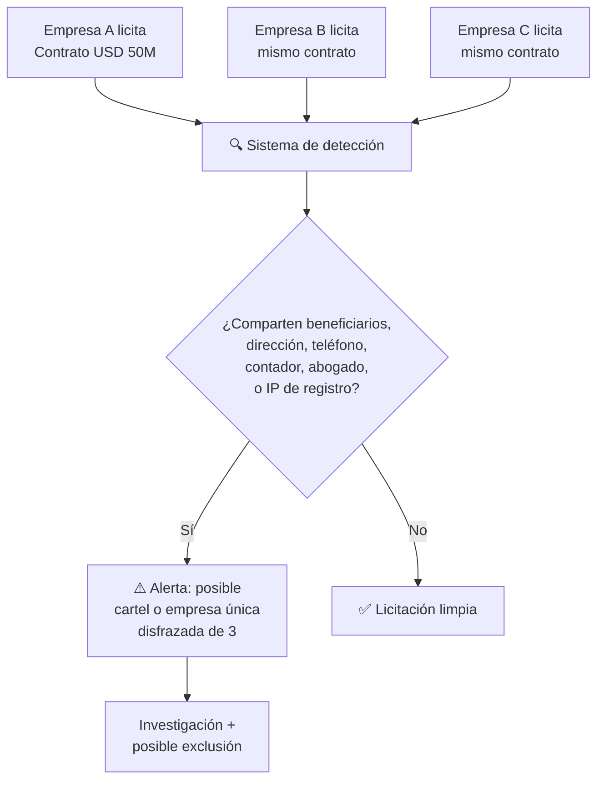

# Governance: Anti-Fragile System Design

> Corruption and instability are not risks to the plan. They are the operating environment. You design the system to function within it.

## 3 Proven Political Stability Mechanisms

### 1. The Fund as Insurance (Alaska Model)
If 40 million people receive dividends, any politician who touches the fund faces the entire country. No Alaska governor has touched the [PFD since 1982](https://pfd.alaska.gov/).

### 2. Buy, Don't Expropriate (Botswana Model)
[Khama bought 50% of De Beers](https://www.palladiummag.com/2019/05/09/what-botswana-can-teach-us-about-political-stability/) instead of expropriating. Oil majors are partners, not enemies.

### 3. Constitutionally Protected Rules (Chile Model)
[CORFO survived 7 governments](https://startupchile.org/en/) because fiscal rules are constitutional. Modification requires 2/3 + referendum.

## Anti-Corruption: Design That Eliminates Opportunities

[Carnegie Endowment (2024)](https://carnegieendowment.org/research/2024/06/sovereign-wealth-funds-corruption-illicit-finance-governance-risks?lang=en): voluntary transparency does not work.

| Model | Country | Result |
|-------|---------|--------|
| Full digital government | [Estonia](https://e-estonia.com/) | 2% GDP savings; #1 UN e-government 2024 |
| Total police purge | Georgia (2004) | Corruption from ~80% to ~5% in 2 years |
| Independent agency | [Singapore CPIB](https://www.cpib.gov.sg/) | Top 5 global anti-corruption |
| Public blockchain | Estonia | 100% traceability |
| Competitive salaries + harsh penalties | Singapore | Virtually zero corruption |

## Day 1 Protocol (First 72 Hours)

- **Hour 0:** Full publication of all contracts
- **Hour 1:** International escrow accounts (JPM, HSBC)
- **Hour 2:** Anonymous whistleblower platform (10–30% reward, [SEC model](https://www.sec.gov/whistleblower))
- **Hour 3:** National Fund Prosecutor (10-year mandate, irremovable, CPIB model)
- **Hour 4:** Forensic audit of PDVSA

## Shell Company Protection

:::danger Context: the favorite mechanism of Venezuelan corruption
Between 2000-2025, thousands of "briefcase companies" — entities with no office, no employees, no track record — received public contracts worth billions of dollars. The mechanism: a government official creates or connects with a shell company, awards it a contract, collects a 30-50% advance, and the company disappears. This was the primary channel for [FONDEN (USD 150B+ diverted)](https://transparenciave.org/), CADIVI, PDVAL, and hundreds of public entities. **If the plan does not specifically block this mechanism, everything else is just paper.**
:::

### Mandatory Beneficial Ownership Registry

Every company that contracts with the State, operates in SEEZs, receives funds from Venezuela Emprende, or participates in concessions must register:

| Data | Requirement | Verification |
|------|-------------|-------------|
| **Beneficial owners** (natural persons) | Declare every person with >5% direct or indirect ownership | Cross-reference with [international registries](https://www.openownership.org/) + OFAC SDN List |
| **Complete corporate structure** | Organizational charts down to the final natural person — no opaque offshore entities | Annual audit; falsification = criminal offense |
| **Politically exposed persons (PEPs)** | Declare kinship up to 2nd degree with public officials | National database + [Dow Jones Risk](https://www.dowjones.com/professional/risk/) |
| **Previous contract history** | Record of all public contracts from the last 10 years | Verify compliance in national registry |

**Reference:** [UK Persons of Significant Control Register](https://www.gov.uk/government/publications/psc-register-guidance) — mandatory since 2016. [EU Anti-Money Laundering Directive 6](https://eur-lex.europa.eu/legal-content/EN/TXT/?uri=celex%3A32024L1640) — public beneficial ownership registry.

### Contractor Pre-Qualification

No one bids without passing these filters:

| Requirement | Minimum Threshold | Exception |
|-------------|-------------------|-----------|
| **Seniority** | 2+ years of actual operation (not just business registration) | JVs with a qualified company as lead |
| **Minimum capital** | 10% of contract value in verifiable assets | Equivalent bank guarantee |
| **Actual staff** | Verifiable payroll ≥10% of what is required for execution | Hiring plan with timeline |
| **Physical office** | Verifiable address with random inspection | Certified coworking for startups |
| **References** | 3+ completed contracts of similar scale | Verifiable client reference letter |
| **Not on blacklist** | No active national or international debarment | — |
| **Sworn declaration** | No ties to adjudicating officials | Falsification = criminal offense + 20-year debarment |

### Debarment List

| Cause | Duration | Effect |
|-------|----------|--------|
| Failed contract (>30% of scope) | 5 years | Cannot bid or subcontract |
| Proven overbilling | 10 years + return of excess | Debarment + criminal prosecution |
| Shell / briefcase company | **20 years** + asset seizure + criminal prosecution | Debarment of beneficial owners in any new company |
| Unauthorized subcontracting (>50% of contract) | 5 years | Contract termination + penalty |
| Falsification of pre-qualification documents | **Permanent** | Criminal prosecution against signatories |

**The list is public, digital, and searchable by any citizen.** Model: [World Bank Debarment List](https://www.worldbank.org/en/projects-operations/procurement/debarred-firms) + [US SAM Exclusions](https://sam.gov/).

### Related Company Detection

**Red flags the system detects automatically:**
- Same tax address or phone number
- Same accountant, auditor, or lawyer
- Shared beneficial owners (direct or indirect)
- Business registration on the same date and at the same notary
- Same IP address accessing the procurement portal
- Collusive bidding patterns (suspiciously close or staggered prices)

**Reference:** [KONEPS (South Korea)](https://www.pps.go.kr/eng/) — e-procurement system that automatically detects collusion. Saved USD 8B in 10 years.

### Post-Award Execution Controls

The contract does not end when it is signed — that is when oversight begins:

| Control | Mechanism | Frequency |
|---------|-----------|-----------|
| **Physical progress verification** | Independent inspectors (random rotation) + drones + satellite imagery | Monthly |
| **Milestone-based disbursement** | No advance payment >15%. Payments only against verified deliverable | Per milestone |
| **Subcontractor audit** | Every subcontract >10% of value requires approval + same pre-qualification filters | Continuous |
| **Price monitoring** | Compare prices paid against market (reference price database) | Quarterly |
| **Project whistleblower** | Specific channel per project/contract. Workers can report anomalies | Permanent |
| **Public dashboard** | Citizens see: contract, contractor, progress, payments, assigned inspector | Real-time |

### Anti-Shell Company Protection by Plan Area

| Plan Area | Shell Company Risk | Specific Protection |
|-----------|-------------------|---------------------|
| **Concessions (PPP)** | Inexperienced company wins concession and subcontracts everything | Pre-qualification requires 3+ completed projects of similar scale |
| **Venezuela Emprende (grants)** | Fake startup to obtain USD 10-250K | Disbursement in 3 tranches against milestones; accelerator audit |
| **SEEZs (0% tax)** | Shell company registers fictitious revenue | Verifiable physical operation; minimum payroll; random annual audit |
| **Oil forward contracts** | Phantom intermediary takes commission | Verified direct counterparties; no unregistered brokers |
| **Sovereign Fund (vendors)** | Financial services provider charging excessive fees | Public fee benchmark; minimum 3 quotes; independent compensation committee |
| **Mining (formalization)** | Legal front for illegal mining | Blockchain origin traceability + on-site inspection |
| **Healthcare (equipment/supplies)** | Billing for equipment that never arrives or does not work | Destination verification + 2-year warranty + penalty |
| **Education (services)** | Ghost certifications, schools that do not operate | Digital attendance verification + measurable outcomes (grades, employment) |
| **Social housing** | Construction company collects advance and abandons project | Maximum 15% advance + performance bond + on-site inspector |
| **Diaspora Pre-Seed** | Fake organization captures investments | Centralized platform with KYC; fund usage audit |

---

## Penalties

| Crime | Sentence | Political Disqualification | Intergenerational Asset Seizure |
|-------|----------|----------------------------|--------------------------------|
| Corruption with sovereign funds | 20–30 years without benefits | **Permanent** | Children, grandchildren, great-grandchildren + nominees + associates under investigation (50 years) |
| Bribery of public official | 15–25 years | **Permanent** | Children, grandchildren + linked persons (30 years) |
| Data manipulation | 10–20 years | **25 years** | Convicted individual + direct relatives (20 years) |
| Obstruction of audit | 5–10 years | **15 years** | Convicted individual (10 years) |
| **Shell / briefcase company / ghost contract** | **15–25 years** | **Permanent** | **Beneficial owners + relatives + nominees (50 years)** |
| **Bid rigging** | **10–20 years** | **Permanent for companies; 25 years for individuals** | **Companies + beneficial owners + linked persons (30 years)** |
| **Pre-qualification falsification** | **10–15 years** | **Permanent + restitution** | **Signatories + intermediaries (20 years)** |

:::info Extended asset tracing
Asset seizure is not limited to the convicted individual. It extends to **relatives** (children, grandchildren, great-grandchildren), **nominees**, and **linked persons under investigation** (associates, partners, front persons). The burden of proof is reversed: anyone possessing assets linked to a convicted individual must demonstrate lawful origin. Model: [Colombia Asset Forfeiture Law](https://www.funcionpublica.gov.co/) + [UK Unexplained Wealth Orders](https://www.legislation.gov.uk/ukpga/2017/22/part/1). See full detail in [Transitional Justice](/04-gobernanza/justicia-transicional).
:::
