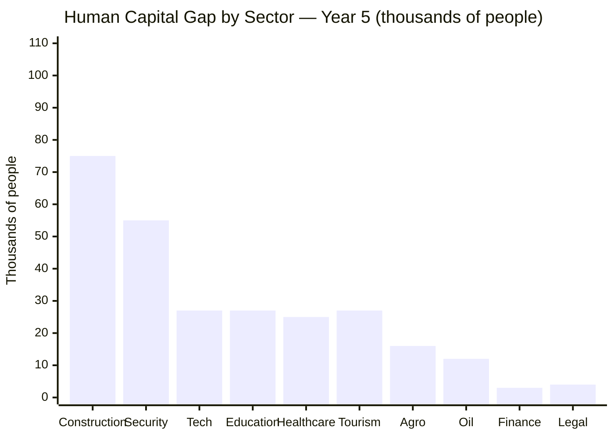
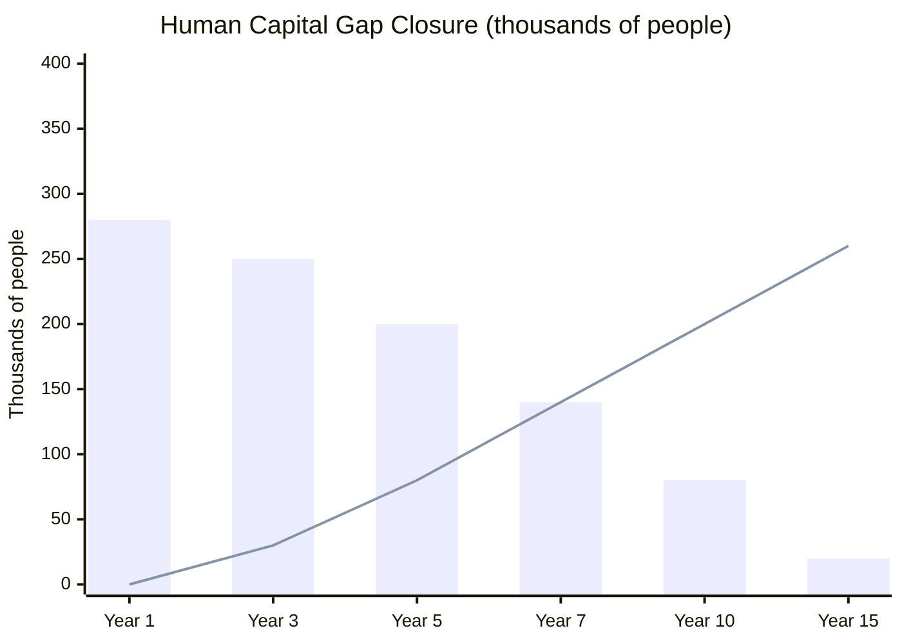
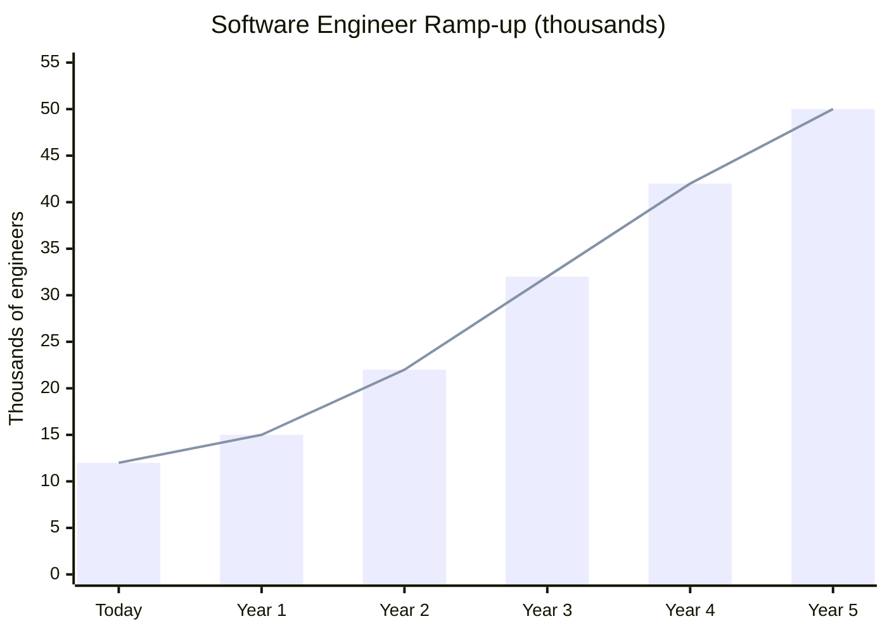

# Human Capital: The Invisible Bottleneck

> The plan requires USD 550-750B in investment and 10 economic engines running. Who's going to operate them? Venezuela lost 7.9 M people — many of the most qualified.

:::danger The gap
You can't rehabilitate refineries without petroleum engineers. You can't run data centers without programmers. You can't reform the State without lawyers and economists. You can't attract tourists without hoteliers. The human capital gap is the most underestimated bottleneck in the entire plan.
:::

---

## The Gap Quantified

| Sector | Demand (year 5) | Est. domestic supply | Diaspora available | Gap | Source |
|--------|-----------------|----------------------|--------------------|---------|----|
| Petroleum engineering | 25,000-35,000 | 5,000-8,000 | 8,000-12,000 | **10,000-15,000** | [PDVSA had 45,000 qualified employees in 2002; production collapsed after layoffs](https://www.reuters.com/) |
| Technology/Software | 50,000-80,000 | 10,000-15,000 | 15,000-25,000 | **15,000-40,000** | [Requires research] |
| Healthcare (doctors + nurses) | 80,000-100,000 | 30,000-40,000 | 20,000-30,000 | **20,000-30,000** | [HRW 2023](https://www.hrw.org/): Venezuela lost ~40% of medical staff |
| Education | 100,000-120,000 | 60,000-70,000 | 10,000-15,000 | **20,000-35,000** | [ENCOVI/UCAB 2023](https://www.proyectoencovi.com/) |
| Construction/Infrastructure | 200,000-300,000 | 100,000-150,000 | 30,000-50,000 | **50,000-100,000** | [Requires research] |
| Finance/Banking | 15,000-20,000 | 5,000-8,000 | 5,000-10,000 | **2,000-5,000** | [Requires research] |
| Technical agriculture | 30,000-50,000 | 15,000-20,000 | 5,000-8,000 | **10,000-22,000** | [FAO Venezuela](https://www.fao.org/) |
| Tourism/Hospitality | 40,000-60,000 | 10,000-15,000 | 5,000-10,000 | **20,000-35,000** | [Requires research] |
| Security/Police | 80,000-100,000 | 30,000 (qualified) | 3,000-5,000 | **45,000-65,000** | Georgia model: new police force from scratch |
| Legal/Judicial | 10,000-15,000 | 3,000-5,000 | 3,000-5,000 | **3,000-5,000** | [Requires research] |
| **TOTAL** | **630,000-880,000** | **268,000-356,000** | **104,000-170,000** | **~200,000-350,000** | |

---

## International Comparisons

| Country | Situation | Solution | Result | Source |
|---------|-----------|----------|--------|--------|
| **South Korea** (1960s) | Agricultural country, 40% illiteracy | Massive education investment: 20% of budget for 20 years | From USD 80 per capita (1960) to USD 35,000 (2024) | [World Bank](https://data.worldbank.org/country/korea-rep) |
| **Singapore** (1965) | No resources, poorly skilled population | Bilingual education + foreign expertise + competitive salaries | Global financial and tech hub in 30 years | [Lee Kuan Yew, From Third World to First](https://www.worldscientific.com/) |
| **United Arab Emirates** (1970s) | Few qualified nationals | 85% of workforce is foreign; imported expertise | Successful diversification in 40 years | [World Bank UAE](https://data.worldbank.org/country/united-arab-emirates) |
| **Georgia** (2004) | Collapsed state, corrupt police | Fired 85% of police, rehired with new training + 10x salaries | Functional police force in 2 years | [Princeton Innovations for Successful Societies](https://successfulsocieties.princeton.edu/) |
| **India** (1990s-2010s) | Massive brain drain (IIT → Silicon Valley) | Didn't block emigration; created conditions for return (tech sector, salaries) | Reverse brain drain: millions returned to create startups | [NASSCOM](https://nasscom.in/) |

---

## 3 Solution Channels

### Channel 1: Diaspora (20-30% of the gap)

The [7.9 M Venezuelan diaspora](https://www.unhcr.org/) is the most valuable and underutilized human asset:

| Program | Mechanism | Goal (year 5) | Cost |
|---------|-----------|---------------|------|
| **"Come Back and Build"** | Fast-track repatriation: flight + temporary housing for 6 months + guaranteed employment on a plan project | 50,000-80,000 returnees/year | USD 200-400 M/year |
| **Remote transfer** | Consulting, mentoring, and training from abroad for those who don't return | 20,000 remote consultants | USD 50-100 M/year |
| **Degree recognition** | Automatic validation of degrees obtained abroad | — | USD 5-10 M (digital platform) |
| **Tax incentives** | 5 years income tax-free for returnees working in priority sectors | — | Fiscal cost absorbed by productivity |

**Precedent:** [Ireland post-2000](https://www.cso.ie/) — reverse brain drain turned Ireland into Europe's tech hub; 500K returnees in 15 years.

### Channel 2: Internal Reskilling (50-60% of the gap, 5-15 year timeline)

The [32 M who stayed](/03-ciudadanos/los-que-se-quedaron) are the foundation. But the education system collapsed: Venezuela dropped from ~95% school enrollment to ~70% ([ENCOVI/UCAB 2023](https://www.proyectoencovi.com/)).

| Program | Model | Goal | Timeline | Cost |
|---------|-------|------|----------|------|
| **Technical bootcamps** (6-12 months) | Singapore SkillsFuture + Colombia SENA | 100,000 graduates/year in tech, construction, healthcare | Years 1-5 | USD 500 M/year |
| **Education reform** (K-12 + university) | Estonia (PISA top 5 Europe) + South Korea | Competitive education system in 10-15 years | Years 1-15 | 4-5% GDP/year |
| **Dual learning** (work + study) | Germany Ausbildung | 50,000 apprentices/year in industry | Years 3-10 | USD 200 M/year (shared with companies) |
| **International certifications** | AWS, Google, Cisco, PMP, CFA, etc. | 200,000 certified in 5 years | Years 1-5 | USD 100-200 M |

### Channel 3: Foreign Expertise (10-20% of the gap, years 1-5)

To close the immediate gap while locals are being trained:

| Program | Model | Sectors | Scale | Cost |
|---------|-------|---------|-------|------|
| **Technical advisors** | UAE: Western advisors in oil, finance, government | Oil, finance, legal, government | 5,000-10,000 experts | USD 500M-1B/year |
| **Industrial partnerships** | Singapore EDB: global companies operate with mandatory knowledge transfer | Tech, oil, mining | 50-100 partnerships | Tax incentives |
| **Fast-track immigration** | UAE Golden Visa + Singapore Employment Pass | All priority sectors | 20,000-50,000 visas/year | USD 10-20 M (administration) |
| **International university campuses** | UAE: NYU, Sorbonne campuses; Qatar: Education City | Higher education | 5-10 satellite campuses | PPP (private investment) |

---

## Projection: Closing the Gap Over 15 Years

| Channel | Year 5 contribution | Year 10 contribution | Year 15 contribution |
|---------|---------------------|----------------------|----------------------|
| Returned diaspora | 50,000-80,000 | 100,000-150,000 | 150,000-200,000 |
| Internal reskilling | 30,000-50,000 | 100,000-200,000 | 300,000-400,000 |
| Foreign expertise | 15,000-30,000 | 10,000-20,000 | 5,000-10,000 (transferred to locals) |
| **Total** | **95,000-160,000** | **210,000-370,000** | **455,000-610,000** |

---

## Human Capital Investment

| Component | Total investment (15 years) | % of plan |
|-----------|---------------------------|-----------|
| Education (4-5% GDP/year) | USD 80-120B | ~15% |
| Reskilling and bootcamp programs | USD 10-15B | ~2% |
| Diaspora return incentives | USD 5-8B | ~1% |
| Foreign expertise (years 1-5) | USD 3-5B | ~0.5% |
| **TOTAL** | **USD 98-148B** | **~18%** |

:::tip The most profitable investment
South Korea invested ~20% of its budget in education for 20 years. The return: from agricultural country to the world's 12th largest economy. Every dollar invested in human capital multiplies the return of every other engine in the plan.
:::

---

## 50,000 Software Engineers in 5 Years Program

:::info Why 50,000
Tech Giants need **10,000+ engineers available in the area** to invest (requirement #5 of the 8 non-negotiables). LATAM unicorns say an ecosystem needs CTOs, not just ideas. Spotify (Daniel Ek) wants a remote development hub if there's talent + English + internet. The goal: **50,000 bilingual software engineers in 5 years**.
:::

### The current gap

| Indicator | Venezuela today | Year 5 goal | Reference |
|-----------|----------------|------------|-----------|
| Software engineers | ~10,000-15,000 (estimate) | **50,000** | [Requires research] |
| CS graduates/year | ~2,000-3,000 | 10,000+ | [Requires research] |
| Professional English (B2+) | ~15-20% of engineers | 80%+ | [EF EPI 2024](https://www.ef.com/epi/) |
| Average dev salary | USD 300-800/month | USD 1,500-3,000/month | [Requires research] |
| Developers per 1,000 pop. | ~0.3 | 1.25 (Colombia level) | [GitHub Octoverse](https://github.blog/news-insights/octoverse/) |

### 5 channels to reach 50,000

| Channel | Mechanism | Year 5 contribution | Cost | Model |
|---------|-----------|---------------------|------|-------|
| **Intensive bootcamps** (6-12 months) | Holberton, Platzi, 4Geeks, Microverse — physical campuses in 5 cities + online | 15,000-20,000 | USD 200M/year | [42 School](https://42.fr/) (free, peer-to-peer) |
| **Professional reskilling** (3-6 months) | Engineers from other fields (petroleum, civil, mechanical) → software | 8,000-12,000 | USD 100M/year | [Singapore SkillsFuture](https://www.skillsfuture.gov.sg/) |
| **Reformed universities** (4-5 years) | Updated curriculum, partnerships with Stanford/MIT/Tecnologico de Monterrey online | 5,000-8,000 | Included in education budget | [MIT OpenCourseWare](https://ocw.mit.edu/) |
| **Returned diaspora** (immediate) | 5-year tax incentives for devs who return + mentor | 8,000-12,000 | USD 50M/year (incentives) | [India reverse brain drain](https://nasscom.in/) |
| **International certifications** | AWS, Google Cloud, Azure, Cisco, Meta — subsidized vouchers | 10,000-15,000 certs | USD 30M/year | Colombia [MinTIC](https://www.mintic.gov.co/) program |

### Key partnerships

| Partner | What they bring | In exchange for | Precedent |
|---------|----------------|-----------------|-----------|
| **Platzi** | Platform + content in Spanish | Access to 40M market | Already operates in LATAM, 5M+ students |
| **Globant** | Mentors + employment pipeline | Talent at USD 1,500/month (vs. USD 5,000 in Argentina) | [Globant in Colombia](https://www.globant.com/) |
| **42 School** | Peer-to-peer model without professors | Physical campus + government pays operations | Operates in 30+ countries |
| **Google/Microsoft** | Certifications + cloud credits | Data center investment pipeline | [Google Career Certificates](https://grow.google/certificates/) |
| **Y Combinator** | Free Startup School + alumni network | Deal flow of Venezuelan startups | [YC Startup School](https://www.startupschool.org/) |

### Annual KPIs

| KPI | Year 1 | Year 2 | Year 3 | Year 4 | Year 5 |
|-----|--------|--------|--------|--------|--------|
| Active software engineers | 15,000 | 22,000 | 32,000 | 42,000 | **50,000** |
| Bootcamp graduates/year | 3,000 | 6,000 | 10,000 | 12,000 | 15,000 |
| English level B2+ (%) | 20% | 35% | 50% | 65% | **80%** |
| Average dev salary (USD/month) | 500 | 800 | 1,200 | 1,800 | 2,500 |
| Tech startups founded/year | 50 | 150 | 400 | 800 | 1,500 |
| Remote employees for global companies | 1,000 | 3,000 | 8,000 | 15,000 | 25,000 |

### Total investment: 50K Engineers Program

| Component | Annual investment | 5 years | % of plan |
|-----------|------------------|---------|-----------|
| Bootcamps + infrastructure | USD 200M | USD 1,000M | 0.2% |
| Professional reskilling | USD 100M | USD 500M | 0.1% |
| International certifications | USD 30M | USD 150M | <0.1% |
| Diaspora tech return incentives | USD 50M | USD 250M | <0.1% |
| Intensive English | USD 40M | USD 200M | <0.1% |
| **TOTAL** | **USD 420M/year** | **USD 2,100M** | **~0.4%** |

:::tip Program ROI
A software engineer earning USD 2,500/month generates USD 30,000/year in salary (vs. USD 3,600 current average). 50,000 engineers = **USD 1,500M/year in tech payroll** + economic multiplier of 2-3x. The program pays for itself in 2-3 years. Additionally, every engineer working remotely for global companies brings fresh foreign currency into the country without needing oil.
:::

---

**Sources:** [ENCOVI/UCAB 2023](https://www.proyectoencovi.com/) | [UNHCR](https://www.unhcr.org/) | [ILO](https://www.ilo.org/) | [World Bank Human Capital Project](https://www.worldbank.org/en/publication/human-capital) | [Singapore SkillsFuture](https://www.skillsfuture.gov.sg/) | [GitHub Octoverse](https://github.blog/news-insights/octoverse/) | [42 School](https://42.fr/)
