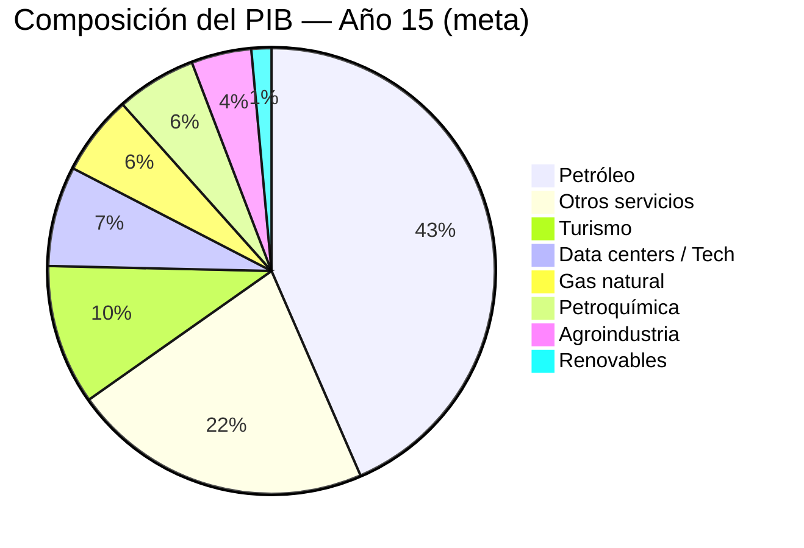
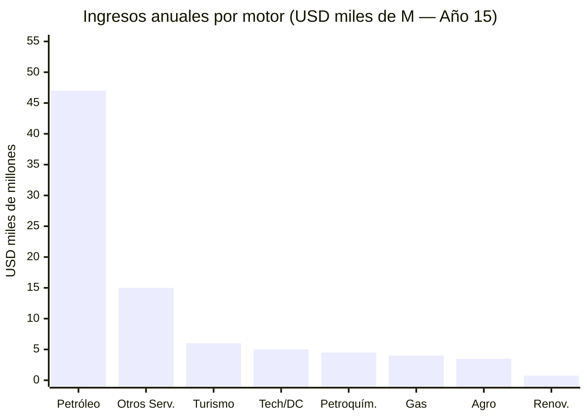
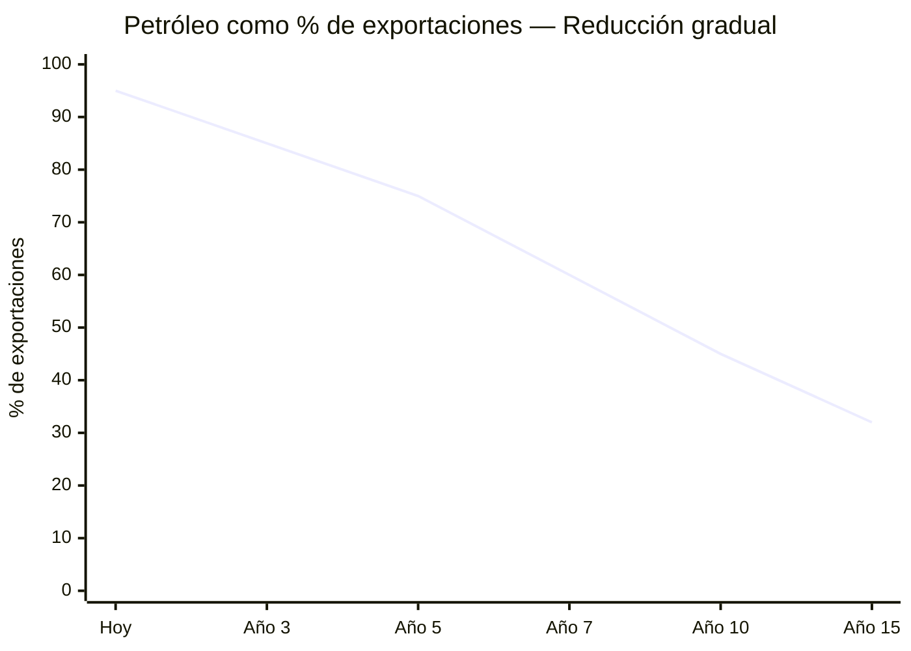

# The Six Engines of Diversification

> Oil is the fuel. These are the engines that burn it.

## 1. Data Centers and AI

LATAM market: [USD 7,160 M (2024) → USD 14,300 M (2030)](https://www.businesswire.com/news/home/20250505397648/en/), CAGR 12.22%. Venezuela: cheap hydro energy ([Guri 10,200 MW](https://www.power-technology.com/projects/gurihydroelectric/)) as competitive advantage.

### BigTech Investments in LATAM (reference)

| Company | Country | Investment | Year | Source |
|---------|---------|-----------|------|--------|
| Amazon (AWS) | Chile | USD 4,000 M | 2024 | [Mordor Intelligence](https://www.mordorintelligence.com/industry-reports/south-america-data-center-market) |
| Microsoft | Brazil | USD 2,700 M | 2025 | [BusinessWire](https://www.businesswire.com/news/home/20250505397648/en/) |
| Google | Chile/Argentina | Humboldt Cable + DC | 2024-2025 | Google Press |
| Oracle | Mexico | USD 1,500 M+ | 2024 | Oracle Press |

**Venezuela's proposal:** Guayana Digital Zone (Ciudad Guayana, adjacent to Guri). Electricity at marginal cost. Goal: **5-10% of the LATAM data center market by 2035** = USD 700-1,400 M/year.

---

## 2. Natural Gas

:::info Overlooked resource
Venezuela has the **7th largest natural gas reserves in the world**: [5,500 BCM](https://www.congress.gov/crs-product/IF12448) (~195 TCF). Current production: ~30 BCM/year, **100% domestic consumption, zero exports**. [~80% of gas is associated](https://www.energypolicy.columbia.edu/more-efficient-use-of-venezuelas-natural-gas-could-strengthen-the-regions-energy-security-and-the-countrys-electricity-sector/) (byproduct of oil).
:::

### Opportunity: The Trinidad and Tobago Model

[Trinidad and Tobago](https://www.congress.gov/crs-product/IF12448) has liquefaction (LNG) capacity of 16 BCM/year with one train currently offline due to gas shortages. The [Dragon Field project](https://venezuelanalysis.com/news/venezuela-signs-30-year-alliance-with-trinidad-to-develop-dragon-gas-field/) — a 30-year alliance — would build a 17 km pipeline from the Dragon field (Venezuela) to Hibiscus (Trinidad) to produce LNG.

| Scenario | Additional production | Estimated revenue | Source |
|----------|----------------------|-------------------|--------|
| Dragon Field (phase 1) | 185 MMCF/day | USD 300-500 M/year | [Venezuelanalysis](https://venezuelanalysis.com/news/venezuela-signs-30-year-alliance-with-trinidad-to-develop-dragon-gas-field/) |
| Export to Colombia | 0.5 BCF/day | [USD 700-800 M/year](https://rbac.com/beyond-oil-could-venezuela-be-a-natural-gas-powerhouse/) | RBAC Inc. |
| Expanded LNG (reactivated trains) | 6-10 BCM/year | USD 2,000-4,000 M/year | [J.P. Morgan](https://www.jpmorgan.com/insights/global-research/commodities/venezuela-oil-lng) |

**Total natural gas potential: USD 3,000-5,000 M/year** — a financial engine comparable to oil at partial scale.

---

## 3. Tourism

Angel Falls, Los Roques, Canaima (UNESCO), Margarita, Mochima, Gran Sabana, Orinoco Delta.

| Competitor country | Tourists/year | Revenue | Source |
|--------------------|--------------|---------|--------|
| Dominican Republic | 10+ M | USD 9,000+ M | UNWTO |
| Costa Rica | 3.2 M | USD 4,000+ M | UNWTO |
| Colombia | 6+ M | USD 6,000+ M | MinComercio |
| **Venezuela (goal)** | **5-10 M** | **USD 4,000-8,000 M** | **Year 15** |

**Requirements:** Security (see [Physical Security](/04-gobernanza/seguridad-fisica)), airports (see [Infrastructure](/06-realidad/infraestructura-basica)), country branding, fast-track visa, Margarita as digital nomad zone.

**Tourism investment:** USD 3,000-5,000 M over 10 years (airports, hotels, marketing, training).

---

## 4. Renewable Energy

[74% of electricity already renewable](https://www.energypolicy.columbia.edu/more-efficient-use-of-venezuelas-natural-gas-could-strengthen-the-regions-energy-security-and-the-countrys-electricity-sector/) (hydroelectric). Massive expansion potential in solar and wind.

| Source | Potential | Location | Status |
|--------|-----------|----------|--------|
| Hydroelectric | [18,000 MW (Caroni Cascade)](https://news.mongabay.com/2023/08/hydropower-in-the-pan-amazon-the-guri-complex-and-the-caroni-cascade/) | Bolivar | Guri operating at reduced capacity |
| Solar | High irradiation (>5 kWh/m2/day) | Falcon, Zulia, Lara | No development |
| Wind | Potential in Paraguana | Falcon | No development |

**Goal:** 74% → 85%+ renewable with solar/wind. Export electricity to Colombia and Brazil (existing interconnection).

**Renewables investment:** USD 3,000-5,000 M over 10 years.

---

## 5. Petrochemicals

Venezuela has refineries (Paraguana, Amuay, Cardon — currently operating at <20% capacity) and abundant oil feedstock. Petrochemicals convert commodities into high-value-added products.

| Product | Target market | Potential |
|---------|--------------|-----------|
| Fertilizers (urea, ammonia) | LATAM + Caribbean | High — growing agricultural demand |
| Plastics and resins | Domestic + export | High — abundant raw material |
| Methanol / Ethanol | Global chemical industry | Medium |
| Asphalt | LATAM infrastructure | High — heavy crude is ideal |

**Petrochemical investment:** USD 5,000-10,000 M over 10 years (refinery rehabilitation + new plants).

---

## 6. Agroindustry

Llanos: underutilized fertile lands + Orinoco water. Venezuela imports >70% of food despite its agricultural potential.

| Sector | Potential | Market | Goal |
|--------|-----------|--------|------|
| Cacao | Top 10 worldwide in quality | Global premium | "Venezuelan cacao" brand |
| Coffee | Export tradition | Specialty coffee | Recover position |
| Shrimp/aquaculture | Extensive Caribbean coast | Caribbean + U.S. | Ecuador model (1/4 of world consumption) |
| Tropical fruits | Ideal climate | Caribbean + Europe | Processing + export |
| Corn, rice, beef | Llanos | Self-sufficiency | Food sovereignty in 10 years |

**Goal:** Food sovereignty in 10 years + agroindustrial export to the Caribbean. See [Infrastructure](/06-realidad/infraestructura-basica) for detailed agricultural plan.

---

## Summary: GDP Contribution (Year 15 Goal)

| Engine | Est. Annual Revenue | % GDP (goal) |
|--------|-------------------|-------------|
| Oil | USD 40,000-55,000 M | 25-35% |
| Natural gas | USD 3,000-5,000 M | 3-5% |
| Data centers / Tech | USD 3,000-7,000 M | 3-5% |
| Tourism | USD 4,000-8,000 M | 5-8% |
| Petrochemicals | USD 3,000-6,000 M | 3-5% |
| Agroindustry | USD 2,000-5,000 M | 2-4% |
| Renewables (export) | USD 500-1,000 M | <1% |
| Other services | USD 10,000-20,000 M | 10-15% |

### Transition: From Petrostate to Diversified Economy

:::tip Diversification goal
Oil drops from **95% of exports today to <35%**. The 6 non-oil engines generate >USD 25,000 M/year combined. This is the difference between a fragile petro-economy and a diversified economy.
:::
