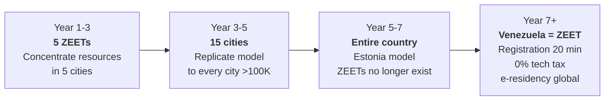

# From 5 Special Zones to 1 Startup-Friendly Country

:::caution Velez's critique (Nubank)
"5 ZEETs sounds like free trade zones from the '90s. What works today is an ENTIRE COUNTRY that's startup-friendly. Estonia doesn't have special zones — the WHOLE country is a special zone."

**The critique is correct.** Special zones create two Venezuelas: one with 0% tax and fiber, another with bureaucracy and blackouts. The destination is to make **the entire country** a special zone. But you can't do that in year 1 when 40% don't have stable internet.
:::

## Strategy: ZEETs → Full Country

| Phase | Scope | What happens | Timeline |
|-------|-------|-------------|----------|
| **Phase 1: Concentrate** | 5 ZEETs (pilot cities) | Infrastructure, security, fiber, Starlink concentrated. Prove it works | Years 1-3 |
| **Phase 2: Expand** | 15 cities | Replicate the ZEET model to every city >100K inhabitants. Tax benefits extend | Years 3-5 |
| **Phase 3: Nationalize** | **Entire country** | 0% tech tax, registration in 20 min, fast-track visa, digital identity — for ALL of Venezuela. ZEETs cease to exist because they're no longer needed | Years 5-7 |

**Year 7 goal: ZEETs disappear because all of Venezuela is a ZEET.**

## Phase 1: The 5 Pilot Cities (Years 1-3)

| Zone | Location | Focus | Natural advantage |
|------|----------|-------|-------------------|
| Caracas Tech District | Caracas | AI, Fintech, SaaS | Capital + talent + existing connectivity |
| Guayana Digital | Ciudad Guayana | Data centers, cloud, AI training | Guri 10,200 MW — cheapest energy in the hemisphere |
| Maracaibo Energy Tech | Maracaibo | EnergyTech, IoT, green H2 | Oil fields + sun for solar |
| Valencia Innovation Hub | Valencia | Hardware, robotics, manufacturing | Existing industrial infrastructure |
| Margarita Digital Nomad | Isla de Margarita | Remote work, gaming, crypto | Caribbean + existing free trade zone |

### Infrastructure per ZEET (year 1)

| Component | Solution | Cost per ZEET | Total 5 ZEETs |
|-----------|----------|---------------|---------------|
| **Internet** | Starlink Business (350+ Mbps) + local fiber | USD 1-3M | USD 5-15M |
| **Coworking** | 100-500 seats, 24/7, air conditioning | USD 2-5M | USD 10-25M |
| **Energy** | Priority connection + solar backup + batteries | USD 3-5M | USD 15-25M |
| **Security** | 24/7 secure zone, cameras, reformed police | USD 1-2M | USD 5-10M |
| **Total** | | | **USD 35-75M** |

:::info USD 35-75M to launch 5 tech hubs
That's **0.01% of the total plan**. If each hub produces 1 successful startup that employs 100 people at USD 1,500/month, the ROI is immediate. Spotify didn't need a free trade zone in Sweden — but Sweden already had internet, security, and a digital state. Venezuela needs to concentrate those first.
:::

## Phase 3: All of Venezuela = Estonia (Year 5-7)

When the 5 ZEETs prove the model works, benefits expand to the entire national territory:

| Benefit | In ZEET (year 1) | Nationwide (year 5-7) | Reference |
|---------|------------------|-----------------------|-----------|
| **0% tech tax** for 10 years | Only in 5 ZEETs | **Nationwide** — any tech startup, in any city | Estonia: 0% CIT on reinvested profits |
| **0% VAT on exported digital services** | ZEETs only | **Nationwide** | Ireland |
| **Company registration in 20 minutes** | Digital only in ZEETs | **Nationwide** — 100% online, from your phone | [Estonia e-Residency](https://e-estonia.com/): 20 min |
| **Fast-track tech visa** (30 days) | ZEETs only | **Nationwide** — any foreign tech worker | [Start-Up Chile](https://startupchile.org/en/) |
| **R&D tax credit 35%** | ZEETs only | **Nationwide** | [CORFO Chile](https://www.corfo.cl): 35% |
| **Global e-Residency** | Doesn't exist | **Anyone in the world** can open a Venezuelan company online without setting foot in the country | [Estonia e-Residency](https://e-residency.gov.ee/): 100K+ e-residents |

### Venezuelan e-Residency (year 5+)

Estonia has **100,000+ e-residents** from 170 countries who open Estonian companies without living there. They generate ~EUR 100M+ in economic activity ([e-Residency](https://e-residency.gov.ee/)).

Venezuela with e-Residency + dollarization + 0% tech tax + cheap energy could attract:

| Segment | Why they'd come | Estimate |
|---------|----------------|----------|
| Digital nomads | USD 0 tax + Caribbean + low cost of living | 50,000-100,000 e-residents (year 7) |
| LATAM startups | Incorporation in 20 min + 0% CIT + access to 40M market | 5,000-10,000 companies |
| Global freelancers | Legal invoicing without bureaucracy + USD accounts | 100,000+ |
| **Estimated revenue** | Registration fees + economic activity + local spending | **USD 500M-2B/year** [Requires research] |

:::tip The pitch for Velez
"We're not creating 5 free trade zones. We're creating 5 laboratories to test the model that then gets applied to the entire country. By year 7, the ZEETs disappear because they're no longer needed — all of Venezuela is Estonia with a beach, oil, and the cheapest energy in the hemisphere."
:::
