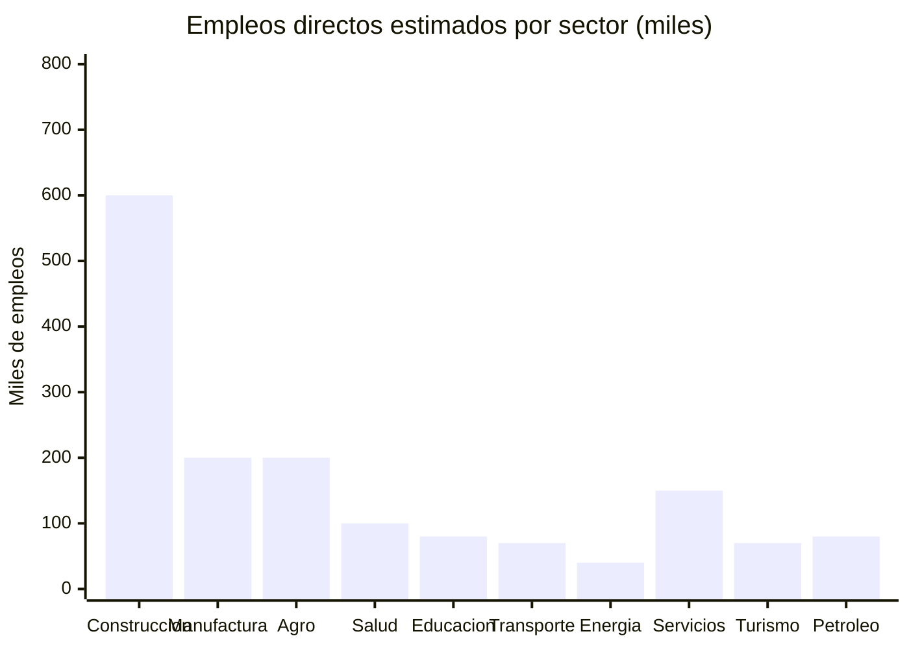
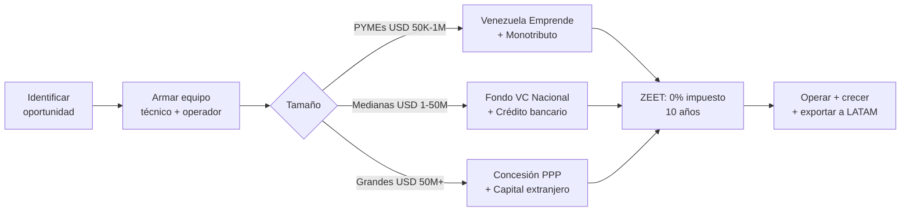

# Opportunities for Real Businesses: The Physical Country That Needs to Be Built

> Startups create apps. Real businesses build bridges, operate hospitals, manufacture blocks, repair turbines, process cacao, and move containers. Venezuela needs both — but physical businesses absorb 80% of the investment and generate 90% of employment.

:::info Why this document
The plan invests USD 550-750B over 15 years. Of that, USD 400-500B goes to physical businesses: construction companies, concession operators, manufacturers, distributors, service companies. This document maps those opportunities by sector, with market size, business model, and company profile.
:::

---

## 1. Construction and Engineering — USD 80-120B in Contracts

The plan needs to build **everything**: roads, hospitals, housing, water plants, ports, airports, transmission lines, data centers, schools, prisons, barracks, dams, solar plants.

### Opportunities by type of work

| Opportunity | Plan investment | Type of company | Est. direct jobs | Model/Reference |
|-------------|----------------|----------------|------------------|-----------------|
| **Social and middle-class housing** | USD 15-30B / 15 years | Medium-sized builders, prefab manufacturers | 200K-400K | Chile DS49: subsidy + private builder |
| **Roads and bridges** | USD 5-10B / 15 years | Heavy infrastructure builders | 50K-100K | Colombia 4G/5G: PPP concessions |
| **Ports (Puerto Cabello, La Guaira, Maracaibo)** | USD 2-4B / 10 years | Port operators + civil works | 15K-30K | DP World, APM Terminals as partners |
| **Airports** | USD 1-3B / 10 years | Airport concessionaires + builders | 10K-20K | Grupo Aeroportuario del Pacifico (Mexico) |
| **Rail network (Caracas-Valencia-Barquisimeto)** | USD 5-10B / 15 years | Heavy engineering consortium | 30K-60K | Medellin Metro as governance model |
| **Water and sanitation plants** | USD 5-9B / 7 years | Hydraulic engineering firms | 30K-50K | Bogota Aqueduct, Israel model |
| **Hospitals and health centers** | USD 3-5B / 10 years | Specialized healthcare builders | 20K-40K | Turnkey hospital + 20-year maintenance |
| **Schools and universities** | USD 2-4B / 10 years | Builders + furniture + equipment | 15K-30K | FISE Colombia (Social Infrastructure Fund) |
| **Electrical transmission lines** | USD 2-4B / 10 years | Electrical engineering firms | 10K-20K | ISA (Colombia), LATAM transmission company |
| **Solar and wind plants** | USD 3-8B / 15 years | Renewable energy developers | 15K-30K | Enel Green Power, Atlas Renewable Energy |
| **Data centers (ZEET Guayana)** | USD 2-5B / 10 years | Specialized builders + cooling | 5K-10K | Equinix, Digital Realty as partners |

**Total direct employment in construction:** 400K-800K jobs over 15 years.

:::tip The construction company Venezuela needs
No Venezuelan construction company of scale exists. Those that did went bankrupt or emigrated. **Opportunity:** found 10-20 medium-sized specialized builders (housing, heavy infrastructure, healthcare, energy) to compete for the USD 80-120B in contracts. With Venezuelan experience in the diaspora (thousands of engineers in Chile, Panama, Colombia) + Venezuela Emprende capital + guaranteed plan contracts = USD 100-500M companies in 5-10 years.
:::

---

## 2. Manufacturing and Industry — Produce What's Imported

Venezuela imports >70% of what it consumes. Every imported product is a local manufacturing opportunity with cheap energy and a captive market.

### Import substitution + export opportunities

| Opportunity | Domestic demand | Investment needed | Jobs | Competitive advantage |
|-------------|----------------|-------------------|------|-----------------------|
| **Blocks, cement, construction materials** | USD 2-4B/year (housing and construction boom) | USD 200-500M per plant | 20K-40K | Cheap energy + guaranteed 15-year demand |
| **Industrial furniture and carpentry** | USD 500M-1B/year (homes + offices + schools) | USD 50-200M | 15K-30K | Tropical woods + design + labor |
| **PVC pipes, plumbing fittings** | USD 300-600M/year (water and sanitation networks) | USD 100-300M | 5K-10K | Local petrochemicals as input |
| **Electrical cable and transformers** | USD 500M-1B/year (complete electrical grid) | USD 200-400M | 10K-20K | Local aluminum + copper |
| **Fertilizers and agrochemicals** | USD 300-500M/year | USD 500M-1B (petrochemical plant) | 5K-10K | Natural gas as raw material |
| **Processed foods** | USD 3-5B/year | USD 500M-2B in plants | 50K-100K | Local agricultural raw material |
| **Plastics and packaging** | USD 500M-1B/year | USD 200-500M | 10K-15K | Downstream petrochemicals |
| **Textiles and uniforms** | USD 300-600M/year (school, work, military uniforms) | USD 100-300M | 20K-40K | Labor + cotton |
| **Generic medicines** | USD 1-2B/year | USD 300-800M in labs | 10K-20K | [India model](https://www.ibef.org/industry/pharmaceutical-india): generics for LATAM |
| **Solar equipment assembly** | USD 200-500M/year | USD 100-300M | 5K-10K | ZEET + cheap energy + captive market |

**Goal:** Reduce imports from 70% to 40% in 10 years, freeing USD 5-10B/year in foreign currency.

---

## 3. Oil, Gas, and Mining — The Supplier Chain

The plan invests USD 183B in oil production (Rystad). Every barrel extracted requires services, equipment, logistics, and personnel that today are almost entirely imported.

### Oil chain opportunities

| Opportunity | Est. market | Type of company | Reference |
|-------------|-------------|----------------|-----------|
| **Well maintenance and workover** | USD 2-4B/year | Oilfield services company | Schlumberger, Halliburton (local version) |
| **Oil transportation and logistics** | USD 1-2B/year | Tanker truck fleet + barges | PDVSA currently does everything internally — concession it |
| **Field catering and hospitality** | USD 500M-1B/year | Industrial hospitality company | Compass Group, Sodexo (but Venezuelan) |
| **Valve and fittings manufacturing** | USD 300-600M/year | Specialized metalworking | Replace imports from U.S./China |
| **Inspection, non-destructive testing** | USD 200-400M/year | Technical inspection company | Bureau Veritas, SGS (national version) |
| **Directional drilling** | USD 1-2B/year | Specialized drilling company | Baker Hughes as technology partner |
| **Produced water treatment** | USD 300-600M/year | Environmental/engineering company | Veolia, Suez (license or JV) |
| **Industrial safety and HSE** | USD 200-400M/year | Consulting + PPE supplier | DuPont Safety, MSA as suppliers |

### Mining opportunities

| Opportunity | Est. market | Type of company |
|-------------|-------------|----------------|
| **Gold processing (refineries)** | USD 500M-1B/year | LBMA-certified refinery |
| **Iron/steel processing plant** | USD 1-3B (investment) | Modern steel mill (replace SIDOR) |
| **Bauxite/aluminum processing** | USD 500M-1B (investment) | Alumina plant (reactivate CVG/Alcasa) |
| **Mining explosives services** | USD 100-200M/year | Authorized manufacturer + supplier |
| **Mineral analysis laboratories** | USD 50-100M/year | Internationally certified lab |

---

## 4. Agroindustry and Food — From Importer to Exporter

Venezuela has Los Llanos (one of the most extensive fertile plains in South America), the Orinoco Delta for aquaculture, and premium cacao that is the world's best. It imports >70% of food.

### Agroindustrial opportunities

| Opportunity | Investment | Market | Jobs | Model |
|-------------|-----------|--------|------|-------|
| **Cacao processing plants** | USD 100-300M | Premium export USD 200-500M/year | 10K-20K | [Barry Callebaut](https://www.barry-callebaut.com/) + local cooperatives |
| **Premium coffee roasters** | USD 50-150M | Specialty export USD 100-300M/year | 5K-10K | Colombia FNC as country brand model |
| **Rice and corn processors** | USD 200-500M | Domestic market USD 1-2B/year | 15K-30K | Brazil EMBRAPA + private companies |
| **Shrimp farms (aquaculture)** | USD 300-600M | Export USD 500M-1B/year | 20K-40K | Ecuador: USD 7B/year in shrimp exports |
| **Cold storage and slaughterhouses** | USD 200-400M | Domestic market USD 500M-1B/year | 10K-20K | Uruguay: cold chain = exportable quality |
| **Dairy production** | USD 200-500M | Domestic market USD 500M-1B/year | 10K-20K | Alpina (Colombia), Gloria (Peru) |
| **Craft and industrial breweries** | USD 100-300M | Domestic market USD 300-600M/year | 5K-10K | AB InBev controls 80% today; room for competition |
| **Processed tropical fruits** | USD 100-300M | Export USD 200-500M/year | 10K-20K | Mangoes, guavas, papayas → juice, pulp, dried |
| **Palm oil and oilseeds** | USD 200-400M | Import substitution USD 300-500M/year | 8K-15K | Malaysia as reference, Venezuela has the climate |
| **Bakeries and prepared foods (at scale)** | USD 100-200M | Massive domestic market | 30K-50K | Bimbo (Mexico) started this way |

:::tip Cacao: the USD 1B opportunity
Venezuela produces [40% of the world's fine cacao](https://www.icco.org/). Today it exports raw beans at USD 3-5/kg. Processed as premium chocolate: USD 50-100/kg. **Company needed:** bean-to-bar processing plant + "Cacao de Venezuela" brand + origin certification + D2C and retail channel. Investment: USD 50-100M. Revenue potential: USD 300-500M/year. **Jobs:** 10K direct (producers + plant + marketing). [Tony's Chocolonely](https://tonyschocolonely.com/) (EUR 300M) and [Pacari](https://www.pacari.com/) (Ecuador) proved the model.
:::

---

## 5. Healthcare — Clinics, Labs, Pharmacies

The plan invests USD 15-25B in healthcare. Beyond tech, physical healthcare businesses are needed.

| Opportunity | Investment | Market | Jobs | Model |
|-------------|-----------|--------|------|-------|
| **Primary care clinic chain** | USD 200-500M | 32M patients with limited access | 20K-40K | Narayana Health (India): quality healthcare at low cost |
| **Networked clinical labs** | USD 100-300M | USD 500M-1B/year in testing | 5K-10K | SYNLAB (Europe): network of standardized labs |
| **Modern pharmacy chain** | USD 200-500M | USD 1-2B/year | 15K-30K | Farmatodo already exists; modernized competition |
| **Dialysis centers** | USD 100-200M | 30K+ renal patients without access | 3K-5K | DaVita/Fresenius as operating partner |
| **Basic medical device manufacturing** | USD 100-300M | Import substitution USD 300-500M/year | 5K-10K | Masks, syringes, sutures, disposables |
| **Rehabilitation centers** | USD 50-150M | Post-conflict: 100K+ people need rehabilitation | 3K-5K | Post-peace agreement Colombia as reference |
| **Ambulances as a service** | USD 50-100M | Nonexistent national coverage | 5K-10K | Fleet + dispatch center + paramedics |
| **Popular optometry and ophthalmology** | USD 50-100M | 40M people without access to eyeglasses | 3K-5K | Lenstec (India): lenses at USD 2 |
| **High-volume dental centers** | USD 50-150M | Decades of postponed dental care | 5K-10K | Aspen Dental (U.S.): franchise network |

**Reference case:** [Narayana Health (India)](https://www.narayanahealth.org/) — cardiac surgeries at USD 1,500 (vs. USD 100,000 in the U.S.). Model: volume + efficiency + quality. Venezuela needs exactly this.

---

## 6. Education — Schools, Academies, Institutes

Beyond EdTech, Venezuela needs physical educational infrastructure and operators.

| Opportunity | Investment | Market | Jobs | Model |
|-------------|-----------|--------|------|-------|
| **English academy network** | USD 50-200M | 30M+ need English; mandatory from grade 1 | 10K-20K (teachers + admin) | British Council + local franchises |
| **Affordable school chain** | USD 200-500M | 8M K-12 students | 30K-50K | Innova Schools (Peru): quality schools at USD 100-150/month |
| **Technical training centers** | USD 100-300M | 500K/year need certification | 10K-20K | SENAI (Brazil): world-class technical training |
| **Daycare and preschool** | USD 100-200M | Enabler of female employment | 15K-25K | KinderCare (U.S.) adapted |
| **Diverse language centers** | USD 30-80M | Portuguese, Mandarin, French for trade | 3K-5K | Partnerships with Goethe, Confucius, AF |
| **Modernized driving schools** | USD 20-50M | Millions without a valid license | 3K-5K | Simulators + fleet + digital certification |
| **Trade schools** | USD 50-150M | Plumbing, electrical, welding, HVAC, mechanics | 10K-20K | Mike Rowe Works (U.S.): dignifying the trades |

:::tip English academies: immediate business with massive impact
The plan makes English mandatory from grade 1. The education system doesn't have enough teachers. **Opportunity:** network of 500+ English academies (franchise model), with certified teachers as partner-operators who earn per student. At USD 30-50/month x 500K students = USD 180-300M/year. **Partners:** the 5,000+ English teachers in the country as franchisees. Scale: physical centers + complementary practice app.
:::

---

## 7. Transportation and Logistics — Moving 40 Million People and Goods

| Opportunity | Investment | Market | Jobs | Model |
|-------------|-----------|--------|------|-------|
| **Intercity bus company** | USD 100-300M | 30M+ without efficient intercity transport | 10K-20K | Pullman Bus (Chile), Cruz del Sur (Peru) |
| **Cargo truck fleet** | USD 200-500M | USD 2-5B/year in domestic freight | 20K-40K | Fragmented market → consolidate with modern fleet |
| **Railroad operator** | USD 50-200M (operations, not civil works) | Caracas-Valencia corridor (phase 1) | 5K-10K | Concession like Ferrovias (Portugal) |
| **Moving and storage company** | USD 20-50M | Returnees + new housing = massive demand | 3K-5K | PODS (U.S.): portable containers |
| **Courier and parcel delivery** | USD 50-150M | Nascent e-commerce needs logistics | 10K-20K | Mercado Envios (MELI), 99Minutos |
| **Heavy machinery repair shop** | USD 30-80M | Concession operators + mining + oil | 3K-5K | Caterpillar dealers as model |
| **Marina and nautical services** | USD 30-100M | Tourism + fishing + offshore oil | 2K-5K | 2,800 km of coast, nonexistent marinas |

---

## 8. Energy — Operating the Infrastructure

| Opportunity | Investment | Market | Jobs | Model |
|-------------|-----------|--------|------|-------|
| **Electrical maintenance company** | USD 50-200M | National transmission and distribution grid | 10K-20K | ISA (Colombia): grid maintenance |
| **Solar panel installer** | USD 20-100M | 8M+ households + businesses + industry | 10K-20K | SunRun (U.S.): install + finance |
| **Distributed generation company** | USD 100-300M | Micro-grids for off-grid communities | 3K-5K | Husk Power (India): rural micro-grids |
| **Gas station operator** | USD 100-300M | Reform the 1,600+ existing stations | 5K-10K | Concession + mini-markets + services |
| **Domestic gas distributor** | USD 50-150M | Substitute firewood in rural areas | 5K-8K | Brazil model: LPG last mile |
| **Energy efficiency company** | USD 30-80M | Audits + retrofitting for industry | 3K-5K | Schneider Electric as technology partner |

---

## 9. Professional Services — The Support Ecosystem

Every new company needs accountants, lawyers, insurers, bankers, consultants. The economic boom multiplies demand for professional services.

| Opportunity | Est. market | Jobs | Profile |
|-------------|-------------|------|---------|
| **Accounting and audit firms** | USD 300-600M/year | 10K-20K | New tax regime = everyone needs an accountant |
| **Specialized law firms** (corporate, ICSID, sanctions) | USD 200-400M/year | 5K-10K | Restructuring + foreign investment + OFAC |
| **Recruitment and headhunting firms** | USD 100-200M/year | 3K-5K | 500K+ vacancies/year from economic boom |
| **Insurance companies** | USD 1-3B/year | 10K-20K | Current penetration <1% vs. LATAM 3-5% |
| **Private security companies** | USD 500M-1B/year | 50K-100K | Transition: enormous demand for 5-10 years |
| **Real estate agencies and property management** | USD 300-600M/year | 10K-15K | Housing boom + titling + investment |
| **Cleaning and facilities management companies** | USD 200-500M/year | 30K-50K | Every new building needs operations |
| **Industrial catering and cafeterias** | USD 300-600M/year | 20K-40K | Oil fields + mines + ZEETs + hospitals |
| **Advertising and marketing agencies** | USD 100-300M/year | 5K-10K | New brands + tourism + country branding |
| **Management consulting** | USD 200-400M/year | 3K-5K | Concession operators + government + foreign investment |

---

## 10. Tourism — The Caribbean the World Doesn't Know

| Opportunity | Investment | Market | Jobs | Location |
|-------------|-----------|--------|------|----------|
| **Posada and eco-lodge chain** | USD 200-500M | 5-10M tourists/year goal | 20K-40K | Los Roques, Canaima, Merida, Morrocoy, Delta |
| **Boutique hotels** | USD 100-300M | Premium and business tourism | 5K-10K | Caracas, Margarita, Merida |
| **Venezuelan haute cuisine restaurants** | USD 50-150M | Gastronomy as destination | 10K-20K | Peru model: 3 restaurants in World's 50 Best → boom |
| **Adventure tour operators** | USD 30-80M | Angel Falls, tepuis, rafting, kitesurf | 5K-10K | [Intrepid Travel](https://www.intrepidtravel.com/) as reference |
| **Water sports schools** | USD 10-30M | Kitesurf, surf, diving, snorkeling | 2K-5K | Margarita, Los Roques, Tucacas |
| **Tourist transportation** (boats, domestic flights, buses) | USD 50-150M | Connect dispersed destinations | 5K-10K | Fast boat fleet + regional airline |
| **Convention centers** | USD 100-200M | Business tourism + conferences | 3K-5K | Caracas + Margarita |

---

## Estimated Total Employment by Sector

| Sector | Direct jobs | Est. indirect jobs (2x) | Total |
|--------|------------|------------------------:|------:|
| Construction and engineering | 400K-800K | 800K-1.6M | **1.2-2.4M** |
| Manufacturing | 150K-300K | 300K-600K | **450K-900K** |
| Agroindustry | 120K-250K | 240K-500K | **360K-750K** |
| Healthcare | 60K-120K | 120K-240K | **180K-360K** |
| Education | 60K-120K | 60K-120K | **120K-240K** |
| Transportation and logistics | 50K-100K | 100K-200K | **150K-300K** |
| Energy | 30K-60K | 60K-120K | **90K-180K** |
| Professional services | 100K-200K | 100K-200K | **200K-400K** |
| Tourism | 50K-100K | 100K-200K | **150K-300K** |
| Oil supply chain | 50K-100K | 100K-200K | **150K-300K** |
| **TOTAL** | **1.1-2.2M** | **2-4M** | **3-6M** |

:::info 3-6 million direct and indirect jobs
With 32M residents, effective unemployment >40%, and massive underemployment, generating 3-6M formal jobs transforms the labor market. This doesn't include informal jobs that get formalized (goal: 1M micro-businesses).
:::

---

## How to Participate

:::tip For business owners and professionals
1. **Identify your sector** — do you build, produce, operate, or serve?
2. **Build a team** — technical expert with experience (diaspora or foreign) + local operator who knows the ground
3. **Apply to the right program** — [Venezuela Emprende](/05-transformacion/startup-programs) for SMEs, PPP concessions for large companies
4. **Locate in a [ZEET](/05-transformacion/hubs-tech)** — 0% tax for 10 years
5. **Think at scale** — start in Venezuela, but design to export the model to LATAM
:::

---

**See also:** [Tech Opportunities](/05-transformacion/oportunidades-negocio) · [Startup Programs](/05-transformacion/startup-programs) · [Economic Diversification](/05-transformacion/diversificacion) · [Basic Infrastructure](/06-realidad/infraestructura-basica) · [Human Capital](/05-transformacion/capital-humano)
