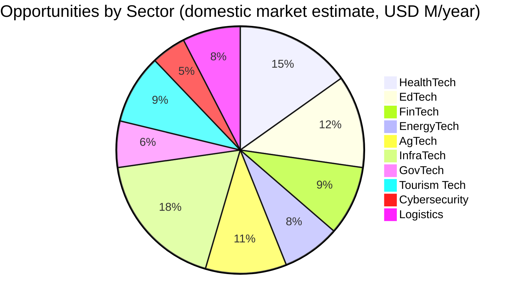
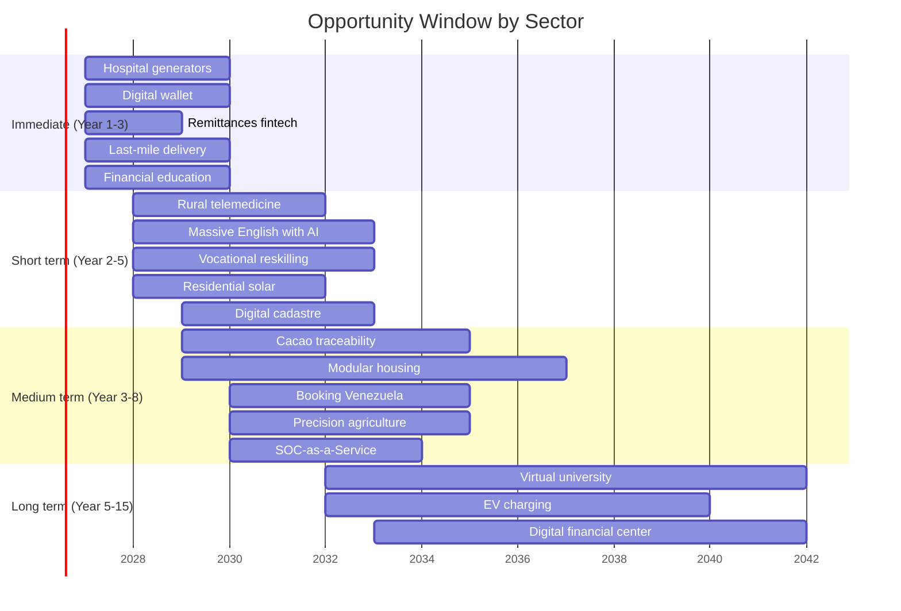

# Tech Opportunities: 70+ Startups Venezuela Needs

> Every problem in the plan is a business. Every gap is a market. These aren't ideas — they're quantified needs with a captive domestic market and export potential to LATAM and globally.

:::info Logic behind this document
The plan invests USD 550-750B over 15 years. Every dollar invested creates value chains where startups and SMEs capture 30-60% of spending as suppliers, operators, or innovators. This document maps those concrete opportunities, sector by sector.
:::

## Model: Partners + Technology + Global Market

Venezuela's advantage isn't just cheap energy. It's the combination of:

1. **Captive market of 40M people** that needs everything — from generators to health apps
2. **Energy at marginal cost** (Guri + solar) that reduces OpEx for any digital operation
3. **7.9M diaspora** with experience in global markets who can co-found
4. **Spanish as language** — direct access to 500M Spanish speakers
5. **Acceleration programs** ([Venezuela Emprende](/05-transformacion/startup-programs)) with USD 10-250K per startup

**Partnership model:** Each opportunity identifies natural partners — educators, doctors, engineers, communities — who contribute domain knowledge. The startup provides technology. The plan provides the market.

---

## 1. HealthTech — Healthcare as a Platform

**Context:** Venezuela has [1.2 doctors/1,000 pop](https://data.worldbank.org/indicator/SH.MED.PHYS.ZS?locations=VE) (OECD: 3.7). 65% of hospitals have inoperable equipment. The plan invests USD 15-25B in healthcare.

### Specific opportunities

| Opportunity | Model | Domestic market | LATAM export | Natural partners |
|-------------|-------|----------------|--------------|-----------------|
| **Rural telemedicine** | SaaS — remote consultation with AI triage | 12M people without access to specialists | 150M rural population in LATAM | Venezuelan doctors in diaspora + local nurses |
| **Hospital generator maintenance** | Service-as-a-Service — IoT monitoring + preventive maintenance | 300+ hospitals, 2,000+ generators | Hospitals across the Caribbean and Central America | Electromechanical technicians + diaspora engineers |
| **Digital pharmacy + delivery** | Marketplace + last-mile logistics | 32M people, fragmented market | Venezuela + Colombia + Ecuador | Existing pharmacies as distribution points |
| **Diagnostic imaging AI** | X-rays / ultrasounds analyzed by AI in rural centers | Saves 80% of transfers to cities | All rural LATAM (200M people) | Radiologists as model trainers |
| **Digital health records** | Interoperable platform for the public system | 40M records, required by law | Standard for LATAM (no country has it complete) | Ministry of Health + private hospitals |
| **Digital mental health** | Therapy app with LATAM psychologists + AI follow-up | 5M+ with PTSD/depression post-crisis | 100M Spanish speakers with limited access | Venezuelan psychologists (many in diaspora) |
| **Pharmaceutical supply chain** | Blockchain for medication traceability | Eliminates counterfeiting (30%+ of market) | Endemic problem across all of LATAM | Distributors + pharmacies |
| **Remanufactured medical equipment** | Import used equipment from U.S./Europe, remanufacture locally | 300+ hospitals need everything | Export to Caribbean + Central America | Biomedical engineers + technicians |

**Reference case:** [mDoc (Nigeria)](https://www.mdoc.ng/) — telemedicine in a country with a similar healthcare crisis. Series A USD 3M. [Doctolib (France)](https://www.doctolib.fr/) — digital medical appointments, EUR 5.8B valuation.

:::tip Hospital generators: the immediate business
A generator maintenance contract for the 300+ public hospitals = USD 15-25M/year. With IoT (vibration, temperature, fuel sensors) failures are prevented and consumption is optimized. The model scales to clinics, schools, telecom towers. **Partners:** local electromechanical technicians trained in 3-6 months. **Global competition:** [Aggreko](https://www.aggreko.com/) generates USD 1.7B/year in revenue; a LATAM version focused on hospitals doesn't exist.
:::

---

## 2. EdTech — Education as an Export

**Context:** The plan invests USD 15-25B in education. 500K adults/year need reskilling. The school system needs to be rebuilt from scratch in many areas. [Duolingo](https://investors.duolingo.com/) (USD 7.6B market cap) proved that EdTech in Spanish scales globally.

### Specific opportunities

| Opportunity | Model | Domestic market | Export | Natural partners |
|-------------|-------|----------------|--------|-----------------|
| **Massive English with AI** | App + hybrid classes (AI tutor + real teacher) | 30M+ who don't speak English; mandatory from grade 1 | 300M Spanish speakers who want English | English teachers as content creators |
| **Vocational reskilling platform** | Online + in-person bootcamps with income during training | 500K/year need certification | Plumbers, electricians, welders across all of LATAM | Trade guilds + companies as employers |
| **STEM for kids (K-12)** | Gamified content + physical kits | 8M primary/secondary students | 80M Spanish-speaking students | Teachers as co-creators and distributors |
| **International certifications** | Prep platform + exam for AWS, Google, Cisco, CFA | 200K professionals/year target | All of LATAM (USD 3B certification market) | Certified instructors as partners |
| **Venezuelan virtual university** | Accredited 100% online degrees at LATAM costs | Rebuild higher education | Students across LATAM without university access | University professors (diaspora + local) |
| **Enterprise LMS** | Learning Management System for corporate training | Companies in ZEETs + concession operators | SMEs across all of LATAM | Instructional designers + companies as channel |
| **Citizen financial education** | App teaching investment, savings, sovereign fund dividend usage | 40M new country "shareholders" | LATAM with low financial literacy | Economists + educators + banks as channel |

**Reference case:** [Platzi (Colombia)](https://platzi.com/) — 5M+ students, USD 225M raised. [Crehana (Peru)](https://www.crehana.com/) — LATAM reskilling, Series B. **The opportunity:** none of these platforms was born with a captive market of 500K students/year funded by the State.

:::tip English: the most obvious startup
30M Venezuelans need English. The plan makes it mandatory from grade 1. A **Platzi meets Duolingo** model with Venezuelan teachers (many bilingual in the diaspora) as tutors paid by the hour + AI for practice = USD 50-100M/year business in Venezuela alone. **Partners:** the guild of English teachers (5,000+ in the country) as operational co-founders who earn per student. At USD 5/month x 5M users = USD 300M/year. Competes with Duolingo by adding the human component Duolingo lacks.
:::

---

## 3. FinTech — The Banking System That Doesn't Exist

**Context:** 70%+ of the population doesn't have a functional bank account. The plan formally dollarizes and creates a citizen bond platform starting at USD 10. Remittances from the 7.9M diaspora total USD 3-5B/year.

| Opportunity | Model | Domestic market | Export | Natural partners |
|-------------|-------|----------------|--------|-----------------|
| **Universal digital wallet** | Payment, transfer, micro-savings app | 32M adults without real banking | Venezuela as pilot → LATAM | Merchants as cash-in/cash-out points |
| **Frictionless remittances** | Transfer + integrated wallet | USD 3-5B/year in remittances | LATAM-U.S. corridor (USD 150B/year) | Diaspora as early adopters |
| **Micro-credit with alternative scoring** | AI evaluates mobile payment history, not bank history | 5M+ informal micro-entrepreneurs | 200M unbanked in LATAM | Micro-entrepreneurs as distribution network |
| **Citizen investment platform** | Purchase sovereign fund bonds from USD 10 via app | 40M potential investors | Replicable model for other sovereign funds | Digital banks as channel |
| **Parametric insurance** | Agricultural insurance that pays automatically if rainfall < X mm | 500K+ farmers without insurance | Agricultural LATAM (USD 8B market) | Agricultural cooperatives + weather stations |
| **Payroll-as-a-Service** | Digital payroll for companies in ZEETs and concessions | 50K+ companies need to modernize payroll | SMEs across all of LATAM | Accountants as resellers |

**Reference case:** [Nubank (Brazil)](https://www.nu.com.br/) — 100M+ customers, market cap USD 60B. Started in a country with inefficient banking. Venezuela is exactly that market, with 0 digital competition.

---

## 4. EnergyTech — Monetize the Advantage

**Context:** Venezuela has [18,000 MW at Guri + Caroni](https://www.mongabay.com/), untapped solar/wind potential, and the plan invests USD 5-15B in energy infrastructure.

| Opportunity | Model | Domestic market | Export | Natural partners |
|-------------|-------|----------------|--------|-----------------|
| **Predictive power grid maintenance** | IoT + AI to detect failures before blackouts | Degraded national grid, daily blackouts | Utilities across all of LATAM | Electrical engineers + CORPOELEC as client |
| **Residential solar as-a-service** | Install panels at no upfront cost, charge per kWh | 8M+ households with unstable electricity | Caribbean + Central America | Local installers trained in 2-4 weeks |
| **Data center energy management** | Consumption optimization software for hydro + solar + backup | Data centers in ZEET Guayana | Data centers across all of LATAM | Power systems engineers |
| **Community micro-grids** | Solar + batteries for rural communities without grid | 2M+ people without stable electricity | Rural communities across all of LATAM and Africa | Communities as co-owners + local technicians |
| **EV charging network** | Charging network for electric vehicles on main routes | Infrastructure from scratch (advantage: no legacy) | Caribbean-Colombia-Brazil corridor | Existing gas stations as locations |
| **Industrial energy auditing** | Consulting + software to reduce consumption 20-40% | Industries in ZEETs and concessions | LATAM industry (USD 2B market) | Industrial engineers as consultants |

---

## 5. AgTech — From Field to World

**Context:** Venezuela has 30M cultivable hectares, produces [< 30% of what it consumes](https://www.fao.org/giews/countrybrief/country.jsp?code=VEN&lang=es). The plan invests USD 5-15B in agroindustry. Venezuelan cacao is world premium.

| Opportunity | Model | Domestic market | Export | Natural partners |
|-------------|-------|----------------|--------|-----------------|
| **Premium cacao/coffee traceability** | Blockchain farm-to-bar to certify origin | 10K+ cacao producers (the world's best) | Global fine cacao market: USD 800M/year | Cacao cooperatives as productive partners |
| **Precision agriculture** | Drones + sensors + AI to optimize irrigation and fertilization | 500K+ farms without technology | 5M farms in LATAM | Agronomists as implementation consultants |
| **B2B agricultural marketplace** | Connect producers with buyers without intermediaries | Eliminate 3-4 layers of intermediation (40% of price) | LATAM agricultural trade | Producer associations as channel |
| **Tech aquaculture** | Sensors + AI for shrimp and tilapia farming in the Delta | 2,800 km coastline + Orinoco Delta | Global shrimp market: USD 45B | Artisanal fishermen as operators |
| **Cold chain as-a-service** | Shared cold network for perishables | Current post-harvest loss: 30-40% | All tropical LATAM has the same problem | Truckers as fleet operators |
| **Urban vertical farming** | Hydroponic cultivation in containers for cities | Caracas, Valencia, Maracaibo (12M+ urban) | Caribbean (depends on imports) | Young urbanites as micro-entrepreneurs |

**Reference case:** [Agrofy (Argentina)](https://www.agrofy.com/) — agro marketplace, Series B USD 30M. [ProducePay (Mexico)](https://www.producepay.com/) — agro financing, USD 380M raised.

:::tip Venezuelan cacao: country brand
Venezuela produces [40% of the world's fine cacao](https://www.icco.org/). A **Nespresso of cacao** model — blockchain traceability + "Cacao de Venezuela" brand + direct D2C sales to premium chocolatiers — can capture USD 50-100/kg vs. USD 3-5/kg commodity. **Partners:** 10K producer families as brand co-owners. [Tony's Chocolonely](https://tonyschocolonely.com/) (EUR 300M revenue) proved the model works.
:::

---

## 6. InfraTech — Building the Country as a Business

**Context:** The plan invests USD 41.5-81B in infrastructure. Every bridge, road, hospital, and school needs design, materials, project management, and maintenance.

| Opportunity | Model | Domestic market | Export | Natural partners |
|-------------|-------|----------------|--------|-----------------|
| **Construction project management SaaS** | Works management platform for concession operators | 500+ simultaneous projects in the plan | LATAM construction (USD 300B/year) | Civil engineers as users and resellers |
| **Modular prefab housing** | Concrete/steel module factories, on-site assembly | Goal: 500K-1M homes in 15 years | Housing deficit across all of LATAM: 25M homes | Construction companies as clients, communities as labor |
| **Water purification as-a-service** | Portable purification plants with IoT monitoring | 7.6M without safe drinking water | 160M without safe water in LATAM | Communities as operators, sanitary engineers |
| **Smart building management** | IoT for efficiency in public buildings (hospitals, schools) | 5,000+ public buildings to rebuild | Government buildings across all of LATAM | HVAC and electrical technicians |
| **Drones for infrastructure inspection** | Bridge, tower, power line inspection with AI | 20,000+ km of degraded infrastructure | LATAM utilities and infrastructure | Certified drone pilots as operators |
| **Industrial recycling** | Metal, plastic, electronics recycling plant | Circular economy from scratch | Recycled material exports | Formalized informal recyclers as partners |

---

## 7. GovTech — Digitizing the State

**Context:** The plan reduces from 34 to 15 ministries and automates using the [Estonia e-Residency](https://e-resident.gov.ee/) model. The State as a platform needs software.

| Opportunity | Model | Domestic market | Export | Natural partners |
|-------------|-------|----------------|--------|-----------------|
| **Universal digital identity** | Biometric + blockchain system for ID, voting, procedures | 40M citizens need digital ID | LATAM and African governments | Civil registries as capture points |
| **E-government procedures platform** | Single portal with AI for resolving queries | 100+ procedures to digitize | Municipalities across all of LATAM | Public servants as testers and trainers |
| **Blockchain digital cadastre** | Immutable property registry | 10M+ properties without clear title ([De Soto](/03-ciudadanos/los-que-se-quedaron)) | Endemic problem in LATAM and Africa | Surveyors + lawyers as capture network |
| **Tax compliance SaaS** | Filing and payment software for the 15% flat tax | 10-35M taxpayers to formalize | SMEs across all of LATAM | Accountants as implementers |
| **Transparent procurement** | Public contracting platform with blockchain | USD 550-750B in plan contracts | Anti-corruption replicable globally | Auditors + civil society as watchdogs |
| **Citizen dashboard** | App where each "shareholder" sees revenue, spending, fund in real time | 40M users (mandatory for transparency) | Model for other sovereign funds | Data journalists as auditors |

**Reference case:** [ProZorro (Ukraine)](https://prozorro.gov.ua/en) — transparent procurement, saved USD 6B in 3 years. [X-Road (Estonia)](https://e-estonia.com/solutions/interoperability-services/x-road/) — digital government backbone, exported to 20+ countries.

---

## 8. Tourism Tech — The Unknown Caribbean

**Context:** The plan projects [5-10M tourists in 15 years](/05-transformacion/diversificacion) (USD 4-8B/year). Venezuela has Angel Falls, Los Roques, Canaima, Merida, Morrocoy — and zero digital tourism infrastructure.

| Opportunity | Model | Domestic market | Export | Natural partners |
|-------------|-------|----------------|--------|-----------------|
| **Venezuelan booking platform** | OTA (Online Travel Agency) specialized in Venezuela | 5-10M tourists/year | Hub for Caribbean tourism | Posadas, hotels, operators as inventory |
| **Experiential eco-tourism** | Airbnb Experiences-type platform for adventure/nature | Canaima, Los Roques, Delta, Merida | Global adventure tourists (USD 800B market) | Indigenous communities + local guides as hosts |
| **Digital nomad hub management** | Co-living + coworking + community for nomads in Margarita | 1,000-5,000 nomads/year (ZEET Margarita) | Global nomad network | Local owners + coworking operators |
| **Gastronomy as experience** | Gastronomic tours + local products marketplace | Domestic tourism + visitors | Venezuelan gastronomy to the world | Chefs, restaurants, artisanal producers |
| **Travel safety & insurance** | Travel insurance + safety app for tourists | Critical for tourist confidence | All emerging destinations | Insurers + embassies as channel |

---

## 9. Cybersecurity — Protecting the Reconstruction

**Context:** Digitizing an entire country creates the largest attack surface in LATAM. Every data center, digital hospital, and cloud government needs protection.

| Opportunity | Model | Domestic market | Export | Natural partners |
|-------------|-------|----------------|--------|-----------------|
| **SOC-as-a-Service** | Security operations center as a service | Government + ZEETs + concession operators | LATAM SMEs without their own SOC (90%+) | Security engineers as analysts |
| **Identity & Access Management** | Access management for digital government + enterprises | 15 ministries + 100+ agencies | SaaS for LATAM government and enterprises | Implementers as partners |
| **Compliance automation** | Software to comply with regulations (OFAC, anti-money laundering, data) | Mandatory for post-sanctions operations | Every LATAM company doing business in the U.S. | Lawyers + auditors as channel |

---

## 10. Logistics & Mobility — Moving a Country

**Context:** 22,000+ km of degraded roads, underutilized ports, obsolete vehicle fleet. The plan invests USD 15-30B in transportation.

| Opportunity | Model | Domestic market | Export | Natural partners |
|-------------|-------|----------------|--------|-----------------|
| **Last-mile delivery** | Delivery platform for e-commerce | Nascent market — e-commerce < 2% of retail | LATAM last-mile (USD 15B market) | Motorcycle riders as fleet partners |
| **Fleet management IoT** | GPS + telemetry + route optimization | 50K+ vehicles from concession operators and government | LATAM commercial fleets | Truckers as users |
| **Port management system** | Software for managing reactivated ports | 4 main ports to modernize | Caribbean + LATAM ports | Port operators as clients |
| **Ride-sharing / bus tech** | Public + private transportation app | 32M without efficient transportation | LATAM cities | Drivers as partners, municipalities as clients |

---

## Opportunity Map by Plan Investment

## Maturity Timeline

## How to Get Started

:::tip For entrepreneurs
1. **Pick a problem from the plan** — every section has quantified gaps
2. **Build a team** — one technical person (diaspora or local) + one ground operator + one salesperson
3. **Apply to [Venezuela Emprende](/05-transformacion/startup-programs)** — USD 10-250K depending on stage
4. **Set up in a [ZEET](/05-transformacion/hubs-tech)** — 0% tax for 10 years, registration in 24 hours
5. **Start with the Venezuelan market, scale to LATAM** — 40M captive + 500M Spanish speakers
:::

:::info It's not just technology
The biggest opportunities aren't apps — they're services. The technician who maintains generators. The nurse who operates the telemedicine system. The teacher who teaches English with the app. The farmer who uses the drone. **Technology is the lever; people are the business.**
:::

---

## 11. Bitcoin Mining with Hydroelectric Power

**Context:** Venezuela has **18,000 MW** of installed hydroelectric capacity at Caroni/Guri, with significant surpluses and generation cost of ~**USD 0.03/kWh** — among the cheapest in the world. This makes the country one of the most competitive destinations on the planet for Bitcoin mining.

| Parameter | Value | Reference |
|-----------|-------|-----------|
| Venezuela energy cost | ~**USD 0.03/kWh** | Industrial rate Corpoelec |
| Cost to mine 1 BTC at USD 0.03/kWh | ~**USD 10,000-15,000** | [Requires research: exact calculation based on hashrate and equipment efficiency] |
| BTC price (2025-2026) | **USD 100,000+** | Spot market |
| ROI per BTC mined | **5-10x** | Own calculation (price / production cost) |
| Potential revenue if scaled | **USD 1-5B/year** | [Cambridge Bitcoin Electricity Consumption Index](https://ccaf.io/cbnsi/cbeci); [CoinShares Mining Report](https://coinshares.com/) |

:::tip El Salvador already did it — Venezuela can do it 100x bigger
El Salvador mines BTC with volcanic energy at a modest scale. Venezuela has **18,000 MW** of hydro vs. El Salvador's ~100 MW volcanic. The scale difference is 2 orders of magnitude. With just 5% of Guri's idle capacity dedicated to mining = **~900 MW = one of the largest operations in the world**.
:::

**Rules of engagement:**

1. **100% private sector** — the State does NOT mine BTC. It grants energy concessions to private mining operators
2. **Not confiscable** — BTC is a hedge against sovereign risk. Investors understand this
3. **Complementary to data centers** — same electrical infrastructure, different workload
4. **Clear regulation** — mining licenses with energy efficiency requirements and royalty payments

**Risks:**

| Risk | Mitigation |
|------|-----------|
| Competition for energy with data centers and industry | Exclusive mining zones vs. data center zones; industry priority during peaks |
| BTC volatility | Professional miners hedge risk with derivatives; the State only collects royalties in USD |
| Environmental pressure | Energy is 100% hydroelectric — near-zero carbon footprint |
| Regulatory clarity | Specific legal framework for crypto-mining as part of the fintech sandbox |

---

## 12. Fintech: The USD 50-100B Opportunity

**Context:** **40 million people** without functional fintech = the largest unserved unbanked market in LATAM. The first **5-10 Venezuelan fintech startups** that capture this market will be unicorns. [Kaszek](https://www.kaszek.com/) (largest LATAM VC fund) would invest.

| Fintech Vertical | Market size | Global reference | Why Venezuela |
|------------------|-------------|------------------|---------------|
| **Neo-banking** | USD 10-20B (deposits) | [Nubank](https://www.nu.com.br/) (Brazil, 100M+ customers, USD 60B market cap) | 0 digital competition, 40M without functional accounts |
| **Remittances** | **USD 4-5B/year** | [Wise](https://wise.com/) (UK, USD 12B market cap) | 7.9M diaspora sending money at 5-8% fees |
| **Digital payments** | USD 5-10B (annual volume) | [Pix](https://www.bcb.gov.br/en/financialstability/pix_en) (Brazil, USD 0 cost, instant) | 70%+ cash USD economy → digitize = capture float |
| **Micro-lending** | USD 3-5B (potential portfolio) | [Creditas](https://www.creditas.com/) (Brazil, USD 4.8B valuation) | 5M+ micro-entrepreneurs without credit access due to 73% reserve requirement |
| **Insurance** | USD 1-2B (potential premiums) | [Lemonade](https://www.lemonade.com/) (U.S., AI insurance) | Insurance penetration ~0%; virgin market |
| **Crypto on/off ramps** | USD 2-5B (volume) | [MoonPay](https://www.moonpay.com/) | Venezuela already uses USDT massively; formalize the flow |

:::info Nubank started exactly like this
Nubank was born in Brazil when banking was inefficient and expensive. It reached **100M customers** and **USD 60B valuation** serving the unbanked. Venezuela has the same conditions but **worse** — which means the opportunity is **greater**. The first Venezuelan digital wallet that works well = USD 10B+ company.
:::

**Prerequisites (non-negotiable):**

1. **Formal dollarization** — without a stable currency there's no fintech (see [Rule of Law and Currency](/04-gobernanza/estado-derecho-moneda))
2. **Digital identity** — KYC without digital ID is impossible (see [Digital State](/06-realidad/estado-digital))
3. **Fintech regulation (sandbox)** — clear rules to operate without asking 5 ministries for permission
4. **International banking reconnection** — SWIFT + correspondent banking to move USD

**YC would accept** a citizen investment platform (sovereign bonds from USD 10) as a standalone startup — 40M captive users, USD 250-400B potential AUM from the sovereign fund, model replicable to other countries with sovereign funds.

Sources: [Finnovista LATAM Fintech Report](https://www.finnovista.com/) [Requires research: most recent edition]; [CB Insights Fintech Report 2024](https://www.cbinsights.com/)

---

**See also:** [Startup Programs](/05-transformacion/startup-programs) · [Tech Hubs and ZEETs](/05-transformacion/hubs-tech) · [Economic Diversification](/05-transformacion/diversificacion) · [Human Capital](/05-transformacion/capital-humano) · [AI Impact](/05-transformacion/impacto-ia)
