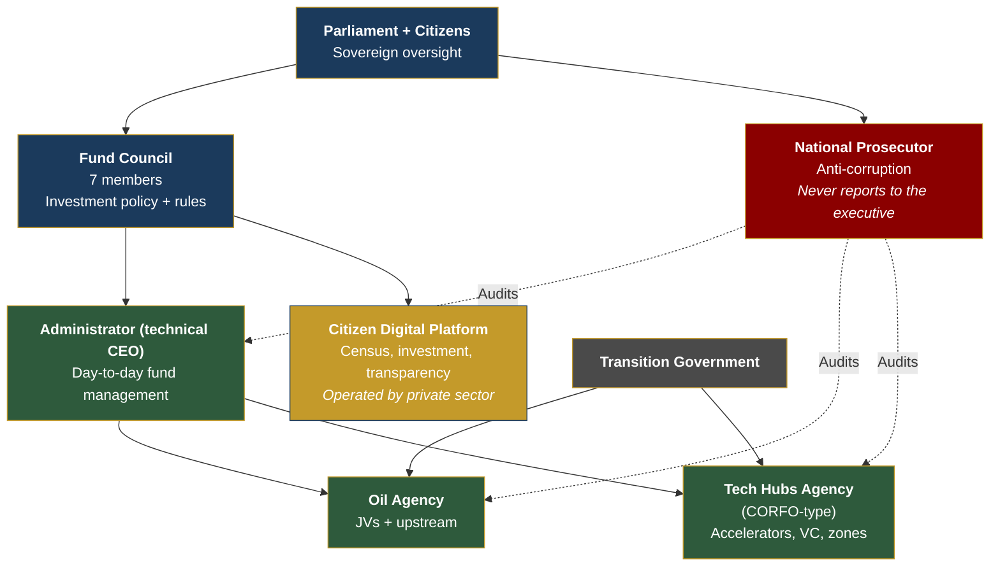

# ESG Sustainability and Execution Governance

## ESG Framework

| Component | Action | Benefit |
|-----------|--------|---------|
| Carbon footprint | Offsetting + carbon credits + clean upgraders | Attracts ESG investment |
| Arco Minero | Illegal mining moratorium + formalization | Protects the Amazon |
| Energy | 74% renewable → 85%+ with solar/wind | LATAM renewable leader |
| Labor rights | ILO standards across the board | Avoids sanctions |

## Execution Org Chart (PMO)

| Entity | Responsibility | Reports to |
|--------|---------------|-----------|
| Fund Council (7 members) | Investment policy + rules | Parliament + citizens |
| Administrator (technical CEO) | Day-to-day management | Council |
| National Prosecutor | Anti-corruption | Parliament (never the executive) |
| Oil Agency | JVs + upstream | Government + Council |
| Tech Hubs Agency (CORFO-type) | Accelerators, VC, zones | Government + private sector |
| Citizen Digital Platform | Census, investment, transparency | Council (operated by private sector) |

**Principle:** Public quarterly KPIs. 2 quarters without meeting targets = automatic leadership review.

---

## Net-Zero Commitment for Data Centers

:::info Why it matters
Larry Fink (BlackRock, USD 10T+ AUM) conditions investment on ESG compliance. The Tech Giants that would invest USD 6-16B in data centers in Venezuela need a **net-zero commitment**. Without this, BlackRock won't buy VIN, AWS won't place data centers, and the plan loses its second economic engine.
:::

### Natural advantage: Venezuela is already ~74% renewable

| Energy source | Capacity | % of mix | Emissions | Status |
|---------------|----------|----------|-----------|--------|
| **Hydroelectric** (Caroni/Guri) | 18,000 MW | ~74% | **Zero** | Operational (degraded) |
| Thermoelectric (gas/diesel) | ~6,000 MW | ~22% | High | Degraded |
| Solar | ~50 MW | <1% | Zero | Minimal |
| Wind (Falcon) | ~100 MW | <1% | Zero | Pilot |

**The starting point is privileged:** few countries in the world can offer data centers powered 100% by hydroelectric. This is a competitive advantage vs. Chile (intermittent solar), Colombia (hydro + thermal), Brazil (hydro + biomass + thermal).

### Net-Zero Commitment: 3 phases

| Phase | Target | Mechanism | Timeline |
|-------|--------|-----------|----------|
| **1. Clean compute** | Data centers 100% hydro | Direct connection to Caroni grid, 20-year PPA | Years 1-3 |
| **2. Grid transition** | National mix > 85% renewable | Rehabilitate Guri + solar (Falcon/Zulia) + wind | Years 3-8 |
| **3. Full net-zero** | All tech operations net-zero | Carbon credits for residual emissions, green hydrogen for backup | Years 8-15 |

### ESG framework for institutional investors

| Requirement | Standard | Venezuela S.A. proposes | Source |
|-------------|---------|------------------------|--------|
| **Scope 1-3 emissions** | TCFD / GHG Protocol | Annual report audited by Big 4 | [TCFD](https://www.fsb-tcfd.org/) |
| **Renewable energy** | RE100 | Data centers 100% hydro from day 1 | [RE100](https://www.there100.org/) |
| **Water** | CDP Water | Caroni has abundant water — monitor flow impact | [CDP](https://www.cdp.net/) |
| **Social** | UN Global Compact | ILO labor standards, local community inclusion | [UN Global Compact](https://www.unglobalcompact.org/) |
| **Governance** | Santiago Principles | Transparent sovereign fund, independent board | [Santiago Principles](https://www.ifswf.org/) |
| **Biodiversity** | TNFD | Illegal Arco Minero moratorium, Amazon/Gran Sabana protection | [TNFD](https://tnfd.global/) |

### Quantifying the ESG differential

| Data center | Energy | CO2e emissions/MW | Energy cost | ESG score |
|-------------|--------|-------------------|-------------|-----------|
| Virginia, USA (AWS) | Fossil + renewable mix | ~300-400 tons/MW/year | USD 0.06-0.08/kWh | Medium |
| Chile (Google) | Solar + wind | ~50-100 tons/MW/year | USD 0.04-0.06/kWh | High |
| **Venezuela (proposed)** | **100% hydro** | **~0 tons/MW/year** | **USD 0.03-0.05/kWh** | **Maximum** |
| Norway (data centers) | 98% hydro | ~0 tons/MW/year | USD 0.04-0.06/kWh | Maximum |

:::tip Pitch for BlackRock/Fink
"Venezuela offers data centers with **zero emissions + the cheapest energy in the Western Hemisphere**. It's not a future commitment — it's an existing natural advantage. The commitment is not to ruin it."
:::

### Carbon credits as additional revenue

If Venezuela operates 100% hydro data centers while its competitors use a fossil mix, it can generate **carbon credits** sellable in international markets:

| Concept | Estimate |
|---------|----------|
| CO2 savings vs. global average data center | ~300-400 tons/MW/year |
| Total data center capacity (year 10 target) | 500-1,000 MW |
| Credits generated | 150,000-400,000 tons CO2e/year |
| Voluntary market price | USD 10-50/ton ([Ecosystem Marketplace 2024](https://www.ecosystemmarketplace.com/)) |
| Potential revenue | **USD 1.5-20M/year** (modest but symbolic) |
