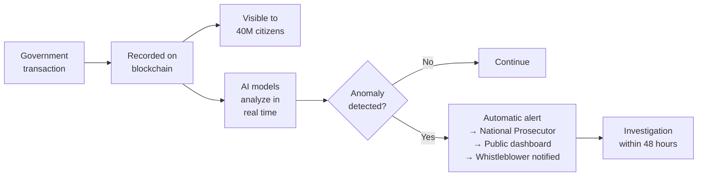

# Digital State: Reduce, Digitize, Automate

[Estonia](https://e-estonia.com/): 100% digital services (Dec. 2024), [2% GDP savings](https://centreforpublicimpact.org/public-impact-fundamentals/e-estonia-the-information-society-since-1997/), 820 years of time saved, [#1 UN e-government 2024](https://e-estonia.com/estonia-is-at-the-top-of-the-un-e-government-ranking/), [82% citizen satisfaction](https://www.socialeurope.eu/estonias-digital-frontier-when-perfect-e-government-meets-the-paradox-of-trust) (OECD 2024).

## Roadmap

| Service | Year 3 Target | Year 7 Target | Reference |
|---------|--------------|--------------|-----------|
| Digital identity | 100% digital ID | Universal digital signature | Estonia eID |
| Taxes | 80% online | AI auto-filing (3 min) | Estonia: 3 min |
| Business registration | 24 hours | 20 minutes online | Estonia: 20 min |
| Healthcare | 50% digital medical records | 100% digital + AI | Estonia: 99% prescriptions |
| Justice | 50% digital case files | Virtual courts | Singapore |
| Government services | 60% online | 95% online (0 lines) | Estonia: 100% |

**Infrastructure:** Venezuelan X-Road (interoperability) + public blockchain + once-only principle.

**Investment:** USD 3,000–5,000 M over 7 years. Return: ~2% GDP/year in savings.

---

## Total Transparency: Blockchain + Anti-Corruption AI

:::tip The best anti-corruption isn't 500 inspectors — it's a system that doesn't allow hiding anything
Put everything on blockchain. Let anyone anywhere see any government transaction in real time. A single ML model can replace an entire anti-corruption agency.
:::

### Public blockchain for state finances

| Layer | What is recorded | Who can see it | Technology |
|-------|-----------------|----------------|-----------|
| **Budget** | Every bolivar/dollar allocated: from which line item, to which entity, for what purpose | Any citizen, in real time | Permissioned blockchain (Hyperledger/Polygon) |
| **Procurement** | Every contract: company, amount, timeline, milestones, payments | Public + automatic comparison with reference prices | Smart contracts with milestone payments |
| **Payments** | Every state payment: vendor, amount, invoice, deliverable | Public. Automatic alerts if > 20% above reference price | Blockchain + price oracles |
| **Sovereign fund** | Every movement: contribution, withdrawal, return, custodian | Public + automated auditing | [Norway NBIM transparency](https://www.nbim.no/) model + blockchain |
| **Payroll** | Every public employee: position, salary, attendance | Public (protecting sensitive personal data) | Verifiable database against blockchain |
| **Assets** | State asset inventory: real estate, vehicles, equipment | Public | Registry on-chain |

### AI for real-time corruption detection

| Model | What it detects | How it works | Reference |
|-------|----------------|--------------|-----------|
| **Anomaly detection** | Out-of-pattern payments, cost overruns, ghost vendors | Unsupervised ML on transactions. Alert if deviation >2σ from average | [ProZorro (Ukraine)](https://prozorro.gov.ua/en): reduced procurement corruption 40% |
| **Network analysis** | Shell companies, front men, corruption networks | Graph neural networks on ultimate beneficial owners, directors, shareholders | [OpenOwnership](https://www.openownership.org/) |
| **Risk prediction** | Contracts with high fraud probability BEFORE it happens | Classifier trained on historical corruption patterns (the 12 from the [integrity shield](/04-gobernanza/blindaje-integridad)) | [World Bank Integrity AI](https://www.worldbank.org/) [Requires research] |
| **NLP on documents** | Unusual contract clauses, language concealing conflicts of interest | LLM fine-tuned for public contracts in Spanish | Proprietary model or partnership with Anthropic/OpenAI |
| **Price matching** | Overpricing vs. market (CLAP pattern) | Automatic comparison of prices paid vs. international + regional market | Price oracles (Chainlink/market APIs) |

### Cost vs. return

| Concept | Cost | Estimated return |
|---------|------|-----------------|
| Blockchain infrastructure | USD 50-100M (setup) + USD 10-20M/year | — |
| AI anti-corruption team (30-50 engineers) | USD 5-10M/year | — |
| Total annual | **USD 15-30M/year** | — |
| Corruption prevented (conservative: 5% of public spending) | — | **USD 1-3B/year** |
| **ROI** | | **50-100x** |

### Precedents

| Country/System | What they did | Result | Source |
|----------------|--------------|--------|--------|
| **Ukraine (ProZorro)** | 100% online public procurement + AI detection | USD 6B saved in 3 years, procurement corruption -40% | [ProZorro](https://prozorro.gov.ua/en) |
| **Georgia (2004)** | New police force + cameras + public dashboard | From most corrupt to #1 anti-corruption reform in the world | [TI Georgia](https://www.transparency.org/) |
| **Estonia (X-Road)** | Full interoperability + once-only + blockchain for auditing | CPI score of 74 (top 20 worldwide) | [e-Estonia](https://e-estonia.com/) |
| **South Korea (KONEPS)** | Electronic procurement + AI | Public procurement corruption -50% | [KONEPS](https://www.pps.go.kr/) |

:::danger Musk's rule for Venezuela
"You don't need 500 inspectors if you have a system that doesn't allow hiding anything." Every government transaction on public blockchain + AI detecting patterns in real time + 40M citizens who can audit from their phone = **anti-corruption by design, not by enforcement**.

Cross-reference: [12 corruption patterns x 14 plan areas](/04-gobernanza/blindaje-integridad) | [Whistleblower system with 10-30% reward](/04-gobernanza/justicia-transicional)
:::
