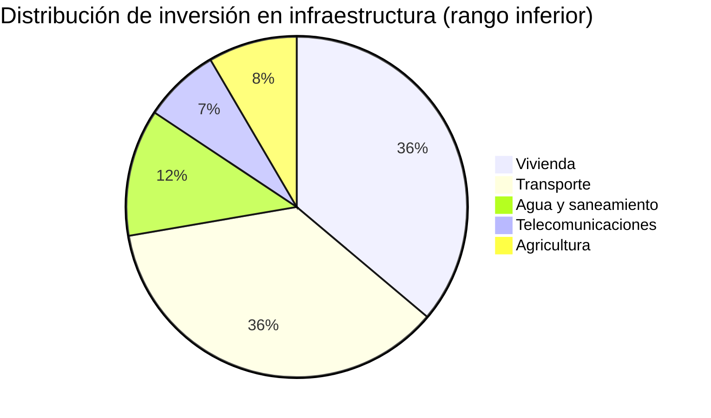

# Basic Infrastructure: Telecommunications, Water, Housing, Transportation, and Agriculture

> Without infrastructure there are no tech hubs, no tourism, no data centers. Every dollar invested here enables USD 5–10 in private investment.

## Telecommunications

:::danger Current state
Venezuela has an [average download speed stuck below 1 Mbps](https://estcarisimo.github.io/assets/pdf/papers/2024-sigcomm-venezuela.pdf) for a decade, while the LATAM median is ~20 Mbps. Only [48% of households have internet access](https://freedomhouse.org/country/venezuela/freedom-net/2024) (Consultores 21, 2023). Fixed broadband penetration: 9.58% vs. mobile: 52.3%. In [7 of 23 states penetration is below 30%](https://freedomhouse.org/country/venezuela/freedom-net/2024).
:::

| Indicator | Venezuela (current) | LATAM average | Year 5 target | Year 10 target |
|-----------|-------------------|----------------|-----------|------------|
| Download speed | <1 Mbps | ~20 Mbps | 15 Mbps | 50+ Mbps |
| Household penetration | 48% | ~70% | 70% | 90%+ |
| Fixed broadband | 9.58% | ~15% | 20% | 40% |
| 5G | 0 | Rolling out | Major cities | National coverage |

**Plan:**
- **CANTV:** Partial privatization + private licenses (Chile model: Entel → CTC/Telefonica)
- **Rural areas:** Starlink + national fiber backbone
- **5G:** Competitive licenses for 3+ operators
- **Investment:** USD 3,000–5,000 M over 5 years

Sources: [Freedom House 2024](https://freedomhouse.org/country/venezuela/freedom-net/2024); [SIGCOMM/Northwestern 2024](https://estcarisimo.github.io/assets/pdf/papers/2024-sigcomm-venezuela.pdf)

### Starlink + Immediate Connectivity

**Problem:** CANTV delivers ~**5–10 Mbps** average in urban areas. In rural areas and states like Amazonas, Delta Amacuro, and Bolivar, **connectivity is zero or near zero**. Waiting 3–5 years to build fiber backbone is not an option when data centers, ZEETs, and tech hubs need internet **now**.

**Solution:** [Starlink](https://www.starlink.com/) as an immediate bridge + fiber as medium-term backbone.

| Solution | Speed | Cost | Deployment timeline | Coverage |
|----------|-------|------|---------------------|-----------|
| **Starlink Residential** | 100–200 Mbps | USD 120/month + USD 599 hardware | **6 months** | National (any point with open sky) |
| **Starlink Business** | 350+ Mbps | USD 250/month + USD 2,500 hardware | **6 months** | ZEETs + hubs + hospitals |
| **National fiber backbone** | 1–10 Gbps | USD 500M–1B total investment | 3–5 years | Urban (80% of population) |
| **5G (Ericsson/Nokia)** | 1+ Gbps | USD 2–5B total investment | 5–7 years | Urban + suburban |

**Starlink coverage costs:**

| Segment | Terminals | Annual cost | Impact |
|---------|-----------|-------------|--------|
| 5 ZEET cities + 50 tech hubs | ~500 Business terminals | **USD 3–5M/year** | High-speed internet for tech ecosystem |
| 1,000+ community access points (rural) | 1,000 terminals | **USD 10–20M/year** | Basic connectivity for areas without infrastructure |
| Priority hospitals and schools | ~2,000 terminals | **USD 5–10M/year** | Telemedicine + digital education |
| **Total immediate coverage** | ~3,500 terminals | **USD 18–35M/year** | — |

:::info Complement, not replace
Starlink is the **bridge**, not the destination. Fiber backbone and 5G are the permanent infrastructure. But Starlink enables ZEETs, data centers, and hospitals to operate with first-world internet **from month 6**, while the fiber is being built. It's the difference between waiting 5 years or starting tomorrow.
:::

Sources: [Starlink](https://www.starlink.com/) (prices updated 2025); [ITU Broadband Commission](https://www.broadbandcommission.org/) [Requires research: more recent satellite coverage data for LATAM]

### Telecom Providers: Allies, Not Huawei

**Geopolitical reality:** The relationship with the U.S. is a sine qua non for sanctions relief. Using **Huawei** equipment for 5G or critical infrastructure is a **deal-breaker** for Washington.

> Marco Rubio (Secretary of State): Telecommunications infrastructure with Chinese equipment in Western Hemisphere countries is a national security threat to the U.S.

| Provider | Country | What they supply | Status with U.S. |
|----------|---------|-----------------|-----------------|
| **Ericsson** | Sweden | 5G RAN, core network, fiber | Approved — U.S. preferred vendor |
| **Nokia** | Finland | 5G, fiber, enterprise networking | Approved — Pentagon contracts |
| **Samsung** | South Korea | 5G RAN, network equipment | Approved — Verizon/AT&T vendor |
| ~~Huawei~~ | ~~China~~ | ~~5G, network equipment~~ | **Banned** — Entity List since 2019 |
| ~~ZTE~~ | ~~China~~ | ~~Telecoms, equipment~~ | **Banned** — Entity List |

**Submarine cables:** Venezuela needs new submarine fiber connections. Agreements must go through U.S. negotiation — it's not technical, it's geopolitical.

:::danger This is not optional
Choosing Huawei/ZTE = losing the entire sanctions roadmap. There is no negotiation. Ericsson/Nokia/Samsung are the only viable providers for a country seeking to reintegrate into the Western economy. The cost may be 10–20% higher, but the cost of choosing wrong is **losing USD 550–750B in investment**.
:::

Sources: [FCC Clean Network Initiative](https://www.fcc.gov/) [Requires research: updated program status]; [State Department Telecommunications Security](https://www.state.gov/) [Requires research]

---

## Potable Water

:::danger Chronic crisis
[7.6 million people](https://crisisresponse.iom.int/response/venezuela-bolivarian-republic-crisis-response-plan-2025) affected by lack of basic services. Access to potable water is limited and unequal across the country ([IOM 2025](https://crisisresponse.iom.int/response/venezuela-bolivarian-republic-crisis-response-plan-2025)). Treatment plants deteriorated, distribution networks with >50% losses.
:::

| Action | Est. investment | Timeline | Model |
|--------|----------------|----------|--------|
| Treatment plant repair | USD 1,000–2,000 M | Years 1–3 | Israel (desalination + recycling) |
| Distribution network rehabilitation | USD 2,000–4,000 M | Years 1–5 | Colombia (Bogota Aqueduct) |
| Desalination (Margarita, Zulia) | USD 500–1,000 M | Years 3–7 | Israel / Saudi Arabia |
| Sanitation and wastewater | USD 1,000–2,000 M | Years 2–7 | Chile (100% coverage) |
| **TOTAL WATER** | **USD 5,000–9,000 M** | **7 years** | — |

**Target:** 100% population access to potable water in 7 years.

---

## Housing

[ENCOVI 2023](https://crisisresponse.iom.int/response/venezuela-bolivarian-republic-crisis-response-plan-2024): 82.8% of the population in income poverty, with limited access to adequate housing. Massive housing deficit.

| Action | Est. investment | Timeline | Model |
|--------|----------------|----------|--------|
| Housing subsidy for families <3 minimum wages | USD 5,000–10,000 M | Years 1–10 | Chile (housing subsidy DS49) |
| Mortgage credit (private banks + state guarantee) | USD 5,000–10,000 M | Years 2–15 | Colombia (Mi Casa Ya) |
| Social housing near tech hubs and ZEETs | USD 3,000–5,000 M | Years 3–10 | Singapore (HDB) |
| Land tenure formalization + digital registry | USD 500–1,000 M | Years 1–3 | Georgia (blockchain titles) |
| **TOTAL HOUSING** | **USD 15,000–30,000 M** | **15 years** | — |

---

## Transportation

Without transportation there is no supply chain, no tourism, no connected tech hubs.

| Component | Current state | Est. investment | Target |
|-----------|--------------|----------------|--------|
| Roads | Deteriorated network, lack of maintenance | USD 5,000–10,000 M | Trunk network at LATAM standard |
| Ports (Puerto Cabello, La Guaira) | Operating at reduced capacity | USD 2,000–4,000 M | Capacity for oil exports + containers |
| Airports (Maiquetia, Maracaibo, Valencia) | Limited intl. connectivity | USD 1,000–3,000 M | Caribbean hub + low-cost carriers |
| Railroad | Practically nonexistent | USD 5,000–10,000 M | Caracas–Valencia–Barquisimeto corridor (phase 1) |
| Urban transit (Caracas, Maracaibo, Valencia) | Caracas Metro deteriorated | USD 2,000–4,000 M | Functional metro + BRT |
| **TOTAL TRANSPORTATION** | — | **USD 15,000–30,000 M** | **15 years** |

:::info Prioritization
Priority corridors: (1) Caracas–La Guaira–Maiquetia (tourism + logistics), (2) Caracas–Valencia (industrial), (3) Ciudad Guayana–Puerto Ordaz (mining + data centers near Guri). Model: Colombia 4G/5G highways (public-private concessions).
:::

---

## Agriculture and Food Sovereignty

Venezuela imports >70% of its food despite having the Llanos — one of the most extensive fertile plains in South America — and the Orinoco River as an irrigation source.

| Action | Est. investment | Timeline | Target |
|--------|----------------|----------|--------|
| Land formalization + agricultural credit | USD 1,000–2,000 M | Years 1–5 | Digital registry + microcredit |
| AgTech (AI irrigation, drones, satellite, precision agriculture) | USD 500–1,000 M | Years 2–7 | Israel (Netafim) + Brazil (Embrapa) |
| Agro-industrial free zones | USD 1,000–2,000 M | Years 3–10 | Processing + export |
| Reactivation of strategic crops (corn, rice, coffee, cacao) | USD 500–1,000 M | Years 1–5 | Colombia + Brazil |
| Export to Caribbean + LATAM | USD 200–500 M | Years 5–10 | Dominican Republic as market |
| **TOTAL AGRICULTURE** | **USD 3,500–7,000 M** | **10 years** | Food self-sufficiency |

---

## Infrastructure Investment Summary

```mermaid
xychart-beta
    title "Inversión en infraestructura por sector (USD miles de M — rango inferior vs. superior)"
    x-axis ["Vivienda", "Transporte", "Agua", "Telecom", "Agricultura"]
    y-axis "USD miles de millones" 0 --> 32
    bar [15, 15, 5, 3, 3.5]
    bar [30, 30, 9, 5, 7]
```

| Sector | Investment | Timeline |
|--------|-----------|----------|
| Telecommunications | USD 3,000–5,000 M | 5 years |
| Water | USD 5,000–9,000 M | 7 years |
| Housing | USD 15,000–30,000 M | 15 years |
| Transportation | USD 15,000–30,000 M | 15 years |
| Agriculture | USD 3,500–7,000 M | 10 years |
| **TOTAL** | **USD 41,500–81,000 M** | **15 years** |

:::caution Investment sources
Not everything is public spending. Telecommunications, housing, and transportation are highly concessionable (Chile/Colombia model). Direct public spending is concentrated in water, agriculture, and social housing. See [Investment and Sources](/02-motor-financiero/inversion-inicial-fuentes).
:::
