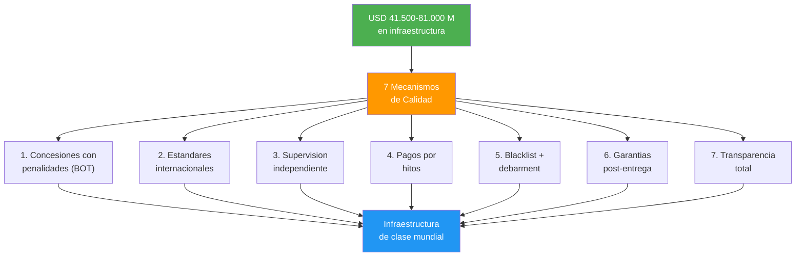
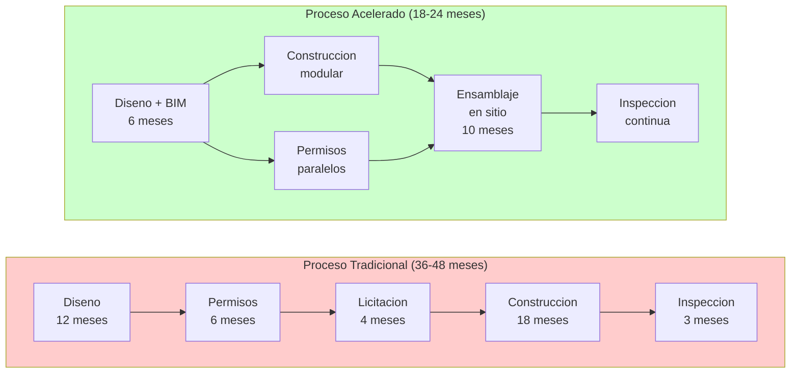

# Infrastructure Quality and Timelines: Make Sure It Doesn't Collapse After a Month

> The infrastructure problem in Venezuela is not just money — it's execution. The country has spent billions on projects that were never finished, finished late, or crumbled within days. This section defines HOW to guarantee world-class quality and on-time delivery for the [USD 41,500-81,000 M in basic infrastructure](/06-realidad/infraestructura-basica).

---

## The Problem Quantified

:::danger The historical pattern
Venezuela builds expensive, late, and poorly. It's not an engineering problem — it's an incentives problem. When the contractor gets paid upfront, has no obligation to maintain the project, and nobody audits them, the result is predictable: bridges that collapse, hospitals that never get finished, roads with potholes within a month, housing with structural problems.
:::

| Indicator | Venezuela | LATAM average | Best practice | Source |
|-----------|-----------|---------------|---------------|--------|
| Infrastructure quality index (WEF, 1-7) | **2.1** | **3.2** | **6.3** (Singapore) | [WEF Global Competitiveness Report 2019](https://www.weforum.org/reports/how-to-end-a-decade-of-lost-productivity-growth/) |
| Road quality (WEF, 1-7) | **1.8** | **3.1** | **6.5** (Singapore) | [WEF GCR 2019](https://www.weforum.org/reports/how-to-end-a-decade-of-lost-productivity-growth/) |
| Electricity supply reliability (WEF, 1-7) | **1.5** | **4.2** | **6.8** (Japan) | [WEF GCR 2019](https://www.weforum.org/reports/how-to-end-a-decade-of-lost-productivity-growth/) |
| Access to potable water (% population) | **<80%** | **~95%** | **100%** (Chile) | [Requires research] |
| Average cost overruns in public works | **30-60%** | **15-25%** | **5-10%** (Singapore) | [Requires research] |
| Projects completed on time | **<30%** | **~50%** | **>85%** (Singapore) | [Requires research] |
| Logistics performance index (World Bank, 1-5) | **2.2** | **2.7** | **4.2** (Singapore) | [World Bank LPI 2023](https://lpi.worldbank.org/) |

:::info Note on sources
Data marked [Requires research] reflects estimates based on partial reports and does not have a single verifiable source. These will be updated when official post-transition data becomes available. WEF data corresponds to the last report that included Venezuela (2019); the country was excluded from later editions due to lack of reliable data.
:::

---

## 7 World-Class Quality Mechanisms

### Mechanism 1: Concessions with Penalties (Build-Operate-Transfer)

The contractor builds AND operates the project for **15-30 years**. If quality fails, they repair it with their own money, not the state's.

| Element | Detail |
|---------|--------|
| Model | Build-Operate-Transfer (BOT) |
| Concession duration | **15-30 years** |
| Performance bond | **10-20%** of contract value in escrow |
| Non-compliance penalty | Automatic payment deduction + bond execution |
| Transfer | To the state only after quality verification |

:::tip Model: Chile
Chile granted concessions for **>80%** of its highway network since 1993. Result: the best roads in LATAM. The concessionaire collects tolls, but if the road has potholes or doesn't meet standards, **they lose revenue and pay penalties**. [Chile Ministry of Public Works](https://www.mop.cl/Paginas/default.aspx).
:::

:::tip Model: Singapore (BCA)
Singapore's Building & Construction Authority certifies EVERY structure before occupancy. Without BCA certification, it doesn't open to the public. Result: **zero structural collapses** in 30 years. [BCA Singapore](https://www1.bca.gov.sg/).
:::

---

### Mechanism 2: Mandatory International Standards

COVENIN (Venezuelan standards) is not sufficient as the sole standard. Venezuela S.A. projects must comply with verifiable international standards.

| Standard | What it covers | Who certifies | Mandatory for |
|----------|---------------|---------------|---------------|
| **ISO 9001** | Quality management system | Bureau Veritas, SGS, TUV | Every project >USD 1M |
| **ISO 14001** | Environmental management | Bureau Veritas, SGS, TUV | Every project >USD 5M |
| **ISO 45001** | Occupational health and safety | Bureau Veritas, SGS, TUV | Every project |
| **Eurocode / ACI 318** | Structural design (concrete, steel) | Intl. certified engineers | Every structure |
| **AASHTO** | Road and bridge design | Intl. certified engineers | Roads |
| **IEC 61850** | Electrical systems | IEC / accredited laboratories | Electrical infrastructure |
| **COVENIN** | Venezuelan standards (supplementary) | SENCAMER | As minimum baseline |

:::caution This is not about dismissing local standards
COVENIN is the baseline. But international standards close the gaps that COVENIN doesn't cover (especially in seismic zones, bridge design, and construction materials). Certification is done by international firms independent of the contractor.
:::

---

### Mechanism 3: Independent Third-Party Supervision

The builder does NOT supervise itself. An international engineering firm is hired as independent supervisor.

| Component | Detail |
|-----------|--------|
| Eligible firms | AECOM, WSP, Arup, Mott MacDonald, Dar Group |
| Paid by | The state (or the infrastructure fund) |
| Reports to | Public dashboard + citizens |
| Inspection frequency | Weekly during construction phase |
| Technology | IoT: deformation, vibration, and settlement sensors in real time |
| Drones | Aerial inspection with AI for defect detection |
| Dashboard | Public, updated in real time |

:::tip Model: Hong Kong (ICV)
Hong Kong's Independent Checking Verification system requires an independent engineer to verify ALL structural calculations before approval. It has maintained Hong Kong's construction standards among the world's best for 40 years. [Buildings Department Hong Kong](https://www.bd.gov.hk/).
:::

---

### Mechanism 4: Milestone Payments

Zero fat advances. The contractor gets paid when they demonstrate verified progress.

| Milestone | % of payment | Condition |
|-----------|-------------|-----------|
| Maximum advance | **10%** | Against international bank guarantee |
| Foundation completed | **20%** | Inspection approved by independent supervisor |
| Structure completed | **20%** | Inspection approved + materials testing |
| MEP (mechanical, electrical, plumbing) | **20%** | Inspection approved + functional testing |
| Final delivery | **10%** | Occupancy/use certification |
| **Retention** | **20%** | Released after **12 months** without defects (defect liability period) |

**Total: 100%.** If a milestone fails inspection, **no payment until corrected.**

:::info Smart contracts for traceability
Payments are recorded on blockchain (smart contracts) so any citizen can verify: how much was paid, when, to whom, and against what evidence. Model: [FIDIC](https://fidic.org/) (Federation Internationale des Ingenieurs-Conseils) — global standard for construction contracts. See also [Digital State](/06-realidad/estado-digital) for the public blockchain infrastructure.
:::

---

### Mechanism 5: Blacklist + Debarment

Whoever delivers poor-quality work never works with the state again. Period.

| Action | Detail |
|--------|--------|
| Confirmed deficient work | **5-10 year ban** from all public contracts |
| Proven fraud | **Permanent ban** + criminal prosecution |
| Public registry | Company name, project, reason for ban, evidence |
| Scope | Includes subsidiaries, related companies, and directors |
| Cross-reference | Verification against [World Bank](https://www.worldbank.org/en/projects-operations/procurement/debarred-firms) lists and [integrity shield](/04-gobernanza/blindaje-integridad) |

:::tip Model: World Bank
The World Bank's debarment system has sanctioned **>1,000 companies** since 1999. Sanctioned companies are excluded from ALL World Bank-financed projects. Venezuela S.A. adopts this model and connects it with the [integrity shield](/04-gobernanza/blindaje-integridad) to close the loop.
:::

---

### Mechanism 6: Post-Delivery Warranties (Warranty Periods)

The project doesn't end when the ribbon is cut. The contractor is responsible for years.

| Type of project | Structural warranty | Functional warranty | Required bond |
|----------------|--------------------|--------------------|---------------|
| Buildings (housing, hospitals) | **5 years** | **2 years** | International insurer |
| Roads and highways | **10 years** | **5 years** | International insurer |
| Bridges and tunnels | **10 years** | **5 years** | International insurer |
| Critical infrastructure (dams, plants) | **15 years** | **7 years** | International insurer |
| Telecommunications | **5 years** | **3 years** | International insurer |

**Key rule:** Bonds are issued by international insurers (Lloyd's, Swiss Re, Munich Re) — not local ones. If a defect appears within the warranty period, the contractor repairs at their cost or loses the bond.

---

### Mechanism 7: Total Transparency

If the citizen can see everything, the corrupt can't hide.

| Tool | Function | Model |
|------|----------|-------|
| Public works dashboard | Budget, progress, photos, inspection reports in real time | [MapaInversiones (IDB)](https://www.mapainversiones.org/) |
| Citizen reporting app | Report defects with photo + GPS from a cellphone | [FixMyStreet (UK)](https://www.fixmystreet.com/) |
| Public quarterly audit | Review of ALL infrastructure spending, published online | [KONEPS (South Korea)](https://www.pps.go.kr/eng/) |
| Open contract data | All contracts published in Open Contracting format | [Open Contracting Partnership](https://www.open-contracting.org/) |

:::tip Model: South Korea (KONEPS)
South Korea's electronic public procurement system (KONEPS) reduced public contracting corruption by **~50%** and saves the government USD 8,000 M/year. Every contract is public, every bid is visible, every payment is traceable. [KONEPS](https://www.pps.go.kr/eng/).
:::

---

## Compressing Timelines Without Sacrificing Quality

The goal is not just to build well — it's to build **fast AND well**. These are the techniques for compressing timelines without cutting corners.

| Technique | Time savings | How it works | Model |
|-----------|-------------|--------------|-------|
| **Prefabrication / modular construction** | **30-50%** | Components manufactured in plant, assembled on site | China: COVID hospitals in 10 days; Singapore: HDB |
| **Design-Build (D-B)** | **15-25%** | A single entity designs and builds (eliminates friction) | U.S.: >50% of federal projects use D-B |
| **Parallel permitting** | **20-30%** | Process multiple permits simultaneously, not sequentially | Dubai: permit in 5 days for priority projects |
| **24/7 construction** | **30-40%** | 8-hour shifts x 3, with labor protections | UAE: Burj Khalifa, Dubai metro |
| **Mandatory BIM** | **10-20%** | 3D digital model detects conflicts before building | UK: BIM Level 2 mandatory since 2016 for public works |
| **Fast-track scheduling** | **20-30%** | Start construction before completing all design | Singapore: Changi Terminal 5 |

:::caution Speed without exploitation
24/7 shifts require: (1) ISO 45001 compliance, (2) maximum 8 hours per shift, (3) night and weekend premium pay per legislation, (4) safety supervision per shift. Speed never justifies labor exploitation.
:::

**Combined target:** China builds fast but with quality problems. Singapore builds with quality but is slow for a country of 5M people. Venezuela S.A. needs **China-speed + Singapore-quality**. The 7 quality mechanisms + 6 timeline compression techniques make it possible.

---

## Cost of Quality vs. Cost of Failure

Investing in quality is not an expense — it's the highest return in the plan.

| Concept | Cost of doing it right | Cost of doing it wrong | ROI |
|---------|----------------------|------------------------|-----|
| Independent supervision | **3-5%** of project cost | **20-40%** in rework and repairs | **4-8x** |
| Performance bonds | **1-2%** of contract | Total project failure | **50x+** |
| ISO certification | **USD 50,000-100,000** per project | Lawsuits, rebuilds, deaths | **Incalculable** |
| Mandatory BIM | **1-3%** of project cost | **10-15%** in changes during construction | **3-5x** |
| IoT sensors | **0.5-1%** of project cost | Undetected catastrophic failure | **Incalculable** |
| **Total quality investment** | **~6-12%** of project | **30-60%+ in failure costs** | **~5x average** |

:::info The math is clear
If Venezuela invests **USD 41,500-81,000 M** in infrastructure and applies a quality surcharge of **~8%** (USD 3,300-6,500 M), it avoids failure costs of **~35%** (USD 14,500-28,400 M). **Net savings: USD 11,200-21,900 M.** That's without counting the lives saved by not having bridges that collapse.
:::

---

## Infrastructure KPIs

| KPI | Baseline (Venezuela today) | Year 5 target | Year 10 target | Year 15 target |
|-----|---------------------------|---------------|----------------|----------------|
| Projects delivered on time | **<30%** | **60%** | **80%** | **>90%** |
| Projects within budget | **<40%** | **65%** | **80%** | **>85%** |
| Defect rate at delivery | **>50%** | **<20%** | **<10%** | **<5%** |
| Citizen satisfaction (survey) | **[Requires research]** | **60%** | **75%** | **>85%** |
| WEF infrastructure quality index | **2.1/7** | **3.0/7** | **4.0/7** | **>4.5/7** |
| LATAM infrastructure ranking | **Bottom quintile** | **Top 60%** | **Top 40%** | **Top 25%** |

---

:::danger The Historical Pattern: CLAP-Style Construction

Construction corruption in Venezuela follows the **same pattern as the CLAPs** (see [integrity shield](/04-gobernanza/blindaje-integridad)):

| Step | CLAP pattern in food | Equivalent pattern in construction |
|------|---------------------|-----------------------------------|
| 1 | Shell company gets the contract | Shell company wins the bid (lowest offer, no real capacity) |
| 2 | Buys products at USD 5 | Buys cement/steel at market price |
| 3 | Bills the state at USD 20-60 | Bills the state at **3-5x** real cost |
| 4 | 15-40% commission to officials | 15-40% commission to public works officials |
| 5 | Deficient product reaches the citizen | Deficient project (or never finished) is "delivered" |
| 6 | Nobody audits | Nobody inspects — or the inspector is bought |

**Result:** Hospitals like the Maracaibo University Hospital (decades without completion), highways like the Gran Mariscal de Ayacucho (inaugurated multiple times, never finished), Gran Mision Vivienda Venezuela housing with leaks and structural cracks within months of delivery.

**The 7 mechanisms in this section block EVERY step of the pattern:**

| Corrupt step | Mechanism that blocks it |
|-------------|-------------------------|
| Shell company | Blacklist + debarment + technical capacity verification |
| Overpricing | Milestone payments + independent supervision + open data |
| Commissions | Total transparency + blockchain + quarterly audit |
| Deficient work | ISO standards + mandatory certification + post-delivery warranties |
| No inspection | Independent supervision by international third parties |
| No consequences | BOT concessions (the contractor operates what they build) + 5-10 year ban |

Cross-reference: [Integrity Shield](/04-gobernanza/blindaje-integridad) for the full map of 14 areas x 12 corruption patterns.

:::

---

## References

| Source | Use in this section |
|--------|-------------------|
| [WEF Global Competitiveness Report 2019](https://www.weforum.org/reports/how-to-end-a-decade-of-lost-productivity-growth/) | Infrastructure quality indices |
| [World Bank LPI 2023](https://lpi.worldbank.org/) | Logistics performance index |
| [World Bank Debarment System](https://www.worldbank.org/en/projects-operations/procurement/debarred-firms) | Blacklist model |
| [FIDIC](https://fidic.org/) | Global standard for construction contracts |
| [BCA Singapore](https://www1.bca.gov.sg/) | Singapore Building & Construction Authority |
| [KONEPS (South Korea)](https://www.pps.go.kr/eng/) | Electronic public procurement system |
| [Open Contracting Partnership](https://www.open-contracting.org/) | Open contracting data standard |
| [MapaInversiones (IDB)](https://www.mapainversiones.org/) | Public investment dashboard |
| [FixMyStreet (UK)](https://www.fixmystreet.com/) | Citizen reporting app |
| [Chile Ministry of Public Works](https://www.mop.cl/Paginas/default.aspx) | Concession model |
| [Buildings Department Hong Kong](https://www.bd.gov.hk/) | ICV system |
