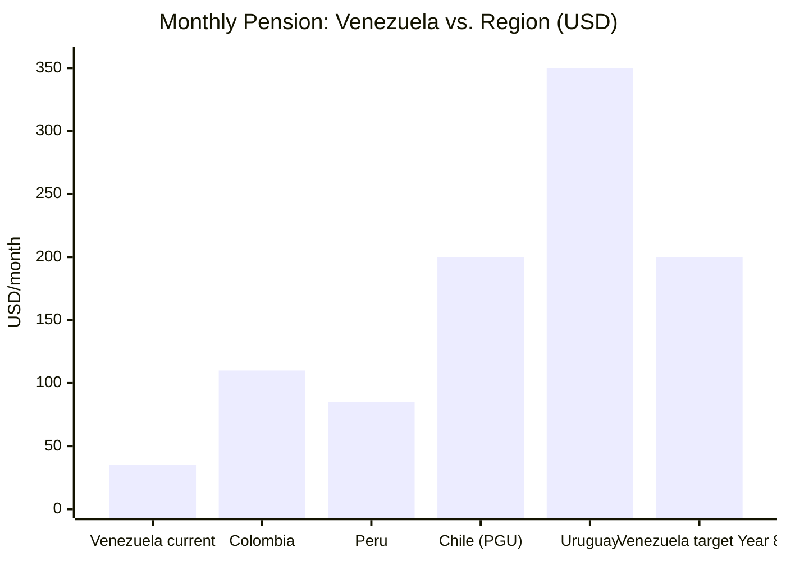
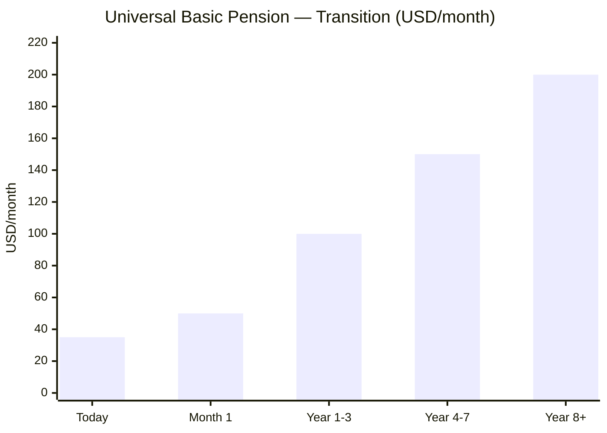

# Pensions and Social Security: The Debt to Our Elders

> A country that doesn't take care of its retirees doesn't deserve a sovereign fund.

## Diagnosis: The Collapse

Venezuela's minimum wage has been frozen at 130 bolivares since March 2022. Pensioners receive the equivalent of [USD 3.50–7/month](https://misionverdad.com/english/venezuelas-minimum-comprehensive-income-announcements-thorough-reading) in base pension plus "economic war" bonuses of ~USD 25–70/month. Total: **~USD 30–75/month** for a retiree.

| Indicator | Data | Context |
|-----------|------|---------|
| Base pension | ~130 bolivares/month | [Frozen since 2022](https://misionverdad.com/english/venezuelas-minimum-comprehensive-income-announcements-thorough-reading) |
| Additional bonuses | ~USD 25–70/month | Variable, not constitutional |
| Total retiree income | ~USD 30–75/month | Insufficient for basic food basket |
| Basic food basket | ~USD 400+/month (est.) | CENDA/ENCOVI data |
| Estimated pensioners | ~5 M people | IVSS + Mision Amor Mayor |
| System | PAYG (pay-as-you-go) | [No reserve fund](https://www.ssa.gov/policy/docs/progdesc/ssptw/2018-2019/americas/venezuela.html) |

:::danger Pension Protection Law (2024)
In May 2024, the government enacted the ["Law for the Protection of Social Security Pensions"](https://central-law.com/en/venezuela-law-on-the-protection-of-social-security-pensions/), which establishes a tax of up to **15% on private sector payroll** to finance pensions. A solution that punishes formal employment instead of capitalizing the system.
:::

## Proposal: FCV Retirement Sub-account + Universal Pension

:::info Pensions are NOT a separate system
The pension is the **Retirement Sub-account of the Citizen Fund Venezuela (FCV)**, which also covers health, housing, and education in a single personal account. Managed by an **autonomous public entity** ([Singapore CPF Board](https://www.cpf.gov.sg/)-type), NOT by private AFPs. See [State Model: FCV](/04-gobernanza/modelo-estado#citizen-fund-venezuela-fcv-one-account-zero-bureaucracy).
:::

| Component | Description | Model |
|-----------|-------------|-------|
| **Pillar 1: Universal basic pension** | USD 100–200/month for EVERY retiree (funded by taxes + sovereign fund returns) | [Alaska PFD](https://pfd.alaska.gov/) + Chile Universal Guaranteed Pension |
| **Pillar 2: FCV Retirement Sub-account** | 8% of salary → 10% at maturity. Individual account within the FCV, managed by autonomous CPF Board-type entity. Part of the total 21% FCV (10% worker + 11% employer) | [Singapore CPF Special Account](https://www.cpf.gov.sg/) |
| **Pillar 3: Voluntary savings** | Tax incentives for additional savings beyond the FCV | U.S. 401(k) / Colombia voluntary fund |
| **Pillar 4: Citizen dividend** | Sovereign fund supplement (USD 125–200/year to everyone) | See [Citizen Investment](/03-ciudadanos/inversion-ciudadana) |

### Pillar 1 Financing (Basic Pension — from taxes, NOT from FCV)

| Scenario | Annual cost | Financing |
|----------|------------|-----------|
| 5 M retirees x USD 100/month | USD 6,000 M/year | 5% of net oil revenue |
| 5 M retirees x USD 150/month | USD 9,000 M/year | 7% of net oil revenue |
| 5 M retirees x USD 200/month | USD 12,000 M/year | Sovereign fund returns (year 10+) |

### Transition

| Phase | Basic pension | Source | Timeline |
|-------|--------------|--------|----------|
| Emergency | USD 50/month (vs. USD 30 current) | Budget + oil revenue | Month 1 |
| Stabilization | USD 100/month | Budget | Year 1–3 |
| Growth | USD 150/month | Budget + fund returns | Year 4–7 |
| Maturity | USD 200+/month + citizen dividend | Sovereign fund returns | Year 8+ |

### Generational Transition: Solidarity Decreases Over Time

The FCV implements a [Singapore CPF](https://www.cpf.gov.sg/)-model pension system (mandatory individual contribution + compound returns):

| Generation | Solidarity Pension (State pays) | Contributory Pension (FCV) | Fiscal Cost |
|-----------|-------------------------------|---------------------------|-------------|
| **Current retirees** (>60 years, 2027) | 100% solidarity — USD 200-300/month target | 0% (never contributed) | High |
| **Transition** (40-60 years, 2027) | 50-70% solidarity + 30-50% FCV | Begin contributing 15-20 years before retirement | Medium |
| **New generation** (<40 years, 2027) | 20% solidarity (guaranteed minimum only) | 80% FCV — contribute throughout working life | Low |
| **Native generation** (born post-2027) | 5-10% solidarity (extreme safety net) | 90-95% FCV | Minimal |

**Fiscal effect:** The cost of solidarity pensions goes from ~3% of GDP (years 1-10) to ~0.5% of GDP (year 30+). That freed 2.5% of GDP = USD 15-20B/year -> more room for dividends or lower taxes.

### FCV Lifecycle Example: Minimum Wage Worker

A worker on minimum wage who contributes to the FCV from age 18 to 65 accumulates **USD 463,508** in total (with compound interest at 5%), resulting in a **monthly pension of USD 1,408** (FCV Retirement + Pillar 1). That represents a **117% replacement rate** of their last salary. See the full lifecycle example in [State Model: FCV Appendix](/04-gobernanza/modelo-estado#appendix-example--fcv-lifecycle-with-minimum-wage).

---

## Argentina Lesson (Milei)

Under Milei, pension purchasing power [fell from 50% to 26.6%](https://www.batimes.com.ar/news/economy/mileis-two-years-in-five-large-economic-and-social-indicators.phtml) of the minimum food basket. Venezuela S.A. proposes the opposite: **raise pensions from Day 1** as part of the Phase 0 humanitarian response. The sovereign fund is the long-term mechanism that makes it sustainable.
