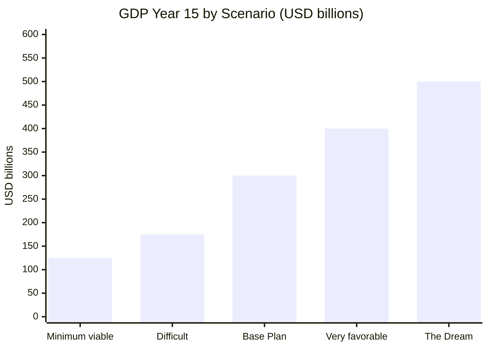
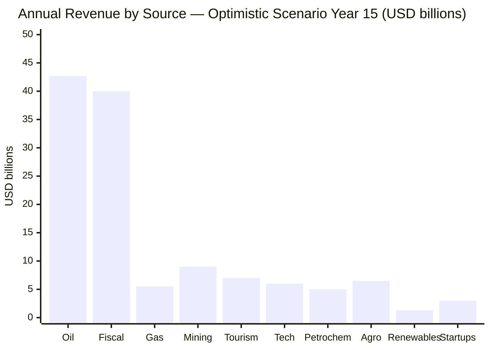
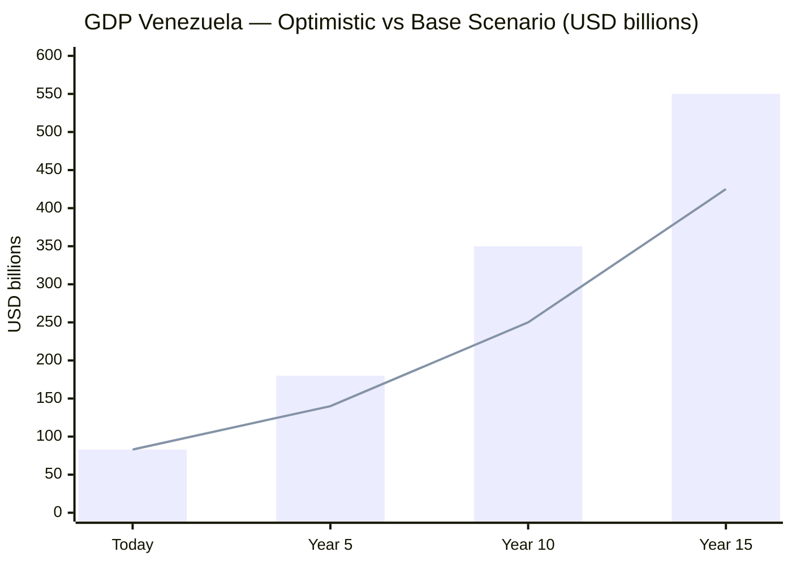
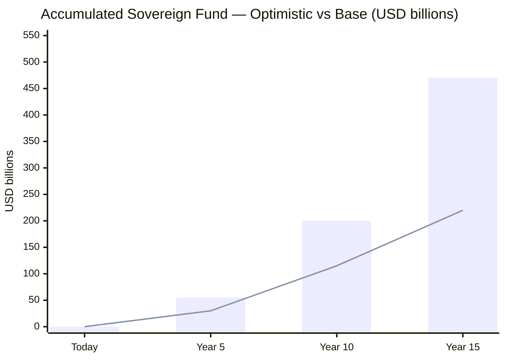
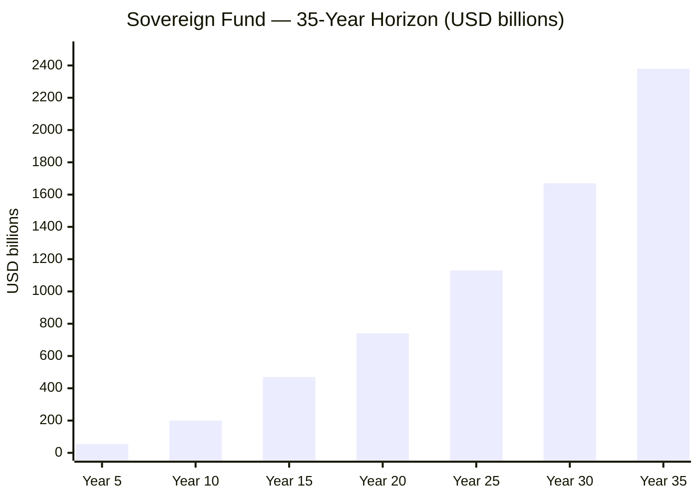
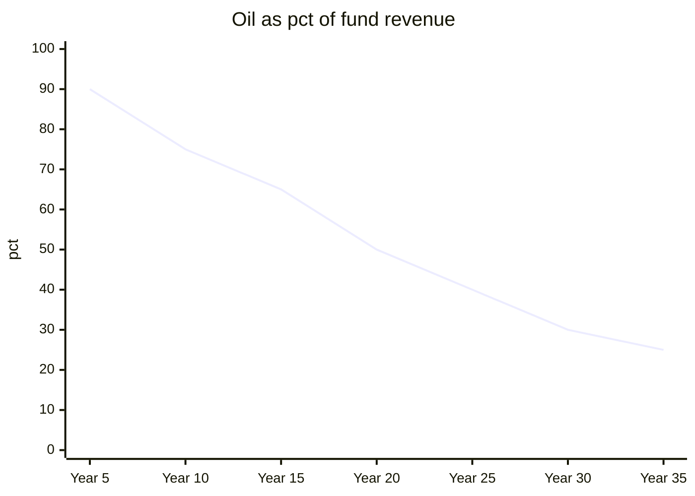
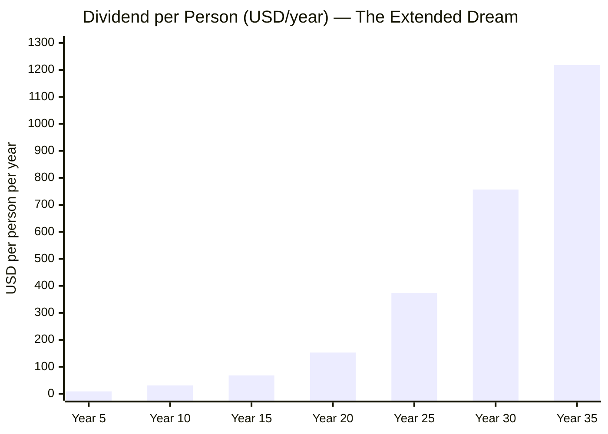
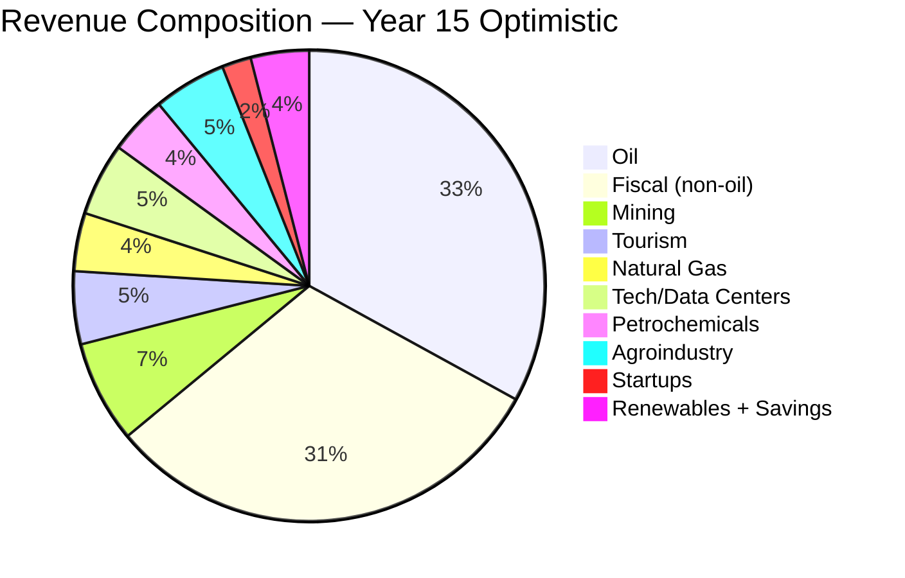
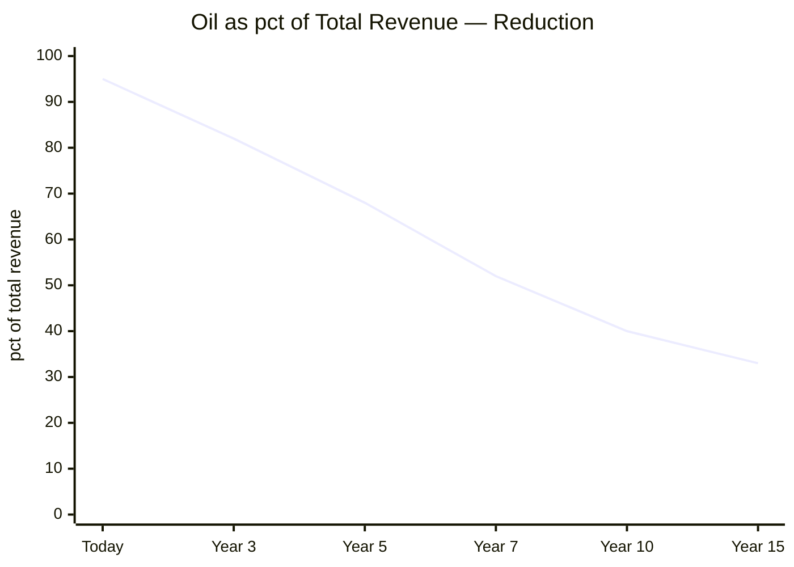
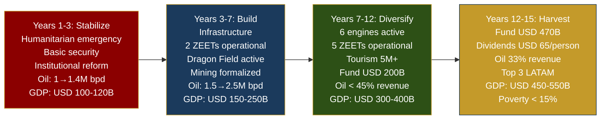

# The Dream: Integrated Optimistic Scenario

> What happens if everything works? This section consolidates ALL revenue sources in the plan — oil at a favorable price, natural gas, tourism, mining, energy, technology, startups, efficient state — and shows the scenario where Venezuela maximizes its potential.

:::caution Data-based, not fantasy
Every figure here has a verifiable source. The optimistic scenario is not invented — it is what happens when the favorable projections of each engine are combined, all documented in their respective sections. What makes it a "dream" is not the numbers, but that it requires ALL conditions to be met simultaneously.
:::

---

## Required Conditions

For this scenario to materialize, **all** these conditions must be met:

| # | Condition | Probability | Dependency |
|---|-----------|-------------|-------------|
| 1 | Peaceful political transition and functional rule of law | Medium | Geopolitics |
| 2 | Brent average >= USD 70-80/barrel for 15 years | Medium-High | Global market |
| 3 | Oil production ramp-up to 2.75-3M bpd ([Rystad](https://www.rigzone.com/news/could_venezuela_production_get_back_to_3mm_barrels_per_day-08-jan-2026-182716-article/) timeline) | Medium | Investment + infrastructure |
| 4 | Legal certainty for foreign investment | Medium | Institutional reform |
| 5 | Formalization of mining sector (currently 75+ tons illegal gold/year) | Medium-Low | Security + governance |
| 6 | Electrical infrastructure rehabilitated (Guri + transmission grid) | Medium | Capital + time |
| 7 | International gas agreements (Dragon Field + Colombia + LNG) | High | Partially signed already |
| 8 | Global demand for data centers and clean energy sustains growth | High | AI/cloud trend |
| 9 | Fiscal reform implemented (15% flat + 12% VAT) | Medium | Political will |
| 10 | State reduced to 5 functions with <18% GDP in spending | Medium | Administrative reform |

---

## Real Probability: Brutal Honesty

The table above lists conditions as "Medium" or "High." Let's quantify.

| # | Condition | P(success) | Justification |
|---|-----------|----------|---------------|
| 1 | Peaceful political transition | 40% | Only 3 of 15 authoritarian petro-states have transitioned peacefully since 1990 ([V-Dem Institute, 2024](https://www.v-dem.net/)) |
| 2 | Brent >= USD 70-80 average over 15 years | 55% | Historical average 2000-2025: ~USD 72/bbl. [EIA STEO](https://www.eia.gov/outlooks/steo/) projects USD 65-75 medium term |
| 3 | Ramp-up to 2.75-3M bpd | 45% | [Rystad Energy](https://www.rigzone.com/news/could_venezuela_production_get_back_to_3mm_barrels_per_day-08-jan-2026-182716-article/) says possible in 15 years, but requires USD 183B and stability |
| 4 | Legal certainty | 35% | Venezuela ranks 177/190 on [Rule of Law Index](https://worldjusticeproject.org/rule-of-law-index/) |
| 5 | Mining formalization | 25% | Colombia has spent 30+ years trying to formalize illegal mining with partial results |
| 6 | Electrical rehabilitation (Guri) | 50% | Infrastructure exists but requires USD 5-8B and 5-7 years ([Mongabay, 2023](https://news.mongabay.com/2023/08/hydropower-in-the-pan-amazon-the-guri-complex-and-the-caroni-cascade/)) |
| 7 | Gas agreements (Dragon + LNG) | 65% | [Dragon Field already signed](https://venezuelanalysis.com/news/venezuela-signs-30-year-alliance-with-trinidad-to-develop-dragon-gas-field/); LNG depends on sanctions |
| 8 | Global data center demand | 75% | Structural AI/cloud trend. [IEA projects data center electricity demand 2x by 2030](https://www.iea.org/reports/electricity-2024) |
| 9 | Fiscal reform implemented | 35% | Requires political transition + legislative consensus |
| 10 | State reduced to 5 functions | 30% | No LATAM country has reduced its state to this level; Georgia 2004 is the closest case |

### Joint Probability

If all 10 conditions were independent (simplification):

**P(all) = 0.40 x 0.55 x 0.45 x 0.35 x 0.25 x 0.50 x 0.65 x 0.75 x 0.35 x 0.30 ~ 0.02%**

That is ~1 in 5,000. **The full Dream is extremely unlikely.** And that is fine — because it is not the plan.

### The Scenarios That Matter

| Scenario | Conditions Met | GDP Year 15 | Sovereign Fund | Poverty |
|-----------|----------------------|-----------|---------------|---------|
| **The Dream** (10/10) | All | USD 450-550B | USD 400-540B | <15% |
| **Very favorable** (7-8/10) | Without full mining or minimal state | USD 350-450B | USD 250-400B | 15-25% |
| **Base Plan** (5-6/10) | Oil + gas + fiscal + partial security | USD 250-350B | USD 150-250B | 20-35% |
| **Difficult scenario** (3-4/10) | Only oil + gas, partial reforms | USD 150-200B | USD 50-100B | 35-50% |
| **Minimum viable** (<3/10) | Limited oil, no deep reforms | USD 100-150B | USD 20-50B | >50% |

*Note: The fund includes all sources (oil + gas + mining + diversification), not just oil. For the isolated oil model at USD 60, see [stress test in Projections](/07-ejecucion/proyecciones#sensitivity-analysis-stress-test-by-oil-price).*

:::info The Base Plan is what matters
The Dream is the ceiling — the 100% of potential. But the plan is designed for the **Base Plan** (5-6 conditions met): oil at USD 60, partial gas, gradual fiscal reform, improved security. That alone triples GDP and lifts millions out of poverty. Everything else is upside.
:::

---

## The 10 Revenue Sources

### 1. Oil (Boom Scenario: USD 80/barrel)

| Metric | Year 5 | Year 10 | Year 15 |
|---------|--------|---------|---------|
| Production | 1.75M bpd | 2.25M bpd | 2.75M bpd |
| Price | USD 80/bbl | USD 80/bbl | USD 80/bbl |
| Cost/barrel | USD 37.50 | USD 37.50 | USD 37.50 |
| Margin/barrel | USD 42.50 | USD 42.50 | USD 42.50 |
| **Net revenue** | **USD 27,147M** | **USD 34,914M** | **USD 42,681M** |

Source: Stress test model in [Projections](/07-ejecucion/proyecciones). Barrel cost USD 35-40 includes extraction + blending + transport + processing of heavy crude.

---

### 2. Natural Gas

Venezuela has the [7th largest reserves globally: 5,500 BCM](https://www.congress.gov/crs-product/IF12448) (~195 TCF). Current production: zero exports.

| Project | Estimated Revenue | Status | Source |
|----------|-----------------|--------|--------|
| Dragon Field (Trinidad) | USD 500M/year | [30-year alliance signed](https://venezuelanalysis.com/news/venezuela-signs-30-year-alliance-with-trinidad-to-develop-dragon-gas-field/) | Venezuelanalysis |
| Export to Colombia | USD 800M/year | Existing pipeline | [RBAC Inc.](https://rbac.com/beyond-oil-could-venezuela-be-a-natural-gas-powerhouse/) |
| Expanded LNG (Trinidad trains) | USD 4,000M/year | Partial infrastructure | [J.P. Morgan](https://www.jpmorgan.com/insights/global-research/commodities/venezuela-oil-lng) |
| Domestic gas (diesel substitution) | USD 700M/year savings | Internal optimization | Columbia SIPA |
| **Total gas** | **USD 5,000-6,000M/year** | | |

---

### 3. Mining and Strategic Minerals

The [Orinoco Mining Arc](https://www.csis.org/analysis/venezuela-critical-minerals-target) covers ~12% of national territory. Estimated reserves (require independent verification):

| Mineral | Reserves | Potential Revenue/year | Source |
|---------|----------|----------------------|--------|
| Gold | [74.98M ounces](https://www.mining.com/web/venezuelas-oil-and-mining-sectors-large-potential-weak-infrastructure/) (2,343 tons) | USD 4,400M (at 75 tons/year) | OECD 2021 |
| Iron (Cerro Bolivar) | [18B tons](https://pubs.usgs.org/myb/vol3/2017-18/myb3-2017-18-venezuela.pdf) (64.4% Fe) | USD 2,250-3,000M | USGS |
| Bauxite/Aluminum | [3,479M tons bauxite](https://pubs.usgs.org/myb/vol3/2019/myb3-2019-venezuela.pdf) / 640K tons Al capacity | USD 770-900M | USGS |
| Coltan | Significant deposits (no independent verification) | USD 200-500M | CSIS |
| Diamonds | 1,000+ M carats | USD 300-600M | Gov. estimates |
| Rare earths | 300,000+ metric tons (unverified) | USD 200-400M | Estimates |
| Nickel | [340M tons](https://www.newsweek.com/map-shows-venezuela-critical-minerals-us-coltan-bauxite-11344086) (strategic for EV) | USD 500-1,000M | Newsweek |
| **Total mining** | | **USD 8,000-10,000M/year** | |

:::warning Pending verification
Most of these reserves have NOT been verified by independent geological agencies. The actual value depends on professional exploration and international audits. The USD 2 trillion figure for the Mining Arc is a government estimate without verification.
:::

**Critical requirement:** Formalize illegal mining (currently ~75 tons gold/year = [USD 4,800M uncontrolled](https://investornews.com/market-opinion/venezuelas-resource-paradox-critical-minerals-oil-and-the-price-of-mismanagement/)) and restore security in mining zones controlled by armed groups.

---

### 4. Data Centers and Technology

LATAM market: [USD 7,160M (2024) -> USD 14,300M (2030)](https://www.businesswire.com/news/home/20250505397648/en/), CAGR 12.22%.

| Component | Year 15 Revenue | Basis |
|-----------|---------------|------|
| Data centers (5-10% LATAM market) | USD 1,400-2,800M | [Guri 10,200 MW](https://www.power-technology.com/projects/gurihydroelectric/) cheap 24/7 energy |
| ZEETs (5 tech zones) | USD 2,000-3,000M | [Shenzhen](https://en.wikipedia.org/wiki/Shenzhen)/Dubai model |
| Tech services/outsourcing | USD 1,000-2,000M | Returned diaspora talent |
| **Total tech** | **USD 4,400-7,800M/year** | |

Reference: Amazon invested [USD 4,000M in Chile](https://www.mordorintelligence.com/industry-reports/south-america-data-center-market) for solar energy. Venezuela offers hydroelectric (cheaper, 24/7, cleaner).

---

### 5. Tourism

| Asset | Comparable | Potential |
|--------|-----------|-----------|
| Angel Falls, Canaima (UNESCO) | Costa Rica (3.2M tourists = USD 4,000M) | Eco/adventure premium |
| Los Roques, Margarita | Dominican Republic (10M = USD 9,000M) | Beach |
| Gran Sabana, Orinoco Delta | Peru (Machu Picchu) | Scientific tourism |
| Merida, Andes | Colombia (6M = USD 6,000M) | Mountain/culture |

| Metric | Conservative | Optimistic |
|---------|------------|-----------|
| Tourists/year | 5M | 10M |
| Average spend | USD 800 | USD 1,000 |
| **Revenue** | **USD 4,000M** | **USD 10,000M** |

**Investment required:** USD 3,000-5,000M over 10 years (airports, hotels, security, marketing, nation branding).

---

### 6. Petrochemicals

Existing refineries (Paraguana, Amuay, Cardon) operate at [<20% capacity](https://www.reuters.com/business/energy/). Rehabilitated and diversified:

| Product | Market | Potential Revenue |
|----------|---------|-------------------|
| Fertilizers (urea, ammonia) | Agricultural LATAM | USD 1,500-2,500M |
| Plastics and resins | Domestic + export | USD 1,000-2,000M |
| Asphalt | LATAM infrastructure | USD 500-1,000M |
| Methanol/Chemicals | Global industry | USD 500-1,000M |
| **Total petrochemicals** | | **USD 3,500-6,500M/year** |

---

### 7. Agroindustry

Venezuela imports >70% of food despite having the Llanos (fertile land + Orinoco water).

| Category | Target | Revenue |
|-------|------|---------|
| Food sovereignty | Reduce imports 70% -> 20% | USD 3,000-4,000M savings |
| Premium cacao | Top 5 global exporter | USD 500-800M |
| Specialty coffee | Recover historical position | USD 300-500M |
| Aquaculture (shrimp) | Ecuador model | USD 500-1,000M |
| Processed tropical fruits | Caribbean + Europe | USD 300-500M |
| Cattle/Beef | Llanos -> export | USD 500-1,000M |
| **Total agroindustry** | | **USD 5,000-8,000M/year** |

---

### 8. Renewable Energy (Export)

[74% of electricity is already renewable](https://www.energypolicy.columbia.edu/more-efficient-use-of-venezuelas-natural-gas-could-strengthen-the-regions-energy-security-and-the-countrys-electricity-sector/) (hydroelectric).

| Source | Capacity | Revenue |
|--------|-----------|---------|
| Expanded hydroelectric | [18,000 MW Caroni Cascade](https://news.mongabay.com/2023/08/hydropower-in-the-pan-amazon-the-guri-complex-and-the-caroni-cascade/) at full capacity | Support for data centers + industry |
| Solar (Falcon, Zulia) | >5 kWh/m2/day irradiation | USD 300-500M export |
| Wind (Paraguana) | Significant potential | USD 200-400M |
| Power export (Colombia/Brazil) | Existing interconnection | USD 500-800M |
| **Total renewables** | | **USD 1,000-1,700M/year** |

---

### 9. Startups and Innovation Ecosystem

| Component | Model | Year 15 Revenue |
|-----------|--------|---------------|
| 5 operational ZEETs | Shenzhen, Dubai, Estonia | Fees + corporate taxes |
| Accelerators (50+/year) | Israel: 6,000 startups in 20 years | Equity + jobs |
| Returned diaspora talent (300K+) | India reverse brain drain | Human capital |
| Local venture capital | Sovereign fund as LP | Portfolio returns |
| **Total ecosystem contribution** | | **USD 2,000-4,000M/year** |

---

### 10. Efficient State (Savings as Revenue)

Reduce the state from 34 to 15 ministries and automate with [Estonia e-gov](https://digital-strategy.ec.europa.eu/en/factpages/estonia-2024-digital-decade-country-report) model:

| Reform | Annual Savings | Basis |
|---------|-------------|------|
| Ministry merger (34->15) | USD 2,000-4,000M | [Singapore model: 17% GDP](https://www.mof.gov.sg/singaporebudget) |
| Digitalization (99% services online) | USD 1,000-2,000M | Estonia: 2% GDP saved |
| Eliminate duplication and bureaucracy | USD 1,000-2,000M | OECD benchmark |
| Efficient tax collection (15% flat + 12% VAT) | USD 35,000-45,000M total collection | On GDP of USD 350-500B |
| **Net savings from efficient state** | **USD 4,000-8,000M/year** | |

---

## Consolidation: The Dream in Numbers

### Consolidated Table Year 15

| # | Source | Range (USD M/year) | Optimistic Scenario |
|---|--------|-------------------|---------------------|
| 1 | Net oil (2.75M bpd x $80) | 38,000-47,000 | **42,681** |
| 2 | Tax collection (15% + 12% VAT) | 35,000-45,000 | **40,000** |
| 3 | Natural gas (Dragon + Colombia + LNG) | 5,000-6,000 | **5,500** |
| 4 | Mining (gold + iron + aluminum + others) | 8,000-10,000 | **9,000** |
| 5 | Tourism (7-10M visitors) | 4,000-10,000 | **7,000** |
| 6 | Data centers + Tech + ZEETs | 4,400-7,800 | **6,000** |
| 7 | Petrochemicals | 3,500-6,500 | **5,000** |
| 8 | Agroindustry | 5,000-8,000 | **6,500** |
| 9 | Renewables (power export) | 1,000-1,700 | **1,350** |
| 10 | Startups/innovation ecosystem | 2,000-4,000 | **3,000** |
| | **GROSS REVENUE SUBTOTAL** | | **~USD 126,000M** |
| | Savings from efficient state | 4,000-8,000 | **6,000** |
| | **TOTAL AVAILABLE RESOURCES** | | **~USD 132,000M** |

### Estimated GDP Year 15

| Metric | Base (USD 60) | Optimistic (USD 80) |
|---------|--------------|-------------------|
| GDP Year 15 | USD 350-500B | **USD 450-550B** |
| GDP per capita | USD 8,750-12,500 | **USD 11,250-13,750** |
| LATAM ranking | Top 5 | **Top 3** (behind Brazil and Mexico) |

---

## Sovereign Fund: The Dividend Engine

In the optimistic scenario, the sovereign fund is fed by:

| Fund Contribution Source | % Allocated | Annual Contribution Year 15 |
|--------------------------|-----------|---------------------|
| Net oil revenue | 30% | USD 12,804M |
| Mining royalties | 15% of mining revenue | USD 1,350M |
| Natural gas surplus | 10% | USD 550M |
| **Total annual contributions** | | **USD 14,704M** |

### Fund Projection (5.5% annual compound return)

| Metric | Base (USD 60) | Optimistic (USD 80) |
|---------|--------------|-------------------|
| Fund Year 5 | USD 20-40B | **USD 45-65B** |
| Fund Year 10 | USD 80-150B | **USD 170-230B** |
| Fund Year 15 | USD 250-400B | **USD 400-540B** |
| Annual return (5.5%) | USD 13,750-22,000M | **USD 22,000-29,700M** |

**Comparison:** [Norway reached USD 2.2T](https://www.nbim.no/en/investments/the-funds-value/) in ~30 years with 5.3M inhabitants. Venezuela with 40M inhabitants would reach USD 470B in 15 years — per capita equivalent to Norway's fund at year 18.

---

## Return for the Citizen-Shareholder

### Direct dividend (10% of fund net income)

| Scenario | Fund Year 15 | Return 5.5% | Total Dividend (10%) | **Per person/year** | **Family of 4** |
|-----------|-------------|-------------|----------------------|---------------------|-----------------|
| Base ($60) | USD 220B | USD 12,100M | USD 1,210M | **USD 30** | **USD 120** |
| Favorable ($70) | USD 340B | USD 18,700M | USD 1,870M | **USD 47** | **USD 187** |
| **Optimistic ($80)** | **USD 470B** | **USD 25,850M** | **USD 2,585M** | **USD 65** | **USD 258** |

### Total return per citizen (direct + indirect)

| Benefit | Annual Value/person | Notes |
|-----------|-------------------|-------|
| Direct fund dividend | USD 65 | 10% of fund returns |
| Universal healthcare funded (FCV Health) | USD 250-400 | FCV solidarity + FONASA (4-5% GDP) |
| Quality education (voucher K-12 + university) | USD 200-350 | Universal voucher + merit university voucher (4-5% GDP) |
| Universal basic pension (Pillar 1 + FCV Retirement) | USD 120-200 | Pillar 1 from taxes + FCV Retirement sub-account |
| Citizen security | USD 100-150 | <20 homicides/100K |
| 50+ Mbps internet | USD 50-100 | Digital state |
| **Total value per citizen** | **USD 785-1,265/year** | **vs. ~USD 180 today** |

### Quality of Life Year 15

| Indicator | Today | Optimistic Scenario | Reference |
|-----------|-----|---------------------|------------|
| Poverty | 82.8% | <15% | Chile (10.8%) |
| GDP per capita | USD 2,075 | USD 11,250-13,750 | Current Colombia (~USD 6,600) |
| Homicides/100K | ~30-40 | <5 | Chile (4.6) |
| Internet | <1 Mbps | 50+ Mbps | Uruguay (75 Mbps) |
| Life expectancy | ~72 years | 78+ years | Chile (80) |
| Net emigration | -7.9M | +500K returned | Ireland post-2000 |
| Minimum pension | USD 3.50/month | USD 250+/month | Chile (USD 230) |

---

## Return for Pre-Seed Investors

The 79,000 diaspora investors who contribute USD 500 average (USD 39.5M total) in the Pre-Seed:

| Metric | Value |
|---------|-------|
| Average individual investment | USD 500 |
| Total Pre-Seed | USD 39.5M |
| Instrument type | Citizen certificate + preferential dividend rights |
| Preferential dividend (first 10 years) | 2x the regular dividend |
| Regular dividend Year 15 (optimistic) | USD 65/person/year |
| **Pre-Seed dividend Year 15** | **USD 130/person/year** |
| Payback period (optimistic) | ~8-10 years |
| Additional value: public services | USD 720-1,200/year |
| Total return Year 15 | USD 850-1,330/person/year |

:::tip The real return is not financial
The USD 500 investment does not seek venture capital returns. It seeks:
1. A country to return to
2. Public services that work for your family
3. Safety for your parents who stayed
4. Economic opportunities in a USD 550B economy
5. Perpetual dividends from a sovereign fund

The true ROI: **going from emigrant to shareholder of your country.**
:::

---

## The Path to USD 1,200: Generational Horizon

:::caution Directional aspiration, not a projection
Everything beyond year 15 to 35 is a **grounded aspiration**, not a projection. Models spanning 35 years do not predict — they indicate direction. Variables for years 20-35 (fund returns, AI, energy transition, demographics) have error margins so wide that any specific number is indicative. They are included because a plan without a long-term north does not inspire, but should be read as: *"if we do this well for 15 years, this is the achievable ceiling in the next 20."*
:::

The USD 65/person dividend in year 15 is just the beginning. As the fund grows through compound interest, the economy diversifies, the state shrinks with AI, solidarity pensions transform into contributory ones, and taxes drop — **more value flows directly to the citizen.**

### Population Projection

| Year | Resident Population | Diaspora | Cumulative Returnees | Source/Assumption |
|-----|-------------------|----------|-------------------|----------------|
| 0 (2027) | 32M | 7.9M | — | [ENCOVI/UCAB 2023](https://www.proyectoencovi.com/) |
| 5 | 33.5M | 7.2M | 500K | Natural growth 0.8%/year + partial return |
| 10 | 36M | 5.9M | 1.5M | [UN World Population Prospects](https://population.un.org/wpp/) + accelerated return |
| 15 | 38M | 4.9M | 2.5M | Ireland model: accelerated returns with growing economy |
| 20 | 40M | 4.2M | 3M | Stabilization |
| 25 | 41.5M | 3.8M | 3.5M | Natural growth dominates |
| 30 | 42.5M | 3.5M | 3.5M | Equilibrium |
| 35 | 43M | 3.2M | 3.5M | Demographic stabilization |

### Sovereign Fund Growth (Year 15-35)

After year 15, the fund accelerates due to 3 factors:
1. **Compound interest** — USD 470B at 5.5% generates USD 26B/year in returns alone
2. **Diversified contributions** — no longer just oil; mining, tech, tourism contribute
3. **AI reduces state costs** — fiscal savings redirected to the fund

| Year | Fund | Annual Contribution | Contribution Sources | Return 5.5% |
|-----|-------|-------------------|------------------------|---------------|
| 15 | USD 470B | USD 20B | Oil 65% + gas 10% + mining 15% + other 10% | USD 25.9B |
| 20 | USD 740B | USD 25B | Oil 50% + gas 10% + mining 15% + tech 10% + tourism 5% + AI savings 10% | USD 40.7B |
| 25 | USD 1,130B | USD 30B | Oil 40% + diversified 60% | USD 62.2B |
| 30 | USD 1,670B | USD 35B | Oil 30% + diversified 70% (tech + tourism dominate) | USD 91.9B |
| 35 | USD 2,380B | USD 35B | Oil 25% + diversified 75% | USD 130.9B |

### 5 Engines That Accelerate the Dividend

#### 1. Increasing Payout Ratio

In the first 15 years, only 10% of returns are distributed — the rest is reinvested so the fund grows. As the fund matures and the economy diversifies, more can be distributed without compromising growth:

| Period | Payout Ratio | Reason |
|---------|-------------|-------|
| Years 1-15 | 10% | Fund in accumulation phase; economy depends on reinvestment |
| Years 15-20 | 15% | Diversified economy; fund self-sufficient through compounding |
| Years 20-25 | 25% | Oil < 40% of revenue; less reinvestment needed |
| Years 25-30 | 35% | Minimal state with AI; pensions mostly contributory |
| Years 30-35 | 40% | Fund > USD 2T; compounding generates more than contributions |

**Reference:** Norway spends 3% of the fund/year (equivalent to ~55% of returns). Alaska distributes ~50% of returns via the [Permanent Fund Dividend](https://pfd.alaska.gov/).

#### 2. AI Reduces State Costs

| Period | AI/Automation Savings | Effect |
|---------|------------------------------|--------|
| Years 1-5 | 5% of public spending | Basic digitalization (services, payments) |
| Years 5-10 | 15% | Process automation, AI in diagnostic healthcare |
| Years 10-15 | 25% | Complete digital state (Estonia model) |
| Years 15-25 | 40% | AI handles most routine services; government = platform |
| Years 25+ | 50-60% | State as minimal infrastructure; AI + blockchain do the work |

**Savings redirected to the fund:** From USD 1B/year (year 10) to USD 5-8B/year (year 25+). Every dollar the state doesn't spend on bureaucracy can go to the fund or be returned to citizens.

#### 3. Solidarity Pensions Decrease Generationally

The plan implements the [Citizen Fund Venezuela (FCV)](/04-gobernanza/modelo-estado#citizen-fund-venezuela-fcv-one-account-zero-bureaucracy) modeled on [Singapore CPF](https://www.cpf.gov.sg/) — a unified personal account with 4 sub-accounts (Retirement 8-10%, Health 7%, Housing 4-5%, Education 2-3% = 21% total). The FCV starts at birth with USD 150/month from Venezuela S.A.:

| Generation | Solidarity Pension (State pays) | Contributory Pension (FCV) | Fiscal Cost |
|-----------|-------------------------------|---------------------------|-------------|
| **Current retirees** (>60 years, 2027) | 100% solidarity — USD 200-300/month target | 0% (never contributed) | High |
| **Transition** (40-60 years, 2027) | 50-70% solidarity + 30-50% FCV | Begin contributing 15-20 years before retirement | Medium |
| **New generation** (<40 years, 2027) | 20% solidarity (guaranteed minimum only) | 80% FCV — contribute throughout working life | Low |
| **Native generation** (born post-2027) | 5-10% solidarity (extreme safety net) | 90-95% FCV | Minimal |

**Fiscal effect:** The cost of solidarity pensions goes from ~3% of GDP (years 1-10) to ~0.5% of GDP (year 30+). That freed 2.5% of GDP = USD 15-20B/year -> more room for dividends or lower taxes.

**Reference:** [Singapore CPF](https://www.cpf.gov.sg/) — 37% salary contribution (employee + employer), regular rate adjustments. Average pensions: USD 1,200-1,500/month. With the FCV, a minimum-wage worker accumulates USD 463,508 by age 65 (see [FCV lifecycle example](/04-gobernanza/modelo-estado#appendix-example--fcv-lifecycle-with-minimum-wage)).

#### 4. Taxes Decrease with the Base

As the economy grows and formalizes, the tax base broadens. More taxpayers = same (or more) revenue can be collected at lower rates:

| Period | Flat Tax | VAT | Tax Base | Collection |
|---------|---------------|-----|----------------|-------------|
| Years 1-10 | 15% | 12% | 10-15M taxpayers | USD 15-25B |
| Years 10-20 | 13% | 10% | 18-22M taxpayers | USD 30-45B |
| Years 20-30 | 10% | 8% | 25-30M taxpayers | USD 45-60B |
| Years 30+ | 8% | 8% | 30-35M taxpayers | USD 55-70B |

**Effect on citizens:** A worker earning USD 15,000/year goes from paying USD 2,250 in flat tax (15%) to USD 1,200 (8%). That USD 1,050/year in savings is an invisible but real "fiscal dividend."

#### 5. Diversification Reduces Oil Dependency

As tech, tourism, and mining grow, the fund depends less on oil. This makes it more resilient to price shocks and allows higher payout.

### Dividend Projection: Year 5 to 35

| Year | Fund | Return 5.5% | Payout | Total Dividend | Population | **USD/person/year** |
|-----|-------|-------------|--------|----------------|-----------|---------------------|
| 5 | USD 55B | USD 3B | 10% | USD 300M | 33.5M | **USD 9** |
| 10 | USD 200B | USD 11B | 10% | USD 1.1B | 36M | **USD 31** |
| 15 | USD 470B | USD 25.9B | 10% | USD 2.6B | 38M | **USD 68** |
| 20 | USD 740B | USD 40.7B | 15% | USD 6.1B | 40M | **USD 153** |
| 25 | USD 1,130B | USD 62.2B | 25% | USD 15.5B | 41.5M | **USD 374** |
| 30 | USD 1,670B | USD 91.9B | 35% | USD 32.2B | 42.5M | **USD 757** |
| **35** | **USD 2,380B** | **USD 130.9B** | **40%** | **USD 52.4B** | **43M** | **USD 1,218** |

### Total Return Per Citizen: Year 35

| Benefit | USD/person/year | Notes |
|-----------|----------------|-------|
| **Direct fund dividend** | **USD 1,218** | 40% of returns |
| Universal healthcare (FCV Health) | USD 400-600 | AI reduces costs, quality rises |
| Education (K-12 voucher + university) | USD 300-500 | Mature system, OECD level |
| FCV pension (for contributory retirees) | USD 800-1,500/month | Self-financed; not fiscal spending |
| Tax savings (lower taxes) | USD 500-1,000 | 8% flat vs. original 15% |
| Security + infrastructure | USD 200-300 | Minimal state, efficient services |
| **Total value per citizen** | **USD 2,600-3,600/year** | **vs. ~USD 180 today** |

:::info Year 35: The dividend exceeds the poverty line
USD 1,218/year in direct dividend + quality public services + FCV pension = a welfare floor that no government can take away because it does not depend on the government — it depends on the fund, on constitutional rules, and on the FCV contributory system.

**Comparison:** Alaska pays ~USD 1,600/year per person with a fund of USD 78B and 700K inhabitants. Venezuela with USD 2.4T and 43M inhabitants would reach USD 1,218 — mathematically consistent.
:::

### Distributional Analysis: Who Gains by Decile?

The universal dividend is egalitarian by design — every citizen receives the same. But the relative impact varies radically depending on the starting point:

| Decile | Current Income (USD/month) | Dividend Year 15 (USD/month) | Relative Impact | Dividend Year 35 (USD/month) | Relative Impact |
|-------|-------------------------|---------------------------|-----------------|---------------------------|-----------------|
| **1 (poorest)** | USD 3-10 | USD 5.7 | +57-190% | USD 101 | +1,000%+ |
| **2** | USD 10-25 | USD 5.7 | +23-57% | USD 101 | +400%+ |
| **3** | USD 25-50 | USD 5.7 | +11-23% | USD 101 | +200%+ |
| **4** | USD 50-80 | USD 5.7 | +7-11% | USD 101 | +126%+ |
| **5** | USD 80-120 | USD 5.7 | +5-7% | USD 101 | +84%+ |
| **6** | USD 120-200 | USD 5.7 | +3-5% | USD 101 | +50%+ |
| **7** | USD 200-350 | USD 5.7 | +2-3% | USD 101 | +29%+ |
| **8** | USD 350-600 | USD 5.7 | +1-2% | USD 101 | +17%+ |
| **9** | USD 600-1,500 | USD 5.7 | <1% | USD 101 | +7-17% |
| **10 (richest)** | USD 1,500+ | USD 5.7 | Marginal | USD 101 | <7% |

**Source for current income:** [ENCOVI/UCAB 2023](https://www.proyectoencovi.com/) — estimated distribution based on USD 83B GDP / 32M inhabitants.

:::info The dividend is progressive without being redistributive
It does not take from the rich to give to the poor — it creates new value for everyone. But the relative impact is massively progressive: for decile 1, USD 101/month is transformational. For decile 10, it is irrelevant. This reduces inequality without penalizing anyone.
:::

#### Gini Coefficient Projection

| Year | Estimated Gini | Reference | Change Driver |
|-----|--------------|-----------|----------------|
| Today | **0.56** | [World Bank, 2023](https://data.worldbank.org/indicator/SI.POV.GINI?locations=VE) | — |
| 5 | 0.52 | — | Formalization + property titles + infrastructure employment |
| 10 | 0.47 | Colombia 2023: 0.51 | Education + universal healthcare + growing economy |
| 15 | 0.42 | Chile 2023: 0.44 | Dividend + broadened tax base + FCV pensions |
| 25 | 0.36 | Uruguay 2023: 0.39 | Growing dividend + low taxes + broad middle class |
| 35 | 0.30-0.33 | Norway: 0.27 | Mature fund + USD 1,200 dividend + diversified economy |

**Who gains the most:** Deciles 1-5 (82% of the population in poverty). The universal dividend + public services + formalization function as a floor that rises for everyone.

**Who could lose:** Elites that benefit from informality, opacity, and rent capture. The plan does not take their legitimate income — it takes their illegitimate rents by formalizing and creating transparency.

### Extended Horizon Risks

| Risk | Impact | Mitigation |
|--------|---------|-----------|
| Energy transition eliminates oil demand | Contributions fall post-year 20 | By then, oil is <30% of contributions; diversification already complete |
| Populism spends the fund before year 35 | Dividend never reaches USD 1,200 | [Constitutional locks](/02-motor-financiero/fondo-soberano) + offshore custody |
| AI does not reduce state costs as expected | Payout ratio rises more slowly | Estonia model already demonstrates 25% savings with pre-AI tech |
| Fund returns < 5.5% sustained | Fund grows more slowly | At 4% return, USD 1,200 is reached in year 38-40 instead of 35 |

---

## GDP Distribution: From Petro-State to Diversified Economy

**Oil goes from 95% to 33% of total revenue.** It is no longer a petro-state — it is a diversified economy where oil is an important engine but not the only one.

---

## International Comparison

| Country | Sovereign Fund | Inhabitants | Per Capita | Years to Achieve |
|------|---------------|-----------|------------|-------------------|
| Norway | USD 2,200B | 5.3M | USD 415,000 | 30 years |
| Singapore (GIC+Temasek) | USD 1,100B+ | 5.9M | USD 186,000 | 40 years |
| Abu Dhabi (ADIA) | USD 993B | 3.8M | USD 261,000 | 45 years |
| **Venezuela (optimistic)** | **USD 470B** | **40M** | **USD 11,750** | **15 years** |
| Alaska (APF) | USD 78B | 0.7M | USD 111,000 | 40 years |

Venezuela has more inhabitants but also more resources. The per capita fund is smaller, but the impact on quality of life is transformational given the starting point (USD 2,075 GDP per capita today).

---

## Optimistic Scenario Risks

| Risk | Impact | Mitigation |
|--------|---------|-----------|
| Oil falls to USD 50-60 | Fund grows 50% slower | Forward contracts with USD 55 floor |
| Political transition fails | Entire plan delayed 5-10 years | Pre-Seed operates without government |
| Mining not formalized | -USD 9,000M/year | Prioritize gold + iron with legal framework |
| Data centers choose other countries | -USD 6,000M/year | Energy remains competitive advantage |
| Corruption captures value | Funds diverted | Blockchain + dashboard + whistleblower |
| Climate change reduces hydroelectric | Energy more expensive | Diversify with solar + wind |

:::info Even if half fails
If only oil (at USD 60), gas, and fiscal reform materialize — without tourism, without mining, without tech — the base plan still generates USD 80-100B/year and a fund of USD 220-325B. The dream is the upside. The base plan is the floor.
:::

---

## The Dream Timeline

---

## Conclusion: Is It Possible?

Every individual component of this scenario already exists in another country:

| Component | Already Done By | Result |
|-----------|-----------|-----------|
| Oil sovereign fund | Norway | USD 2.2T in 30 years |
| Diversification from oil | United Arab Emirates | Oil <30% of GDP |
| Digital state | Estonia | 99% services online |
| Radical police reform | Georgia | Corruption eliminated in 2 years |
| Attracting data centers | Chile | USD 4B from Amazon |
| Tourism from zero | Dominican Republic | 10M tourists/year |
| Mining formalization | Peru, Colombia | Regulated industries |
| Agricultural revolution | Brazil | From importer to superpower |

**What no one has done is combine everything into a single coherent plan.** That is Venezuela S.A.

> *"The dream is not that Venezuela be rich — it already is beneath the surface. The dream is that wealth reaches the 40 million people living above it."*
