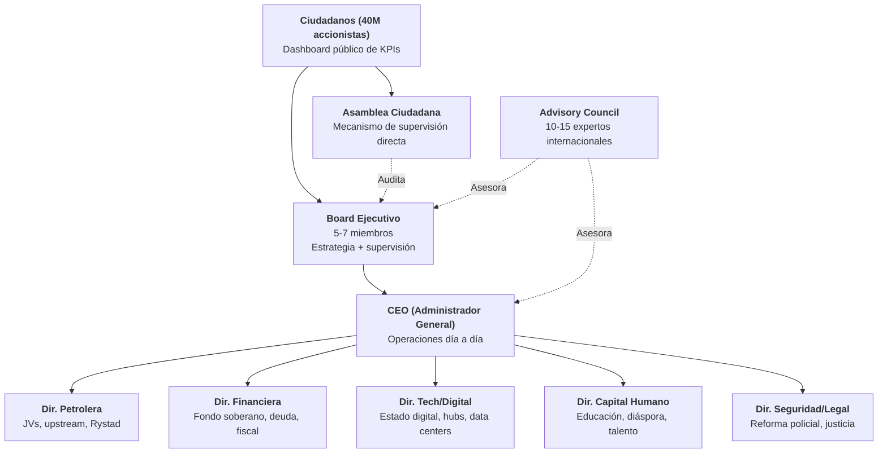
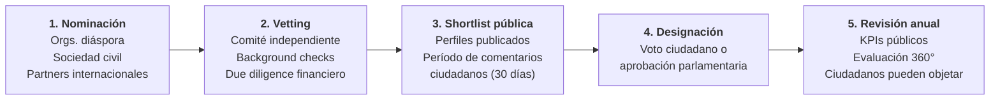

# Execution Team

:::danger Blind spot #1 of the plan
7 of 19 evaluating perspectives (Lee Kuan Yew, Bukele, Musk, VCs, Unicorns, Oppenheimer, VisualPolitik) identified the same critical flaw: **no execution team defined**. Severity: 3/10 (CRITICAL). A plan without a team is a document. A plan with a team is an organization.
:::

## The YC Analogy

Y Combinator invests in **teams**, not ideas. The Venezuela S.A. plan is the idea — this chapter is the **team slide**.

As Garry Tan said: *"Who is the CEO? Who is the CTO? If you can't answer that, you don't have a company — you have a PDF."*

The plan has a thesis, projections, sources, and structure. What is missing is what turns documents into organizations: **names, commitments, and accountability**.

This section does not name people — that is an operational task. It defines the **roles, profiles, selection process, and accountability framework** so that when the time comes, the structure already exists.

## Organizational Structure

:::info Relationship with the existing PMO
This structure complements the [execution org chart (PMO)](/06-realidad/esg-ejecucion) and aligns with the [sovereign fund](/02-motor-financiero/fondo-soberano) governance. The Executive Board reports to both the Fund Council and citizens.
:::

## Required Profiles by Role

| Role | Required Profile | Minimum Experience | Ideal Origin | Example Profile (not people) |
|-----|-----------------|-------------------|-------------|-------------------------------|
| **CEO** | Former CEO of large corporation or sovereign fund | **15+ years** executive leadership, bilingual ES/EN | Venezuelan diaspora or international with country connection | Someone who has managed USD 1B+ operations with public accountability |
| **Oil Director** | Former VP of major oil company or energy consultancy | **15+ years** in upstream/midstream, Orinoco Belt knowledge | Former pre-2002 PDVSA, Rystad, IHS, Wood Mackenzie | Profile that understands both geology and international JVs |
| **Finance Director** | Former MD of investment bank or sovereign restructuring | **12+ years** in sovereign debt, emerging markets | Wall Street, City of London, with LATAM experience | Someone who has led USD 10B+ debt restructurings |
| **Tech/Digital Director** | Former CTO/VP of BigTech or successful founder | **10+ years** in cloud infrastructure, data centers, digital government | Silicon Valley, Europe, willing to relocate | Profile that has scaled platforms with millions of users |
| **Human Capital Director** | Former education minister or president of major university | **12+ years** in educational reform or large-scale talent management | LATAM or international with crisis-system experience | Someone who has transformed national education systems |
| **Security/Legal Director** | Former leader of police/military reform | **10+ years** in institutional security reform | Experience with Georgia, Colombia, or Chile models | Profile that has reduced organized crime with verifiable metrics |
| **Board (5-7)** | Multidisciplinary mix with corporate governance | **10+ years** on boards of public companies or funds | **3+ diaspora**, **2+ local**, **1-2 international** | Profiles with track record in transparency and accountability |
| **Advisory Council** | World-class experts by domain | International recognition in their field | Global, pro bono or compensated | Academics, former sovereign fund officials, former CEOs |

## 10 Non-Negotiable Criteria

Every candidate for any executive position must meet **all 10 without exception**:

| # | Criterion | Verification |
|---|---------|-------------|
| 1 | **Non-partisan** — no active political affiliation | Sworn declaration + public verification |
| 2 | **No ties to regimes** — neither current nor past | Independent investigation |
| 3 | **Verifiable track record** — public CV, auditable achievements | Vetting committee + due diligence |
| 4 | **Financial disclosure** — declared net worth upon entry | Published on citizen dashboard |
| 5 | **Minimum 5-year commitment** — no executive tourism | Binding contract with penalties |
| 6 | **No conflicts of interest** — neither direct nor indirect | Business relationship audit |
| 7 | **Bilingual** — Spanish + English minimum | Interview in both languages |
| 8 | **Willing to relocate** — based in Venezuela | Contractual residency commitment |
| 9 | **International background check** — FCPA/UK Bribery Act standard | External due diligence firm |
| 10 | **Public commitment** — visible names and faces | Public presentation + citizen access |

:::caution These rules exist for a reason
Venezuela has had decades of officials without accountability. The plan's [anti-corruption framework](/04-gobernanza/anticorrupcion-checklist) applies with maximum rigor to these roles. No exceptions, no "temporary flexibilities."
:::

## Selection Process

| Phase | Duration | Responsible | Output |
|------|---------|------------|---------|
| Nomination | 60 days | Civil society coalition + diaspora | Long list of 50-100 candidates |
| Vetting | 90 days | Independent committee (3 Venezuelans + 2 international) | Short list of 15-20 candidates |
| Public shortlist | 30 days | Citizen digital platform | Public feedback, documented objections |
| Appointment | 30 days | Democratic mechanism (to be defined) | Executive team named |
| Review | Annual | Board + Citizen Assembly | Continuity, adjustment, or removal |

## Compensation Model

:::info The Singapore Lesson
Lee Kuan Yew paid his ministers **salaries competitive with the private sector** — USD 1M+ annually. His argument: *"Pay them well or lose them to the private sector, or worse, to corruption."* The NBIM (Norway sovereign fund) model follows the same logic [Requires research].
:::

| Component | Structure | Reference |
|-----------|-----------|-----------|
| **Base salary** | Competitive with international private sector (75th percentile) | Korn Ferry/Mercer benchmarks for emerging markets [Requires research] |
| **Performance bonus** | 0-100% of base salary, tied to **quarterly public KPIs** | Model similar to Norwegian sovereign fund CEO (NBIM) |
| **Symbolic equity** | Equivalent citizen bonds — their compensation rises if Venezuela rises | Startup-style incentive alignment |
| **Clawback** | Total return of bonuses if **misconduct, corruption, or undisclosed conflict of interest** is detected | Dodd-Frank standard for public company executives |
| **Pension** | Standard contributory — no lifetime privilege pensions | Estonia/Singapore model |

## Recruitment Pipeline

| Channel | Estimated Pool | Strategy |
|-------|-------------|-----------|
| **Venezuelan diaspora** | **7.9M people** ([UNHCR, Dec. 2025](https://www.unhcr.org/)) — thousands in global leadership positions | Activation via professional networks in US, Spain, Colombia, Chile |
| **International headhunting** | Firms such as Egon Zehnder, Spencer Stuart, Heidrick & Struggles | Specific mandate with non-negotiable criteria |
| **Multilaterals** | World Bank, IDB, CAF — institutional reform talent pools | Formal partnerships for secondments |
| **Venezuelan professional networks** | Harvard Venezuela Project, VenAmerica, IESA Alumni, etc. | Recruitment ambassadors in each network |
| **Local talent** | Community leaders, surviving entrepreneurs, professionals who stayed | Parallel process — not all solutions come from outside |

:::caution Diaspora-local balance
The team **cannot be diaspora-only**. Those who stayed have irreplaceable ground knowledge. The target: **minimum 40% of the expanded team must be local talent**. Reconstruction is not imposed from outside.
:::

## Accountability Framework

| Mechanism | Frequency | Audience | Consequence |
|-----------|-----------|-----------|-------------|
| **KPI Dashboard** | Quarterly | Public (40M citizens) | Total transparency — anyone can audit |
| **Management Report** | Semi-annual | Board + Citizen Assembly | Public questions, mandatory answers |
| **Independent Audit** | Annual | International firm (Big Four + local auditor) | Full publication of results |
| **360-Degree Review** | Annual | Peers, subordinates, Board, citizens | Input for continuity decisions |
| **Automatic Removal Triggers** | Continuous | Executive Board | **2 consecutive quarters without meeting KPIs**, integrity violation, undisclosed conflict of interest |

:::danger No immunity
No member of the executive team has judicial immunity. The Attorney General — who [never reports to the executive](/06-realidad/esg-ejecucion) — has full jurisdiction. This is not government; it is an organization with shareholders who demand results.
:::

## Connection to the Plan

| Plan Section | Relationship with the Execution Team |
|-----------------|-------------------------------|
| [Sovereign Fund](/02-motor-financiero/fondo-soberano) | The Executive Board coordinates with the Fund Council — parallel governance |
| [ESG and Execution (PMO)](/06-realidad/esg-ejecucion) | The PMO org chart integrates under the execution team CEO |
| [Anti-corruption](/04-gobernanza/anticorrupcion-checklist) | The 10 non-negotiable criteria are the executive version of the anti-corruption checklist |
| [Timeline](/07-ejecucion/timeline) | Phase A (2027-2031) requires the full team before launch |
| [Diaspora](/03-ciudadanos/diaspora) | Primary source of talent for leadership roles |

:::tip The first real milestone
This section is deliberately a **framework without names**. The first real milestone of Venezuela S.A. is filling these roles. When the Board has names, signed commitments, and published KPIs, the plan transitions from document to organization. Until then, it is a PDF — and PDFs do not rebuild countries.
:::
