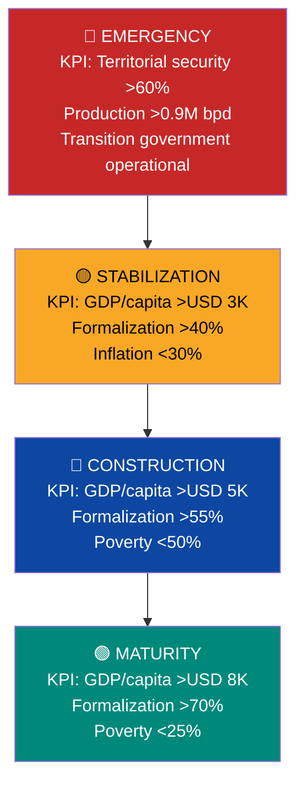

# Activation KPIs: Conditions, Not Calendar

> The plan does not execute on dates. It executes on **verifiable conditions**. Each phase activates when specific KPIs are met — if the economy grows fast, it accelerates; if there is a crisis, it waits. The plan adapts to reality, not the other way around.

:::danger Principle: zero date promises, only condition promises
Promising "in 5 years there will be X" is irresponsible in a country with 82.8% poverty and zero institutions. What CAN be promised: "when these verifiable conditions are met, this activates." [Singapore adjusted the CPF 50+ times in 60 years](https://www.cpf.gov.sg/). We will adjust according to reality.
:::

---

## General Activation Map

---

## Phase 1: Emergency

:::danger Activation: automatic (current conditions)
This phase starts on Day 1 because the conditions already exist: failed state, 82.8% poverty, oil production at historic lows, institutions destroyed.
:::

### Entry KPIs (current conditions)
| KPI | Current value | Source |
|-----|--------------|--------|
| GDP per capita | USD 2,075 | IMF |
| Poverty | 82.8% | ENCOVI 2023 |
| Oil production | ~1M bpd | OPEC/IEA |
| Informality | >70% | ENCOVI |
| Homicides/100K | ~30-40 | World Population Review |

### What Activates
| Action | Activation condition | Exit KPI |
|--------|---------------------|----------|
| **FCV at 14%** (retirement 8% + health 6%) | FCV law approved + administrative entity operational | >2M active FCV accounts |
| **Basic K-12 voucher** (USD 163/month) | Education budget allocated + digital voucher platform operational | >3M students with active voucher |
| **Pillar 1 pension** (USD 50/month) | Budget approved + verified retiree registry | >4M retirees receiving monthly payment |
| **FONASA healthcare** (Tramo A/B zero copay) | FCV Health operational + minimum network of concession hospitals | >20M citizens with FONASA coverage |
| **Ministry merger** (34 to 18) | Executive decree + employee transition plan | <20 operational ministries |
| **Territorial security** | Control >60% of territory + police reform initiated | Homicides declining quarter over quarter |
| **Formal dollarization** | Decree + reformed Central Bank | Inflation <50% annual |

### Exit KPIs (to advance to Stabilization)
| KPI | Threshold | How it is measured |
|-----|----------|-------------------|
| GDP per capita | >USD 3,000 | IMF/World Bank (annual) |
| Labor formalization | >40% of workforce | FCV records (active contributors / labor force) |
| Inflation | <30% annual | Reformed BCV / independent indicator |
| Territorial control | >75% of territory under state control | Interior Ministry (security map) |
| Active FCV accounts | >5M | FCV administrative entity |
| Oil production | >1.3M bpd | OPEC / IEA |

---

## Phase 2: Stabilization

### Entry KPIs
| KPI | Required threshold |
|-----|-------------------|
| GDP per capita | >USD 3,000 |
| Formalization | >40% |
| Inflation | <30% |
| Territorial control | >75% |

### What Unlocks
| Action | Activation condition | Exit KPI |
|--------|---------------------|----------|
| **FCV rises to 18%** (housing 4% added) | GDP/capita >USD 3K + formalization >40% | >500K accounts with active housing sub-account |
| **K-12 voucher grows** (USD 214/month + transport) | Tax revenue >USD 8B/year | >5M students with full voucher |
| **Pillar 1 pension increases** (USD 100/month) | Sustainable budget without >20% oil deficit | >4.5M retirees at USD 100/month |
| **Schools transition to enterprises** (30-50%) | >1,000 schools with accreditation as autonomous enterprise | Parent NPS >60% at autonomous schools |
| **Ministry merger** (18 to 12) | Digitalization >50% of procedures | <14 operational ministries |
| **First infrastructure concessions** | Concession legal framework approved + 3+ tenders closed | >USD 2B in concession investment |
| **University: active merit voucher** | Evaluation system operational + accredited universities | >100K students with university voucher |

### Exit KPIs (to advance to Construction)
| KPI | Threshold | How it is measured |
|-----|----------|-------------------|
| GDP per capita | >USD 5,000 | IMF/WB |
| Formalization | >55% | FCV records |
| Poverty | <50% | ENCOVI/independent survey |
| Tax revenue | >USD 12B/year | Ministry of Finance |
| Oil production | >1.7M bpd | OPEC/IEA |
| Homicides/100K | <15 | Interior Ministry |
| Autonomous schools | >50% | Education Quality Agency |

---

## Phase 3: Construction

### Entry KPIs
| KPI | Required threshold |
|-----|-------------------|
| GDP per capita | >USD 5,000 |
| Formalization | >55% |
| Poverty | <50% |

### What Unlocks
| Action | Activation condition | Exit KPI |
|--------|---------------------|----------|
| **FCV rises to 23%** (education 2% + severance 2% added) | GDP/capita >USD 5K + formalization >55% | >10M FCV accounts with 5 active sub-accounts |
| **Full K-12 voucher** (USD 265/month + extracurriculars) | Revenue >USD 15B/year | >7M students with full voucher + sports + arts |
| **Health introduces individual Medisave** | GDP/capita >USD 5K + FCV Health with average balance >USD 500/account | >5M accounts with Medisave component |
| **Ministry merger** (12 to 10) | Digitalization >80% of procedures | 10 operational ministries |
| **Schools 80%+ autonomous** | Quality Agency operational >3 years + published evaluations | Venezuela participates in PISA |
| **VSA Investment Fund viable** | Oil revenues to fund >USD 5B/year accumulated | Fund >USD 30B |
| **Data centers operational** | Guri rehabilitated >80% capacity + fiber optics in 3+ hubs | >100 MW in operational data centers |

### Exit KPIs (to advance to Maturity)
| KPI | Threshold | How it is measured |
|-----|----------|-------------------|
| GDP per capita | >USD 8,000 | IMF/WB |
| Formalization | >70% | FCV records |
| Poverty | <25% | ENCOVI |
| Oil production | >2.5M bpd | OPEC/IEA |
| Tax revenue | >USD 20B/year | Ministry of Finance |
| Homicides/100K | <8 | Interior Ministry |
| Oil as % of total revenues | <40% | Venezuela S.A. Dashboard |
| VSA Investment Fund | >USD 100B | External audit |

---

## Phase 4: Maturity

### Entry KPIs
| KPI | Required threshold |
|-----|-------------------|
| GDP per capita | >USD 8,000 |
| Formalization | >70% |
| Poverty | <25% |

### What Unlocks
| Action | Activation condition | Exit KPI |
|--------|---------------------|----------|
| **FCV rises to 27%** (retirement 10% + housing 5% + education 3%) | GDP/capita >USD 8K + formalization >70% | >15M FCV accounts at 27% |
| **Active citizen dividend** | VSA Investment Fund >USD 100B + returns >USD 5B/year | >35M Venezuelans receiving annual dividend |
| **State lives 100% on taxes** | Tax revenue covers 100% of budget without oil | Oil: 0% to budget, 100% to fund |
| **Pillar 1 pension increases** (USD 200/month) | Budget + fund returns sustain it | Replacement rate >60% (FCV Retirement + Pillar 1) |
| **10 ministries, 265K employees** | Digitalization >95% + AI in policing/justice/tax | Employee/population ratio <1:150 |
| **Taxes decrease** (15% to 12% flat) | Tax base >25M contributors + revenue >USD 25B | Same revenue at lower rate |

---

## Area-Specific Activations

### FCV — Sub-accounts

| Sub-account | Activates when | Increases when |
|-------------|---------------|----------------|
| **Retirement (8%)** | FCV operational (Day 1 of the law) | GDP/capita >USD 8K: rises to 10% |
| **Health (6% to 7%)** | FCV operational (Day 1) | Formalization >55%: rises to 7% + introduces Medisave |
| **Housing (4%)** | GDP/capita >USD 3K + formalization >40% | GDP/capita >USD 8K: rises to 5% |
| **Education (2%)** | GDP/capita >USD 5K + formalization >55% | GDP/capita >USD 8K: rises to 3% |
| **Severance (2%)** | GDP/capita >USD 5K + formalization >55% | Stays at 2% (stable) |

### Education Voucher

| Voucher level | Activates when | What it covers |
|---------------|---------------|---------------|
| **Basic (USD 163/month)** | Education budget allocated | Tuition + cafeteria + materials |
| **Intermediate (USD 214/month)** | Tax revenue >USD 8B/year | + Transport |
| **Full (USD 265/month)** | Revenue >USD 15B/year | + Extracurriculars (1 sport + 1 art) |
| **Premium (USD 295/month)** | Revenue >USD 25B/year | + Tablet/laptop + premium insurance |

### Ministries

| Reduction | Activates when |
|-----------|---------------|
| 34 to 18 | Executive decree + employee transition plan approved |
| 18 to 12 | Digitalization >50% of procedures + verified labor absorption (formal unemployment <10%) |
| 12 to 10 | Digitalization >80% of procedures + formal unemployment <8% |

### Sanctions (OFAC Roadmap)

| Phase | Activates when | What unlocks |
|-------|---------------|-------------|
| **0: COMPLETED** | [License 46B issued March 14, 2026](https://www.infobae.com/venezuela/2026/03/14/eeuu-autorizo-a-las-empresas-estadounidenses-realizar-negocios-con-el-sector-petrolero-venezolano/) | All U.S. companies can operate |
| **1: Expanded upstream** | Transition government + electoral timetable with date | Oil major JVs at scale |
| **2: Full oil & gas** | Elections held (OAS/EU certified) + prisoners released | LNG, refineries, gas |
| **3: Financial sector** | Elected government + judicial reforms + counter-narcotics cooperation | International banking, bonds, VIN |
| **4: Tech/services** | 2+ years of democracy + verified human rights + Cuba disconnected | Data centers, VC/PE, tech |
| **5: Normalization** | Democratic track record + debt restructured | Investment grade, capital markets |

---

## Monitoring Dashboard

Each KPI is measured with defined frequency and source:

| KPI | Frequency | Source | Publication |
|-----|----------|--------|-------------|
| GDP per capita | Quarterly | IMF / reformed BCV | Venezuela S.A. Dashboard (public) |
| Formalization | Monthly | FCV records (active accounts / labor force) | Venezuela S.A. Dashboard |
| Poverty | Semi-annual | Independent ENCOVI / World Bank | Open publication |
| Oil production | Monthly | OPEC + IEA + Venezuela S.A. | Public dashboard |
| Tax revenue | Monthly | Ministry of Finance | Digital fiscal portal |
| Homicides/100K | Monthly | Interior Ministry + independent NGO | Security dashboard |
| Inflation | Monthly | Reformed BCV + independent index | Public |
| Active FCV accounts | Real-time | FCV administrative entity | Citizen FCV app |
| VSA Investment Fund | Quarterly | External audit (Santiago Principles) | Public dashboard |
| Autonomous schools (%) | Semi-annual | Education Quality Agency | Education portal |

:::tip Transparency = accountability
**Every KPI is public, real-time, auditable.** If a KPI is not met, the next phase does not activate — period. There is no "presidential decree that accelerates phases." There is no "special situation that justifies skipping conditions." **The conditions are the conditions.** If Venezuela can publish a real-time oil production dashboard, it can publish one for poverty.
:::

---

**Sources:** [Singapore CPF historical adjustments](https://www.cpf.gov.sg/) | [Estonia e-gov KPIs](https://e-estonia.com/) | [Chile SEP indicators](https://www.agenciaeducacion.cl/) | [OPEC Monthly Oil Market Report](https://www.opec.org/) | [IMF World Economic Outlook](https://www.imf.org/)
