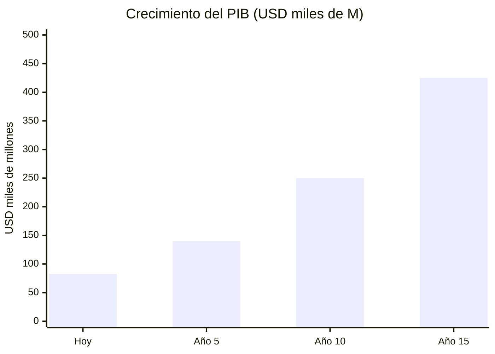
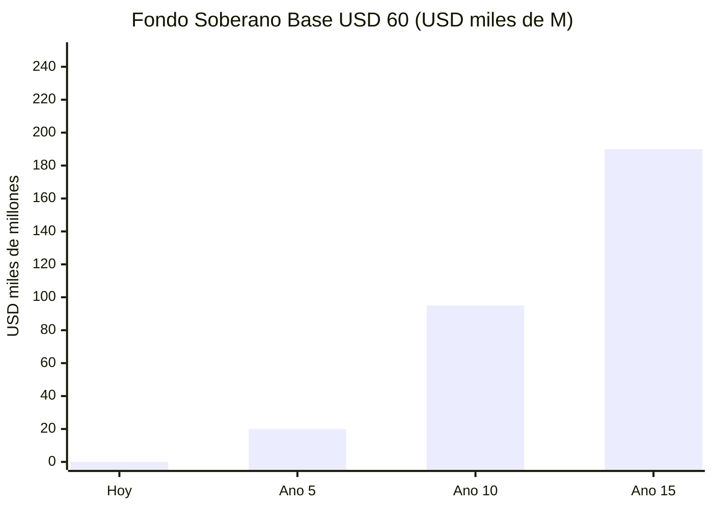
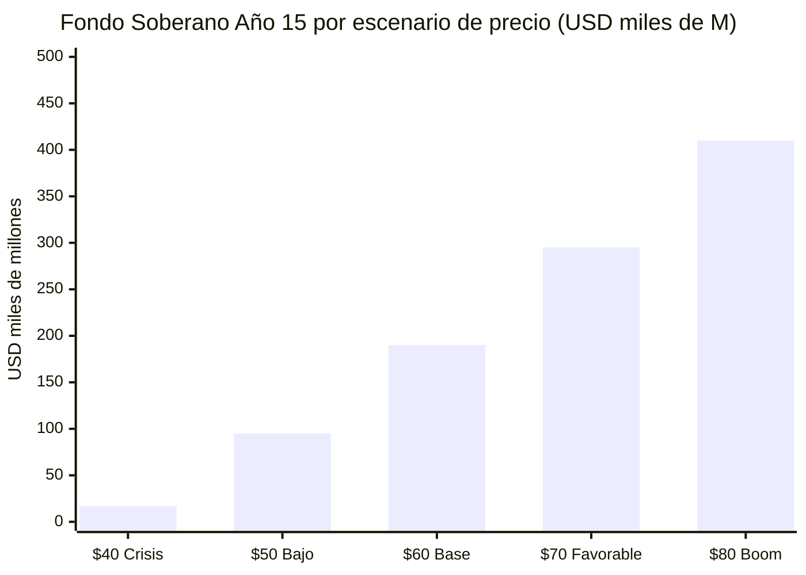

# Consolidated Projections (Base: USD 60/barrel)





| Indicator | Today | Year 5 | Year 10 | Year 15 |
|-----------|-----|--------|---------|---------|
| Production | ~1M bpd | 1.5–2M | 2–2.5M | 2.5–3M |
| GDP | USD 83B | 120–160B | 200–300B | 250–350B |
| Sovereign Fund | USD 0 | 15–25B | 70–120B | 160–220B |
| Dividend/person | USD 0 | 5–10 | 15–25 | 22–30 |
| Fund return (5.5%) | USD 0 | 825–1,375M | 3,850–6,600M | 8,800–12,100M |

Calculation: fund x 5.5% return x 10% payout / 40M people. See [stress test below](#sensitivity-analysis-stress-test-by-oil-price) for the explicit model. At USD 70-80/barrel, figures multiply — see [The Dream](/07-ejecucion/el-sueno).

:::tip If Brent averages USD 80 instead of USD 60
The fund would grow to USD 500B+ and dividends would double. At USD 60 the plan works. Anything above is a bonus.
:::

---

## Sensitivity Analysis: Stress Test by Oil Price

The plan uses USD 60/barrel as a conservative base ([EIA STEO, Mar. 2026](https://www.eia.gov/outlooks/steo/)). But price is the most volatile variable. This table shows the impact under each scenario.

### Model Assumptions

```
Year 5 Production:  1.75M bpd (midpoint of 1.5–2M range)
Year 10 Production: 2.25M bpd (midpoint of 2–2.5M range)
Year 15 Production: 2.75M bpd (midpoint of 2.5–3M range)
Cost per barrel:    USD 37.50 (average USD 35–40, heavy crude)
Fund contribution:  30% of net oil revenue
Fund return:        5.5% annual (conservative average of 4–7% range)
Dividend:           10% of fund net income to 40M people
```

Source for costs and returns: [data-standards.md](/referencias) — barrel cost USD 35–40 (extraction + blending + transport + processing); fund return 4–7% annual (conservative vs. [Norway 15.1% in 2025](https://www.cnbc.com/2026/01/29/norway-sovereign-wealth-fund-2025-return-nbim-trillion-oil-stocks-tech-ai-banks-silver.html)).

### Explicit Calculation (Base Scenario example, Year 5)

```
Gross revenue    = 1,750,000 bpd × 365 days × USD 60  = USD 38,325M
Operating cost   = 1,750,000 bpd × 365 days × USD 37.50 = USD 23,953M
Net revenue      = USD 38,325M − USD 23,953M = USD 14,372M
Fund contribution = 30% × USD 14,372M = USD 4,312M/year
```

| Scenario | Price | Margin/barrel | Net Revenue Year 5 | Net Revenue Year 10 | Accumulated Fund Year 15 | Dividend/person/year |
|-----------|--------|---------------|---------------------|----------------------|------------------------|-----------------------|
| **Crisis** | USD 40 | USD 2.50 | USD 1,597M | USD 2,054M | USD 15,000–20,000M | USD 2–5 |
| **Low** | USD 50 | USD 12.50 | USD 7,984M | USD 10,269M | USD 80,000–110,000M | USD 11–15 |
| **Base** | **USD 60** | **USD 22.50** | **USD 14,372M** | **USD 18,484M** | **USD 160,000–220,000M** | **USD 22–30** |
| **Favorable** | USD 70 | USD 32.50 | USD 20,759M | USD 26,699M | USD 250,000–340,000M | USD 34–47 |
| **Boom** | USD 80 | USD 42.50 | USD 27,147M | USD 34,914M | USD 350,000–470,000M | USD 48–65 |



:::danger Scenarios < USD 50: Risk Zone
At **USD 40/barrel**, the net margin collapses to USD 2.50/barrel — barely covering operating costs. The sovereign fund grows minimally and citizen dividends are symbolic. At this price:
- No capital for tech infrastructure investment
- Debt restructuring becomes unsustainable
- Stabilization fund + price floor in forward contracts required

**Mitigation:** Forward contracts include a guaranteed minimum price (floor) of USD 55. If Brent falls below USD 50 for more than 2 quarters, the stabilization fund activates.
:::

:::tip Scenarios > USD 70: Acceleration
At **USD 70+**, each additional dollar generates ~USD 639M/year in extra net revenue (at 1.75M bpd). At **USD 80**, the fund reaches levels that enable:
- Citizen dividends of USD 48–65/person/year (family of 4: USD 192–260)
- 100% financing of tech infrastructure with no additional debt
- Reaching [Norway's population-adjusted fund level](https://www.nbim.no/en/investments/the-funds-value/) in ~20 years instead of 30

**Every USD 1 above USD 60 is direct upside to the sovereign fund.**
:::

### Methodological Note

The accumulated fund at Year 15 includes: (1) annual contributions of 30% of net oil revenue over 15 years, with production growing per [Rystad Energy](https://www.rigzone.com/news/could_venezuela_production_get_back_to_3mm_barrels_per_day-08-jan-2026-182716-article/); (2) compound return at 5.5% annually; (3) does NOT include diversification revenue (tech, tourism, agro) which is added separately. Ranges reflect variations in the production ramp-up pace.
