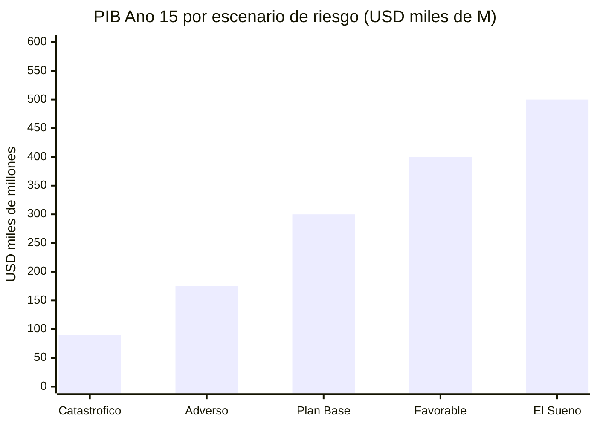
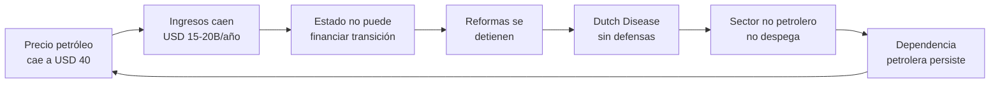
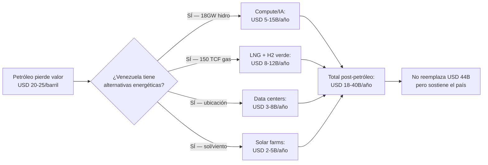

# Risks: Threat Matrix and Mitigation

> No plan survives contact with reality without an honest assessment of what can go wrong. This section identifies 20 risks, quantifies their impact, and proposes concrete mitigations.

:::danger Plan rule
If a risk has no mitigation, it is not ignored — it is flagged as an open vulnerability.
:::

---

## Risk Matrix: Probability x Impact

| # | Risk | Prob. | Impact | Severity | Ref. |
|---|--------|-------|---------|-----------|------|
| 1 | **Political instability** — transition fails or reverses | High | Critical | CRITICAL | — |
| 2 | **Corruption captures the fund** — FONDEN 2.0 | High | Critical | CRITICAL | [Sovereign fund](/02-motor-financiero/fondo-soberano) |
| 3 | **FANB as economic actor** — military blocks reforms that affect their businesses | High | Critical | CRITICAL | [Security](/04-gobernanza/seguridad-fisica) |
| 4 | **Dutch Disease** — oil appreciates currency and destroys other sectors | Medium-High | High | HIGH | [Dutch Disease](/02-motor-financiero/enfermedad-holandesa) |
| 5 | **Absorption capacity** — no projects or people to spend USD 183B in 15 years | Medium-High | High | HIGH | [Human capital](/05-transformacion/capital-humano) |
| 6 | **Citizen distrust** — decades of broken promises | High | Medium | HIGH | [Those who stayed](/03-ciudadanos/los-que-se-quedaron) |
| 7 | **Permanent brain drain** — diaspora does not return and local talent emigrates | Medium | High | HIGH | [Human capital](/05-transformacion/capital-humano) |
| 8 | **Sanctions remain/tighten** — U.S. does not lift restrictions | Medium | High | HIGH | [Geopolitics](/04-gobernanza/geopolitica) |
| 9 | **China/Russia demand payment** — USD 50B+ in debt with conditions | Medium | High | HIGH | [Debt](/02-motor-financiero/deuda) |
| 10 | **Populism captures the process** — new government spends the fund | Medium | Critical | HIGH | [Sovereign fund](/02-motor-financiero/fondo-soberano) |
| 11 | **Oil price < USD 50** due to accelerated energy transition | Medium-Low | High | MEDIUM | — |
| 12 | **Creditors block assets** — USD 19B in Citgo claims | Medium | Medium | MEDIUM | [Debt](/02-motor-financiero/deuda) |
| 13 | **Climate change reduces Guri** — droughts affect hydroelectric generation | Medium-Low | High | MEDIUM | — |
| 14 | **Regional competition** — Colombia, Guyana, Brazil capture investment first | Medium | Medium | MEDIUM | — |
| 15 | **Transitional justice fails** — neither justice nor reconciliation | Medium-High | Medium | MEDIUM | [Transitional justice](/04-gobernanza/justicia-transicional) |
| 16 | **Insecurity persists** — armed groups do not demobilize | Medium | High | MEDIUM | [Security](/04-gobernanza/seguridad-fisica) |
| 17 | **Global energy transition** — crude demand falls faster than expected | Low-Medium | High | MEDIUM | — |
| 18 | **Infrastructure collapses** — not rehabilitated in time | Medium-Low | Medium | LOW | — |
| 19 | **Pandemic/global crisis** — exogenous shock | Low | High | LOW | — |
| 20 | **Guyana territorial dispute** — Esequibo escalates to conflict | Low | Medium | LOW | — |

---

## Critical Risk Details

### 1. Political Instability

**The existential risk.** Without political transition, the plan doesn't start. With a transition that reverses, everything invested is lost.

| Scenario | Probability | Impact |
|-----------|-------------|---------|
| Successful and sustained transition | 35-40% | Plan works |
| Partial transition (half-measures) | 30-35% | Base plan with delays |
| Transition fails/reverses | 25-35% | Plan freezes |

**Mitigation:**
- Pre-Seed launches without government (diaspora + private sector)
- Forward contracts with protection clauses against regime change
- Constitutional reforms with 2/3 lock + referendum
- International pressure tied to market access

### 2. Corruption Captures the Fund

Venezuela diverted **USD 300B+** via FONDEN between 2005-2015 with zero accountability ([Transparencia Venezuela](https://transparenciave.org/)). History repeating is risk #1 according to all 9 evaluators on the perspectives panel.

**Mitigation:** See [Sovereign fund governance](/02-motor-financiero/fondo-soberano) — 6 layers of oversight, constitutional locks, anti-capture mechanisms.

### 3. FANB as Economic Actor

The FANB controls parts of the economy: illegal mining, fuel smuggling, border drug trafficking, food imports ([InSight Crime, 2024](https://insightcrime.org/)). Any reform that threatens these revenues will face armed institutional resistance.

**Mitigation:**
- DDR adapted for military-economic component
- Reintegration program with incentives (see [Physical security](/04-gobernanza/seguridad-fisica))
- Gradual military reform: reduce personnel from ~350,000 to ~120,000 with dignified retirement packages
- International cooperation (U.S./Colombia) as counterweight

### 4. Dutch Disease

With USD 65B/year in oil (optimistic scenario), the risk of currency appreciation and destruction of non-oil sectors is real. Nigeria and pre-2000 Venezuela itself are warnings.

**Mitigation:** See [Dutch Disease](/02-motor-financiero/enfermedad-holandesa) — 6 defense mechanisms including 100% external fund, fiscal sterilization, and compensatory ZEETs.

### 5. Absorption Capacity

Spending USD 183B in 15 years requires ~12B/year in oil projects + infrastructure. With weak institutions, this produces cost overruns and corruption. Angola spent USD 68B on infrastructure (2002-2012) with ~30% lost to inefficiencies ([Brookings](https://www.brookings.edu/)).

**Mitigation:**
- Gradual ramp-up: USD 3-5B/year (years 1-3) -> USD 8-12B (years 4-7) -> USD 12-15B (years 8-15)
- PPP concessions with experienced international operators
- Cost benchmarking per project vs. regional comparables
- See [Human capital](/05-transformacion/capital-humano) for talent gap solution

---

## Risks by Economic Engine

| Engine | Primary Risk | P | Impact | Mitigation |
|-------|-----------------|---|---------|-----------|
| Oil | Sustained price < USD 50 | Medium-Low | USD -15B/year | Floor USD 55 in forwards + stabilization fund |
| Gas | Sanctions block Dragon/LNG | Medium | USD -5B/year | Diversify buyers (Colombia, Brazil) |
| Mining | Not formalized / armed conflict | Medium-High | USD -9B/year | Prioritize gold + iron with security first |
| Tech/Data centers | Regional competition wins | Medium | USD -6B/year | Cheap energy as advantage; early-mover |
| Tourism | Insecurity persists | Medium | USD -7B/year | Safe pilot zones (Los Roques, Canaima) |
| Agroindustry | No land reform | Medium | USD -5B/year | Property titles + microfinance |
| Renewables | Guri collapses (climate change) | Low-Medium | USD -2B/year | Solar + wind as backup |

---

## Cumulative Impact Scenarios

| Scenario | Risks Materialized | GDP Year 15 | Fund | vs. Base Plan |
|-----------|----------------------|-----------|-------|--------------|
| **Catastrophic** | Transition fails + oil < $50 | USD 80-100B | < USD 10B | -70% |
| **Adverse** | Partial reforms + 3 high risks | USD 150-200B | USD 50-100B | -40% |
| **Base Plan** | 5-6 conditions met + managed risks | USD 250-350B | USD 150-250B | Reference |
| **Favorable** | 7-8 conditions met | USD 350-450B | USD 250-400B | +30% |
| **The Dream** | All conditions met | USD 450-550B | USD 400-540B | +60% |

:::info The plan is designed for the adverse, measured by the base
If we assume 3-4 high risks materialize (the most likely outcome), the country still doubles its GDP in 15 years. That is transformational from the current starting point of USD 83B.
:::

---

## Risk Correlation: Cascade Scenarios

Risks are not independent. A failure in one dimension amplifies others. These 3 scenarios show how 2-3 risks chain together:

### Cascade 1: Political Failure -> Economic Spiral

| Stage | Probability | Impact on GDP Year 15 | Ref. |
|-------|-------------|----------------------|------|
| Partial/failed transition | 35-40% | — | [V-Dem Institute](https://www.v-dem.net/) |
| Sanctions maintained | Conditional: 70% if transition fails | -USD 30-40B/year | [OFAC](https://www.treasury.gov/ofac) |
| Investment < USD 50B (vs. 183B plan) | Conditional: 80% | GDP < USD 120B | Rystad Energy |
| **Joint outcome** | **~20%** | **GDP USD 80-120B** (catastrophic scenario) | — |

### Cascade 2: Oil Shock -> Fiscal Crisis

| Stage | Probability | Impact | Ref. |
|-------|-------------|---------|------|
| Sustained oil < USD 40 (3+ years) | 15-20% | -USD 15B/year vs. base USD 60 | [EIA STEO](https://www.eia.gov/outlooks/steo/) |
| Energy transition accelerates demand decline | Conditional: 60% post-2035 | Oil irrelevant post-2040 | [IEA Net Zero](https://www.iea.org/reports/net-zero-by-2050) |
| Dutch Disease without fund to counter | Conditional: 50% without forwards | Real exchange rate kills exports | [IMF WP](https://www.imf.org/) |
| **Joint outcome** | **~10%** | **GDP USD 130-180B** (adverse, no-exit loop) | — |

**Key mitigation:** [Oil forwards](/02-motor-financiero/contratos-forward) with USD 55 floor + [accelerated diversification](/02-motor-financiero/enfermedad-holandesa) break the cycle between stages 2 and 3.

### Cascade 3: Institutional Capture -> Fund Looted

| Stage | Probability | Impact | Ref. |
|-------|-------------|---------|------|
| Populism captures government | 25-30% over 15 years | — | [V-Dem](https://www.v-dem.net/), LATAM history |
| Fund board captured | Conditional: 40% without constitutional locks | — | [FONDEN: USD 300B+ diverted](https://transparenciave.org/) |
| Fund spent in 5-10 years | Conditional: 80% if board captured | Fund -> USD 0 | Precedent: Venezuela 2005-2015 |
| **Joint outcome** | **~8-10%** | **Total loss of the fund** | — |

**Key mitigation:** The [6 anti-capture mechanisms](/02-motor-financiero/fondo-soberano) (offshore custody, independent board, 4/5 supermajority, whistleblower, international audit) are specifically designed to break this cascade at stage 2.

### Joint Cascade Probability

| Scenario | P(full cascade) | Impact | Does the plan survive? |
|-----------|--------------------|---------|--------------------|
| **Political failure** | ~20% | GDP USD 80-120B, fund < USD 10B | No — Plan B required (see [catastrophic scenarios](#cumulative-impact-scenarios)) |
| **Oil shock** | ~10% | GDP USD 130-180B, fund USD 50-80B | Partially — if diversification started |
| **Institutional capture** | ~8-10% | Fund USD 0, FONDEN 2.0 | No — history repeats |
| **Two simultaneous cascades** | ~3-5% | Total collapse | No |
| **No cascade** | ~55-60% | Base Plan or better | Yes |

:::caution The 40% probability of at least one cascade is real
That is why the plan cannot depend on the favorable scenario. The [Base Plan](/07-ejecucion/proyecciones) assumes 3-4 materialized risks and still doubles GDP. Cascades are the case where defenses fail simultaneously — unlikely but not impossible. The redundancy of mitigations (forwards + locks + custody + diversification) exists precisely so that no chain completes.
:::

---

## Stress Test: Oil Irrelevant by 2040 (Musk/IEA Thesis)

:::danger This is the risk the original plan underestimates
Elon Musk, Ray Dalio, and the IEA agree: the energy transition may make oil irrelevant sooner than Rystad assumes. If solar + batteries are cheaper than extracting heavy crude from the Orinoco Belt by 2035-2040, the base plan collapses. This stress test models that scenario.
:::

### Post-Oil Scenario Assumptions

| Variable | Base Plan | Post-Oil Scenario | Source |
|----------|----------|------------------------|--------|
| Global crude demand | Stable ~100M bpd until 2040 | Falls to 60-70M bpd by 2040 | [IEA Net Zero Scenario](https://www.iea.org/reports/net-zero-by-2050) |
| Brent price 2035 | USD 55-65 | USD 30-40 | [IEA WEO 2025](https://www.iea.org/reports/world-energy-outlook-2025) |
| Brent price 2040 | USD 50-60 | USD 20-30 | Own projection based on IEA NZE |
| Solar cost (LCOE) | USD 0.03-0.05/kWh | USD 0.01-0.02/kWh | [IRENA 2024](https://www.irena.org/) |
| Orinoco Belt extraction cost | USD 35-40/barrel | No change | Rystad Energy |
| Net margin at USD 25/barrel | — | **-USD 10-15/barrel** (loss) | — |

### Impact on the Plan

| Component | Base Plan (USD 60) | Post-Oil (USD 25) | Difference |
|-----------|-------------------|----------------------|-----------|
| Oil revenue year 15 | **USD 44B/year** | **USD 10-15B/year** | -70% |
| Sovereign fund year 15 | USD 160-220B | USD 30-50B | -75% |
| Dividend/person/year | USD 22-30 | USD 4-7 | -75% |
| Viable oil investment | USD 183B | USD 80-100B (profitable fields only) | -50% |
| Maximum achievable production | 3M bpd | 1.5-2M bpd (lowest-cost fields) | -40% |

### Necessary Pivots: From Petro-State to Energy-State

If oil loses value, Venezuela must pivot its **energy assets** (not just oil assets):

| Asset | Oil Use | Post-Oil Use | Potential Value |
|--------|-------------|-------------------|-----------------|
| **18 GW hydroelectric** (Caroni) | Domestic consumption + losses | **Compute/AI** — sell electricity as computing service | USD 5-15B/year ([Requires research]) |
| **Gas reserves** (150 TCF) | Flaring/reinjection | **LNG export + green hydrogen** — gas as bridge + electrolysis | USD 8-12B/year |
| **Geographic location** | Export crude | **Data center hub + submarine cables** — latency <30ms to Miami | USD 3-8B/year |
| **Solar + wind** (Falcon, Zulia) | Undeveloped | **Solar farms** for additional compute | USD 2-5B/year |
| **Talent trained in oil & gas** | Extraction | **Renewable energy engineering** — transferable with 6-12 month reskilling | — |

### Accelerated Diversification Timeline

If the window is 2027-2040 (13 years, not 30), diversification must start in parallel with the oil ramp-up, not after:

| Year | Oil Action | Diversification Action |
|-----|-----------------|--------------------------|
| 1-3 | Aggressive ramp-up (1M -> 1.5M bpd) | Launch 3-5 data centers, solar program, LNG feasibility |
| 4-7 | Peak production (2-2.5M bpd) — **extract fast while it has value** | Data centers operational, first LNG export, 50K engineers trained |
| 8-10 | Maintain production but prepare for decline | Compute/AI as second engine, green hydrogen pilot |
| 11-15 | Reduce upstream investment | Tech/clean energy > 50% GDP. Oil < 20% GDP |

:::tip The Musk thesis reformulated for Venezuela
Venezuela doesn't need oil to last 30 years. It needs **10-12 years of oil at a reasonable price** to finance the transition to an energy-state based on hydro, solar, gas, and compute. If it uses those 10-12 years well, oil can go to zero and the country survives. If it wastes them (as it did with the USD 300B+ from FONDEN), there is no second chance.
:::

### Early Warning Indicators

Monitor quarterly to trigger the pivot:

| Indicator | Alert Threshold | Action if Crossed |
|-----------|-----------------|-------------------|
| Quarterly average Brent price | < USD 50 for 2+ quarters | Accelerate data centers, freeze upstream on unprofitable fields |
| Global solar cost (LCOE) | < USD 0.02/kWh | Massive investment in domestic solar + compute export |
| Global crude demand | Falls >5% year-over-year | Reclassify reserves: only fields < USD 30/barrel cost |
| Market cap of oil majors vs. tech | Oil < tech by >3x | Redirect JVs toward tech partnerships |
| Global upstream investment | Falls >20% year-over-year | Venezuela loses capital competition — pivot |

---

## Regional Competition: Guyana

:::caution The window is closing
While Venezuela debates, Guyana executes. Every year of delay is investment permanently redirected.
:::

Guyana went from producing **zero oil** in 2019 to **~600,000+ bpd** in 2025, with projections of **1.2M bpd by 2027** ([Requires research for exact Guyana production figures 2025-2027]). It is the world's fastest-growing economy: **62% GDP in 2022** ([IMF](https://www.imf.org/)).

| Dimension | Guyana | Venezuela | Advantage |
|-----------|--------|-----------|---------|
| **Proven reserves** | ~11B barrels (Stabroek Block) | **303B barrels** | Venezuela 28x |
| **Current production** | ~600K+ bpd (2025) | ~1M bpd (2025) | Comparable — and Guyana is growing faster |
| **Legal framework** | Common law, stable contracts, international arbitration | Historical expropriations, ICSID litigation, active sanctions | Guyana |
| **Country risk** | Low-medium. English-speaking. No sanctions | Critical. OFAC sanctions, debt default, instability | Guyana |
| **Active operators** | ExxonMobil, Hess, CNOOC — the majors are already there | Chevron (limited by OFAC license) | Guyana |
| **Extraction cost** | USD 25-35/barrel (offshore, light crude) | USD 35-40/barrel (Orinoco Belt, heavy crude) | Guyana |
| **GDP growth** | **62% (2022)**, ~30% (2023-2024) | ~5-8% (2025 est.) | Guyana |

### Why It Matters

Global oil capital is finite. Majors choose where to deploy their next USD 50B. Today they choose Guyana because:
- **Zero sanctions risk**
- **Contracts respected** (no history of expropriation)
- **Light offshore crude** (cheaper to extract, higher margin)
- **English-speaking government** with common law framework

### Mitigation: Scale + Speed

Venezuela has an advantage Guyana can never have: **scale**. 303B barrels vs. 11B. But scale only matters if executed. The mitigation is:

1. **Execute fast** — every year of delay is USD 5-10B going to Guyana
2. **Offer better terms** — attractive forward contracts, clear licenses, international arbitration
3. **Differentiate** — Venezuela offers oil + gas + hydro + location. Guyana only offers offshore oil
4. **Don't compete on risk** — compete on opportunity. Majors will go where there are more barrels, but only if the risk is manageable

**Source:** [IMF World Economic Outlook](https://www.imf.org/) | [EIA Guyana Analysis](https://www.eia.gov/) | [Rystad Energy](https://www.rystadenergy.com/) [Requires research for exact Guyana production figures 2025-2027]

---

## Sine Qua Non Condition

**Independent institutions + radical transparency + constitutional rules that no government can change.**

Without this, the rest of the plan is paper. With it, even adverse scenarios produce significant improvements for 40 million people.

> *"Optimism without contingency is fantasy. Pessimism without action is paralysis. This is a plan with open eyes."*
