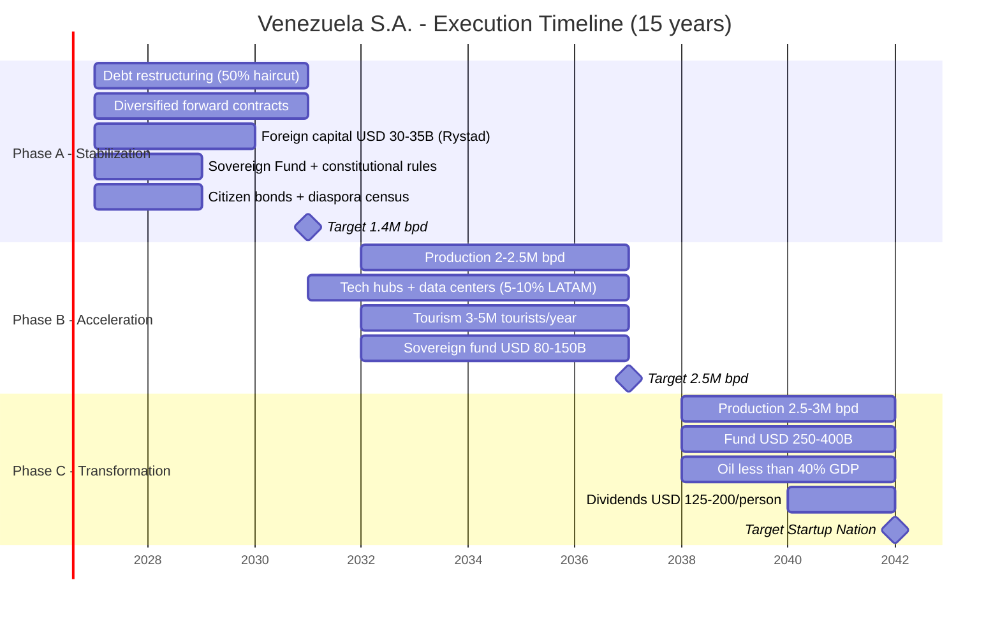
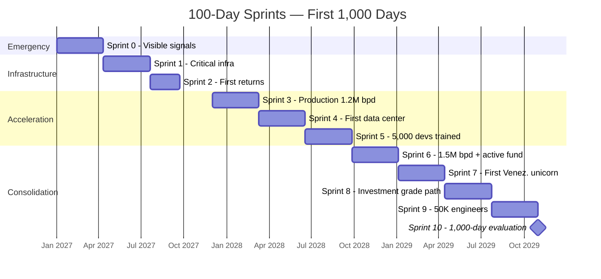

# Realistic Timeline (Based on Rystad Energy)

## Phase A: Stabilization (Years 1–4)
- Restructure debt (50% haircut, [Citigroup model](https://www.cnbc.com/2026/01/04/venezuelas-billions-in-distressed-debt-who-is-in-line-to-collect.html))
- Forward contracts with diversified buyers
- USD 30–35B initial foreign capital ([Rystad](https://www.rigzone.com/news/could_venezuela_production_get_back_to_3mm_barrels_per_day-08-jan-2026-182716-article/))
- Sovereign Fund + constitutional rules
- Citizen bonds + global diaspora census
- **Target: 1.4M bpd**

## Phase B: Acceleration (Years 5–10)
- Production: 2–2.5M bpd
- Tech hubs + data centers (5–10% of LATAM market)
- Tourism: 3–5M tourists/year
- Sovereign fund: USD 80–150B

## Phase C: Transformation (Years 11–15+)
- Production: 2.5–3M bpd
- Fund: USD 250–400B
- Oil <40% of GDP
- Dividends: USD 125–200/person/year

---

## First 1,000 Days: Sprints with Visible Results

:::danger Bukele + Musk Lesson
Evaluators agree: a 15-year plan without visible results in the first 365 days loses legitimacy. Bukele transformed the perception of El Salvador in 1,000 days. Musk compresses timelines 3-5x. The plan needs **100-day sprints** with measurable, visible deliverables.
:::

### Sprint 0: Days 1–100 — Emergency and Signals

| # | Deliverable | Metric | Responsible |
|---|-----------|---------|-------------|
| 1 | **Functional hospital** — at least 1 public hospital rehabilitated to international standards | Operational beds, operating rooms, supplies | Min. Health + PAHO |
| 2 | **Safe street** — 3 pilot zones with 24/7 security (Caracas, Maracaibo, Valencia) | Homicides -50% in pilot zone | Reformed police + international cooperation |
| 3 | **Stocked market** — food supply chain rehabilitated in 10 cities | Stable prices, full shelves, 0 CLAP | Private sector + emergency imports |
| 4 | **Working internet** — Starlink at 50 public points (plazas, schools, hubs) | 100+ Mbps available free | Starlink + government |
| 5 | **Public dashboard** — web platform with budget, spending, progress in real time | Online, accessible, updated daily | Tech team |
| 6 | **First forward contract signed** — signal to the market that the plan is real | USD 1-3B in advances | Oil Agency |

### Sprint 1: Days 101–200 — Critical Infrastructure

| # | Deliverable | Metric |
|---|-----------|---------|
| 1 | **Guri rehabilitated** — first turbine repaired, uptime > 80% | MW recovered |
| 2 | **5 tech coworkings** operational with Starlink + fiber | Available seats, Mbps speed |
| 3 | **First bootcamp** launched (1,000 students) | Enrollees, retention rate |
| 4 | **OFAC license expanded** — result of negotiation | Type of license granted |
| 5 | **Digital census** of diaspora launched | Registered on platform |

### Sprint 2: Days 201–365 — First Returns

| # | Deliverable | Metric |
|---|-----------|---------|
| 1 | **Production at 1.1-1.2M bpd** | Verified bpd |
| 2 | **First JV with a major** signed (post-Chevron) | USD invested |
| 3 | **10,000 new police officers** graduated and deployed | Territorial coverage |
| 4 | **First citizen bond** issued (pilot USD 10-50) | Participating citizens |
| 5 | **3 bootcamps** operational in 3 cities | First cohort graduates |

### Sprints 3-10: Days 366–1,000

### Timeline Compression: 15 to 10 Operational Years

| Compression Mechanism | Estimated Savings | Model |
|------------------------|----------------|--------|
| **Parallel execution** (not sequential) — oil + tech + security simultaneously | 2-3 years | Musk: "everything in parallel, never in series" |
| **Starlink** instead of rehabilitating terrestrial fiber | 1-2 years | Immediate connectivity vs. 3-5 years of civil works |
| **Modular prefabrication** for infrastructure | 1-2 years | China builds hospitals in 10 days |
| **Design-Build** (single contractor designs + builds) | 6-12 months | vs. separate design and construction bidding |
| **Parallel permits** (don't wait for one to start another) | 6-12 months | Singapore: permit in 26 days vs. LATAM ~180 days |
| **24/7 on critical projects** | 30-50% faster | UAE: 24-hour shifts on key projects |

:::tip The real plan is 10 years with a 5-year buffer
If executed at Musk/Bukele speed (everything in parallel, results every 100 days, zero bureaucracy), the plan compresses to **10 operational years**. The remaining 5 years are buffer for contingencies. If there are no major setbacks, Venezuela reaches its destination in 2037, not 2042.
:::
