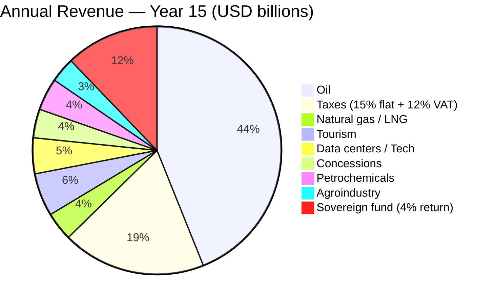
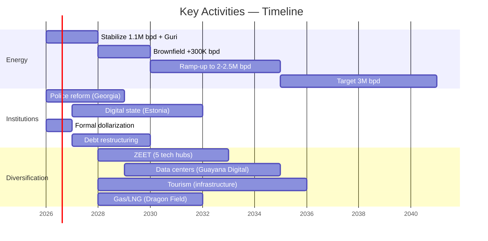
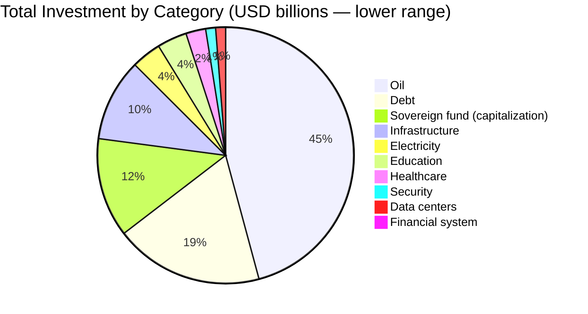

# Business Model Canvas — Venezuela S.A.

```mermaid
flowchart TB
    subgraph KP["🤝 Key Partners"]
        KP1["Oil majors (Chevron, Shell, TotalEnergies)"]
        KP2["BigTech (AWS, Google, Microsoft)"]
        KP3["Multilaterals (IMF, WB, IDB)"]
        KP4["U.S. (current oil sales control)"]
        KP5["Trinidad & Tobago (gas/LNG)"]
        KP6["Colombia/Brazil (trade + energy)"]
    end

    subgraph KA["⚙️ Key Activities"]
        KA1["Rebuild oil production (1→3M bpd)"]
        KA2["Rehabilitate hydroelectric (18 GW)"]
        KA3["Create 5 tech hubs (ZEET)"]
        KA4["Restructure debt (USD 150-170B)"]
        KA5["Institutional reform (Georgia model)"]
        KA6["Digital state (Estonia model)"]
    end

    subgraph VP["💎 Value Proposition"]
        VP1["CITIZENS: Dividend + services + ownership"]
        VP2["INVESTORS: Access to 303B bbl + cheap energy"]
        VP3["BIGTECH: Cheapest electricity in LATAM"]
        VP4["DIASPORA: Participation from USD 10 + return"]
    end

    subgraph CR["❤️ Customer Relationships"]
        CR1["Shareholder (automatic dividend)"]
        CR2["Total transparency (blockchain dashboard)"]
        CR3["Digital government (0 bureaucracy)"]
        CR4["Whistleblower + anti-corruption"]
    end

    subgraph CS["👥 Customer Segments"]
        CS1["28-32M Venezuelans in-country"]
        CS2["7.9M diaspora"]
        CS3["International oil majors"]
        CS4["BigTech / data center operators"]
        CS5["Institutional investors"]
        CS6["Tourists (target: 5-10M/year)"]
    end

    subgraph KR["🏗️ Key Resources"]
        KR1["303B bbl oil reserves (#1 worldwide)"]
        KR2["18 GW hydroelectric potential"]
        KR3["5,500 BCM natural gas (#7 worldwide)"]
        KR4["7.9M skilled diaspora"]
        KR5["Geographic position (Caribbean + U.S. proximity)"]
        KR6["Fertile land (Llanos + Orinoco)"]
    end

    subgraph CH["📢 Channels"]
        CH1["Citizen investment app (from USD 10)"]
        CH2["Sovereign bonds"]
        CH3["ZEET (5 tech zones with tax benefits)"]
        CH4["Bilateral agreements (JVs, forwards)"]
        CH5["Diaspora platform (census + matching)"]
    end

    subgraph COST["💰 Cost Structure"]
        COST1["Oil: USD 183B (Rystad, 15 years)"]
        COST2["Infrastructure: USD 41.5-81B"]
        COST3["Debt: USD 75-85B (restructuring)"]
        COST4["Education: USD 15-25B"]
        COST5["Security: USD 5-8B"]
        COST6["Total: USD 550-750B / 15 years"]
    end

    subgraph REV["💵 Revenue Streams"]
        REV1["Oil: USD 40-55B/year (year 15)"]
        REV2["Taxes: 15% flat + 12% VAT"]
        REV3["Concessions (infrastructure, telecom)"]
        REV4["ZEET fees + corporate tax 15%"]
        REV5["Sovereign fund: 4-7% annual return"]
        REV6["Gas/LNG: USD 3-5B/year"]
        REV7["Tourism: USD 4-8B/year"]
    end
```

---

## The 9 Blocks in Detail

### 1. Customer Segments

| Segment | Size | Need | Offer |
|----------|--------|-----------|--------|
| Venezuelans in-country | 28–32M | Basic services, jobs, dignity | Dividends + services + opportunity |
| Diaspora | 7.9M | Participate, invest, return | Bonds from USD 10 + return program |
| Oil majors | 5–10 companies | Access to reserves | JVs with stable legal framework |
| BigTech | AWS, Google, MS, Oracle | Cheap electricity for data centers | ZEETs with marginal-cost energy |
| Institutional investors | Global funds | Frontier market returns | Sovereign bonds + VIN |
| Tourists | Target: 5–10M/year | Caribbean, nature, adventure | Angel Falls, Los Roques, Canaima |

### 2. Value Proposition

**For citizens:**
- Automatic dividend from the sovereign fund (USD 15->200/year)
- Universal healthcare + dignified pension
- Digital state without bureaucracy
- Real ownership over national resources

**For investors:**
- Access to the world's largest oil reserves
- Cheapest hydroelectric energy in LATAM
- 10-year tax holiday in ZEETs (0% corporate, 0% capital gains)
- Stable legal framework (dollarization + international arbitration)

**For the diaspora:**
- Investment from USD 10 with real returns
- Return program with incentives (jobs, housing, credit)
- Remote participation without needing to move back

### 3. Channels

| Channel | Function | Target |
|-------|---------|--------|
| Citizen investment app | Bonds, dividends, portfolio | Citizens + diaspora |
| Blockchain dashboard | Fund transparency | Everyone |
| ZEETs (5 tech zones) | Investment attraction | BigTech + startups |
| Forward contracts | Initial capital | Oil majors + traders |
| Bilateral agreements | Trade + cooperation | Governments + multilaterals |
| Diaspora platform | Census + talent matching | 7.9M abroad |

### 4. Customer Relationships

| Type | Mechanism | Model |
|------|-----------|--------|
| Universal shareholder | Automatic dividend, no paperwork | Alaska PFD |
| Radical transparency | Every dollar traceable on blockchain | NBIM (Norway) |
| Digital government | 100% services online, zero lines | Estonia X-Road |
| Anti-corruption by design | Whistleblower 10–30% reward | SEC / Singapore CPIB |
| Direct participation | Voting on fund decisions | Shareholder democracy |

### 5. Revenue Streams

| Source | Year 5 | Year 10 | Year 15 |
|--------|-------|--------|--------|
| Oil (net) | USD 14B | USD 18B | USD 30B+ |
| Taxes | USD 5B | USD 12B | USD 20B |
| Natural gas | USD 500M | USD 2B | USD 4B |
| Sovereign fund (returns) | USD 1.5B | USD 5B | USD 13B |
| Tech + tourism + agro | USD 2B | USD 8B | USD 15B |

### 6. Key Resources

| Resource | Value | Comparison |
|---------|-------|-------------|
| Oil reserves | 303B barrels | #1 worldwide (Saudi Arabia: 258B) |
| Hydroelectric | 18,000 MW (Caroni) | More than all of Paraguay |
| Natural gas | 5,500 BCM | #7 worldwide |
| Diaspora | 7.9M + USD 10,600M/year contribution | Largest in South America |
| Geography | Caribbean + 2,800 km coast + U.S. proximity | Natural data center hub |
| Farmland | Llanos + Orinoco Delta | One of the most fertile plains on the continent |

### 7. Key Activities

### 8. Key Partners

| Partner | Role | Contribution | Returns |
|---------|-----|-----------|------------|
| Chevron | Oil JV (already operating) | Capital + technology | Reserve access |
| U.S. (government) | Current oil sales control | Legitimacy + market | Energy + democratic ally |
| IMF / World Bank | Post-restructuring financing | USD 20–40B | Regional stability |
| AWS / Google / Microsoft | Data centers in ZEETs | USD 5–10B | Cheap energy + LATAM market |
| Trinidad & Tobago | LNG partner (Dragon Field) | Liquefaction capacity | Gas feed from Venezuela |
| Colombia / Brazil | Trade + electrical interconnection | Markets + infrastructure | Neighbor stability |

### 9. Cost Structure

| Category | Investment | % of Total | Primary Source |
|-----------|-----------|-------------|------------------|
| Oil | USD 183B | 33% | Oil majors (JVs) + forwards |
| Restructured debt | USD 75–85B | 14% | 50% haircut (Citigroup model) |
| Sovereign fund | USD 50–100B | 11% | Oil revenue + returns |
| Infrastructure | USD 41.5–81B | 10% | Concessions + multilaterals |
| Electricity | USD 15–25B | 3% | Concessions + government |
| Education | USD 15–25B | 3% | Public budget |
| Healthcare | USD 10–20B | 2% | Budget + concessions |
| Everything else | USD 20–30B | 5% | Mixed |

---

## Unit Economics: Per Venezuelan

| Metric | Calculation | Value |
|---------|---------|-------|
| **Total investment / person** | USD 650B / 40M | **USD 16,250** |
| **GDP/capita today** | USD 82.8B / 32M | **USD 2,588** |
| **GDP/capita target (year 15)** | USD 425B / 35M | **USD 12,143** |
| **Multiplier** | USD 12,143 / USD 2,588 | **4.7x** |
| **Annual dividend (year 15)** | 10% fund income / 40M | **USD 125–200** |
| **Fund value / capita** | USD 325B / 40M | **USD 8,125** |

Comparison: Norway has USD 2.2T / 5.5M = **USD 400,000/capita** in its fund. Venezuela targets USD 8,125/capita in 15 years. Modest, but transformational for a country where the sovereign fund is currently **USD 0**.
