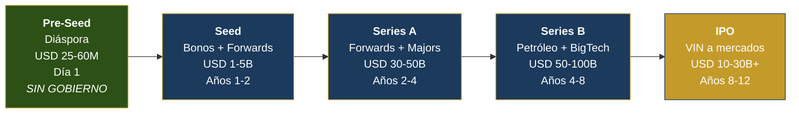
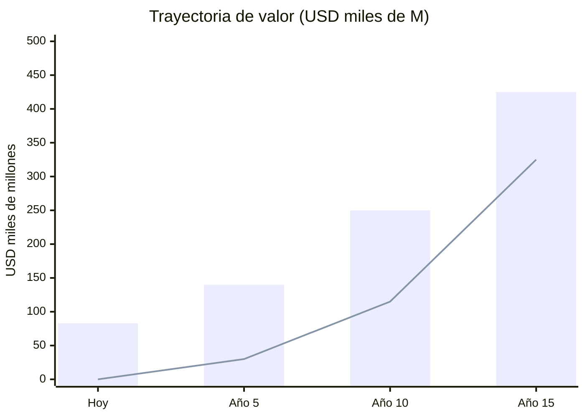

# Executive Summary — Venezuela S.A.

> **One sentence:** A national reconstruction plan where 40 million Venezuelans are shareholders in the transformation of a collapsed petro-state into a tech powerhouse fueled by the cheapest energy on the continent.

---

## The Problem

| Indicator | Data | Source |
|-----------|------|--------|
| GDP | USD 82,800M (peak: ~USD 480,000M in 2014) | [IMF](https://www.imf.org) |
| Oil production | 0.9–1.1M bpd (peak: 3.3M in 1998) | [OPEC 2025](https://www.opec.org) |
| External debt | USD 150–170B | [Reuters/CNBC](https://www.cnbc.com/2026/01/04/venezuelas-billions-in-distressed-debt-who-is-in-line-to-collect.html) |
| Poverty | 82.8% | [ENCOVI 2023](https://crisisresponse.iom.int/response/venezuela-bolivarian-republic-crisis-response-plan-2024) |
| Diaspora | 7.9M people (20% of population) | [UNHCR, Dec. 2025](https://www.unhcr.org/us/emergencies/venezuela-situation) |
| Crime | #1 worldwide (Numbeo Crime Index: 80.7) | [World Population Review](https://worldpopulationreview.com/country-rankings/crime-rate-by-country) |
| Internet | <1 Mbps average (LATAM: ~20 Mbps) | [SIGCOMM/Northwestern 2024](https://estcarisimo.github.io/assets/pdf/papers/2024-sigcomm-venezuela.pdf) |

**Venezuela has the world's largest oil reserves (303B barrels) and 18 GW of hydroelectric potential, but operates as a failed state.**

---

## The Solution

**Oil is the fuel. Technology is the destination.**

Oil generates revenue. Hydroelectric generates cheap electricity. Cheap electricity attracts BigTech (Amazon invested [USD 4,000M in Chile](https://www.mordorintelligence.com/industry-reports/south-america-data-center-market) for this reason). BigTech generates ecosystem. Ecosystem diversifies the economy. The sovereign fund turns finite wealth (oil) into infinite wealth (returns).

---

## Funding Rounds

| Round | Source | Amount | Use | Timeline |
|-------|--------|-------|-----|-------|
| **Pre-Seed** | Diaspora (private) | USD 25–60M | Platforms, census, legal, app | Day 1 (no government) |
| **Seed** | Bonds + forwards | USD 1–5B | Stabilization + energy | Years 1–2 |
| **Series A** | Forwards + majors | USD 30–50B | Production 1.4M bpd + Guri | Years 2–4 |
| **Series B** | Revenue + BigTech | USD 50–100B | Tech hubs, data centers | Years 4–8 |
| **IPO** | VIN to markets | USD 10–30B+ | Tech portfolio listed | Years 8–12 |

---

## Projections (Base: USD 60/barrel)

| Indicator | Today | Year 5 | Year 10 | Year 15 |
|-----------|-----|-------|--------|--------|
| GDP | USD 83B | 140B | 250B | 425B |
| Production | 1M bpd | 1.75M | 2.25M | 2.75M |
| Sovereign Fund | USD 0 | 30B | 115B | 325B |
| Dividend/person | USD 0 | USD 20 | USD 50 | USD 162 |
| Oil % of exports | 95% | 75% | 45% | <35% |

---

## Return by Stakeholder Type

| Stakeholder | Investment | Return | Horizon |
|-------------|-----------|---------|-----------|
| **Citizen** (40M) | USD 0 (automatic dividend) | USD 15->200/year + public services | Year 1->15 |
| **Diaspora** (7.9M) | USD 10–5,000 (bonds/VIN) | 4–8% annual + dividend + return program | Year 1->15 |
| **Oil Major** (Chevron, Shell, etc.) | USD 30–50B (JVs) | Access to 303B barrels | Year 2->30 |
| **BigTech** (AWS, Google, etc.) | USD 5–10B (data centers) | Cheapest energy in LATAM | Year 4->20 |
| **Multilateral** (IMF, WB) | USD 20–40B (loans) | Regional stability + repayment | Year 2->15 |
| **U.S. Government** | Oil sales control -> transition | Democratic + energy ally | Current->Year 5 |

---

## Competitive Advantages (Moat)

| Advantage | Detail | Competitors |
|---------|---------|-------------|
| **Oil reserves #1** | 303B barrels | Saudi Arabia (258B), Iran (209B) |
| **Cheap hydroelectric** | 18 GW Caroni, 74% renewable matrix | Chile (solar), Brazil (shared hydro) |
| **Geographic position** | Caribbean + U.S. proximity + submarine cable | Colombia, Panama |
| **Skilled diaspora** | 7.9M with LATAM/U.S./Europe experience | No competitor has this |
| **Greenfield tech** | No legacy systems = build from scratch | Estonia did this in 1991 |
| **Natural gas** | 5,500 BCM (7th worldwide), zero exports | Trinidad & Tobago (LNG capacity) |

---

## The Ask

| Concept | Amount |
|----------|-------|
| **Total investment (15 years)** | USD 550,000–750,000M |
| **Initial capital (years 1–3)** | USD 30,000–50,000M |
| **Pre-Seed (diaspora, day 1)** | USD 25–60M |

**What you get:** A transformed country where every Venezuelan receives dividends from a sovereign fund targeting USD 250,000–400,000M, oil drops from 95% to <35% of exports, and the economy diversifies across 6 growth engines.

---

## Key Risks

| Risk | Probability | Mitigation |
|--------|-------------|------------|
| Oil price <USD 50 | Medium | Floor in forward contracts (USD 55) + stabilization fund |
| Political resistance | High | Pre-Seed starts WITHOUT government + international pressure |
| Corruption | High | Georgia + Singapore CPIB model + blockchain + whistleblower |
| Continued brain drain | Medium | "Venezuela Te Espera" return program + remote work |
| Internal armed conflict | Medium-Low | DDR (Colombia model) + police reform (Georgia model) |

:::info 85+ verifiable sources
Every data point has a real source with URL. See [Complete References](/referencias).
:::
