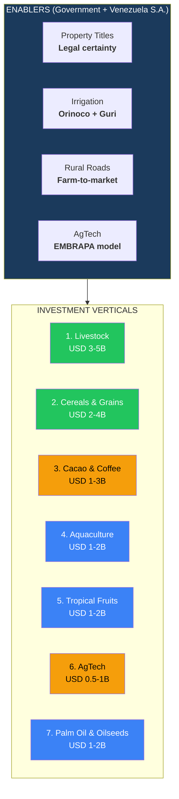
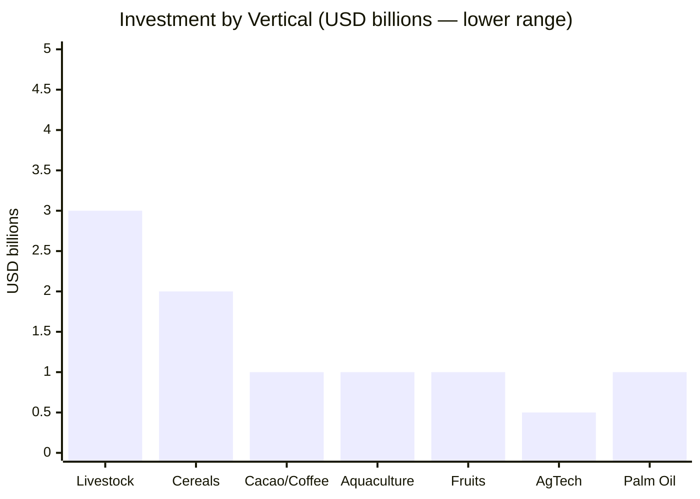
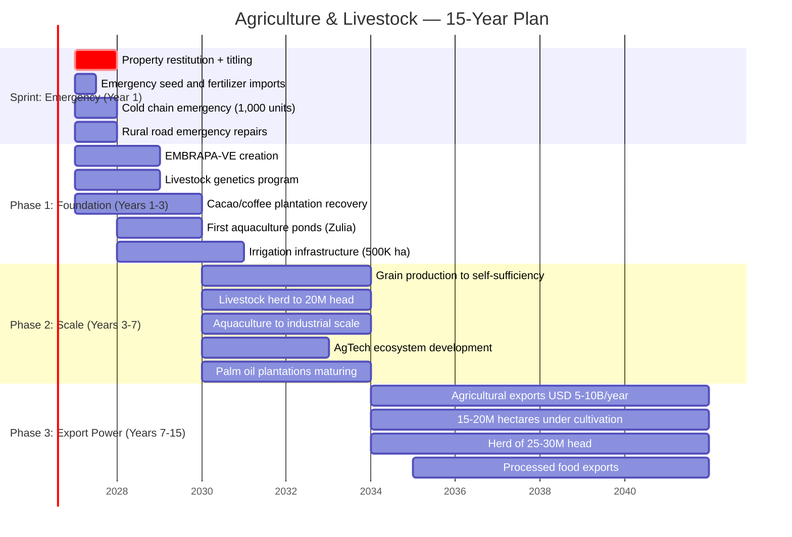

# Agriculture & Livestock: From Importing 70% to Exporting USD 5-10B

> Venezuela has **~30M hectares of agricultural land** of which only **~3M are cultivated**. It imports **USD 3B+/year in food** it could produce locally. It has the Llanos (the largest fertile plain in northern South America), infinite water (Orinoco), cheap electricity (Guri), and the world's best cacao. Brazil went from food importer to **3rd largest exporter worldwide** with EMBRAPA. Venezuela can do it in 15 years with technology, foreign capital, and property titles.

---

## 1. The Opportunity: 27M Idle Hectares

:::danger The defining data point
Venezuela has **~30M hectares suitable for agriculture and livestock**. Only **~3M are under active cultivation**. That is **90% idle capacity**. Meanwhile, it imports **USD 3B+/year in food** ([USDA FAS, 2025](https://www.fas.usda.gov/data/venezuela-venezuela-agricultural-imports-grow-9-percent-2024-united-states-among-leading)) and **5.1M people need food assistance** ([WFP](https://www.wfp.org/emergencies/venezuela-emergency)). It is like having a USD 10B factory locked shut while buying the product from your competitor.
:::

| Data Point | Figure | Source |
|------|-------|--------|
| Total agricultural land | **~30M hectares** (215,000 km2) | [World Bank](https://data.worldbank.org/indicator/AG.LND.ARBL.ZS?locations=VE) |
| Arable land (cultivable) | **~2.6M hectares** under cultivation | [World Bank, 2023](https://tradingeconomics.com/venezuela/arable-land-hectares-wb-data.html) |
| Land suitable for grazing | **~17M hectares** | Government survey 1997 |
| Permanent crops | **~800K hectares** | [World Bank, 2023](https://data.worldbank.org/) |
| Annual food imports | **USD 3B+/year** | [USDA FAS, 2025](https://www.fas.usda.gov/data/venezuela-venezuela-agricultural-imports-grow-9-percent-2024-united-states-among-leading) |
| Food insecure population | **5.1M people** | [WFP](https://www.wfp.org/emergencies/venezuela-emergency) |
| Share of food imported | **~70%** of consumption | [Requiere investigacion] |
| Agricultural GDP share | **~5%** (was 6-7% in 2000s) | [World Bank](https://data.worldbank.org/) |

### Venezuela vs. agricultural comparables

| Country | Arable land (M ha) | Ag exports (USD B/year) | Ag GDP % | Secret |
|---------|--------------------|-----------------------|----------|--------|
| **Brazil** | 63M | **USD 130B** | 7% | EMBRAPA + technology + property titles + scale |
| **Argentina** | 39M | **USD 45B** | 6% | Pampas + technology + export-oriented |
| **Colombia** | 4M | **USD 10B** | 7% | Coffee + flowers + tropical fruits |
| **Ecuador** | 2.5M | **USD 12B** | 9% | Shrimp + bananas + cacao |
| **Venezuela** | **30M** | **<USD 0.5B** | 5% | **90% idle. Zero technology. No property titles** |

:::info Venezuela has more arable land than Ecuador, Colombia, and Chile combined
Ecuador exports USD 12B/year from 2.5M hectares. Colombia exports USD 10B from 4M hectares. Venezuela has **30M hectares** and exports almost nothing. The difference is not land — it is property titles, technology, infrastructure, and capital. All of which are fixable.
:::

---

## 2. The 7 Investment Verticals

---

## 3. Vertical 1: Livestock — The Llanos as Ranch

| Component | Detail |
|-----------|--------|
| **Opportunity** | **~17M hectares** suitable for grazing. Current herd: **~10M head** (was 16M in 2008). Target: **25-30M head** in 10 years |
| **Problem** | Confiscations destroyed the sector. 200+ ranches expropriated 2005-2015. No property titles = no investment |
| **Solution** | Restitution + property titles + private concessions on state land + technology (genetics, artificial insemination, rotational grazing) |
| **Revenue (year 10)** | **USD 3-5B/year** in meat + dairy + leather |
| **Reference** | Brazil: from 50M to 230M head in 40 years. Paraguay: exports USD 2B/year in beef from 14M head |
| **Operators** | JBS (Brazil), Minerva Foods (Brazil), Marfrig, Grupo Bel (dairy), local ranchers with restored property |

### The Llanos: South America's untapped cattle frontier

| Data Point | Value | Source |
|-----------|-------|--------|
| Llanos extension | **~300,000 km2** (Venezuela portion) | [Britannica](https://www.britannica.com/place/Llanos) |
| Current herd | **~10M head** | [USDA FAS 2025](https://www.fas.usda.gov/) |
| Historic peak | **16M head** (2008) | [FAO](https://www.fao.org/) |
| Herd target (year 10) | **25-30M head** | Projection based on Brazil growth trajectory |
| Meat consumption (internal) | ~15 kg/person/year (was 22 kg) | [Requiere investigacion] |
| Export potential | **USD 2-3B/year** (at 500K+ ton exportable surplus) | Projection based on Paraguay comparable |

:::tip Brazil model: EMBRAPA transformed the Cerrado
Brazil's Cerrado was considered "useless land" until EMBRAPA (Brazilian Agricultural Research Corporation) developed tropical grass varieties, soil correction techniques, and adapted cattle genetics. Result: the Cerrado produces **50%+ of Brazil's agricultural output** today. Venezuela's Llanos have **better water access** (Orinoco) and **better natural pasture** than the Cerrado did in the 1970s.
:::

---

## 4. Vertical 2: Cereals & Grains — Food Sovereignty

| Product | Current production | Demand | Import gap | Target (year 10) |
|---------|-------------------|--------|-----------|-------------------|
| **Rice** | ~800K ton/year | ~1.2M ton | ~400K ton imported | **1.5M ton** (self-sufficient + export) |
| **Corn** | ~1.5M ton/year | ~3M ton | ~1.5M ton imported | **4M ton** (self-sufficient + animal feed) |
| **Soy** | Minimal | ~500K ton | ~500K ton imported | **1M ton** (Llanos potential) |
| **Wheat** | Near zero | ~1.5M ton | ~1.5M ton imported | **500K ton** (limited, import remainder) |
| **Sorghum** | ~300K ton | ~800K ton | ~500K ton | **1M ton** (adapted to Llanos climate) |

| Component | Detail |
|-----------|--------|
| **Investment** | **USD 2-4B** in 10 years (irrigation, silos, mechanization, seeds) |
| **Revenue (year 10)** | **USD 2-4B/year** (import substitution + export surplus) |
| **Key enabler** | Irrigation from Orinoco + tributaries. Brazil irrigates 8M hectares; Venezuela irrigates <500K |
| **Technology** | Precision agriculture: drones, satellite imagery, GPS-guided machinery, smart irrigation |
| **Reference** | Brazil: from net grain importer (1970s) to **#1 soy exporter**, **#3 corn exporter** with EMBRAPA technology |

---

## 5. Vertical 3: Cacao & Coffee — Premium Export

### Cacao: the world's finest

:::info Venezuelan cacao is among the best in the world
Venezuela produces **Criollo and Trinitario** cacao — classified as **"fino de aroma"** by the International Cocoa Organization (ICCO). Only **8% of global cacao** is fino de aroma. Venezuelan cacao commands premiums of **USD 4,000-8,000/ton** vs. bulk cacao at USD 2,000-3,000/ton. Brands like Valrhona, Amedei, and Domori use Venezuelan cacao as their premium line.
:::

| Data Point | Figure | Source |
|-----------|-------|--------|
| Cacao production (current) | **~15,000-20,000 ton/year** | [ICCO 2024](https://www.icco.org/) |
| Historic peak | **~22,000 ton/year** (2000s) | [FAO](https://www.fao.org/) |
| World-class quality share | **75%+ fino de aroma** (highest % globally) | [ICCO 2024](https://www.icco.org/) |
| Premium price | **USD 4,000-8,000/ton** (fino de aroma) | Market prices |
| Target (year 10) | **80,000-100,000 ton/year** | Based on Ivory Coast growth model, adjusted for premium strategy |
| Revenue target (year 10) | **USD 400M-800M/year** | At premium prices |

### Coffee: recovering a legacy

| Data Point | Figure | Source |
|-----------|-------|--------|
| Coffee production (current) | **~30,000-40,000 ton/year** | [ICO 2024](https://www.ico.org/) |
| Historic peak | **~80,000 ton/year** (1990s) | [FAO](https://www.fao.org/) |
| Specialty coffee potential | High — Andean regions, altitude, varietals | Comparable to Colombian specialty |
| Target (year 10) | **100,000 ton/year** (50%+ specialty) | Based on Colombia recovery model |
| Revenue target (year 10) | **USD 300-600M/year** | At specialty premiums |

| Component | Total for Cacao & Coffee |
|-----------|-------------------------|
| **Investment** | **USD 1-3B** (plantations, processing, branding, export logistics) |
| **Revenue (year 10)** | **USD 700M-1.4B/year** |
| **Operators** | Cargill, Barry Callebaut (cacao processing), Starbucks Reserve (coffee), local cooperatives |
| **Key strategy** | **Never sell raw beans.** Process locally: chocolate, roasted coffee. Capture value-add |

---

## 6. Vertical 4: Aquaculture — The Shrimp & Fish Opportunity

| Component | Detail |
|-----------|--------|
| **Opportunity** | 2,800 km of Caribbean coast + Orinoco Delta + extensive inland waterways. Zero industrial aquaculture |
| **Products** | Shrimp (main export), tilapia, cachama (native fish), oysters |
| **Reference** | Ecuador: **USD 7B+/year in shrimp exports** from ~250,000 hectares of ponds. World's #1 shrimp exporter |
| **Venezuela potential** | 50,000-100,000 hectares of aquaculture ponds (Zulia, Falcon, Delta) |
| **Revenue (year 10)** | **USD 1-2B/year** |
| **Investment** | **USD 1-2B** (ponds, hatcheries, processing plants, cold chain) |
| **Operators** | Ecuadorian shrimp companies (expansion), Thai Union (global), Mowi (salmon/fish expertise) |

:::tip Ecuador model: from zero to USD 7B in shrimp
Ecuador had virtually no shrimp industry in 1980. Today it exports **USD 7.3B/year** in shrimp — more than its oil exports. It became the **world's largest shrimp exporter** surpassing India and Vietnam. The industry employs 250,000+ people. Venezuela has similar coastline, climate, and water conditions. A fraction of Ecuador's scale (USD 1-2B) is achievable in 10 years.
:::

---

## 7. Vertical 5: Tropical Fruits — Fresh & Processed

| Product | Opportunity | Revenue Potential |
|---------|-------------|-------------------|
| **Mango** | World demand growing 8%/year. Venezuela has ideal climate | USD 200-400M/year |
| **Pineapple** | Costa Rica exports USD 1B+/year. Venezuela has comparable conditions | USD 100-300M/year |
| **Avocado** | Mexico exports USD 3B+/year. Caribbean climate suitable | USD 200-500M/year |
| **Banana/plantain** | Ecuador exports USD 3.5B/year. Venezuela has Zulia, Barinas | USD 200-400M/year |
| **Passion fruit, guava, papaya** | Growing global demand for tropical juices + purees | USD 100-300M/year |
| **TOTAL** | | **USD 800M-1.9B/year** |

---

## 8. Vertical 6: AgTech — Technology for the Field

| Component | Detail |
|-----------|--------|
| **Concept** | Create a Venezuelan EMBRAPA: agricultural research institute focused on tropical agriculture, adapted seeds, precision farming |
| **Investment** | **USD 500M-1B** in 10 years |
| **Products** | Adapted seeds, precision irrigation, drones for crop monitoring, satellite imagery, soil analysis, digital marketplaces |
| **Reference** | EMBRAPA (Brazil): USD 2B/year budget. Transformed 200M hectares. ROI of **40:1** on research investment |
| **Model** | PPP: Government funds basic research. Private sector commercializes. Startups build AgTech apps |
| **Revenue** | **USD 200-500M/year** in AgTech services + technology licensing |

### AgTech startup opportunities

| Opportunity | Comparable | Revenue potential |
|-------------|-----------|-------------------|
| Digital marketplace (farm-to-consumer) | AgroFy (Argentina), Agrofy: USD 100M+ GMV | USD 50-100M/year in fees |
| Precision irrigation | Netafim (Israel), Valley Irrigation | USD 50-100M/year |
| Drone crop monitoring | DJI Agriculture, Sentera | USD 30-50M/year |
| Alternative proteins (insect-based animal feed) | InnovaFeed (France), Protix | USD 20-50M/year |
| Cold chain logistics | Emergent Cold (LATAM) | USD 50-100M/year |

---

## 9. Vertical 7: Palm Oil & Oilseeds

| Component | Detail |
|-----------|--------|
| **Opportunity** | Venezuela has **~1M hectares suitable for palm oil** (Zulia, Barinas, Portuguesa). Currently: <50K hectares planted |
| **Global market** | USD 65B/year. Palm oil is the most consumed vegetable oil globally |
| **Revenue (year 10)** | **USD 1-2B/year** |
| **Reference** | Colombia: **#1 palm oil producer in the Americas**, 600K hectares, USD 2B+/year |
| **Concern** | Deforestation. Must be on degraded/existing agricultural land, not forest. RSPO certification required |
| **Investment** | **USD 1-2B** (plantations mature in 3-4 years, then produce for 25+ years) |

---

## 10. What the Government Provides (and What It Does NOT Do)

| The government provides | Detail | Reference |
|-------------------------|--------|-----------|
| **Property titles** | Restitution of confiscated farms. Titling of occupied land. Without property titles, zero investment | Peru: titling program by ILD/Hernando de Soto. Rwanda: completed land titling in 5 years |
| **Agricultural research institute** | Venezuelan EMBRAPA. Public funding for basic research. Private sector applies | Brazil EMBRAPA: 40:1 ROI on research |
| **Irrigation infrastructure** | Orinoco + tributaries. 500K hectares irrigated now → 3M hectares in 10 years | Brazil: 8M irrigated hectares. Egypt: Nile irrigation |
| **Rural roads** | Farm-to-market roads. See [Roads & Logistics](./vialidad-logistica) | Colombia: 4G rural roads program |
| **Phytosanitary certifications** | Access to export markets requires certifications (USDA, EU, Codex Alimentarius) | Chile: SAG model |
| **Cold chain** | Power grid + refrigerated warehouses + refrigerated transport | Reduces post-harvest loss from 30% to <10% |

| What the government does NOT do | Why |
|----------------------------------|-----|
| Operate farms or agribusinesses | PDVSA demonstrated that the State does not operate businesses. Land is private or concession |
| Fix crop prices by decree | Price controls destroyed agriculture 2005-2015. Market prices with targeted subsidies for vulnerable populations |
| Expropriate productive land | Confiscations caused the collapse. Zero expropriations. Property rights are sacred |
| Create state-owned food distribution | CLAP (state food boxes) was a corruption mechanism. Private distribution with regulation |

---

## 11. Financial Projection

### Investment by vertical

| Vertical | Investment (10 years) | Revenue (year 10) | Jobs |
|----------|----------------------|--------------------|------|
| **Livestock** | USD 3-5B | USD 3-5B/year | 200,000-300,000 |
| **Cereals & Grains** | USD 2-4B | USD 2-4B/year | 150,000-250,000 |
| **Cacao & Coffee** | USD 1-3B | USD 700M-1.4B/year | 100,000-200,000 |
| **Aquaculture** | USD 1-2B | USD 1-2B/year | 50,000-100,000 |
| **Tropical Fruits** | USD 1-2B | USD 800M-1.9B/year | 80,000-150,000 |
| **AgTech** | USD 500M-1B | USD 200-500M/year | 10,000-20,000 |
| **Palm Oil & Oilseeds** | USD 1-2B | USD 1-2B/year | 50,000-100,000 |
| **TOTAL** | **USD 9.5-19B** | **USD 8.7-16.8B/year** | **640,000-1,120,000** |

### Consolidated projection

| Indicator | Current | Year 3 | Year 5 | Year 7 | Year 10 |
|-----------|---------|--------|--------|--------|---------|
| **Food imports** | USD 3B+/year | USD 2B | USD 1B | USD 500M | **<USD 200M** |
| **Ag exports** | <USD 500M | USD 1B | USD 3B | USD 5B | **USD 8-15B** |
| **Ag GDP %** | 5% | 7% | 9% | 11% | **13-15%** |
| **Ag jobs** | ~500K | 700K | 900K | 1.1M | **1.5-2M** |
| **Hectares cultivated** | ~3M | 5M | 8M | 12M | **15-20M** |
| **Cattle herd** | ~10M head | 14M | 18M | 22M | **25-30M** |

---

## 12. Implementation Timeline

---

## 13. International Comparables

| Country | Model | Result | Lesson for Venezuela |
|---------|-------|--------|---------------------|
| **Brazil (EMBRAPA)** | Created EMBRAPA in 1973. USD 2B/year in research. Transformed the Cerrado into the world's breadbasket | From net food importer to **#1 soy exporter, #3 corn exporter, #1 beef exporter**. Ag exports: USD 130B/year | EMBRAPA's 40:1 ROI proves that agricultural R&D in tropical conditions works. Venezuela can create its own version at 10% the scale |
| **Ecuador (shrimp)** | Started shrimp farming in 1980s. Zero government intervention — private sector led. Cold chain + processing + export logistics | **#1 shrimp exporter globally**. USD 7.3B/year. 250K+ jobs. Larger than oil exports | Venezuela has similar coastline and climate. A fraction of Ecuador's success (USD 1-2B) is achievable |
| **Colombia (coffee)** | Colombian Coffee Federation (FNC) since 1927. Brand building: "Juan Valdez". Quality certification: 100% Colombian | Premium coffee brand recognized worldwide. 540K farming families. USD 3B+/year exports | Brand + quality + cooperative model. Venezuelan cacao can follow the Colombian coffee playbook |
| **Israel (AgTech)** | Desert country that became an agricultural powerhouse through drip irrigation (Netafim), desalination, and precision farming | Exports USD 3B+/year in food. Leader in AgTech. 95% of wastewater recycled for irrigation | Technology overcomes natural limitations. Venezuela has better water and soil — needs the tech |
| **Rwanda (land titling)** | Completed national land titling in 5 years post-genocide. World Bank supported. Digital registry | Agricultural productivity increased 6x. Foreign investment in agriculture unlocked | Property titles are the prerequisite for everything. Rwanda proves it can be done quickly |
| **Paraguay (beef)** | Herd grew from 5M to 14M head in 20 years. Opened to Brazilian ranchers and technology | **#4 beef exporter globally**. USD 2B+/year. World's cheapest beef production cost | Opening to foreign ranchers + technology = rapid herd growth. Venezuela has 17M hectares of pasture |

Sources: [EMBRAPA](https://www.embrapa.br/); [USDA FAS](https://www.fas.usda.gov/); [FAO](https://www.fao.org/); [ICCO](https://www.icco.org/); [ICO](https://www.ico.org/); [WFP](https://www.wfp.org/); [Ecuador Central Bank](https://www.bce.fin.ec/); [FNC Colombia](https://federaciondecafeteros.org/).

---

## 14. Risks and Mitigations

| # | Risk | Prob. | Impact | Mitigation |
|---|------|-------|--------|------------|
| 1 | **Property titles not restored** — legal battles delay investment | High | Critical | International arbitration (ICSID). Accelerated titling program with World Bank support. Compensation fund for disputed land |
| 2 | **Climate change** — droughts, floods, changing patterns | Medium-High | High | EMBRAPA-VE develops adapted varieties. Irrigation reduces drought risk. Crop insurance (parametric) |
| 3 | **Lack of rural security** — theft, extortion, illegal mining | High | High | Rural police. Community engagement. Technology (drones, GPS tracking). Formalize mining separately |
| 4 | **Disease outbreaks** — foot-and-mouth, avian flu | Medium | High | Phytosanitary controls at borders. Vaccination programs. OIE (World Organisation for Animal Health) protocols |
| 5 | **Commodity price crash** | Medium | Medium | Diversification across 7 verticals. Value-add processing (chocolate, not beans). Premium positioning (cacao) |
| 6 | **Labor shortage** — rural population emigrated | High | Medium | Mechanization reduces labor needs. Competitive wages attract workers. Diaspora farmers return |
| 7 | **Deforestation pressure** | Medium | High | RSPO certification for palm oil. Satellite monitoring. Penalties for illegal deforestation. Only degraded land |
| 8 | **Water resource conflicts** | Medium | Medium | Orinoco basin has abundant water. Regulation of usage rights. Priority for human consumption |

---

## 15. Executive Summary

| Parameter | Value |
|-----------|-------|
| **Opportunity** | 30M hectares, 90% idle. USD 3B+/year food imports. World's best cacao |
| **Total investment (10 years)** | **USD 9.5-19B** |
| **Revenue (year 10)** | **USD 8.7-16.8B/year** (exports + import substitution) |
| **Jobs (year 10)** | **640,000-1,120,000** direct |
| **Food self-sufficiency** | From 30% to **>95%** in 10 years |
| **Key enabler** | **Property titles** — without them, nothing happens |
| **Model** | Private farms and agribusinesses. Government provides research (EMBRAPA-VE), infrastructure, titles |
| **Reference** | Brazil: EMBRAPA transformed agriculture. Ecuador: shrimp from zero to USD 7B |

:::tip Every dollar in agriculture solves two problems simultaneously
Food sovereignty (reducing the USD 3B+ import bill) AND export revenue (building a USD 5-10B/year export sector). Agriculture employs 10x more people per dollar invested than oil. It is the only sector that can simultaneously feed the population, create rural employment, and generate exports — while the oil machine ramps up.
:::

---

## Related Documents

- [Roads & Logistics](./vialidad-logistica) — Rural roads and cold chain connecting farms to market
- [Electrical Capacity](./capacidad-electrica) — Power for irrigation, processing, and cold chain
- [Critical Minerals](./minerales-criticos) — Fertilizer minerals (phosphate, potash) for soil correction
- [Water & Sanitation](./agua-saneamiento) — Irrigation systems and water management for agriculture
- [Tourism](./turismo) — Agro-tourism and gastronomic tourism (cacao, coffee experiences)
- [Concession Model](./modelo-concesiones) — PPP framework for agricultural infrastructure and processing plants

---

## Sources

| # | Source | Data Used |
|---|--------|-----------|
| 1 | [World Bank — Agricultural Land](https://data.worldbank.org/indicator/AG.LND.ARBL.ZS?locations=VE) | 30M hectares agricultural land |
| 2 | [USDA FAS — Venezuela Agricultural Imports](https://www.fas.usda.gov/data/venezuela-venezuela-agricultural-imports-grow-9-percent-2024-united-states-among-leading) | USD 3B+/year food imports |
| 3 | [WFP — Venezuela Emergency](https://www.wfp.org/emergencies/venezuela-emergency) | 5.1M food insecure |
| 4 | [ICCO — Fine Flavor Cocoa](https://www.icco.org/) | 75%+ fino de aroma, premium pricing |
| 5 | [ICO — Coffee](https://www.ico.org/) | Coffee production and export data |
| 6 | [FAO — FAOSTAT](https://www.fao.org/faostat/) | Historical production data |
| 7 | [EMBRAPA](https://www.embrapa.br/) | Brazilian agricultural research model, 40:1 ROI |
| 8 | [Ecuador Shrimp — Central Bank](https://www.bce.fin.ec/) | USD 7.3B shrimp exports |
| 9 | [Britannica — Llanos](https://www.britannica.com/place/Llanos) | 300,000 km2 Llanos extension |
| 10 | [FNC Colombia — Coffee Federation](https://federaciondecafeteros.org/) | Colombian coffee model |
