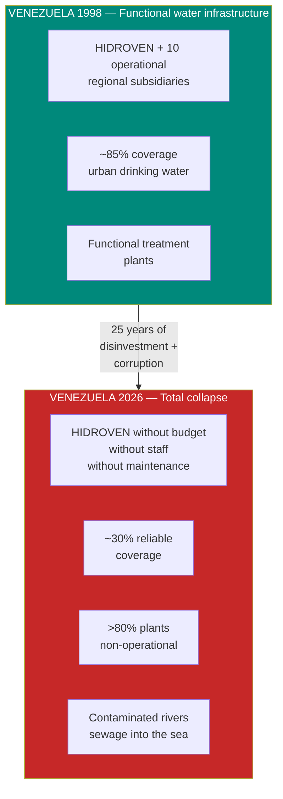
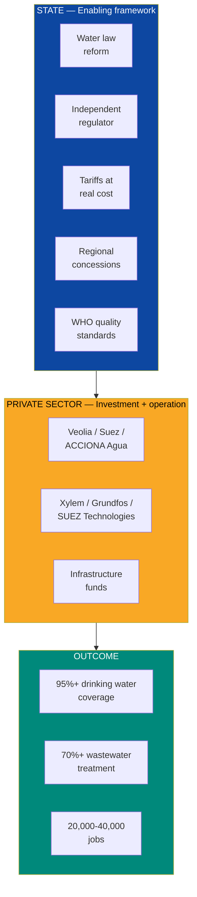
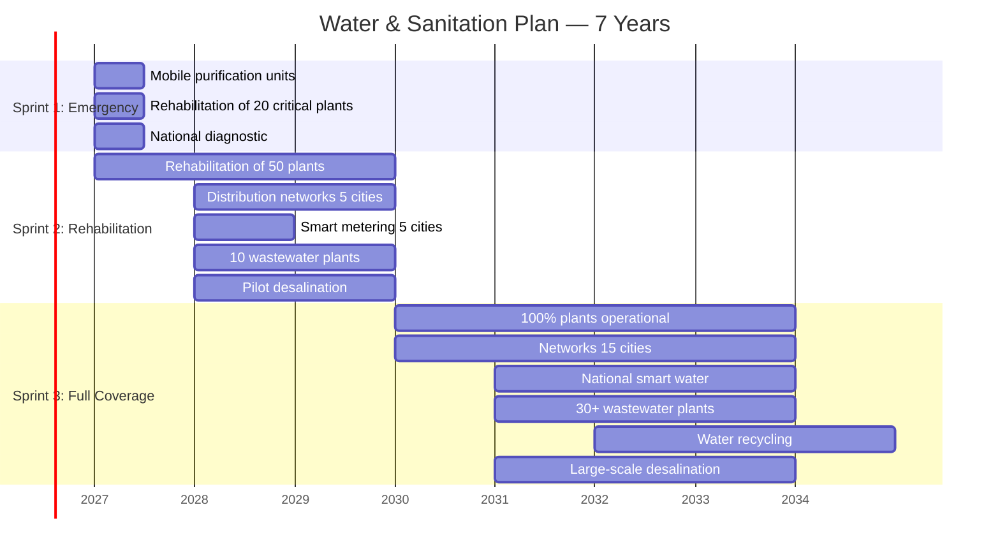
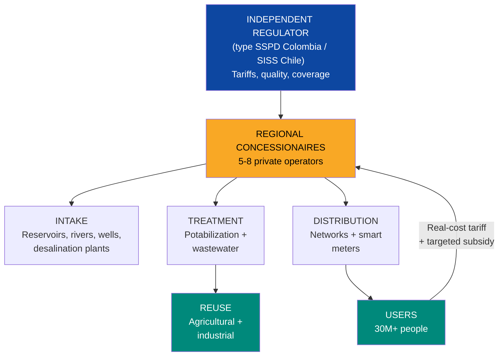
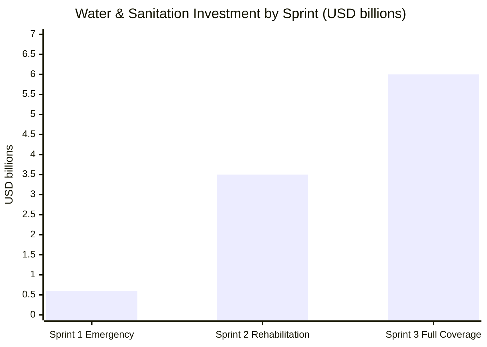
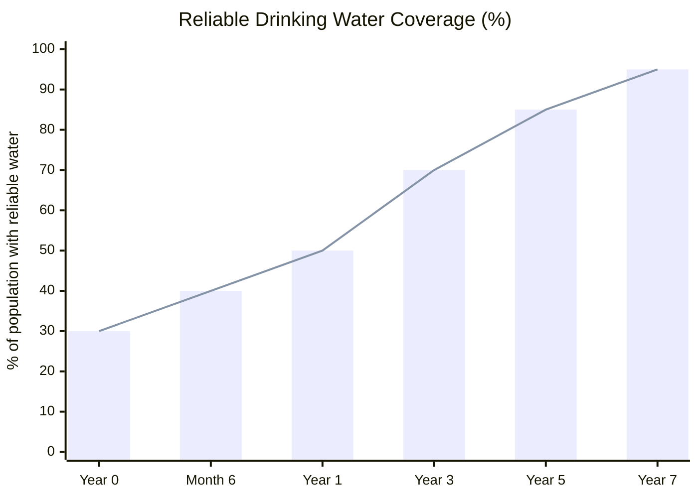

# Water & Sanitation: The Most Basic Thing That's Missing

> You can't talk about data centers, tech hubs, or sovereign funds if people don't have clean water to drink. Water is the most basic and most urgent investment. And it's also a business: **USD 3-5B in concessions** waiting for someone to operate them.

---

## 1. The Crisis: 7.6 Million People Without Basic Services

:::danger Disaster snapshot
**7.6 million people** lack reliable access to basic services in Venezuela — [IOM Crisis Response Plan 2025](https://crisisresponse.iom.int/response/venezuela-bolivarian-republic-crisis-response-plan-2025). Only an estimated **30% of the population** has reliable access to drinking water. **80%+ of water treatment plants** are non-operational or running at minimum capacity. Sewage flows directly into rivers and the Caribbean **without treatment**.
:::

| Indicator | Venezuela (current) | LATAM Average | Year 5 Target | Year 10 Target |
|-----------|-------------------|----------------|-----------|------------|
| Reliable drinking water access | **~30%** | ~85% | 70% | 95%+ |
| Operational treatment plants | **<20%** | ~70% | 60% | 90%+ |
| Wastewater treatment | **<10%** | ~40% | 30% | 70%+ |
| Distribution network losses | **>50%** | ~35% | 35% | <20% |
| Sewerage coverage | **~60%** (urban), **<20%** (rural) | ~80% | 75% | 90%+ |

Sources: [IOM 2025](https://crisisresponse.iom.int/response/venezuela-bolivarian-republic-crisis-response-plan-2025); [UNICEF WASH Venezuela](https://www.unicef.org/venezuela/); own estimates based on 2024-2025 reports.

### What was destroyed

### The human cost

| Impact | Data | Source |
|---------|------|--------|
| **Waterborne diseases** | Cholera outbreaks, hepatitis A, chronic diarrhea | [PAHO/WHO Venezuela](https://www.paho.org/en/topics/cholera) |
| **Associated infant mortality** | Venezuela regressed to 1980s levels in infant mortality | [UNICEF](https://www.unicef.org/venezuela/) |
| **Hours lost searching for water** | Families spend 2-6 hours daily searching for water (cisterns, trucks) | [HRW 2024](https://www.hrw.org/world-report/2024/country-chapters/venezuela) |
| **Lake Maracaibo contamination** | Sewage + oil spills → eutrophication + duckweed | [Mongabay 2023](https://news.mongabay.com/) |
| **Contaminated rivers** | Guaire, Caroní, Orinoco receive untreated sewage | [Requires research: 2025 water quality data] |

---

## 2. The Opportunity: USD 3-5B in a Captive Market

:::info This isn't charity — it's business
30 million people need clean water. They're willing to pay reasonable tariffs. Treatment plants already exist (most cases need rehabilitation, not construction from scratch). Water concessions are **stable, predictable, long-term revenue** — exactly what infrastructure funds seek. Water is the safest utility in the world.
:::

| Market Segment | Estimated Size | Model |
|---------------------|-----------------|--------|
| **Water treatment plant rehabilitation** | USD 1-2B | BOT concession (Build-Operate-Transfer) |
| **Distribution network rehabilitation** | USD 2-4B | Distribution concession (Colombia model) |
| **Desalination (Caribbean coast)** | USD 500M-1B | PPP with desalinated water tariffs |
| **Smart water (IoT, meters, SCADA)** | USD 200-500M | Service contract with operator |
| **Sanitation (wastewater)** | USD 1-2B | Treatment + reuse concession |
| **Bottled / purified water** | USD 200-500M | Direct private investment |
| **TOTAL** | **USD 5-10B** | |

---

## 3. The Solution: Three Sprints + Private Concessions

### Guiding principle: the State regulates, Venezuela S.A. invests, the private sector operates

### Sprint 1: Emergency (Week 1 - Month 6)

**Objective:** No one dies from lack of clean water.

| Action | What it solves | Est. Cost | Provider | Timeline |
|--------|-------------|------------|-----------|----------|
| **500+ mobile purification units** | Immediate clean water for communities without service | USD 50-100M | Xylem (Watergen), BWT, UNICEF kits | Week 1-4 |
| **Rehabilitation of 20 critical plants** (hospitals, cities >500K) | Minimum coverage for 5M+ people | USD 200-400M | Veolia, Suez (emergency response) | Month 1-6 |
| **Cistern tanks + emergency distribution** | Areas without network or plant | USD 30-50M | Logistics + fleet | Week 1-6 |
| **Purification tablets + household filters** | Individual solution for rural families | USD 10-20M | P&G Purifier of Water, LifeStraw | Week 1-4 |
| **National infrastructure diagnostic** | Know what can be rehabilitated and what must be replaced | USD 20-40M | International consultancies | Month 1-6 |
| **TOTAL SPRINT 1** | | **USD 300-600M** | | |

:::caution This doesn't wait — Sprint 1 starts on day 1
Mobile purification units (Xylem Watergen type or UNICEF emergency kits) deploy in **hours, not months**. One unit produces 5,000-10,000 liters/day of drinking water. 500 units = clean water for 1-2 million people as a bridge while plants are rehabilitated. Funded by the first tranche of oil forwards or BID/CAF emergency credit.
:::

### Sprint 2: Rehabilitation (Month 6 - Year 3)

**Objective:** Rehabilitate 60% of existing infrastructure.

| Action | Target | Est. Cost | Model |
|--------|------|------------|--------|
| **Rehabilitation of 50 drinking water treatment plants** | Cover 60% of population with treated water | USD 500M-1B | Regional BOT concessions |
| **Distribution network rehabilitation** (5 main cities) | Reduce losses from >50% to 35% | USD 800M-1.5B | Distribution concession |
| **Smart metering in 5 cities** | Real consumption measurement, leak detection, billing | USD 100-200M | Service contract (Xylem, Sensus) |
| **10 wastewater treatment plants** | Stop dumping sewage into rivers | USD 300-500M | Sanitation concessions |
| **Pilot desalination** (Margarita, coastal Zulia) | Water for islands and arid coastal zones | USD 200-400M | PPP with specialized operator |
| **TOTAL SPRINT 2** | | **USD 2-3.5B** | |

### Sprint 3: Full Coverage (Year 3 - Year 7)

**Objective:** 95%+ drinking water coverage, 70%+ wastewater treatment.

| Action | Target | Est. Cost | Reference |
|--------|------|------------|-----------|
| **100% drinking water plants operational** | 95%+ national coverage | USD 500M-1B | Chile: 100% urban coverage |
| **Distribution networks rehabilitated** (15 cities) | Losses <20% | USD 1-2B | Colombia: Bogota Aqueduct |
| **National smart water** | IoT + SCADA across the entire system | USD 200-500M | Singapore: Smart Water Grid |
| **30+ wastewater treatment plants** | 70%+ of wastewater treated | USD 500M-1B | Chile: 100% urban treatment |
| **Water recycling** (agricultural and industrial reuse) | 20%+ of treated water reused | USD 200-400M | Israel: 90% recycling |
| **Large-scale desalination** (3-5 coastal plants) | 500,000+ m3/day of desalinated water | USD 500M-1B | Israel: Sorek, the world's largest desalination plant |
| **TOTAL SPRINT 3** | | **USD 3-6B** | |

---

## 4. Business Model: Regional Concessions

:::danger HIDROVEN doesn't work
HIDROVEN (Hidrológica de Venezuela) and its subsidiaries (HIDROCAPITAL, HIDROCENTRO, etc.) follow the same pattern as CORPOELEC and PDVSA: a state-owned enterprise collapsed by politicization, corruption, disinvestment, and talent flight. HIDROVEN is dissolved and its assets transferred to Venezuela S.A., which contributes them as equity in JVs with private operators. The reconstruction model is **private concessions with state regulation, with Venezuela S.A. as a shareholder in the base infrastructure** — water is neither privatized nor nationalized; operations are concessioned while Venezuela S.A. retains equity stakes on behalf of citizens.
:::

### Proposed structure

### Model comparison

| Aspect | HIDROVEN (current) | Concessions (proposed) | Reference |
|---------|-------------------|------------------------|-----------|
| **Operator** | State (HIDROVEN + subsidiaries) | Private with 25-30 year contract | Chile: Aguas Andinas (Suez) |
| **Investment** | Zero (budget diverted) | Operator invests + recovers via tariffs | Colombia: AAA Barranquilla |
| **Tariffs** | Subsidized to zero (populism) | Real cost + targeted subsidy for the poor | Chile: SISS regulates tariffs |
| **Quality** | No monitoring | WHO standards + penalties for non-compliance | Singapore: PUB |
| **Coverage** | ~30% reliable | Contract requires 95%+ in 7 years | Chile: achieved 100% urban |
| **Losses** | >50% | Operator has incentive to reduce (less loss = more revenue) | — |
| **Human capital** | Massive flight | Operator brings expertise + trains locally | Standard model |

### Tariffs: realism + social protection

| Segment | Proposed Tariff | Subsidy | Reference |
|----------|-----------------|----------|-----------|
| **Basic residential** (<15 m3/month) | USD 0.30-0.50/m3 | 50-70% subsidy for quintiles 1-2 | Chile: differentiated tariff |
| **Medium residential** (15-30 m3/month) | USD 0.50-1.00/m3 | No subsidy | — |
| **Commercial** | USD 1.00-2.00/m3 | No subsidy | — |
| **Industrial** | USD 1.50-3.00/m3 | No subsidy | — |
| **Average revenue per m3** | **USD 0.60-1.00** | — | LATAM average: USD 0.50-1.50 |

:::tip Zero-cost subsidized tariffs are the cause of the collapse
When water is "free," nobody invests in infrastructure, nobody repairs leaks, nobody conserves. Venezuela subsidized water until it killed it. Real-cost tariffs with targeted subsidies (not universal) are the only way to have a sustainable system. Chile charges USD 0.80-1.50/m3 and has 100% coverage. Venezuela charges USD 0 and has 30%. The conclusion is obvious.
:::

---

## 5. Technology: Smart Water and Desalination

### Smart Water: 21st century water management

| Technology | Function | Savings/Benefit | Provider |
|------------|---------|-----------------|-----------|
| **Smart meters (AMI)** | Real-time consumption measurement + leak detection | Loss reduction from 50% to <20% | Xylem, Sensus, Itron |
| **SCADA for water networks** | Centralized control of pumping, pressure, treatment | 20-30% optimization of electricity consumption | Siemens, ABB, Schneider |
| **IoT sensors in pipelines** | Predictive detection of leaks and breaks | 60-70% reduction in emergencies | TaKaDu, Fracta, Syrinix |
| **AI for demand management** | Consumption prediction, distribution optimization | 10-15% savings in operating costs | IBM Watson, Suez Digital |
| **Drones for inspection** | Inspection of reservoirs, rivers, infrastructure | 50% reduction in inspection costs | DJI, senseFly |
| **GIS for network mapping** | Digital inventory of all infrastructure | Foundation for asset management | ESRI ArcGIS |

### Desalination: seawater for the coast

| Proposed Plant | Location | Capacity | Est. Cost | Technology | Population Served |
|-----------------|-----------|-----------|-----------|------------|-------------------|
| **Margarita I** | Margarita Island | 50,000 m3/day | USD 100-200M | Reverse osmosis | 500,000 |
| **Coastal Zulia** | Western coast | 100,000 m3/day | USD 200-300M | Reverse osmosis | 800,000 |
| **Falcon** | Paraguana | 30,000 m3/day | USD 60-100M | Reverse osmosis | 300,000 |
| **Vargas / La Guaira** | Central coast | 80,000 m3/day | USD 150-250M | Reverse osmosis | 600,000 |
| **TOTAL** | — | **260,000 m3/day** | **USD 500M-850M** | — | **2.2M people** |

:::info Desalination + solar = nearly infinite water
The cost of desalination has dropped from USD 1.50/m3 (2005) to **USD 0.40-0.60/m3** (2025) with the latest reverse osmosis plants — [DesalData](https://www.desaldata.com/). Powering a desalination plant with solar energy reduces the energy cost (50% of total cost) by half. Israel produces **80% of its drinking water through desalination** and has the most efficient water management in the world. Venezuela has sun, Caribbean coastline, and coastal water deficits. The equation is straightforward.
:::

### Singapore NEWater: the future of recycled water

Singapore recycles **40% of its wastewater** into high-purity drinking water (NEWater). The process (microfiltration + reverse osmosis + UV) produces water purer than reservoir water. Venezuela can adopt this model for:

- **Agricultural reuse:** treated water for irrigation (reduce pressure on natural sources)
- **Industrial reuse:** water for data center cooling, industrial processes
- **Indirect potabilization:** injection into aquifers for recharge

---

## 6. Comparables: Who Has Done It

### Chile: from 60% to 100% coverage in 15 years

| Indicator | Chile 1990 | Chile 2025 | How |
|-----------|-----------|-----------|------|
| Urban drinking water coverage | ~60% | **100%** | Privatization of operators (Aguas Andinas/Suez, Esval/Agbar) |
| Wastewater treatment | <20% | **100%** | Concession law + SISS regulator |
| Distribution losses | >40% | **<25%** | Contractual incentives + private investment |
| Average tariff | Subsidized | USD 0.80-1.50/m3 | Real cost + targeted subsidy |

Source: [Superintendencia de Servicios Sanitarios (SISS)](https://www.siss.gob.cl/).

**Lesson:** Chile privatized operations (not water ownership) and regulated with SISS. Result: from 60% to 100% coverage in 15 years. The regulator sets tariffs, the operator invests and operates, the State supervises. Venezuela can replicate this exact model.

### Colombia: successful water concessions

| Operator | City | Result |
|----------|--------|-----------|
| **Triple A** (Barranquilla) | 2M inhabitants | Coverage from 65% to 99%, losses from 60% to 30% |
| **Bogota Aqueduct** (EAAB) | 8M inhabitants | Efficient public enterprise, corporate model |
| **Aguas de Cartagena** (ACUACAR) | 1M inhabitants | Joint venture Agbar + municipality, 99% coverage |

Source: [SSPD Colombia](https://www.superservicios.gov.co/).

**Lesson:** Colombia uses a mix of private concessions and corporatized public enterprises. Regulation (SSPD + CRA) is the key. The Barranquilla model (Triple A) is especially relevant for Venezuela: a city with collapsed infrastructure, rehabilitated by a private operator with a 20-year concession.

### Israel: the master of water

| Indicator | Israel | Relevance for Venezuela |
|-----------|--------|--------------------------|
| % desalinated water | **80%** of drinking water | Venezuela: extensive Caribbean coast + high solar irradiation |
| Wastewater recycling | **90%** (agricultural reuse) | Venezuela: agricultural sector needs irrigation |
| Distribution losses | **<10%** | Venezuela: >50% — smart water can close the gap |
| Drip irrigation (invented in Israel) | 75%+ of irrigation | Venezuela: Llanos and Zulia are agricultural zones |

Source: [Israel Water Authority](https://www.gov.il/en/departments/water_authority).

### Singapore: NEWater and 100% urban management

| Innovation | Description | Venezuela Applicability |
|-----------|-------------|------------------------|
| **NEWater** | Ultra-high-purity recycled water (40% of supply) | Industrial + agricultural reuse |
| **Catchment management** | 2/3 of the island is a catchment area | Protection of Caroni, Orinoco watersheds |
| **PUB** (Public Utilities Board) | Integrated world-class regulator + operator | Regulator model |
| **Desalination** | 25% of supply by 2060 | Venezuela's Caribbean coast |

Source: [PUB Singapore](https://www.pub.gov.sg/).

---

## 7. Total Investment and Funding Sources

### Investment summary by sprint

| Sprint | Investment | Timeline | Outcome |
|--------|-----------|----------|-----------|
| Sprint 1: Emergency | USD 300-600M | Week 1 - Month 6 | No one dies from lack of water, complete diagnostic |
| Sprint 2: Rehabilitation | USD 2-3.5B | Month 6 - Year 3 | 60% coverage, 10 wastewater plants |
| Sprint 3: Full Coverage | USD 3-6B | Year 3 - Year 7 | 95%+ coverage, 70%+ treatment, smart water |
| **TOTAL** | **USD 5-10B** | **7 years** | **World-class water system** |

### Funding sources

| Source | Est. Amount | Mechanism | Probability |
|--------|-----------|-----------|-------------|
| **World Bank / IFC** | USD 1-2B | Development loans + Scaling Infrastructure | High (water is World Bank's #1 priority) |
| **IDB / CAF** | USD 1-2B | Regional credit for water infrastructure | High (regional mandate + LATAM precedents) |
| **DFC (U.S.)** | USD 500M-1B | Allied infrastructure financing | High post-transition |
| **Private concessionaires** | USD 1-3B | Operator investment, recovered via tariffs | Medium-high (depends on legal framework) |
| **Green / blue bonds** | USD 500M-1B | Debt market for water and sanitation | Medium (requires credit rating) |
| **Bilateral cooperation** | USD 500M-1B | Israel (desalination), Japan (JICA), EU | Medium |
| **UNICEF / UNDP** | USD 200-500M | Emergency cooperation (Sprint 1) | High |
| **TOTAL SOURCES** | **USD 5-10B** | | |

---

## 8. Potential Partners

| Company/Entity | Country | Experience | Role in Venezuela |
|------------------|------|------------|-----------------|
| **Veolia** | France | #1 worldwide in water management. Operates in 50+ countries | Water + wastewater concessionaire |
| **Suez (Engie)** | France | #2 worldwide. Aguas Andinas (Chile), Aguas de Cartagena (Colombia) | Concessionaire + desalination |
| **ACCIONA Agua** | Spain | Leader in desalination (Al Jubail III, Saudi Arabia: 600,000 m3/day) | Desalination plants + treatment |
| **Xylem** | U.S. | Leader in smart water + emergency units | Smart metering + IoT + emergency |
| **Grundfos** | Denmark | Pumps and water solutions for emerging markets | Efficient pumping equipment |
| **IDE Technologies** | Israel | World-class desalination (Sorek I and II) | Desalination plants |
| **Mekorot** | Israel | Israel's national water company. Expertise in recycling + irrigation | Technical assistance + design |
| **Itron / Sensus** | U.S. | Smart water meters + AMI | National smart metering |
| **World Bank** | Multilateral | World's largest water financier | Loans + technical assistance |
| **IDB Invest** | Multilateral | Financing water concessions in LATAM | Financial structuring of concessions |
| **UNICEF** | Multilateral | WASH emergency response | Sprint 1: mobile units + purification |

---

## 9. Job Creation

| Category | Sprint 1 | Sprint 2 | Sprint 3 (cumulative) |
|-----------|----------|----------|----------------------|
| **Construction and rehabilitation** | 2,000-4,000 | 8,000-15,000 | 15,000-25,000 |
| **Operations and maintenance** | 500-1,000 | 3,000-5,000 | 8,000-12,000 |
| **Engineering and design** | 200-500 | 1,000-2,000 | 2,000-3,000 |
| **Laboratory / quality technicians** | 100-200 | 500-1,000 | 1,000-2,000 |
| **Smart water (IoT, data, software)** | 0 | 200-500 | 500-1,000 |
| **Indirect jobs** | 1,000-2,000 | 5,000-10,000 | 10,000-15,000 |
| **TOTAL** | **3,800-7,700** | **17,700-33,500** | **36,500-58,000** |

---

## 10. Risks and Mitigations

| # | Risk | Prob. | Impact | Mitigation |
|---|--------|-------|---------|------------|
| 1 | **Political resistance to real tariffs** — populism of "free water" | High | Critical | Targeted subsidy (not universal). Communicate: tariff = investment = 24/7 water vs. free = zero water. Chile example |
| 2 | **Insufficient legal framework for concessions** | High | High | Water concession law as legislative priority. Model: Chile Law 382/1988 + SISS Regulation |
| 3 | **Unrecoverable infrastructure** — some plants/networks destroyed beyond repair | Medium | High | Complete diagnostic in Sprint 1. Where rehabilitation is impossible, build new (more expensive but necessary) |
| 4 | **Source contamination** — illegal mining, agrochemicals, sewage | High | High | Watershed protection + advanced treatment. Caroni remediation as environmental priority |
| 5 | **Drought / climate change** | Medium | High | Desalination as alternative source + water recycling (Israel model) + reservoir storage |
| 6 | **Corruption in concession contracts** | High | Medium | International tenders with multilateral oversight (World Bank + IDB). Transparency + auditing |
| 7 | **Shortage of water technicians** | High | Medium | Accelerated training programs (12-18 months) + repatriation of hydraulic engineers from the diaspora |
| 8 | **Infrastructure theft** (valves, meters, pipes) | High | Medium | Perimeter security + smart meters (alert on tampering) + community as ally |

---

## 11. 7-Year Projection

| Indicator | Year 0 (current) | Month 6 | Year 1 | Year 3 | Year 5 | Year 7 |
|-----------|----------------|-------|-------|-------|-------|-------|
| **Reliable drinking water coverage** | ~30% | 40% | 50% | 70% | 85% | 95%+ |
| **Operational treatment plants** | <20% | 30% | 45% | 65% | 80% | 90%+ |
| **Wastewater treatment** | <10% | 10% | 15% | 30% | 50% | 70%+ |
| **Distribution losses** | >50% | 48% | 42% | 35% | 28% | <20% |
| **Smart meters (millions)** | 0 | 0 | 0.2 | 1 | 3 | 5+ |
| **Desalination (m3/day)** | 0 | 0 | 0 | 50,000 | 150,000 | 260,000 |
| **Cumulative investment (USD M)** | 0 | 500 | 1,200 | 3,500 | 6,000 | 9,000 |
| **Direct jobs** | ~10,000 | 12,000 | 15,000 | 25,000 | 35,000 | 40,000+ |
| **Sector gross revenue (USD M/year)** | ~200 | 250 | 400 | 800 | 1,200 | 1,800 |

---

## 12. Contribution to the Venezuela S.A. Plan

| Parameter | Value |
|-----------|-------|
| **Total investment** | USD 5-10B over 7 years |
| **Coverage target** | 95%+ drinking water, 70%+ sanitation |
| **Model** | Private concessions + independent regulator (not HIDROVEN) |
| **Jobs** | 36,000-58,000 direct + indirect |
| **Gross revenue year 7** | USD 1.5-2B/year (self-sustaining via tariffs) |
| **Health impact** | 60-80% reduction in waterborne diseases |
| **Productivity impact** | 2-6 hours/day recovered by families who stopped searching for water |
| **Data center synergy** | Caroni River water for DC cooling (cold, abundant river) |

:::tip Water is the invisible infrastructure that enables everything
Without clean water: no functional hospitals (infections), no schools (absenteeism from illness), no tourism (no tourist visits a country where you can't drink tap water), no food industry (food safety), no data centers (cooling requires water).

**USD 5-10B in water enables USD 550-750B of the total plan.** Along with electricity, it's the best investment in the budget.
:::

---

## Related Documents

- [Electrical Capacity](./capacidad-electrica) — Reliable electricity for pumping and water treatment plants
- [Construction & Real Estate](./construccion-inmobiliaria) — Drinking water as a prerequisite for new housing developments
- [Health & Telemedicine](./salud-telemedicina) — Clean water reduces waterborne diseases, prerequisite for functional hospitals
- [Tourism](./turismo) — Water and sanitation at coastal and island destinations
- [Agriculture & Livestock](./agro-ganaderia) — Irrigation and water management for agriculture
- [Concession Model](./modelo-concesiones) — Water and sanitation concessions (100 years, Dutch Delta standard)

---

## Sources

| # | Source | Data |
|---|--------|------|
| 1 | [IOM Crisis Response Plan 2025](https://crisisresponse.iom.int/response/venezuela-bolivarian-republic-crisis-response-plan-2025) | 7.6M people without basic services |
| 2 | [UNICEF WASH Venezuela](https://www.unicef.org/venezuela/) | Access to drinking water and sanitation |
| 3 | [SISS Chile](https://www.siss.gob.cl/) | Chile: 100% urban water + sanitation coverage |
| 4 | [SSPD Colombia](https://www.superservicios.gov.co/) | Colombian regulation model |
| 5 | [PUB Singapore](https://www.pub.gov.sg/) | NEWater, integrated water management |
| 6 | [Israel Water Authority](https://www.gov.il/en/departments/water_authority) | 80% desalination, 90% recycling |
| 7 | [DesalData](https://www.desaldata.com/) | Desalination cost USD 0.40-0.60/m3 |
| 8 | [HRW World Report 2024](https://www.hrw.org/world-report/2024/country-chapters/venezuela) | Human impact of the water crisis |
| 9 | [PAHO/WHO](https://www.paho.org/en/topics/cholera) | Waterborne diseases in Venezuela |
| 10 | [McKinsey — Smart Water](https://www.mckinsey.com/) | IoT and smart water in utilities |
| 11 | [ACCIONA Agua — Al Jubail III](https://www.acciona.com/) | Desalination 600,000 m3/day |
| 12 | [IDE Technologies — Sorek](https://www.ide-tech.com/) | World's largest desalination plant |
