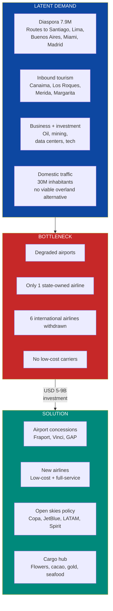
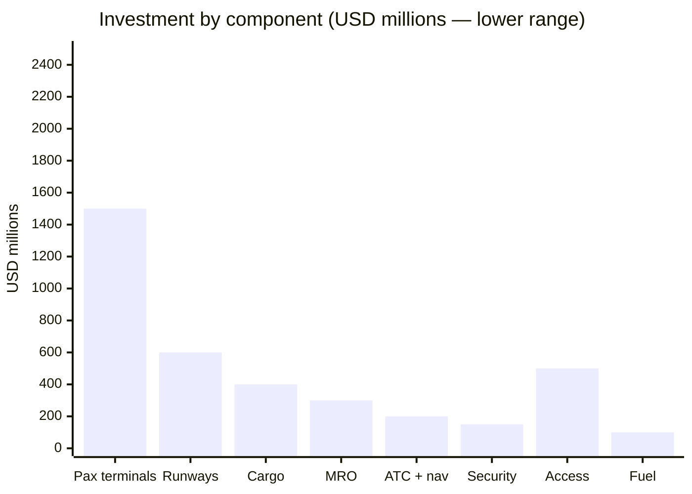
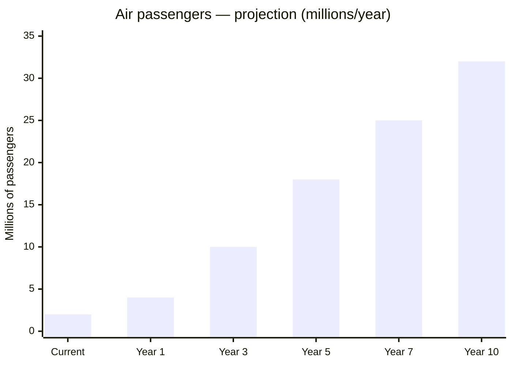

# Commercial Aviation & Airports: The Gateway to the World

> Venezuela had **8M+ air passengers/year** before the crisis. Today it barely moves ~2M. In November 2025, **6 international airlines withdrew their permits** from Maiquetia. The airports exist but are degraded. Domestic airlines were reduced to a single one (state-owned, with poor service). The country with the most privileged geographic position in the Caribbean — 3-5 flight hours from all of the Americas and 8-10 hours from Europe — is disconnected from the world. Reconnecting Venezuela is not a luxury — it is the condition for tourism, investment, the diaspora, and foreign trade to function.

---

## 1. The Opportunity: Caribbean Air Hub

:::info Irreplaceable geographic position
Venezuela is **3-5 flight hours from all of the Americas** (North, Central, South, and Caribbean) and **8-10 hours from major European capitals**. It is the natural gateway to the South American continent from the Caribbean. No other country in the region combines this position with a population of **30M**, a diaspora of **7.9M** ([UNHCR, Dec. 2025](https://www.unhcr.org/venezuela-emergency.html)), and oil reserves of **303B barrels** ([OPEC ASB 2025](https://www.opec.org/opec_web/en/publications/202.htm)).
:::

| Factor | Data | Implication |
|--------|------|-------------|
| **Pre-crisis passengers** | 8M+/year (2013) | Proven demand before the collapse |
| **Current passengers** | ~2M/year (est. 2025) | **75%** drop — this is the floor, not the ceiling |
| **Market potential** | **30M+ passengers/year** | 30M population + 7.9M diaspora + tourism + business |
| **Airlines withdrawn (Nov. 2025)** | 6 international | [Wikipedia — Simon Bolivar International Airport](https://en.wikipedia.org/wiki/Sim%C3%B3n_Bol%C3%ADvar_International_Airport_(Venezuela)) |
| **Distance to Miami** | ~3h flight | #1 route for diaspora and business |
| **Distance to Madrid** | ~8-9h flight | Gateway to Europe |
| **Distance to Bogota** | ~1.5h flight | CAN trade corridor |
| **Distance to Panama** | ~2.5h flight | Connection to the Americas hub |
| **Existing airports** | 6 major + regional | Degraded but existing infrastructure — not starting from zero |

### Why 30M+ Passengers/Year Is Achievable

| Comparable | Population | Air passengers/year | Passengers/capita |
|-----------|-----------|---------------------|---------------------|
| **Colombia** | 52M | **40M+** (2024) | 0.77 |
| **Chile** | 19M | **28M+** (2024) | 1.47 |
| **Peru** | 34M | **25M+** (2024) | 0.74 |
| **Panama** | 4.4M | **17M+** (2024) | 3.86 |
| **Dominican Republic** | 11M | **15M+** (2024) | 1.36 |
| **Venezuela (current)** | 30M | ~2M | **0.07** |
| **Venezuela (Year 10 target)** | 30M | **30M+** | 1.00 |

Sources: [IATA — Air Transport Statistics](https://www.iata.org/en/iata-repository/publications/economic-reports/); [Requires research] for individual country figures 2024.

:::tip The rebound is inevitable
At 0.07 passengers/capita, Venezuela is **10-20x below** any regional comparable. Just normalizing to Colombian levels (0.77 pax/capita) would mean **23M passengers/year**. Adding tourism, diaspora, and cargo pushes it to **30M+**. The market exists — what is missing is the infrastructure and the airlines.
:::

### Air Cargo: The Silent Multiplier

| Exportable product | Reference model | Reference export value | Source |
|--------------------|---------------------|------------------------------|--------|
| **Cut flowers** | Colombia | **USD 2.2B/year** (2nd largest exporter worldwide) | [Asocolflores](https://asocolflores.org/) |
| **Fine-flavor cacao** | Ecuador | USD 900M+/year | [ICCO](https://www.icco.org/) |
| **Shrimp / seafood** | Ecuador | USD 7B+/year | [CNA Ecuador](https://www.cna-ecuador.com/) |
| **Gold / precious metals** | Specialized secure transport | Depends on formalized production | [Requires research] |
| **E-commerce (fulfillment)** | Panama (Copa Cargo), Miami | USD 500M-1B in logistics fees | [Requires research] |
| **Pharmaceuticals** | Panama, Costa Rica | Growing | [Requires research] |

:::info Venezuela has ideal conditions for flowers
Colombia exports **USD 2.2B/year in flowers** from airports like Eldorado (Bogota) and Rionegro (Medellin). Venezuela has a similar climate, proximity to Miami (market #1), competitive labor, and suitable land in the states of Merida, Tachira, and Lara. A cargo airport with an IATA CEIV Fresh-certified cold chain could capture a share of this market — [Asocolflores](https://asocolflores.org/).
:::

---

## 2. Investment Sub-Opportunities

### A. Airport Concessions

:::danger Guiding principle
The State provides the legal framework, security, and air traffic control. Venezuela S.A. contributes land and airport infrastructure as equity and collects royalties as the shareholder of the citizen holding company. International private capital provides the investment, technology, execution, and operations. Standard: **ICAO Annex 14 + IATA Level of Service C minimum + Skytrax 5-star as target**. BOT/BOOT concessions of **25-30 years** with FIDIC Silver/Gold Book contracts.
:::

| Airport | City | IATA Code | Estimated investment | Target capacity | Strategic role | Timeline |
|-----------|--------|-------------|-------------------|----------------|-----------------|----------|
| **Maiquetia (Simon Bolivar)** | Caracas | CCS | **USD 1.5-2.5B** | **15-20M pax/year** | Main international hub | Years 1-5 |
| **Arturo Michelena** | Valencia | VLN | **USD 500M-1B** | **5-8M pax/year** | Second hub + industrial cargo | Years 2-6 |
| **Santiago Marino** | Porlamar (Margarita) | PMV | **USD 300-500M** | **3-5M pax/year** | Caribbean tourism gateway | Years 2-5 |
| **La Chinita** | Maracaibo | MAR | **USD 400-700M** | **4-6M pax/year** | Oil + mining + Colombia corridor | Years 2-6 |
| **Manuel Carlos Piar** | Puerto Ordaz | PZO | **USD 200-400M** | **2-3M pax/year** | Mining + data centers (Guri) | Years 2-5 |
| **Jose Antonio Anzoategui** | Barcelona | BLA | **USD 200-400M** | **2-3M pax/year** | Eastern oil corridor + tourism | Years 3-7 |
| **TOTAL** | | | **USD 3-5B** | **31-45M pax/year** | | |

#### Maiquetia: The Hub Venezuela Needs

| Parameter | Current | Target (Year 7) |
|-----------|--------|-------------|
| **Passengers/year** | ~2M (entire country) | **15-20M** |
| **International airlines** | Reduced (6 withdrew permits) | **25-35 airlines** |
| **Gates** | [Requires research] | **40-60 gates** |
| **Cargo terminal** | Limited, no cold chain | **IATA CEIV Fresh + Pharma** |
| **Runways** | 2 (operational with deferred maintenance) | **2 rehabilitated + preparation for 3rd** |
| **Level of service** | Below IATA C | **IATA Level C minimum, target B** |
| **Skytrax rating** | Unrated | **Target: 4-star (Year 5), 5-star (Year 10)** |
| **Duty-free / commercial** | Minimal | **50-60% non-aeronautical revenue** |
| **Ground connection** | Caracas-La Guaira highway (deteriorated) | **Rehabilitated highway + express train (phase 2)** |

Sources: [Wikipedia — Simon Bolivar International Airport](https://en.wikipedia.org/wiki/Sim%C3%B3n_Bol%C3%ADvar_International_Airport_(Venezuela)); [Requires research] for current operational data.

#### Reference Airport Operators

| Operator | Country | Airports operated | Key reference |
|----------|------|---------------------|-----------------|
| **Fraport** | Germany | Frankfurt + 30 global | [Fraport](https://www.fraport.com/en.html) |
| **Vinci Airports** | France | 70+ airports in 13 countries | [Vinci Airports](https://www.vinci-airports.com/) |
| **Grupo Aeroportuario del Pacifico (GAP)** | Mexico | 12 airports + Jamaica | [GAP](https://www.aeropuertosgap.com.mx/) |
| **Corporacion America (CAAP)** | Argentina | 50+ airports in 7 countries | [Corporacion America](https://www.corporacionamerica.com/) |
| **Changi Airport Group** | Singapore | Changi (#1 Skytrax 13 times) | [CAG](https://www.changiairport.com/) |
| **OPAIN** | Colombia | El Dorado (Bogota) — 40M+ pax | [OPAIN](https://eldorado.aero/) |

:::tip OPAIN El Dorado model: from disaster to benchmark
El Dorado in Bogota was a chaotic airport until Colombia conceded it to OPAIN (consortium led by Odinsa). Result: investment of **USD 1.2B**, new terminal, capacity of **40M+ passengers/year**, and it became **South America's #1 cargo airport** (1M+ tons/year). Maiquetia can replicate this model — [OPAIN](https://eldorado.aero/).
:::

### B. Domestic and International Airlines

| Parameter | Current state | Opportunity |
|-----------|--------------|-------------|
| **Domestic airlines** | Only Conviasa (state-owned, poor service, limited fleet) | **2-3 private carriers** (low-cost + full-service) |
| **Domestic routes** | <10 operating regularly | **15-20 routes connecting all major cities** |
| **International routes** | Drastically reduced | **30+ routes to diaspora + tourism + business** |
| **Total country fleet** | <20 operational aircraft (est.) | **60-100 aircraft** |
| **Skies policy** | Restrictive, obsolete bilateral | **Open skies with U.S., EU, LATAM** |

#### Low-cost carrier model: replicating Colombia and Brazil's success

| Comparable airline | Country | Model | Fleet | Result |
|---------------------|------|--------|-------|-----------|
| **Viva Air** (now Viva) | Colombia | Ultra low-cost (ULCC) | A320 | Democratized domestic flying; ~8M pax/year before restructuring |
| **Wingo** | Colombia/Panama | Low-cost (Copa Group) | 737-800 | Competitive regional routes |
| **Azul** | Brazil | Hybrid low-cost | 180+ aircraft (A320neo + E-Jets) | **38M+ pax/year**, connected 150+ cities |
| **GOL** | Brazil | Low-cost | 130+ aircraft (737 MAX) | 30M+ pax/year |
| **JetSMART** | Chile/Argentina | ULCC | A320neo | Aggressive expansion in the Southern Cone |
| **Flybondi** | Argentina | ULCC | 737-800 | Broke Aerolineas Argentinas' monopoly |

Sources: [CAPA — Centre for Aviation](https://centreforaviation.com/); fleet data per airline available in their annual reports.

#### Priority Routes

| Category | Routes | Estimated demand | Target frequency |
|-----------|-------|-----------------|-----------------|
| **Critical domestic** | CCS-MAR, CCS-VLN, CCS-PMV, CCS-PZO, CCS-BLA | High — no viable overland alternative for several | 3-5 daily flights each |
| **Top diaspora** | CCS-MIA, CCS-MAD, CCS-SCL, CCS-LIM, CCS-BOG, CCS-PTY, CCS-EZE | Very high — 7.9M Venezuelans abroad | 1-3 daily flights each |
| **Inbound tourism** | CCS-JFK, CCS-ORD, CCS-YYZ, CCS-GRU, PMV-MIA, PMV-BOG | High — tourism market to be developed | 1-2 daily flights |
| **Cargo** | CCS-MIA (cargo), VLN-MIA (cargo), CCS-AMS (flowers), CCS-MAD (cargo) | Medium-high — depends on agro-industrial development | 3-5 weekly cargo flights |

#### Recommended Fleet

| Aircraft type | Quantity | Estimated investment | Primary use |
|-----------------|----------|-------------------|---------------|
| **Airbus A320neo** | 15-25 | USD 750M-1.25B (list price ~USD 50M each) | Domestic + regional LATAM |
| **Boeing 737 MAX 8** | 10-15 | USD 500M-750M (list price ~USD 50M each) | Domestic + Caribbean + U.S. |
| **Airbus A321XLR** | 5-10 | USD 325M-650M (list price ~USD 65M each) | Transatlantic routes (Madrid, Lisbon) |
| **ATR 72-600** | 5-10 | USD 130M-260M (list price ~USD 26M each) | Short regional + tourism routes |
| **Total fleet** | **35-60** | **USD 1.7-2.9B** (list price; leasing reduces upfront capital) | |

:::caution List price vs. reality
List prices are a reference. Airlines obtain discounts of **40-60%** on large orders. Additionally, **operating leases** (GECAS, AerCap, Avolon) allow operation without purchasing: USD 300-450K/month per A320neo. A 30-aircraft fleet on lease requires ~USD 120-160M/year in rent, not USD 1.5B in capital — [Requires research] for current lease terms.
:::

#### Open Skies Policy

| Action | Detail | Impact |
|--------|---------|---------|
| **Sign Open Skies agreements** | With U.S., EU, Canada, Colombia, Panama, Chile, Brazil, Mexico | Allows any airline to operate routes without restrictions |
| **Eliminate frequency restrictions** | Abolish current restrictive bilateral system | More flights = more competition = lower prices |
| **International airlines to attract** | Copa, JetBlue, LATAM, American, Avianca, Spirit, Air Europa, Iberia, Air France | Each new airline adds 2-5 routes |
| **Landing incentives** | Airport fee exemption for 2-3 years for new routes | Ireland model (Ryanair at Shannon/Dublin) |

:::info Open Skies transformed Colombia
After signing the Open Skies agreement with the U.S. in 2011, Colombia went from **15M to 40M+ passengers/year** in a decade. Direct routes to the U.S. multiplied. VivaColombia (now Viva) was born as the country's first ULCC. The same effect is replicable in Venezuela — [Aerocivil Colombia](https://www.aerocivil.gov.co/).
:::

### C. Air Cargo and Logistics

| Component | Estimated investment | Standard | Target |
|-----------|-------------------|----------|------|
| **Maiquetia cargo terminal** (modernization) | USD 200-300M | IATA CEIV Fresh + CEIV Pharma | 200K+ tons/year |
| **Valencia cargo terminal** (new) | USD 150-250M | IATA CEIV Fresh | 100K+ tons/year — industrial zone |
| **Puerto Cabello cargo hub** (integrated air-sea) | USD 100-200M | IATA CEIV + GDP compliance | Multimodal: plane-to-ship in <24h |
| **National cold chain** | USD 50-100M | GDP, HACCP | Flowers, seafood, cacao, pharmaceuticals |
| **E-commerce fulfillment center** | USD 50-100M | Amazon/MercadoLibre standard | Northern LATAM distribution |
| **TOTAL CARGO** | **USD 550M-950M** | | |

#### Air Export Potential

| Product | Potential volume (Year 10) | Estimated value | Reference model | Source |
|----------|---------------------------|---------------|---------------------|--------|
| **Cut flowers** | 50K-100K tons/year | **USD 500M-1B/year** | Colombia: USD 2.2B/year | [Asocolflores](https://asocolflores.org/) |
| **Fine-flavor cacao** | 30K-50K tons/year | **USD 200-400M/year** | Ecuador: USD 900M+ | [ICCO](https://www.icco.org/) |
| **Shrimp / seafood** | 20K-40K tons/year | **USD 200-500M/year** | Ecuador: USD 7B+ (total seafood) | [CNA Ecuador](https://www.cna-ecuador.com/) |
| **Tropical fruits** | 30K-60K tons/year | **USD 100-300M/year** | Costa Rica, Peru | [Requires research] |
| **Gold / metals (secure transport)** | Per formalized production | Variable | Special security + insurance | [Requires research] |
| **Pharmaceuticals / e-commerce** | 10K-20K tons/year | **USD 100-200M/year** | Panama (Copa Cargo), Miami | [Requires research] |
| **Total air exports** | **170K-320K tons/year** | **USD 1.1-2.4B/year** | | |

### D. Aeronautical Maintenance (MRO)

:::info MRO opportunity: USD 10B+ regional market
The LATAM and Caribbean MRO market is worth **USD 10B+/year** and is concentrated in Brazil (LATAM MRO, GOL Aerotech) and Mexico (Mexicana MRO, Aeroman). Venezuela had MRO capability through PDVSA Aviation. With trainable technical labor, competitive labor costs, and a central geographic position, a certified MRO center can capture **USD 200-400M/year** in regional contracts — [Oliver Wyman MRO Forecast](https://www.oliverwyman.com/our-expertise/insights/2024/apr/fleet-and-mro-forecast-2024-2034.html).
:::

| Parameter | Detail |
|-----------|---------|
| **Location** | Maiquetia (CCS) or Valencia (VLN) — dedicated hangar |
| **Required certifications** | **EASA Part 145 + FAA 14 CFR Part 145** (dual certification) |
| **Work types** | C-Checks, D-Checks, component repair, painting, modifications |
| **Target fleet** | A320 family + 737 family (dominate LATAM with 70%+ of the fleet) |
| **Investment** | **USD 300-500M** (hangars, tooling, equipment, training) |
| **Direct jobs** | **3,000-5,000** (certified technicians, engineers, support) |
| **Estimated revenue (Year 5+)** | **USD 200-400M/year** |
| **Timeline** | Years 3-7 (requires 2-3 years for certification + training) |
| **Potential partners** | Airbus (joint venture), Boeing, Lufthansa Technik, ST Engineering |

#### MRO Comparables in LATAM

| MRO Center | Country | Capacity | Certifications | Jobs |
|-----------|------|-----------|-----------------|---------|
| **LATAM MRO** | Brazil/Chile | LATAM's largest | EASA + FAA + ANAC | 3,000+ |
| **Aeroman** (ST Engineering) | El Salvador | 12 wide-body bays | EASA + FAA | 3,500+ |
| **GOL Aerotech** | Brazil | 737 focus | ANAC + FAA | 2,500+ |
| **Mexicana MRO** | Mexico | Wide + narrow body | FAA + DGAC | 2,000+ |

Sources: [Oliver Wyman — MRO Forecast 2024-2034](https://www.oliverwyman.com/our-expertise/insights/2024/apr/fleet-and-mro-forecast-2024-2034.html); [Aviation Week MRO](https://aviationweek.com/mro).

---

## 3. Required Infrastructure

| Component | Estimated investment | Standard | Responsible |
|-----------|-------------------|----------|-------------|
| **Runways and taxiways** (rehabilitation of 6 airports) | USD 600M-1B | ICAO Annex 14, FAA AC 150/5300 | Concessionaire |
| **Passenger terminals** (new + expansion) | USD 1.5-2.5B | IATA Level of Service C minimum, target B | Concessionaire |
| **Cargo terminals** (3 major) | USD 400-600M | IATA CEIV Fresh + Pharma + GDP | Concessionaire |
| **Control towers + air navigation** | USD 200-300M | ICAO Annex 10, Eurocontrol standards | State (renewed INAC) |
| **Security systems** (screening, CCTV, biometrics) | USD 150-250M | TSA equivalent + ECAC | Concessionaire + State |
| **Ground access** (highways, express train to CCS) | USD 500M-1B | Integrated with road plan | Separate PPP |
| **Fuel services** (Jet-A1 kerosene farm) | USD 100-200M | IATA + JIG standards | Private (Shell, BP, Vitol) |
| **MRO hangars** | USD 300-500M | EASA Part 145 + FAA Part 145 | Private (JV with OEM) |
| **TOTAL INFRASTRUCTURE** | **USD 3.75-6.35B** | | |

---

## 4. Business Model

### 4.1 Airport concessions — who contributes what

| Role | Government | Private concessionaire |
|-----|----------|----------------------|
| **Land ownership** | Venezuela S.A. (JV shareholder) | Use under concession |
| **Legal framework** | Airport concession law | Regulatory compliance |
| **Perimeter security** | Police + INAC | Internal security (TSA-equivalent) |
| **Air traffic control** | State (renewed INAC) | N/A |
| **Infrastructure investment** | Maximum 10-15% (subsidy for regional airports) | **85-100% of capex** |
| **Operations** | Oversight + regulation | **100% operations** |
| **Maintenance** | Standards oversight | **100% maintenance** |
| **Revenue** | Annual fee (% of gross revenue) | Airport fees + commercial |
| **Duration** | N/A | **25-30 years** (renewable) |
| **Arbitration** | ICSID + Expert Panel | ICSID + Expert Panel |

### 4.2 Airport revenue structure

| Revenue source | % of total (target) | Detail |
|--------------------|-------------------|---------|
| **Airport fees** | 40-50% | Landing fee, passenger fee, cargo handling |
| **Commercial (non-aero)** | 50-60% | Duty-free, F&B, retail, parking, lounge, advertising |
| **Real estate** | 5-10% | Hotels, offices, logistics centers in airport zone |

:::tip The best airports earn more from shops than from planes
Changi (Singapore) generates **60%+ of revenue from non-aeronautical sources** — duty-free, retail, F&B, entertainment. Incheon (Korea) is similar. The modern airport model is a **shopping mall with runways**. Maiquetia with 15-20M passengers/year and world-class commercial operations can generate USD 300-500M/year in non-aero alone — [Changi Airport Group Annual Report](https://www.changiairport.com/corporate/media-centre/resources/publication.html).
:::

### 4.3 Airlines — business model

| Parameter | Low-cost carrier (LCC) | Full-service carrier |
|-----------|----------------------|---------------------|
| **Model** | ULCC style JetSMART/Flybondi | Copa/Avianca style |
| **Primary revenue** | Low base fare + ancillary (baggage, seats, food) | Inclusive fare + business class |
| **Target CASK** | USD 0.04-0.06/ASK | USD 0.06-0.09/ASK |
| **Target load factor** | 85-90% | 80-85% |
| **Ancillary revenue** | 30-40% of total revenue | 10-15% of total revenue |
| **Fleet** | Single type (A320neo or 737 MAX) | Mixed (narrow + wide body) |
| **Private investment** | USD 500M-1B (leasing-heavy) | USD 500M-2B |

### 4.4 Cargo — revenue model

| Service | Estimated rate | Year 10 target volume | Annual revenue |
|----------|----------------|----------------------|---------------|
| **General cargo handling** | USD 0.15-0.25/kg | 100K tons/year | USD 15-25M |
| **Cold chain (perishables)** | USD 0.30-0.50/kg | 80K tons/year | USD 24-40M |
| **Secure transport (gold/valuables)** | USD 1-5/kg | 5K tons/year | USD 5-25M |
| **E-commerce fulfillment** | USD 0.20-0.40/kg | 30K tons/year | USD 6-12M |
| **Ground handling fees** | Fixed per operation | 5K-10K operations/year | USD 10-20M |
| **Total cargo revenue (airports)** | | | **USD 60-120M/year** |

---

## 5. 10-Year Projection

| Indicator | Current | Year 1 | Year 3 | Year 5 | Year 7 | Year 10 |
|-----------|--------|-------|-------|-------|-------|--------|
| **Air passengers (M/year)** | ~2 | 4 | 10 | 18 | 25 | **32** |
| **Airlines operating** | ~5 | 10 | 18 | 25 | 30 | **35+** |
| **Domestic routes** | <10 | 12 | 18 | 22 | 25 | **25+** |
| **International routes** | <15 | 20 | 35 | 50 | 65 | **80+** |
| **Air cargo (K tons/year)** | ~30 | 50 | 100 | 180 | 250 | **320** |
| **Cumulative investment** | 0 | USD 1B | USD 3B | USD 5B | USD 7B | **USD 9B** |
| **Airport revenue** | ~USD 50M | USD 150M | USD 500M | USD 1.2B | USD 2B | **USD 3.5B** |
| **Airline revenue** | [Req. research] | USD 200M | USD 800M | USD 2B | USD 3.5B | **USD 5B+** |
| **Cargo revenue** | ~USD 10M | USD 30M | USD 100M | USD 300M | USD 500M | **USD 800M** |
| **MRO revenue** | 0 | 0 | USD 50M | USD 150M | USD 250M | **USD 400M** |
| **Total sector revenue** | ~USD 60M | USD 380M | USD 1.45B | USD 3.65B | USD 6.25B | **USD 9.7B** |
| **Direct jobs** | ~5K | 10K | 25K | 45K | 60K | **80K** |
| **Fiscal contribution (15% flat)** | ~USD 3M | USD 20M | USD 80M | USD 200M | USD 400M | **USD 700M** |

:::caution These projections assume political and economic normalization
The scenario requires: (1) progressive lifting of sanctions, (2) macroeconomic stability, (3) execution of airport concessions in Years 1-3, (4) active Open Skies policy. Without these prerequisites, the timeline extends 3-5 years.
:::

### Consolidated Financial Projection

| Metric | Year 3 | Year 5 | Year 7 | Year 10 |
|---------|-------|-------|-------|--------|
| **Total cumulative investment** | USD 3B | USD 5B | USD 7B | **USD 9B** |
| **Annual gross revenue** | USD 1.45B | USD 3.65B | USD 6.25B | **USD 9.7B** |
| **Estimated EBITDA (25-30%)** | USD 360-435M | USD 910M-1.1B | USD 1.56-1.88B | **USD 2.4-2.9B** |
| **Fee to Venezuela S.A.** | USD 70-100M | USD 180-250M | USD 310-440M | **USD 480-680M** |
| **Direct jobs** | 25K | 45K | 60K | **80K** |
| **Indirect jobs (2.5x)** | 63K | 113K | 150K | **200K** |

---

## 6. International Comparables

### Colombia — OPAIN / El Dorado (Bogota)

| Metric | Before (2007) | After (2025) | How |
|---------|-------------|----------------|------|
| **Passengers/year** | ~12M | **40M+** | Concession to OPAIN (Odinsa) |
| **Investment** | Minimal public | **USD 1.2B** private | BOT 20 years |
| **Cargo** | ~500K tons | **1M+ tons** (#1 in South America for cargo) | Dedicated terminal |
| **Airlines** | ~15 | **30+** | Open Skies + Copa/Avianca hub |
| **Quality** | Chaotic | **Skytrax 3-star** | Professional operations |

Source: [OPAIN — El Dorado](https://eldorado.aero/).

### Chile — SCL (Santiago)

| Metric | Before (2015) | After (2025) | How |
|---------|-------------|----------------|------|
| **Passengers/year** | ~18M | **28M+** | Concession to Nuevo Pudahuel (Vinci + ADP + Astaldi) |
| **Investment** | Old terminal | **USD 1.1B** in new terminal | BOT 20 years |
| **New terminal** | Did not exist | **230,000 m2, 38 gates** | Skytrax 4-star design |

Source: [Nuevo Pudahuel](https://www.nuevopudahuel.cl/).

### Panama — Tocumen (PTY)

| Metric | Before (2010) | After (2025) | How |
|---------|-------------|----------------|------|
| **Passengers/year** | ~6M | **17M+** | Copa Airlines hub |
| **Terminal 2** | Did not exist | **USD 900M, 20 gates** | Public-private investment |
| **Connectivity** | ~50 destinations | **80+ destinations** | Copa as flag carrier |
| **Cargo** | Limited | Cargo hub for the Americas | Integrated free zone |

Source: [Tocumen International Airport](https://www.tocumenpanama.aero/).

### Dominican Republic — Punta Cana (PUJ)

| Metric | Before (2000) | After (2025) | How |
|---------|-------------|----------------|------|
| **Passengers/year** | ~2M | **8M+** | First 100% private airport in the Americas |
| **Investment** | Private from inception | **USD 500M+** cumulative | Grupo Puntacana (Frank Rainieri) |
| **Model** | Private — not a concession, full ownership | Airport + integrated resort | Successful without state intervention |

Source: [Punta Cana International Airport](https://www.puntacanainternationalairport.com/).

### United Arab Emirates — Dubai (DXB)

| Metric | 1990 | 2025 | How |
|---------|------|------|------|
| **Passengers/year** | ~5M | **90M+** (#1 in the world for international traffic) | Emirates hub + total Open Skies |
| **Cumulative investment** | Minimal | **USD 30B+** | Government + private |
| **Duty-free** | Modest | **USD 2B+/year in sales** | Aggressive commercial model |
| **Jobs** | A few thousand | **90,000+ direct** | Aviation as an economic engine |

Source: [Dubai Airports](https://www.dubaiairports.ae/).

:::tip Dubai proved that aviation can BE the economic engine
Dubai does not have significant oil (it ran out). Its GDP of **USD 100B+** depends largely on aviation, tourism, and logistics. Emirates generates **USD 30B+/year** in revenue. DXB airport employs 90,000+ people. Venezuela does not need to be Dubai, but the example demonstrates that aviation is an **economic multiplier**, not a cost — [Emirates Group Annual Report](https://www.theemiratesgroup.com/english/our-company/annual-report.aspx).
:::

---

## 7. Potential Allies

| Company / Entity | Country | Specialty | Potential role |
|-------------------|------|-------------|---------------|
| **Fraport** | Germany | Airport operator (Frankfurt + 30 global) | Maiquetia concession — hub management |
| **Vinci Airports** | France | 70+ airports in 13 countries | Regional airport concessions |
| **GAP** (Grupo Aeroportuario del Pacifico) | Mexico | 12 airports in Mexico + Jamaica | Valencia or Maracaibo concession |
| **Corporacion America (CAAP)** | Argentina | 50+ airports in 7 countries (Armenia, Brazil, Ecuador, Uruguay, Italy) | Multi-airport package |
| **Changi Airport Group** | Singapore | Consulting + operations (#1 Skytrax) | Design advisory + Skytrax 5-star operations |
| **Copa Airlines** | Panama | Hub of the Americas, 80+ destinations | Airline partner — hub feeding from CCS |
| **JetBlue** | U.S. | Caribbean + northern LATAM, low-cost with quality | CCS-JFK, CCS-FLL routes |
| **LATAM Airlines** | Chile/Brazil | Largest airline in LATAM | Routes to South America + oneworld alliance |
| **Avianca** | Colombia | CAN + Central America regional network | CCS-BOG, CCS-MDE, CCS-PTY routes |
| **Spirit / Frontier** | U.S. | ULCC with strong Caribbean/LATAM presence | Low-cost routes to Florida |
| **Airbus** | Europe | OEM — A320neo family | Fleet supplier + MRO partner |
| **Boeing** | U.S. | OEM — 737 MAX family | Fleet supplier + MRO partner |
| **Lufthansa Technik** | Germany | Global MRO leader | Joint venture for MRO center |
| **ST Engineering** | Singapore | MRO (operates Aeroman in El Salvador) | EASA+FAA certified MRO center |
| **AerCap / GECAS / Avolon** | Global | Aircraft leasing | Fleet financing via leasing |
| **IDB / CAF** | Multilateral | Infrastructure financing | Loans for airport modernization |
| **DFC** (U.S.) | U.S. | Development financing | Airport infrastructure in allied countries |
| **IFC** (World Bank) | Multilateral | Project finance + technical assistance | Airport PPP structuring |
| **IATA** | Global | Aviation industry standards | CEIV certifications, service standards |

---

## 8. Risks and Mitigations

| # | Risk | Prob. | Impact | Mitigation |
|---|--------|-------|---------|------------|
| 1 | **Sanctions prevent U.S./EU airline operations** | Medium-High | Critical | Plan's sanctions roadmap; OFAC-specific licenses for civil aviation; prioritize airlines from countries without sanctions regimes |
| 2 | **Passenger traffic below projections** | Medium | High | Minimum revenue guarantee (MRG) in concessions; contracts with traffic floor; incentives for new routes |
| 3 | **Airlines refuse to operate in Venezuela** (reputational risk) | Medium | High | Transparent governance + aviation insurance + Copa/LATAM precedent in difficult markets |
| 4 | **Corruption in concession awards** | High | High | Open international tenders + Big 4 audit + multilateral oversight (IDB/CAF). [Plan's anticorruption system](/04-gobernanza/anticorrupcion-checklist) |
| 5 | **Insecurity in airport zones** (theft, drug trafficking) | Medium-High | High | Dedicated airport police + biometric systems + anti-narcotics controls (DEA/Interpol cooperation) |
| 6 | **Shortage of pilots and technicians** | High | Medium | Aviation schools (partnership with IATA Training) + repatriation of diaspora professionals + contracts with foreign pilots (Years 1-3) |
| 7 | **Jet-A1 fuel price** | Medium | Medium | Venezuela produces oil; refining Jet-A1 locally reduces import dependency. Fuel hedging |
| 8 | **Natural disasters / weather** | Low-Medium | Medium | ICAO Annex 14 design for tropical conditions; infrastructure insurance; operational redundancy |
| 9 | **Regional competition** (Bogota, Panama, Miami as hubs) | Medium | Medium | Do not compete head-on — position as complementary hub + Open Skies + lower operating costs |
| 10 | **Future government revokes concessions** | Medium | Critical | ICSID clauses + BIT (bilateral investment treaties) + early termination compensation + offshore SPV |

---

## 9. Sources

| # | Source | Data used |
|---|--------|---------------|
| 1 | [Wikipedia — Simon Bolivar International Airport](https://en.wikipedia.org/wiki/Sim%C3%B3n_Bol%C3%ADvar_International_Airport_(Venezuela)) | 6 airlines withdrew permits (Nov. 2025); Maiquetia data |
| 2 | [UNHCR — Venezuela Emergency](https://www.unhcr.org/venezuela-emergency.html) | 7.9M diaspora (Dec. 2025) |
| 3 | [OPEC ASB 2025](https://www.opec.org/opec_web/en/publications/202.htm) | 303B barrels of reserves |
| 4 | [IATA — Air Transport Statistics](https://www.iata.org/en/iata-repository/publications/economic-reports/) | Global air traffic statistics |
| 5 | [Asocolflores](https://asocolflores.org/) | Colombia: USD 2.2B/year in flower exports |
| 6 | [ICCO — International Cocoa Organization](https://www.icco.org/) | Ecuador: USD 900M+ in cacao |
| 7 | [CNA Ecuador](https://www.cna-ecuador.com/) | Ecuador: USD 7B+ in seafood |
| 8 | [OPAIN — El Dorado](https://eldorado.aero/) | El Dorado concession: USD 1.2B, 40M+ pax |
| 9 | [Nuevo Pudahuel](https://www.nuevopudahuel.cl/) | SCL concession: USD 1.1B, 28M+ pax |
| 10 | [Tocumen International Airport](https://www.tocumenpanama.aero/) | Copa hub: 17M+ pax, 80+ destinations |
| 11 | [Punta Cana International Airport](https://www.puntacanainternationalairport.com/) | First 100% private airport in the Americas |
| 12 | [Dubai Airports](https://www.dubaiairports.ae/) | DXB: 90M+ pax, #1 international |
| 13 | [Emirates Group Annual Report](https://www.theemiratesgroup.com/english/our-company/annual-report.aspx) | Emirates: USD 30B+/year revenue |
| 14 | [Oliver Wyman — MRO Forecast 2024-2034](https://www.oliverwyman.com/our-expertise/insights/2024/apr/fleet-and-mro-forecast-2024-2034.html) | LATAM MRO market: USD 10B+/year |
| 15 | [CAPA — Centre for Aviation](https://centreforaviation.com/) | LATAM low-cost airline data |
| 16 | [Aerocivil Colombia](https://www.aerocivil.gov.co/) | Colombia Open Skies: 15M to 40M+ pax in a decade |
| 17 | [Changi Airport Group — Annual Report](https://www.changiairport.com/corporate/media-centre/resources/publication.html) | 60%+ non-aeronautical revenue |
| 18 | [Fraport](https://www.fraport.com/en.html) | Operator: Frankfurt + 30 global |
| 19 | [Vinci Airports](https://www.vinci-airports.com/) | Operator: 70+ airports, 13 countries |
| 20 | [Grupo Aeroportuario del Pacifico](https://www.aeropuertosgap.com.mx/) | Operator: 12 airports Mexico + Jamaica |
| 21 | [Aviation Week MRO](https://aviationweek.com/mro) | Global MRO market data |

---

## Executive Summary

| Parameter | Value |
|-----------|-------|
| **Total investment** | **USD 5-9B** |
| **Timeline** | 10 years (bulk in Years 1-7) |
| **Direct jobs** | **40,000-80,000** |
| **Total jobs** (direct + indirect) | **100,000-200,000** |
| **Annual revenue at scale (Year 10)** | **USD 4-8B/year** (conservative: USD 5-6B) |
| **Passengers/year (Year 10 target)** | **30M+** |
| **Air cargo (Year 10 target)** | **300K+ tons/year** |
| **Model** | PPP concessions (BOT/BOOT) 25-30 years — zero state operations |
| **Standard** | ICAO Annex 14 + IATA LoS C + Skytrax 5-star (target) |
| **Main reference** | Colombia (OPAIN El Dorado) + Chile (SCL) + Panama (Tocumen) + Dubai (DXB) |
| **ROI** | Self-financing — airport fees + commercial + cargo + MRO |

:::tip Every plane that lands brings investors, tourists, diaspora, and cargo
Without functional airports, investors will not come to see the data centers. Tourists will not reach Los Roques. The 7.9M diaspora will not return to visit their families. The flowers, the cacao, and the gold will not leave the country. Aviation is not an isolated sector — it is the **nervous system** that connects Venezuela to the world. USD 5-9B in aviation enables the USD 550-750B of the total plan.
:::
