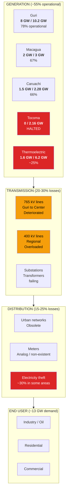
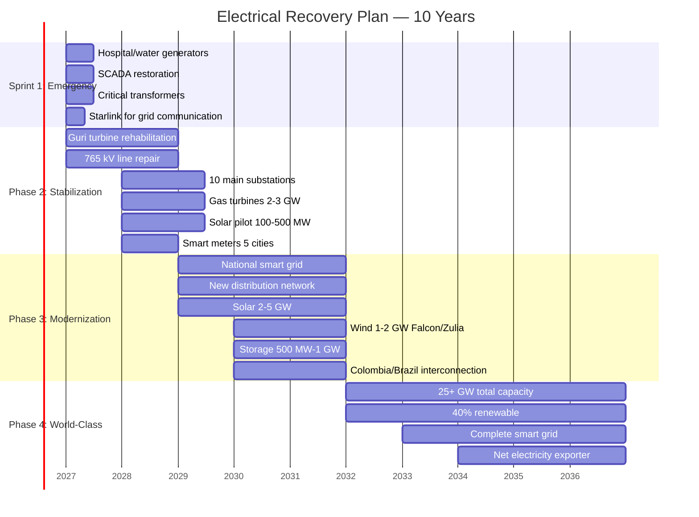
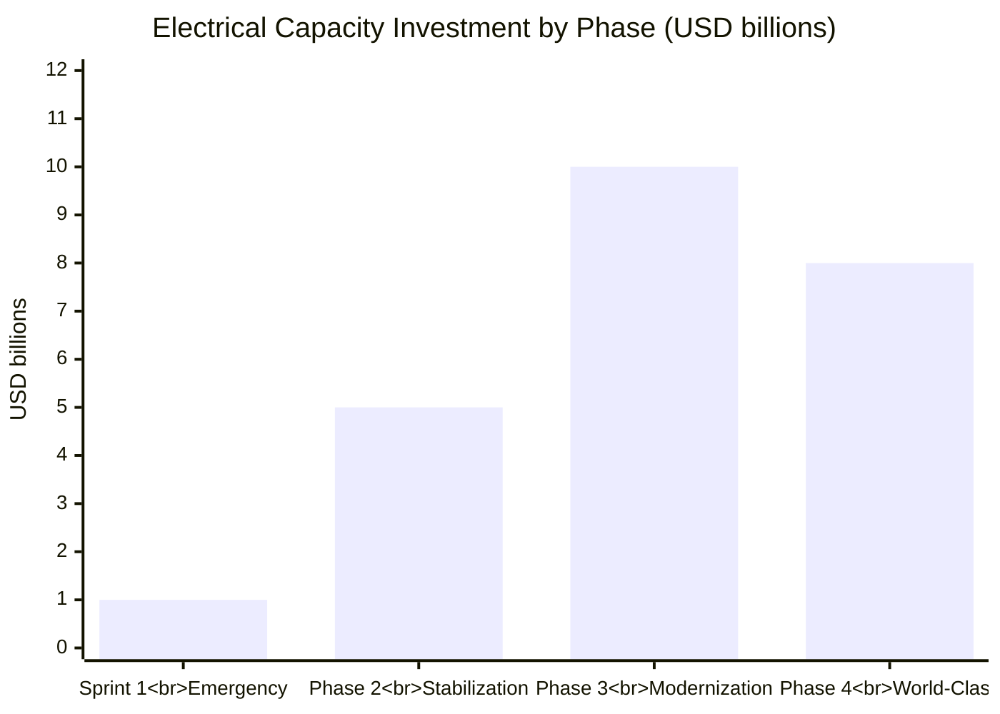
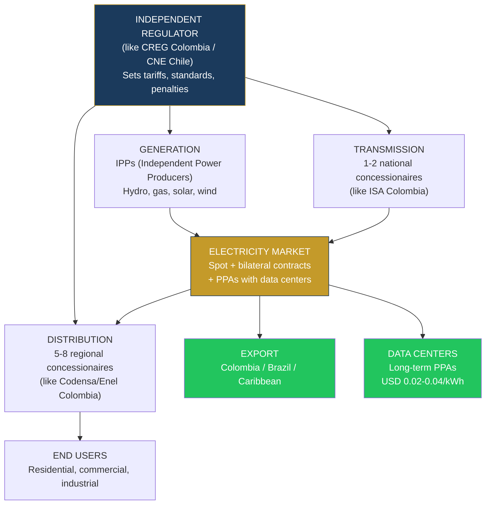
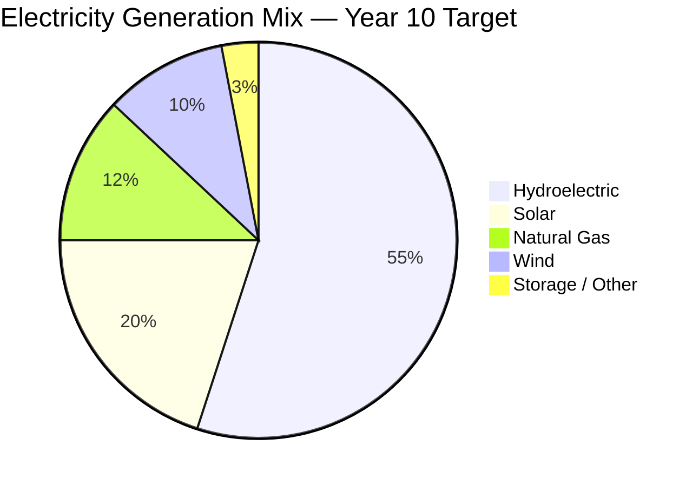
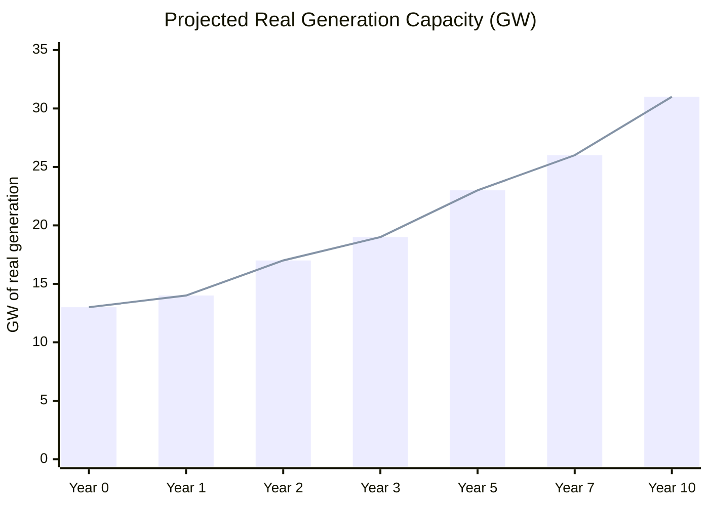

# Electrical Capacity: No Power, No Plan

> **"The electrical system is the most critical bottleneck for Venezuela's recovery."**
> — [U.S. Department of Energy, 2025](https://www.energy.gov/)

Without reliable electricity there are no data centers. No oil production. No digital state. No cold chain for food. No functioning hospitals. No foreign investment.

**Every dollar invested in electricity enables USD 5-10 in private investment in other sectors.** It is the infrastructure that enables all others.

---

## 1. The Opportunity

Venezuela has something most developing countries would kill for: **17 GW of installed hydroelectric capacity** on the Caroni Cascade. That is more than Chile's entire renewable capacity. The problem is not capacity — it is that the system was allowed to collapse.

| What Venezuela Has | What It Needs |
|--------------------|---------------|
| 17 GW hydro installed | Rehabilitate to produce >14 GW real |
| Solar irradiation 5-6 kWh/m2/day (top Americas) | Install solar panels and plants |
| 5,500 BCM of natural gas (7th worldwide) | Gas turbines for backup/peaks |
| Borders with Colombia and Brazil | Interconnection infrastructure for export |
| Domestic demand of only ~13 GW | Spare capacity for data centers + export |

The opportunity is not just to repair. It is to **modernize to smart grid standards** and turn electricity into an **export product** and a **magnet for tech investment**.

---

## 2. Current State: X-Ray of a Collapse

:::danger System in critical condition
Venezuela's electrical system has lost **>30% of its generation capacity** due to lack of maintenance, corruption, and loss of qualified personnel. [CORPOELEC](https://es.wikipedia.org/wiki/Corpoelec) operates with less than 50% of its original technical staff. Blackouts are chronic: in 2019 a national blackout lasted 5 days; since then, daily outages affect 23 of 24 states.
:::

### Main Plants — Current Status

| Plant | Type | Installed Capacity | Est. Real Production | % Operational | Main Problem |
|-------|------|--------------------|-----------------------|---------------|-------------|
| **Guri** (Simon Bolivar) | Hydro | 10,200 MW | ~8,000 MW | ~78% | Unmaintained turbines, obsolete SCADA, sedimentation |
| **Macagua I, II, III** | Hydro | 3,000 MW | ~2,000 MW | ~67% | Deteriorated turbines, failing transformers |
| **Caruachi** | Hydro | 2,280 MW | ~1,500 MW | ~66% | Deferred maintenance, obsolete electronic controls |
| **Tocoma** (unfinished) | Hydro | 2,160 MW (design) | **0 MW** | **0%** | Work halted since 2016, USD 10B+ invested without completion |
| **Planta Centro** | Thermal (gas/fuel) | 2,000 MW | ~400 MW | ~20% | Damaged boilers, fuel shortage, corrosion |
| **Tacoa** (Josefa Camejo) | Thermal (gas/fuel) | 1,700 MW | ~500 MW | ~29% | Previous explosions, obsolete equipment, scarce fuel oil |
| **Termo Zulia** | Thermal (gas) | 470 MW | ~150 MW | ~32% | Out-of-service turbines, insufficient gas |
| **Other thermoelectric** | Various | ~2,000 MW | ~500 MW | ~25% | Widespread neglect |
| **TOTAL** | — | **~23,800 MW** | **~13,050 MW** | **~55%** | — |

Sources: [Power Technology](https://www.power-technology.com/projects/gurihydroelectric/) (Guri); [Mongabay 2023](https://news.mongabay.com/2023/08/hydropower-in-the-pan-amazon-the-guri-complex-and-the-caroni-cascade/) (Caroni Cascade); [Columbia CGEP](https://www.energypolicy.columbia.edu/more-efficient-use-of-venezuelas-natural-gas-could-strengthen-the-regions-energy-security-and-the-countrys-electricity-sector/) (gas and electricity); own estimates based on 2024-2025 reports.

### The Problem Map

### Cascading Losses: From Generation to End User

| Stage | Capacity / Energy | Loss | Cause |
|-------|-------------------|------|-------|
| Generation (installed) | 23,800 MW | — | — |
| Generation (real) | ~13,050 MW | **-45%** | Plants out of service, deferred maintenance |
| Transmission | ~9,800 MW | **-25%** | Deteriorated lines, failing transformers |
| Distribution | ~7,800 MW | **-20%** | Obsolete networks, electricity theft |
| **Reaches user** | **~7,800 MW** | **-67% of total** | One-third of installed capacity |

**Translation:** Of every 3 MW installed, only 1 reaches the end user. A well-maintained system loses 8-12%, not 67%.

---

## 3. What Is Needed — Electrical Recovery Plan

### Sprint 1 (Months 1-6): Emergency

**Objective:** Prevent people from dying due to lack of electricity.

| Action | What It Solves | Est. Cost | Potential Provider |
|--------|---------------|-----------|-------------------|
| Emergency generators for 500+ hospitals and water plants | Human lives, cold chain | USD 150-300M | Caterpillar, Cummins, Aggreko |
| SCADA restoration at Guri + Macagua | Generation control and supervision | USD 50-100M | Siemens Energy, ABB, GE Vernova |
| Replacement of 50+ critical transformers | Collapsed substations | USD 200-400M | Hitachi Energy, Siemens, ABB |
| Starlink for grid communication backbone | Remote network monitoring | USD 5-10M | SpaceX/Starlink |
| Emergency repair crews (brigades) | Rapid fault response | USD 50-100M | Personnel + equipment |
| **TOTAL SPRINT 1** | | **USD 500M-1B** | |

:::caution This cannot wait
Sprint 1 starts on day 1 of the transition. It does not require complex legal reforms or CORPOELEC restructuring. It is financed with the first tranche of oil forwards or emergency credit from the IDB/CAF. These are generators and transformers — they are bought and installed.
:::

### Phase 2 (Months 6-24): Stabilization

**Objective:** Recover 80% of installed capacity and add thermal backup.

| Action | Target | Est. Cost | Impact |
|--------|--------|-----------|--------|
| Guri turbine rehabilitation (all units) | Restore from 8 GW to **10 GW** | USD 800M-1.5B | +2 GW of clean generation |
| Macagua + Caruachi rehabilitation | Restore to **4.5 GW** combined | USD 500M-1B | +3 GW of clean generation |
| 765 kV line repair (Guri to center of country) | Reduce transmission losses to <15% | USD 500M-1B | More energy reaches the north |
| Upgrade of 10 main substations | New transformers, protections | USD 300-600M | Fewer urban blackouts |
| Gas turbine installation (**2-3 GW** peak capacity) | Backup for peaks and emergencies | USD 1-2B | Elimination of rationing |
| Solar pilot: **100-500 MW** in Falcon, Zulia, Lara | Source diversification | USD 100-400M | Decentralized generation |
| Smart meters in 5 major cities | Loss control, real measurement | USD 100-200M | Reduction of electricity theft |
| **TOTAL PHASE 2** | | **USD 3-5B** | |

:::info Gas turbines: the backup Venezuela needs
Venezuela has **5,500 BCM of natural gas reserves** (7th worldwide, [U.S. CRS](https://www.congress.gov/crs-product/IF12448)). 80% is gas associated with oil — it is flared or vented. Converting that gas into electricity with modern turbines (GE HA, Siemens SGT-8000H) solves two problems: (1) electrical backup for demand peaks, (2) revenue instead of waste. A 400 MW combined-cycle turbine costs ~USD 300-400M and can be installed in 18-24 months.
:::

### Phase 3 (Year 2-5): Modernization

**Objective:** Smart grid + renewables + regional interconnection.

| Action | Target | Est. Cost | Reference |
|--------|--------|-----------|-----------|
| National smart grid deployment | Real-time monitoring, self-diagnosis, automatic response | USD 1-2B | [Smart grid market USD 52B -> 154B](https://www.grandviewresearch.com/industry-analysis/smart-grid-market) (CAGR 16.8%) |
| Distribution network reconstruction | Losses <10%, 99%+ reliability | USD 1.5-3B | Colombia: distribution concessions |
| Solar plants **2-5 GW** | Distributed generation + export | USD 1.5-3B | Chile: from net importer to solar powerhouse in 10 years |
| Wind farms **1-2 GW** (Falcon, Zulia, La Guajira) | Complement to hydro and solar | USD 1-2B | Colombia: La Guajira (same wind corridor) |
| Battery storage **500 MW-1 GW** | Grid stabilization, peak shaving | USD 500M-1B | Australia: Hornsdale Power Reserve (Tesla) |
| Tocoma completion | +2.16 GW of hydro | USD 1-2B | [Requires research: current construction status] |
| Electrical interconnection with Colombia and Brazil | Export + mutual backup | USD 300-500M | SIEPAC (Central America): interconnection model |
| **TOTAL PHASE 3** | | **USD 5-10B** | |

### Phase 4 (Year 5-10): World-Class

**Objective:** 25+ GW capacity, 40% renewable, net exporter.

| Action | Target | Est. Cost |
|--------|--------|-----------|
| Solar expansion to **5-8 GW** total | Solar as second source after hydro | USD 2-4B |
| Wind expansion to **2-3 GW** total | Three operational wind corridors | USD 1-2B |
| Advanced storage **2-3 GW** (batteries + pumped hydro) | Full grid stabilization | USD 1-2B |
| Complete smart distribution network | Smart meters on 100% of connections | USD 500M-1B |
| Data center corridor powered (Bolivar) | 500 MW-1 GW dedicated to DCs | Private investment |
| Export to Colombia, Brazil, Caribbean | Revenue stream | USD 500M-1B (infrastructure) |
| **TOTAL PHASE 4** | | **USD 5-8B** |

---

## 4. Total Investment and Sources

### Investment Summary by Phase

| Phase | Investment | Timeline | Result |
|-------|-----------|----------|--------|
| Sprint 1: Emergency | USD 500M-1B | Months 1-6 | Hospitals and water with power, SCADA restored |
| Phase 2: Stabilization | USD 3-5B | Months 6-24 | 80% capacity restored, gas as backup |
| Phase 3: Modernization | USD 5-10B | Year 2-5 | Smart grid, renewables, interconnection |
| Phase 4: World-Class | USD 5-8B | Year 5-10 | 25+ GW, net exporter, DC corridor |
| **TOTAL** | **USD 15-25B** | **10 years** | **First-tier electrical system** |

### Financing Sources

| Source | Est. Amount | Mechanism | Probability |
|--------|-----------|-----------|-------------|
| **DFC / OPIC (U.S.)** | USD 3-5B | Sovereign credit + guarantees | High (aligned with Wright's control of oil sales) |
| **World Bank / IFC** | USD 2-4B | Development loans + technical assistance | High (critical infrastructure) |
| **IDB / CAF** | USD 2-3B | Multilateral credit | High (regional mandate) |
| **Oil forwards** | USD 2-4B | Reinvested oil revenues | Medium-high (depends on production) |
| **PPP / Private IPPs** | USD 3-5B | Generation and distribution concessions | Medium (depends on legal framework) |
| **Green bonds** | USD 1-3B | Green debt market (solar + wind) | Medium (requires credit rating) |
| **Bilateral cooperation** | USD 1-2B | Japan (JICA), Korea (KOICA), EU | Medium |
| **TOTAL SOURCES** | **USD 15-25B** | | |

:::tip Revenue: electricity pays for itself
Unlike roads or schools, electricity generates direct revenue. With tariffs adjusted to real cost (not populist subsidies), the electricity sector is self-sustaining. At USD 0.06-0.08/kWh average and 80 TWh/year in sales, gross revenue is **USD 5-6B/year**. That covers operations + debt service + expansion. Add export to Colombia/Brazil (USD 300-500M/year) and sales to data centers (USD 200-500M/year) and the sector is profitable.
:::

---

## 5. Business Model: Concessions, Not CORPOELEC

:::danger CORPOELEC does not work
CORPOELEC is the perfect example of why the State should not operate utilities. It merged 14 electricity companies in 2007, eliminated competition, politicized management, lost talent, and left the grid in ruins. The reconstruction model is **private concessions with state regulation** — exactly what works in Colombia, Chile, and Peru.
:::

### Proposed Structure

### Model Components

| Component | Model | Reference | Why It Works |
|-----------|-------|-----------|-------------|
| **Independent regulator** | CREG (Colombia), CNE (Chile) | [CREG Colombia](https://www.creg.gov.co/) | Tariffs based on real cost, not politics. Executive autonomy |
| **Generation: IPPs** | Competitive tenders | Colombia: 30+ private generators | Competition lowers prices, improves quality |
| **Transmission: national concession** | ISA (Colombia, now Ecopetrol) | [ISA](https://www.isa.co/) | Trunk network as regulated natural monopoly |
| **Distribution: regional concessions** | Enel, AES, Celsia (Colombia) | [Enel Americas](https://www.enel.com/) | Private operator with measurable service standards |
| **PPAs with data centers** | 10-20 year fixed-price contracts | Chile: solar PPAs for mining | Predictable revenue, attracts investment |
| **Spot electricity market** | Energy exchange | Colombia: XM (market operator) | Transparent pricing, efficiency |

### PPAs: The Contract That Attracts Data Centers

A **Power Purchase Agreement (PPA)** is what hyperscalers need to justify USD 500M-2B in a data center.

| PPA Term | Venezuela (proposal) | Chile (reference) | U.S. (Virginia) |
|----------|---------------------|--------------------|--------------------|
| Price | **USD 0.02-0.04/kWh** | USD 0.04-0.06/kWh | USD 0.06-0.10/kWh |
| Duration | 15-20 years | 10-15 years | 10-15 years |
| Source | Hydro + solar | Solar | Gas + nuclear |
| Breach penalty | Yes (ISDA standard) | Yes | Yes |
| Supply guarantee | 99.5%+ (with gas backup) | 99.9% | 99.99% |

**Savings for a 100 MW DC:** USD 30-50M/year vs. Chile, USD 50-80M/year vs. U.S. Over a 15-year PPA: **USD 450M-1.2B in savings** per 100 MW.

---

## 6. Renewable Potential: Solar + Wind + Hydro

### Solar: One of the Best Resources in the Hemisphere

| Data Point | Value | Reference |
|------------|-------|-----------|
| Average solar irradiation | **5-6 kWh/m2/day** | [Global Solar Atlas](https://globalsolaratlas.info/) |
| Best zones | Falcon, Zulia, Lara, Nueva Esparta | Irradiation >6 kWh/m2/day |
| Comparison with Chile (Atacama) | Chile: 6-7 kWh/m2/day | Venezuela is comparable in coastal zones |
| Utility-scale solar cost (global 2025) | **USD 30-40/MWh** | [IRENA 2024](https://www.irena.org/) |
| Expected capacity factor | 20-25% | Tropical standard |

:::info Solar + hydro = perfect combination
Hydro generates 24/7 but depends on rainfall. Solar generates during the day when demand peaks. Together, they cover >90% of the demand profile without needing massive storage. Gas comes in as backup for the remaining 10%. This is the same combination that makes Brazil one of the cleanest grids in the world.
:::

### Wind: The La Guajira Corridor

Falcon, Zulia, and the La Guajira Peninsula (shared with Colombia) have winds of **7-9 m/s annual average** — among the best in LATAM. Colombia already has projects on its side of La Guajira. Venezuela does not have a single operational utility-scale wind farm.

| Zone | Wind Speed | Estimated Potential | Capacity Factor |
|------|-----------|---------------------|-----------------|
| Falcon (Paraguana) | 7-9 m/s | 1-2 GW | 30-40% |
| Zulia (Venezuelan Guajira) | 7-8 m/s | 500 MW-1 GW | 28-35% |
| Nueva Esparta (future offshore) | 6-8 m/s | 500 MW-1 GW | 25-35% |

### Projected Energy Mix (Year 10)

| Source | Capacity (GW) | % of Generation | Role |
|--------|---------------|-----------------|------|
| Hydroelectric | 14-16 GW | 55% | Base load, 24/7 |
| Solar | 5-8 GW | 20% | Daytime peak, distributed |
| Natural gas | 3-4 GW | 12% | Backup, peaks, balancing |
| Wind | 2-3 GW | 10% | Complement, especially nocturnal |
| Storage (batteries + pumped hydro) | 2-3 GW | 3% | Stabilization, peak shaving |
| **TOTAL** | **26-34 GW** | **100%** | **88% renewable (hydro+solar+wind)** |

---

## 7. Critical Infrastructure Security

The electrical grid is the country's most critical infrastructure. A cyber or physical attack can paralyze everything — hospitals, water, telecoms, oil, defense. Reconstruction must include security by design.

| Domain | Reference Standard | Application in Venezuela |
|--------|-------------------|--------------------------|
| **Grid cybersecurity** | [NERC CIP](https://www.nerc.com/pa/Stand/Pages/CIPStandards.aspx) (U.S.) | Mandatory standard for all grid operators |
| **Physical security** | IEEE 1402 | Perimeter protection for substations and plants |
| **Control communications** | IEC 62351 | SCADA communication encryption |
| **Disaster resilience** | IEEE 1366 (SAIDI/SAIFI) | Reliability and restoration time metrics |
| **Operations center** | SOC 24/7 | Cybersecurity center for the electricity sector |

### Security Plan

| Action | Est. Cost | Timeline |
|--------|-----------|----------|
| NERC CIP implementation in generation and transmission | USD 50-100M | Years 1-3 |
| Physical security for 50 critical substations | USD 100-200M | Years 1-2 |
| Electrical Cybersecurity Center (SOC) | USD 20-50M | Year 1 |
| Redundant communications network (fiber + Starlink) | USD 30-60M | Years 1-2 |
| Incident response plan and drills | USD 10-20M/year | Ongoing |
| **TOTAL** | **USD 200-400M** | |

---

## 8. Human Capital: The Invisible Problem

:::danger Without engineers there is no grid
Venezuela has lost **60-70% of its electrical engineers and technicians** to emigration. CORPOELEC operates with underqualified, underpaid staff without tools. You cannot rebuild a 25 GW grid without people who know how to operate it.
:::

| Need | Quantity | Timeline | How |
|------|----------|----------|-----|
| Senior electrical engineers | 2,000-3,000 | Years 1-5 | Diaspora return (competitive salaries USD 3,000-8,000/month) |
| Line and substation technicians | 5,000-8,000 | Years 1-5 | Accelerated training programs (12-18 months) |
| SCADA / smart grid specialists | 500-1,000 | Years 2-5 | Siemens/ABB/GE certifications + diaspora |
| Plant operators | 1,000-2,000 | Years 1-3 | Retraining of existing personnel |
| OT cybersecurity specialists | 200-500 | Years 2-5 | Programs with SANS Institute, ISA/IEC |
| **TOTAL** | **10,000-15,000** | **5 years** | |

**Human capital investment:** USD 200-500M over 5 years (salaries, training, certifications, equipment).

---

## 9. Electricity Export: Revenue Stream

Venezuela can be a **net electricity exporter** to Colombia, Brazil, and the Caribbean. Interconnection infrastructure is relatively cheap compared to generation.

| Destination | Exportable Capacity | Est. Annual Revenue | Infrastructure Needed | Cost |
|-------------|---------------------|---------------------|-----------------------|------|
| **Colombia** | 500-1,000 MW | USD 200-400M/year | 500 kV line Zulia -> Norte de Santander | USD 200-300M |
| **Brazil** | 300-500 MW | USD 100-200M/year | 500 kV line Bolivar -> Roraima | USD 150-250M |
| **Caribbean** (submarine cable) | 100-200 MW | USD 50-100M/year | Submarine cable to Trinidad/Curacao | USD 200-400M |
| **TOTAL** | **1,000-1,700 MW** | **USD 350-700M/year** | | **USD 500M-1B** |

:::info Colombia already imports electricity
Colombia imports electricity from Ecuador when drought affects its reservoirs. Venezuela, with Guri and the Caroni Cascade restored, can be the natural supplier by geographic proximity. Brazil (state of Roraima) has no connection to the Brazilian national grid — it runs on diesel generators. A line from Bolivar would solve that at competitive cost.
:::

---

## 10. Potential Partners

| Company / Entity | Country | Capability | Potential Role |
|------------------|---------|------------|---------------|
| **Siemens Energy** | Germany | Gas turbines, SCADA, smart grid | Guri rehabilitation, gas turbines, control |
| **ABB** | Switzerland | Transformers, transmission, automation | Substations, SCADA, smart grid |
| **GE Vernova** | U.S. | Gas/hydro turbines, grid solutions | Gas turbines, hydro rehabilitation |
| **Hitachi Energy** | Japan/Switzerland | Transformers, HVDC, grid | High-voltage transmission, transformers |
| **Schneider Electric** | France | Distribution, smart grid, EMS | Distribution, smart meters, energy management |
| **AES Corporation** | U.S. | IPP, storage, renewables | Generation/distribution operator |
| **Enel** | Italy | IPP, distribution, renewables | Distribution concessionaire |
| **Iberdrola** | Spain | Renewables, distribution | Wind/solar operator, distribution |
| **U.S. DOE** | U.S. | Technical assistance, financing | Already engaged (Wright visited Caracas) |
| **World Bank / IFC** | Multilateral | Financing, technical assistance | Electrical development loans |
| **IDB / CAF** | Multilateral | Regional financing | Infrastructure credit |

---

## 11. Comparables: Who Has Done It

### Colombia: From Blackouts to Reliable Grid

| Before (1990s) | After (2000s+) | How |
|----------------|----------------|-----|
| Months of electricity rationing | 99.5%+ reliability | Privatization of generation and distribution |
| Concentrated hydroelectric (vulnerable to El Nino) | Diversified mix (hydro + gas + solar + wind) | Firm energy auctions |
| Politicized subsidized tariffs | Real-cost tariffs with targeted subsidies | CREG as independent regulator |
| ICEL (state company, inefficient) | ISA, Celsia, EPM, Enel (competition) | Public Utilities Law 142/1994 |

**Lesson:** Colombia took 10-15 years but went from rationing to electricity exporter. The independent regulator (CREG) was key.

### Chile: From Importer to Solar Powerhouse

| Data Point | Chile 2010 | Chile 2025 | Source |
|------------|-----------|-----------|--------|
| Solar generation | ~0 MW | **8,000+ MW** | [CNE Chile](https://www.cne.cl/) |
| Solar cost | N/A | **USD 30-40/MWh** | IRENA |
| % renewable (excl. hydro) | <5% | **35%+** | [National Electrical Coordinator](https://www.coordinador.cl/) |
| Exports electricity | No | Studying export to Argentina | — |

**Lesson:** Chile demonstrated that a country with high solar resources can transform its energy matrix in 10 years with competitive auctions and predictable regulation. Venezuela has comparable solar resources and additionally has hydro.

### Rwanda: Smart Grid in a Developing Country

| Data Point | Rwanda 2010 | Rwanda 2025 | Source |
|------------|-----------|-----------|--------|
| Electricity access | 10% | **75%+** | [World Bank](https://www.worldbank.org/) |
| Smart meters installed | 0 | **500,000+** | [Rwanda Energy Group](https://www.reg.rw/) |
| Distribution losses | 25%+ | **<15%** | World Bank |
| New connection time | Months | **<7 days** | Doing Business |

**Lesson:** If Rwanda could deploy smart meters and smart grid with a GDP of USD 14B, Venezuela with USD 82B and 17 GW of hydro can do it better and faster.

---

## 12. Risks and Mitigations

| Risk | Probability | Impact | Mitigation |
|------|------------|--------|------------|
| **Severe drought reduces hydro generation** | Medium | High | Diversification: gas + solar + wind reduce hydro dependence from 78% to 55% |
| **Insufficient investment / delays** | Medium-high | High | Multilateral financing + oil forwards secure capital. Independent phases |
| **Grid sabotage or attack** | Medium | Very high | NERC CIP + physical security + redundancy + SOC 24/7 |
| **Continued human capital flight** | High | High | Competitive salaries (USD 3,000-8,000/month), certifications, technical career path |
| **Inadequate legal framework for IPPs** | Medium | High | Electrical concession law as legislative priority (Colombia Law 142/1994 model) |
| **Contract corruption** | High | High | International tenders, multilateral oversight (World Bank + IDB), EITI transparency |
| **Union / political resistance to privatization** | Medium | Medium | Transition model: retire/retrain/entrepreneurship. No mass layoffs |
| **Gas price volatility** | Medium | Medium | Domestic gas at regulated price. Long-term PPAs for solar/wind |
| **Tocoma: unrecoverable project** | Medium | Medium | Independent assessment. If not viable, reallocate funds to solar/wind |

---

## 13. 10-Year Projection

| Indicator | Year 0 (current) | Year 1 | Year 2 | Year 3 | Year 5 | Year 7 | Year 10 |
|-----------|------------------|--------|--------|--------|--------|--------|---------|
| **Real generation (GW)** | ~13 | 14 | 17 | 19 | 23 | 26 | 28-34 |
| **Installed capacity (GW)** | ~24 | 25 | 27 | 29 | 33 | 37 | 40-45 |
| **Transmission losses** | 25-30% | 22% | 18% | 15% | 12% | 10% | 8% |
| **Distribution losses** | 20-25% | 20% | 17% | 14% | 10% | 8% | 6% |
| **Reliability (SAIDI hrs/year)** | >100 | 80 | 50 | 30 | 15 | 8 | <4 |
| **% renewable (hydro+solar+wind)** | 78% (hydro only) | 78% | 80% | 82% | 85% | 87% | 88% |
| **Cumulative investment (USD B)** | 0 | 1 | 5 | 8 | 15 | 20 | 25 |
| **Smart meters (millions)** | 0 | 0.1 | 0.5 | 1.5 | 4 | 7 | 10+ |
| **Export (MW)** | 0 | 0 | 0 | 100 | 500 | 1,000 | 1,500+ |
| **Direct sector jobs** | ~15,000 | 20,000 | 30,000 | 40,000 | 55,000 | 65,000 | 75,000+ |
| **Sector gross revenue (USD B/year)** | ~1 | 1.5 | 2.5 | 3.5 | 5 | 6 | 7-8 |

---

## Executive Summary

| Parameter | Value |
|-----------|-------|
| **Total investment** | USD 15-25B over 10 years |
| **Capacity target (year 10)** | 28-34 GW real generation |
| **Renewable mix** | 88% (hydro 55% + solar 20% + wind 10% + storage 3%) |
| **Export** | 1,500+ MW to Colombia, Brazil, Caribbean |
| **Gross revenue year 10** | USD 7-8B/year |
| **Direct jobs** | 75,000+ |
| **Model** | Private concessions + independent regulator (not CORPOELEC) |
| **ROI** | Self-sustaining sector from year 3-4 with real-cost tariffs |

:::tip Electricity is the prerequisite for everything
Without reliable electricity: no data centers (USD 0 in tech investment), no stable oil production (PDVSA loses USD 500M-1B/year from blackouts), no digital state (Estonia does not work without power), no cold chain (food spoils), no functioning hospitals.

**USD 15-25B in electricity enables USD 550-750B of the total plan.** It is the best ROI in the entire budget.
:::

---

## Related Documents

- [AI Data Centers](./data-centers-ia) — Data centers as primary customer for Guri's surplus hydroelectric energy
- [Renewable Energy](./energia-renovable) — Solar and wind complement the hydroelectric base for an 85%+ renewable mix
- [Critical Minerals](./minerales-criticos) — Aluminum smelters and iron plants as large industrial electricity consumers
- [Industrial Manufacturing](./manufactura-industrial) — Reliable electricity as prerequisite for industrial reactivation
- [Telecommunications](./telecomunicaciones) — Telecom towers and base stations require stable electricity
- [Concession Model](./modelo-concesiones) — Generation, transmission, and distribution concessions (50-80 years)

---

Main sources: [Power Technology](https://www.power-technology.com/projects/gurihydroelectric/); [Mongabay 2023](https://news.mongabay.com/2023/08/hydropower-in-the-pan-amazon-the-guri-complex-and-the-caroni-cascade/); [Columbia CGEP](https://www.energypolicy.columbia.edu/more-efficient-use-of-venezuelas-natural-gas-could-strengthen-the-regions-energy-security-and-the-countrys-electricity-sector/); [U.S. CRS — Venezuela Natural Gas](https://www.congress.gov/crs-product/IF12448); [CREG Colombia](https://www.creg.gov.co/); [IRENA](https://www.irena.org/); [Grand View Research — Smart Grid](https://www.grandviewresearch.com/industry-analysis/smart-grid-market); [Global Solar Atlas](https://globalsolaratlas.info/); [NERC CIP Standards](https://www.nerc.com/pa/Stand/Pages/CIPStandards.aspx).
