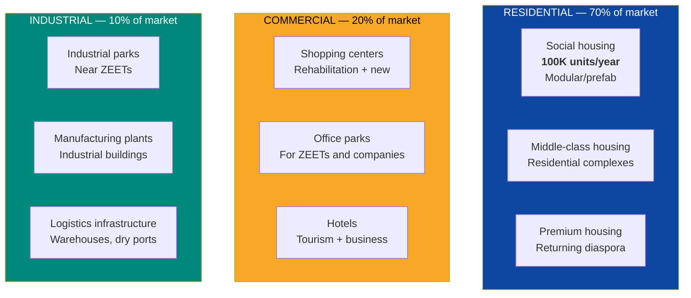
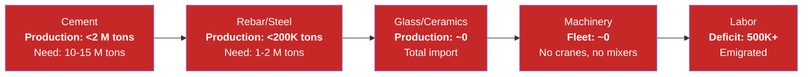
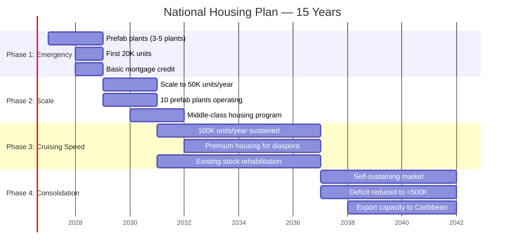
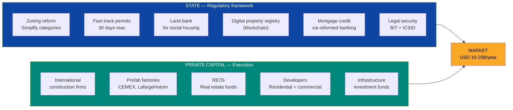
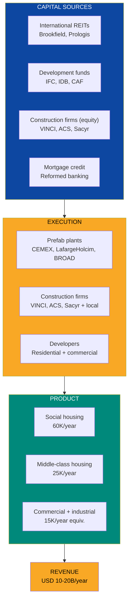
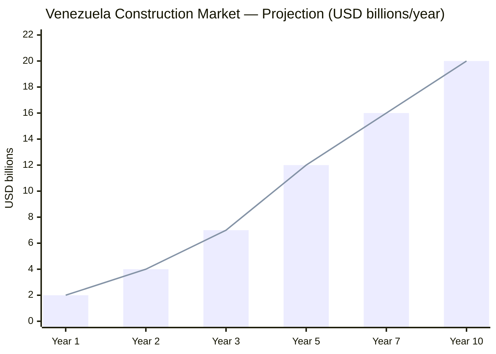

# Construction & Real Estate: Rebuilding an Entire Country

> Venezuela needs **3 to 4 million homes**. Every commercial building that didn't collapse was abandoned. Every shopping center that didn't close was looted. There's no cement, no rebar, no cranes. The construction industry collapsed at the same rate as the country. That's not just a problem — it's the largest construction market in Latin America waiting to be unlocked.

---

## 1. The Opportunity: USD 10-20B/Year in a Virgin Market

:::danger Critical housing deficit
Venezuela has an accumulated deficit of **3-4 million homes** — [Requires research: exact post-2020 figure]. The Gran Mision Vivienda Venezuela (GMVV) built ~3.9 million units according to official figures, but quality is questionable (structures without services, without urban planning, without maintenance) and demand grew faster than supply. With 7.9 million emigrants ([UNHCR, Dec. 2025](https://www.unhcr.org/us/emergencies/venezuela-situation)) potentially returning, the real deficit could reach **5 million units**.
:::

| Data Point | Figure | Source |
|------|-------|--------|
| Estimated housing deficit | **3-4 million units** | [Requires research] |
| GMVV homes built (2011-2025) | ~3.9 M (questionable quality) | Government of Venezuela |
| Potential diaspora return | **7.9 M people** | [UNHCR, Dec. 2025](https://www.unhcr.org/us/emergencies/venezuela-situation) |
| LATAM construction market (2025) | **USD 430,000 M** | [Requires research] |
| Venezuela pre-crisis construction market (2012) | ~USD 15,000 M/year | [Requires research] |
| Current Venezuela construction market | **<USD 1,000 M/year** | [Requires research] |
| Potential reconstructed market | **USD 10-20,000 M/year** | Own projection based on regional comparables |

**Translation for non-experts:** Imagine a country the size of Texas where nothing has been built in 15 years. Everything is broken, abandoned, or in ruins. Now imagine that 8 million people want to come back and need a place to live. That's Venezuela today. The builder who enters first captures the largest market in the hemisphere.

### Opportunity sectors

---

## 2. The Problem: Why Nothing Gets Built

Venezuela's construction industry isn't weakened — it's **dead**. Understanding why is a prerequisite for designing the solution.

| Problem | Severity | Description |
|----------|-----------|-------------|
| **Zero construction materials** | CRITICAL | Nationalized and paralyzed cement plants. Rebar production at <10%. No glass, no ceramics, no industrial paint |
| **No machinery** | CRITICAL | Cranes, excavators, mixers — everything left with the expropriated companies. [Requires research] |
| **No skilled labor** | CRITICAL | Masons, electricians, plumbers, civil engineers — emigrated or changed trades |
| **No mortgage credit** | CRITICAL | Collapsed banking system. No long-term housing financing exists |
| **Permits and bureaucracy** | HIGH | Construction permit can take 2+ years. Bribery chain at every level |
| **Land ownership** | HIGH | Property registry destroyed/corrupted. Land invasions. Legal insecurity |
| **Past expropriations** | HIGH | Government expropriated construction companies (Cementos Lafarge, Holcim), materials, and land. Investors have long memories |

:::caution The expropriation lesson
Between 2007-2012, the Chavez/Maduro government expropriated **cement companies** (Lafarge, Holcim, CEMEX), **steel companies** (Sidor/Ternium), **private construction firms** and thousands of land parcels. Result: cement production fell from **10 M tons/year to <2 M tons/year**. Rebar production fell from **1.5 M tons to <200K tons/year**. **No international company will invest without ironclad legal guarantees** — see [Sanctions Roadmap](/04-gobernanza/roadmap-sanciones).
:::

### Destroyed supply chain

---

## 3. The Solution: Modular Construction at National Scale

### Guiding principle

> Neither the State nor Venezuela S.A. builds directly. The State provides the legal framework and security. Venezuela S.A. contributes land as equity in construction JVs and collects royalties as shareholder of the citizen holding company. Private capital finances. International construction firms execute. Modular/prefab technology accelerates.

### Why modular construction

Traditional construction takes 18-36 months per residential project. Venezuela cannot wait. **Modular/prefabricated** construction reduces timelines to **3-6 months** per building and enables serial production.

| Metric | Traditional Construction | Modular Construction | Advantage |
|---------|-------------------------|----------------------|---------|
| Construction time | 18-36 months | **3-6 months** | 4-6x faster |
| Cost per m2 | USD 600-1,000 | **USD 400-700** | 20-40% cheaper |
| Material waste | 20-30% | **5-10%** | Less waste |
| Quality | Variable | **Factory-controlled** | Guaranteed standard |
| Scalability | Limited | **Serial production** | 100K units/year possible |

Sources: [McKinsey — Modular construction report](https://www.mckinsey.com/business-functions/operations/our-insights/modular-construction-from-projects-to-products) (2019); [World Economic Forum](https://www.weforum.org/agenda/2023/08/what-is-modular-construction-and-could-it-fix-the-housing-crisis/) (2023).

### 3D-Printed Housing: 200m2 in 24 Hours

The next frontier. If modular construction reduces timelines from 18 months to 3-6 months, **3D printing reduces the complete structure to 24 hours**.

| Technology | Company | Capacity | Cost | Status (2026) | Source |
|---|---|---|---|---|---|
| **Vulcan** (concrete printer) | [ICON](https://www.iconbuild.com/) (U.S.) | 200m2 structure in 24-48 hrs | **USD 25/sqft** (~USD 270/m2) | Commercial production. Alliance with U.S. construction firms | [Builder Magazine](https://www.builderonline.com/design/technology/icons-next-phase-building-a-scalable-platform-for-3d-printed-housing/) |
| **Charlotte** (mobile spider robot) | [Crest Robotics + Earthbuilt](https://3dprintingindustry.com/news/new-spider-like-robot-charlotte-can-3d-print-a-house-in-24-hours-245043/) (Australia) | 200m2 in 24 hrs (equivalent to 100+ masons) | In development | 2025 prototype. No scaffolding required | [3D Printing Industry](https://3dprintingindustry.com/news/new-spider-like-robot-charlotte-can-3d-print-a-house-in-24-hours-245043/) |
| **Concrete printing** | [Apis Cor](https://www.apis-cor.com/) (U.S./Russia) | Complete house in 8 days start-to-finish | **USD 10,000-50,000** per house | Pilot with the largest U.S. construction firm. Largest 3D-printed building (Dubai) | [Apis Cor](https://www.apis-cor.com/) |

**Why Venezuela?**

| Venezuela advantage | Detail |
|---|---|
| **Cheap electricity** | 3D construction printers are energy-intensive. Hydro at USD 0.02/kWh = fraction of cost vs. U.S. (USD 0.08-0.12/kWh) |
| **Massive deficit** | 3-5M homes needed = market to scale the technology |
| **Cement available** | Venezuela has cement plants (INVECEM, Cemex, LafargeHolcim) operating at <30%. 3D printers use concrete mixes |
| **Less skilled labor needed** | 30K+ masons emigrated. 3D printers reduce dependence on scarce labor |

**Business model:** Housing concessionaire imports/manufactures 3D printers, builds 1,000+ homes/year at USD 10-15K each. Venezuela S.A. co-invests as equity (60%). Family contributes FCV Housing (20%) + credit (20%). **60m2 house for USD 10-15K in 48 hours.** At scale, **50,000+ homes/year** can be produced with a fleet of 50-100 printers.

:::info The housing leapfrog
Venezuela doesn't need to rebuild the 20th-century construction industry. It can leap straight to 3D printing + prefab — just as it leapfrogged legacy banking with fintech. The collapse is the advantage: there's no industry to protect, no guilds to block, no regulations to adapt. **Total greenfield.**
:::

### Housing plan: 100K units/year for 15 years

| Phase | Units/year | Est. Annual Investment | Direct Jobs | Product |
|------|-------------|---------------------|------------------|----------|
| **Phase 1** (Year 1-2) | 20,000 | USD 2-3B | 50,000-80,000 | Social housing + emergency |
| **Phase 2** (Year 3-4) | 50,000 | USD 5-7B | 150,000-200,000 | Social + middle class |
| **Phase 3** (Year 5-10) | 100,000 | USD 10-15B | 400,000-600,000 | All categories |
| **Phase 4** (Year 11-15) | 100,000 | USD 10-15B | 500,000-700,000 | Mature market |
| **Total 15 years** | **1,500,000** | **USD 120-200B** | — | Deficit reduced by 50%+ |

:::tip 100K homes/year: ambitious but feasible
China builds **~10 million homes/year**. Colombia builds **~200,000/year** with a GDP similar to what Venezuela will have in recovery. Turkey built **~800,000/year** after the 2023 earthquake. With modern prefab plants and international capital, **100K/year is conservative** for a 4+ million unit deficit.
:::

---

## 4. Market Segments

### 4.1 Social housing (60% of market)

| Parameter | Detail |
|-----------|---------|
| **Target units** | 60,000/year (at cruising speed) |
| **Type** | 50-70 m2 apartments, 4-8 story buildings, urbanized complexes |
| **Cost per unit** | USD 25,000-40,000 |
| **Sale price** | USD 20,000-35,000 (partial subsidy via soft credit) |
| **Financing** | 15-20 year mortgage, subsidized rate 5-8% |
| **Location** | Urban peripheries of Caracas, Maracaibo, Valencia, Barquisimeto, Ciudad Guayana |
| **Model** | Subsidy to buyer (not to builder) — the State doesn't build, it finances |

### 4.2 Middle-class housing (25% of market)

| Parameter | Detail |
|-----------|---------|
| **Target units** | 25,000/year |
| **Type** | Townhouses and 70-120 m2 apartments, complexes with amenities |
| **Cost per unit** | USD 50,000-120,000 |
| **Financing** | 15-30 year commercial mortgage |
| **Primary demand** | Returning diaspora, professionals, growing families |

### 4.3 Premium housing and commercial (15% of market)

| Parameter | Detail |
|-----------|---------|
| **Type** | Premium residences, office parks, hotels, shopping centers |
| **Investment per project** | USD 20-200M |
| **Demand** | Companies entering the market, diaspora with capital, business tourism |
| **Format** | Mixed-use development (residential + commercial + retail) |

### 4.4 Industrial parks (linked to ZEETs)

| Parameter | Detail |
|-----------|---------|
| **Location** | Adjacent to ZEETs ([Tech Hubs](/05-transformacion/hubs-tech)) in Valencia, Puerto La Cruz, Ciudad Guayana, Punto Fijo |
| **Type** | Industrial buildings, warehouses, logistics centers, tech offices |
| **Area** | 500-2,000 hectares per park |
| **Investment per park** | USD 200-500M |
| **Model** | Build-to-suit + speculative. 30-50 year concession |

---

## 5. What the State Provides vs. What Private Capital Provides

### What the State MUST do (and ONLY that)

| State Action | What It Solves | Timeline | Cost |
|---------------------|-------------|----------|-------|
| **Zoning reform** | Simple categorization: residential, commercial, industrial, mixed. Elimination of current 47 categories | 6 months | USD 5-10M (consulting) |
| **Fast-track permits** | Construction permit in **30 days max** (today: 2+ years). Single digital window | 12 months | USD 20-50M (digital system) |
| **National land bank** | Inventory of public land available for social housing. Long-term cession to builders | 12-18 months | USD 10-20M (cadastre) |
| **Digital property registry** | Blockchain for property titles. Dispute resolution. End of invasions | 18-24 months | USD 50-100M |
| **Mortgage credit law** | Legal framework for 15-30 year mortgages in USD. Guarantee via Venezuela S.A. (FHA-type from U.S.) | 12 months | Guarantees: USD 500M-1B |
| **Investor protection** | Rejoin ICSID. BIT with U.S. Anti-expropriation law with constitutional status | 12-24 months | USD 5-10M (legal) |

:::info FHA model: how the U.S. solved its housing deficit
The **Federal Housing Administration (FHA)** in the U.S. doesn't build houses. It guarantees mortgages so banks lend to low-income buyers. Result: housing access for millions without the government laying a single brick. Venezuela needs an identical mechanism — Venezuela S.A. guarantees (corporate debt, not sovereign), the bank lends, the buyer pays, the builder builds.
:::

---

## 6. Materials: Rebuilding the Supply Chain

Without cement, rebar, glass, and ceramics, there is no construction. The supply chain is rebuilt in parallel with construction itself.

### Cement: bottleneck #1

| Data Point | Value | Source |
|------|-------|--------|
| Current production | **<2 M tons/year** | [Requires research] |
| Installed capacity (nationalized plants) | ~10 M tons/year | [Requires research] |
| Need for 100K homes/year | **10-15 M tons/year** | Own estimate |
| Plant rehabilitation cost | USD 500M-1B | Estimate based on comparables |
| Potential operators | CEMEX, LafargeHolcim, Argos, Votorantim | — |

**Solution:** Return cement plants to international operators via 30-year concession. CEMEX and LafargeHolcim had operations in Venezuela before expropriation. Compensate expropriations (USD 1-2B) as part of the debt restructuring package. In return, they commit to producing **10+ M tons/year** in 3 years.

### Steel and rebar

| Data Point | Value | Source |
|------|-------|--------|
| Current rebar production | **<200K tons/year** | [Requires research] |
| Installed capacity (Sidor) | ~4.3 M tons/year steel | [Global Energy Monitor](https://www.gem.wiki/CVG_Ferrominera_Orinoco_DRI_plant) |
| Construction needs | **1-2 M tons/year rebar** | Own estimate |
| Solution | JV for Sidor reactivation + temporary import | — |

---

## 7. Potential Partners

| Company / Entity | Country | Capability | Potential Role |
|-------------------|------|-----------|---------------|
| **VINCI Construction** | France | World's largest construction company. Infrastructure + housing | EPC for mass housing projects and industrial parks |
| **ACS Group** | Spain | #2 worldwide in construction. Operates Hochtief, Turner, CIMIC | Infrastructure megaprojects, office parks, shopping centers |
| **Sacyr** | Spain | LATAM infrastructure. Operates in 15+ countries | Social housing, urban infrastructure, concessions |
| **CEMEX** | Mexico | Top 3 global in cement. Operated in Venezuela before expropriation | Rehabilitate cement plants. Materials supply |
| **LafargeHolcim** | Switzerland | #1 worldwide in construction materials. Expropriated in Venezuela | Same as CEMEX. Prefab plants + cement |
| **Argos** | Colombia | Leading cement producer in Colombia/LATAM | Supply from Colombia as bridge + new plants |
| **BROAD Group** | China | Modular prefab: 10-story building in 28 hours | Modular construction technology at scale |
| **Contech (China)** | China | Prefab and modular for emerging markets | Module production plants |
| **Prologis** | U.S. | World's largest industrial REIT | Industrial and logistics parks near ZEETs |
| **Brookfield Asset Management** | Canada | USD 925B AUM. Infrastructure + real estate | Real estate investment fund for Venezuela |
| **IFC / World Bank** | Multilateral | Social housing financing | Credit + technical assistance |
| **IDB / CAF** | Multilateral | Regional financing | Social housing programs |
| **Habitat for Humanity** | U.S. | Housing for low-income families | Complement for rural and vulnerable communities |

---

## 8. Business Model

### Structure: concessions + REITs + mortgage credit

### Revenue streams

| Business Line | Description | Estimated Revenue (cruising speed) |
|-----------------|-------------|--------------------------------------|
| **Social housing** | 60K units/year at USD 30K average | USD 1.8B/year |
| **Middle-class housing** | 25K units/year at USD 80K average | USD 2B/year |
| **Premium housing** | 5K units/year at USD 200K average | USD 1B/year |
| **Commercial** (offices, retail, hotels) | Development + rental | USD 2-4B/year |
| **Industrial** (parks, buildings, logistics) | Development + rental | USD 1-3B/year |
| **Materials** (cement, rebar, prefab) | Production for domestic market + export | USD 2-5B/year |
| **Services** (architecture, engineering, supervision) | Professional fees | USD 500M-1B/year |
| **TOTAL** | | **USD 10-20B/year** |

### Job creation: the country's largest employer

| Category | Jobs at Cruising Speed |
|-----------|------------------------------|
| **Masons and laborers** | 200,000-300,000 |
| **Specialized technicians** (electricians, plumbers, welders) | 100,000-150,000 |
| **Civil engineers and architects** | 20,000-30,000 |
| **Machinery operators** | 30,000-50,000 |
| **Materials factories** (cement, rebar, prefab) | 50,000-80,000 |
| **Logistics and transport** | 30,000-50,000 |
| **Sales, credit, administration** | 20,000-40,000 |
| **Indirect jobs** | 300,000-500,000 |
| **TOTAL** | **750,000-1,200,000** |

:::tip Construction = the fastest employment program
No sector generates more jobs per dollar invested than construction. A mason can be trained in weeks, not years. Each home built generates **5-8 direct jobs** during construction and **2-3 permanent jobs** in services. For a country with 40-50% real unemployment (not official), construction is the immediate answer to mass employment.
:::

---

## 9. Mortgage Credit: The Missing Piece

Without mortgage credit there's no real estate market. And Venezuela has no functioning mortgage credit.

| Parameter | Current Venezuela | Target (Year 3-5) | Reference |
|-----------|-----------------|-----------------|-----------|
| Active mortgages | ~0 functional | **500,000+** | Colombia: 1.5M active mortgages |
| Maximum term | N/A | **15-30 years** | Colombia/Chile: 15-30 years standard |
| Currency | Bolivares (worthless) | **USD or indexed** | De facto dollarization |
| Interest rate | N/A | **6-10%** (with subsidy: 4-6%) | Colombia: 8-12% |
| Minimum down payment | N/A | **10-20%** | Colombia: 10-30% |
| Venezuela S.A. guarantee | Doesn't exist | **FHA-type guarantee fund** | U.S.: FHA. Colombia: FNA |

### Mortgage system structure

| Component | Model | Reference |
|-----------|--------|-----------|
| **National Guarantee Fund** | Guarantees 80% of credit for social housing | Colombia: Fondo Nacional de Garantias |
| **Buyer subsidy** (not builder) | Direct subsidy of USD 5,000-15,000 per low-income family | Colombia: Mi Casa Ya |
| **Private banking** | Lends with Venezuela S.A. guarantee. Competes for clients | Chile: housing banking model |
| **Securitization** | Mortgages packaged into bonds (MBS) to attract international capital | U.S.: Fannie Mae/Freddie Mac |

---

## 10. International Comparables

| Country | Program | Units/year | What Worked | Lesson for Venezuela |
|------|----------|-------------|-------------|------------------------|
| **Colombia** | Mi Casa Ya | ~200,000 | Buyer subsidy (not builder). USD 6,000-12,000 per family. 20-year credit | Direct model. Government subsidizes demand, private sector builds. Works since 2015 |
| **Chile** | DS1/DS49 Program | ~100,000 | Tiered subsidy by income. Mandatory social mix. 20-30 year mortgage | Social integration + construction quality. Chile went from 25% deficit to <10% in 20 years |
| **China** | Industrial prefab | **~10,000,000** | BROAD Group: 57-story building in 19 days. Factory production, on-site assembly | Speed and scale. Venezuela needs prefab plants to reach 100K/year |
| **Turkey** | TOKI (post-earthquake) | ~300,000 (2023-2025) | State agency coordinates, private sector builds. Speed of response | Post-disaster speed. Venezuela didn't have an earthquake but the disaster was political |
| **Ethiopia** | Addis Ababa housing program | ~200,000 | Massive social housing with mandatory buyer savings (10-40% of salary for 5 years) | Forced savings model. Adaptable for Venezuela with less coercion |

Sources: [Colombia Mi Casa Ya](https://minvivienda.gov.co/); [Chile MINVU](https://www.minvu.gob.cl/); [BROAD Group](https://www.broad.com/); [TOKI Turkey](https://www.toki.gov.tr/); [World Bank — housing](https://www.worldbank.org/en/topic/housingfinance).

---

## 11. Risks and Mitigations

| Risk | Probability | Impact | Mitigation |
|--------|-------------|---------|-----------|
| **Construction firms won't enter due to fear of expropriation** | High | Critical | Anti-expropriation law with constitutional status. Rejoin ICSID. BIT with U.S. Compensation of past expropriations as prerequisite |
| **No materials** (cement, rebar) | High | Critical | Temporary import during 2-3 years. Plant rehabilitation in parallel. Prefab plants reduce dependence on traditional materials |
| **Land invasion / legal insecurity** | High | High | Digital property registry (blockchain). Dedicated anti-invasion police. Express courts for disputes |
| **Shortage of skilled labor** | Medium-high | High | Accelerated training program (Colombia's SENA as model). Diaspora repatriation with incentives. Work permits for Colombian/Peruvian workers |
| **Real estate bubble** | Medium | High | Price regulation on social housing. Financing limits. Robust banking supervision |
| **Corruption in permits and contracts** | High | High | Single digital window (no human contact). Transparent international tenders. Big 4 auditing |
| **Fiscal capacity for subsidies** | Medium | Medium | Subsidies financed with oil revenues via sovereign fund. Cap of USD 1-2B/year in subsidies |

---

## 12. Financial Projection (10 Years)

| Indicator | Year 1 | Year 3 | Year 5 | Year 10 |
|-----------|-------|-------|-------|--------|
| **Homes built (cumulative)** | 20,000 | 120,000 | 320,000 | 820,000 |
| **Construction market (USD B/year)** | 2 | 7 | 12 | 20 |
| **Direct jobs** | 80,000 | 300,000 | 600,000 | 1,000,000 |
| **Total jobs (direct + indirect)** | 150,000 | 500,000 | 1,000,000 | 1,500,000 |
| **Active mortgages** | 5,000 | 80,000 | 250,000 | 700,000 |
| **Cement production (M tons/year)** | 3 | 7 | 10 | 15 |
| **Operating prefab plants** | 3 | 8 | 12 | 15+ |
| **Cumulative investment (USD B)** | 2 | 15 | 35 | 100 |

### Contribution to the Venezuela S.A. plan

| Metric | Value |
|---------|-------|
| **Annual revenue (year 10)** | USD 15-20B |
| **% of target GDP (year 10: ~USD 200B)** | 7-10% |
| **Direct jobs** | 750K-1.2M (country's largest employer) |
| **Fiscal contribution** | USD 2-3B/year (15% flat + VAT) |
| **Homes built (15 years)** | 1.5 million |
| **Remaining housing deficit** | Reduced from 4M to <2M |

:::danger The clock is ticking
Every year without building, the deficit grows by **~100,000 units** from population growth + deterioration of existing stock. If Venezuela waits 5 years to start, the deficit will be **5+ million**. Construction must be simultaneous with the transition, not subsequent. Oil forwards ([see Financial Engine](/02-motor-financiero/contratos-forward)) finance the first phases.
:::

---

## Related Documents

- [Water & Sanitation](./agua-saneamiento) — Drinking water and sewerage as a prerequisite for new housing developments
- [Electrical Capacity](./capacidad-electrica) — Reliable electrical grid for homes and buildings
- [Roads & Logistics](./vialidad-logistica) — Roads and transport to connect new housing developments
- [Manufacturing & Industrial Zones](./manufactura-industrial) — Local production of construction materials (cement, rebar, aluminum)
- [Critical Minerals](./minerales-criticos) — Venezuelan iron and aluminum as construction inputs
- [Telecommunications](./telecomunicaciones) — Fiber optic and connectivity in new developments
- [Concession Model](./modelo-concesiones) — Concession framework for construction and housing (Eurocode + Passivhaus, 100 years)

---

## Sources

| # | Source | Data Used |
|---|--------|---------------|
| 1 | [UNHCR, Dec. 2025](https://www.unhcr.org/us/emergencies/venezuela-situation) | 7.9M diaspora |
| 2 | [McKinsey — Modular Construction](https://www.mckinsey.com/business-functions/operations/our-insights/modular-construction-from-projects-to-products) | Advantages of modular construction |
| 3 | [World Economic Forum — Modular Construction](https://www.weforum.org/agenda/2023/08/what-is-modular-construction-and-could-it-fix-the-housing-crisis/) | Potential for housing crisis |
| 4 | [Colombia Mi Casa Ya](https://minvivienda.gov.co/) | Social housing program |
| 5 | [Chile MINVU](https://www.minvu.gob.cl/) | DS1/DS49 programs |
| 6 | [Global Energy Monitor — CVG Ferrominera](https://www.gem.wiki/CVG_Ferrominera_Orinoco_DRI_plant) | Steel capacity |
| 7 | [World Bank — Housing Finance](https://www.worldbank.org/en/topic/housingfinance) | Mortgage credit models |
| 8 | Venezuela housing deficit | [Requires research: updated post-2020 figure] |
| 9 | Current cement and rebar production | [Requires research: updated data] |
| 10 | Construction machinery fleet | [Requires research] |
