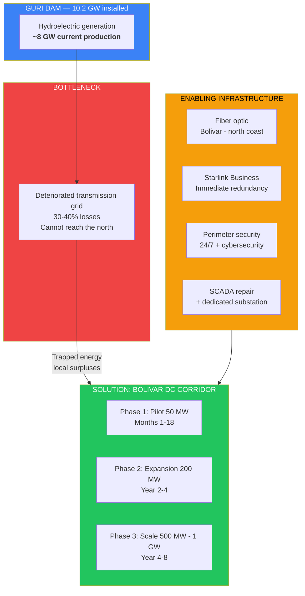
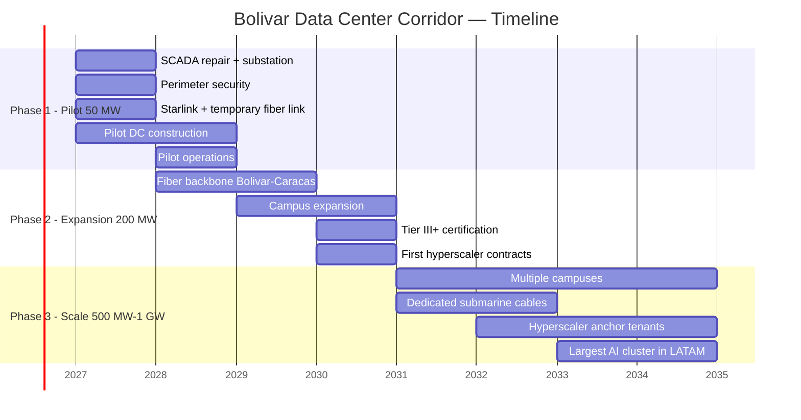
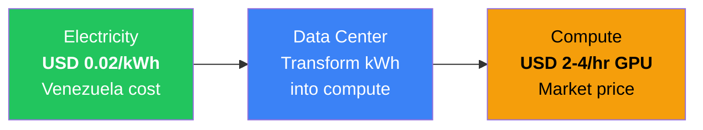

# AI Data Centers: The Energy Advantage the World Needs

> The world has a problem: it needs clean, cheap, and abundant energy to train AI. Venezuela has the solution: **17 GW of hydroelectric power**, with surpluses trapped in Bolivar that literally have nowhere to go. The question is not whether Venezuela can compete in AI data centers — it is how many months of window remain before Chile, Brazil, and Mexico absorb all LATAM demand.

---

## 1. The Opportunity: USD 1.7 Trillion Looking for a Place to Plug In

:::danger The global energy crisis for AI
Hyperscalers (Amazon, Microsoft, Google, Meta) will invest **USD 602B in 2026 alone** — **75% for AI infrastructure**. By 2030, global data center capex will reach **USD 1.7 TRILLION**. The bottleneck is not capital, not chips — it is **clean, cheap energy**. The world needs **75-100 GW of new generation** by 2030 and does not know where to find it.
:::

| Data Point | Figure | Source |
|------------|--------|--------|
| Hyperscaler capex 2026 | **USD 602B** (+36% vs 2025) | [Dell'Oro Group](https://www.delloro.com/) |
| % of capex for AI | **75%** | [Bloomberg](https://www.bloomberg.com/) |
| Global DC capex by 2030 | **USD 1.7T** | [Dell'Oro Group](https://www.delloro.com/) |
| U.S. DC demand (2028) | **74 GW** — **49 GW** deficit | [Morgan Stanley](https://www.morganstanley.com/) |
| New generation needed (2030) | **75-100 GW** | [Goldman Sachs](https://www.goldmansachs.com/) |
| DCs as % of U.S. electricity (2028) | **12-15%** (vs 4% in 2023) | [Morgan Stanley](https://www.morganstanley.com/) |
| AI DC capacity in LATAM 2026 | **443 MW** | [Requires research] |
| AI DC capacity in LATAM 2031 | **1.6 GW** | [Requires research] |
| DC investment Chile (2026) | **>USD 4B** committed | [Google Cloud](https://cloud.google.com/) |

**Translation for non-technical readers:** Imagine the world wants to build 100 giant factories that consume as much electricity as entire cities. There is only enough clean energy for 50. Whoever has cheap, green electricity wins. Venezuela has the cheapest electricity in the hemisphere and 90% is hydroelectric.

### Why LATAM Is the Next Front

LATAM will grow from **443 MW to 1.6 GW** of AI data center capacity by 2031. Chile leads with >USD 4B committed from Google, AWS, and Microsoft. Brazil has the Rio AI City project backed by Goldman Sachs. Mexico is attracting Microsoft and Amazon.

But they all have the same problem: **expensive electricity**.

| Country | Electricity Cost | Primary Source | Committed DC Investment | Latency to Miami |
|---------|-----------------|----------------|-------------------------|------------------|
| **Venezuela** | **<USD 0.02/kWh** | Hydro (90%) | USD 0 | ~30 ms |
| Chile | USD 0.05-0.08/kWh | Solar + wind | **>USD 4B** | ~150 ms |
| Brazil | USD 0.06-0.09/kWh | Hydro + solar | **>USD 5B** | ~120 ms |
| Mexico | USD 0.07-0.10/kWh | Gas + solar | **>USD 3B** | ~40 ms |
| U.S. (Virginia) | USD 0.08-0.12/kWh | Gas + nuclear | **>USD 50B** | ~10 ms |

Sources: electricity costs — [Global Energy Monitor](https://globalenergymonitor.org/), [Americas Quarterly](https://www.americasquarterly.org/); DC investments — corporate reports 2025-2026.

**Venezuela's advantage:** electricity **3-6x cheaper** than the competition, 100% renewable (carbon credits), and competitive latency to Miami (~30 ms). The electricity cost differential for a 100 MW data center is **USD 50-80M/year** vs. the U.S.

---

## 2. The Current Problem: Why Venezuela Has USD 0 in Data Centers

Venezuela has the energy but nothing else. Being honest about the obstacles is the first step to solving them.

| Obstacle | Severity | Description |
|----------|----------|-------------|
| **Destroyed transmission grid** | CRITICAL | Guri produces ~8 GW but transmission lines heading north lose 30-40%. Surpluses in Bolivar cannot reach where they are needed |
| **Collapsed CORPOELEC** | CRITICAL | State-owned electric utility with no maintenance, no investment, no qualified personnel. Deteriorated SCADA at Guri |
| **Zero internet infrastructure** | CRITICAL | Average speed <1 Mbps. No high-capacity backbone fiber. [Only 48% of households with internet](https://freedomhouse.org/country/venezuela/freedom-net/2024) |
| **Physical security** | CRITICAL | [World's highest crime index](https://worldpopulationreview.com/country-rankings/crime-rate-by-country) (80.7 Numbeo). No hyperscaler invests where there is kidnapping risk |
| **No regulatory framework** | HIGH | No data center law, data protection, or certification standards exist |
| **Active sanctions** | HIGH | OFAC restricts transactions. U.S. hyperscalers need specific licenses |
| **Extreme country risk** | HIGH | No active BITs, no active ICSID arbitration, no legal certainty |
| **No local talent** | MEDIUM | Brain drain: 7.9M emigrated. Data center technicians must be imported or repatriated |

:::caution Reality without makeup
No serious fund puts money in a country with the world's highest crime index, internet at 1 Mbps, and an electric utility that cannot keep the lights on. **Each of these obstacles must be explicitly resolved.** The following sections do so.
:::

---

## 3. The Solution — Bolivar Data Center Corridor

The strategy: do not wait for the entire country to be fixed. Build **next to Guri**, consume the trapped energy locally, and create an exception zone with world-class security, connectivity, and infrastructure within a controlled perimeter.

### Phase 1: Pilot 50 MW (Months 1-18)

**Objective:** Proof of concept. Demonstrate that a world-class data center can operate in Venezuela.

| Component | Detail |
|-----------|--------|
| **Location** | Ciudad Guayana, Bolivar State — <50 km from the Guri dam |
| **Energy** | Direct connection to Guri substation. No dependence on the deteriorated national grid. 50 MW dedicated with diesel backup |
| **Connectivity** | Starlink Business (350+ Mbps) as immediate bridge + dedicated fiber link to submarine cable on the north coast |
| **Workload type** | AI training (batch processing) — latency-tolerant, maximizes energy arbitrage |
| **Target clients** | AI startups, GPU-as-a-Service companies (CoreWeave, Lambda, Together AI), Bitcoin mining as flexible load |
| **Physical security** | Closed perimeter zone 24/7 with specialized private contractors (oilfield model). Cameras, drones, biometric access control |
| **Cybersecurity** | SOC 2 Type II from day 1. Air-gapped infrastructure for clients that require it |
| **Certification** | Tier II+ (Uptime Institute). Not aiming for Tier IV in pilot — that would be overengineering |
| **Direct jobs** | 200-500 |
| **Investment** | USD 300-500M |
| **Estimated annual revenue** | USD 150-250M |

:::tip Rapid deployment: the trapped energy already exists
There is no need to wait for national grid reconstruction. Guri's surpluses in Bolivar are already there. With SCADA repair + dedicated substation + fiber + security, a pilot data center can be operational in **12-18 months**. That puts Venezuela on the map BEFORE Chile and Brazil absorb all LATAM demand.
:::

### Phase 2: Expansion 200 MW (Year 2-4)

| Component | Detail |
|-----------|--------|
| **Infrastructure** | Multiple campus buildings. Redundant substations. Solar + battery backup generation |
| **Connectivity** | Bolivar-Caracas-Valencia fiber backbone operational. Submarine cables with dedicated capacity |
| **Certification** | Tier III+ (Uptime Institute) — 99.982% uptime SLA |
| **Clients** | Mid-size AI companies + first hyperscaler contacts for proof-of-concept tests |
| **Security** | Special economic zone with its own legal framework. Arbitration tribunal for commercial disputes |
| **Direct jobs** | 1,000-2,000 |
| **Cumulative investment** | USD 1-2B |
| **Estimated annual revenue** | USD 600M-1B |

### Phase 3: Scale 500 MW - 1 GW (Year 4-8)

| Component | Detail |
|-----------|--------|
| **Ambition** | The largest AI computing cluster in Latin America |
| **Infrastructure** | Multiple campuses with dedicated substations. Redundant fiber network with multiple submarine cables |
| **Certification** | Tier III/IV per client. SOC 2, ISO 27001, CMMC Level 3 compliance |
| **Clients** | Hyperscalers (AWS, Azure, GCP) as anchor tenants + AI labs + U.S. government (if sanctions are lifted) |
| **Green energy** | 100% hydro -> qualification for carbon credits and Green Data Center premium |
| **Direct jobs** | 3,000-5,000 |
| **Cumulative investment** | USD 3-6B |
| **Estimated annual revenue** | USD 1.5-3B |

---

## 4. Required Infrastructure

| Component | What Is Needed | Estimated Cost | Timeline | Who Provides It |
|-----------|---------------|----------------|----------|-----------------|
| **SCADA repair + substation** | Rehabilitate Guri's control system. Dedicated substation for DC campus | USD 50-200M | 6-12 months | Siemens / ABB / GE |
| **Local transmission** | High-voltage lines from Guri to DC campus (<50 km) | USD 100-300M | 12-18 months | ABB / Siemens |
| **National grid repair** | Rehabilitation of transmission lines heading north (765 kV) + transformers | USD 2-5B | 3-7 years | US DOE + international consortium |
| **Fiber optic backbone** | Laying from Bolivar to Caracas to north coast. Connection to existing submarine cables | USD 200-500M | 18-36 months | Ericsson / Nokia / Huawei |
| **Submarine cables** | Dedicated capacity or new cable to Miami/Caribbean | USD 200-500M | 24-48 months | SubCom / Alcatel Submarine |
| **Data center campus** | Buildings, racks, UPS, generators, cooling | USD 1-3B | 12-60 months (phased) | Equinix / Digital Realty / Edgeconnex |
| **Cooling systems** | Water cooling (Caroni River, abundant and cold) + evaporative systems | USD 100-300M | Parallel with construction | Vertiv / Schneider Electric |
| **Perimeter security** | Fencing, watchtowers, drones, access control, SOC 24/7 | USD 50-100M | 6-12 months | G4S / Securitas / specialized contractors |
| **Cybersecurity** | SOC, SIEM, firewalls, intrusion detection, air-gap for sensitive data | USD 20-50M | Parallel | Palo Alto / CrowdStrike / Fortinet |
| **Starlink (redundancy)** | 50-200 Business terminals for immediate connectivity and backup | USD 5-10M | 1-3 months | SpaceX |
| **TOTAL** | | **USD 3.7-9.9B** | **1-8 years** | |

:::info The US DOE is already in Venezuela
The U.S. Department of Energy has prioritized the [reconstruction of Venezuela's electrical grid](https://abcnews.go.com/US/energy-secretary-wright-details-plans-us-control-venezuelan/story?id=128979604) as part of the post-transition energy strategy. This aligns interests: the U.S. needs energy for AI, Venezuela needs to repair its grid. SCADA and transmission repair is not just for data centers — it benefits the entire country.
:::

### Cooling: Natural Advantage of the Caroni River

AI data centers generate massive amounts of heat. Cooling represents **30-40% of the operating cost** of a typical DC. Ciudad Guayana sits alongside the Caroni River, which offers:

- **Abundant, cold water** for direct/indirect cooling
- **Average water temperature: 24-26 C** — colder than most tropical sources because it is reservoir water
- **40-60% reduction in cooling costs** vs. traditional air cooling

Comparables: Norway uses fjords to cool data centers naturally. Iceland uses glacial water. Venezuela can use the Caroni.

---

## 5. Business Model

### Revenue Streams

| Business Line | Description | Estimated Revenue (at 500 MW scale) |
|---------------|-------------|--------------------------------------|
| **Colocation** | Space, power, and connectivity rental to clients who bring their own hardware | USD 400-800M/year |
| **GPU-as-a-Service** | GPU rental (NVIDIA H100/B200+) by the hour for AI training | USD 500M-1B/year |
| **Managed AI Training** | Full service: data + compute + monitoring for companies that want to train models | USD 200-500M/year |
| **Carbon credits** | 100% hydroelectric = green data center certification. 10-15% premium over market price | USD 50-100M/year |
| **Bitcoin mining (flexible load)** | Mining as a load that absorbs surpluses when DCs are not at 100%. Variable revenue | USD 50-200M/year |
| **TOTAL at scale** | | **USD 1.2-2.6B/year** |

### The Energy Arbitrage: The Core of the Pitch

| Metric | Venezuela | U.S. (Virginia) | Difference |
|--------|-----------|-----------------|------------|
| Electricity cost per 100 MW/year | **USD 17M** | USD 70-100M | **USD 53-83M savings/year** |
| Electricity cost per 500 MW/year | **USD 87M** | USD 350-500M | **USD 263-413M savings/year** |
| Electricity cost per 1 GW/year | **USD 175M** | USD 700M-1B | **USD 525-825M savings/year** |

**Translation:** For every GW of capacity, Venezuela saves **more than half a billion dollars per year** in electricity vs. Virginia. That is enough to absorb country risk and still be more profitable.

### Job Creation

| Category | Phase 1 (50 MW) | Phase 2 (200 MW) | Phase 3 (500 MW-1 GW) |
|----------|-----------------|-------------------|-----------------------|
| **Data center engineers** | 50-100 | 200-400 | 500-1,000 |
| **Operations technicians** | 100-200 | 400-800 | 1,000-2,000 |
| **Security** | 50-100 | 200-400 | 500-1,000 |
| **Construction** | 200-500 | 500-1,000 | 1,000-2,000 |
| **Support services** | 50-100 | 200-400 | 500-1,000 |
| **Indirect jobs** | 500-1,000 | 2,000-4,000 | 5,000-10,000 |
| **TOTAL** | **950-2,000** | **3,500-7,000** | **8,500-17,000** |

---

## 6. Security — The Critical Factor

:::danger Without security, zero investment
No hyperscaler puts USD 1B in infrastructure where there is risk of sabotage, kidnapping, or hardware theft. Security is not just another component — it is **the existential prerequisite** of the project. If it is not solved, nothing else matters.
:::

### Physical Security

| Layer | Solution | Reference Model | Estimated Cost |
|-------|----------|-----------------|----------------|
| **Outer perimeter** (5 km) | Electrified fencing, watchtowers, seismic sensors, autonomous patrol drones | Oilfields in Iraq/Nigeria — [G4S](https://www.g4s.com/) and Securitas operate in active conflict zones | USD 15-30M |
| **Inner perimeter** (campus) | Biometric access control, mantraps, AI-powered CCTV, armored vehicles | Tier IV data centers in the U.S. (Equinix, Digital Realty) | USD 10-20M |
| **Personnel** | Specialized private contractors for critical infrastructure + reformed FANB units under civilian oversight | Academi/Triple Canopy model in the Middle East; Georgia reformed police model | USD 20-40M/year |
| **Intelligence** | 24/7 local threat monitoring, coordination with state and federal security forces | Intelligence fusion center like US NORTHCOM | USD 5-10M/year |
| **Community** | Local employment programs, investment in community infrastructure — the best security is having the community protect the investment | Responsible mining model (Botswana/Diamonds, Chile/Copper) | USD 10-20M/year |

### Cybersecurity

| Standard | Level | Description | Timeline |
|----------|-------|-------------|----------|
| **SOC 2 Type II** | Mandatory from day 1 | Third-party audited security controls. Without this, zero enterprise clients | Month 1-12 |
| **ISO 27001** | Phase 2 | Information security management system. Required by European and Asian clients | Year 2-3 |
| **CMMC Level 3** | Phase 3 | Cybersecurity Maturity Model Certification. Required for U.S. government and defense contracts | Year 3-5 |
| **PCI DSS** | If applicable | For fintech/banking clients | As needed |
| **Air-gap** | Available | Internet-isolated infrastructure for clients with ultra-sensitive data (military AI, government) | Phase 1 |

### Legal Protection for Investors

| Instrument | Function | Status |
|------------|----------|--------|
| **BIT (Bilateral Investment Treaty)** | Protection against expropriation, unfair treatment, transfer restrictions | Requires negotiation with U.S., EU, Japan, Korea. [Requires research] on active BITs |
| **ICSID arbitration** | Investor-State dispute resolution before the World Bank | Venezuela withdrew in 2012. Rejoining is a strong market signal |
| **MIGA insurance** | World Bank insurance against political risks (war, expropriation, breach) | Available for projects in transitioning countries |
| **Special Economic Zone** | Independent legal framework for the DC corridor: commercial courts, data protection law, special tax regime | Requires specific legislation |
| **Offshore structure** | SPV in neutral jurisdiction (Delaware, Luxembourg, Singapore) that owns the Venezuelan assets | Standard in frontier market investments |

---

## 7. Potential Partners

| Company/Entity | Role | Why They Would Participate |
|-----------------|------|---------------------------|
| **Amazon AWS** | Anchor tenant / co-investor | Aggressively seeking cheap green energy. Committed USD 100B+ in 2026 capex. Need sites outside the U.S. for diversification |
| **Microsoft Azure** | Anchor tenant / co-investor | DC investments in 60+ regions. Announced LATAM expansion (Mexico, Brazil, Chile). Venezuela would be the cheapest site |
| **Google Cloud** | Anchor tenant | Already invested >USD 4B in Chile. Venezuela offers electricity 3-4x cheaper |
| **Meta** | Anchor tenant for AI training | Llama requires massive GPU clusters. Cheap electricity reduces training costs |
| **CoreWeave / Lambda / Together AI** | First clients (Phase 1) | GPU cloud providers. More agile than hyperscalers. Hungry for cheap energy to compete. Higher risk profile |
| **Chevron** | Energy partner + credibility | [Already operates in Venezuela](https://www.chevron.com/worldwide/venezuela) with OFAC license. Knows the terrain. Can provide gas backup generation |
| **Siemens / ABB / GE** | Transmission and SCADA equipment | Natural providers for substation and Guri SCADA repair. Long-term service contracts |
| **Ericsson / Nokia** | Fiber optic backbone | Experience in fiber deployment in emerging markets. Can partially finance with operating contracts |
| **SubCom / Alcatel Submarine** | Submarine cables | The 2 largest submarine cable manufacturers. Venezuela needs dedicated capacity to Miami |
| **G4S / Securitas** | Physical security | Operate in conflict zones globally. Experience protecting critical infrastructure (mines, oil platforms) |
| **US DFC (formerly OPIC)** | Development financing | Finance infrastructure in allied countries. Post-transition, Venezuela qualifies. Political risk insurance |
| **US DOE** | Electrical grid reconstruction | Already [prioritized the Venezuelan grid](https://abcnews.go.com/US/energy-secretary-wright-details-plans-us-control-venezuelan/story?id=128979604). Aligned interests: a functional grid enables DCs that process AI for American companies |
| **NVIDIA** | GPU supplier + validation | NVIDIA DGX Cloud program. Certification as NVIDIA Partner amplifies credibility. Could provide GPUs with financing |
| **IDB / CAF** | Multilateral financing | Development banks for enabling infrastructure (fiber, transmission, water) |

---

## 8. Risks and Mitigations

| # | Risk | Prob. | Impact | Mitigation |
|---|------|-------|--------|------------|
| 1 | **Political instability** — transition reverses, new government expropriates | High | Critical | Offshore SPV structure + MIGA insurance + BIT + ICSID arbitration clauses. 51% non-Venezuelan private ownership |
| 2 | **OFAC sanctions not lifted** — hyperscalers cannot operate | Medium-High | Critical | Phase 1 with non-U.S. companies or with specific OFAC licenses (Chevron model). GPU-as-a-Service clients without restrictions |
| 3 | **Infrastructure sabotage/attack** — criminal groups or state actors | Medium | Critical | Military-grade security. 5 km perimeter. Autonomous drones. Community investment for incentive alignment |
| 4 | **CORPOELEC cannot maintain Guri** — generation failures | Medium | High | O&M contract with Siemens/ABB for Guri. Gas backup generation (Chevron). Batteries |
| 5 | **Insufficient connectivity** — fiber not deployed on time | Medium | High | Starlink as bridge. Focus on latency-tolerant workloads (AI training batch) in Phase 1. Fiber for Phase 2+ |
| 6 | **Drought reduces Guri capacity** — climate change | Medium-Low | High | Diversification: solar in Zulia/Falcon, natural gas as backup. Guri has 135 km2 reservoir — significant buffer |
| 7 | **Regional competition captures demand** — Chile/Brazil move faster | High | Medium | Compete on price (3-6x cheaper). Position for the second wave when Chile/Brazil fill up |
| 8 | **Cannot find talent** — DC engineers do not want to go to Venezuela | Medium-High | Medium | Competitive expat packages (Middle East oilfield model). Campus with housing, school, hospital. Accelerated local training programs |
| 9 | **Contract corruption** — cost overruns, diversions | High | Medium | Santiago Principles-type governance. Mandatory Big 4 audit. EITI transparency. Whistleblower with 10-30% reward |
| 10 | **Natural disaster** — earthquake, flood | Low | High | Ciudad Guayana has low seismic risk. Anti-flood design. Infrastructure insurance |

---

## 9. International Comparables

| Country | Model | Energy | DC Investment | Lesson for Venezuela |
|---------|-------|--------|---------------|----------------------|
| **Chile** | Google, AWS, Microsoft investing >USD 4B in DCs | Solar + wind, USD 0.05-0.08/kWh | >USD 4B (2024-2026) | Proven demand in LATAM. Chile shows hyperscalers WANT to be in the region. Venezuela offers energy 3-4x cheaper |
| **Norway** | Green Mountain, DigiPlex — DCs cooled by fjords | Hydro 99%, ~USD 0.03-0.05/kWh | >USD 2B | Almost identical model: cheap hydro + natural water cooling. Norway charges a premium for green certification |
| **Iceland** | Verne Global, atNorth — DCs with geothermal | Geothermal + hydro, ~USD 0.02-0.04/kWh | >USD 1B | Ultra-cheap energy in a small country. Attracted BMW, Porsche, DeepMind for AI training. Proof that energy price compensates for remoteness |
| **Paraguay** | Bitfarms, Penguin Solutions — Bitcoin mining with Itaipu | Hydro (Itaipu), ~USD 0.01-0.03/kWh | >USD 500M in mining | Cheap hydro -> first Bitcoin, then more sophisticated DCs. Venezuela can follow this sequence |
| **Singapore** | Equinix, Digital Realty — Southeast Asian DC hub | Mix (imported), USD 0.10-0.15/kWh | >USD 10B | Zero cheap energy but world's best connectivity and legal certainty. Venezuela needs to close that gap |
| **Oman / Saudi Arabia** | NEOM, Oman Data Park — DCs in desert | Solar + gas, USD 0.03-0.06/kWh | >USD 5B planned | Oil countries diversifying toward DCs. Special economic zone model with private security. Framework applicable to Venezuela |

Sources: [Green Mountain](https://www.greenmountain.no/), [Verne Global](https://verneglobal.com/), [Bitfarms](https://bitfarms.com/), corporate reports 2025-2026. Energy costs: [IEA](https://www.iea.org/), [Global Energy Monitor](https://globalenergymonitor.org/).

:::tip The lesson from Paraguay
Paraguay had the same asset as Venezuela: absurdly cheap hydroelectric power (Itaipu, USD 0.01-0.03/kWh) with insufficient local demand. First came the Bitcoin miners. Then, companies like Penguin Solutions began building more sophisticated computing infrastructure. Venezuela can follow exactly this sequence: Bitcoin mining as the first client (tolerant of everything), then GPU-as-a-Service, then hyperscalers.
:::

---

## 10. Financial Projection

### 8-Year Projection

| Year | Capacity (MW) | Cumulative Investment | Annual Revenue | Estimated EBITDA | Jobs (direct + indirect) | Client Type |
|------|---------------|----------------------|----------------|------------------|--------------------------|-------------|
| **1** | 10 MW | USD 150M | USD 30-50M | USD 10-20M | 300-500 | Bitcoin miners, GPU startups |
| **2** | 50 MW | USD 500M | USD 150-250M | USD 60-100M | 950-2,000 | CoreWeave, Lambda, AI startups |
| **3** | 100 MW | USD 1B | USD 300-500M | USD 120-200M | 2,000-4,000 | Mid-size AI companies, first enterprise |
| **4** | 200 MW | USD 2B | USD 600M-1B | USD 250-400M | 3,500-7,000 | Enterprise + first hyperscalers (PoC) |
| **5** | 300 MW | USD 3B | USD 900M-1.5B | USD 400-600M | 5,000-10,000 | Hyperscalers with pilot contracts |
| **6** | 500 MW | USD 4.5B | USD 1.2-2B | USD 500-800M | 8,500-14,000 | AWS/Azure/GCP anchor tenants |
| **7** | 750 MW | USD 6B | USD 1.8-2.8B | USD 750M-1.1B | 12,000-18,000 | Multiple hyperscalers + government |
| **8** | 1 GW | USD 8B | USD 2.5-3.5B | USD 1-1.4B | 15,000-22,000 | LATAM AI hub |

:::caution Projection Assumptions
- Electricity price: USD 0.02/kWh (constant, long-term contract with government/reformed CORPOELEC)
- Occupancy rate: 50% year 1, scaling to 85% in year 5+
- Revenue per MW: USD 3-5M/year in colocation, USD 5-8M/year in GPU-as-a-Service
- EBITDA margin: 35-45% (comparable to Equinix/Digital Realty in emerging markets)
- Does not include carbon credit or Bitcoin mining revenue (additional upside)
- Investment includes enabling infrastructure (fiber, transmission, security)
:::

### Return on Investment

| Metric | Estimated Value |
|--------|----------------|
| Total investment (8 years) | **USD 6-8B** |
| Cumulative revenue (8 years) | **USD 7.5-11B** |
| Cumulative EBITDA (8 years) | **USD 3-4.5B** |
| Estimated payback | **Year 5-6** |
| Estimated IRR | **18-25%** |
| Jobs year 8 | **15,000-22,000** (direct + indirect) |
| Annual fiscal contribution (year 8) | **USD 150-300M** (15% flat on profits) |

---

## 11. Call to Action: What an Investor Needs to See

### For a Hyperscaler (AWS, Azure, GCP)

| Requirement | Status | Who Solves It |
|-------------|--------|---------------|
| Long-term energy contract (PPA) at <USD 0.03/kWh | Negotiable with reformed CORPOELEC / transition government | Government + DC operator |
| Uptime Institute certification (Tier III+) | In process with construction | DC operator + Uptime Institute |
| Connectivity <50 ms to Miami | Feasible with fiber + submarine cable | Ericsson/Nokia + SubCom |
| SOC 2 Type II + ISO 27001 | Implementable in 12-18 months | DC operator |
| BIT or equivalent legal protection | Requires negotiation with government | Government + foreign ministry |
| MIGA insurance against political risk | Available via World Bank | DC operator + MIGA |
| OFAC license (if applicable) | Requires sanctions lifting or specific license | U.S. government |

### For a Financial Investor (PE/VC/DFC)

| Criterion | Venezuela DC Corridor |
|-----------|----------------------|
| **TAM** | USD 1.7T global DC capex by 2030 |
| **SAM** | USD 14.3B LATAM DC market by 2028 ([Arizton](https://www.businesswire.com/news/home/20250505397648/en/)) |
| **SOM** | USD 2-3.5B/year with 500 MW-1 GW (10-25% of LATAM market) |
| **Competitive advantage** | Energy 3-6x cheaper than competitors. 100% hydro (green premium). Caroni River for cooling |
| **Moat** | Access to non-replicable hydroelectric energy. Guri is the 4th largest dam in the world by capacity |
| **Primary risk** | Political and security risk. Mitigated with offshore SPV + MIGA + BIT + private security |
| **Comparable** | Norway: cheap hydro -> green DCs -> USD 2B+ invested. Paraguay: cheap hydro -> mining -> compute |
| **Exit** | Sale to hyperscaler, infrastructure REIT, or DC operator IPO |

### Concrete Next Steps

1. **Memorandum of Understanding (MoU)** with transition government for PPA at USD 0.02/kWh and special economic zone
2. **90-day feasibility study**: technical assessment of Guri substation, fiber route, campus land
3. **OFAC license** (or contingency plan with non-U.S. operators)
4. **Security commitment** with international critical infrastructure contractor
5. **Term sheet** for Phase 1 (50 MW): USD 300-500M, SPV structure, MIGA protection

:::info This is not a theoretical pitch
The energy is there. Guri's surpluses are there. Global demand for AI compute is growing exponentially. What is missing is the legal framework, security, and connectivity. Three solvable problems. The question is whether Venezuela acts in the next 24 months or lets Chile, Brazil, and Mexico capture the opportunity of the generation.
:::

---

## Related Documents

- [Electrical Capacity](./capacidad-electrica) — Guri rehabilitation and transmission grid, prerequisite for powering data centers with hydroelectric power at <USD 0.02/kWh
- [Telecommunications](./telecomunicaciones) — Fiber optic, submarine cables, and 5G needed for data center connectivity
- [Renewable Energy](./energia-renovable) — Solar and wind as complement to hydroelectric for 100% green data centers
- [Industrial Manufacturing](./manufactura-industrial) — Synergies with industrial zones and shared electricity demand
- [Concession Model](./modelo-concesiones) — Universal BOT/BOOT concession framework applicable to data centers (Tier IV, 25-30 years)

---

## Consolidated Sources

| # | Source | URL | Data |
|---|--------|-----|------|
| 1 | Dell'Oro Group | [delloro.com](https://www.delloro.com/) | Global DC capex USD 1.7T by 2030; hyperscalers USD 602B in 2026 |
| 2 | Bloomberg | [bloomberg.com](https://www.bloomberg.com/) | 75% of hyperscaler capex for AI |
| 3 | Morgan Stanley | [morganstanley.com](https://www.morganstanley.com/) | DCs 12-15% of U.S. electricity 2028; demand 74 GW, deficit 49 GW |
| 4 | Goldman Sachs | [goldmansachs.com](https://www.goldmansachs.com/) | 75-100 GW new generation by 2030; Rio AI City Brazil |
| 5 | Google Cloud | [cloud.google.com](https://cloud.google.com/) | >USD 4B in Chile |
| 6 | Global Energy Monitor | [globalenergymonitor.org](https://globalenergymonitor.org/) | Global electricity costs |
| 7 | Americas Quarterly | [americasquarterly.org](https://www.americasquarterly.org/) | DCs in LATAM |
| 8 | Arizton/ResearchAndMarkets | [businesswire.com](https://www.businesswire.com/news/home/20250505397648/en/) | LATAM DC USD 7.16B -> 14.3B |
| 9 | Power Technology | [power-technology.com](https://www.power-technology.com/projects/gurihydroelectric/) | Guri 10,200 MW |
| 10 | Mongabay 2023 | [mongabay.com](https://news.mongabay.com/2023/08/hydropower-in-the-pan-amazon-the-guri-complex-and-the-caroni-cascade/) | Caroni Cascade 18 GW |
| 11 | Freedom House 2024 | [freedomhouse.org](https://freedomhouse.org/country/venezuela/freedom-net/2024) | 48% of households with internet, <1 Mbps |
| 12 | SIGCOMM/Northwestern 2024 | [estcarisimo.github.io](https://estcarisimo.github.io/assets/pdf/papers/2024-sigcomm-venezuela.pdf) | Venezuela internet speed |
| 13 | ABC News 2026 | [abcnews.go.com](https://abcnews.go.com/US/energy-secretary-wright-details-plans-us-control-venezuelan/story?id=128979604) | US DOE prioritizes Venezuela electrical grid |
| 14 | Numbeo Crime Index | [worldpopulationreview.com](https://worldpopulationreview.com/country-rankings/crime-rate-by-country) | Venezuela #1 crime index (80.7) |
| 15 | Green Mountain (Norway) | [greenmountain.no](https://www.greenmountain.no/) | Green DCs with hydro and fjord cooling |
| 16 | Bitfarms (Paraguay) | [bitfarms.com](https://bitfarms.com/) | Mining with Itaipu hydro |
| 17 | IEA | [iea.org](https://www.iea.org/) | Global energy costs |
| 18 | Chevron Venezuela | [chevron.com](https://www.chevron.com/worldwide/venezuela) | Operations with OFAC license |
