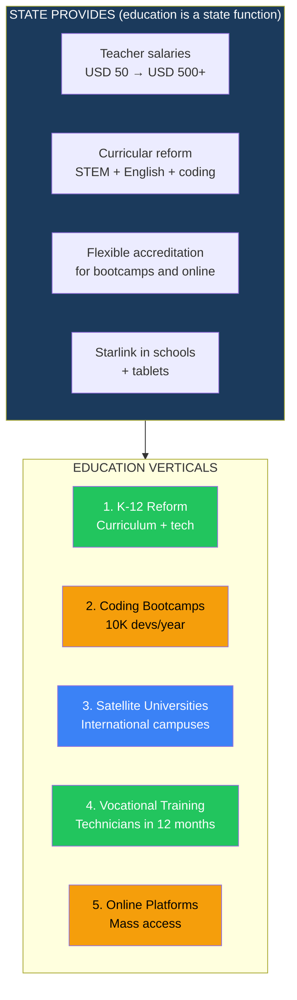
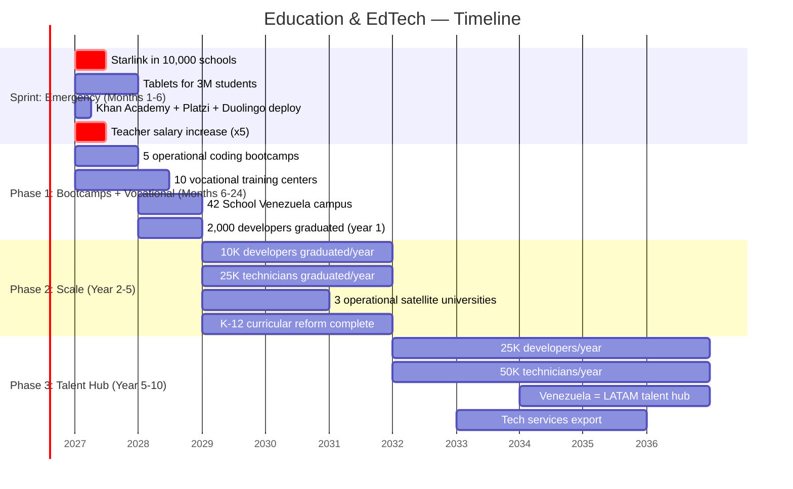
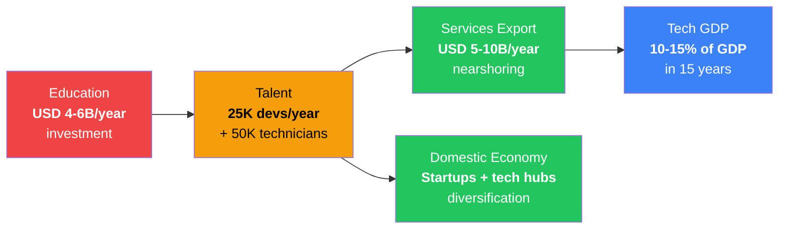

# Education & EdTech: From Brain Drain to Talent Factory

> Venezuela needs **50,000 engineers** to execute this plan. Today it produces ~5,000/year and loses half to emigration. 50% of students drop out of school. Teachers earn less than USD 50/month. The curriculum has not changed since the 90s. That is not an education system — it is a machine exporting talent with no return. The solution: the State reforms the legal framework and raises salaries (education is one of the State's 5 functions). Venezuela S.A. invests in base educational infrastructure. Private capital brings platforms, bootcamps, and satellite universities. In 10 years, Venezuela goes from importing talent to exporting 50,000 developers/year to the global market.

---

## 1. The Education Crisis: Numbers Without Makeup

:::danger Education system in free fall
Venezuela had the second-highest university enrollment rate in LATAM (2010). Today it has one of the highest dropout rates. Teachers are the worst-paid professionals in the country. Public universities operate without budget, without internet, without laboratories. The result: an entire generation without adequate training to compete in the 21st-century economy.
:::

| Indicator | Venezuela (current) | LATAM Average | Reference Country | Source |
|-----------|-------------------|----------------|-------------------|--------|
| School dropout rate | **~50%** (before completing secondary) | ~20% | Chile: 5% | [UNICEF 2024](https://www.unicef.org/) |
| Monthly teacher salary | **<USD 50** | USD 500-1,500 | Chile: USD 2,000, Colombia: USD 800 | [Requires research] |
| Engineers graduated/year | **~5,000** | — | Colombia: ~30,000, Mexico: ~120,000 | [Requires research] |
| PISA score | **Not participating** since 2009 | 400 (LATAM average) | Chile: 412, Uruguay: 407 | [OECD PISA 2022](https://www.oecd.org/pisa/) |
| Education spending % GDP | **~2%** | 4.5% | Costa Rica: 7.4% | [World Bank 2024](https://data.worldbank.org/) |
| University enrollment | **~1.5M** (declining) | — | Peak 2010: ~2.8M | [Requires research] |
| Functional public universities | **<50%** operability | — | — | [Requires research] |
| Internet access in schools | **<10%** | ~60% | Uruguay: 100% (Plan Ceibal) | [Requires research] |
| Emigrated teachers | **>100,000** estimated | — | — | [Requires research] |

**Translation:** A Venezuelan teacher earns less in a month than a Colombian teacher in two days. Half of students do not finish secondary school. Universities produce 5,000 engineers/year when the plan needs 50,000. And there is no internet in schools.

### The talent gap: what the plan needs vs. what exists

| Profile | Plan Need (15 years) | Current Production/Year | Annual Deficit | Urgency |
|---------|---------------------|------------------------|---------------|---------|
| **Software engineers** | 50,000 | ~2,000 | **-48,000** | CRITICAL |
| **Petroleum engineers** | 15,000 | ~500 | **-14,500** | CRITICAL |
| **Electrical engineers** | 10,000 | ~300 | **-9,700** | CRITICAL |
| **Infrastructure technicians** | 30,000 | ~3,000 | **-27,000** | HIGH |
| **Health professionals** | 40,000 | ~5,000 | **-35,000** | CRITICAL |
| **Administrators and managers** | 20,000 | ~2,000 | **-18,000** | HIGH |
| **TOTAL** | **165,000** | **~12,800** | **-152,200** | |

:::caution At the current rate, closing the gap takes 100+ years
With production of 12,800 professionals/year (of whom half emigrate), Venezuela would need **more than a century** to cover the plan's demand. The only way to close the gap in 10-15 years is to multiply production by 5x and reduce emigration. That requires competitive salaries + real opportunities + edtech at scale.
:::

---

## 2. The Opportunity: Build the System From Zero

| Opportunity | Size | Why Now |
|-------------|------|---------|
| **LATAM edtech market** | **USD 3B (2024) → USD 12B+ (2030)**, CAGR ~25% | [HolonIQ 2024](https://www.holoniq.com/) |
| **Global edtech market** | **USD 400B+ by 2030** | [HolonIQ 2024](https://www.holoniq.com/) |
| **LATAM tech talent** | Deficit of **1M+ developers** in the region | [LinkedIn/Coursera 2024](https://www.coursera.org/) |
| **Nearshoring** | U.S. companies seeking LATAM tech talent (50% cheaper) | [Requires research] |
| **Venezuela: low cost of living** | A Venezuelan developer at USD 1,500/month is competitive vs. Mexico (USD 3,000) or Colombia (USD 2,500) | Current market reality |

### The 5 verticals

---

## 3. Vertical 1: K-12 Reform — The Foundation of Everything

### Sprint: Connectivity + Content (Days 1-180)

:::tip Starlink + tablets + Khan Academy = digital school in 30 days
You do not need to wait to build new schools. With **Starlink in every school**, **tablets for students**, and **free content** (Khan Academy, Platzi, offline Wikipedia), quality education can be delivered to millions of students BEFORE reforming the entire curriculum. It is a bridge, not the final solution — but it is a bridge that saves a generation.
:::

| Action | Result | Cost | Timeline |
|--------|--------|------|----------|
| Starlink in 10,000 schools | 100+ Mbps internet in every school | USD 50-100M | 3-6 months |
| Tablets for 3M students | 1 tablet per student (USD 100-150 entry-level) | USD 300-450M | 6-12 months |
| Khan Academy + offline content deployment | Math, science, English in Spanish. Works without 100% internet | USD 5-10M (implementation) | 1-3 months |
| Platzi licenses for secondary | Programming, entrepreneurship, design courses | USD 10-20M/year | 3-6 months |
| Basic teacher tech training | 50,000 teachers trained in digital tools | USD 20-50M | 6-12 months |
| **TOTAL SPRINT** | | **USD 400-650M** | |

### Curricular reform (Year 1-3)

| Current Component | Problem | Proposed Reform | Reference |
|-------------------|---------|-----------------|-----------|
| **No programming** | Graduates cannot write a line of code | Mandatory coding from 5th grade. Python, computational thinking | Estonia: coding from 1st grade ([ProgeTiger](https://www.hitsa.ee/)) |
| **Poor English** | <10% speak functional English. Excluded from global market | Intensive English: 10 hrs/week. Native teachers via video | South Korea: EPIK native teacher program |
| **Weak mathematics** | Below LATAM standard | Curriculum aligned to Singapore Math + Khan Academy | Singapore: #1 worldwide in PISA mathematics |
| **No financial education** | Country that lived through hyperinflation without understanding why | Personal finance + basic economics from 7th grade | Australia: financial literacy in national curriculum |
| **No critical thinking** | Rote memorization curriculum | Project-based learning, debate, research | Finland: competency-centered model |
| **No applied STEM** | Destroyed laboratories | Makerspaces with 3D printing, basic electronics, robotics | MIT Fab Labs — 2,500+ in 125+ countries |

### Teacher salaries: the non-negotiable prerequisite

:::danger Without dignified salaries, no education reform is possible
No curriculum, no tablet, no platform works if the teacher earns USD 50/month and needs 3 jobs to survive. **The first act of education reform is multiplying teacher salaries by 10x.** From USD 50 to USD 500-800/month. It is expensive. It is necessary. It is non-negotiable.
:::

| Level | Current Salary | Proposed Salary | Total Cost/Year | Funding |
|-------|---------------|-----------------|-----------------|---------|
| K-12 teacher | USD 20-50/month | **USD 500-800/month** | USD 2-3B/year (300K teachers) | Taxes (15% flat + 12% VAT) |
| University professor | USD 30-100/month | **USD 1,000-2,000/month** | USD 500M-1B/year (50K professors) | Education budget |
| School principal | USD 50-100/month | **USD 1,000-1,500/month** | USD 100-200M/year | Education budget |
| **TOTAL** | | | **USD 2.5-4B/year** | 5-6% of GDP |

**Reference:** Chile spends 5.4% of GDP on education and is the country with the best PISA results in LATAM. Costa Rica spends 7.4%. Venezuela spends ~2%. Raising to 5-6% of GDP funds salaries + infrastructure + tech.

---

## 4. Vertical 2: Coding Bootcamps — 10,000 Developers/Year

### The problem and the opportunity

| Data Point | Figure |
|-----------|--------|
| Developers Venezuela needs (15 years) | **50,000** |
| Developers produced/year | **~2,000** (universities) |
| University training time | 5 years |
| Bootcamp training time | **4-6 months** |
| Entry-level developer salary (remote, LATAM) | **USD 1,500-3,000/month** |
| Entry-level developer salary (remote, U.S.) | **USD 3,000-6,000/month** |
| Cost of living in Venezuela | **USD 300-500/month** |
| Developer margin | **5-10x their cost of living** |

### Model: production at scale

| Component | Detail |
|-----------|--------|
| **Target** | 10,000 developer graduates/year by year 3, 25,000/year by year 7 |
| **Format** | 4-6 month bootcamps, full-time. In-person + remote hybrid |
| **Curriculum** | Full-stack web, mobile, data science, AI/ML, cloud, cybersecurity |
| **Payment model** | ISA (Income Share Agreement): pay when you get a job (15-20% of salary for 2 years) |
| **Employability** | 80%+ placement in 6 months (top bootcamp standard) |
| **Location** | 5 cities: Caracas, Valencia, Maracaibo, Barquisimeto, Ciudad Guayana |
| **Revenue per student** | USD 3,000-8,000 (ISA) or USD 2,000-5,000 (upfront) |
| **Total revenue (year 5)** | USD 50-100M/year (10K graduates x USD 5K average) |

### Bootcamp operators

| Operator | Country | Model | Why for Venezuela |
|----------|---------|-------|------------------|
| **Platzi** | Colombia | 5M+ online students. Tech courses in Spanish. YC-backed | Already has Spanish content. Can open physical campuses |
| **Holberton School** | U.S./Colombia | Software engineering school. ISA model. 2 years. Operates in Colombia | Proven ISA model in LATAM. High employability |
| **42 School** | France | Free. No teachers. Peer-to-peer learning. 50+ global campuses | Zero-cost model for the student. Backed by Xavier Niel |
| **Lambda School / BloomTech** | U.S. | ISA pioneer. Data science + web dev. 6 months | ISA model at scale |
| **Laboratoria** | Peru/LATAM | Bootcamp for women in tech. Operates in Peru, Chile, Mexico, Brazil, Colombia | Inclusion + tech. 4,000+ graduates with 80%+ employability |
| **Henry** | Argentina | Full-stack bootcamp. ISA model. Operates in LATAM | ISA model in Spanish. 10K+ graduates |
| **Microverse** | Global | 100% remote. Pair programming. ISA. Focused on emerging markets | No physical campus needed. Immediate scale |
| **Ironhack** | Spain/LATAM | Web dev, UX/UI, data analytics. Campuses in Mexico, Colombia, Brazil | In-person + online campuses. Recognized brand |

---

## 5. Vertical 3: Satellite Universities — International Campuses

:::info Venezuela had world-class universities. It can have them again.
UCV, USB, and ULA trained world-class engineers in the 80s-90s. Today they have no budget, no professors, no laboratories. While they are rebuilt, **international universities can open satellite campuses** that produce world-class graduates in 3-5 years. This is not replacing UCV — it is complementing while it recovers.
:::

| University | Country | Satellite Model | Why They Would Come |
|-----------|---------|----------------|-------------------|
| **Georgia Tech** | U.S. | Has campuses in France, China, Singapore. Online MSCS for USD 7,000 | OMSCS (Online Master) can deploy immediately. Satellite campus in 2-3 years |
| **MIT (OpenCourseWare + MITx)** | U.S. | Entire curriculum online free. Accredited MicroMasters | Content already available. Certification program partnerships |
| **Tecnologico de Monterrey** | Mexico | 33 campuses in Mexico. Expansion to Colombia, Peru. Massive online | LATAM expansion experience. Regionally relevant curriculum |
| **42 School** | France | 50+ campuses in 30+ countries. Free. Peer-to-peer. No teachers | Zero-cost model. Xavier Niel funds. Venezuela as campus #51 |
| **Arizona State University** | U.S. | Largest online university in the U.S. Global partnerships. Starbucks scholarship model | Online model at scale. Accessible. Accredited |
| **University of the People** | Global | 100% online, nearly free (USD 100-200/course). Accredited. 130,000+ students from 200 countries | Minimum cost model. Ideal for mass access |
| **African Leadership University** | Rwanda/Mauritius | University created post-genocide. 25 campuses planned in Africa. Focus on entrepreneurship + tech | New-creation university model in post-crisis country. Exactly what Venezuela needs |

### University hub: Special Education Zone

| Component | Detail |
|-----------|--------|
| **Concept** | Shared campus where 3-5 international universities operate with common infrastructure |
| **Location** | Caracas + one tech hub city (Valencia or Barquisimeto) |
| **Infrastructure** | Local data center, Starlink + fiber, shared laboratories, student housing |
| **Capacity** | 10,000-20,000 students per campus |
| **Investment** | USD 200-500M per campus |
| **Model** | International university provides brand + curriculum + professors. Venezuela provides land + infrastructure + tax incentives |
| **Incentives** | 10-year tax exemption for international university campuses |

---

## 6. Vertical 4: Vocational Training — Technicians in 12 Months

:::caution Bootcamps do not solve everything
Venezuela does not only need developers. It needs **electricians, plumbers, welders, data center technicians, machinery operators, telecommunications technicians, turbine mechanics**. These profiles are trained in 6-12 months, not 5 years. And they are the ones who physically build the plan's infrastructure.
:::

| Program | Duration | Graduates/Year (target) | Expected Salary | Demand |
|---------|----------|------------------------|-----------------|--------|
| **Data center technician** | 6 months | 2,000 | USD 800-1,500/month | Bolivar DC corridor |
| **Certified electrician** | 12 months | 5,000 | USD 600-1,200/month | Power grid + construction |
| **Telecommunications technician** | 9 months | 3,000 | USD 700-1,300/month | Fiber optic + Starlink |
| **Certified welder (AWS)** | 6 months | 3,000 | USD 800-1,500/month | Oil + infrastructure |
| **Renewable energy technician** | 9 months | 2,000 | USD 700-1,200/month | Solar + wind |
| **Heavy machinery operator** | 6 months | 3,000 | USD 600-1,000/month | Construction + mining |
| **Nursing technician** | 12 months | 5,000 | USD 500-800/month | Hospitals + telemedicine |
| **Agricultural technician** | 9 months | 3,000 | USD 400-800/month | Agribusiness |
| **TOTAL/YEAR** | | **26,000** | | |

### Vocational training operators

| Operator | Country | Model | Application |
|----------|---------|-------|-----------|
| **SENA** | Colombia | National Learning Service. 12M+ students/year. Free. Funded by payroll taxes (2% payroll) | Replicable model. Venezuela can create equivalent funded by payroll tax |
| **SENAI** | Brazil | Similar to SENA. Industry-funded. 2.6M students/year | Industry-funds-training model |
| **Lincoln Electric Welding School** | U.S. | World-class welder training in 6 months | Partnership to certify welders for the oil industry |
| **Schneider Electric / Siemens** | Global | Certified technician training programs on their equipment | They train technicians who will operate the infrastructure they sell |
| **CISCO Networking Academy** | Global | 10M+ students. Network certifications (CCNA). Free or low-cost | Globally recognized certifications for network technicians |

---

## 7. Vertical 5: Online Platforms — Mass Access

| Platform | Type | Global Users | Cost | Venezuela Application |
|----------|------|-------------|------|----------------------|
| **Khan Academy** | K-12 + basic university | 150M+ | Free | Content in Spanish. Mass deployment in schools |
| **Platzi** | Tech + business | 5M+ | USD 25-50/month | Mass licenses for students + teachers |
| **Coursera** | Online university (200+ universities) | 130M+ | USD 50-80/month (or free with Coursera for Campus) | Access to Stanford, Google, IBM courses |
| **Duolingo** | Languages | 500M+ | Free (premium USD 7/month) | English for 30M Venezuelans. Prerequisite for global market |
| **edX** | Online university (Harvard, MIT) | 40M+ | Free (certificate USD 50-300) | MicroMasters and professional certifications |
| **Udemy** | Professional courses | 70M+ | USD 10-20/course | On-demand professional training |
| **freeCodeCamp** | Web development | 40M+ | 100% free | Complete web development curriculum. Free certifications |

### National access program

| Component | Detail | Cost |
|-----------|--------|------|
| National Platzi license (unlimited for students <25) | 3M+ students with access | USD 20-30M/year |
| Coursera for Campus at public universities | 50+ universities with access to 5,000+ courses | USD 10-20M/year |
| Khan Academy national deployment | Offline content on school tablets | USD 5M (setup) |
| Duolingo schools in 10,000 schools | Gamified English for K-12 | USD 5-10M/year |
| freeCodeCamp + national hackathons | Developer community + competitions | USD 2-5M/year |
| **TOTAL/YEAR** | | **USD 40-65M/year** |

---

## 8. What the State Provides (Education Is a State Function)

| The State provides | Detail | Reference |
|--------------------|--------|-----------|
| **Competitive teacher salaries** | USD 500-800/month for K-12, USD 1,000-2,000 for university. Tax-funded | Chile: USD 2,000/month teacher salary. Colombia: USD 800/month |
| **Curricular reform** | STEM + English + coding + critical thinking + finance. Aligned to international standards | Singapore, Estonia, Finland as models |
| **Flexible accreditation** | Recognition of bootcamp, online platform, and international university certifications | UK: degree apprenticeships. Australia: VET system |
| **Connectivity** | Starlink in 10,000+ schools. Tablets for 3M+ students | Uruguay: Plan Ceibal (1 laptop per child since 2007) |
| **Tax incentives** | 10-year exemption for international universities opening campuses. Tax deduction for corporate training | Ireland: 12.5% tax rate attracted Google, Facebook education hubs |
| **Teacher return program** | Return visas, competitive salaries, housing | Rwanda: post-genocide return program |

| What the State does NOT do | Why |
|----------------------------|-----|
| Operate bootcamps | The State is not a cutting-edge education operator. Private sector innovates faster |
| Create new universities | Existing ones need budget, not state competition. New ones are international |
| Define bootcamp curriculum | The market defines what is needed. Accreditation verifies quality, not content |
| Subsidize platforms permanently | 3-5 year subsidy as kickstart. After that, the market sustains itself |

---

## 9. Implementation Sprint

---

## 10. Financial Model: Venezuela as a Talent Hub

### The economic thesis

### Talent production projection

| Metric | Year 1 | Year 3 | Year 5 | Year 7 | Year 10 |
|--------|--------|--------|--------|--------|---------|
| Developers graduated/year | 2,000 | 5,000 | 10,000 | 18,000 | 25,000 |
| Technicians graduated/year | 5,000 | 15,000 | 25,000 | 40,000 | 50,000 |
| K-12 students with coding | 100K | 500K | 1M | 2M | 3M+ |
| Students with functional English | 50K | 300K | 1M | 2M | 5M |
| Satellite universities | 1 | 3 | 5 | 7 | 10 |
| University students (int'l campus) | 2,000 | 10,000 | 25,000 | 40,000 | 60,000 |

### Talent economy revenue

| Revenue Source | Year 3 | Year 5 | Year 10 |
|---------------|--------|--------|---------|
| **Nearshoring/outsourcing (remote developers)** | USD 500M | USD 2B | USD 5-8B |
| **Bootcamps (tuition + ISAs)** | USD 30M | USD 80M | USD 200M |
| **International universities** | USD 50M | USD 200M | USD 500M |
| **Local edtech platforms** | USD 10M | USD 50M | USD 200M |
| **TOTAL** | **USD 590M** | **USD 2.3B** | **USD 6-9B** |

:::tip The India model: from labor exporter to tech powerhouse
India produces **1.5 million engineers/year**. Its IT services industry generates **USD 245B/year** (2024) and employs 5.4M people. It started with cheap outsourcing in the 90s. Today it has Infosys, Wipro, TCS — companies valued at USD 50-100B+. Venezuela does not need 1.5M engineers. It needs 50,000 — and with that it can generate USD 5-10B/year in tech services. That is 0.3% of the India model.
:::

### Job creation

| Category | Year 1 | Year 3 | Year 5 | Year 10 |
|----------|--------|--------|--------|---------|
| **K-12 teachers (existing + new)** | 300,000 | 320,000 | 340,000 | 370,000 |
| **Bootcamp instructors** | 200 | 1,000 | 2,500 | 5,000 |
| **University professors** | 50,000 | 55,000 | 60,000 | 70,000 |
| **Employed developers** | 5,000 | 15,000 | 40,000 | 100,000 |
| **Employed technicians** | 10,000 | 30,000 | 60,000 | 120,000 |
| **EdTech (platforms + support)** | 1,000 | 3,000 | 5,000 | 10,000 |
| **TOTAL education ecosystem** | **366,000** | **424,000** | **507,000** | **675,000** |

---

## 11. Required Investment

| Component | Investment (10 years) | Associated Revenue | ROI |
|-----------|----------------------|-------------------|-----|
| **K-12 teacher salaries** | USD 20-30B (accumulated 10 years) | Indirect: future productivity | Not directly quantifiable |
| **Connectivity + tablets** | USD 1-2B | Indirect: enabler | — |
| **Bootcamps + vocational** | USD 500M-1B | USD 200M/year (tuition) | 3-5 year payback |
| **Satellite universities** | USD 1-3B | USD 500M/year (tuition + services) | 5-7 year payback |
| **Online platforms (licenses)** | USD 300-500M (accumulated) | Indirect: enabler | — |
| **TOTAL** | **USD 23-37B** | **USD 6-9B/year** (year 10 in talent revenue) | |

:::caution USD 23-37B in education seems impossible. It is not.
USD 23-37B over 10 years = USD 2.3-3.7B/year. That is **3-5% of projected GDP** (USD 82B and growing). Chile spends 5.4% of GDP on education. Costa Rica spends 7.4%. The budget is not the problem — it is the priority. A country that spends 2% of GDP on education is **choosing** not to have a future. Raising to 5% is a decision, not an impossibility.
:::

---

## 12. International Comparables

| Country | Model | Result | Lesson for Venezuela |
|---------|-------|--------|---------------------|
| **India (IITs + outsourcing)** | 23 IITs (Indian Institutes of Technology) as base + IT outsourcing industry since the 90s | 1.5M engineers/year. USD 245B/year in IT services. 5.4M tech jobs. Infosys, TCS, Wipro | You do not need 23 IITs. You need 5-10 institutions of excellence + bootcamps at scale. Outsourcing is the first step toward homegrown companies |
| **Rwanda (coding academies)** | Post-genocide: Andela, ALU (African Leadership University), kLab. Focus on tech + entrepreneurship | From zero to East Africa's tech hub in 15 years. Carnegie Mellon opened campus in Kigali | If Rwanda with USD 14B GDP can have a Carnegie Mellon campus, Venezuela with USD 82B can have 5 satellite universities |
| **42 School (France)** | Free programming school, no teachers, no degree, peer-to-peer. 50+ campuses in 30+ countries | 18,000+ global students. 100% employability. Funded by Xavier Niel (telecom billionaire) | Zero-cost model for the student. Venezuela can have a campus with 1,000+ students in 12 months |
| **Estonia (digital education)** | ProgeTiger: coding from 1st grade. E-schoolbag: all educational material digital. 100% schools with internet | #1 in Europe in PISA (science). 100% students with digital access. Government invested <USD 100M | With 1.3M people, Estonia transformed its education with a small budget. Venezuela has 23x the population but also 23x more GDP |
| **Uruguay (Plan Ceibal)** | 1 laptop per child since 2007. 100% schools with internet. Digital content platform | 100% of primary students with a device. Digital divide eliminated in 5 years | Exactly replicable model. Uruguay invested ~USD 200M over 10 years. Venezuela can scale proportionally |
| **South Korea (from poor to STEM)** | In 1960, GDP per capita similar to Ghana. Massive education investment (6-8% GDP for decades). KAIST, POSTECH | GDP per capita USD 35,000. Samsung, Hyundai, SK. #2 in PISA mathematics | Education as long-term state policy transforms countries in 30 years. South Korea is the proof of concept |
| **Colombia (SENA)** | National Learning Service: free vocational training funded by payroll taxes. 12M+ students/year | LATAM's largest vocational training system. Reduces youth unemployment. Industry has qualified personnel | Scaled vocational training model funded by payroll tax. Venezuela can create equivalent |

Sources: [IIT System](https://www.iitsystem.ac.in/); [Rwanda ICT Chamber](https://www.ictchamber.rw/); [42 Network](https://42.fr/); [ProgeTiger Estonia](https://www.hitsa.ee/); [Plan Ceibal Uruguay](https://www.ceibal.edu.uy/); [KAIST Korea](https://www.kaist.ac.kr/); [SENA Colombia](https://www.sena.edu.co/).

---

## 13. Risks and Mitigations

| # | Risk | Prob. | Impact | Mitigation |
|---|------|-------|--------|------------|
| 1 | **Insufficient budget for teacher salaries** | High | Critical | Tax reform first (15% flat + 12% VAT). Without a tax base there is no education. Prioritize education in budget (5%+ of GDP) |
| 2 | **Graduates emigrate instead of staying** | High | Critical | Create real job opportunities (nearshoring, tech hubs, startups). If well-paid work exists, they stay. ISAs with residency clause |
| 3 | **International universities do not come** | Medium | High | Tax incentives + built campus + guaranteed demand. If 42 School opens in 30+ countries including Yerevan and Kuala Lumpur, it can open in Caracas |
| 4 | **Union resistance to curricular reform** | High | Medium | Gradual reform. Current teachers are trained and receive salary increases. No layoffs — upgrades |
| 5 | **Insufficient connectivity for edtech** | Medium | High | Starlink as bridge. Offline content (Khan Academy works without internet). Tablets with preloaded content |
| 6 | **Bootcamps produce low quality** | Medium | Medium | Employability-based accreditation (>80% placement in 6 months). If they do not place, they lose their license. Market disciplines |
| 7 | **"University degree or nothing" culture** | High | Medium | Communication campaigns showing bootcamp grad salaries (USD 1,500-3,000/month) vs. degree-holder salaries (USD 200-500/month in Venezuela). The market convinces |
| 8 | **Power grid does not support connected schools** | High | Medium | Solar + batteries per school (USD 5-10K per installation). Tablets with 10+ hr battery. Offline content |

---

## 14. Executive Summary

| Parameter | Value |
|-----------|-------|
| **Crisis** | 50% dropout, teachers at USD 50/month, 5K engineers/year vs. 50K needed |
| **Total investment (10 years)** | **USD 23-37B** (includes teacher salaries) |
| **Tech talent revenue (year 10)** | **USD 6-9B/year** in nearshoring + services |
| **Developers/year (year 10)** | **25,000** |
| **Technicians/year (year 10)** | **50,000** |
| **Sprint** | Starlink + tablets + Khan Academy in **30-180 days** |
| **Teacher salaries** | From USD 50 to **USD 500-800/month** (non-negotiable) |
| **Satellite universities** | 5-10 international campuses in 5-7 years |
| **Model** | Government reforms + funds K-12. Private sector operates bootcamps + satellite universities |
| **Comparable** | India: 1.5M engineers/year → USD 245B in IT services. Venezuela needs 0.3% of that |

:::danger Education is not Phase 3. It is Day 1.
Every year a Venezuelan student goes without internet access, without English, without programming, and without a teacher earning a dignified salary — is a year lost forever. It cannot be recovered. There is no shortcut. There is no AI that replaces 12 years of basic education.

**If oil is the fuel and technology is the destination, education is the engine.** Without the engine, neither the fuel nor the destination matters.

The difference between Venezuela in 2040 being a talent hub exporting USD 10B/year in tech services — or continuing to be an oil exporter with emigrated brains — is decided in the first 1,000 days of the transition. The first check signed must be the teacher salary increase.
:::

---

## Related Documents

- [Telecommunications](./telecomunicaciones) — School connectivity and EdTech platform access
- [AI Data Centers](./data-centers-ia) — Cloud infrastructure for educational platforms and digital content
- [FinTech & Digital Banking](./fintech-banca-digital) — Digital scholarships, teacher payments, and educational financing
- [Health & Telemedicine](./salud-telemedicina) — Health education programs and medical personnel training
- [Concession Model](./modelo-concesiones) — Framework for satellite universities, bootcamps, and concession technical schools

---

Sources: [UNICEF](https://www.unicef.org/); [World Bank](https://data.worldbank.org/); [OECD PISA](https://www.oecd.org/pisa/); [HolonIQ](https://www.holoniq.com/); [Plan Ceibal](https://www.ceibal.edu.uy/); [42 Network](https://42.fr/); [SENA Colombia](https://www.sena.edu.co/); [Platzi](https://platzi.com/); [Coursera](https://www.coursera.org/); [NASSCOM India IT Industry](https://nasscom.in/).
