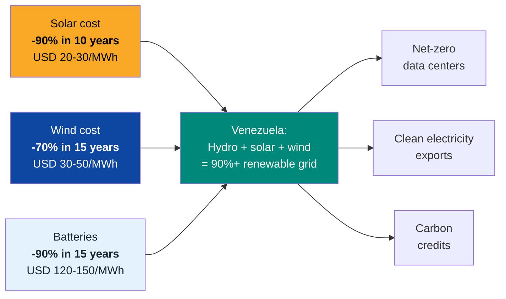
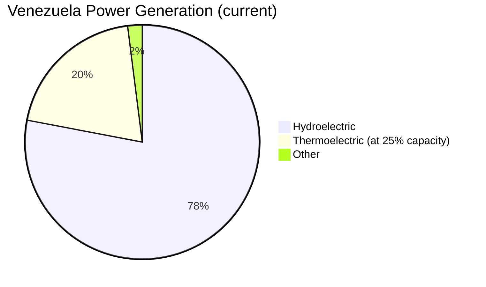
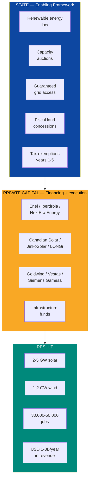
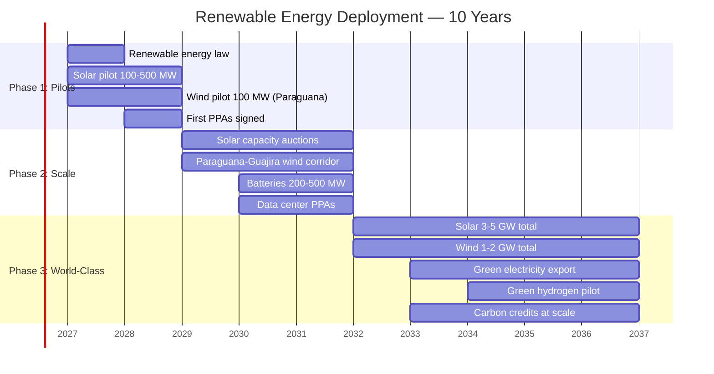
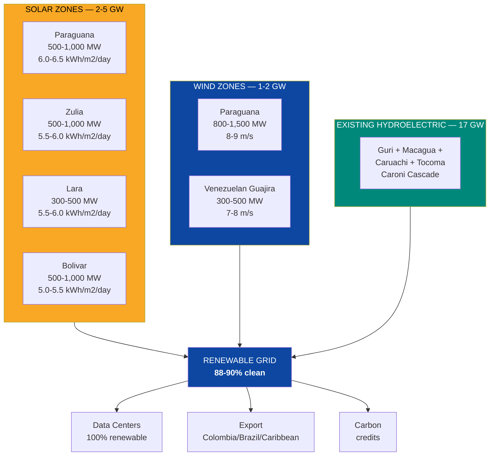
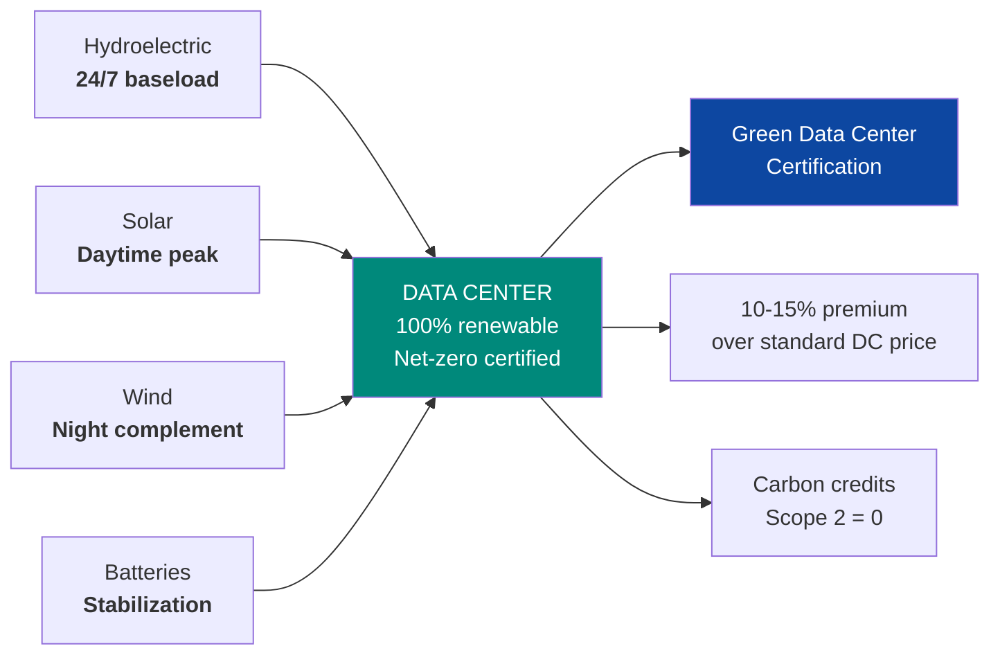
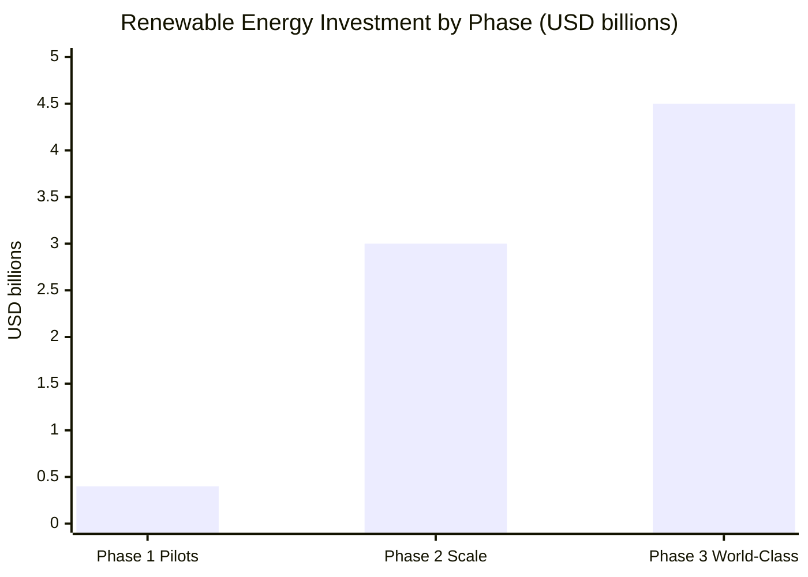
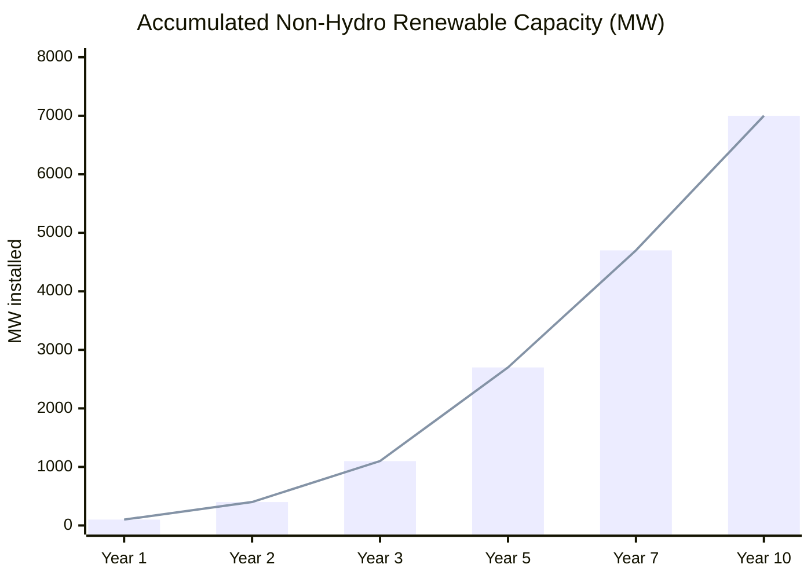
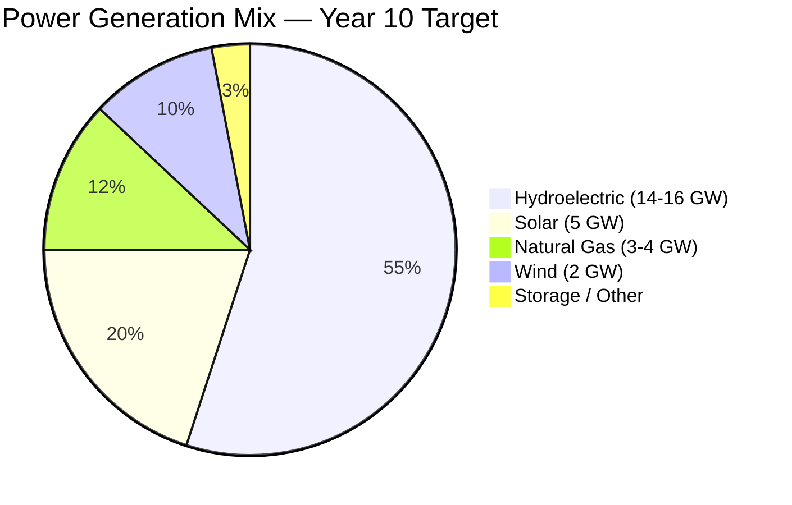

# Renewable Energy: The Fuel That Never Runs Out

> Venezuela has oil for a 15-year real window. It has sun and wind forever. The question is not whether it is worth investing in renewables — it is how much money we are leaving on the table every day we do not.

---

## 1. The Opportunity: Sun, Wind, and the Cheapest Hydroelectric in the Hemisphere

:::info Venezuela: natural advantages most countries do not have
Venezuela combines three things that rarely coincide: **17 GW of installed hydroelectric**, solar irradiation among the highest in the Americas (**5-6 kWh/m2/day**), and consistent wind corridors in Falcon and Zulia (**7-9 m/s**). Most countries have one of these three. Venezuela has all three.
:::

| Resource | Key Data | Source |
|----------|---------|--------|
| **Solar irradiation** | **5-6 kWh/m2/day** (Falcon, Zulia, Lara, Nueva Esparta: >6 kWh/m2/day) | [Global Solar Atlas](https://globalsolaratlas.info/) |
| **Wind** (Falcon, Paraguana, Guajira) | **7-9 m/s** annual average | [Global Wind Atlas](https://globalwindatlas.info/) |
| **Existing hydroelectric** | 17 GW installed (Caroni Cascade) | [Mongabay 2023](https://news.mongabay.com/2023/08/hydropower-in-the-pan-amazon-the-guri-complex-and-the-caroni-cascade/) |
| **Global solar cost (2025)** | **USD 20-30/MWh** (90% drop in 10 years) | [IRENA Renewable Power Generation Costs 2024](https://www.irena.org/publications/2024/Sep/Renewable-Power-Generation-Costs-in-2023) |
| **Global onshore wind cost** | **USD 30-50/MWh** | [IRENA 2024](https://www.irena.org/) |
| **Venezuela solar potential** | **2-5 GW** installable in optimal zones | Own estimates based on Global Solar Atlas |
| **Venezuela wind potential** | **1-2 GW** (Falcon + Zulia + Venezuelan Guajira) | [Global Wind Atlas](https://globalwindatlas.info/) |

### Why now

**Plain-language translation:** 10 years ago installing a solar panel cost 10x what it costs today. Solar is already cheaper than gas and coal in most of the world. Venezuela has one of the best solar resources in the Americas and does not have a single industrial panel installed. That is like having the most productive oil field in the world and not having drilled a single well.

---

## 2. Current State: Zero Renewables at Scale

:::danger Venezuela: 0 MW of industrial solar and wind
Venezuela does not have **a single commercial-scale solar plant or wind farm** operating. It depends 78% on Caroni hydroelectric, with thermoelectric plants at 25% capacity as "backup" that backs up nothing. When there is drought, there are blackouts. When Guri fails, everything fails. This is the opposite of resilience.
:::

| Indicator | Venezuela | Chile | Colombia | Brazil |
|-----------|-----------|-------|----------|--------|
| Installed solar capacity | **0 MW** | **8,000+ MW** | **800+ MW** | **15,000+ MW** |
| Installed wind capacity | **0 MW** | **4,000+ MW** | **3,000+ MW** | **30,000+ MW** |
| % renewable in generation (excl. hydro) | **<1%** | **35%+** | **15%+** | **25%+** |
| Renewable energy regulatory framework | **Nonexistent** | Law 20.698 + auctions | Law 1715 + auctions | Auctions since 2009 |

Sources: installed capacities — [IRENA Renewable Capacity Statistics 2025](https://www.irena.org/Publications/2025/Mar/Renewable-capacity-statistics-2025); [CNE Chile](https://www.cne.cl/); [UPME Colombia](https://www.upme.gov.co/).

### The problem with depending only on hydro

| Risk | Description | Impact |
|------|-------------|--------|
| **Drought / El Nino** | Guri depends on reservoir. Severe drought (2009-2010, 2015-2016) reduced production up to 40% | Massive blackouts, rationing |
| **Climate change** | Less predictable rainfall patterns | Guri as sole source becomes riskier |
| **Geographic concentration** | 90% of generation in a single corridor (Caroni) | A transmission failure = national blackout (March 2019) |
| **Zero redundancy** | Thermoelectric plants do not function as real backup | When hydro fails, there is no plan B |

**Solar and wind solve all four risks:** they generate where consumption occurs (decentralized), do not depend on water, have complementary patterns to hydro (sun during day, strong wind during drought), and geographically diversify generation.

---

## 3. The Solution: 3-7 GW of Solar + Wind in 10 Years

### Strategy: the State regulates, Venezuela S.A. invests, private capital operates

### Phase 1: Pilots (Year 1-2) — 100-500 MW solar + 100 MW wind

| Component | Detail |
|-----------|--------|
| **Solar pilot** | 3-5 plants of 30-100 MW in Falcon, Zulia, Lara |
| **Wind pilot** | 1 wind farm of 100 MW in Paraguana (Falcon) |
| **Solar technology** | Latest-generation bifacial panels (22-24% efficiency) + single-axis trackers |
| **Wind technology** | 4-6 MW turbines (Vestas V162, Siemens Gamesa SG 6.6-170) |
| **PPAs** | 15-20 year contracts with reformed CORPOELEC / private distributors |
| **Investment** | USD 100-400M (solar: USD 0.4-0.6M/MW; wind: USD 1-1.2M/MW) |
| **Jobs** | 2,000-5,000 (construction) + 500-1,000 (operations) |
| **Annual revenue** | USD 30-80M |

:::tip Deployment speed: solar is the fastest energy to install
A 100 MW solar plant is built in **6-12 months**. Compare with: a hydroelectric plant (5-10 years), nuclear (10-15 years), or thermoelectric (2-4 years). Solar is the perfect energy sprint for a country that needs megawatts now.
:::

### Phase 2: Scale (Year 2-5) — 1-3 GW solar + 500 MW-1 GW wind

| Component | Detail |
|-----------|--------|
| **Solar at scale** | Capacity auctions of 200-500 MW per round (Chile/Colombia model) |
| **Wind at scale** | Development of the Paraguana-Venezuelan Guajira wind corridor |
| **Storage** | Lithium batteries 200-500 MW (peak shaving, grid stabilization) |
| **Integration with hydro** | Solar generates during day, hydro is reserved for night and peaks |
| **Data center PPAs** | Specific contracts: solar + hydro = 100% renewable |
| **Investment** | USD 1-3B |
| **Jobs** | 10,000-20,000 (construction) + 3,000-5,000 (operations) |
| **Annual revenue** | USD 200-600M |

### Phase 3: World-Class (Year 5-10) — 3-5 GW solar + 1-2 GW wind

| Component | Detail |
|-----------|--------|
| **Total capacity** | 3-5 GW solar + 1-2 GW wind = **4-7 GW non-hydro renewable** |
| **Storage** | 1-2 GW (batteries + possible pumped hydro) |
| **Export** | Green electricity to Colombia, Brazil, Caribbean |
| **Carbon credits** | Sale of RECs and credits in voluntary market |
| **Green hydrogen** | Pilot production with renewable surplus (electrolysis) |
| **Accumulated investment** | USD 3-7B |
| **Total jobs** | 30,000-50,000 (direct + indirect) |
| **Annual revenue** | USD 1-3B |

---

## 4. Optimal Zones: Where to Put the Panels and Turbines

### Solar: the best sites

| Zone | State | Irradiation (kWh/m2/day) | Potential (MW) | Advantages |
|------|-------|--------------------------|----------------|------------|
| **Paraguana** | Falcon | **6.0-6.5** | 500-1,000 | Flat terrain, low density, port access |
| **Western Zulia coast** | Zulia | **5.5-6.0** | 500-1,000 | Proximity to Maracaibo (demand), available land |
| **Quibor/Barquisimeto Valley** | Lara | **5.5-6.0** | 300-500 | Semi-arid zone, low cloud cover |
| **Margarita Island** | Nueva Esparta | **5.5-6.0** | 100-200 | Tourism + solar desalination |
| **Southern Bolivar** | Bolivar | **5.0-5.5** | 500-1,000 | Proximity to data centers (DC Corridor) |

### Wind: the wind corridors

| Zone | State | Speed (m/s) | Potential (MW) | Capacity Factor | Reference |
|------|-------|-------------|----------------|-----------------|-----------|
| **Paraguana** | Falcon | **8-9** | 800-1,500 | 35-45% | Among the best in LATAM |
| **Venezuelan Guajira** | Zulia | **7-8** | 300-500 | 30-38% | Same corridor as Colombian La Guajira |
| **Sucre Coast** | Sucre | **6-7** | 200-300 | 25-32% | Complements daytime solar |

:::info Paraguana: Venezuela's premium wind site
The Paraguana Peninsula has winds of **8-9 m/s annual average** — comparable to the best sites in Brazil (which has **30 GW** of installed wind). A capacity factor of 35-45% means each turbine produces electricity **35-45% of the time** — significantly above the global average (28-35%). A 500 MW wind farm in Paraguana would generate energy equivalent for **300,000-400,000 homes**.
:::

---

## 5. Business Model: Concessions, Auctions, and PPAs

### Structure: the State regulates, Venezuela S.A. invests in grid, private sector operates

| Role | State | Venezuela S.A. | Private Capital |
|------|-------|----------------|-----------------|
| **Renewable law** | Approves and enforces | — | Provides expertise for design |
| **Independent regulator** | Creates and oversees (CREG/CNE model) | — | Complies with regulation |
| **Capacity auctions** | — | Designs and awards as holding | Competes for contracts |
| **Land** | — | Venezuela S.A. contributes land as equity in JVs | Leases from Venezuela S.A. |
| **Grid access** | Guarantees by law | Invests in transmission grid | Pays transmission tariff |
| **Tax exemptions** | 5-year tax holiday for renewables | Attracts investment |
| **Construction and operation** | **NO** | 100% private |
| **Environmental regulation** | Enforces standards (mandatory EIA) | Complies |

### Revenue streams

| Business Line | Description | Estimated Revenue (at scale 5 GW solar + 2 GW wind) |
|---------------|-------------|------------------------------------------------------|
| **Electricity sales (PPAs)** | 15-20 year contracts with distributors and large consumers | USD 500M-1.5B/year |
| **Data center PPAs** | Solar + hydro = 100% renewable for DCs. Green energy premium | USD 100-300M/year |
| **Export (Colombia/Brazil/Caribbean)** | Green electricity exported via interconnection | USD 100-300M/year |
| **Carbon credits (RECs)** | Renewable energy certificates + voluntary credits | USD 50-200M/year |
| **Storage (peak shaving)** | Batteries sell energy at peak hours at premium price | USD 50-150M/year |
| **Green hydrogen** (future) | Electrolysis with renewable surplus | USD 50-200M/year (post-2035) |
| **TOTAL at scale** | | **USD 1-3B/year** |

### Net-zero data centers: the perfect synergy

**The pitch:** Hyperscalers (AWS, Azure, GCP, Meta) committed to being **100% renewable by 2030**. They desperately need sites where electricity is clean, cheap, and abundant. Venezuela with hydro + solar + wind offers a data center that is **net-zero by default** — without needing to buy RECs in another market. The "green data center" premium is **10-15% over standard price**.

---

## 6. Comparables: Who Has Already Done It

### Chile: from 0 to 30 GW renewables in 10 years

| Indicator | Chile 2013 | Chile 2025 | How They Did It |
|-----------|-----------|-----------|-----------------|
| Solar capacity | ~0 MW | **8,000+ MW** | Energy auctions + NCRE law |
| Wind capacity | ~300 MW | **4,000+ MW** | Mining PPAs + predictable regulation |
| % renewable (excl. hydro) | <5% | **35%+** | Atacama Desert = 6-7 kWh/m2/day irradiation |
| Solar generation cost | >USD 100/MWh | **USD 25-35/MWh** | Competition + scale |
| Investment attracted | ~USD 0 | **>USD 30B** accumulated | Stable legal framework |

Sources: [CNE Chile](https://www.cne.cl/); [Coordinador Electrico Nacional](https://www.coordinador.cl/); [IRENA](https://www.irena.org/).

**Lesson for Venezuela:** Chile demonstrated that a country without a renewable industry can build one in 10 years with two things: natural resource (Atacama = sun, Venezuela = sun + wind + hydro) and predictable regulatory framework (auctions + long-term PPAs). Venezuela has a better combined resource than Chile — what it lacks is the law and the auctions.

### Brazil: wind boom from the Plains to the Northeast

| Indicator | Brazil 2010 | Brazil 2025 | Source |
|-----------|-----------|-----------|--------|
| Wind capacity | 1,000 MW | **30,000+ MW** | [ABEEOLICA](https://abeeolica.org.br/) |
| Accumulated investment | ~USD 2B | **>USD 40B** | [Bloomberg NEF](https://about.bnef.com/) |
| Direct wind jobs | ~5,000 | **300,000+** | ABEEOLICA |
| Equipment exports | Zero | Blade/nacelle factories (Wobben, Vestas) | Local production |

**Lesson for Venezuela:** Brazil started from 1 GW in 2010 and reached 30 GW in 15 years. The Brazilian Northeast has winds comparable to Paraguana's (7-9 m/s). The difference: Brazil had energy auctions since 2009. Venezuela has 0 MW and 0 auctions.

### Morocco: renewables in an emerging oil country

| Indicator | Morocco 2015 | Morocco 2025 | Source |
|-----------|-------------|-------------|--------|
| Solar capacity | ~0 MW | **4,500+ MW** | [MASEN](https://www.masen.ma/) |
| % renewable in generation | <10% | **>40%** | IEA |
| Noor Ouarzazate | N/A | **580 MW** (solar CSP + PV, Africa's largest) | [Power Technology](https://www.power-technology.com/) |
| 2030 target | N/A | **52% renewable** | Government of Morocco |

**Lesson for Venezuela:** Morocco is a country with fewer resources than Venezuela (no hydro) and achieved 40%+ renewable in 10 years. The MASEN agency (Moroccan Agency for Sustainable Energy) acts as facilitator — tenders + PPAs + land. Venezuela needs its own MASEN.

---

## 7. Carbon Credits: Additional Revenue Stream

:::tip Carbon credits are not charity — they are a business
The voluntary carbon market reached **USD 2,000M in 2024** and projects **USD 40-100B by 2030** ([McKinsey](https://www.mckinsey.com/capabilities/sustainability/our-insights/a-blueprint-for-scaling-voluntary-carbon-markets-to-meet-the-climate-challenge)). Each MWh of solar or wind that displaces fossil generation produces a credit of ~0.5 tonnes of CO2 avoided. At USD 20-50/ton, a 1 GW solar farm generates **USD 20-40M/year** in carbon credits — on top of normal electricity sales revenue.
:::

| Credit Source | Estimated Volume (at scale) | Estimated Price | Annual Revenue |
|---------------|----------------------------|-----------------|----------------|
| **Solar 5 GW** | 3-5M tonnes CO2/year | USD 20-50/ton | USD 60-250M |
| **Wind 2 GW** | 1-2M tonnes CO2/year | USD 20-50/ton | USD 20-100M |
| **Net-zero data centers** | Green certification premium | 10-15% over DC price | USD 30-100M |
| **TOTAL** | **4-7M tonnes CO2/year** | | **USD 110-450M/year** |

### Required certifications

| Standard | What It Certifies | Why It Matters |
|----------|-------------------|----------------|
| **[Gold Standard](https://www.goldstandard.org/)** | Carbon credits with social co-benefits | 30-50% premium over generic credits |
| **[Verra VCS](https://verra.org/)** | Verified emissions reduction | Most used standard in voluntary market |
| **I-REC** | Renewable energy certificates | Required by corporations to report Scope 2 |
| **RE100** | 100% renewable electricity for corporations | 400+ committed companies (Apple, Google, Microsoft, etc.) |

---

## 8. Potential Partners

| Company/Entity | Country | Experience | Role in Venezuela |
|----------------|---------|-----------|-----------------|
| **Enel Green Power** | Italy | 60+ GW renewable in 30 countries | Solar and wind developer + operator |
| **Iberdrola** | Spain | Global onshore + offshore wind leader | Falcon/Zulia wind farms + distribution |
| **NextEra Energy** | U.S. | World's largest solar and wind generator | Anchor developer + financing |
| **Canadian Solar** | Canada | Top 5 panel manufacturer + developer | Module supplier + plant development |
| **Goldwind** | China | 3rd largest turbine manufacturer worldwide | Wind turbines (if no geopolitical restriction) |
| **Vestas** | Denmark | World's largest wind turbine manufacturer | Turbines for Falcon/Zulia corridors |
| **Siemens Gamesa** | Spain/Germany | Wind turbines + services | Alternative to Vestas/Goldwind |
| **LONGi Green Energy** | China | World's largest panel manufacturer | Modules for solar plants |
| **AES Corporation** | U.S. | IPP with operations in 14 LATAM countries | Integrated developer + operator |
| **Acciona Energia** | Spain | 14+ GW renewable in 40 countries | Solar + wind development |
| **IDB / CAF** | Multilateral | Renewable energy financing in LATAM | Concessional loans + technical assistance |
| **IFC (World Bank)** | Multilateral | Scaling Solar program (50+ countries) | Auction structuring + financing |
| **Green Climate Fund** | Multilateral | USD 13B+ mobilized for developing countries | Project co-financing |

:::caution On Chinese suppliers (LONGi, Goldwind, JinkoSolar)
Chinese solar panels are the cheapest in the world and dominate 80%+ of the market. For panels (manufactured product), there is no geopolitical restriction comparable to Huawei/5G. However, for wind turbines with integrated control software, sensitivity is higher. **Recommendation:** Chinese solar panels are acceptable; for wind turbines, prefer Vestas/Siemens Gamesa to avoid friction with the U.S.
:::

---

## 9. Total Investment and Job Creation

### Investment by phase

| Phase | Investment | Capacity | Timeline | Jobs |
|-------|-----------|----------|----------|------|
| Phase 1: Pilots | USD 100-400M | 200-600 MW | Year 1-2 | 3,000-6,000 |
| Phase 2: Scale | USD 1-3B | 1.5-4 GW accumulated | Year 2-5 | 13,000-25,000 |
| Phase 3: World-Class | USD 2-4B | 4-7 GW accumulated | Year 5-10 | 30,000-50,000 |
| **TOTAL** | **USD 3-7B** | **4-7 GW** | **10 years** | **30,000-50,000** |

### Job creation by category

| Category | Phase 1 | Phase 2 | Phase 3 (accumulated) |
|----------|---------|---------|----------------------|
| **Construction** | 2,000-4,000 | 8,000-15,000 | Rotating |
| **Operations and maintenance** | 500-1,000 | 3,000-5,000 | 8,000-12,000 |
| **Engineering and design** | 200-500 | 1,000-2,000 | 2,000-3,000 |
| **Local manufacturing** (assembly, structures) | 0 | 1,000-3,000 | 5,000-10,000 |
| **Indirect jobs** | 1,000-2,000 | 5,000-10,000 | 15,000-25,000 |
| **TOTAL** | **3,000-6,000** | **13,000-25,000** | **30,000-50,000** |

:::info Local manufacturing: not just installing, but building
Chile and Brazil got turbine manufacturers (Vestas, Wobben) and panel makers to open local plants when the market grew sufficiently (>5 GW). Venezuela can negotiate minimum local content (30-50%) in auctions, creating an industry for metal structures, cabling, inverters, and eventually panel assembly.
:::

---

## 10. Risks and Mitigations

| # | Risk | Prob. | Impact | Mitigation |
|---|------|-------|--------|------------|
| 1 | **No renewable energy legal framework** — no law, no auctions, no investment | High | Critical | Renewable energy law as legislative priority (year 1). Model: Chile Law 20.698 or Colombia Law 1715 |
| 2 | **Transmission grid cannot support** — renewable generation without grid to evacuate it | High | High | Transmission investment is parallel. See [Electrical Capacity](./capacidad-electrica). Distributed solar reduces transmission pressure |
| 3 | **Country risk deters capital** | High | High | USD-denominated PPAs + offshore SPV structure + MIGA insurance. 15-20 year PPAs provide certainty |
| 4 | **Regional competition** — Chile/Colombia/Brazil already captured the best developers | Medium | Medium | Venezuela competes on energy cost (free hydro backup) and on the hydro + solar + wind combination few have |
| 5 | **Intermittency** — sun during day, variable wind | Medium | Medium | Hydro as natural backup (modulates production according to solar/wind). Batteries for stabilization. Solar-wind complementarity |
| 6 | **Supply chain** — panels and turbines are imported | Medium | Medium | Strategic inventory. Supplier diversification (Chinese + European). Local manufacturing at medium term |
| 7 | **Local opposition** — communities rejecting solar/wind plants in their territory | Medium | Medium | Prior consultation + shared benefits (jobs, free electricity, local royalties). Model: Colombia prior consultation for Guajira wind |
| 8 | **Corruption in auctions** | High | Medium | International auctions with multilateral oversight (IFC/IDB). Full transparency. Collusion penalties |

---

## 11. 10-Year Financial Projection

| Indicator | Year 1 | Year 2 | Year 3 | Year 5 | Year 7 | Year 10 |
|-----------|--------|--------|--------|--------|--------|---------|
| **Solar capacity (MW)** | 100 | 300 | 800 | 2,000 | 3,500 | 5,000 |
| **Wind capacity (MW)** | 0 | 100 | 300 | 700 | 1,200 | 2,000 |
| **Total non-hydro renewable capacity (MW)** | 100 | 400 | 1,100 | 2,700 | 4,700 | 7,000 |
| **Annual generation (TWh)** | 0.2 | 0.7 | 2.0 | 5.0 | 8.5 | 13.0 |
| **Accumulated investment (USD M)** | 100 | 350 | 900 | 2,500 | 4,500 | 7,000 |
| **Annual revenue (USD M)** | 10 | 40 | 120 | 350 | 700 | 1,500 |
| **Carbon credits (USD M/year)** | 2 | 8 | 25 | 70 | 140 | 300 |
| **Direct jobs** | 1,500 | 4,000 | 8,000 | 15,000 | 25,000 | 35,000 |
| **Indirect jobs** | 1,000 | 3,000 | 6,000 | 12,000 | 20,000 | 30,000 |

### Return on investment

| Metric | Value |
|--------|-------|
| **Total investment (10 years)** | **USD 3-7B** |
| **Accumulated revenue (10 years)** | **USD 3-5B** (electricity + credits) |
| **Average LCOE** | **USD 25-40/MWh** (globally competitive) |
| **Payback** | **Year 6-8** (with long-term PPAs) |
| **Estimated IRR** | **12-18%** |
| **Asset useful life** | **25-30 years** (solar panels), **20-25 years** (turbines) |
| **Residual value** | Assets continue generating 15-20 years after payback |

---

## 12. Contribution to the Venezuela S.A. Plan

### Target energy mix (Year 10)

| Parameter | Value |
|-----------|-------|
| **Total renewable grid** | **88%** (hydro 55% + solar 20% + wind 10% + storage 3%) |
| **Non-hydro renewable investment** | USD 3-7B of USD 15-25B in total electricity |
| **100% renewable data centers** | Hydro + solar + wind = net-zero without external RECs |
| **Green electricity export** | USD 100-300M/year to Colombia, Brazil, Caribbean |
| **Emissions reduction** | 4-7M tonnes CO2/year avoided |
| **Jobs** | 30,000-50,000 direct + indirect |
| **Annual revenue (year 10)** | USD 1-3B (electricity + credits + export) |

:::tip The final equation
Venezuela + hydro + solar + wind = the cleanest and cheapest grid in the Americas. That attracts data centers (USD 2-3B/year). That generates carbon credits (USD 100-450M/year). That enables green hydrogen (future). And all of that happens **without burning a single drop of oil** — which gets sold at USD 60/barrel to the sovereign fund.

**Oil is fuel. Renewables are the destination.**
:::

---

## Related Documents

- [Electrical Capacity](./capacidad-electrica) — Solar and wind complement the hydroelectric base in the national energy mix
- [AI Data Centers](./data-centers-ia) — Renewables enable 100% green data centers with carbon credit certification
- [Agriculture & Livestock](./agro-ganaderia) — Off-grid solar energy for water pumping and rural electricity in agricultural zones
- [Critical Minerals](./minerales-criticos) — Lithium and rare earths needed for batteries and wind turbines
- [Industrial Manufacturing](./manufactura-industrial) — Local manufacturing of solar and wind components
- [Concession Model](./modelo-concesiones) — Renewable generation concessions with 15-20 year PPAs (30-50 years)

---

## Sources

| # | Source | Data |
|---|--------|------|
| 1 | [Global Solar Atlas](https://globalsolaratlas.info/) | Venezuela solar irradiation 5-6 kWh/m2/day |
| 2 | [Global Wind Atlas](https://globalwindatlas.info/) | Falcon/Zulia wind speed 7-9 m/s |
| 3 | [IRENA Renewable Power Generation Costs 2024](https://www.irena.org/publications/2024/Sep/Renewable-Power-Generation-Costs-in-2023) | Solar cost USD 20-30/MWh, 90% drop in 10 years |
| 4 | [IRENA Renewable Capacity Statistics 2025](https://www.irena.org/Publications/2025/Mar/Renewable-capacity-statistics-2025) | Installed capacities Chile, Brazil, Colombia |
| 5 | [CNE Chile](https://www.cne.cl/) | Chile from 0 to 8,000+ MW solar in 10 years |
| 6 | [ABEEOLICA Brazil](https://abeeolica.org.br/) | Brazil 30,000+ MW wind, 300,000+ jobs |
| 7 | [MASEN Morocco](https://www.masen.ma/) | Renewable energy agency model |
| 8 | [McKinsey — Scaling Voluntary Carbon Markets](https://www.mckinsey.com/capabilities/sustainability/our-insights/a-blueprint-for-scaling-voluntary-carbon-markets-to-meet-the-climate-challenge) | Carbon market USD 2B → USD 40-100B |
| 9 | [Mongabay 2023](https://news.mongabay.com/2023/08/hydropower-in-the-pan-amazon-the-guri-complex-and-the-caroni-cascade/) | Caroni Cascade 17 GW |
| 10 | [Coordinador Electrico Nacional Chile](https://www.coordinador.cl/) | Chile renewable mix 35%+ |
| 11 | [Bloomberg NEF](https://about.bnef.com/) | Accumulated renewable investment Brazil >USD 40B |
| 12 | [Gold Standard](https://www.goldstandard.org/) | Premium carbon credit certification |
| 13 | [IFC Scaling Solar](https://www.ifc.org/en/what-we-do/sector-expertise/infrastructure/scaling-solar) | Solar auction program in 50+ countries |
