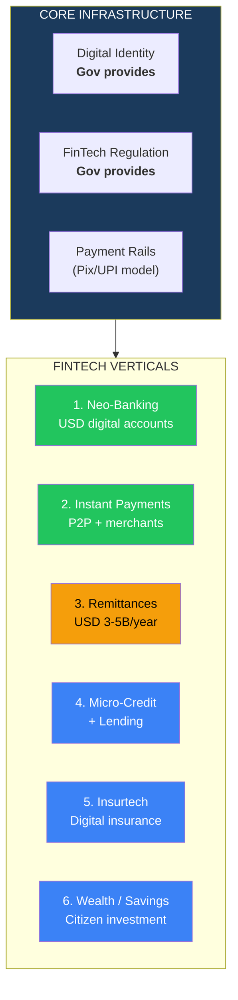
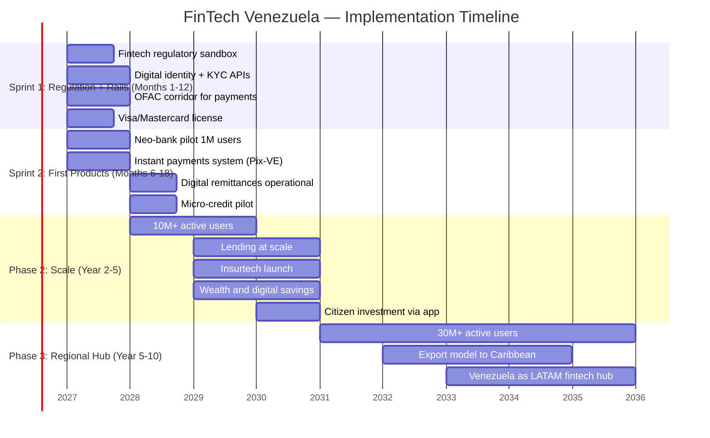
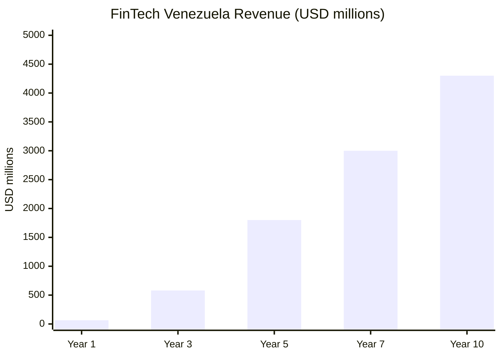
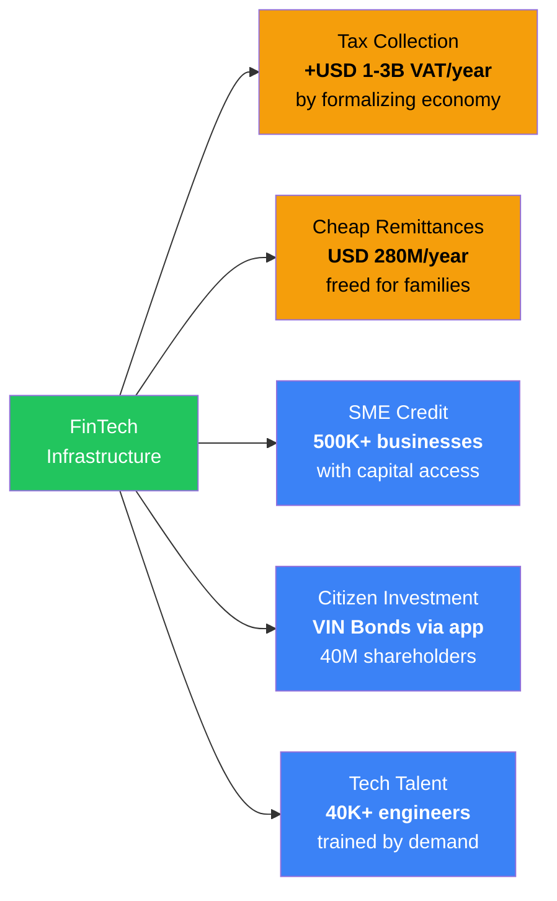

# FinTech & Digital Banking: 40 Million Clients Without a Bank

> 40 million people in a dollarized economy without modern financial infrastructure. No Zelle, no Venmo, no Pix, no UPI. The largest untapped digital payments market in the Americas. The State provides the regulatory framework and digital identity. Venezuela S.A. facilitates payments infrastructure as the citizen holding company. Private capital provides the technology and operates. The result: a financial system born digital, with no banking legacy, directly in the 21st century.

---

## 1. The Opportunity: The Largest Unbanked Market in the Americas

:::danger 40 million people without modern financial services
Venezuela has the **largest population without fintech access** in the Americas. Local banks operate with 1990s systems. There are no instant payments. No neo-banks. No digital micro-credit. No parametric insurance. In a **de facto dollarized** country, financial infrastructure still operates as if it were 1998. That is not a crisis — it is a **USD 5-15B opportunity**.
:::

| Data Point | Figure | Source |
|------|-------|--------|
| Total population | **~30M** (residents) + **7.9M** diaspora | [UNHCR, Dec. 2025](https://www.unhcr.org/) |
| Formal bank penetration | **~45%** (basic accounts, with no real functionality) | [Requires research] |
| Smartphone penetration | **~70%** | [GSMA Intelligence 2024](https://www.gsmaintelligence.com/) |
| Annual diaspora remittances | **USD 3-5B/year** | [IDB/FOMIN 2024](https://www.iadb.org/) |
| Average remittance commission to Venezuela | **7-15%** (up to 20% through informal channels) | [Remitly/World Bank 2024](https://remittanceprices.worldbank.org/) |
| De facto dollarized economy | **>65%** of transactions in USD | [Ecoanalitica 2024](https://ecoanalitica.com/) |
| LATAM fintech market (2024) | **USD 150B+** combined valuation | [LAVCA 2024](https://lavca.org/) |
| LATAM fintech growth | **CAGR 25-30%** | [Americas Market Intelligence](https://americasmi.com/) |
| Nubank users (reference) | **100M+** (from zero in 2013) | [Nubank IR 2025](https://investors.nu/) |

**Plain-language translation:** Imagine 40 million people using dollars but having nowhere to store, send, or receive them digitally. They pay in cash, send remittances via mules (people crossing borders carrying cash), and have no access to credit, insurance, or digital savings. That is Venezuela today. Whoever builds the digital financial infrastructure captures the entire population.

### Why now and not before

| Enabling Factor | Status | Impact |
|----------------|--------|---------|
| **De facto dollarization** | Active since 2019 | Eliminates the volatile local currency problem. Fintech operates in USD from day 1 |
| **Smartphone penetration** | ~70% | The hardware is already in people's pockets. Only the software is missing |
| **Starlink** | Deploying | Connectivity in rural areas where banks would never open branches |
| **Connected diaspora** | 7.9M people with bank accounts in destination countries | Remittance channel + tech adoption + capital |
| **Zero digital incumbents** | No neo-bank operates | Total first-mover advantage. There is no Venezuelan Nubank, Uala, or Nequi |
| **Young population** | Median age ~28 years | High tech adoption, low resistance to change |

---

## 2. The 6 Opportunity Verticals

### Vertical 1: Neo-Banking — Digital Accounts in USD

| Component | Detail |
|-----------|--------|
| **Product** | USD digital account with virtual/physical card (Visa/Mastercard). No branch, no paperwork, opens in 5 minutes |
| **Market** | 30M residents + 7.9M diaspora = **~38M potential clients** |
| **Revenue** | Interchange fees (1.5-3%), premium accounts, FX spread, interest on deposits |
| **Estimated revenue (year 5)** | **USD 500M-1B/year** (at 15M active users with USD 200/year ARPU) |
| **Reference** | Nubank: USD 0 → USD 8B revenue in 10 years with 100M users |
| **Potential operators** | Nubank, Mercado Pago, Uala, Nequi (Bancolombia), Block/Square, Revolut |

### Vertical 2: Instant Payments — The Venezuelan "Pix"

| Component | Detail |
|-----------|--------|
| **Product** | 24/7 instant payments system between people, merchants, government. Free for P2P, micro-fee for merchants |
| **Reference** | Brazil Pix: **224M users**, **4B transactions/month**, launched Nov. 2020 — [BCB 2025](https://www.bcb.gov.br/en/financialstability/pix_en) |
| **Reference** | India UPI: **16B transactions/month**, **430M users** — [NPCI 2025](https://www.npci.org.in/) |
| **Implementation** | Government creates the rails (central bank or regulatory entity). Fintechs and banks connect. Mandatory interoperability |
| **Revenue** | Indirect: reduces informal economy (more VAT collected), enables lending (transaction data), reduces cash handling costs |
| **Fiscal impact** | **+USD 1-3B/year in VAT collection** by formalizing cash transactions |

:::tip The Pix effect: what Brazil taught the world
Pix launched in November 2020 and within 3 years had 224 million users — more than Brazil's population. Free for individuals, minimal cost for merchants. Result: cash use dropped 30%, tax collection increased, and bank transfer costs fell from USD 2-5 to zero. Venezuela can replicate this in 12-18 months with the advantage of starting from zero — no legacy systems to migrate.
:::

### Vertical 3: Remittances — USD 3-5B/Year with 15% Commission

| Component | Detail |
|-----------|--------|
| **Market** | **USD 3-5B/year** in remittances from 7.9M Venezuelans abroad |
| **Problem** | Commissions of **7-15%** (up to 20% through informal channels). Western Union, Remitly, expensive bank channels |
| **Opportunity** | Reduce commissions to **1-3%** with direct digital transfers |
| **Revenue** | At 3% commission on USD 4B = **USD 120M/year**. At scale with cross-sell: **USD 300-500M/year** |
| **Revenue pool freed** | If commission drops from 10% to 3%, **USD 280M/year** is freed going to Venezuelan families' pockets |
| **Potential operators** | Wise (TransferWise), Remitly, dLocal, Block/Square, stablecoins (USDC/USDT via Circle/Tether) |

### Vertical 4: Micro-Credit and Lending

| Component | Detail |
|-----------|--------|
| **Problem** | Zero access to formal credit for ~80% of the population. Usurious rates of 10-20% monthly in the informal market |
| **Opportunity** | Micro-credits (USD 50-5,000) with alternative scoring (smartphone data, payments, commerce) |
| **Revenue** | Rate spread (15-35% annual) + fees. At 5M loans averaging USD 500: **USD 375-875M/year** in interest |
| **Reference** | M-Pesa + M-Shwari (Kenya): 30M loans in 5 years. Mercado Credito (LATAM): USD 4B+ portfolio |
| **Risk** | Default rates in emerging markets: 5-15%. Requires sophisticated scoring and digital collection |

### Vertical 5: Insurtech — Digital Insurance

| Component | Detail |
|-----------|--------|
| **Problem** | Insurance penetration in Venezuela: **<2%** of GDP (LATAM average: 3.2%) |
| **Opportunity** | Micro-insurance: health (USD 5-15/month), life (USD 2-5/month), parametric agricultural, vehicles |
| **Revenue (year 5)** | **USD 200-500M/year** in premiums |
| **Reference** | BIMA (emerging markets): 40M clients in mobile-first insurance. Lemonade: 100% digital insurance |
| **Advantage** | In a country where the healthcare system collapsed, a USD 10/month micro-insurance covering emergencies is a game-changer |

### Vertical 6: Wealth and Digital Savings

| Component | Detail |
|-----------|--------|
| **Product** | USD savings accounts with yield, micro-investments (ETF/stock fractions), stablecoins |
| **Revenue (year 5)** | **USD 100-300M/year** in management fees + spread |
| **Reference** | Nu Invest (Nubank): 10M+ investors. Uala: interest-bearing account. GBM (Mexico): accessible investments |
| **Connection to the plan** | Vehicle for **citizen investment** (VIN bonds) — every Venezuelan can buy participation in the sovereign fund via app |

---

## 3. What the State Provides (and What It Does NOT Do)

:::info Neither the State nor Venezuela S.A. operates fintechs. The State creates the rules of the game. Venezuela S.A. facilitates payments infrastructure.
The State's role is exactly the same as in Estonia, Singapore, or India: provide digital identity, modern regulation, and payment rails. Venezuela S.A. can invest in base infrastructure (payment rails, digital identity) as a shareholder. The private sector builds the apps, products, and user experience. **Zero bureaucracy operating banks.**
:::

| The State provides | Detail | Reference |
|--------------------|--------|-----------|
| **Digital identity** | Biometric ID + electronic signature. Single verifiable database via API. Without this, no digital KYC | Estonia: [e-Residency](https://e-resident.gov.ee/), India: [Aadhaar](https://uidai.gov.in/) (1.4B records) |
| **Fintech regulation** | Regulatory sandbox for new products. Payments, lending, digital insurance licenses. Consumer protection | UK: [FCA Sandbox](https://www.fca.org.uk/firms/innovation/regulatory-sandbox), Brazil: [BCB Pix regulation](https://www.bcb.gov.br/), Mexico: [Fintech Law 2018](https://www.gob.mx/) |
| **Payment rails** | Instant payments system (Pix/UPI model) operated by autonomous entity. Mandatory interoperability | Brazil Pix, India UPI, Mexico CoDi/DiMo |
| **Anti-money laundering (AML/KYC)** | FATF/GAFI-compatible AML legal framework. Beneficial ownership registry. Suspicious transaction reporting | [FATF Standards](https://www.fatf-gafi.org/) |
| **Sanctions corridor** | OFAC licenses for fintech operators. Clear compliance so Visa/Mastercard/Swift can operate without legal risk | Chevron license model — [OFAC](https://ofac.treasury.gov/) |
| **Data protection** | GDPR-compatible personal data protection law. Requirement for operating with financial data | EU GDPR, Brazil LGPD |

| What neither the State nor Venezuela S.A. does | Why |
|-------------------------------------------------|-----|
| Operate banks or fintechs | Neither the State nor Venezuela S.A. are banks. PDVSA demonstrated that the State does not operate businesses |
| Set interest rates | The market determines them. The regulator supervises excesses |
| Subsidize financial products | Distorts the market. Subsidies go directly to citizens, not intermediaries |
| Create a "state digital currency" (CBDC) | The Petro demonstrated it does not work. Private stablecoins (USDC) already exist |
| Block foreign competition | More operators = better prices for citizens |

---

## 4. Foreign Capital: Who Builds This

### Fintech operators

| Company | Country | Why They Would Participate | Role |
|---------|---------|---------------------------|------|
| **Nubank** | Brazil | 100M+ users, active LATAM expansion, expertise in legacy-free markets | Anchor neo-bank. USD accounts, cards, credit |
| **Mercado Pago** | Argentina | Already operates in 7 LATAM countries. Integrated with e-commerce (Mercado Libre) | Payments + lending + financial e-commerce |
| **Block (Square/Cash App)** | U.S. | Cash App has 57M+ users. P2P payments and crypto expertise. Emerging market presence via Afterpay | Instant payments + remittances + crypto |
| **Wise (TransferWise)** | UK | Global leader in cheap international transfers. 16M+ clients. Commissions <1% | Remittances + multi-currency accounts |
| **Revolut** | UK | 50M+ users, banking license in multiple jurisdictions | Neo-bank, crypto, trading |
| **Uala** | Argentina | 8M+ users in Argentina + Mexico. Low-cost model for young users | Neo-bank for young/mass segment |
| **dLocal** | Uruguay | Payments processor for emerging markets. Connects global merchants with LATAM | Cross-border payments infrastructure |
| **Rappi** | Colombia | Super-app with 30M+ LATAM users. RappiPay already operating | Financial super-app (payments + credit + insurance) |

### Venture Capital and investors

| Fund | Track Record | Estimated Ticket |
|------|-------------|-----------------|
| **Kaszek Ventures** | Largest LATAM VC. Invested in Nubank ($5M seed → $50B+ company) | USD 50-200M |
| **SoftBank Latin America** | Fund I + II = USD 8B+. Invested in Uala, Kavak, Rappi | USD 100-500M |
| **Y Combinator** | 4,000+ funded startups. Pipeline of Venezuelan founders in diaspora | Seed + growth |
| **a16z (Andreessen Horowitz)** | USD 2.2B fintech fund. Invested in Ramp, Plaid, Coinbase | USD 100-300M |
| **General Atlantic** | Invested in Nubank, dLocal. Emerging fintech expertise | USD 200-500M |
| **Sequoia Capital** | Invested in Stripe, Klarna, Brex | USD 100-500M |
| **Tiger Global** | Invested in Nubank (USD 1B+), Uala | USD 100-300M |

### Financial infrastructure

| Company | Role | Why It Is Critical |
|---------|------|-------------------|
| **Visa** | Card network, tokenization | Without Visa there are no cards. Requires clean OFAC corridor |
| **Mastercard** | Card network, financial inclusion | Mastercard Labs operates in emerging markets |
| **Stripe** | Online payments processing, API infrastructure | Stripe Atlas enables company creation from day 1. E-commerce prerequisite |
| **Plaid** | Connection between apps and bank accounts | Open banking infrastructure |
| **Circle (USDC)** | Regulated stablecoin. USD transfers without Swift | Alternative to banking rails for remittances and cross-border payments |
| **Chainalysis** | Crypto compliance and AML | Transaction monitoring for FATF/OFAC compliance |

---

## 5. Implementation Sprint

### Sprint 1 (Months 1-12): The Foundations

| Action | Result | Cost | Who |
|--------|--------|------|-----|
| Create fintech regulatory sandbox | Licenses for neo-banks, payments, lending | USD 5-10M (regulatory setup) | Government + international advisors (FCA UK, BCB Brazil) |
| Deploy digital identity with verification APIs | Digital KYC in 2 minutes, no paperwork | USD 50-100M | Government + Thales/IDEMIA (ID providers) |
| Negotiate OFAC corridor for financial services | Visa/Mastercard/Swift can operate | USD 0 (diplomatic) | Government + U.S. Dept. of Treasury |
| Visa/Mastercard licenses for local issuers | Physical and virtual cards | USD 10-20M (setup) | Fintechs + Visa/Mastercard |
| Connectivity: Starlink in 1,000+ rural towns | 70%+ of population with internet | USD 20-30M | SpaceX/Starlink + government |

### Sprint 2 (Months 6-18): First Products

| Product | Target | Reference |
|---------|--------|-----------|
| Neo-bank pilot (1-2 operators) | **1M users** in 12 months | Nubank: 1M in 18 months (Brazil 2016) |
| Instant payments system ("Pix-VE") | **5M transactions/month** | Pix: 1B transactions/month in year 1 |
| Digital remittances (2-3 operators) | **USD 500M** processed, commission <3% | Wise: 16M clients, <1% commission |
| Micro-credit pilot | **100,000 loans** of USD 100-1,000 | M-Shwari (Kenya): 200K loans/month in year 1 |

---

## 6. Revenue Model and Projection

### Revenue by vertical (10-year projection)

| Vertical | Year 1 | Year 3 | Year 5 | Year 10 |
|----------|--------|--------|--------|---------|
| **Neo-Banking** | USD 20M | USD 200M | USD 600M | USD 1.5B |
| **Instant Payments** | USD 10M | USD 80M | USD 200M | USD 500M |
| **Remittances** | USD 30M | USD 150M | USD 350M | USD 600M |
| **Micro-Credit/Lending** | USD 5M | USD 100M | USD 400M | USD 1B |
| **Insurtech** | USD 0 | USD 30M | USD 150M | USD 400M |
| **Wealth/Savings** | USD 0 | USD 20M | USD 100M | USD 300M |
| **TOTAL** | **USD 65M** | **USD 580M** | **USD 1.8B** | **USD 4.3B** |

### Active users (projection)

| Metric | Year 1 | Year 3 | Year 5 | Year 10 |
|--------|--------|--------|--------|---------|
| Digital accounts | 2M | 10M | 20M | 30M+ |
| Transactions/month | 10M | 200M | 1B | 3B+ |
| Active loans | 100K | 1M | 5M | 15M |
| Insurance policies | 0 | 500K | 3M | 10M |
| Digital remittance volume | USD 500M | USD 2B | USD 3.5B | USD 5B+ |

### Job creation

| Category | Year 1 | Year 3 | Year 5 | Year 10 |
|----------|--------|--------|--------|---------|
| **Software engineers** | 2,000 | 8,000 | 20,000 | 40,000 |
| **Customer support** | 1,000 | 5,000 | 15,000 | 30,000 |
| **Operations and compliance** | 500 | 2,000 | 5,000 | 10,000 |
| **Sales and marketing** | 500 | 2,000 | 5,000 | 10,000 |
| **Indirect** | 1,000 | 5,000 | 15,000 | 30,000 |
| **TOTAL** | **5,000** | **22,000** | **60,000** | **120,000** |

:::tip FinTech as a tech job generator
Every neo-bank needs hundreds of engineers. Every fintech needs product, data, compliance, and support teams. With 10 scale fintech operators + 50 startups + support ecosystem, the sector generates **50-120K direct and indirect jobs** — most in software engineering, the same talent that feeds the plan's tech hubs.
:::

---

## 7. Required Infrastructure

| Component | Current Status | What Is Needed | Cost | Timeline |
|-----------|---------------|----------------|------|----------|
| **Internet connectivity** | <1 Mbps average, 48% penetration | Starlink + urban fiber optic. Target: 80%+ with 10+ Mbps | USD 500M-1B | 1-3 years |
| **Digital identity** | Physical ID card, fragmented registry | Centralized biometric system with APIs. Aadhaar/e-Estonia model | USD 50-100M | 6-18 months |
| **Smartphones** | ~70% penetration | Smartphone financing program (USD 50-100 entry-level) | USD 200-500M (credits/subsidies) | 1-3 years |
| **Local data centers** | Nonexistent for fintech | Tier III data centers for local processing (data regulation) | USD 100-300M | 1-3 years |
| **Power grid** | Unstable | See [Electrical Capacity](./capacidad-electrica) | USD 15-25B | 1-10 years |

---

## 8. The Multiplier Effect: FinTech Enables Everything

| Multiplier Effect | Impact | Why It Matters |
|-------------------|--------|----------------|
| **Economy formalization** | +USD 1-3B/year in VAT collection | Digital payments = visible transactions = expanded tax base |
| **Cheap remittances** | USD 280M/year freed | From 10% commission to 3% = more money for families, not intermediaries |
| **SME credit** | 500K+ businesses with access | Without credit there is no entrepreneurship. Fintech unlocks alternative scoring |
| **Citizen investment** | VIN Bonds via app | Every Venezuelan can buy participation in the sovereign fund from their phone |
| **Tech talent** | 40K+ engineers | Fintech demand creates the talent demand that feeds the tech hubs |
| **Digital economy** | E-commerce, gig economy, freelancing | Without digital payments there is no digital economy. Without digital economy there is no diversification |

---

## 9. Risks and Mitigations

| # | Risk | Prob. | Impact | Mitigation |
|---|------|-------|--------|------------|
| 1 | **OFAC sanctions prevent Visa/Mastercard from operating** | Medium-High | Critical | Stablecoins (USDC) as alternative to traditional rails. Non-U.S. operators. Specific Chevron-type licenses |
| 2 | **Poorly designed regulation stifles innovation** | Medium | High | Regulatory sandbox with 2 years of experimentation before final regulation. FCA UK + BCB Brazil advisors |
| 3 | **Fraud and money laundering** | High | High | Mandatory biometric KYC + Chainalysis monitoring + FATF reports. Real criminal penalties |
| 4 | **Low adoption** | Medium | High | Remittances as adoption hook: diaspora drives adoption. Pix-VE is free. Adoption incentives (cashback) |
| 5 | **Mass lending defaults** | Medium | Medium | Conservative scoring initially. Low limits (USD 100-500). Gradual approach. 15-20% provisions |
| 6 | **Power grid instability** | High | High | Offline-first apps. Cached transactions. Sync when connected. Starlink as backup |
| 7 | **Competition from existing P2P crypto** | Medium | Medium | Venezuela is top 10 globally in crypto adoption. Fintechs must integrate, not compete with crypto. USDC as bridge |
| 8 | **Personal data leaks** | Medium | High | Data protection law (GDPR-type). Infrastructure in certified local data centers. Mandatory audits |

---

## 10. International Comparables

| Country | Model | Result | Lesson for Venezuela |
|---------|-------|--------|---------------------|
| **Brazil (Pix)** | Central bank instant payments system. Free for individuals. Launched Nov. 2020 | **224M users, 4B transactions/month** in 3 years. 30% drop in cash usage | Venezuela can replicate with "Pix-VE". Starting from zero is an advantage: no legacy to migrate |
| **India (UPI + Aadhaar)** | Biometric identity (1.4B records) + instant payments. Government provides rails, private sector builds apps | **16B transactions/month**, financial inclusion went from 35% to 80% in 10 years | Digital identity first, fintech second. Without Aadhaar there was no UPI. Without digital ID there is no KYC |
| **Kenya (M-Pesa)** | Mobile money via SMS (without smartphone). Safaricom operated, government regulated later | **50M+ users** in Africa. 65% of Kenya's GDP flows through M-Pesa. Financial inclusion from 26% to 83% | In markets without banks, the mobile IS the bank. Venezuela with smartphones has more capacity than Kenya with SMS |
| **Philippines (GCash)** | Digital wallet + remittances + lending. Globe Telecom + Ant Financial | **90M+ registered users** (of 110M population). USD 100B+ transactions/year | Remittances as adoption hook. OFWs (Filipinos abroad) adopted first, then the country followed |
| **Mexico (Fintech Law 2018)** | First fintech law in LATAM. Regulatory sandbox, crypto licenses, open banking | 650+ fintechs operating, USD 10B+ market | Clear regulation from the start attracts capital. Mexico has more fintechs than countries with 5x its GDP |
| **Nubank (Brazil)** | Neo-bank: from zero to 100M users in 10 years. IPO valuation USD 50B+ | **USD 8B+ revenue**, **20M+ credit clients**, profitable since 2023 | You can build a 100M-client bank without a single branch. You only need smartphones + regulation |

Sources: [BCB — Pix](https://www.bcb.gov.br/en/financialstability/pix_en); [NPCI — UPI](https://www.npci.org.in/); [Safaricom — M-Pesa](https://www.safaricom.co.ke/personal/m-pesa); [GCash](https://www.gcash.com/); [CNBV Mexico](https://www.gob.mx/cnbv); [Nubank IR](https://investors.nu/).

---

## 11. Executive Summary

| Parameter | Value |
|-----------|-------|
| **Market** | 40M people (30M residents + 7.9M diaspora) without fintech |
| **Estimated revenue (year 5)** | **USD 1.8B/year** |
| **Estimated revenue (year 10)** | **USD 4-5B/year** |
| **Required government investment** | USD 100-200M (regulation + digital identity + payment rails) |
| **Expected private investment** | USD 3-8B over 10 years (fintechs + VCs + infrastructure) |
| **Jobs (year 10)** | **50-120K** direct and indirect |
| **Fiscal impact** | +USD 1-3B/year in VAT collection through formalization |
| **Model** | Government regulates, private sector operates. Zero state-owned banks |
| **First product timeline** | 6-12 months (neo-bank + digital remittances) |
| **Comparable** | Nubank: 100M users from zero. Pix: 224M users in 3 years |

:::info Fintech is not a luxury — it is basic financial infrastructure
In a country where 65%+ of transactions are in cash dollars, where remittances lose 10-15% in commissions, where no formal credit exists for 80% of the population, and where the banking system operates with 1990s technology — fintech is not "innovation." It is **basic financial plumbing**. The equivalent of installing water pipes in a city without an aqueduct. And like all basic infrastructure: whoever builds it first captures the market.
:::

---

## Related Documents

- [Telecommunications](./telecomunicaciones) — Mobile connectivity and broadband enabling digital payments and mobile banking
- [Electrical Capacity](./capacidad-electrica) — Reliable power supply for financial infrastructure and points of sale
- [AI Data Centers](./data-centers-ia) — Cloud infrastructure for transaction processing and credit scoring
- [Education & EdTech](./educacion-edtech) — Digital financial education and inclusion programs
- [Health & Telemedicine](./salud-telemedicina) — Digital health insurance and medical micro-payments
- [Concession Model](./modelo-concesiones) — Regulatory framework for fintechs and digital banking licenses

---

Sources: [BCB — Pix](https://www.bcb.gov.br/en/financialstability/pix_en); [NPCI — UPI](https://www.npci.org.in/); [Nubank IR](https://investors.nu/); [GSMA Intelligence](https://www.gsmaintelligence.com/); [UNHCR](https://www.unhcr.org/); [World Bank Remittance Prices](https://remittanceprices.worldbank.org/); [LAVCA](https://lavca.org/); [FATF](https://www.fatf-gafi.org/); [FCA Sandbox](https://www.fca.org.uk/firms/innovation/regulatory-sandbox).
