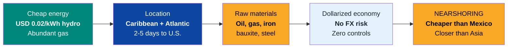
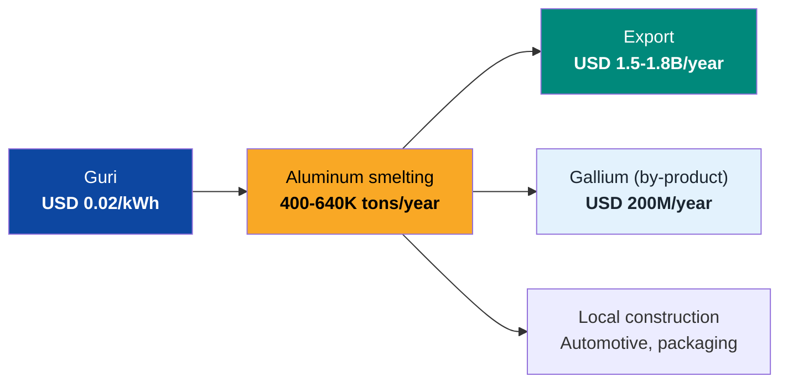
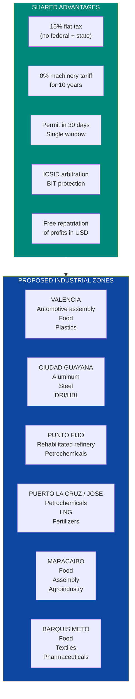
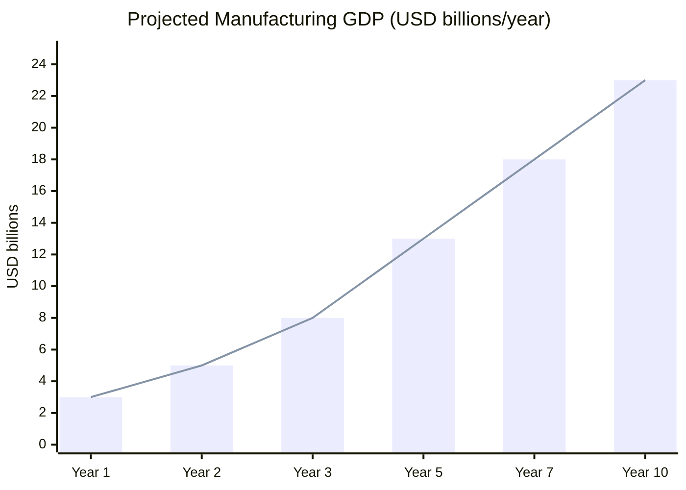

# Manufacturing & Industrial Zones: Reviving LATAM's Factory

> Venezuela assembled Toyota, Ford, and GM vehicles. Processed food for Nestle and PepsiCo. Smelted aluminum with the cheapest electricity in the hemisphere. Produced petrochemicals with subsidized gas. All of that disappeared. Today it imports even flour. But the competitive advantages that made that industry possible are still there: **cheap energy, abundant oil and gas, privileged geographic location, and a dollarized economy**. What's missing is the institutional framework for capital to return.

---

## 1. The Opportunity: USD 5-15B/Year and 300K-500K Jobs

:::danger Total industrial destruction
Venezuela lost **90%+ of its industrial capacity** between 2007 and 2025. Expropriations, exchange controls, price controls, legal insecurity, and talent flight destroyed a sector that represented **15-18% of GDP** in the 1990s. Today it's **<5% of a GDP that already collapsed 80%**. Per capita manufacturing output is the lowest in South America.
:::

| Data Point | Pre-crisis (2000s) | Current (2025) | Target (Year 10) | Source |
|------|-------------------|---------------|----------------|--------|
| Manufacturing GDP | ~USD 25,000 M | **<USD 3,000 M** | USD 15-25,000 M | [Requires research] |
| % of GDP | 15-18% | <5% | 10-12% | [Requires research] |
| Manufacturing jobs | ~600,000 | **<100,000** | 300,000-500,000 | [Requires research] |
| Vehicles assembled/year | ~170,000 (2007) | **~0** | 50,000-100,000 | [Requires research] |
| Aluminum produced (tons/year) | ~640,000 (2000s) | **<30,000** | 400,000-640,000 | [USGS](https://www.usgs.gov/) |
| Steel produced (tons/year) | ~4,300,000 | **<500,000** | 3,000,000-5,000,000 | [Global Energy Monitor](https://www.gem.wiki/CVG_Ferrominera_Orinoco_DRI_plant) |

**Plain language:** Venezuela had a manufacturing base comparable to Colombia or Peru. Today it produces less than Honduras. Reconstruction doesn't start from zero — it starts from rehabilitating capacity that already existed, with the same competitive advantages that made it viable.

### The competitive advantage that's still there

| Advantage | Venezuela | Mexico | Vietnam | Morocco |
|---------|-----------|--------|---------|-----------|
| Industrial electricity cost | **USD 0.02-0.04/kWh** | USD 0.07-0.10 | USD 0.06-0.08 | USD 0.08-0.12 |
| Distance to U.S. (by sea) | **2-5 days** | 1-3 days | 25-30 days | 10-15 days |
| Natural gas | **Abundant and cheap** | Imports from U.S. | Imports LNG | Imports |
| Local iron/steel | **Yes (CVG)** | Imports | Imports | Imports |
| Local aluminum | **Yes (Guri power)** | No | No | No |
| Currency | **USD (dollarized)** | MXN (volatile) | VND (controlled) | MAD |
| Monthly minimum wage | ~USD 5-10 (current) | ~USD 450 | ~USD 250 | ~USD 300 |
| Legal framework for investors | **Under reconstruction** | Solid | Solid | Solid |

Sources: electricity costs — [IEA](https://www.iea.org/), [Global Energy Monitor](https://globalenergymonitor.org/); maritime distances — [SeaRates](https://www.searates.com/).

:::tip Nearshoring: a closing window
Nearshoring is redirecting USD 35-50B/year in manufacturing investment from China to the Americas. Mexico captures 60%+ of that flow. But Mexico already has problems: rising wages, expensive energy, saturated infrastructure, regulatory uncertainty. Venezuela offers **electricity 3-5x cheaper, abundant gas, local raw materials, and a dollarized economy**. If it establishes the right institutional framework, it can capture **10-20% of regional nearshoring** — [Requires research: exact LATAM nearshoring figures].
:::

---

## 2. Manufacturing Sectors with Greatest Potential

### 2.1 Aluminum: the crown jewel

Venezuela was the **8th largest aluminum producer in the world** and the largest in LATAM. The reason: Guri produces electricity at USD 0.02/kWh and aluminum smelting is **the most electricity-intensive process** in industry.

| Data Point | Pre-crisis | Current | Year 10 Target | Source |
|------|-----------|--------|-------------|--------|
| Aluminum production | **640,000 tons/year** | <30,000 tons/year | 400,000-640,000 tons/year | [USGS](https://www.usgs.gov/) |
| Plants | CVG Alcasa + CVG Venalum | Both at 5-10% | Rehabilitated with JV | [Requires research] |
| Aluminum price (2025) | — | **USD 2,400-2,800/ton** | — | [LME](https://www.lme.com/) |
| Potential revenue (640K tons) | — | — | **USD 1,500-1,800M/year** | Own calculation |
| Electricity cost vs. competition | **USD 0.02/kWh** | — | — | Guri (no one in the hemisphere competes) |
| Direct employment | ~12,000 | ~1,500 | 10,000-15,000 | [Requires research] |

**The pitch:** "We're the only place in the Americas where smelting aluminum is economically competitive with China. The difference is that our electricity is hydroelectric (zero Scope 2 emissions), not coal. For a European buyer under CBAM, Venezuelan aluminum is worth **USD 200-400/ton more** than Chinese aluminum."

### 2.2 Automotive assembly

Venezuela assembled vehicles for Toyota, GM, Ford, Chrysler, Mitsubishi, and Hyundai until 2014-2016. The plants are closed but basic infrastructure exists.

| Data Point | Pre-crisis | Current | Year 10 Target | Source |
|------|-----------|--------|-------------|--------|
| Vehicles assembled/year | **170,000** (2007) | **~0** | 50,000-100,000 | [Requires research] |
| Brands present | Toyota, GM, Ford, Chrysler, Mitsubishi, Hyundai | None active | 3-5 brands | [Requires research] |
| Existing plants | Valencia, Barcelona, Mariara | Closed/abandoned | Rehabilitated | [Requires research] |
| Historical direct employment | ~40,000 | ~0 | 15,000-30,000 | [Requires research] |

**Opportunity:** Assemble for the domestic market (pent-up demand for millions of vehicles) + export to the Caribbean, Central America, and Andes. Toyota and GM already had a presence — re-entry cost is lower than greenfield.

### 2.3 Food processing

| Sub-sector | Potential | Historical Companies | Market |
|-----------|-----------|---------------------|---------|
| **Dairy** | Historical milk production in Barinas, Zulia, Portuguesa | Parmalat, Nestle | Domestic + export |
| **Cereals and flour** | Corn flour (P.A.N.) was a national icon | Polar (local), Cargill | Domestic + diaspora |
| **Chocolate/cocoa** | Venezuelan cocoa is world premium (Chuao, Porcelana) | Local + artisanal | Premium export |
| **Coffee** | Historically an exporter. Today imports coffee | Local | Domestic + export |
| **Beer/beverages** | Polar was the largest brewer. Pepsi/Coca-Cola operated | Polar, PepsiCo, Coca-Cola | Domestic |
| **Meat/poultry** | Historical cattle ranching in Llanos. Poultry production | Local, Cargill | Domestic |
| **Fishing/aquaculture** | 2,800 km of coast + aquaculture potential | [Requires research] | Domestic + export |

**Estimated investment:** USD 3-5B to rehabilitate the industrial food chain. **Potential revenue:** USD 5-10B/year.

### 2.4 Petrochemicals

| Data Point | Pre-crisis | Current | Target | Source |
|------|-----------|--------|------|--------|
| Petrochemical production | ~8 M tons/year | <2 M tons/year | 5-8 M tons/year | [Requires research] |
| Moron Complex | Operational | At 20-30% | Rehabilitated via JV | Pequiven |
| El Tablazo Complex | Operational | Paralyzed | Rehabilitated via JV | Pequiven |
| Jose Complex | Operational | Partial | Expanded | Pequiven |
| Products | Fertilizers, plastics, methanol, olefins | Minimal | Diversified export | — |

**Advantage:** Abundant and cheap natural gas as feedstock. Proximity to U.S. and Caribbean markets. Existing port infrastructure (deteriorated but rehabilitable).

### 2.5 Steel and DRI/HBI

| Data Point | Value | Source |
|------|-------|--------|
| Sidor installed capacity | **4.3 M tons/year** steel | [Global Energy Monitor](https://www.gem.wiki/CVG_Ferrominera_Orinoco_DRI_plant) |
| Current production | <500K tons/year | [Requires research] |
| Iron reserves | **18,000 M tons** (Cerro Bolivar) | USGS |
| Advantage | Cheap gas for DRI + cheap electricity for EAF = **green steel** | — |
| Year 10 production target | 3-5 M tons/year | Own projection |
| Revenue potential | USD 2,500-5,000 M/year | At USD 800-1,000/ton |
| Active JV | Jindal Steel (India) negotiating operations | [MINING.COM](https://www.mining.com/web/indias-jindal-takes-on-operations-at-venezuelas-largest-iron-ore-mill/) |

### 2.6 Pharmaceuticals

| Opportunity | Detail |
|-------------|---------|
| **Domestic demand** | Venezuela imports >90% of medications. Domestic market is USD 1-3B/year |
| **Generic manufacturing** | Plants for antibiotics, analgesics, antiretrovirals, basic vaccines |
| **Model** | India: Cipla, Dr. Reddy's — generics for emerging markets |
| **Advantage** | Cheap labor, captive market, potential Caribbean/Central America export |
| **Investment** | USD 500M-1B for 3-5 plants |
| **Revenue potential** | USD 1-3B/year |

---

## 3. Industrial Zones: Where to Locate Manufacturing

### Framework: ZEETs (Special Economic Zones for Technology)

The ZEETs defined in [Tech Hubs](/05-transformacion/hubs-tech) serve as anchors for manufacturing. Manufacturing is installed **within or adjacent** to the special economic zones, leveraging the same fiscal and legal framework.

### Profile of each zone

| Zone | Location | Anchor Sector | Specific Advantage | Est. Investment | Jobs |
|------|-----------|-------------|-------------------|----------------|---------|
| **Valencia** | Carabobo | Automotive, food, plastics | Existing plants (Toyota, GM, Ford). Most developed industrial corridor | USD 2-5B | 50,000-100,000 |
| **Ciudad Guayana** | Bolivar | Aluminum, steel, DRI/HBI | Guri power USD 0.02/kWh. Local iron. Orinoco River for transport | USD 3-6B | 40,000-80,000 |
| **Punto Fijo** | Falcon | Refinery, petrochemicals | Amuay Refinery (largest in LATAM). Natural port | USD 2-4B | 20,000-40,000 |
| **Puerto La Cruz / Jose** | Anzoategui | Petrochemicals, LNG, fertilizers | Jose Complex. Abundant natural gas. Port | USD 2-4B | 20,000-40,000 |
| **Maracaibo** | Zulia | Food, assembly | Border with Colombia. Cattle and agricultural zone | USD 1-3B | 30,000-50,000 |
| **Barquisimeto** | Lara | Food, textiles, pharmaceuticals | Country's logistics center. Ideal climate for agroindustry | USD 1-2B | 20,000-40,000 |

---

## 4. What Each Actor Provides

| The State provides (regulates) | Venezuela S.A. provides (invests) | Private capital provides (operates) |
|--------------------------|----------------------------------|----------------------------------|
| Special industrial zone designation | Land for industrial parks as equity in JVs | Investment in plants and machinery |
| Fiscal incentives (15% flat, 0% machinery tariff for 10 years) | Base infrastructure (roads, electricity, water) | Working capital and operations |
| Fast-track permits (30 days) | Permits + access to 40M consumer market | Know-how and technology |
| Legal security (BIT, ICSID, anti-expropriation) | Collects royalties and dividends as shareholder | Construction of industrial buildings |
| Physical security (reformed police) | Distributes returns to 40M citizen-shareholders | Employment and training |

---

## 5. Potential Partners

| Company | Country | Sector | Venezuela History | Potential Role |
|---------|------|--------|---------------------|---------------|
| **Toyota** | Japan | Automotive | Operated assembly plant in Cumana until 2014 | Reopen assembly. Massive pent-up demand |
| **GM (General Motors)** | U.S. | Automotive | Plant expropriated in Valencia (2017). Filed suit | Re-entry with compensation + guarantees |
| **Ford** | U.S. | Automotive | Operated in Valencia | Assembly for domestic market + export |
| **Nestle** | Switzerland | Food | Historical presence | Food processing, dairy, cereals |
| **PepsiCo** | U.S. | Food/beverages | Operated via Empresas Polar (bottling) | Beverages, snacks, processing |
| **Cargill** | U.S. | Agroindustry | Present in oils, flour | Grain and oilseed processing |
| **Alcoa** | U.S. | Aluminum | Potential competitor for CVG rehabilitation | JV for aluminum smelting with Guri power |
| **Rio Tinto** | Australia/UK | Aluminum/bauxite | — | JV for bauxite-alumina-aluminum chain |
| **Jindal Steel** | India | Steel | In discussions for CVG Ferrominera | JV for Ferrominera and Sidor operation |
| **SABIC / LyondellBasell** | Saudi Arabia / U.S. | Petrochemicals | — | JV for Pequiven rehabilitation |
| **Bayer / Cipla** | Germany / India | Pharmaceuticals | — | Generic manufacturing plants for LATAM |
| **Empresas Polar** | Venezuela | Food | Largest Venezuelan private company. Partially operating | Anchor of food industry reconstruction |
| **IFC / IDB / CAF** | Multilateral | Financing | — | Credit for industrial infrastructure |

:::info Toyota and GM already know the market
Toyota operated in Venezuela for **more than 30 years**. GM was there for **more than 60 years**. Both left due to expropriations and legal insecurity — not because of lack of market. With ironclad legal guarantees, re-entry is a matter of **conditions, not willingness**. Venezuela has pent-up demand for millions of vehicles and existing plants (abandoned) reduce re-entry cost vs. greenfield.
:::

---

## 6. Business Model

### Structure: Joint Ventures + industrial concessions

| Parameter | Model |
|-----------|--------|
| **JV structure** | Venezuela 20-49% (via sovereign fund or public entity) + international operator 51-80% |
| **Corporate tax** | 15% flat |
| **Machinery import tariff** | 0% for 10 years |
| **Profit repatriation** | 100% free in USD |
| **Concession** | 25-50 years renewable |
| **Local employment requirement** | Minimum 70% Venezuelan workforce |
| **Local processing** | Additional fiscal incentive for value-added in Venezuela |
| **Arbitration** | Mandatory ICSID. BIT with investor's home country |

### Revenue projection by sector

| Sector | Total Est. Investment | Year 10 Revenue (USD M/year) | Direct Jobs |
|--------|---------------------|---------------------------|------------------|
| **Aluminum** | USD 2,000-4,000 M | 1,500-1,800 | 10,000-15,000 |
| **Steel / DRI / HBI** | USD 2,000-3,000 M | 2,500-5,000 | 15,000-25,000 |
| **Automotive** | USD 1,500-3,000 M | 2,000-5,000 | 15,000-30,000 |
| **Food** | USD 3,000-5,000 M | 5,000-10,000 | 80,000-120,000 |
| **Petrochemicals** | USD 2,000-4,000 M | 3,000-5,000 | 10,000-20,000 |
| **Pharmaceuticals** | USD 500-1,000 M | 1,000-3,000 | 5,000-10,000 |
| **Other (textiles, plastics, ceramics)** | USD 1,000-2,000 M | 1,000-3,000 | 30,000-50,000 |
| **TOTAL** | **USD 12,000-22,000 M** | **USD 16,000-32,800 M** | **165,000-270,000** |

:::caution Note on employment
The 165K-270K direct jobs generate **2-3x in indirect jobs** (suppliers, services, transport, commerce). Total including indirect: **500K-800K jobs**. Manufacturing is the second-largest job generator after construction.
:::

---

## 7. Nearshoring: Why Venezuela Can Compete with Mexico

### The global context

The U.S.-China trade war is redirecting supply chains to the Americas. Mexico captures most of it, but has growing limitations:

| Factor | Mexico | Venezuela (potential) |
|--------|--------|----------------------|
| Average manufacturing wage | **~USD 450/month** (and rising fast) | ~USD 100-200/month (will grow with recovery) |
| Industrial electricity | USD 0.07-0.10/kWh | **USD 0.02-0.04/kWh** |
| Natural gas | Imports from U.S. via pipeline | **Produces 5,500 BCM own reserves** |
| Available industrial land | Saturated in the north (Monterrey, Juarez) | **Ample, cheap** |
| USMCA / trade agreements | **Yes (USMCA with U.S./Canada)** | No (requires negotiation) |
| Insecurity | Cartels in industrial zones | Worse now, but improvable with reform |
| Regulatory risk | Growing (judicial, energy reform) | **Under reconstruction (regulatory greenfield)** |

**The opportunity:** Venezuela doesn't replace Mexico — it complements it. For sectors requiring **energy-intensive** manufacturing (aluminum, steel, petrochemicals, data centers), Venezuela is unbeatable. For sectors requiring **proximity and USMCA** (automotive export to U.S.), Mexico remains better. The key is positioning Venezuela as the **energy-intensive manufacturing** hub of the Americas.

:::info Trade agreement with U.S.: the accelerator
A **trade preferences agreement** (type ATPA/ATPDEA that existed with the Andes) or inclusion in a nearshoring scheme would eliminate tariffs for Venezuelan manufactures exported to the U.S. Given that the U.S. already controls Venezuelan oil sales and has strategic interest in critical minerals, a trade agreement is negotiable — [Requires research: status of trade negotiations].
:::

---

## 8. Required Infrastructure

| Component | What's Needed | Est. Cost | Provider | Synergy |
|-----------|----------------|------------|-----------------|----------|
| **Reliable electricity** | Guri rehabilitation + transmission to industrial zones | Included in [Electrical Capacity](./capacidad-electrica) | Siemens, ABB, GE | Data centers, mining |
| **Ports** | Rehabilitation of Puerto Cabello, La Guaira, Puerto La Cruz, Maracaibo | USD 2-4B | APM Terminals, DP World, Hutchison | Foreign trade |
| **Roads** | Highway rehabilitation + new roads to industrial zones | USD 3-5B | VINCI, ACS, construction firms | Tourism, trade |
| **Natural gas** | Gas pipeline to industrial zones + gas plants | USD 1-2B | Chevron, Shell, Repsol | Petrochemicals, electricity |
| **Industrial water** | Treatment plants for industrial processes | USD 500M-1B | Veolia, Suez | Municipalities |
| **Telecoms / fiber** | High-speed connectivity to industrial zones | USD 500M-1B | Ericsson, Nokia | Data centers, digital state |
| **Railroad** | Rehabilitation of Ciudad Guayana-Puerto Ordaz train + new lines | USD 2-4B | CRRC (China), Alstom | Mining, transport |
| **TOTAL** | | **USD 10-17B** | | |

---

## 9. International Comparables

| Country | Model | What Worked | Result | Lesson for Venezuela |
|------|--------|-------------|-----------|------------------------|
| **Mexico (maquiladoras)** | Tariff-free zones on northern border. Temporary tax exemption. Cheap labor | Preferential U.S. access (USMCA). Proximity. Scale | **USD 500B+ in manufacturing exports/year**. 2.7M maquila jobs | The fiscal framework and market access matter more than labor cost. Venezuela needs a trade agreement with the U.S. |
| **Vietnam** | From agrarian economy to manufacturing hub in 20 years. Samsung, Intel, Nike, Foxconn | Special economic zones. Low wages. Political stability. Trade agreements (CPTPP, EVFTA) | **GDP x10 in 20 years**. USD 400B in exports. 18M industrial jobs | Rapid transformation is possible with the right framework. Vietnam had no natural advantages — just consistent industrial policy |
| **Morocco (automotive hub)** | Free zones (Tanger Med). Renault and PSA assembling for Europe. 0% tariffs to EU | Proximity to Europe. World-class port. Skilled labor at low cost | **700,000 vehicles/year**. USD 14B automotive exports | Rehabilitated port + free zone + OEM anchor = automotive cluster. Valencia can replicate for the Americas market |
| **Rwanda (light manufacturing)** | From genocide to middle-class economy in 25 years. "Made in Rwanda" | Digital infrastructure, talent development, local manufacturing incentives | GDP growth 7-8%/year sustained | A country can rebuild manufacturing from scratch with political will and the right framework |

Sources: [WTO Trade Statistics](https://www.wto.org/english/res_e/statis_e/statis_e.htm); [Vietnam Manufacturing Boom — McKinsey](https://www.mckinsey.com/featured-insights/asia-pacific/vietnams-manufacturing-miracle); [Morocco Automotive — AMDI](https://www.morocconow.com/).

---

## 10. Risks and Mitigations

| Risk | Probability | Impact | Mitigation |
|--------|-------------|---------|-----------|
| **Companies won't enter due to expropriation memories** | High | Critical | Constitutional anti-expropriation law. ICSID. BIT. Compensation of past expropriations (GM, Holcim, Lafarge, Sidor). JV structure with private majority |
| **No trade agreement with U.S.** | Medium | High | Manufacturing for domestic market first (30M consumers). Negotiate ATPA-type preferences. Agreements with Caribbean, Andes, EU |
| **Unskilled labor** | High | High | Accelerated training programs (6-18 months). Repatriation of emigrated technicians. Permits for foreign technicians |
| **Insufficient infrastructure** (ports, roads, electricity) | High | High | Infrastructure investments in parallel. Prioritize zones with best existing infrastructure (Valencia, Puerto La Cruz) |
| **Competition from Mexico and Vietnam** | High | Medium | Don't compete on everything — focus on **energy-intensive manufacturing** where Venezuela has an unmatched advantage |
| **Dutch Disease** | Medium | High | Fiscal model that separates oil from the budget. Uncontrolled exchange rate. See [Dutch Disease](/02-motor-financiero/enfermedad-holandesa) |
| **Corruption in concessions** | High | High | Transparent international tenders. Big 4 auditing. Multilateral oversight |
| **Destructive unionism** | Medium | Medium | Modern labor law (not the 2012 LOT). Hiring flexibility. Continuous training |

---

## 11. Financial Projection (10 Years)

| Indicator | Year 1 | Year 3 | Year 5 | Year 10 |
|-----------|-------|-------|-------|--------|
| **Manufacturing GDP (USD B)** | 3 | 8 | 13 | 20-25 |
| **% of total GDP** | 3% | 6% | 8% | 10-12% |
| **Direct jobs** | 120,000 | 200,000 | 300,000 | 400,000-500,000 |
| **Total jobs (direct + indirect)** | 250,000 | 450,000 | 700,000 | 1,000,000-1,500,000 |
| **Manufacturing exports (USD B)** | 0.5 | 2 | 5 | 10-15 |
| **Vehicles assembled** | 5,000 | 20,000 | 50,000 | 100,000 |
| **Aluminum (K tons/year)** | 50 | 200 | 400 | 640 |
| **Steel (M tons/year)** | 1 | 2 | 3 | 5 |
| **Cumulative investment (USD B)** | 2 | 8 | 15 | 25-30 |

### Contribution to the Venezuela S.A. plan

| Metric | Value |
|---------|-------|
| **Annual manufacturing revenue (year 10)** | USD 15-25B |
| **% of target GDP** | 10-12% |
| **Direct jobs** | 400K-500K |
| **Exports** | USD 10-15B/year |
| **Fiscal contribution** | USD 2-4B/year (15% flat + VAT) |
| **Anchor sectors** | Aluminum, steel, automotive, food, petrochemicals |
| **Differentiating advantage** | Cheapest energy in the hemisphere + local raw materials |

:::tip Manufacturing + construction = full employment
Construction generates **750K-1.2M jobs**. Manufacturing generates **400K-500K direct + 600K-1M indirect**. Together, these two sectors absorb **2-3 million workers** — enough to reduce real unemployment from 40-50% to **<10%** in 10 years. No social program competes with that.
:::

---

## Related Documents

- [Electrical Capacity](./capacidad-electrica) — Reliable and cheap electricity as a competitive advantage for manufacturing
- [Critical Minerals](./minerales-criticos) — Iron, aluminum, and raw materials for heavy manufacturing
- [Roads & Logistics](./vialidad-logistica) — Ports and roads for manufactured product exports
- [Maritime Transport](./transporte-maritimo) — Cargo ports for manufacturing foreign trade
- [Construction & Real Estate](./construccion-inmobiliaria) — Construction materials as a key manufacturing vertical
- [Agriculture & Livestock](./agro-ganaderia) — Agroindustry and food processing as a manufacturing vertical
- [Concession Model](./modelo-concesiones) — Concession framework for industrial zones (ISO 9001/14001/45001)

---

## Sources

| # | Source | Data Used |
|---|--------|---------------|
| 1 | [USGS — Aluminum Statistics](https://www.usgs.gov/) | Historical Venezuela aluminum production |
| 2 | [Global Energy Monitor — CVG Ferrominera](https://www.gem.wiki/CVG_Ferrominera_Orinoco_DRI_plant) | Steel/iron capacity |
| 3 | [MINING.COM — Jindal in Venezuela](https://www.mining.com/web/indias-jindal-takes-on-operations-at-venezuelas-largest-iron-ore-mill/) | Jindal-Ferrominera JV |
| 4 | [IEA — Energy Prices](https://www.iea.org/) | Compared electricity costs |
| 5 | [LME — Aluminium](https://www.lme.com/) | Aluminum prices |
| 6 | [McKinsey — Vietnam Manufacturing](https://www.mckinsey.com/featured-insights/asia-pacific/vietnams-manufacturing-miracle) | Vietnam model |
| 7 | [WTO — Trade Statistics](https://www.wto.org/english/res_e/statis_e/statis_e.htm) | Mexico and Vietnam exports |
| 8 | [Morocco Automotive — AMDI](https://www.morocconow.com/) | Morocco automotive hub |
| 9 | Current Venezuela manufacturing production | [Requires research: updated data] |
| 10 | Automotive plant status | [Requires research] |
| 11 | Current petrochemical production | [Requires research] |
| 12 | LATAM nearshoring flows | [Requires research: exact figures] |
