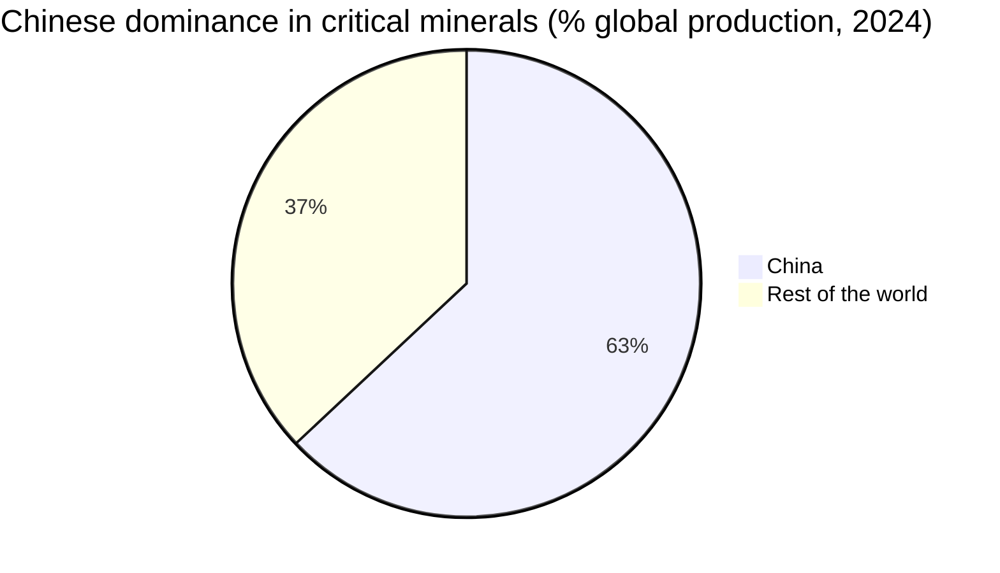
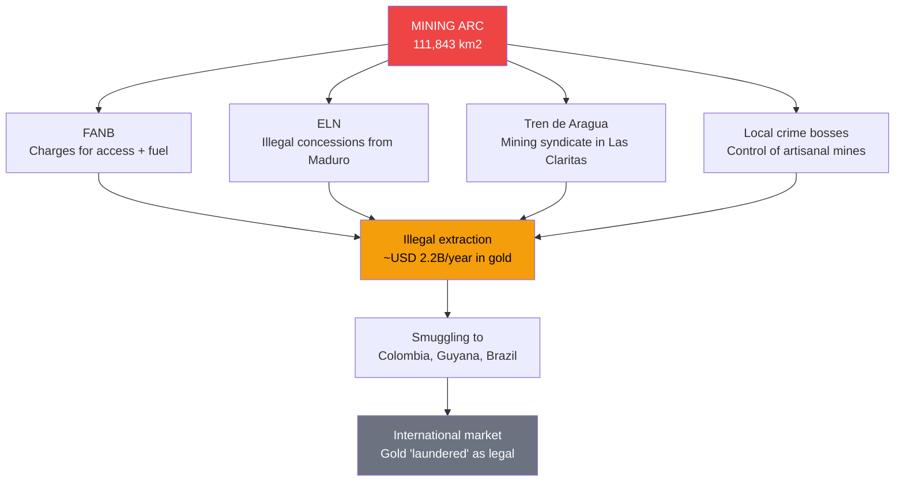
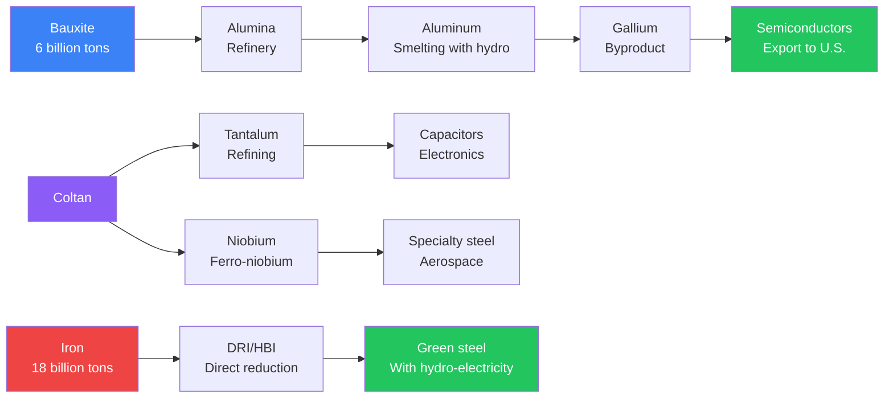
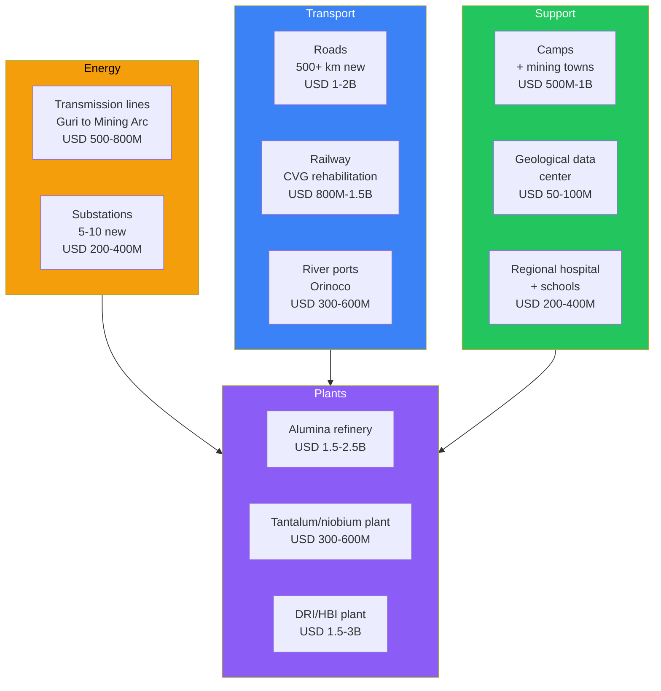
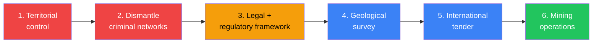
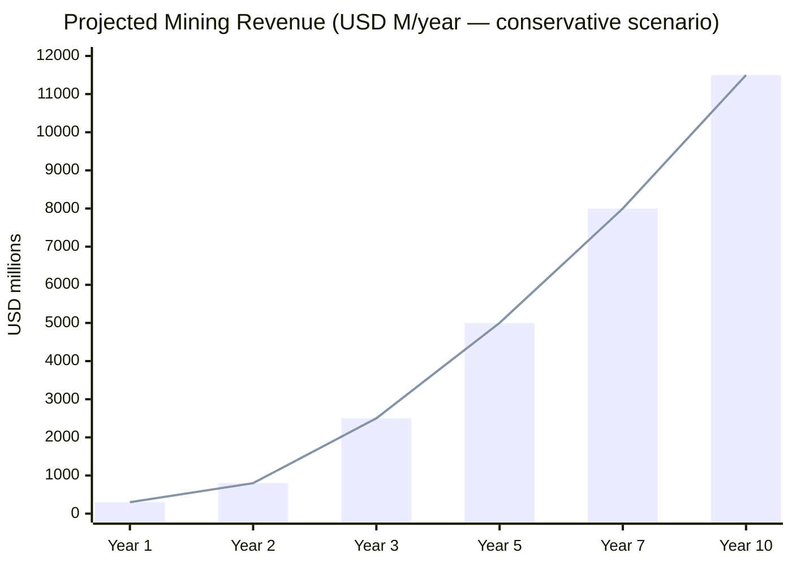
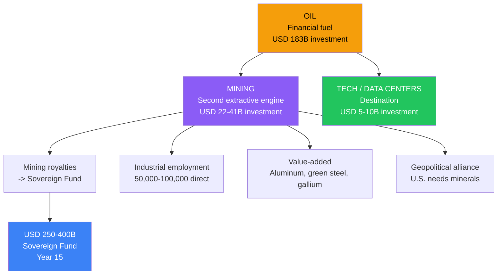

# Critical Minerals: The Other Gold Mine

> Venezuela has beneath its feet what the world needs for the energy transition. The problem is not geology — it is governance.

:::danger Reality as of 2026
- The [Orinoco Mining Arc](https://en.wikipedia.org/wiki/Orinoco_Mining_Arc) is **12% of the national territory** — the size of Portugal
- Armed groups (ELN, Tren de Aragua) and the FANB control the mining zones — [International Crisis Group, 2024](https://www.crisisgroup.org/brf/latin-america-caribbean/andes/venezuela/b53-curse-gold-mining-and-violence-venezuelas-south)
- **Zero industrial mining** of coltan, rare earths, or processed bauxite
- Massive environmental devastation from illegal mining — mercury in rivers, deforestation
- Reserves are **NOT independently verified** (JORC/NI 43-101)
- The U.S. already has delegations in Venezuela discussing critical minerals — [US News, Mar. 2026](https://www.usnews.com/news/us/articles/2026-03-04/us-interior-secretary-is-in-venezuela-to-discuss-critical-minerals)
:::

---

## 1. The Opportunity: USD 328B Global Market

The global critical minerals market reached **USD 328 billion in 2024** and is projected to reach **USD 587 billion by 2032** (CAGR 7.5%) — [DataM Intelligence](https://www.datamintelligence.com/research-report/critical-minerals-market). Demand for clean technologies will **quadruple by 2040**, reaching ~40 million tons annually — [IEA Global Critical Minerals Outlook 2025](https://www.iea.org/reports/global-critical-minerals-outlook-2025).

Venezuela has confirmed or probable deposits of **at least 6 minerals** that appear on the USGS 2025 critical minerals list.

### Venezuela's Mineral Inventory

| Mineral | Estimated Reserve | Current Production | Historical Max. Production | Status | Source |
|---------|------------------|--------------------|-----------------------------|--------|--------|
| **Gold** | ~7,000 tons (government) | ~480 kg formal (2021) + ~75 tons illegal/year | N/A | Controlled by armed groups | [State Dept., Jun. 2025](https://www.state.gov/wp-content/uploads/2025/11/2025-Report-to-Congress-on-the-State-Sponsored-Extraction-and-Sale-of-Gold-from-Venezuelas-Orin.pdf) |
| **Iron** | 18 billion tons (Cerro Bolivar) | ~4.3M tons/year (2025) | 20+ M tons/year | CVG Ferrominera at 10-20% capacity | [Global Energy Monitor](https://www.gem.wiki/CVG_Ferrominera_Orinoco_DRI_plant) |
| **Bauxite** | 570M tons proven (Los Pijiguaos) + **6 billion tons probable** in the region | Suspended/minimal | 5+ M tons/year | CVG Bauxilum paralyzed | [CSIS, Jan. 2026](https://www.csis.org/analysis/venezuela-critical-minerals-target) |
| **Coltan** (tantalum/niobium) | ~USD 100 billion estimated (not verified) | Zero industrial | N/A | No modern exploration | [Mongabay, 2016](https://news.mongabay.com/2016/10/thirst-for-coltan-gold-threatens-venezuelan-forests-indigenous-lands/) |
| **Diamonds** | 3 billion carats (government) | Minimal artisanal | N/A | Smuggling to Guyana/Brazil | Government of Venezuela |
| **Gallium** (bauxite byproduct) | Depends on aluminum production | Zero | N/A | Potential if aluminum is reactivated | [CSIS](https://www.csis.org/analysis/beyond-rare-earths-chinas-growing-threat-gallium-supply-chains) |
| **Rare earths** | ~300,000 tons (government, **NOT verified by USGS**) | Zero | N/A | Hypothetical — requires exploration | [Rare Earth Exchanges](https://rareearthexchanges.com/news/a-jungle-of-minerals-politics-and-unanswered-questions/) |

:::caution Reserve Verification
Venezuelan government reserve figures (especially gold, coltan, rare earths, and diamonds) **do NOT meet JORC/NI 43-101 standards**. They are not "bankable reserves" — they are political estimates. The first step of any serious operation is a **modern independent geological survey**. The last USGS assessment of Venezuela dates from the 1990s.
:::

### Geopolitical Context: The War for Minerals

| Mineral | Chinese Dominance | Key Application | Venezuela Alternative |
|---------|------------------|-----------------|----------------------|
| **Rare earths** | 70% production, 90% processing | EV motors, wind turbines, defense | Unverified potential |
| **Gallium** | **98% production** | Semiconductors (GaN, GaAs), 5G, radar | Byproduct of Venezuelan bauxite |
| **Tantalum** (coltan) | 40% processing | Capacitors, smartphones, missiles | Confirmed deposits (not quantified) |
| **Niobium** | 10% (Brazil dominates with 90%) | High-strength steel, superconductors | Deposits associated with coltan |
| **Aluminum** | 57% production | Transport, construction, packaging | Installed capacity 640K tons/year |

**Geopolitical translation:** China controls **98% of the world's gallium**. In December 2024, it [banned gallium exports to the U.S.](https://www.csis.org/analysis/beyond-rare-earths-chinas-growing-threat-gallium-supply-chains) Gallium is extracted as a byproduct of **bauxite -> aluminum** refining. Venezuela has **6 billion tons of bauxite** and cheap hydroelectric power for smelting. The equation is obvious.

:::info Project Vault — The U.S. is already moving
In February 2026, the U.S. launched **Project Vault**: a [critical minerals stockpile worth USD 12 billion](https://www.latitudemedia.com/news/white-house-private-sector-closely-looking-at-venezuelan-critical-minerals/). In March 2026, Interior Secretary **Doug Burgum visited Venezuela** with representatives from **more than 24 U.S. mining companies** — [US News](https://www.usnews.com/news/us/articles/2026-03-04/us-interior-secretary-is-in-venezuela-to-discuss-critical-minerals). The window is open. The question is whether Venezuela can offer the conditions to capture it.
:::

---

## 2. The Problem: Why We Produce Nothing

Venezuela has spent **decades boasting** about mineral wealth without building a single world-class mining operation. The reasons are structural:

### 2.1 Criminal Control of Mining Zones

| Actor | Role in Illegal Mining | Source |
|-------|----------------------|--------|
| **FANB** | Charges criminals for access; provides fuel and logistics | [Mongabay, Oct. 2025](https://news.mongabay.com/2025/10/amid-venezuelas-illegal-gold-heist-are-armed-groups-gangs-elites-report-says/) |
| **ELN** (Colombian guerrilla) | Controls concessions within the Mining Arc | [International Crisis Group](https://www.crisisgroup.org/brf/latin-america-caribbean/andes/venezuela/b53-curse-gold-mining-and-violence-venezuelas-south) |
| **Tren de Aragua** | Operates as mining syndicate in Bolivar | [InSight Crime](https://insightcrime.org/venezuela-organized-crime-news/tren-de-aragua/) |
| **State (Maduro)** | Created the Mining Arc in 2016 to generate revenue outside sanctions | [Dialogo Americas](https://dialogo-americas.com/articles/the-mining-arc-the-silent-operation-that-sustains-the-maduro-regime/) |

### 2.2 Collapsed Infrastructure

| Infrastructure | Status | Need |
|----------------|--------|------|
| **CVG Ferrominera** | Operating at 10-20% capacity (25M ton installed) | Equipment, railway, power supply |
| **CVG Bauxilum** | Operations suspended | Stable electricity from Guri |
| **CVG Alcasa/Venalum** | Aluminum smelters at 10-15% | Electricity + modernization |
| **Roads to the Mining Arc** | Non-existent or destroyed | Road network from Ciudad Guayana |
| **Transmission lines** | Down from Guri southward | Complete reconstruction |
| **River ports** | Degraded | Orinoco rehabilitation as cargo route |

### 2.3 Zero Modern Geological Data

- The last comprehensive USGS assessment of Venezuela dates from the **1990s**
- No modern airborne electromagnetic surveys exist (VTEM, ZTEM)
- No exploratory drilling data for coltan or rare earths
- "Reserves" cited by the government are **political estimates, not geological ones**
- Without JORC/NI 43-101 data, **no institutional investor will commit capital**

### 2.4 Environmental Devastation

- **Mercury** contamination in Caroni and Orinoco rivers
- Deforestation of **>12,000 km2** in the Mining Arc
- **Indigenous communities** (Pemon, Ye'kwana, Sanema) displaced
- Summary executions and forced child labor — [Human Rights Watch](https://www.hrw.org/news/2022/04/29/venezuelan-tainted-gold)
- Venezuela is **ineligible for Fairmined or responsible supply chains** in its current state

---

## 3. The Solution: Responsible Mining with International Standards

### Guiding Principle

> Mining is the SECOND extractive engine — not the first. Oil finances the transition. Mining is done RIGHT or not at all. Zero mining without territorial control, legal framework, and ESG standards.

### Phase 1: Exploration and Security (Year 1-2)

| Action | Estimated Cost | Responsible | Deliverable |
|--------|---------------|-------------|-------------|
| **National geological survey** with USGS + private firms (airborne + ground) | USD 200-500M | JV USGS + consultants (SRK, Hatch) | JORC/NI 43-101 geological map of the Mining Arc |
| **Territorial control of the Mining Arc** | Included in security budget | Reformed police force + [DDR](/04-gobernanza/seguridad-fisica) | Dismantling of illegal operations |
| **Mining code reform** | USD 5-10M (international legal advisory) | Government + IFC | Mining law compatible with EITI + IRMA standards |
| **Baseline environmental assessment** | USD 50-100M | International environmental consultants | Baseline for mercury contamination, deforestation, water |
| **Indigenous consultation (FPIC)** | USD 10-20M | ILO + indigenous communities | Free, Prior, and Informed Consent |
| **Specialized mining police** | USD 30-50M (equipment + training) | Georgia Model -> [Physical Security](/04-gobernanza/seguridad-fisica) | Dedicated anti-illegal-mining force |

**Phase 1 Investment: USD 300-700M**

:::tip Botswana Model: security + transparency = investor confidence
Botswana turned diamonds into development with a simple model: **50% government / 50% De Beers** in Debswana, with the government sitting on De Beers' board. Result: GDP per capita from USD 600 (1966) to USD 8,000+ (2024). The secret was not geology — it was **governance** — [IMF, 2018](https://www.imf.org/en/News/Articles/2018/09/05/na090518Botswana).
:::

### Phase 2: Pilot Operations (Year 2-5)

| Operation | Model | Investment | Production Target | Estimated Revenue |
|-----------|-------|-----------|-------------------|-------------------|
| **Iron: CVG Ferrominera reactivation** | JV with Jindal Steel (already in talks) | USD 2-3B | 15-20M tons/year | USD 1.5-3B/year |
| **Bauxite: Los Pijiguaos + Bauxilum reactivation** | JV with Rio Tinto or Alcoa | USD 1.5-2.5B | 5-8M tons/year bauxite | USD 500M-1B/year |
| **Aluminum: Smelter rehabilitation (Alcasa/Venalum)** | JV with international operator | USD 2-4B | 400-640K tons/year aluminum | USD 1-1.7B/year |
| **Gold: Artisanal mining formalization** | Colombia CRAFT + Fairmined model | USD 500M-1B | 30-50 tons/year (legal) | USD 4.5-7.5B/year |
| **Coltan: Exploration + industrial pilot** | JV with specialized company | USD 300-800M | Depends on survey | [Requires research] |

**Phase 2 Investment: USD 6.3-11.3B**

### Phase 3: Scale and Value-Added (Year 5-15)

| Value-Added Product | Investment | Venezuela's Competitive Advantage | Target Market |
|---------------------|-----------|-----------------------------------|---------------|
| **Primary aluminum** (smelted with hydroelectric) | USD 2-4B | Electricity at **<USD 0.02/kWh** — cheapest in the hemisphere | Global (USD 175B/year) |
| **Gallium** (extracted from alumina) | USD 100-300M | Only potential hemispheric producer; China produces 98% | U.S., Europe, Japan, Korea |
| **Ferro-niobium** | USD 500M-1B | Compete with CBMM (Brazil, 90% of market) | Global high-strength steel |
| **Refined tantalum** | USD 300-600M | Alternative to DRC (conflict) and Rwanda | Electronics, defense, aerospace |
| **DRI/HBI** (direct reduced iron) | USD 1.5-3B | Natural gas + iron + cheap energy | Global steelmakers (decarbonization) |
| **Green steel** (hydro-powered) | USD 3-5B | Zero Scope 2 emissions with Guri | Europe (CBAM), U.S. |

**Phase 3 Investment: USD 7.4-13.9B**

---

## 4. Required Infrastructure

| Category | Estimated Investment | Priority | Synergy with Other Sectors |
|----------|---------------------|----------|---------------------------|
| **Energy** (transmission from Guri) | USD 700M-1.2B | Critical | Data centers, aluminum, steel |
| **Transport** (roads, railway, ports) | USD 2.1-4.1B | Critical | Tourism (Canaima), trade |
| **Processing plants** | USD 3.3-6.1B | High | Industrial employment, exports |
| **Social infrastructure** | USD 750M-1.5B | High | Local communities, talent retention |
| **Total infrastructure** | **USD 6.85-12.9B** | — | — |

:::info Synergy with data centers
Investment in electrical transmission from Guri benefits **simultaneously** the Ciudad Guayana data center corridor and mining operations. It is the same infrastructure for two diversification engines. See [Tech Hubs](/05-transformacion/hubs-tech).
:::

---

## 5. Business Model

### Structure: Joint Ventures with International Partners

| Parameter | Proposed Model | Reference |
|-----------|---------------|-----------|
| **Ownership** | Venezuela 51% / International operator 49% | Botswana-De Beers (Debswana) |
| **Operator** | International partner operates under IRMA standards | JV enables technology transfer |
| **Royalties** | 5-8% of gross revenue | LATAM mining royalties average |
| **Corporate tax** | 15% flat (lean State model) | Consistent with fiscal reform |
| **Sovereign fund** | 100% of mining royalties -> sovereign fund | Same as oil |
| **Local processing** | Mandatory for strategic minerals | No exporting unprocessed raw material |
| **Local employment** | Minimum 70% Venezuelan workforce | Training included in JV |
| **Concession duration** | 25-30 years renewable | With audit every 5 years |

### Comparison: Exporting Raw Material vs. Value-Added

| Mineral | Raw Material Price | Processed Price | Multiplier |
|---------|-------------------|-----------------|------------|
| **Bauxite** | USD 90-130/ton | **Aluminum:** USD 2,400-2,800/ton | **~25x** |
| **Bauxite -> Gallium** | USD 90-130/ton | **Gallium:** USD 725/kg | **~5,000x** |
| **Iron** | USD 100-130/ton | **DRI/HBI:** USD 400-600/ton | **~4x** |
| **Iron** | USD 100-130/ton | **Green steel:** USD 800-1,200/ton | **~8x** |
| **Coltan (raw)** | USD 30-60/kg | **Refined tantalum:** USD 500/kg | **~10x** |

:::danger Inviolable rule: ZERO export of unprocessed raw material
Venezuela CANNOT repeat the oil mistake: selling crude at USD 60 when a refined barrel is worth USD 120. Every ton of bauxite exported unprocessed is **25x of destroyed value**. The business model demands local processing — Guri's cheap electricity is the advantage that makes it viable.
:::

---

## 6. Security: A Prerequisite, Not an Afterthought

### Mandatory Sequence

**There is no responsible mining without security first.** This is non-negotiable.

| Security Component | Reference Model | Application in Venezuela |
|-------------------|-----------------|--------------------------|
| **Dedicated mining police** | [Georgia: 15,000 police fired, crime -66%](https://successfulsocieties.princeton.edu/sites/g/files/toruqf5601/files/Policy_Note_ID126.pdf) | Specialized anti-illegal-mining force, recruited and trained from scratch |
| **DDR for armed groups** | Post-FARC Colombia: [CRAFT Code for transition](https://www.responsiblemines.org/en/2026/02/craft-as-a-transition-mechanism-for-mining-formalization-in-colombia/) | Disarmament, demobilization, reintegration of illegal miners as formal workforce |
| **Perimeter control** | Botswana Diamonds: exclusion zone + patrols | Security perimeter around concessions with technology (drones, sensors) |
| **Mineral traceability** | Kimberley Process (diamonds) + LBMA (gold) | Blockchain + origin certification for all exported minerals |
| **Artisanal formalization** | Colombia: 15-20% of gold is legal, rest informal — [ColombiaOne](https://colombiaone.com/2025/04/19/mining-colombia/) | Transition program: artisanal miners -> formal cooperatives with technical assistance |

:::caution Lesson from the 2016 Mining Arc: security BEFORE concessions
Maduro created the Mining Arc in 2016 with concession decrees to Chinese, Russian, and local companies — **without prior territorial control**. Result: armed groups took over the concessions. [CSIS concludes](https://www.csis.org/analysis/venezuela-critical-minerals-target): "Venezuela's mining sector could attract Western investment **only after** durable political, legal, and security reforms fundamentally alter the risk landscape."
:::

---

## 7. Sustainability and ESG

### Environmental Remediation: Debt Before Investment

| Environmental Problem | Scale | Remediation Cost | Timeline |
|----------------------|-------|------------------|----------|
| **Mercury contamination** | Caroni, Paragua, Cuyuni rivers | USD 500M-1B | 5-10 years |
| **Deforestation** | >12,000 km2 in the Mining Arc | USD 300-600M (reforestation) | 10-20 years |
| **Aquifer contamination** | Multiple basins in Bolivar/Amazonas | USD 200-400M | 5-15 years |
| **Indigenous displacement** | Pemon, Ye'kwana, Sanema, Mapoyo | Restitution program + FPIC | Ongoing |

**Total remediation: USD 1-2B** — partially funded by mining royalties.

### Mandatory Certifications

| Standard | What It Covers | Why It Matters |
|----------|---------------|----------------|
| **[IRMA](https://responsiblemining.net/)** (Initiative for Responsible Mining Assurance) | 420+ requirements: social, environmental, governance | Only independent multi-stakeholder standard; v2.0 in development (2025) |
| **[EITI](https://eiti.org/)** (Extractive Industries Transparency Initiative) | Extractive revenue transparency | Requirement for international credibility |
| **FPIC** (Free, Prior, and Informed Consent) | Indigenous peoples' rights | Legal obligation under ILO 169 |
| **[LBMA](https://www.lbma.org.uk/)** (London Bullion Market Association) | Gold chain of custody | Without LBMA, Venezuelan gold cannot enter formal markets |
| **Fairmined** | Responsible artisanal gold certification | 15-30% price premium |

### ESG Competitive Advantage vs. China

| ESG Factor | China in Mining | Venezuela (target) |
|-----------|-----------------|-------------------|
| Scope 2 emissions | Coal (70% of electricity) | **Hydroelectric (90% clean)** |
| Labor rights | Questionable in DRC, Myanmar | IRMA + ILO compliance |
| Transparency | Opaque | EITI + blockchain |
| Indigenous communities | No consultation | Mandatory FPIC |

**The pitch for Western buyers:** "Do you prefer gallium refined with Chinese coal under zero labor standards, or gallium refined with Venezuelan hydroelectric under IRMA certification?" The answer is obvious — if Venezuela offers the conditions.

---

## 8. Potential Partners

| Partner | Interest | Potential Role | Precedent |
|---------|---------|---------------|-----------|
| **US DOD/DOE** | Diversify away from China | DPA (Defense Production Act) financing, guaranteed purchases | [Project Vault USD 12B](https://www.latitudemedia.com/news/white-house-private-sector-closely-looking-at-venezuelan-critical-minerals/) |
| **USGS** | Hemispheric geological data | Geological survey of the Mining Arc | Historical cooperation with Venezuela (1990s) |
| **Rio Tinto** | Global bauxite/aluminum | JV for Los Pijiguaos + smelting | Operates in 35+ countries |
| **BHP** | Critical minerals diversification | Coltan/rare earth exploration | Investments in LATAM (Chile, Peru) |
| **Freeport-McMoRan** | Copper, gold, molybdenum | Operator with experience in difficult markets | Papua New Guinea, Indonesia, DRC |
| **Jindal Steel** | Iron/steel | Already negotiating CVG Ferrominera | [2024 agreement for 600K tons/month](https://www.mining.com/web/indias-jindal-takes-on-operations-at-venezuelas-largest-iron-ore-mill/) |
| **IFC / World Bank** | Mining governance | Financing + technical assistance | Responsible mining in 40+ countries |
| **UNECE** | Resource classification standards | Reserve verification (UNFC) | Global framework |
| **Alcoa** | Global aluminum/bauxite | JV for Bauxilum | Operated in Brazil, Australia |
| **EXIM Bank (U.S.)** | Finance allied supply chains | Preferential loans for JVs | Expanded mandate under CHIPS Act |

---

## 9. Risks and Mitigations

| Risk | Probability | Impact | Mitigation |
|------|------------|--------|------------|
| **Reserves smaller than estimated** (especially coltan, rare earths) | High | High | JORC/NI 43-101 survey BEFORE committing capital. Do not promise what has not been measured |
| **Inability to establish territorial control** | Medium-High | Critical | Without security -> zero industrial mining. There is no shortcut. See [Physical Security](/04-gobernanza/seguridad-fisica) |
| **Indigenous community resistance** | Medium | High | Genuine FPIC (not simulated). Benefit sharing. Veto right on ancestral lands |
| **Mineral price decline** | Medium | Medium | Mineral diversification (do not depend on a single one). Long-term contracts with buyers |
| **Recycling competition** | Medium | Medium | Value-added (not just raw material). Recycling does not cover growing demand until 2040+ |
| **International environmental pressure** | High | Medium | IRMA/EITI certifications from day 1. Radical transparency. Visible remediation |
| **Nationalization/rule changes** | Medium | Critical | Bilateral investment treaties. ICSID arbitration. JV structure with contractual protections |
| **Human capital shortage** | High | High | Training program: mining engineers, geologists, metallurgists. Repatriation of technical diaspora |
| **China as spoiler** | Medium | High | Align with U.S./EU interests. Exclude sanctioned entities from JVs |

:::danger Risk #1: the reserve mirage
The Venezuelan government has cited figures like "USD 2 trillion in minerals" (former minister Roberto Mirabal). **This is NOT geological data** — it is a political statement. Until there is a modern independent survey, all reserve figures for coltan, rare earths, and diamonds must be treated as **hypotheses, not assets**. The plan must work even if reserves turn out to be 30-50% of estimates.
:::

---

## 10. Financial Projection (10 Years)

### Conservative Scenario (reserves confirmed at 50% of estimates)

| Mineral | Year 1-2 | Year 3-5 | Year 6-10 | 10-Year Cumulative Revenue |
|---------|----------|----------|-----------|---------------------------|
| **Iron** (CVG Ferrominera) | USD 500M | USD 1.5B/year | USD 2.5B/year | **USD 18.5B** |
| **Gold** (formalization) | USD 200M | USD 2B/year | USD 5B/year | **USD 31.2B** |
| **Aluminum** (hydro smelting) | USD 0 | USD 500M/year | USD 1.5B/year | **USD 9B** |
| **Bauxite** (export + processing) | USD 100M | USD 500M/year | USD 800M/year | **USD 5.7B** |
| **Coltan/tantalum** | USD 0 | USD 100M/year | USD 500M/year | **USD 2.8B** |
| **Gallium** (aluminum byproduct) | USD 0 | USD 50M/year | USD 200M/year | **USD 1.15B** |
| **DRI/HBI + Green steel** | USD 0 | USD 300M/year | USD 1B/year | **USD 5.9B** |
| **Total** | **USD 800M** | **USD 4.95B/year** | **USD 11.5B/year** | **USD 74.25B** |

### Optimistic Scenario (reserves at 80% + favorable prices)

| Mineral | 10-Year Cumulative Revenue |
|---------|---------------------------|
| **Iron + DRI/HBI** | USD 35B |
| **Gold** | USD 50B |
| **Aluminum + Gallium** | USD 20B |
| **Bauxite** | USD 8B |
| **Coltan/tantalum/niobium** | USD 6B |
| **Total** | **USD 119B** |

### Total Investment Required vs. Return

| Concept | Amount (USD M) |
|---------|---------------|
| **Phase 1: Exploration + security** | 300-700 |
| **Phase 2: Pilot operations** | 6,300-11,300 |
| **Phase 3: Scale + value-added** | 7,400-13,900 |
| **Infrastructure** | 6,850-12,900 |
| **Environmental remediation** | 1,000-2,000 |
| **Total investment** | **USD 21.85-40.8B** |
| **10-year cumulative revenue (conservative)** | **USD 74.25B** |
| **Simple ROI** | **1.8-3.4x** |

:::tip Comparison with oil
Oil investment to reach 3M bpd is **USD 183B over 15 years** ([Rystad Energy](https://www.rigzone.com/news/could_venezuela_production_get_back_to_3mm_barrels_per_day-08-jan-2026-182716-article/)). Total mining investment is **USD 22-41B over 10 years** — between **4.5x and 8.3x cheaper** — and generates an asset that does NOT depreciate with the energy transition. On the contrary: critical minerals ARE the energy transition.
:::

---

## 11. Contribution to the Venezuela S.A. Plan

### Where Mining Fits in the Model

| Metric | Mining at Year 10 |
|--------|-------------------|
| **Annual revenue** | USD 8-11.5B |
| **% of GDP** (year 10 target: ~USD 200B) | 4-6% |
| **Direct jobs** | 50,000-100,000 |
| **Indirect jobs** | 150,000-300,000 |
| **Sovereign fund contribution** (royalties) | USD 400-920M/year |
| **Local value-added** | >60% of minerals processed in Venezuela |

---

## Related Documents

- [Electrical Capacity](./capacidad-electrica) — Hydroelectric power at marginal cost for aluminum smelters, iron processing, and mineral refining plants
- [Roads & Logistics](./vialidad-logistica) — Orinoco river corridor for iron and bauxite transport; roads to mining zones
- [Maritime Transport](./transporte-maritimo) — Mineral export ports and Orinoco river navigation
- [Industrial Manufacturing](./manufactura-industrial) — Processing minerals into higher value-added products (steel, aluminum, rare earths)
- [Water & Sanitation](./agua-saneamiento) — Water management in mining operations and environmental remediation
- [Concession Model](./modelo-concesiones) — Concession framework for responsible mining (IRMA 100 + EITI + FPIC)

---

## Sources

| # | Source | Data Used |
|---|--------|-----------|
| 1 | [IEA Global Critical Minerals Outlook 2025](https://www.iea.org/reports/global-critical-minerals-outlook-2025) | 4x demand by 2040, global market |
| 2 | [DataM Intelligence — Critical Minerals Market](https://www.datamintelligence.com/research-report/critical-minerals-market) | USD 328B (2024) -> USD 587B (2032) |
| 3 | [CSIS — Is Venezuela a Critical Minerals Target?](https://www.csis.org/analysis/venezuela-critical-minerals-target) | Feasibility analysis, prerequisites |
| 4 | [CNN — Venezuela has something else America needs](https://www.cnn.com/2026/01/11/economy/minerals-rare-earths-oil-venezuela) | Geopolitical context for minerals |
| 5 | [US News — Interior Secretary in Venezuela](https://www.usnews.com/news/us/articles/2026-03-04/us-interior-secretary-is-in-venezuela-to-discuss-critical-minerals) | Burgum + 24 mining companies in Venezuela (Mar. 2026) |
| 6 | [Latitude Media — White House on Venezuelan minerals](https://www.latitudemedia.com/news/white-house-private-sector-closely-looking-at-venezuelan-critical-minerals/) | Project Vault USD 12B |
| 7 | [International Crisis Group — A Curse of Gold](https://www.crisisgroup.org/brf/latin-america-caribbean/andes/venezuela/b53-curse-gold-mining-and-violence-venezuelas-south) | Violence and criminal control |
| 8 | [State Dept. Report to Congress, Jun. 2025](https://www.state.gov/wp-content/uploads/2025/11/2025-Report-to-Congress-on-the-State-Sponsored-Extraction-and-Sale-of-Gold-from-Venezuelas-Orin.pdf) | USD 2.2B/year illegal gold extraction |
| 9 | [Global Energy Monitor — CVG Ferrominera](https://www.gem.wiki/CVG_Ferrominera_Orinoco_DRI_plant) | 25M ton capacity, operating at 10-20% |
| 10 | [CSIS — China's Gallium Dominance](https://www.csis.org/analysis/beyond-rare-earths-chinas-growing-threat-gallium-supply-chains) | China 98% gallium production |
| 11 | [MINING.COM — Jindal takes on Ferrominera](https://www.mining.com/web/indias-jindal-takes-on-operations-at-venezuelas-largest-iron-ore-mill/) | India-Venezuela iron JV |
| 12 | [IMF — Botswana Mining a New Growth Model](https://www.imf.org/en/News/Articles/2018/09/05/na090518Botswana) | Mining governance model |
| 13 | [Mongabay — Armed groups in gold mining](https://news.mongabay.com/2025/10/amid-venezuelas-illegal-gold-heist-are-armed-groups-gangs-elites-report-says/) | FANB, ELN, criminal control |
| 14 | [IRMA — Standard for Responsible Mining](https://responsiblemining.net/what-we-do/standard/irma-mining-standard/) | 420+ requirements, v2.0 in development |
| 15 | [Futuremarketinsights — Tantalum and Niobium Market](https://www.futuremarketinsights.com/reports/tantalum-and-niobium-material-market) | USD 4.07B (2025) -> USD 8.157B (2035) |
| 16 | [J.P. Morgan — Gold Price Forecast](https://www.jpmorgan.com/insights/global-research/commodities/gold-prices) | USD 5,055/oz average Q4 2026 |
| 17 | [Electropages — Gallium Market Growth](https://www.electropages.com/blog/2025/10/gallium-market-growth-driven-semiconductor-demand) | USD 2.45B (2024) -> USD 21.53B (2034), CAGR 24% |
| 18 | [ARM — CRAFT Code Colombia](https://www.responsiblemines.org/en/2026/02/craft-as-a-transition-mechanism-for-mining-formalization-in-colombia/) | Artisanal formalization model |
| 19 | [Human Rights Watch — Venezuelan Tainted Gold](https://www.hrw.org/news/2022/04/29/venezuelan-tainted-gold) | Executions, child labor |
| 20 | [InvestorNews — Venezuela's Resource Paradox](https://investornews.com/market-opinion/venezuelas-resource-paradox-critical-minerals-oil-and-the-price-of-mismanagement/) | Resource paradox |
| 21 | [Americas Quarterly — Post-Maduro Mining Outlook](https://www.americasquarterly.org/article/venezuela-the-post-maduro-oil-gas-and-mining-outlook/) | Post-transition outlook |
| 22 | [Rystad Energy, Jan. 2026](https://www.rigzone.com/news/could_venezuela_production_get_back_to_3mm_barrels_per_day-08-jan-2026-182716-article/) | Oil investment comparison USD 183B |
