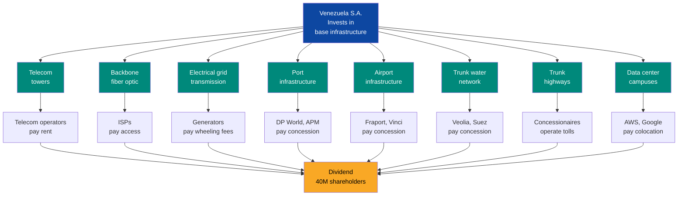
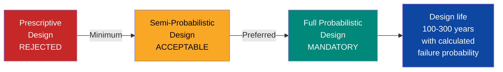
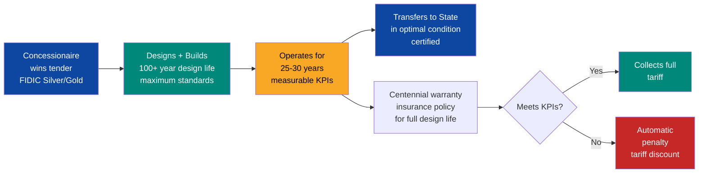
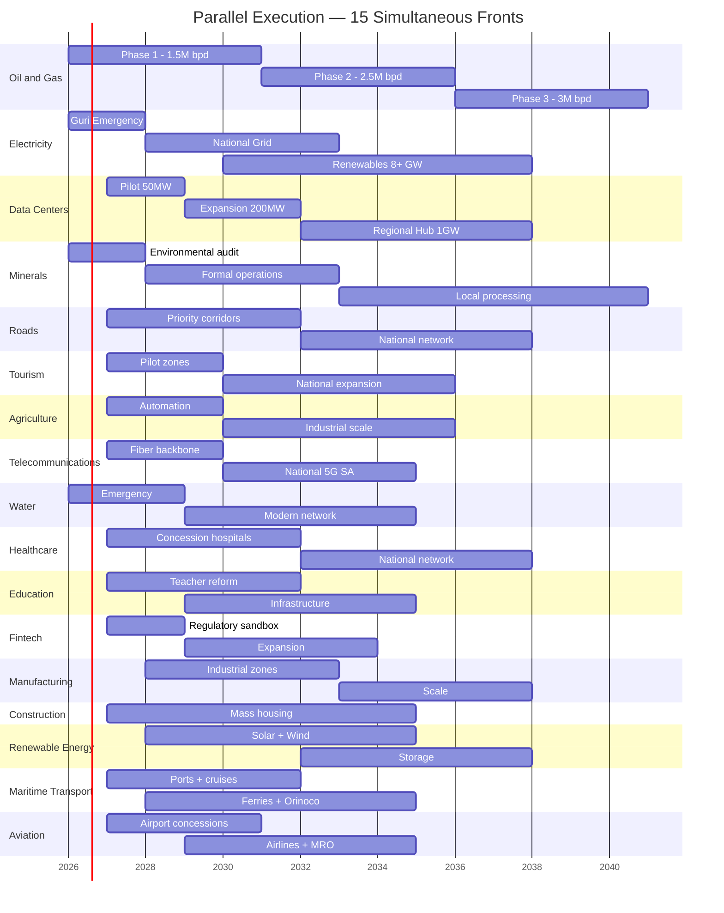
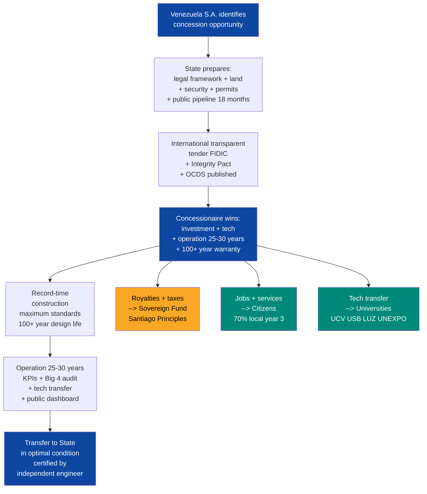

# Concession Model: Maximum Standards, 100+ Years, Parallel Execution

:::danger Inviolable Principle
Every project, every piece of infrastructure, every service in this plan must be of **maximum world-class quality**. Not the minimum standard — the **most stringent standard that exists in each category**. Venezuela is not rebuilt with patches or mediocre standards — it is rebuilt with the best that humanity has ever built. Infrastructure for **100+ years**, not 20.
:::

## The Thesis

Venezuela S.A. is not a government that builds. It is a **platform that enables the most ambitious infrastructure buildout of the 21st century** — and at the same time, it is the **holding company for 40 million shareholders** that invests in base infrastructure and collects perpetual rent.

:::danger Fundamental Distinction: State vs. Venezuela S.A.
**The State does NOT own any companies.** Its role is exclusively: government, health, justice, education, and security. **Venezuela S.A.** is the corporate entity of the citizens — it invests in base infrastructure, collects royalties, manages the sovereign fund, and distributes dividends. When a concession pays, it pays Venezuela S.A. (the citizens), not the government.
:::

| Role | Who | What They Do |
|------|-----|-------------|
| **State** | Transition government | Regulates, grants permits, security, justice, speed. **Does not own companies.** |
| **Venezuela S.A.** | Holding of 40M shareholders | Invests in base infrastructure, collects royalties and equity, manages sovereign fund |
| **International concessionaire** | Foreign capital | Investment, technology, know-how, execution, operations |
| **Citizen** | Venezuela S.A. shareholder | Labor, consumption, oversight, sovereign dividend |
| **Sovereign Fund** | Managed by Venezuela S.A. | Royalties, taxes, equity, intergenerational savings |

### Venezuela S.A. as Investor — Landlord Model

Venezuela S.A. does not merely collect royalties passively. It **invests in the shared base infrastructure** that lasts 100+ years and collects recurring rent from multiple operators:

| Base Infrastructure | Venezuela S.A. Invests | Operators Pay | Reference Model |
|---------------------|------------------------|---------------|-----------------|
| **Telecom towers** | Builds/concessions shared towers | All operators pay monthly rent | American Tower, SBA Communications |
| **Backbone fiber optic** | Owns national backbone (50,000+ km) | ISPs and operators pay wholesale access | Chorus (New Zealand), NBN (Australia) |
| **Electrical grid (transmission)** | Owns transmission lines | Generators and distributors pay wheeling fees | ISA (Colombia), Red Electrica (Spain) |
| **Ports (land + infrastructure)** | Owns land and docks | Port operators pay BOT concession | Port Authority NY/NJ, Rotterdam |
| **Airports** | Owns runways, terminals | Airport operators pay concession | ADP (Paris), AENA (Spain) |
| **Trunk water network** | Owns aqueducts and main plants | Operators pay distribution concession | Thames Water, Aguas Andinas (Chile) |
| **Trunk highways** | Owns the road | Concessionaires operate and collect tolls | MOP Chile, ANI Colombia |
| **Data center campuses** | Prepares land + power + security | Hyperscalers pay colocation/rent | Equinix, Digital Realty |

:::info Perpetual Recurring Income
Base infrastructure lasts **100+ years**. Operators rotate every **25-30 years** via new tenders. Venezuela S.A. collects perpetual rent on assets that appreciate over time. It is the **REIT** (Real Estate Investment Trust) model applied to national infrastructure — the 40M shareholders receive dividends from real assets, not from promises.
:::

### How Venezuela S.A. Finances Its Shareholder Positions

Venezuela S.A. **does not need its own cash** for most of its investments. It contributes **in kind** — just as a startup founder contributes the idea and the work, and the VC contributes the capital:

| Mechanism | How It Works | Cash Required |
|-----------|-------------|---------------|
| **In-kind contribution: land** | Venezuela S.A. contributes land as equity in the JV | USD 0 |
| **In-kind contribution: natural resource** | Oil, minerals, water, sun, wind = equity value | USD 0 |
| **In-kind contribution: permits + market** | 40M consumers + fast-track = negotiable value | USD 0 |
| **Oil forwards** | Pre-sale of crude generates USD 15-25B upfront (already in the plan) | Cash generated |
| **Reinvested royalties** | First royalties from concessions are reinvested in base infrastructure | Operating cash |
| **Infrastructure bonds** | Bonds backed by future concession cash flow (corporate debt, not sovereign) | VSA debt |
| **Citizen investment** | 40M shareholders invest from USD 10 | Crowd-equity |
| **Diaspora** | 8M Venezuelans abroad invest in Venezuela S.A. | Productive remittances |
| **Multilaterals** | IDB, CAF, IFC, DFC lend for base infrastructure | Multilateral debt |

:::caution Venezuela S.A. is a shareholder, not an owner
Venezuela S.A. does not "own" infrastructure like a socialist state. It is a **shareholder** in joint ventures where the private partner contributes capital and technology, and Venezuela S.A. contributes land, resources, permits, and market access. Model: Debswana (Botswana 50% / De Beers 50% — Botswana contributed the mining concession, De Beers contributed the capital). Result: Botswana went from being one of the poorest countries in the world to having the highest GDP per capita in Africa.
:::

:::tip The benchmark is NOT Latin America — it is the best in the world
If Norway has the best sovereign fund, we copy Norway. If Singapore has the best port, we copy Singapore. If Japan has the best seismic engineering, we copy Japan. If Australia designs bridges for 300 years, we copy Australia. If the Netherlands protects against 1-in-100,000-year floods, we copy the Netherlands. Venezuela does not compete with Honduras — **it competes with the best on the planet in each category.**
:::

---

## The 10 Principles of Every Concession

### 1. Design for 100+ Years — Not for a Single Generation

:::danger Infrastructure is not for us — it is for our great-grandchildren
Every bridge, every plant, every tunnel, every electrical grid must be designed to last **a minimum of 100 years**. A 50-year bridge is an expense. A 300-year bridge is an investment. Australia demonstrated with the Sir Leo Hielscher Bridge (300-year design life) that centennial design is **more economical** over the life cycle than conventional design. Venezuela builds to last or does not build.
:::

| Infrastructure Type | Design Life | Reference Standard | Reference Country |
|---------------------|-------------|-------------------|-------------------|
| **Bridges and tunnels** | 200-300 years | EN 1990 Cat. 5 + fib Model Code probabilistic | Australia (300 years), Finland (200 years) |
| **Monumental buildings** (hospitals, universities) | 100 years | EN 1990 Cat. 5 + ISO 16204 | EU/UK |
| **Dams and reservoirs** | 100+ years | ICOLD + fib probabilistic | Switzerland, Norway |
| **Electrical grids** (lines, substations) | 50-80 years | IEC 61936-1 + NERC TPL | Singapore, U.S. |
| **Highways** | 100 years | EN 1990 Cat. 5 + AASHTO LRFD 100-year | Australia, EU |
| **Ports** | 100 years | PIANC + Rotterdam Class | Netherlands, Singapore |
| **Water treatment plants** | 100 years | Dutch Delta Programme standards | Netherlands |
| **Data centers** | 25-30 years (technology evolves) | Uptime Tier IV + ISO 27001 | Global |
| **Telecommunications** (ducts, fiber) | 50+ years | ITU-T + 5G SA | South Korea, UAE |
| **Social housing** | 75-100 years | Eurocode + Passivhaus | Germany, Austria |

**Mandatory design methodology:** Full probabilistic analysis per **fib Bulletin 34/76 + ISO 16204** — not the prescriptive method (deemed-to-satisfy) but the **full probabilistic method** that calculates the probability of failure over the entire design life.

### 2. Maximum Standards by Sector — No Exceptions

The minimum standard is not used. **The most stringent standard in the world** for each category is applied:

| Sector | Maximum Standard | Specification | Leading Country |
|--------|-----------------|---------------|-----------------|
| **Structural engineering** | EN 1990 Cat. 5 + fib probabilistic | 100-300 year design life, full probabilistic analysis | Australia, EU, Finland |
| **Seismic resistance** | Japan Building Standards Act Grade 3 + seismic isolation | Reduces vibration 70-80%, withstands JMA intensity 6-7 | Japan |
| **Tunnels** | SIA 198 (Switzerland) | World's first tunnel code, continuously refined | Switzerland |
| **Flood protection** | Dutch Delta Programme | 1-in-100,000-year protection (0.001% annual probability) | Netherlands |
| **Electrical grid** | NERC TPL N-1-1 + SAIDI <1 min/year | Double contingency + Singapore-class reliability (0.23 min/customer/year) | Singapore, U.S. |
| **Data centers** | Uptime Tier IV | 99.995% availability, 2N+1 redundancy, full fault tolerance | Global (no higher level exists) |
| **Mining** | IRMA 100 | 420+ auditable requirements, full compliance | Global (IRMA maximum level) |
| **Ports** | PIANC + Rotterdam Class | 24m draft, eco-based design, IoT, sensors | Netherlands, Singapore |
| **Airports** | ICAO Annex 14 + Changi Class (Skytrax 5-star) | 13x world's best airport | Singapore |
| **Healthcare** | JCI Gold Seal of Approval | World's most rigorous evaluation, 1,000+ orgs in 70+ countries | Global (Joint Commission) |
| **Education** | Finnish Model | Master's degree mandatory for ALL teachers, 10% acceptance rate | Finland |
| **Water and sanitation** | Dutch Delta Programme + WHO Guidelines | 1:100,000 protection + WHO treatment | Netherlands |
| **Telecommunications** | 5G SA + FTTH 99%+ | Independent 5G core + universal fiber to the home | South Korea, UAE (99.3%) |
| **Sustainability** | Envision Platinum (ISI) | 64 criteria across 5 categories, independent review | Global |
| **Asset management** | ISO 55000 | Full life-cycle cost optimization | Global |
| **Green building** | BCA Green Mark Platinum SLE | 55%+ energy improvement over baseline | Singapore |
| **Engineering contracts** | FIDIC Silver Book (EPC/Turnkey) | Maximum contractor liability | Global |
| **Concession contracts** | FIDIC Gold Book (DBO) | Design + Build + Operate = full life-cycle responsibility | Global |
| **Quality management** | ISO 9001:2015 | Mandatory for all operations | Global |
| **Environmental management** | ISO 14001:2015 + IFC Performance Standards | The more stringent of the two applies | Global |
| **Occupational safety** | ISO 45001 | Zero tolerance, full traceability | Global |
| **Cybersecurity** | NERC CIP + SOC 2 Type II + ISO 27001 + CMMC L3 | Full stack for critical infrastructure | U.S., Global |

:::info Australia proved that 300 years is cheaper than 50
The Sir Leo Hielscher Bridge in Brisbane was designed for a **300-year design life** using duplex stainless steel. Life-cycle cost analysis demonstrated that centennial infrastructure is **more economical** than short-lived structures in almost all cases. Reference: [Sustainable Bridges - 300 Year Design Life](https://www.researchgate.net/publication/343569224)
:::

### 3. Technology Transfer — Mandatory and Progressive

Every concessionaire must include in its contract a binding transfer plan:

| Component | Requirement | Timeline | Reference |
|-----------|-------------|----------|-----------|
| **Local workforce training** | Minimum 70% Venezuelan workforce by year 3 | Progressive | EMBRAER Model (Brazil) |
| **Training center** | The concessionaire operates a training center in its sector | Year 1 | Market access condition |
| **Technical documentation** | Manuals, processes, SOPs in Spanish, owned by Venezuela | Ongoing | Know-how transferred |
| **Lab/workshop** | Local maintenance capability, no import dependency | Year 2-3 | Self-sufficiency |
| **Applied research** | Collaboration with Venezuelan universities (UCV, USB, LUZ, UNEXPO) | Year 2+ | Local R&D |
| **Local suppliers** | Minimum 30% of inputs from local suppliers by year 5 | Progressive | Local value chain |
| **Personnel certification** | The concessionaire certifies Venezuelan technicians to international standards | Year 2+ | Exportable human capital |
| **Patents and intellectual property** | Venezuela retains rights over locally developed improvements | Ongoing | Technological sovereignty |

:::info EMBRAER Model (Brazil) + Hyundai (South Korea)
Brazil required technology transfer in aviation. Today Embraer is the 3rd largest aircraft manufacturer in the world. South Korea did the same with Hyundai and Samsung. Transfer is not a favor — **it is the condition for access to a market of 40 million people and USD 300-400B in concessions.**
:::

### 4. Concession with Management, Warranty, and Centennial Liability

The concessionaire does not just build — it **operates, guarantees, and is responsible for the full design life**:

| Element | Detail |
|---------|--------|
| **Contract model** | FIDIC Silver Book (EPC) + FIDIC Gold Book (DBO) by sector |
| **Concession term** | 25-30 years of operation |
| **Design life** | 100-300 years depending on infrastructure type |
| **Contractual KPIs** | Availability, quality, satisfaction, maintenance — measured in real time |
| **Penalties** | Automatic for non-compliance — non-discretionary, triggered by dashboard |
| **Performance bond** | 10-20% of contract value in escrow |
| **Structural warranty** | 15 years post-handover for critical infrastructure |
| **Functional warranty** | 7 years post-handover |
| **Design-life insurance** | Policy (Lloyd's, Munich Re, Swiss Re) covering latent defects for the full design life |
| **Audit** | International, independent, annual — Big 4 with rotation every 3 years |
| **Final transfer** | Asset is returned to the State in certified operational condition by independent engineer |
| **Financing** | The concessionaire assumes financial risk (project finance, not sovereign debt) |
| **Defect liability** | 5-15 years by sector — the concessionaire repairs at its own cost |

### 5. Parallel Execution — Speed as Competitive Advantage

:::danger The window is 10-15 years
Oil is a depreciating asset. By 2040, solar will be cheaper than extracting crude from the Orinoco Belt. Every month of delay is one less month of financing for diversification. Speed is not a luxury — it is survival. But speed WITHOUT quality is not speed — it is future demolition.
:::

**The parallel execution model** allows launching 15+ sectors simultaneously without sacrificing quality:

**How parallel execution works:**

| Mechanism | Implementation | Reference |
|-----------|----------------|-----------|
| **Central coordination authority** | Venezuela S.A. as national PMO with real-time dashboard | Singapore LTA, UAE Dubai 2040 |
| **Single digital window** | One point of contact for all permits — positive administrative silence (30 days = approved) | Estonia e-governance |
| **Simultaneous tenders** | 15 sectors tender in parallel, each with its technical committee | Chile MOP Concessions |
| **Digital delivery platform** | Common Data Environment (CDE) for all stakeholders | Singapore FulcrumHQ |
| **Contract standardization** | Single FIDIC template adapted by sector — reduces negotiation from 12 months to 3 | FIDIC Silver/Gold |
| **Transparent pipeline** | All projects published 18 months in advance for market preparation | Australia Infrastructure |
| **Fast-track environmental** | IFC assessment in 60 days maximum — no invented bureaucracy | IFC Performance Standards |
| **Duty-free imports** | Concession machinery at 0% tariff | Universal free zone |

**Speed commitments from Venezuela S.A. + State:**

| Commitment | Mechanism | Timeline |
|------------|-----------|----------|
| **Building permit** | Single digital window, positive silence | 30 days maximum |
| **Environmental assessment** | Fast-track IFC Standards | 60 days maximum |
| **Work visa** | Fast-track for concessionaire technicians | 15 days |
| **Equipment imports** | Tariff exemption for concession machinery | Immediate |
| **Dispute resolution** | ICSID (World Bank), not local courts | In contract |
| **Site security** | Reformed FANB coordination + private contractors | From day 1 |
| **Connectivity** | Starlink available at any construction site | Week 1 |
| **Land** | The State provides cleared land, free of title conflicts | Pre-tender |

### 6. Investor Protection — Armored Legal Architecture

| Protection | Mechanism | Detail |
|------------|-----------|--------|
| **BIT (Bilateral Investment Treaty)** | Venezuela-U.S. (in negotiation), Venezuela-EU, Venezuela-UK | Supranational treaty |
| **ICSID** | World Bank international arbitration | No local courts |
| **MIGA** | Insurance against political risk (war, expropriation, breach) | World Bank |
| **Legal stability** | Stabilization clause — changes in law do not affect existing contracts | Contractual |
| **Profit repatriation** | Guaranteed in USD, no exchange restrictions | Constitutional |
| **No expropriation** | Constitutional prohibition — requires fair value compensation + lost profits | Supra-constitutional |
| **Offshore SPV** | Corporate structure in neutral jurisdiction (Delaware, Netherlands, Singapore) | Project finance |
| **Anti-populist lock** | Modification requires 2/3 of Parliament + referendum | Anti-capture |

:::caution Lesson from history
Venezuela expropriated **USD 20B+** in assets between 2007-2014. Any investor will ask: "Why is this time different?" The answer: BIT + ICSID + MIGA + stabilization clause + offshore sovereign fund + supra-constitutional locks. **It is not trust — it is legal architecture that makes expropriation economically irrational.**
:::

### 7. Total Transparency — World-Class Anti-Corruption

Dashboards alone are not enough. Venezuela adopts the **4 most stringent anti-corruption frameworks in the world** simultaneously:

| Framework | Scope | Key Requirement |
|-----------|-------|-----------------|
| **UNCAC** | Only legally binding anti-corruption treaty (180+ countries) | Prevention, criminalization, cooperation, asset recovery |
| **CoST** (Infrastructure Transparency Initiative) | 25,000+ projects monitored globally | **40 public data points** per project across the full life cycle |
| **OCDS** (Open Contracting Data Standard) | 50+ governments implementing | Structured, machine-readable data at all stages |
| **EITI** (Extractive Industries Transparency Initiative) | Extractive sector | All contracts/licenses published, beneficial ownership reporting |

**Transparency stack for each concession:**

| Layer | Mechanism | Frequency |
|-------|-----------|-----------|
| **Public dashboard** | Progress, spending, KPIs, employment, penalties — visible to all | Real time |
| **Integrity Pact** (Transparency International) | Public agreement between government and bidders with independent civil monitor | Per tender |
| **Clerk of Works** | Independent engineer certifies construction quality on site | Ongoing |
| **Big 4 audit** | Deloitte, PwC, EY, or KPMG — rotation every 3 years | Quarterly |
| **Whistleblower channel** | Legally protected channel with rewards for verified reports | Permanent |
| **Open Contracting** | All contracts published in OCDS format | Upon award |

| Public Metric | Visible To |
|---------------|-----------|
| Construction progress (%) | Everyone |
| Spending vs. budget | Everyone |
| Quality KPIs | Everyone |
| Employment generated (local vs. foreign) | Everyone |
| Technology transfer (% compliance) | Everyone |
| Audits (full results) | Everyone |
| Environmental incidents | Everyone |
| Penalties applied | Everyone |
| Full contracts (complete text) | Everyone |
| Beneficial owners of each company | Everyone |

### 8. Sustainability and Climate Resilience

All infrastructure must be certified under **Envision Platinum** (ISI) — the highest sustainability standard for infrastructure:

| Envision Category | Criteria | Application |
|-------------------|----------|-------------|
| **Quality of life** | Community impact, mobility, public health | All projects |
| **Leadership** | Collaboration, management, planning | All projects |
| **Resource allocation** | Materials, energy, water — full life cycle | All projects |
| **Natural world** | Habitats, biodiversity, soils, water | All projects |
| **Climate and resilience** | Emissions, adaptation, long-term risks | All projects |

Additionally:

| Requirement | Standard | Detail |
|-------------|----------|--------|
| **Carbon footprint** | Net-zero in operations by year 10 | Offset with hydroelectric energy |
| **Extreme weather resilience** | Design for IPCC RCP 8.5 scenarios (worst case) | Temperature, precipitation, sea level through 2100+ |
| **Waste management** | Zero waste in operations | Mandatory circular economy |
| **Biodiversity** | Net positive impact | More biodiversity post-project than pre-project |
| **Energy efficiency** | BCA Green Mark Platinum SLE | 55%+ improvement over 2005 baseline |

### 9. Citizen Benefit — The Shareholder Comes First

| Benefit | Mechanism |
|---------|-----------|
| **Local employment** | Minimum 70% Venezuelan workforce by year 3 |
| **Affordable prices** | Regulated tariffs for essential services (water, electricity, healthcare) |
| **Universal access** | No concession may exclude vulnerable populations |
| **Sovereign dividend** | Royalties go to sovereign fund -> annual citizen dividend |
| **Community participation** | Mandatory public consultation (FPIC/ILO 169) before each concession |
| **Purchase priority** | Venezuelans can invest in each concession from USD 10 |
| **Free training** | Concessionaire's training center open to the community |
| **Permanent infrastructure** | 100+ year design life = intergenerational benefit |

### 10. Asset Management — ISO 55000 for Everything

Every asset built under concession is managed under **ISO 55000** (Asset Management) throughout its entire design life:

| Phase | Activity | Responsible |
|-------|----------|-------------|
| **Planning** | Life-cycle cost analysis (100+ years) | Concessionaire + State |
| **Construction** | Full traceability of materials and processes | Concessionaire |
| **Operations** | Predictive maintenance with IoT and sensors | Concessionaire (25-30 years) |
| **Post-transfer** | Maintenance plan delivered with the asset | State + new operator |
| **Renewal** | Defined protocol for renovation/upgrade | State |
| **End of life** | Demolition/recycling protocol (circular economy) | State |

---

## How It Works in Practice

---

## Opportunity Map by Sector

| # | Sector | Estimated Investment | Jobs | Typical Concessionaires | Maximum Standard | Design Life |
|---|--------|---------------------|------|-------------------------|-----------------|-------------|
| 1 | [AI Data Centers](./data-centers-ia) | USD 6-10B | 15-22K | AWS, Google, Microsoft | Tier IV + ISO 27001 + CMMC L3 | 25-30 years |
| 2 | [Critical Minerals](./minerales-criticos) | USD 14-26B | 50-100K | Rio Tinto, BHP, Freeport | IRMA 100 + EITI + FPIC | 25-30 years |
| 3 | [Electrical Capacity](./capacidad-electrica) | USD 15-25B | 30-50K | Siemens, AES, Enel | NERC CIP + SAIDI <1 min + N-1-1 | 50-80 years |
| 4 | [Tourism](./turismo) | USD 5-15B | 200-500K | Marriott, Hilton, Accor | Skytrax 5-star + Envision | 100 years |
| 5 | [Agriculture & Livestock](./agro-ganaderia) | USD 5-15B | 500K-1M | Cargill, JBS, ADM | ISO 22000 + Precision Ag | 100 years |
| 6 | [Roads & Logistics](./vialidad-logistica) | USD 15-25B | 300-500K | VINCI, ACS, Bechtel | EN 1990 Cat.5 + AASHTO 100yr | 100-300 years |
| 7 | [FinTech & Banking](./fintech-banca-digital) | USD 1-3B | 50-100K | Nubank, Square, Visa | PCI DSS + SOC 2 | 25 years |
| 8 | [Healthcare](./salud-telemedicina) | USD 5-10B | 100-200K | HCA, Rede D'Or, Pfizer | JCI Gold Seal + WHO/PAHO | 100 years |
| 9 | [Education](./educacion-edtech) | USD 2-5B | 50-100K | Platzi, Coursera, 42 | Finnish Model + Passivhaus | 100 years |
| 10 | [Renewable Energy](./energia-renovable) | USD 5-10B | 30-50K | Enel, Iberdrola, NextEra | IEA/IRENA + Envision Platinum | 30-50 years |
| 11 | [Water & Sanitation](./agua-saneamiento) | USD 3-5B | 20-40K | Veolia, Suez, Xylem | Dutch Delta 1:100,000 + WHO | 100 years |
| 12 | [Telecommunications](./telecomunicaciones) | USD 5-10B | 50-80K | America Movil, Millicom | 5G SA + FTTH 99%+ | 50 years |
| 13 | [Construction](./construccion-inmobiliaria) | USD 30-50B | 500K-1M | VINCI, CEMEX, LafargeHolcim | Eurocode + Passivhaus + 100yr | 100 years |
| 14 | [Manufacturing](./manufactura-industrial) | USD 5-15B | 300-500K | Toyota, Nestle, PepsiCo | ISO 9001 + ISO 14001 + 45001 | 50-100 years |
| 15 | [Oil & Gas](./petroleo-gas) | USD 183B | 200-300K | Chevron, Shell, Total | API + ISO 14001 + EITI | 25-30 years |
| 16 | [Maritime Transport](./transporte-maritimo) | USD 6-12B | 50-100K | DP World, APM, Royal Caribbean | PIANC + IMO + Rotterdam Class | 100 years |
| 17 | [Aviation & Airports](./aviacion-aeropuertos) | USD 5-9B | 40-80K | Fraport, Vinci, Copa, JetBlue | ICAO Annex 14 + Skytrax 5-star | 100 years |
| | **TOTAL** | **USD 310-420B** | **2.6-4.7M** | | | |

:::tip USD 310-420B in concessions = the plan funds itself
The total plan is USD 550-750B over 15 years. If concessions attract USD 310-420B in private capital, Venezuela S.A. only needs to facilitate USD 130-330B — financeable with oil at USD 60/barrel + multilaterals + sovereign fund. **Private capital is not a complement — it is the main engine. Venezuela S.A. invests in base infrastructure, collects perpetual rent, and distributes dividends to the 40M shareholders.**
:::

---

## International Precedents

| Country | Model | What We Copy | Sector |
|---------|-------|-------------|--------|
| **Australia** | 300-year design life (Sir Leo Hielscher Bridge) | Probabilistic centennial design | Bridges, tunnels |
| **Finland** | 200 years (Kruunuvuori Bridge) | Non-replaceable components for 200+ years | Monumental infrastructure |
| **Japan** | Grade 3 seismic + isolation | Maximum seismic resistance | Everything (Venezuela has seismic activity) |
| **Switzerland** | SIA 198 (world's first tunnel code) | Tunnel standards | Mountain roads |
| **Netherlands** | Delta Programme 1:100,000 | Flood protection | Water, dams, coast |
| **Singapore** | SAIDI 0.23 min/year + BCA Green Mark | Most reliable grid + green building | Electricity, buildings |
| **Chile** | 25+ years of successful concessions (80% of highways on BOT) | Concession framework | Roads, infrastructure |
| **Norway** | NBIM (USD 2.2T) + Santiago Principles | Sovereign fund governance | Sovereign fund |
| **Estonia** | e-Governance, 100% digital government | Single window, digital permits | Digital state |
| **South Korea** | 5-year plans + 5G SA + FTTH | Parallel infrastructure execution | Telecoms, industry |
| **UAE** | Dubai 2040 (USD 177B in parallel) | Coordinated massive parallel execution | Multi-sector |
| **Rwanda** | Umuganda + disciplined government | Community participation + discipline | Governance |

---

## Sources

| # | Source | Data |
|---|--------|------|
| 1 | [World Bank PPP Knowledge Lab](https://ppp.worldbank.org/) | PPP concession frameworks |
| 2 | [IFC Performance Standards](https://www.ifc.org/en/insights-reports/2012/ifc-performance-standards) | Social and environmental standards |
| 3 | [FIDIC](https://fidic.org/) | Silver/Gold Book engineering contracts |
| 4 | [Chile MOP Concessions](https://www.concesiones.cl/) | Chilean concession model (25+ years) |
| 5 | [ICSID](https://icsid.worldbank.org/) | International arbitration |
| 6 | [MIGA](https://www.miga.org/) | Political risk insurance |
| 7 | [EN 1990 Eurocode](https://www.phd.eng.br/wp-content/uploads/2015/12/en.1990.2002.pdf) | Basis of Structural Design — Cat. 5 (100 years) |
| 8 | [fib Model Code](https://books.google.com/books/about/Model_Code_for_Service_Life_Design.html?id=CXHy2xew2aUC) | Probabilistic Service Life Design |
| 9 | [ISO 16204:2012](https://cdn.standards.iteh.ai/samples/55862/8fad5efebadf4125998d7d7c358ac558/ISO-16204-2012.pdf) | Durability — Service Life Design of Concrete |
| 10 | [Sir Leo Hielscher Bridge — 300 Year Design](https://www.researchgate.net/publication/343569224) | 300-year bridge, more economical over life cycle |
| 11 | [Japan Building Standards Act](https://e-housing.jp/post/japans-earthquake-resistant-buildings-overview-history) | Grade 3 seismic + isolation |
| 12 | [SIA 198 Swiss Tunnel Code](https://www.sia.ch/en/cms/services/standards-regulations) | World's first tunnel code |
| 13 | [Dutch Delta Programme](https://english.deltaprogramma.nl/) | 1:100,000-year protection |
| 14 | [Singapore SAIDI](https://www.ema.gov.sg/) | 0.23 min/customer/year (world's best) |
| 15 | [Uptime Institute Tier IV](https://uptimeinstitute.com/tier-certification) | 99.995% availability |
| 16 | [IRMA Standard v2.0](https://responsiblemining.net/) | 420+ auditable requirements |
| 17 | [JCI Gold Seal](https://www.jointcommission.org/) | World's most rigorous hospital accreditation |
| 18 | [Finnish Education](https://ncee.org/finland/) | Mandatory master's for teachers |
| 19 | [UNCAC](https://star.worldbank.org/focus-area/uncac) | Binding anti-corruption treaty |
| 20 | [CoST](https://infrastructuretransparency.org/) | 40 public data points per project |
| 21 | [OCDS](https://www.open-contracting.org/data-standard/) | Open Contracting Data Standard |
| 22 | [Envision ISI](https://sustainableinfrastructure.org/envision/) | Infrastructure sustainability — Platinum |
| 23 | [ISO 55000](https://www.iso.org/standard/83053.html) | Asset Management lifecycle |
| 24 | [Santiago Principles](https://www.ifswf.org/) | 33 principles for sovereign funds |
| 25 | [Transparency International Integrity Pacts](https://www.transparency.org/en/projects/integrity-pact-global-standard) | Independent civil monitor in tenders |
| 26 | [NERC TPL-001-5.1](https://www.nerc.com/) | N-1-1 contingency for transmission |
| 27 | [BCA Green Mark](https://www1.bca.gov.sg/) | Platinum SLE — 55%+ energy improvement |
