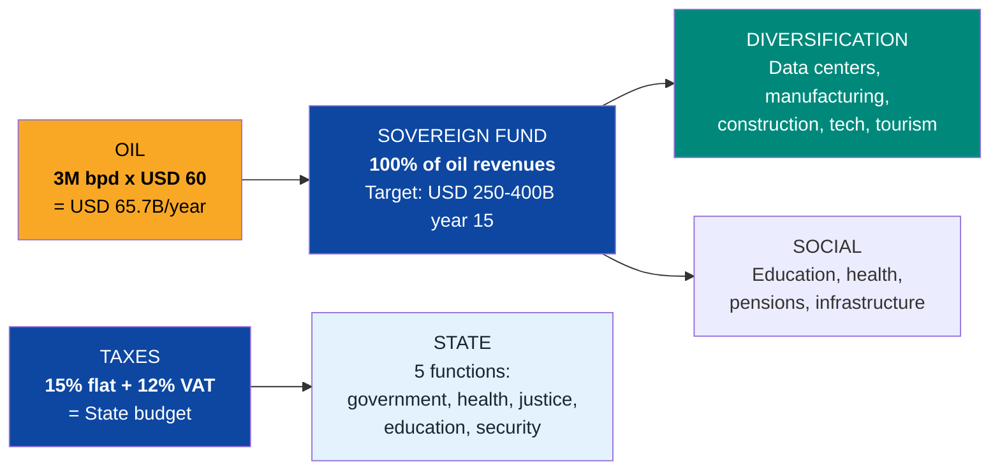
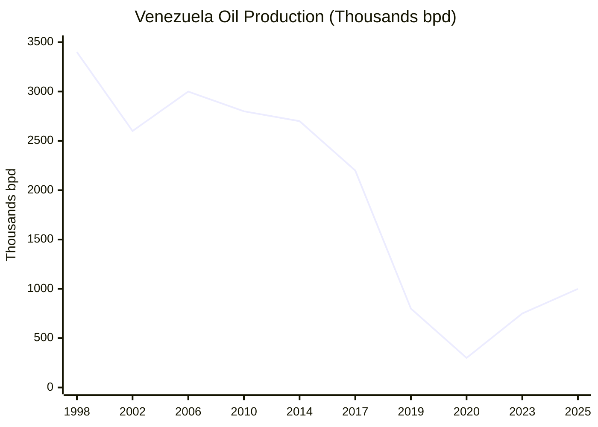
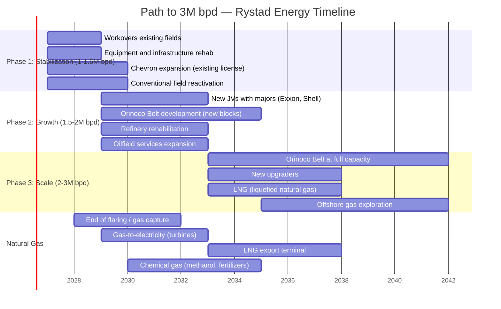
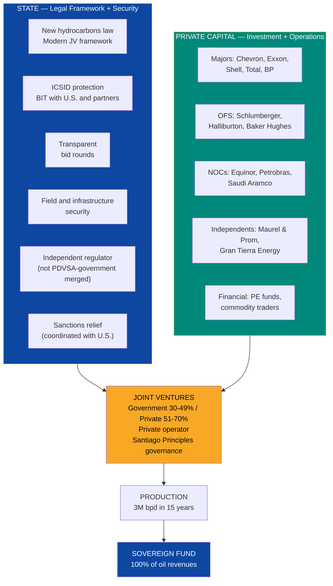
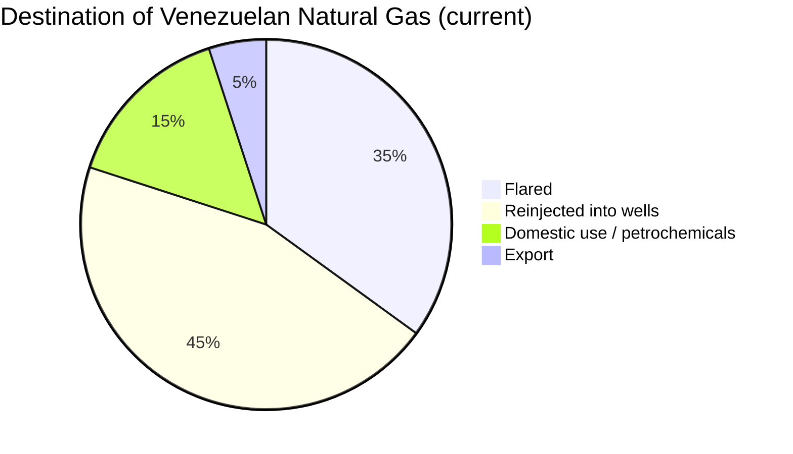
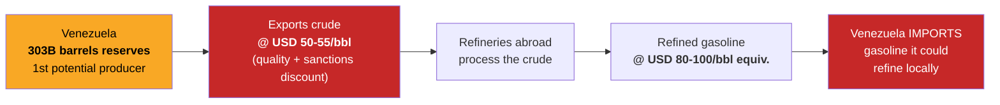
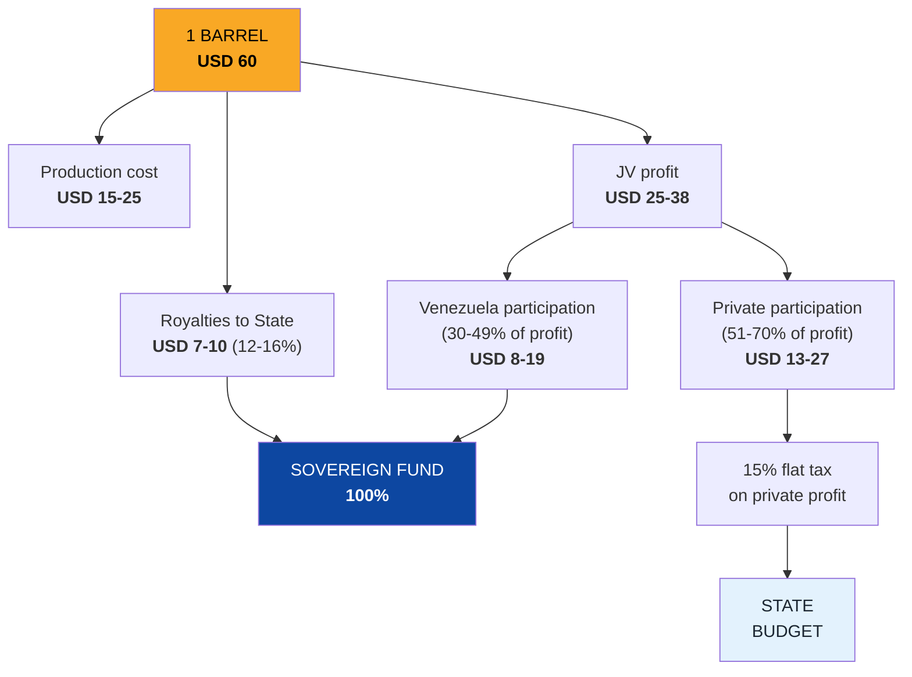
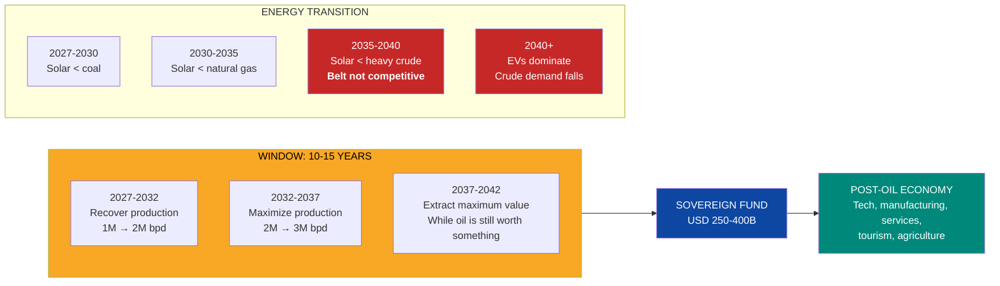
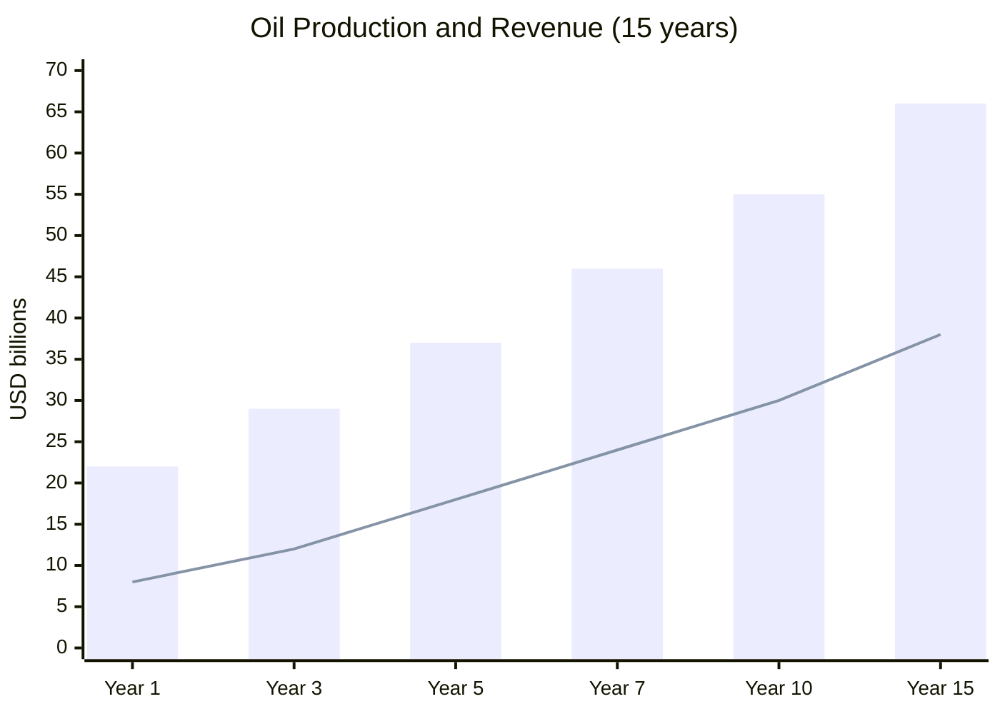

# Oil & Gas: The Engine That Ignites Everything Else

> **303 billion barrels.** The largest reserves on the planet. And Venezuela barely produces **~1 million barrels per day** — a fraction of what it produced in the 90s. Oil is not Venezuela's destination. It is the **fuel**. Every barrel extracted finances housing, hospitals, data centers, education, and diversification. But it is a **depreciating asset**: by 2040, solar energy will be cheaper than extracting heavy crude from the Orinoco Belt. The real window is **10-15 years, not 30**. It must be burned fast, intelligently, and with every dollar going to the sovereign fund and diversification.

---

## 1. The Opportunity: USD 60-80B/Year at 3M bpd

| Data Point | Figure | Source |
|------|-------|--------|
| Proven reserves | **303,000 M barrels** (1st worldwide) | [OPEC ASB 2025](https://www.opec.org/assets/assetdb/asb-2025.pdf) |
| Conservative reserves (viable) | **100,000-110,000 M barrels** | [Monaldi, Rice University](https://finance.yahoo.com/news/venezuela-says-it-has-the-worlds-largest-reserves-of-crude-oil-making-it-viable-is-a-whole-other-problem-181512098.html) |
| Current production | **~0.9-1.1 M bpd** | [OPEC/IEA 2025](https://www.opec.org/) |
| Historical peak production | **3.4 M bpd** (1998) | [EIA](https://www.eia.gov/) |
| Target: 3M bpd | **15 years** (Rystad Energy) | [Rystad, Jan. 2026](https://www.rigzone.com/news/could_venezuela_production_get_back_to_3mm_barrels_per_day-08-jan-2026-182716-article/) |
| Investment required for 3M bpd | **USD 183,000 M** | [Rystad Energy](https://www.rigzone.com/news/could_venezuela_production_get_back_to_3mm_barrels_per_day-08-jan-2026-182716-article/) |
| Base price | **USD 60/barrel** | [EIA STEO, Mar. 2026](https://www.eia.gov/outlooks/steo/) |
| Gross revenue at 3M bpd @ USD 60 | **USD 65,700 M/year** | Calculation: 3M x 365 x 60 |
| Gross revenue @ USD 80 | **USD 87,600 M/year** | Upside to sovereign fund |
| Natural gas (reserves) | **5,500 BCM** (7th worldwide) | [U.S. CRS](https://www.congress.gov/crs-product/IF12448) |
| Natural gas (current production) | Mostly flared/vented | [Columbia CGEP](https://www.energypolicy.columbia.edu/more-efficient-use-of-venezuelas-natural-gas-could-strengthen-the-regions-energy-security-and-the-countrys-electricity-sector/) |

:::danger Inviolable principle: oil is fuel, not destination
Every dollar of oil revenue goes to the **sovereign fund**, managed by **Venezuela S.A.** (the holding company of 40M citizen-shareholders) — not by the State. The State lives on taxes (15% flat + 12% VAT), not on oil. Venezuela S.A. collects royalties, manages the fund, and distributes dividends. This isn't idealism — it's the only way to avoid the Dutch Disease that destroyed Venezuela the first time. See [Dutch Disease](/02-motor-financiero/enfermedad-holandesa) and [Sovereign Fund](/02-motor-financiero/fondo-soberano).
:::

### The simple equation

**Plain language:** Oil doesn't pay the government. Oil pays the sovereign fund managed by Venezuela S.A., which invests in the future. The State pays itself with taxes from the productive economy. That's how Norway works. That's how Venezuela must work.

### March 2026 Context: Strait of Hormuz Crisis

:::danger The largest supply shock since the 1970s
On February 28, 2026, the U.S. and Israel executed a coordinated strike against Iran, eliminating Khamenei and destroying nuclear infrastructure. Iran closed the Strait of Hormuz in retaliation — **20 million barrels per day** of oil transit interrupted. Brent jumped to **USD 120/barrel**. Within days, Venezuela went from energy pariah to **critical U.S. energy security partner**.
:::

| Event | Date | Impact on Venezuela |
|--------|-------|---------------------|
| Attack on Iran, Khamenei eliminated | Feb. 28, 2026 | Strait of Hormuz closed. 20M bpd interrupted |
| Oil price spikes | Mar. 2026 | Brent at **USD 120/bbl** vs. USD 60 base |
| Trump — State of the Union | Mar. 2026 | Called Venezuela *"new friend and partner"* |
| New oil contracts signed | Mar. 4, 2026 | **USD 100,000 M** committed by U.S. oil companies |
| 5 majors authorized | Mar. 2026 | Chevron (existing) + **BP + ENI + Shell + Repsol** |
| Accelerated production target | 2026-2028 | 30-40% increase in 2026, target **3M bpd in 24 months** |
| U.S. operational control | Mar. 9, 2026 | U.S. controls commercialization of Venezuelan oil |

*Sources: [Requires research]*

:::caution Base price stays at USD 60 — the current USD 120 is upside
This plan **DOES NOT depend on high prices**. The base price remains **USD 60/barrel**. Everything above USD 60 goes entirely to the sovereign fund as upside. If Brent stays at USD 120, the sovereign fund accumulates twice as fast — but the plan works just as well at USD 60. Fiscal discipline is non-negotiable, even in a crisis.
:::

---

## 2. Current State: Anatomy of an Oil Collapse

:::danger From 3.4M bpd to 0.3M bpd — and back to 1M
PDVSA produced **3.4 million barrels per day** in 1998. By 2020, it had fallen to **0.3M bpd** — the lowest level since the 1940s. With OFAC licenses (especially Chevron) and some recovery, it has risen to **~1M bpd**. But that's with degraded infrastructure, no investment, no qualified personnel, and active sanctions. The path to 3M bpd requires **USD 183,000 M and 15 years**.
:::

### Why it collapsed

| Factor | Impact | Detail |
|--------|---------|---------|
| **Expropriation of JVs (2007)** | Critical | Chavez forced ExxonMobil, ConocoPhillips, Total, and others to cede majority to PDVSA. Those who refused were expropriated. Capital and expertise exodus |
| **Politicization of PDVSA** | Critical | From 40,000 technical-professional employees to political organization. Massive firing during 2002-2003 strike (18,000 employees). Directors without oil experience |
| **U.S. sanctions (2017-present)** | High | OFAC restricts transactions, exports, equipment. Limits market and financing access |
| **Zero maintenance investment** | High | USD 0 in refinery overhauls. 80s equipment without spare parts. Massive corrosion |
| **Talent flight** | High | 30,000+ oil professionals emigrated. Venezuelan engineers operate wells in Guyana, Colombia, U.S. |
| **Corruption** | High | USD 28,000 M diverted via PDVSA according to US DOJ. Systematic contract bribes |
| **Debt** | High | PDVSA owes **USD 35-60,000 M** between bonds, bilateral debt (China, Russia), and ICSID awards |

### Oil infrastructure: current state

| Infrastructure | State | Need |
|----------------|--------|-----------|
| **Conventional fields** (Zulia, Barinas) | Declining production, abandoned wells | Rehabilitation + workover + new drilling |
| **Orinoco Belt** (extra-heavy crude) | Only area with massive growth potential | Upgraders, diluents, infrastructure |
| **Amuay Refinery** (645K bpd capacity) | Operating at 10-20% | Full rehabilitation USD 5-10B |
| **Cardon Refinery** (310K bpd capacity) | Operating at 15-25% | Full rehabilitation |
| **El Palito Refinery** (130K bpd capacity) | Partially operational | Major maintenance |
| **Puerto Jose terminal** | Partially operational | Upgrade for higher volumes |
| **Pipelines** | Corrosion, leaks, no maintenance | Critical section replacement |
| **Water injection system** | Collapsed in mature fields | Rehabilitation for reservoir pressure maintenance |

:::caution The absurd paradox
Venezuela has the **world's largest reserves** and **imports gasoline**. Refineries that could process 1.1M bpd of crude are paralyzed. The country exports crude at a discount (USD 10-15/barrel less than Brent due to quality and sanctions) and buys gasoline at market price. Every day without functioning refineries loses **USD 10-30M** in refining margin.
:::

---

## 3. The Plan: From 1M to 3M bpd in 15 Years

### Rystad Energy Timeline

:::info Accelerated scenario post-Hormuz crisis
With **5 majors authorized** (Chevron + BP + ENI + Shell + Repsol) and **USD 100,000 M committed**, the Rystad 15-year timeline could compress to **8-10 years**. The Hormuz crisis provided the two missing ingredients: **political will** (the U.S. needs Venezuelan oil) and **investment commitment** (the majors have signed contracts). However, the base price remains at **USD 60/barrel** — the plan doesn't depend on high prices. The current USD 120 is upside, not baseline.
:::

### Production projection

| Year | Production (M bpd) | Gross Revenue (@ USD 60) | Sovereign Fund Contribution | Annual Investment | Primary Source |
|-----|---------------------|--------------------------|--------------------------|-----------------|------------------|
| **1** | 1.0 | USD 21,900 M | USD 15-18,000 M | USD 8-10,000 M | Existing fields |
| **3** | 1.3 | USD 28,500 M | USD 20-23,000 M | USD 12-15,000 M | + Workovers + new JVs |
| **5** | 1.7 | USD 37,200 M | USD 28-32,000 M | USD 15-18,000 M | + Orinoco Belt |
| **7** | 2.1 | USD 46,000 M | USD 35-40,000 M | USD 14-16,000 M | + Belt expansion |
| **10** | 2.5 | USD 54,800 M | USD 42-48,000 M | USD 12-14,000 M | + New blocks |
| **15** | 3.0 | USD 65,700 M | USD 50-58,000 M | USD 8-10,000 M | Full capacity |

:::caution Conservative assumptions
- Base price **USD 60/barrel** constant (everything above goes to the sovereign fund as upside)
- Production cost: USD 15-25/barrel conventional, USD 25-35/barrel Orinoco Belt (includes upgrading)
- Quality and transport discount: USD 5-10/barrel vs. Brent
- Does not assume full sanctions relief until year 3-5
- Total 15-year investment: **USD 183,000 M** (Rystad Energy)
:::

---

## 4. Investment Segments

### 4.1 Upstream: crude and gas production

| Segment | Est. Investment | Production Target | Potential Operators |
|----------|---------------|----------------|------------------------|
| **Conventional fields (Zulia, Barinas, Monagas)** | USD 20-30,000 M | 500K-700K bpd | Chevron (already operating), Repsol, ENI |
| **Orinoco Belt (extra-heavy)** | USD 80-100,000 M | 1.5-2M bpd | ExxonMobil, Shell, TotalEnergies, Chevron, CNPC |
| **Natural gas (associated and free)** | USD 15-25,000 M | 5-8 BCF/day | Shell, BP, Trinidad model |
| **Offshore gas (Deltana Platform)** | USD 10-15,000 M | 2-3 BCF/day (mature phase) | Shell, BP, Equinor |
| **EOR (Enhanced Oil Recovery)** | USD 10-15,000 M | +200-400K additional bpd | Schlumberger, Halliburton |
| **TOTAL UPSTREAM** | **USD 135-185,000 M** | **3M bpd crude + 8-10 BCF/day gas** | |

### 4.2 Midstream: transport and processing

| Segment | Est. Investment | What It Solves |
|----------|---------------|-------------|
| **Pipelines** (rehabilitation + new) | USD 5-10,000 M | Crude transport from Belt to ports |
| **Upgraders** (heavy → light crude) | USD 10-15,000 M | Belt produces 8-10 API crude; needs upgrading to 32+ API for export |
| **Gas pipeline network** | USD 3-5,000 M | Gas distribution for electricity, petrochemicals, industry |
| **LNG terminal** (export) | USD 5-8,000 M | Monetize gas via LNG export |
| **Storage** (tanks, caverns) | USD 2-3,000 M | Buffer for exports and refining |
| **TOTAL MIDSTREAM** | **USD 25-41,000 M** | |

### 4.3 Downstream: refining and products

| Refinery | Capacity | Current State | Rehabilitation Investment | Target |
|-----------|-----------|-------------|-------------------------|------|
| **Amuay** | 645K bpd | 10-20% operational | USD 5-8,000 M | 80%+ operational |
| **Cardon** | 310K bpd | 15-25% operational | USD 3-5,000 M | 80%+ operational |
| **El Palito** | 130K bpd | Partial | USD 1-2,000 M | 90%+ operational |
| **Puerto La Cruz** | 200K bpd | Partial | USD 2-3,000 M | 80%+ operational |
| **TOTAL REFINERIES** | **1,285K bpd** | | **USD 11-18,000 M** | **Gasoline self-sufficiency + refined product exports** |

:::tip Stop importing gasoline = USD 3-5B/year saved
Venezuela spends **USD 3-5,000 M/year importing gasoline and diesel** while its refineries sit idle. Rehabilitating Amuay and Cardon doesn't just eliminate that import — it generates **USD 5-10,000 M/year in refined product exports** (gasoline, diesel, jet fuel, asphalt). Average refining margin (crack spread) is USD 15-25/barrel. With 1M bpd of operational refining capacity, that's **USD 5,500-9,100 M/year** in value-added.
:::

### 4.4 Oilfield services: the support ecosystem

| Service | Global Companies | Investment in Venezuela | Jobs |
|----------|------------------|------------------------|---------|
| **Drilling** | Schlumberger, Halliburton, Baker Hughes | USD 5-10,000 M | 20,000-40,000 |
| **Completion and workover** | Schlumberger, Halliburton, Weatherford | USD 3-5,000 M | 10,000-20,000 |
| **Geoservices** | CGG, PGS, ION | USD 1-2,000 M | 2,000-5,000 |
| **Engineering and construction** | Technip, Saipem, McDermott | USD 5-8,000 M | 15,000-30,000 |
| **Logistics and transport** | Tidewater, SEACOR, helicopters | USD 2-3,000 M | 5,000-10,000 |
| **TOTAL OFS** | | **USD 16-28,000 M** | **52,000-105,000** |

---

## 5. What the State vs. Private Capital Provides

### New hydrocarbons law: what must change

| Aspect | Current Law (2001) | Proposed Law | Reference Model |
|---------|------------------|---------------|---------------------|
| **State participation** | PDVSA 60% minimum in upstream | **Government 30-49%, private 51-70%** | Colombia (Ecopetrol 49-51%), Norway (Equinor publicly traded) |
| **Operator** | PDVSA operates (or supposedly does) | **Private operator with experience** | Guyana (ExxonMobil operates Stabroek) |
| **Fiscal regime** | Royalties + taxes + opaque "contributions" | **Royalties 12-16% + 15% flat tax. Transparent** | Norway (78% tax but predictable and stable) |
| **Arbitration** | Venezuela left ICSID in 2012 | **Rejoin ICSID. Mandatory arbitration clause** | International standard |
| **Contracts** | Unilaterally modified (2007) | **Contractual stability guaranteed by BIT** | Guyana/Colombia |
| **Regulator** | PDVSA is regulator, operator, and tax collector | **Independent regulator separate from PDVSA** | Norway: Ministry + Regulator + Equinor separated |
| **Transparency** | Zero | **Mandatory EITI. Big 4 audits. Contract publication** | Norway, Timor-Leste |

---

## 6. Natural Gas: The Ignored Opportunity

### Venezuela has gas — and burns it

| Data Point | Figure | Source |
|------|-------|--------|
| Gas reserves | **5,500 BCM** (200 TCF) — 7th worldwide | [U.S. CRS](https://www.congress.gov/crs-product/IF12448) |
| Current production | ~2.5 BCF/day (mostly reinjected or flared) | [Columbia CGEP](https://www.energypolicy.columbia.edu/more-efficient-use-of-venezuelas-natural-gas-could-strengthen-the-regions-energy-security-and-the-countrys-electricity-sector/) |
| Gas flared | ~30-40% of production | [Requires research] |
| Gas reinjected | ~40-50% | To maintain pressure in oil wells |
| Gas available for use | ~10-20% | Domestic + minimal petrochemicals |

### Gas monetization opportunities

| Use | Potential Volume | Investment | Est. Annual Revenue | Timeline |
|-----|-------------------|-----------|---------------------|----------|
| **Electricity** (gas turbines) | 2-3 BCF/day | USD 2-4,000 M | Included in power sector | Year 2-5 |
| **LNG export** (liquefaction + terminal) | 2-4 BCF/day | USD 5-10,000 M | USD 3-8,000 M | Year 5-10 |
| **Petrochemicals** (methanol, fertilizers, olefins) | 1-2 BCF/day | USD 2-5,000 M | USD 2-4,000 M | Year 3-7 |
| **GTL** (gas-to-liquids) | 0.5-1 BCF/day | USD 3-5,000 M | USD 1-2,000 M | Year 5-10 |
| **Domestic gas / CNG** | 0.5-1 BCF/day | USD 1-2,000 M | Import substitution | Year 2-5 |
| **TOTAL** | **6-11 BCF/day** | **USD 13-26,000 M** | **USD 6-14,000 M** | |

:::info Trinidad and Tobago model: from gas to LNG to prosperity
Trinidad and Tobago, with **reserves 30x smaller than Venezuela**, built an LNG sector generating **USD 5-8,000 M/year** representing 30% of GDP. It has 4 LNG trains operated by Atlantic LNG (Shell, BP). Venezuela has 30x more gas and the same proximity to Caribbean and U.S. markets. A single LNG train (1-2 BCF/day) generates **USD 2-4,000 M/year**.
:::

### Offshore exploration: Deltana Platform

| Data Point | Detail | Source |
|------|---------|--------|
| **Location** | Offshore northeast, shared with Trinidad | [Requires research] |
| **Estimated reserves** | 30-40 TCF (not independently verified) | [Requires research] |
| **Blocks** | 5 blocks assigned (Chevron, ENI, Repsol, others) | [Requires research] |
| **Status** | Paralyzed by sanctions and lack of investment | — |
| **Potential** | If reserves are confirmed, would be another LNG hub | — |
| **Model** | Cross-border with Trinidad (Unitization Agreement model) | Australia-Timor Leste (Greater Sunrise) |

---

## 7. Refineries: Stop Importing Gasoline

### The current absurdity

**Plain language:** It's like owning the world's largest wheat farm and importing bread. Every day without operating refineries, Venezuela loses **USD 10-30M** in refining margin.

### Refinery rehabilitation plan

| Refinery | Capacity | Operational Target | Investment | Timeline | Products |
|-----------|-----------|----------------|-----------|----------|-----------|
| **Amuay** (Falcon) | 645K bpd | 500K bpd (80%) | USD 5-8B | Year 2-5 | Gasoline, diesel, jet fuel |
| **Cardon** (Falcon) | 310K bpd | 250K bpd (80%) | USD 3-5B | Year 2-5 | Gasoline, diesel, asphalt |
| **El Palito** (Carabobo) | 130K bpd | 115K bpd (90%) | USD 1-2B | Year 1-3 | Gasoline, diesel |
| **Puerto La Cruz** (Anzoategui) | 200K bpd | 160K bpd (80%) | USD 2-3B | Year 2-4 | Diesel, fuel oil, lubricants |
| **TOTAL** | **1,285K bpd** | **1,025K bpd** | **USD 11-18B** | **5 years** | |

**Result:** Gasoline self-sufficiency (eliminates USD 3-5B/year import) + refined product exports (additional USD 5-10B/year).

---

## 8. Potential Partners

| Company | Country | Sector | Venezuela Status | Potential Role |
|---------|------|--------|---------------------|---------------|
| **Chevron** | U.S. | Integrated major | **Already operating** with OFAC license. Produces ~200K bpd in JVs. Authorized expansion post-Hormuz crisis (Mar. 2026) | Production expansion, model for other majors |
| **ExxonMobil** | U.S. | Integrated major | Left in 2007 (expropriation). ICSID award for USD 1,600 M | Re-entry in Orinoco Belt. Condition: compensation + new law |
| **Shell** | Netherlands | Integrated major | **Authorized operations Mar. 2026** — post-Hormuz crisis. Offshore gas | Natural gas, LNG, refining |
| **TotalEnergies** | France | Integrated major | Operated in Belt (Petrocedeno). Accepted Chavez conditions | Re-expansion in Belt + gas |
| **BP** | UK | Integrated major | **Authorized operations Mar. 2026** — post-Hormuz crisis | Natural gas, LNG (Trinidad experience) |
| **Equinor** | Norway | NOC (publicly traded) | — | Norway model: citizen holding company's enterprise, efficient and transparent. In Venezuela, PDVSA transforms into Venezuela S.A. subsidiary |
| **Repsol** | Spain | Major | **Authorized operations Mar. 2026** — post-Hormuz crisis | Re-expansion, offshore gas |
| **ENI** | Italy | Major | **Authorized operations Mar. 2026** — post-Hormuz crisis. Offshore gas | Offshore gas (Deltana Platform) |
| **Schlumberger** | U.S./global | Oilfield services | Reduced presence | World's largest OFS provider. Essential for drilling |
| **Halliburton** | U.S. | Oilfield services | Minimal presence | Completion, fracturing, cementing |
| **Baker Hughes** | U.S. | Oilfield services | — | Equipment, completion services, LNG (technology) |
| **Technip Energies** | France | Engineering | — | EPC for upgraders, refineries, LNG |
| **CNPC / Sinopec** | China | NOCs | Present in JVs (though unpaid debt) | Financing via debt-for-oil. Geopolitical risk |
| **Petrobras** | Brazil | NOC | — | Pre-salt and heavy crude know-how. Regional ally |

:::caution Chevron: the precedent that matters
Chevron obtained an OFAC license in November 2022 and has expanded operations to ~200K bpd. This demonstrates that **U.S. companies can operate in Venezuela under the current sanctions regime** — with a specific license. For other majors, Chevron is the test case. If Chevron succeeds, the others will follow. See [Sanctions Roadmap](/04-gobernanza/roadmap-sanciones).
:::

---

## 9. JV Structure: Don't Repeat Past Mistakes

### What went wrong (2007)

| What Chavez Did | Result |
|--------------------|-----------|
| Forced 60% PDVSA participation in all JVs | Operators lost operational control |
| Expropriated those who refused (Exxon, Conoco) | Capital fled. ICSID awards for USD 10,000+ M |
| PDVSA as operator (without capability) | Production collapsed from 3.4M to 0.7M bpd |
| Contracts unilaterally modified | Legal risk = zero new investment |
| Zero transparency | Systemic corruption |

### What must be done (proposed model)

| Parameter | Proposed Model | Reference |
|-----------|-----------------|-----------|
| **Participation** | Venezuela 30-49% / Private operator 51-70% | Colombia: Ecopetrol 49% in JVs |
| **Operator** | Always the private partner (with experience) | Guyana: ExxonMobil operates |
| **Royalties** | 12-16% of gross revenue (variable by field) | Colombia: 8-25% variable |
| **Tax** | 15% flat (consistent with fiscal reform) | Norway: 78% but predictable |
| **Arbitration** | Mandatory ICSID. Neutral seat (Paris, The Hague) | International standard |
| **Stability** | 20-year fiscal stabilization clause | Guyana: fiscal stability clause |
| **Transparency** | EITI, Big 4 audits, contract publication | Norway: transparency model |
| **Ring-fencing** | Each JV is a separate legal entity (SPV) | Oil & gas standard |
| **Governance** | Santiago Principles for sovereign revenues | Norwegian Sovereign Fund |

---

## 10. Oil Economic Model

### Destination of each barrel

### Sovereign fund income (15-year projection)

| Year | Production (M bpd) | Gross Revenue (@ USD 60) | To Sovereign Fund | Fund Accumulated |
|-----|---------------------|--------------------------|-------------------|-----------------|
| 1 | 1.0 | USD 21,900 M | USD 8,000 M | USD 8,000 M |
| 3 | 1.3 | USD 28,500 M | USD 12,000 M | USD 32,000 M |
| 5 | 1.7 | USD 37,200 M | USD 18,000 M | USD 68,000 M |
| 7 | 2.1 | USD 46,000 M | USD 24,000 M | USD 116,000 M |
| 10 | 2.5 | USD 54,800 M | USD 30,000 M | USD 200,000 M |
| 15 | 3.0 | USD 65,700 M | USD 38,000 M | **USD 350,000 M** |

:::info Sovereign fund target: USD 250-400B by year 15
With oil revenues + mining + investment returns, the sovereign fund can reach **USD 250-400,000 M** in 15 years. Norway accumulated **USD 2.2 trillion** in 30 years — [NBIM](https://www.nbim.no/en/investments/the-funds-value/). Venezuela has 4x larger reserves. The difference will be governance. See [Sovereign Fund](/02-motor-financiero/fondo-soberano).
:::

---

## 11. Depreciating Asset: The Window Is Closing

:::danger By 2040, oil could be worth zero as a business
Solar energy is already cheaper than coal. By 2035-2040, it will be cheaper than **extracting heavy crude from the Orinoco Belt** (production cost USD 25-35/barrel). Electric vehicles will eliminate **40%+ of gasoline demand**. Europe bans combustion engines in 2035. China has 50%+ of new EV sales.

**Every oil decision must assume that oil could be worth zero by 2040-2050.** You don't fly to space on fossil fuel. You burn it to escape the atmosphere — fast, efficiently, and with every dollar invested in the post-oil future.
:::

### The race against the clock

| Factor | Today | 2030 | 2035 | 2040 |
|--------|-----|------|------|------|
| Solar cost (LCOE) | USD 30-40/MWh | USD 20-25/MWh | **USD 15-20/MWh** | USD 10-15/MWh |
| Belt extraction cost | USD 25-35/bbl | USD 25-35/bbl | USD 25-35/bbl | USD 25-35/bbl |
| EVs as % of new sales | 20% | 35% | **50%+** | 70%+ |
| Global crude demand | ~100M bpd | ~100M bpd | ~90-95M bpd | **~80-85M bpd** |

Sources: [IRENA — Renewable Cost Trends](https://www.irena.org/); [IEA — World Energy Outlook](https://www.iea.org/reports/world-energy-outlook-2025); [BloombergNEF — EV Outlook](https://about.bnef.com/electric-vehicle-outlook/).

---

## 12. International Comparables

| Country | Model | Production | What Worked | Lesson for Venezuela |
|------|--------|-----------|-------------|------------------------|
| **Norway** | Equinor (formerly Statoil): NOC that is publicly traded. 67% state-owned. Sovereign fund of USD 2.2T | 2M bpd | Absolute separation: Ministry regulates, Equinor operates, sovereign fund invests. Radical transparency. EITI from day 1 | **The model to follow.** Oil funds the sovereign fund, the fund invests in the future. The State doesn't spend oil — it saves it |
| **Guyana** | ExxonMobil operates Stabroek block. Production from 0 to 650K bpd in 5 years | 650K bpd (2025) | Stable fiscal framework. Experienced private operator. New sovereign fund (Natural Resource Fund) | **Speed.** If the legal framework is right, production can scale rapidly. Guyana went from 0 to 650K bpd in 5 years |
| **Colombia** | Ecopetrol: NOC that is publicly traded. ANH as independent regulator. 49-51% in JVs | 0.8M bpd | Regulator separate from operator. Transparent bid rounds. International arbitration. Legal stability | **Institutional framework.** The ANH bids blocks transparently. The regulator is not the operator. Colombia has 1/30th of Venezuela's reserves and attracts more investment |
| **Saudi Arabia** | Aramco IPO (2019). USD 2T valuation. Production 9-12M bpd | 10M bpd | Professionalization. Transparency (IPO requirement). Investment in diversification (NEOM, Vision 2030) | **Scale + diversification.** Aramco proved a NOC can be the world's most valuable company if well-managed. And Saudi Arabia is already diversifying aggressively |
| **Brazil (pre-salt)** | Petrobras as sole pre-salt operator. Changed to JVs with competition | 3.5M bpd (2025) | Pre-salt discovered in 2006. By 2025, Brazil produces 3.5M bpd. Key: deepwater technology (Petrobras) + opening to JVs | **Technology + openness.** Petrobras invested in its own technical capability AND opened to competition. Venezuela needs both |

---

## 13. Risks and Mitigations

| Risk | Probability | Impact | Mitigation |
|--------|-------------|---------|-----------|
| **Sanctions not lifted** | Medium | Critical | Chevron model: individual OFAC licenses. European majors (Shell, Total, ENI) less exposed. Diplomatic negotiation via critical minerals as leverage |
| **Oil price falls below USD 40** | Medium-low | High | USD 60 base price is conservative. At USD 40, conventional fields remain profitable. Belt needs >USD 30. Sovereign fund absorbs volatility |
| **Energy transition accelerates** (EVs, solar) | Medium-high | High | Exactly why the sovereign fund receives 100% of revenues. Every year gained is diversification financed. The window is 10-15 years, not 30 |
| **Expropriation / government change** | Medium | Critical | Constitutional anti-expropriation law. ICSID. BIT. JVs with contractual protection. Offshore SPV |
| **PDVSA is unreformable** | High | High | Create new entity (Venezuela Energy Corp or similar) separate from PDVSA. PDVSA can be gradually liquidated |
| **PDVSA debt** (USD 35-60B) blocks investment | High | High | Debt restructuring as prerequisite. 50-70% haircut. Brady bond model. See [Debt](/02-motor-financiero/deuda) |
| **China blocks restructuring** | Medium | High | Bilateral negotiation. Debt-for-minerals. Gas reserve access as incentive |
| **Massive environmental contamination** | High | High | Mandatory environmental remediation (USD 2-5B). ESG as JV condition. International environmental certification |
| **Can't find oil talent** | Medium-high | High | Repatriation of 30K+ oil professionals. Competitive salaries. Training with majors. Oil engineering universities |
| **Hormuz reopens, oil drops to USD 70-80, urgency dissipates** | Medium | High | USD 100,000 M pipeline already committed; contracts have stability clauses. Investment already underway regardless of price |
| **U.S. exceeds control over oil commercialization** | High | Critical | Negotiate gradual transfer of control to Venezuela S.A. as sovereign fund administrator. Define transition timeline in contracts |
| **Iran — asymmetric retaliation (LATAM proxies, cyber)** | Medium-Low | Medium | Security alliance with U.S. covers this risk. Venezuela is not a direct target — it's an indirect beneficiary of the crisis |

---

## 14. Consolidated Financial Projection

*Bars: gross revenue. Line: sovereign fund contribution.*

### Executive summary

| Parameter | Value |
|-----------|-------|
| **Reserves** | 303,000 M barrels (100-110B viable) |
| **Production target** | 3M bpd in 15 years |
| **Total investment** | USD 183,000 M (Rystad Energy) |
| **Year 15 gross revenue** | USD 65,700 M/year (@ USD 60/bbl) |
| **Year 15 sovereign fund** | USD 250-400,000 M accumulated |
| **Direct jobs** | 150,000-250,000 |
| **Total jobs (direct + indirect)** | 500,000-800,000 |
| **Natural gas** | 5,500 BCM additional (LNG + petrochemicals + electricity) |
| **Refineries** | 1M+ bpd rehabilitated = end of gasoline imports |
| **Existential risk** | Depreciating asset. 10-15 year window. Every dollar to the sovereign fund |

:::tip This is THE engine that ignites everything else
Without oil there are no forwards to finance the emergency. Without forwards there is no stabilization. Without stabilization there is no investment. Without investment there are no data centers, no manufacturing, no construction, no jobs. **Oil is the first domino.** But it's a domino that is consumed as it falls — that's why every dollar goes to the sovereign fund and diversification, not to current spending.
:::

---

## Related Documents

- [Electrical Capacity](./capacidad-electrica) — Electrical infrastructure needed for oil production and gas processing
- [Critical Minerals](./minerales-criticos) — Heavy industry sharing logistics and energy infrastructure with oil
- [Maritime Transport](./transporte-maritimo) — Ports and terminals for crude and derivatives export
- [Renewable Energy](./energia-renovable) — The energy transition that oil must finance
- [Concession Model](./modelo-concesiones) — Concession framework applicable to upstream, midstream, and downstream

---

## Sources

| # | Source | Data Used |
|---|--------|---------------|
| 1 | [OPEC ASB 2025](https://www.opec.org/assets/assetdb/asb-2025.pdf) | 303B barrel reserves |
| 2 | [Rystad Energy, Jan. 2026](https://www.rigzone.com/news/could_venezuela_production_get_back_to_3mm_barrels_per_day-08-jan-2026-182716-article/) | USD 183B investment, 15 years for 3M bpd |
| 3 | [Monaldi, Rice University](https://finance.yahoo.com/news/venezuela-says-it-has-the-worlds-largest-reserves-of-crude-oil-making-it-viable-is-a-whole-other-problem-181512098.html) | Conservative reserves 100-110B |
| 4 | [EIA STEO, Mar. 2026](https://www.eia.gov/outlooks/steo/) | Base price USD 60/barrel |
| 5 | [U.S. CRS](https://www.congress.gov/crs-product/IF12448) | Natural gas 5,500 BCM |
| 6 | [Columbia CGEP](https://www.energypolicy.columbia.edu/more-efficient-use-of-venezuelas-natural-gas-could-strengthen-the-regions-energy-security-and-the-countrys-electricity-sector/) | Natural gas use and waste |
| 7 | [Chevron Venezuela](https://www.chevron.com/worldwide/venezuela) | Operations with OFAC license |
| 8 | [NBIM — Norwegian Sovereign Fund](https://www.nbim.no/en/investments/the-funds-value/) | USD 2.2T accumulated |
| 9 | [IRENA — Renewable Costs](https://www.irena.org/) | Solar cost trends |
| 10 | [IEA — World Energy Outlook](https://www.iea.org/reports/world-energy-outlook-2025) | Energy transition |
| 11 | [BloombergNEF — EV Outlook](https://about.bnef.com/electric-vehicle-outlook/) | EV adoption |
| 12 | [Global Energy Monitor](https://www.gem.wiki/CVG_Ferrominera_Orinoco_DRI_plant) | Industrial infrastructure |
| 13 | [Al Jazeera, Sep. 2025](https://www.aljazeera.com/news/2025/9/4/venezuela-has-the-worlds-most-oil-why-doesnt-it-earn-more-from-exports) | Exports and gasoline paradox |
