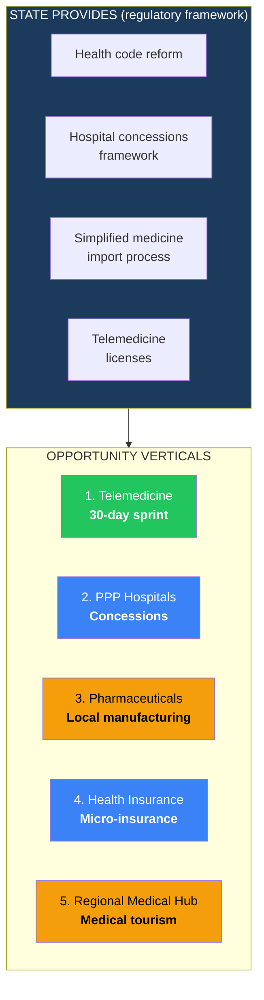
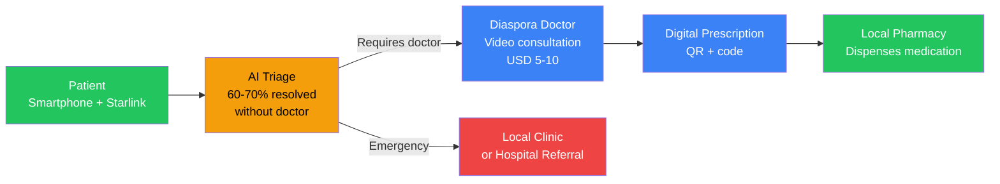
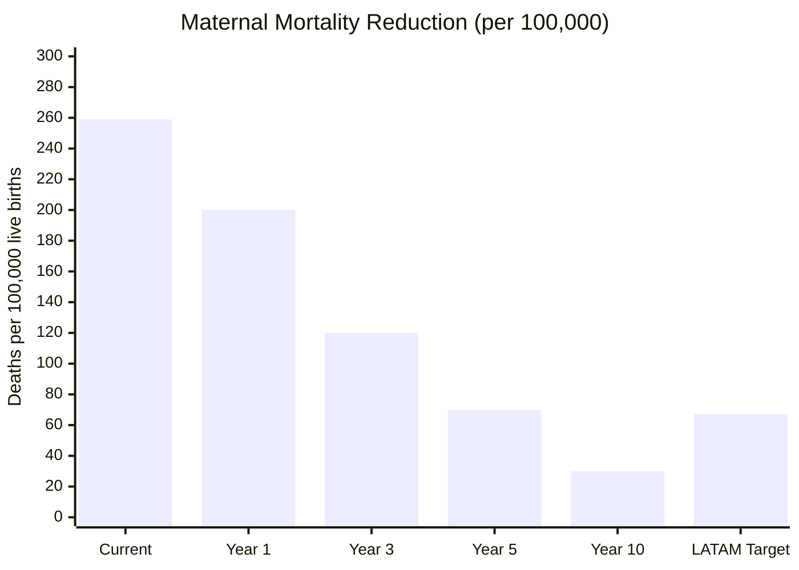

# Health & Telemedicine: Rebuilding a Healthcare System From Zero

> 80% of Venezuelan hospitals are non-functional. More than 30,000 doctors emigrated. The healthcare system collapsed. But that means there is no legacy to defend — a hybrid system (telemedicine + concession hospitals + local pharmaceuticals) can be built that is better than what existed before. The State provides the legal framework. Venezuela S.A. invests in base hospital infrastructure as a shareholder in JVs with private operators. Private capital builds and operates. The result: universal coverage in 5 years, not 30.

---

## 1. The Crisis: Anatomy of a Healthcare Collapse

:::danger Healthcare system in terminal state
Venezuela went from having one of the best healthcare systems in LATAM (1980s-90s) to a total collapse. This is not a crisis — it is an **active humanitarian emergency** declared by the UN. Maternal mortality increased 65%. Infant mortality increased 30%. Eradicated diseases (malaria, diphtheria, measles) returned. There are no medications, no equipment, no doctors.
:::

| Indicator | Venezuela (current) | LATAM Average | Reference Country | Source |
|-----------|-------------------|----------------|-------------------|--------|
| Maternal mortality | **259/100,000** live births | 67/100,000 | Chile: 13 | [WHO/PAHO 2024](https://www.paho.org/) |
| Infant mortality | **25.7/1,000** live births | 13.5/1,000 | Chile: 6.1 | [UNICEF 2024](https://www.unicef.org/) |
| Doctors per 10,000 pop. | **~8** (post-emigration) | 22 | Cuba: 84, Uruguay: 51 | [WHO 2024](https://www.who.int/) |
| Hospital beds/1,000 pop. | **~0.8** (functional) | 2.1 | Argentina: 5.0 | [WHO 2024](https://www.who.int/) |
| Functional hospitals | **~20%** of total | — | — | [HRW 2024](https://www.hrw.org/) |
| Emigrated doctors | **>30,000** | — | — | [Requires research] |
| Health spending % GDP | **~1.5%** | 7.3% | Costa Rica: 7.6% | [World Bank 2024](https://data.worldbank.org/) |
| Health spending per capita | **~USD 25** | USD 550 | Chile: USD 1,300 | [WHO 2024](https://www.who.int/) |
| Access to essential medicines | **<20%** availability | ~80% | — | [HRW/Provea 2024](https://www.hrw.org/) |

**Translation:** An average Venezuelan has access to USD 25/year in healthcare. A Chilean has USD 1,300. A Venezuelan woman is 3x more likely to die in childbirth than the LATAM average. And there are 3x fewer doctors per capita than the regional average.

### Medical human capital flight

| Specialty | Estimated Emigrants | % of Workforce | Main Destination |
|-----------|-------------------|---------------|-----------------|
| General medicine | ~15,000 | ~40% | Colombia, Chile, Spain |
| Nursing | ~10,000 | ~35% | Colombia, Peru, Chile |
| Specialists (surgery, anesthesia, etc.) | ~8,000 | ~50% | U.S., Spain, Chile |
| Lab technicians / bioanalysts | ~5,000 | ~45% | Colombia, Panama |
| **TOTAL estimated** | **>30,000** | **~40%** | — |

Source: estimates based on [UNHCR 2025](https://www.unhcr.org/), [PAHO 2024](https://www.paho.org/), Venezuelan medical association reports. [Requires research] for updated exact figures.

---

## 2. The Opportunity: USD 10-20B in 10 Years

:::info The LATAM digital health market is growing at 37.6% annually
The digital health market in Latin America is growing at a **CAGR of 37.6%** (2024-2030), projected to reach **USD 26B+ by 2030**. Venezuela is completely outside this market. Entering now — with the advantage of having no legacy — enables building a native digital system from day 1.
:::

| Market Data | Figure | Source |
|-------------|--------|--------|
| LATAM digital health market 2024 | **USD 4.5B** | [Grand View Research 2024](https://www.grandviewresearch.com/) |
| CAGR 2024-2030 | **37.6%** | [Grand View Research 2024](https://www.grandviewresearch.com/) |
| LATAM digital health market 2030 | **USD 26B+** | [Grand View Research 2024](https://www.grandviewresearch.com/) |
| Global telemedicine market 2025 | **USD 115B** | [Fortune Business Insights 2025](https://www.fortunebusinessinsights.com/) |
| Global telemedicine market 2032 | **USD 380B+** | [Fortune Business Insights 2025](https://www.fortunebusinessinsights.com/) |
| Potential Venezuela health spending (7% GDP) | **USD 5.8B/year** (at USD 82B GDP) | Own calculation based on LATAM average |
| Population without adequate coverage | **~25M people** (80%+) | [Requires research] |

### The 5 opportunity verticals



---

## 3. Vertical 1: Telemedicine — Healthcare in 30 Days Via Starlink

:::tip 30-day sprint: telemedicine with what already exists
You do not need to build hospitals to provide primary care. With **Starlink + smartphones + telemedicine platform + diaspora doctors**, basic medical consultation can be provided to millions of Venezuelans in **30 days**. It is not perfect. It does not replace a hospital. But a Venezuelan doctor in Madrid can diagnose a urinary tract infection via video call and prescribe antibiotics today.
:::

| Component | Detail |
|-----------|--------|
| **Connectivity** | Starlink in 1,000+ community centers/clinics. ~70% of population with smartphone |
| **Platform** | Telemedicine app with AI triage, video consultation, digital prescription, electronic health records |
| **Doctors** | 30,000+ Venezuelan doctors in the diaspora. Flexible hours. Paid in USD via fintech |
| **AI Triage** | AI chatbot (Babylon Health / Ada Health model) to filter consultations. 60-70% of primary care consultations are resolved without a doctor |
| **Prescription** | Digital prescription with QR code. Local pharmacy dispenses. Auditable, non-falsifiable |
| **Cost per consultation** | USD 3-10 (vs. USD 50-150 in-person in LATAM) |
| **Year 1 target** | 5M consultations/year = 400K consultations/month |
| **Year 3 target** | 20M consultations/year = primary coverage for 60%+ of population |

### How it works



### Potential investors and operators

| Company | Country | Expertise | Potential Role |
|---------|---------|-----------|---------------|
| **Teladoc Health** | U.S. | Global telemedicine leader. 90M+ members. USD 2.6B revenue | Platform + operations |
| **Babylon Health** | UK | AI triage + video consultation. Operates in Rwanda, UK | Model adaptable to emerging markets |
| **Ada Health** | Germany | AI triage engine. 15M+ users. 90%+ diagnostic accuracy | AI triage component |
| **Doctor Anytime** | Greece/LATAM | Telemedicine in emerging markets. Operates in LATAM | Regional operator |
| **1Doc3** | Colombia | LATAM telemedicine. 10M+ consultations. Operates in Colombia, Mexico | Nearby operator with regional expertise |
| **mDoc** | Nigeria | Telemedicine for African markets. Low-cost model | Low-cost model reference |

---

## 4. Vertical 2: PPP Hospitals — Private Concessions

### The model: concession, not state construction

| Aspect | Proposed Model | Failed Model (current) |
|--------|---------------|----------------------|
| **Who builds** | International private operator | State (CORPOELEC/Min. Health) |
| **Who operates** | Private operator with 20-30 year contract | State with underpaid staff |
| **Who regulates** | Autonomous regulatory body + international standards | Politicized Min. Health |
| **Financing** | PPP: private builds, government pays per service (capitation) | Public budget (never arrives) |
| **Standard** | JCI (Joint Commission International) or equivalent | No standard applied |
| **Accountability** | Measurable KPIs + penalties for non-compliance | Zero accountability |

### Hospital rehabilitation plan

| Phase | Hospitals | Type | Investment | Timeline | Operator Type |
|-------|-----------|------|-----------|----------|--------------|
| **Sprint** | 20 critical hospitals | Emergency rehabilitation: operating rooms, ICU, emergency, generators | USD 500M-1B | 6-12 months | Doctors Without Borders + private |
| **Phase 1** | 50 hospitals | Complete rehabilitation + modern equipment | USD 2-4B | 1-3 years | HCA Healthcare, Rede D'Or, Grupo Keralty |
| **Phase 2** | 100 hospitals | Long-term PPP concessions (20-30 years) | USD 4-8B | 3-7 years | International hospital chains |
| **Phase 3** | Complete network | 300+ health centers + specialized hospitals | USD 5-10B | 5-10 years | Mix of national and international operators |

### Potential hospital operators

| Company | Country | Size | Why They Would Participate |
|---------|---------|------|--------------------------|
| **HCA Healthcare** | U.S. | 182 hospitals, USD 65B revenue | World's largest hospital chain. PPP expertise |
| **Rede D'Or** | Brazil | 70+ hospitals, USD 10B+ revenue | LATAM's largest chain. Operates in emerging markets |
| **Grupo Keralty** | Colombia | 15+ hospitals, 8M+ affiliates | Operates in Colombia, Mexico, Peru. Integrated care model |
| **Fresenius Helios** | Germany | 86 hospitals in Europe | Expertise in markets with public regulation |
| **IHH Healthcare** | Malaysia | 80+ hospitals, 16 countries | Operates in Asia + Turkey. Emerging market expertise |
| **Apollo Hospitals** | India | 70+ hospitals | Low-cost + high-quality hospital model |

### Hospital financing

| Source | Estimated Amount | Mechanism |
|--------|-----------------|-----------|
| **IDB / World Bank** | USD 2-4B | Development loans for health |
| **DFC (U.S.)** | USD 1-3B | Health infrastructure financing |
| **Private PPPs** | USD 3-6B | Operators build, government pays per service |
| **Impact funds** | USD 500M-1B | Impact investors (health in emerging markets) |
| **GAVI / Global Fund** | USD 200-500M | Vaccination + infectious diseases |
| **Bilateral cooperation** | USD 500M-1B | Cuba (doctors), China (equipment), Spain (training) |
| **TOTAL** | **USD 8-16B** | |

---

## 5. Vertical 3: Pharmaceuticals — Local Manufacturing

:::info Venezuela manufactured 40% of its medicines. Now it manufactures less than 5%.
The Venezuelan pharmaceutical industry was destroyed by expropriations, price controls, and lack of foreign currency for raw materials. But the physical infrastructure partially exists, there is qualified personnel in the diaspora, and demand is urgent. Rebuilding local pharmaceutical manufacturing reduces costs, secures supply, and creates skilled employment.
:::

| Component | Detail |
|-----------|--------|
| **Demand** | ~USD 3B/year in medicines (estimated at 7% GDP health spending) |
| **Current local production** | <5% of demand |
| **Target** | 40-50% local production in 10 years |
| **Products** | Essential generics (WHO list), antibiotics, antihypertensives, insulin, basic vaccines |
| **Do not produce** | Complex biologics, advanced oncologics — import from India/Brazil |
| **Investment** | USD 500M-1B for 5-10 pharmaceutical plants |
| **Jobs** | 10,000-20,000 direct |

### Potential pharmaceutical operators

| Company | Country | Role | Why |
|---------|---------|------|-----|
| **Pfizer** | U.S. | Local manufacturing under license | Emerging market access program |
| **Roche** | Switzerland | Manufacturing + technology transfer | Operates plants in Brazil, Mexico |
| **Cipla** | India | Low-cost generics | Global leader in affordable generics. Exportable model |
| **Dr. Reddy's** | India | Generics + biosimilars | Operates plants in multiple emerging markets |
| **EMS** | Brazil | LATAM generics | LATAM's largest pharmaceutical by volume. Geographic proximity |
| **Tecnoquimicas** | Colombia | Generics + OTC | Operates in Andean region. Expertise in similar markets |

---

## 6. Vertical 4: Health Micro-Insurance

| Component | Detail |
|-----------|--------|
| **Problem** | <2% of the population has health insurance. Any emergency is catastrophic |
| **Product** | Digital micro-insurance: USD 5-15/month. Covers emergencies, consultations, basic medications |
| **Distribution** | Via fintech apps (Nubank, Mercado Pago). Cross-sell with bank account |
| **Revenue (year 5)** | USD 200-500M/year in premiums (at 5M insured x USD 100/year average) |
| **Operators** | BIMA (40M+ clients in emerging markets), Lemonade, revived local insurers |
| **Reference** | Kenya: M-TIBA (insurance via M-Pesa) has 4M+ beneficiaries |

---

## 7. Vertical 5: Regional Medical Hub (Phase 3)

| Component | Detail |
|-----------|--------|
| **Concept** | Venezuela as medical tourism destination for the Caribbean and Central America |
| **Timeline** | Year 5-10 (after hospital rehabilitation) |
| **Specializations** | Plastic surgery, dentistry, ophthalmology, orthopedics — high-volume procedures |
| **Advantage** | Costs 50-70% lower than the U.S. Proximity to the Caribbean. Spanish-speaking doctors |
| **Revenue** | USD 500M-1B/year (at 100K+ international patients/year) |
| **Reference** | Colombia: USD 1.5B/year in medical tourism. Costa Rica: USD 500M/year. India: USD 9B/year |
| **Prerequisite** | JCI-accredited hospitals, functional airports, security |

---

## 8. What the State Provides (and What Venezuela S.A. Invests In)

| The State provides (regulates) | Detail | Reference |
|-------------------------------|--------|-----------|
| **Health code reform** | Legal framework for telemedicine, digital prescription, electronic health records | Colombia: [Law 2015 of 2020 (telemedicine)](https://www.minsalud.gov.co/) |
| **Hospital concessions framework** | 20-30 year PPP contracts. Quality KPIs. Penalties for non-compliance | UK: [NHS PPP model](https://www.gov.uk/). Chile: hospital concessions |
| **Simplified medicine imports** | Fast-track for FDA/EMA-approved medicines. Elimination of tariffs on essentials | WHO essential list model + fast approval |
| **Telemedicine operator licenses** | Platform registration, doctor verification, quality standards | Brazil: [CFM telemedicine regulation 2022](https://portal.cfm.org.br/) |
| **Health professional return program** | Return visas, experience recognition, competitive salaries (USD 2,000-5,000/month) | Rwanda: post-genocide medical return program |
| **Cold chain** | Power grid infrastructure + logistics for vaccines and biologics | GAVI + UNICEF provide technical assistance |

| What neither the State nor Venezuela S.A. does | Why |
|-------------------------------------------------|-----|
| Operate hospitals directly | Min. Health regulates and supervises. Venezuela S.A. is a shareholder in hospital JVs, not an operator |
| Fix medicine prices by decree | Price controls destroyed the local pharmaceutical industry |
| Create a state-owned pharmaceutical company | Neither the State nor Venezuela S.A. manufactures — they license, regulate, purchase |
| Monopolize telemedicine | Multiple operators compete. The patient chooses |

---

## 9. Implementation Sprint

```mermaid
gantt
    title Health & Telemedicine — Timeline
    dateFormat YYYY
    axisFormat %Y

    section Sprint: Emergency (Days 1-180)
    Essential medicines imported              :crit, s1a, 2027, 90d
    Telemedicine: Starlink + pilot app        :crit, s1b, 2027, 30d
    Generators for 500 hospitals              :crit, s1c, 2027, 180d
    Mass vaccination                          :crit, s1d, 2027, 180d
    20 hospitals emergency rehabilitation     :s1e, 2027, 365d

    section Phase 1: Stabilization (Months 6-24)
    Telemedicine at scale (5M consultations)  :f1a, 2027, 730d
    50 hospitals rehabilitated PPP            :f1b, 2028, 730d
    Pharmaceuticals: 3 plants reactivated     :f1c, 2028, 730d
    Diaspora doctor return program            :f1d, 2027, 365d
    Health micro-insurance launch             :f1e, 2028, 365d

    section Phase 2: Expansion (Year 2-5)
    100 concession hospitals                  :f2a, 2029, 1095d
    Telemedicine 20M consultations/year       :f2b, 2029, 1095d
    5 pharmaceutical plants operating         :f2c, 2029, 730d
    5M people with micro-insurance            :f2d, 2029, 1095d
    JCI accreditation for first hospitals     :f2e, 2030, 730d

    section Phase 3: Regional Hub (Year 5-10)
    300+ health centers                       :f3a, 2032, 1825d
    Medical tourism operational               :f3b, 2033, 1095d
    40-50% medicines local production         :f3c, 2032, 1825d
    Caribbean medical hub                     :f3d, 2034, 1095d
```

### Emergency Sprint (Days 1-180): Stop People From Dying

| Action | Result | Cost | Who |
|--------|--------|------|-----|
| Mass import of essential medicines (WHO list) | 200+ medicines available at pharmacies | USD 200-500M | PAHO/WHO + UNICEF + Government |
| Telemedicine deployment (Starlink + app + diaspora doctors) | 400K consultations/month in 90 days | USD 20-50M | Telemedicine operator + SpaceX |
| Emergency generators for 500 hospitals | Hospitals can operate with electricity | USD 150-300M | Caterpillar, Cummins, Aggreko |
| Mass vaccination campaign (measles, diphtheria, polio, COVID) | 15M people vaccinated in 6 months | USD 100-200M | GAVI + UNICEF + PAHO |
| Emergency rehabilitation: 20 hospitals (operating rooms, ICU, emergency) | 20 hospitals operational for surgery and ICU | USD 500M-1B | MSF + private operators |
| **TOTAL SPRINT** | | **USD 1-2B** | |

:::caution Reality: telemedicine does not replace hospitals
Telemedicine resolves 60-70% of primary care consultations: infections, pain, chronic follow-up, mental health, dermatology. But it does not resolve a complicated delivery, a heart attack, a traffic accident, or cancer. **Hospitals are non-negotiable.** Telemedicine is the bridge while they are rehabilitated.
:::

---

## 10. Financial Projection

### Investment and revenue by phase

| Phase | Investment | Annual Revenue | Jobs | Key Indicator |
|-------|-----------|---------------|------|--------------|
| **Sprint (6 months)** | USD 1-2B | — | 5,000 (emergency) | Maternal mortality: -20% |
| **Phase 1 (year 1-2)** | USD 3-5B | USD 500M-1B | 30,000 | 50 functional hospitals, 5M tele consultations/year |
| **Phase 2 (year 2-5)** | USD 5-10B | USD 2-4B | 80,000 | 100 hospitals, 20M consultations, 5M insured |
| **Phase 3 (year 5-10)** | USD 5-10B | USD 5-8B | 150,000 | Regional hub, 300 centers, medical tourism |
| **TOTAL** | **USD 15-25B** | **USD 5-8B/year (year 10)** | **150,000+** | Health spending: from 1.5% to 7% of GDP |

### Health indicators — Projection

| Indicator | Current | Year 1 | Year 3 | Year 5 | Year 10 | LATAM Target |
|-----------|---------|--------|--------|--------|---------|-------------|
| Maternal mortality/100K | 259 | 200 | 120 | 70 | 30 | 67 |
| Infant mortality/1,000 | 25.7 | 20 | 14 | 10 | 7 | 13.5 |
| Doctors/10,000 pop. | 8 | 12 | 18 | 25 | 35 | 22 |
| Hospital beds/1,000 pop. | 0.8 | 1.2 | 1.8 | 2.5 | 3.5 | 2.1 |
| Health spending % GDP | 1.5% | 3% | 5% | 6% | 7%+ | 7.3% |
| Per capita spending USD | 25 | 75 | 200 | 400 | 800+ | 550 |
| Telemedicine consultations/year | 0 | 5M | 20M | 40M | 60M+ | — |
| Health insurance coverage | <2% | 5% | 15% | 30% | 60%+ | — |



### Job creation

| Category | Year 1 | Year 3 | Year 5 | Year 10 |
|----------|--------|--------|--------|---------|
| **Doctors and specialists** | 5,000 | 15,000 | 25,000 | 40,000 |
| **Nurses** | 8,000 | 20,000 | 35,000 | 50,000 |
| **Health technicians** | 3,000 | 8,000 | 15,000 | 25,000 |
| **Pharmaceuticals (manufacturing)** | 1,000 | 5,000 | 10,000 | 20,000 |
| **Tech (digital platforms)** | 2,000 | 5,000 | 8,000 | 15,000 |
| **Administrative and support** | 5,000 | 12,000 | 20,000 | 30,000 |
| **TOTAL** | **24,000** | **65,000** | **113,000** | **180,000** |

---

## 11. International Comparables

| Country | Model | Result | Lesson for Venezuela |
|---------|-------|--------|---------------------|
| **Rwanda** | Post-genocide reconstruction: from zero to functional health system in 20 years. Community insurance (Mutuelles de Sante) + telemedicine + blood delivery drones (Zipline) | Infant mortality: from 230 to 28/1,000. Insurance coverage: 91%. Life expectancy: from 29 to 69 years | If Rwanda could do it with USD 14B GDP, Venezuela with USD 82B and oil can go faster. Community micro-insurance is replicable |
| **India** | Mass telemedicine: eSanjeevani (50M+ consultations). Ayushman Bharat: health insurance for 500M people. Generic manufacturing: 20% of global volume | Digital health access for 200M+ rural people. India produces 60% of global vaccines | Telemedicine works at scale in lower-middle income countries. Generic manufacturing creates industry + sovereignty |
| **Brazil (SUS + private)** | Single health system (SUS) public + complementary private sector. 70% use SUS, 25% have private insurance | Universal legal coverage. World-class private hospitals (Einstein, Sirio-Libanes) + public primary care | The public-private hybrid model works better than solely public or solely private. Venezuela can start private-heavy and migrate |
| **Colombia** | Law 100 of 1993: mandatory universal insurance. EPS (insurers) + IPS (providers). 97% coverage | From 20% to 97% coverage in 25 years. Medical tourism USD 1.5B/year. JCI-accredited hospitals | The Colombian model is the closest and most replicable. Mandatory insurance + private operators + state regulation |
| **Turkey** | Healthcare transformation 2003-2013: from 60% to 99% coverage. Massive PPP hospitals (35+ hospitals) | Infant mortality: from 30 to 7/1,000 in 15 years. 35 "city hospitals" built via PPP | PPP hospitals can be built quickly. Turkey built 35 hospitals of 1,000+ beds in 10 years via concessions |
| **Estonia** | Digital health system: electronic health records since 2008. e-Prescription, e-Referral, tele-health | 99% of prescriptions are digital. All medical records accessible online | Starting digital from day 1 is cheaper than digitizing a legacy system. Venezuela can do what Estonia did but with smartphones |

Sources: [Rwanda MoH](https://www.moh.gov.rw/); [eSanjeevani India](https://esanjeevani.mohfw.gov.in/); [SUS Brazil](https://www.gov.br/saude/); [MinSalud Colombia](https://www.minsalud.gov.co/); [Turkey MoH PPP](https://www.saglik.gov.tr/); [e-Estonia](https://e-estonia.com/).

---

## 12. Risks and Mitigations

| # | Risk | Prob. | Impact | Mitigation |
|---|------|-------|--------|------------|
| 1 | **Not enough doctors return** | Medium | Critical | Competitive salaries (USD 2,000-5,000/month), housing, dignified working conditions. Telemedicine covers initial gap |
| 2 | **PPPs fail due to corruption** | High | Critical | International tenders, IDB/World Bank oversight, public KPIs, contractual penalties |
| 3 | **Power grid does not support hospitals** | High | Critical | Dedicated generators + solar + batteries per hospital. Do not depend on the national grid |
| 4 | **Broken cold chain (vaccines)** | High | High | Zipline-type drones (Rwanda) + solar refrigerators + Starlink for monitoring |
| 5 | **Counterfeit medicines** | Medium | High | Blockchain traceability + QR code on every package + criminal penalties |
| 6 | **Low telemedicine adoption** | Medium | Medium | Free for primary care. Integrated with fintech (automatic payment). Marketing via diaspora |
| 7 | **Sanctions limit medical equipment imports** | Medium | High | OFAC humanitarian licenses (already exist). Non-U.S. manufacturer equipment (Siemens Healthineers, Philips) |
| 8 | **Continued health worker exodus** | Medium | High | Competitive working conditions + professional opportunity + social impact. If the country improves, they return |

---

## 13. Executive Summary

| Parameter | Value |
|-----------|-------|
| **Crisis** | 80% hospitals non-functional, 30K+ doctors emigrated, maternal mortality 4x LATAM average |
| **Total investment (10 years)** | **USD 15-25B** |
| **Health sector revenue (year 10)** | **USD 5-8B/year** (7%+ of GDP) |
| **Jobs (year 10)** | **150-180K** direct |
| **Telemedicine sprint** | **30 days** with Starlink + smartphones + diaspora doctors |
| **PPP Hospitals** | 100+ concession hospitals in 5 years |
| **Local pharmaceutical production** | 40-50% of demand in 10 years |
| **Health insurance coverage** | From <2% to 60%+ in 10 years |
| **Model** | Government regulates + grants concessions. Private sector operates hospitals, fintechs distribute insurance, diaspora provides doctors via telemedicine |
| **Comparable** | Rwanda: from genocide to 91% coverage. Turkey: 35 PPP hospitals in 10 years. Colombia: 97% insurance |

:::danger There is no national reconstruction plan without health
A country where mothers die in childbirth, children die of diarrhea, and a heart attack means a death sentence — does not attract investment, does not retain talent, does not grow. **Health is not an expense. It is the most basic investment in human capital.** Without healthy people there are no workers, no entrepreneurs, no engineers, no country.

**USD 15-25B in health over 10 years seems like a lot.** But Venezuela spends USD 25/person/year on health — a middle-income country should spend USD 500+. The gap is **USD 12-15B/year**. Every year that passes without investing, lives are lost, professionals are lost, the future is lost.
:::

---

## Related Documents

- [Telecommunications](./telecomunicaciones) — Connectivity enabling telemedicine and digital health records
- [Electrical Capacity](./capacidad-electrica) — Reliable power supply for hospitals, cold chain, and medical equipment
- [Education & EdTech](./educacion-edtech) — Health professional training and health education programs
- [FinTech & Digital Banking](./fintech-banca-digital) — Digital health insurance, micro-payments, and treatment financing
- [Water & Sanitation](./agua-saneamiento) — Direct public health determinant; potable water reduces hospital burden
- [Concession Model](./modelo-concesiones) — PPP framework for hospitals, laboratories, and concession pharmacies

---

Sources: [WHO](https://www.who.int/); [PAHO](https://www.paho.org/); [UNICEF](https://www.unicef.org/); [HRW 2024](https://www.hrw.org/); [Grand View Research — Digital Health LATAM](https://www.grandviewresearch.com/); [Fortune Business Insights — Telemedicine](https://www.fortunebusinessinsights.com/); [World Bank](https://data.worldbank.org/); [GAVI](https://www.gavi.org/); [Rwanda MoH](https://www.moh.gov.rw/).
