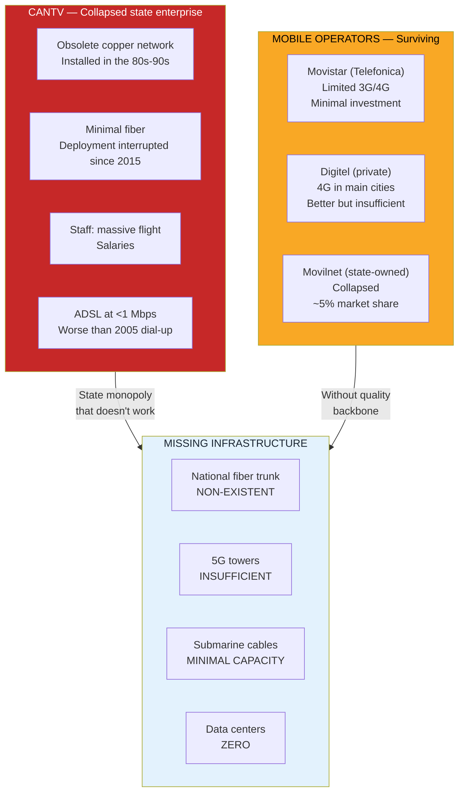
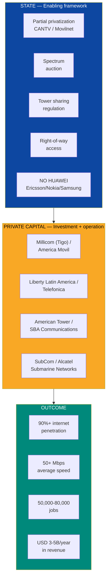
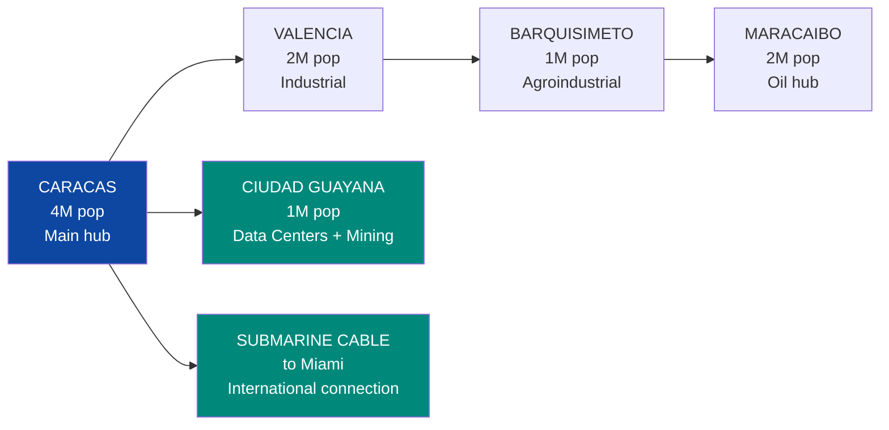
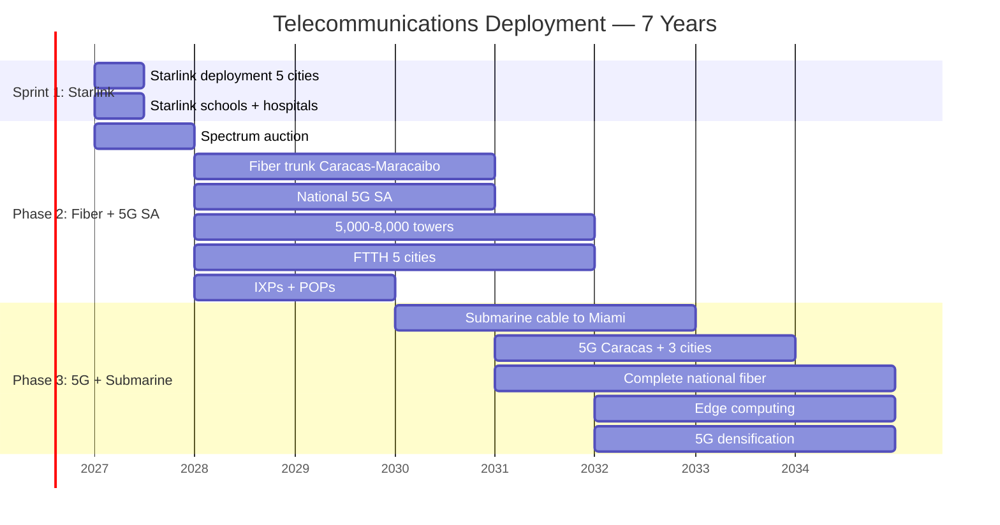
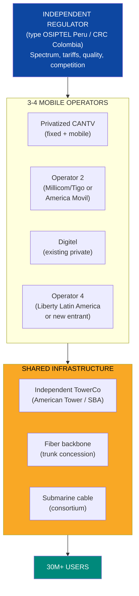
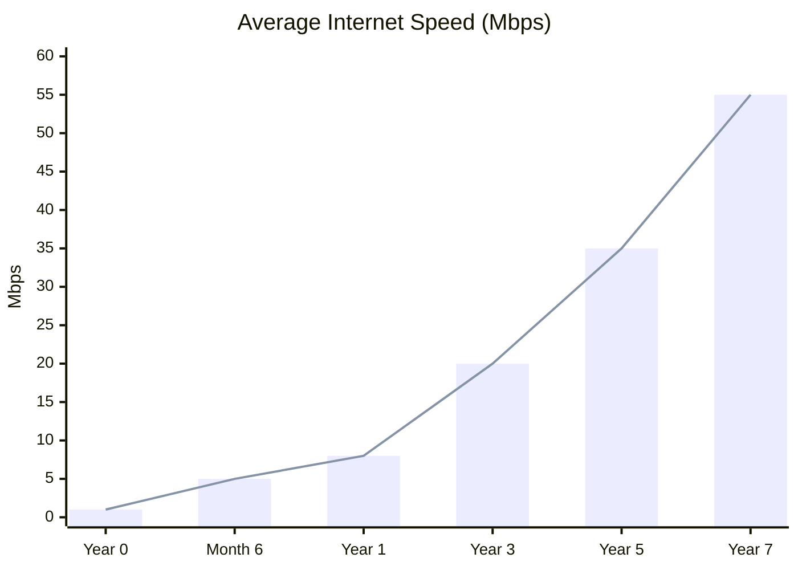

# Telecommunications: No Internet, No 21st Century

> Venezuela has the slowest internet speed in LATAM. A country that wants to attract data centers, tech hubs, a digital state, and AI startups cannot operate at **<1 Mbps**. Telecoms are the highway that enables everything digital — and today that highway doesn't exist.

---

## 1. The Crisis: The Most Disconnected Country in the Americas

:::danger Disconnection snapshot
Venezuela has an average download speed **stuck below 1 Mbps for a decade** — [SIGCOMM/Northwestern 2024](https://estcarisimo.github.io/assets/pdf/papers/2024-sigcomm-venezuela.pdf). While the LATAM median is ~20 Mbps, Venezuela is at the bottom. Only **48% of households** have internet access — [Freedom House 2024](https://freedomhouse.org/country/venezuela/freedom-net/2024). In **7 of 23 states, penetration is below 30%**. CANTV (state telecom company) has collapsed — it is transferred to Venezuela S.A. as an asset of the citizen holding company and partially privatized or contributed as equity in JVs with international operators.
:::

| Indicator | Venezuela (current) | LATAM Average | Year 5 Target | Year 10 Target |
|-----------|-------------------|----------------|-----------|------------|
| **Download speed** | **<1 Mbps** | ~20 Mbps | 15 Mbps | 50+ Mbps |
| **Household penetration** | **48%** | ~70% | 70% | 90%+ |
| **Fixed broadband** | **9.58%** | ~15% | 20% | 40% |
| **Mobile broadband** | **52.3%** | ~75% | 65% | 85%+ |
| **4G** | Limited (Movistar/Digitel) | Widespread | National | National |
| **5G** | **0** | Deploying | 3 cities | Urban coverage |
| **Fiber optic backbone** | Deteriorated/non-existent | Extensive | Main trunk | National |

Sources: [Freedom House 2024](https://freedomhouse.org/country/venezuela/freedom-net/2024); [SIGCOMM/Northwestern 2024](https://estcarisimo.github.io/assets/pdf/papers/2024-sigcomm-venezuela.pdf); [ITU Broadband Commission](https://www.broadbandcommission.org/).

### The collapse map

### What's missing vs. what exists

| Component | Current State | What's Needed | Gap |
|-----------|---------------|-----------------|--------|
| **Fiber trunk** | ~15,000 km (CANTV, mostly deteriorated) | 50,000+ km national fiber optic | ~35,000 km |
| **Telecom towers** | ~5,000 (estimated, many unmaintained) | 15,000-20,000 towers (5G SA) | ~10,000-15,000 towers |
| **Submarine cables** | Limited connection via ARCOS-1 cable | Dedicated capacity to Miami + redundancy | New cable or upgrade |
| **Data centers (IX/POP)** | ~2-3 minimal points | 10-20 IXP + 5+ Tier III+ data centers | From scratch |
| **Assigned spectrum** | No formal 5G auction | Auction of 700 MHz, 2.5 GHz, 3.5 GHz, mmWave | From scratch |

---

## 2. The Opportunity: USD 3-5B/Year in a Market with No Competition

:::info 30 million people without decent internet — that's a market
Venezuela's telecom market is among the most underserved in the world. 30+ million people with smartphones but no working internet. It's like having 30 million customers who WANT to pay but have no one to pay. For a telecom operator, this is a greenfield with guaranteed demand.
:::

| Segment | Estimated Size | Model |
|----------|-----------------|--------|
| **Mobile services (voice + data)** | USD 1.5-3B/year | Operating licenses |
| **Fixed broadband (FTTH fiber)** | USD 500M-1B/year | Infrastructure concession |
| **Enterprise services (B2B)** | USD 300-500M/year | Business connectivity |
| **Towers and sites** | USD 200-400M/year | Independent TowerCo |
| **Submarine cables and backbone** | USD 200-500M (investment) | International consortium |
| **Digital services (IoT, cloud, cybersecurity)** | USD 300-500M/year | Service contracts |
| **TOTAL annual market (at scale)** | **USD 3-5B/year** | |
| **Total investment required** | **USD 5-10B** (over 7 years) | |

---

## 3. The Solution: Starlink Sprint + Fiber + 5G SA

### Guiding principle: break CANTV's monopoly

:::danger Non-negotiable geopolitical condition: NO HUAWEI
The relationship with the U.S. is the sine qua non condition for sanctions relief. Using **Huawei or ZTE** equipment for 5G or critical telecom infrastructure is an **absolute deal-breaker** for Washington. Marco Rubio (Secretary of State) has said so explicitly. Ericsson/Nokia/Samsung equipment may cost 10-20% more, but the cost of choosing Huawei is **losing USD 550-750B in total plan investment**.

| Provider | Country | U.S. Status | Role |
|-----------|------|-------------------|-----|
| **Ericsson** | Sweden | Approved — preferred provider | 5G RAN, core, fiber |
| **Nokia** | Finland | Approved — Pentagon contracts | 5G, fiber, networking |
| **Samsung** | South Korea | Approved — Verizon/AT&T provider | 5G RAN |
| ~~Huawei~~ | ~~China~~ | **BANNED** — Entity List | ~~None~~ |
| ~~ZTE~~ | ~~China~~ | **BANNED** — Entity List | ~~None~~ |
:::

### Sprint 1: Starlink for 5 Cities (Month 1-6) — Already Planned

**Objective:** First-world internet in weeks, not years.

| Component | Detail |
|------------|---------|
| **What** | Deployment of Starlink Business + Residential in 5 main cities + ZEETs |
| **Speed** | Business: 350+ Mbps; Residential: 100-200 Mbps |
| **Coverage** | Caracas, Maracaibo, Valencia, Barquisimeto, Ciudad Guayana |
| **Terminals** | ~3,500 (500 Business + 2,000 schools/hospitals + 1,000 community) |
| **Annual cost** | USD 18-35M/year |
| **For whom** | ZEETs, tech hubs, hospitals, schools, community access points |
| **Timeline** | **6 months** from contract |

:::tip Starlink is the bridge, not the destination
Starlink solves the connectivity emergency: data centers, tech hubs, and hospitals operate with first-world internet **from month 6** while the fiber is built. It's the difference between waiting 5 years or starting now. But Starlink doesn't scale to 30M people — for that you need fiber + 5G SA.
:::

### Phase 2: Fiber Backbone + National 5G SA (Year 1-4)

**Objective:** Permanent connectivity infrastructure.

| Component | Detail | Investment | Timeline |
|-----------|---------|-----------|----------|
| **National fiber trunk** | Caracas-Valencia-Barquisimeto-Maracaibo corridor (~1,200 km) | USD 500M-1B | 18-36 months |
| **Urban fiber (FTTH)** | Fiber to the home in 5 main cities | USD 500M-1B | 24-48 months |
| **National 5G SA** | 5G SA coverage for 90%+ of population | USD 1-2B | 24-36 months |
| **New towers** | 5,000-8,000 towers (greenfield + rehabilitation) | USD 500M-1B | 24-48 months |
| **IXP + POPs** | 5-10 Internet Exchange Points in main cities | USD 50-100M | 12-24 months |
| **Spectrum auction** | 700 MHz (coverage), 2.5 GHz (capacity), 3.5 GHz (5G) | Revenue for government | Year 1 |
| **TOTAL PHASE 2** | | **USD 3-5B** | |

**Priority fiber corridor:**

### Phase 3: 5G + Submarine Cable (Year 4-7)

**Objective:** World-class connectivity.

| Component | Detail | Investment | Timeline |
|-----------|---------|-----------|----------|
| **5G in main cities** | Caracas, Maracaibo, Valencia, Barquisimeto (Ericsson/Nokia/Samsung) | USD 1-2B | 36-60 months |
| **Submarine cable** | New cable or dedicated capacity on existing cable to Miami | USD 200-500M | 24-48 months |
| **Complete national fiber** | 30,000+ km, 80%+ urban household coverage | USD 1-2B | 48-72 months |
| **Additional towers** | 5,000-7,000 more towers for 5G densification | USD 500M-1B | 48-72 months |
| **Edge computing** | Distributed processing nodes in cities | USD 100-300M | 48-72 months |
| **TOTAL PHASE 3** | | **USD 3-6B** | |

---

## 4. Business Model: Privatization + Competition + Tower Sharing

### CANTV: privatize or die

:::danger CANTV cannot be reformed — it must be privatized
CANTV was [nationalized in 2007](https://en.wikipedia.org/wiki/CANTV) by Hugo Chavez (USD 572M). Since then: zero network investment, engineer exodus, speeds that regressed to 2000s levels. CANTV operates an 80s copper network with ADSL delivering <1 Mbps. There is no gradual fix. The solution is **partial privatization + new licenses** for competitors — exactly what Chile did with Entel in the 90s.
:::

| Option | Description | Precedent |
|--------|-------------|-----------|
| **Full privatization** | Sale of CANTV to international operator | Chile: Entel → Telefonica |
| **Partial privatization** (recommended) | 51% private / 49% State. Operator brings investment + management | Colombia: ETB Bogota |
| **Operating concession** | State maintains ownership, private operator manages | Argentina: Telecom/Telefonica (90s) |
| **Liquidation + new licenses** | Shut down CANTV, license 3-4 new operators | — |

**Recommendation:** Partial privatization of CANTV (51% to international operator) + 2-3 new licenses for competitors. The State retains 49% as long-term revenue. Movilnet is merged or sold separately.

### Proposed market structure

### Tower sharing: the efficiency key

| Concept | Description | Benefit |
|----------|-------------|----------|
| **Independent TowerCo** | Company that owns and leases towers to all operators | Eliminates duplication. Each tower serves 3-4 operators |
| **Mandatory tower sharing** | Regulator requires all new towers to be shared | Reduces total investment by 30-40% |
| **Model** | American Tower, SBA Communications, Cellnex | Operate 200,000+ towers globally |
| **TowerCo revenue** | USD 1,000-2,000/tower/month per operator | With 15,000 towers: USD 200-400M/year |

:::info Tower sharing is a global standard — Venezuela shouldn't reinvent
In Colombia, India, Brazil, and Mexico, towers are owned by independent TowerCos that lease them to all operators. This eliminates the absurd duplication of each operator building its own tower next to the competitor's. With 15,000-20,000 shared towers, Venezuela can cover 90%+ of the population. Without sharing, it would need 40,000+ towers — 3x more expensive.
:::

### Sector revenue

| Business Line | Description | Estimated Revenue (at scale, year 7) |
|-----------------|-------------|-------------------------------------|
| **Mobile services** (voice + data) | 20M+ subscribers, ARPU USD 8-15/month | USD 2-3B/year |
| **Fixed broadband** (fiber + ADSL) | 3-5M subscribers, ARPU USD 15-30/month | USD 500M-1.5B/year |
| **Enterprise** (B2B, cloud, VPN) | Businesses, government, institutions | USD 300-500M/year |
| **Towers** (TowerCo) | 15,000-20,000 towers, 3-4 operators per tower | USD 200-400M/year |
| **TOTAL** | | **USD 3-5B/year** |

---

## 5. Required Infrastructure

| Component | What's Needed | Estimated Cost | Timeline | Potential Provider |
|------------|----------------|----------------|----------|---------------------|
| **Fiber trunk** | 30,000+ km national fiber optic | USD 1-2B | 3-5 years | Ericsson, Nokia, Corning |
| **FTTH (fiber to the home)** | Fiber to 3-5M households in main cities | USD 1-2B | 3-7 years | Operators + contractors |
| **5G towers** | 10,000-15,000 new towers + rehabilitation | USD 1-2B | 3-7 years | American Tower, SBA |
| **5G SA RAN equipment** | Base stations for national coverage | USD 500M-1B | 2-3 years | Ericsson, Nokia, Samsung |
| **5G RAN equipment** | Base stations for main cities | USD 500M-1B | 4-7 years | Ericsson, Nokia, Samsung |
| **Submarine cable** | New cable or capacity on existing cable to Miami | USD 200-500M | 2-4 years | SubCom, Alcatel Submarine |
| **IXPs + POPs** | 10-20 exchange points | USD 50-100M | 1-2 years | Equinix, DE-CIX |
| **Carrier-neutral data centers** | 3-5 content hosting facilities | USD 200-500M | 2-5 years | Equinix, Digital Realty |
| **Starlink (bridge)** | 3,500+ terminals | USD 18-35M/year | 1-6 months | SpaceX |
| **TOTAL** | | **USD 5-10B** | **7 years** | |

---

## 6. Spectrum Auction: Revenue for the Government

:::tip The spectrum auction is immediate revenue for the State
Auctioning spectrum for 5G generates significant revenue — and attracts investment from operators who pay for the license and commit to investing in infrastructure. Colombia raised **USD 1.1B** in its 2024 spectrum auction. Brazil raised **USD 8.5B** in 2021. Venezuela, with 30M+ people and a virgin market, can raise **USD 500M-1.5B**.
:::

| Band | Use | Estimated Price | Who Competes |
|-------|-----|-----------------|---------------|
| **700 MHz** | 5G SA rural coverage | USD 100-300M | Privatized CANTV, Digitel, new entrant |
| **2,500 MHz (AWS)** | 5G SA urban capacity | USD 100-300M | All operators |
| **3,500 MHz** | Primary 5G | USD 200-500M | All operators |
| **26/28 GHz (mmWave)** | Ultra-fast 5G, data centers | USD 50-200M | Operators + enterprise |
| **TOTAL** | | **USD 500M-1.5B** | |

### Auction conditions

| Condition | Description | Why It Matters |
|-----------|-------------|-----------------|
| **Mandatory coverage** | Cover 70% of population in 3 years, 90% in 5 years | Prevent operators from investing only in profitable cities |
| **Minimum investment** | USD 500M+ per operator in 5 years | Guarantee real deployment |
| **Tower sharing** | Mandatory for all new towers | Efficiency, reduced costs |
| **NO Huawei/ZTE** | Equipment only from approved providers | Geopolitical condition |
| **License duration** | 20 years renewable | Investment certainty |

---

## 7. Comparables: Who Has Done It

### Rwanda: nationwide 4G in 3 years

| Indicator | Rwanda 2013 | Rwanda 2016 | Rwanda 2025 | Source |
|-----------|-----------|-----------|-----------|--------|
| 4G coverage | 0% | **95%** | 99%+ | [Korea Telecom/Olleh Rwanda Networks](https://www.kt.com/) |
| Internet penetration | ~8% | ~30% | **60%+** | [World Bank](https://www.worldbank.org/) |
| Average speed | <1 Mbps | 10 Mbps | 20+ Mbps | ITU |
| Investment | — | **USD 350M** (Korea Telecom) | Continued | — |

**Lesson:** Rwanda, with a GDP of USD 14B (6x smaller than Venezuela), achieved nationwide 4G in 3 years through a **partnership with Korea Telecom**. If Rwanda could do it, Venezuela with USD 82B GDP and 30M+ potential subscribers can do it faster. The key was political will + committed technology partner.

### Colombia: telecom liberalization

| Indicator | Colombia 2005 | Colombia 2025 | How |
|-----------|-------------|-------------|------|
| Mobile operators | 3 | **4+** (Claro, Movistar, Tigo, WOM) | Spectrum auctions |
| Mobile penetration | ~50% | **85%+** | Competition + prepaid |
| 4G coverage | 0% | **95%+** | Operator investment |
| Average speed | ~2 Mbps | **25+ Mbps** | Fiber + 4G |
| Regulator | CRT | CRC (modern, independent) | Institutional reform |

Source: [CRC Colombia](https://www.crcom.gov.co/).

**Lesson:** Colombia created real competition with 4 mobile operators (Claro, Movistar, Tigo, WOM). WOM's entry (2020) lowered prices 30-40% and forced incumbents to invest. Venezuela needs at least 3-4 competing operators for the market to function.

### Chile: from state-owned Entel to LATAM digital leader

| Indicator | Chile 1990 | Chile 2025 | Source |
|-----------|-----------|-----------|--------|
| Entel (state-owned) | Inefficient monopoly | Privatized (1992), today top 3 operator | [Entel Chile](https://www.entel.cl/) |
| Internet penetration | <5% | **92%+** | [SUBTEL](https://www.subtel.gob.cl/) |
| Operators | 1 (Entel) | **5+** (Entel, Movistar, Claro, WOM, GTD) | — |
| 5G | 0 | **Deploying** (Entel + WOM) | — |
| Average speed | — | **80+ Mbps** | Speedtest Global Index |

**Lesson:** Chile privatized Entel in 1992 and opened the market to competitors. 30 years later it has 92%+ penetration, 5 operators, and speeds of 80+ Mbps. It's the exact model Venezuela needs to apply with CANTV.

---

## 8. Potential Partners

| Company/Entity | Country | Experience | Role in Venezuela |
|------------------|------|------------|-----------------|
| **Millicom (Tigo)** | Luxembourg/Sweden | Operator in 10 LATAM countries (Colombia, Bolivia, Paraguay, Guatemala, etc.) | Mobile + fixed operator. Emerging markets are their core |
| **America Movil (Claro)** | Mexico | Largest LATAM operator. 290M+ subscribers | Mobile + fixed operator. Scale for massive investment |
| **Liberty Latin America** | U.S./Caribbean | Operator in Caribbean and LATAM (Cable & Wireless, VTR Chile) | Operator + submarine cable + broadband |
| **Telefonica (Movistar)** | Spain | Already operates in Venezuela. Knows the market | 5G SA expansion if conditions improve |
| **Digitel** | Venezuela | Private operator, best current service | Expansion with new investment + spectrum |
| **American Tower** | U.S. | 220,000+ towers globally. Present in Brazil, Mexico, Colombia | Independent TowerCo |
| **SBA Communications** | U.S. | 55,000+ towers. LATAM presence | Alternative TowerCo |
| **Ericsson** | Sweden | Global 5G leader. U.S.-approved provider | 5G SA RAN equipment + fiber |
| **Nokia** | Finland | #2 global in 5G infrastructure | Equipment + network management software |
| **Samsung Networks** | South Korea | 5G RAN for Verizon/AT&T | 5G equipment |
| **SubCom** | U.S. | #1 in submarine cables | New Venezuela-Miami cable |
| **Corning** | U.S. | World's largest fiber optic manufacturer | Fiber for backbone and FTTH |
| **Korea Telecom** | South Korea | Nationwide 4G in Rwanda in 3 years | Technology partner for accelerated deployment |
| **SpaceX (Starlink)** | U.S. | Global satellite internet | Immediate bridge (already planned) |
| **DFC (U.S.)** | U.S. | Finances infrastructure in allied countries | Financing for fiber + towers |

---

## 9. Job Creation

| Category | Sprint 1 | Phase 2 | Phase 3 (cumulative) |
|-----------|----------|--------|---------------------|
| **Construction** (fiber, towers, wiring) | 1,000-2,000 | 15,000-25,000 | Rotational |
| **Telecom engineering** | 500-1,000 | 3,000-5,000 | 5,000-8,000 |
| **Operations and maintenance** | 200-500 | 3,000-5,000 | 8,000-12,000 |
| **Sales and customer service** | 500-1,000 | 5,000-8,000 | 10,000-15,000 |
| **Software development and IT** | 100-300 | 1,000-2,000 | 3,000-5,000 |
| **Indirect jobs** | 2,000-4,000 | 15,000-25,000 | 25,000-40,000 |
| **TOTAL** | **4,300-8,800** | **42,000-70,000** | **51,000-80,000** |

:::info Telecoms is the largest possible tech employer
A developed telecom sector employs **1-2% of a country's labor force**. For Venezuela (15M workers), that's **150,000-300,000 direct and indirect jobs** at maturity. From tower technicians to app developers, from store salespeople to network engineers. These are middle-class jobs: salaries of USD 500-3,000/month.
:::

---

## 10. Risks and Mitigations

| # | Risk | Prob. | Impact | Mitigation |
|---|--------|-------|---------|------------|
| 1 | **CANTV is not privatized** — political or union resistance | High | Critical | Partial privatization (less resistance). If not privatized, new licenses + open competition to make it irrelevant |
| 2 | **Spectrum auction doesn't attract operators** — high country risk | Medium | Critical | Spectrum PPAs with competitive conditions. Investment protection guarantees (BIT, ICSID) |
| 3 | **Infrastructure theft** — cables, towers, equipment | High | High | Towers with security + remote monitoring. Buried fiber (not aerial). Community as ally (local jobs) |
| 4 | **Operators don't invest enough** — capture license but under-invest | Medium | High | Mandatory coverage conditions with penalties for non-compliance. Investment schedule in contract |
| 5 | **Starlink competition** — satellite replaces fiber | Low | Medium | Starlink is a complement, not a substitute. Fiber latency and capacity are superior for enterprise and data centers |
| 6 | **Shortage of telecom technicians** | High | High | Accelerated training programs (6-12 months for tower technicians, 18-24 months for network engineers). Diaspora repatriation |
| 7 | **Corruption in auctions and contracts** | High | High | Open auction with international oversight (ITU + World Bank). Bid transparency |
| 8 | **State interference with regulator** | Medium | High | Budgetary independence + appointment by competitive process (CRC Colombia, OSIPTEL Peru model) |

---

## 11. 7-Year Projection

| Indicator | Year 0 (current) | Month 6 | Year 1 | Year 3 | Year 5 | Year 7 |
|-----------|----------------|-------|-------|-------|-------|-------|
| **Average speed (Mbps)** | <1 | 5 (Starlink) | 8 | 20 | 35 | 50+ |
| **Internet penetration (%)** | 48% | 52% | 58% | 70% | 82% | 90%+ |
| **Mobile subscribers (M)** | ~15 | 16 | 18 | 22 | 27 | 30+ |
| **Fixed fiber subscribers (M)** | ~0.1 | 0.1 | 0.3 | 1.5 | 3 | 5+ |
| **5G SA coverage (%)** | 0% | 0% | 15% | 50% | 80% | 95%+ |
| **5G coverage (%)** | 0% | 0% | 0% | 0% | 15% | 40%+ |
| **Towers (thousands)** | ~5 | 5.5 | 7 | 12 | 17 | 20+ |
| **Fiber trunk (km)** | ~15,000 | 15,000 | 18,000 | 30,000 | 40,000 | 50,000+ |
| **Cumulative investment (USD M)** | 0 | 50 | 500 | 3,000 | 6,000 | 9,000 |
| **Direct jobs** | ~10,000 | 12,000 | 18,000 | 35,000 | 55,000 | 65,000+ |
| **Sector gross revenue (USD M/year)** | ~500 | 550 | 800 | 1,800 | 3,000 | 4,500 |

---

## 12. Contribution to the Venezuela S.A. Plan

| Parameter | Value |
|-----------|-------|
| **Total investment** | USD 5-10B over 7 years |
| **Annual market (year 7)** | USD 3-5B/year |
| **Model** | CANTV privatization + 3-4 operators + TowerCo + independent regulator |
| **Speed target** | 50+ Mbps average (from <1 Mbps current) |
| **Penetration target** | 90%+ (from 48% current) |
| **Jobs** | 50,000-80,000 direct + indirect |
| **Geopolitical condition** | Ericsson/Nokia/Samsung ONLY. Zero Huawei/ZTE |
| **Spectrum auction revenue** | USD 500M-1.5B (one-time for government) |
| **Data center synergy** | Fiber backbone + submarine cable enable the Bolivar DC Corridor |
| **Digital state synergy** | 90%+ internet = viable e-government (Estonia model) |

:::tip Connectivity is the country's nervous system
Without telecoms: there's no digital state (Estonia needs internet to function), no data centers (no fiber means no clients), no tech hubs (programmers need internet), no telemedicine (rural hospitals remain isolated), no e-commerce (the digital economy doesn't exist), no online education (schools stay in the 20th century).

**Every USD 1 invested in telecoms generates USD 3-4 in GDP** — [ITU/UNESCO Broadband Commission](https://www.broadbandcommission.org/). It's the investment with the highest economic multiplier in the plan.

**Internet is the oil of the 21st century. And Venezuela is producing at <1 Mbps.**
:::

---

## Related Documents

- [AI Data Centers](./data-centers-ia) — Data centers require fiber optic and high-speed connectivity
- [Electrical Capacity](./capacidad-electrica) — Reliable electricity for telecom towers and base stations
- [Education & EdTech](./educacion-edtech) — Starlink and fiber connectivity in schools as an educational prerequisite
- [Health & Telemedicine](./salud-telemedicina) — Telemedicine requires connectivity in hospitals and health centers
- [FinTech & Digital Banking](./fintech-banca-digital) — Digital payments and financial inclusion require mobile connectivity
- [Tourism](./turismo) — Connectivity at tourist destinations for digital nomads
- [Concession Model](./modelo-concesiones) — Telecommunications concessions (5G SA + FTTH, 50 years)

---

## Sources

| # | Source | Data |
|---|--------|------|
| 1 | [SIGCOMM/Northwestern 2024](https://estcarisimo.github.io/assets/pdf/papers/2024-sigcomm-venezuela.pdf) | Speed <1 Mbps stuck for a decade |
| 2 | [Freedom House 2024](https://freedomhouse.org/country/venezuela/freedom-net/2024) | 48% households with internet, 7/23 states <30% |
| 3 | [ITU Broadband Commission](https://www.broadbandcommission.org/) | USD 1 in telecoms = USD 3-4 in GDP |
| 4 | [CRC Colombia](https://www.crcom.gov.co/) | Telecom regulator model |
| 5 | [SUBTEL Chile](https://www.subtel.gob.cl/) | Chile: 92%+ internet penetration |
| 6 | [Korea Telecom — Rwanda 4G](https://www.kt.com/) | Nationwide 4G in 3 years |
| 7 | [World Bank — Rwanda](https://www.worldbank.org/) | Rwanda internet penetration |
| 8 | [Speedtest Global Index](https://www.speedtest.net/global-index) | Global internet speeds |
| 9 | [American Tower](https://www.americantower.com/) | TowerCo model, 220,000+ towers |
| 10 | [SubCom](https://www.subcom.com/) | Submarine cables |
| 11 | [Starlink](https://www.starlink.com/) | 2025 prices and speeds |
| 12 | [CANTV Wikipedia](https://en.wikipedia.org/wiki/CANTV) | 2007 nationalization, history |
