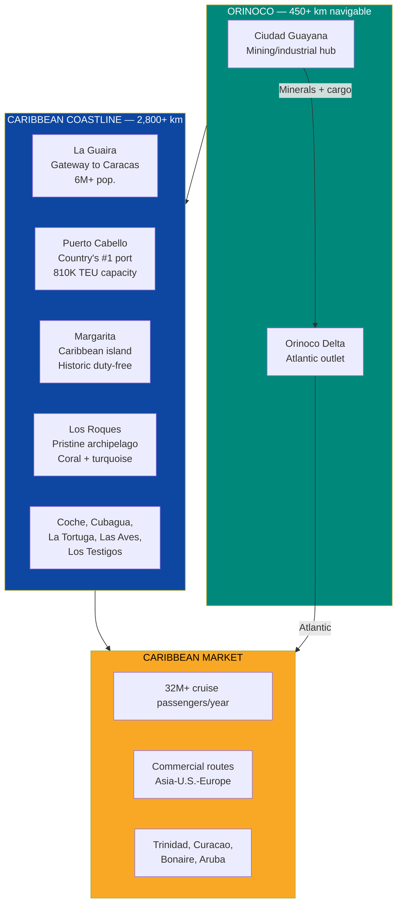
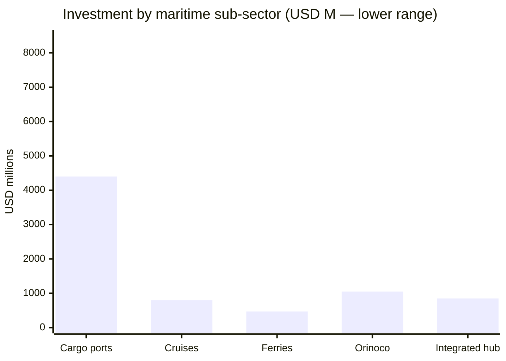
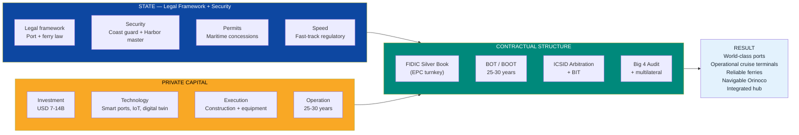
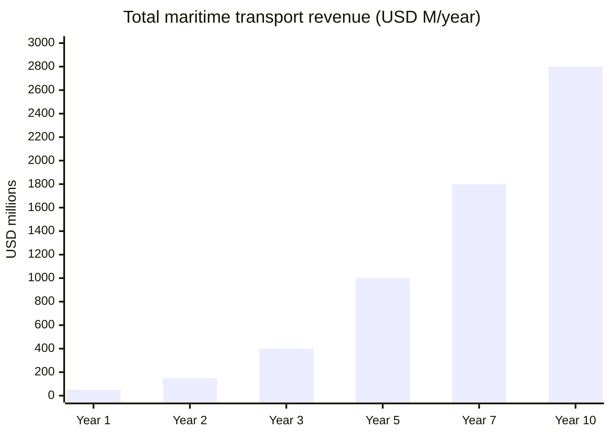
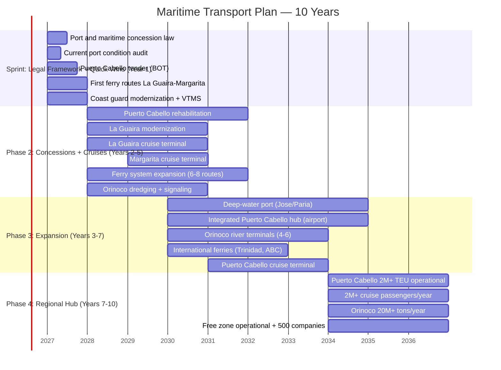

# Maritime Transport: The Caribbean's Blue Highway

> Venezuela has **2,800+ km of Caribbean coastline**, **70+ islands**, the **Orinoco River navigable for 450+ km**, and is the only major Caribbean country with **zero cruise infrastructure**. The Caribbean cruise market generates **USD 55B+/year** with **32M+ passengers** — and Venezuela captures not a single cent. Puerto Cabello operates at **33% capacity**. There are no inter-island ferries. No cruise terminals. No organized river navigation. This is not a problem — it is the largest untapped maritime opportunity in the Western Hemisphere.

---

## 1. The Opportunity: USD 55B+ Market with Zero Presence

:::info The only major Caribbean country without cruises
The Caribbean is the **#1 cruise destination worldwide** with **35%+ of all global deployments**. Dominican Republic, Puerto Rico, Bahamas, Jamaica, Cozumel — all capture millions of cruise passengers. Venezuela, with more Caribbean coastline than any of them, **does not have a single operational cruise terminal**. It is not a lack of demand. It is a lack of infrastructure.
:::

| Data Point | Figure | Source |
|------|-------|--------|
| Venezuela's Caribbean coastline | **2,800+ km** | [Wikipedia — Venezuela](https://en.wikipedia.org/wiki/Venezuela) |
| Islands and islets | **70+** (Los Roques, Margarita, Coche, Cubagua, La Tortuga, Las Aves, Los Testigos) | [Wikipedia — Islands of Venezuela](https://en.wikipedia.org/wiki/List_of_islands_of_Venezuela) |
| Navigable Orinoco River | **450+ km** (Ciudad Guayana → Atlantic) | [Britannica — Orinoco](https://www.britannica.com/place/Orinoco-River) |
| Caribbean cruise market (2024) | **32M+ passengers/year**, USD 55B+ industry | [CLIA — State of the Cruise Industry 2025](https://cruising.org/en/news-and-research/research/state-of-the-cruise-industry-report) |
| Caribbean as cruise destination | **#1 globally — 35%+ of all deployments** | [CLIA 2025](https://cruising.org/en/news-and-research/research/state-of-the-cruise-industry-report) |
| Puerto Cabello capacity | **810K TEU** installed, **~270K TEU** actual (**33%**) | [Unisco](https://www.unisco.com/international-ports/puerto-cabello-venezuela) |
| Orinoco river capacity | **20M+ tons/year** | [Oreate AI](https://www.oreateai.com/blog/research-report-on-the-ore-transportation-market-in-the-orinoco-river-basin-venezuela/b63a1666fb2dcb066312827ad0eccb6c) |
| Active inter-island ferries | **~0 reliable regular services** | [Requires research] |
| Cruise terminals | **0 operational at international standard** | [Requires research] |

### What Venezuela Has — and Nobody Leverages

### Why Now

| Factor | Detail |
|--------|---------|
| **Post-COVID cruise boom** | The cruise industry reached **35.7M passengers in 2024** — an all-time record, surpassing pre-COVID levels. All cruise lines are actively seeking new ports of call — [CLIA 2025](https://cruising.org/en/news-and-research/research/state-of-the-cruise-industry-report) |
| **Saturation of existing destinations** | Cozumel, Nassau, St. Maarten report congestion. Cruise lines need alternatives in the southern Caribbean — [Seatrade Cruise](https://www.seatrade-cruise.com/) |
| **Venezuela = total greenfield** | Zero internal competition. Zero incumbents. Everything to build = everything to capture |
| **Nearshoring and trade** | Efficient ports are a prerequisite for capturing nearshoring. Puerto Cabello at 33% = immense idle capacity |
| **Untapped Orinoco** | A navigable river connecting the country's largest mineral reserve to the Atlantic — and nobody uses it in an organized way |

---

## 2. Investment Sub-Opportunities

### 2.A Cargo Ports (Deep-Water Terminals)

:::danger Puerto Cabello: the country's #1 port operates like it is stuck in the last century
Obsolete cranes, insufficient dredging, corrupt customs, nonexistent IT systems. **270K TEU out of 810K capacity = 33% utilization.** Cartagena, 1,200 km away, handles **3.6M TEU/year**. Puerto Cabello has the location — it just lacks everything else.
:::

| Project | Investment | Model | Target | Timeline | Standard |
|----------|-----------|--------|------|----------|----------|
| **Puerto Cabello: rehabilitation + expansion** | USD 1,500-2,500M | BOT 30 years | Dredging to **24m** (Rotterdam Class), **1.5-2M TEU/year**, automated STS cranes, digital twin | Years 1-5 | PIANC + Rotterdam Class + ISO 28000 |
| **La Guaira: terminal modernization** | USD 800-1,200M | BOT 30 years | Modern terminal **800K TEU/year**, improved road access | Years 2-5 | PIANC + ISO 28000 |
| **New deep-water port (Gulf of Paria or Jose)** | USD 1,500-3,000M | Greenfield BOT 40 years | Multi-purpose hub: oil + LNG + general cargo, **1-2M TEU/year** | Years 3-8 | PIANC + IMO + ISO 14001 |
| **Maracaibo: mining/oil terminal** | USD 400-800M | BOT 25 years | Support for Lake operations + mineral exports | Years 2-5 | PIANC |
| **Smart port technology (all ports)** | USD 200-500M | Integrated into BOTs | IoT, automated cranes, digital twin, blockchain customs, 5G port connectivity | Continuous | ISO 28000 + ISO 55001 |
| **TOTAL CARGO PORTS** | **USD 4,400-8,000M** | | | | |

**Potential operators:**

| Operator | Country | Global terminals | Why Venezuela |
|----------|------|--------------------|--------------------|
| **DP World** | UAE | 90+ terminals in 40 countries | Aggressive LATAM expansion; operates in Dominican Republic (Caucedo) |
| **APM Terminals** (Maersk) | Denmark | 75+ terminals | Global leaders; seeking complementary hubs in the southern Caribbean |
| **Hutchison Ports** | Hong Kong | 52 ports in 24 countries | Operates Panama (Balboa, Cristobal); Venezuela = natural extension |
| **PSA International** | Singapore | 60+ terminals | Singapore model applicable to Puerto Cabello as a transshipment hub |

**Revenue model:**

| Revenue source | Estimated rate | Year 10 volume | Year 10 revenue |
|-------------------|-----------------|----------------|-----------------|
| Container handling (THC) | USD 150-250/TEU | 3-4M TEU | USD 450-1,000M |
| Wharfage + anchorage | USD 5-15/TEU | 3-4M TEU | USD 15-60M |
| Warehousing + storage | USD 2-5/TEU/day | Variable | USD 50-150M |
| Concession payments to State | 5-8% gross revenue | — | USD 30-100M |
| **Total cargo ports** | | | **USD 545-1,310M/year** |

---

### 2.B Cruise Terminals

:::info 32 million cruise passengers pass through the Caribbean every year — and zero touch Venezuela
Royal Caribbean has **68 ships**. MSC has **23**. Carnival has **90+**. All sail the Caribbean. None make port calls in Venezuela. Not because they do not want to — but because there is nowhere to dock, nothing to do on shore, and no security. Solve those three things and you have a captive market.
:::

| Project | Investment | Model | Capacity | Timeline |
|----------|-----------|--------|-----------|----------|
| **La Guaira: homeport terminal** | USD 300-500M | BOT 30 years | **2 berths for 5,000+ pax ships**, premium terminal, access to Caracas | Years 2-5 |
| **Margarita: port of call** | USD 200-400M | BOT 25 years | **1-2 berths**, duty-free shopping center, accessible beach, organized tours | Years 2-4 |
| **Puerto Cabello: port of call** | USD 150-300M | BOT 25 years | **1 berth**, access to colonial center + Morrocoy beaches | Years 3-5 |
| **Los Roques: tender operation** | USD 50-100M | Concession 20 years | Tender boat operations, controlled eco-tourism, limited carrying capacity | Years 2-4 |
| **Cruise provisioning industry** | USD 100-200M | Private | Food supply, fuel, ship provisions | Years 3-6 |
| **TOTAL CRUISE TERMINALS** | **USD 800M-1,500M** | | | |

**Standard:** IMO ISPS Code (port security), Skytrax-class terminals with air conditioning, Wi-Fi, duty-free, medical services.

**Revenue model — cruises:**

| Revenue source | Unit value | Volume | Year 10 revenue |
|-------------------|----------------|---------|-----------------|
| Port fees | USD 8-15/passenger | 2M+ pax/year | USD 16-30M |
| Head tax | USD 10-20/passenger | 2M+ pax/year | USD 20-40M |
| Onshore spending per passenger | USD 100-150/passenger/day | 2M+ pax/year | USD 200-300M |
| Provisioning | USD 50-100/passenger/voyage | 500K+ calls | USD 25-50M |
| Duty-free retail | Variable | — | USD 30-80M |
| **Total cruises** | | | **USD 291-500M/year** |

**Cruise passenger projection:**

| Year | Passengers | Ship calls | Direct revenue |
|-----|-----------|-------------------|-----------------|
| **1** | 0 (construction) | 0 | USD 0 |
| **2** | 50,000 | ~50 | USD 10M |
| **3** | 150,000 | ~150 | USD 30M |
| **5** | 500,000 | ~400 | USD 100M |
| **7** | 1,000,000 | ~700 | USD 200M |
| **10** | **2,000,000+** | **~1,200** | **USD 400-500M** |

:::tip Dominican Republic: from zero to 1.5M cruise passengers
Amber Cove (Puerto Plata) was built by Carnival Corporation in 2015 with an investment of **USD 85M**. In its first full year it received **300K+ passengers**. By 2024, it had surpassed **1M cumulative cruise passengers**. The model: the cruise line builds the terminal and guarantees the traffic. Venezuela can replicate this with Royal Caribbean or MSC at La Guaira or Margarita — [Carnival Corporation](https://www.carnivalcorp.com/).
:::

**Potential operators:**

| Cruise line | Fleet | Caribbean presence | Venezuela opportunity |
|---------|-------|------------------|------------------------|
| **Royal Caribbean** | 68 ships | Miami hub, multiple Caribbean ports | Homeporting at La Guaira; port of call at Margarita |
| **MSC Cruises** | 23 ships | Ocean Cay (private island, Bahamas) | Port of call + possible private island (La Tortuga?) |
| **Carnival Corporation** | 90+ ships (9 brands) | Amber Cove (DR), Half Moon Cay | Build terminal at La Guaira or Margarita (Amber Cove model) |
| **Norwegian Cruise Line** | 19 ships | Great Stirrup Cay, Harvest Caye | Port of call Margarita + Los Roques |
| **Celebrity Cruises** | 17 ships | Southern Caribbean routes | Southern Caribbean itineraries including Venezuela |

---

### 2.C Inter-Island Ferry System

:::caution Venezuela has 70+ islands and zero maritime transport system between them
A Venezuelan on the mainland who wants to go to Margarita has to fly or pray for an informal ferry. Going to Los Roques means an expensive small plane or nothing. Going to Coche, Cubagua, La Tortuga — practically impossible without a private boat. A country with 70+ Caribbean islands should have a ferry system like Greece, Croatia, or the Balearic Islands.
:::

**Domestic routes:**

| Route | Distance | Estimated duration | Target frequency | Estimated demand |
|------|-----------|-------------------|--------------------|------------------|
| **La Guaira <-> Margarita** | ~200 km | 4-5 hours (fast ferry) | 2-3 daily | 500K+ pax/year |
| **La Guaira <-> Los Roques** | ~170 km | 3-4 hours (fast ferry) | 1-2 daily | 200K+ pax/year |
| **Margarita <-> Coche** | ~15 km | 30 min | 6-8 daily | 300K+ pax/year |
| **Margarita <-> Cubagua** | ~10 km | 20 min | 4-6 daily | 100K+ pax/year |
| **Puerto La Cruz <-> Margarita** | ~80 km | 2 hours | 2-3 daily | 400K+ pax/year |
| **Cumana <-> Margarita** | ~90 km | 2-3 hours | 1-2 daily | 200K+ pax/year |

**International routes:**

| Route | Distance | Estimated duration | Frequency | Market |
|------|-----------|-------------------|------------|---------|
| **Margarita <-> Trinidad** | ~150 km | 3-4 hours | 3-4 weekly | Trade + tourism + Trinidadian diaspora |
| **Margarita <-> Curacao** | ~350 km | 7-8 hours (overnight) | 2-3 weekly | Tourism + ABC islands trade |
| **Margarita <-> Bonaire** | ~280 km | 5-6 hours | 2-3 weekly | Tourism + diving |
| **Margarita <-> Aruba** | ~450 km | 9-10 hours (overnight) | 2-3 weekly | Tourism + trade |

**Required fleet:**

| Type | Reference manufacturer | Capacity | Speed | Quantity | Unit cost |
|------|----------------------|-----------|-----------|----------|----------------|
| **Fast ferry (catamaran)** | Austal (Australia) | 400-600 pax + 100 vehicles | 35-40 knots | 6-8 | USD 40-60M |
| **Conventional ferry** | Damen (Netherlands) | 600-1,000 pax + 200 vehicles | 18-22 knots | 4-6 | USD 30-50M |
| **Inter-island speedboat** | Local / Damen | 100-200 pax | 25-30 knots | 10-15 | USD 5-10M |

| Component | Investment |
|------------|-----------|
| Fleet (20-29 vessels) | USD 250-500M |
| Ferry terminals (8-12) | USD 150-300M |
| Navigation aids (buoys, AIS, communications) | USD 50-100M |
| Booking and operations systems | USD 20-50M |
| **TOTAL FERRIES** | **USD 470M-950M** |

**Standard:** IMO SOLAS (maritime safety), DNV classification, ISM Code.

**Potential operators:**

| Operator | Country | Specialty | Venezuela application |
|----------|------|-------------|----------------------|
| **Balearia** | Spain | Mediterranean + Caribbean ferries (Miami-Bahamas) | Anchor operator for inter-island system. Already operates in the Caribbean |
| **DFDS** | Denmark | Europe's largest ferry operator | Technical advisory + possible JV |
| **Viking Line** | Finland | Baltic ferries | Operating model for long-haul routes |
| **Local operators** | Venezuela | Local knowledge | Concession to local operators with international capital and technology |

**Revenue model — ferries:**

| Source | Average fare | Year 10 volume | Year 10 revenue |
|--------|-----------------|----------------|-----------------|
| Passenger tickets | USD 30-80/pax | 2M+ pax/year | USD 60-160M |
| Vehicle transport | USD 50-150/vehicle | 300K+ vehicles | USD 15-45M |
| Inter-island cargo | USD 20-50/ton | 200K+ tons | USD 4-10M |
| Onboard services (food, retail) | USD 10-20/pax | 2M+ pax | USD 20-40M |
| **Total ferries** | | | **USD 99-255M/year** |

---

### 2.D Orinoco River Navigation

:::info A 450+ km waterway highway connecting the country's largest mineral reserve to the ocean
The Orinoco is navigable for oceangoing vessels up to Ciudad Guayana — **450+ km** from the Atlantic. Theoretical capacity: **20M+ tons/year**. Iron, bauxite, gold, agricultural products from the Llanos — all can be shipped downriver at a fraction of the cost of overland transport. And today it is not used in any organized fashion.
:::

| Component | Investment | Target | Timeline |
|------------|-----------|------|----------|
| **Channel dredging and maintenance** | USD 300-500M | Guaranteed depth **12m+** for Panamax vessels | Years 1-3 |
| **Navigation and signaling system** | USD 100-200M | AIS, lighted buoys, electronic charts, VTS (Vessel Traffic Service) | Years 1-3 |
| **River terminals** (4-6 along the Orinoco) | USD 300-600M | Bulk mineral, agro, and container terminals at Ciudad Guayana, Caicara, Ciudad Bolivar | Years 2-5 |
| **River-to-ocean transshipment terminal** (delta) | USD 200-400M | Barge-to-oceangoing vessel transshipment without breaking the logistics chain | Years 2-5 |
| **Barges and tugboats** (initial fleet) | USD 150-300M | 50-100 barges for bulk cargo + 15-20 tugboats | Years 2-4 |
| **TOTAL ORINOCO** | **USD 1,050M-2,000M** | | |

**Standard:** PIANC inland waterway guidelines, IMO SOLAS (where applicable), IALA maritime signaling.

**Potential cargo:**

| Product | Origin | Potential volume | Destination |
|----------|--------|-------------------|---------|
| **Iron** (CVG Ferrominera) | Cerro Bolivar | **10-15M tons/year** | Maritime export (China, Europe) |
| **Bauxite** | Los Pijiguaos | **3-5M tons/year** | Domestic smelters + export |
| **Gold + critical minerals** | Arco Minero | High-value cargo, low volume | Secure ports, export |
| **Agricultural production** | Llanos (Apure, Barinas, Portuguesa) | **2-4M tons/year** | Domestic market + export |
| **Industrial inputs** | Imports | **1-2M tons/year** | Country's interior via river |
| **TOTAL** | | **16-26M tons/year** | |

**Revenue model — Orinoco:**

| Source | Rate | Year 10 volume | Year 10 revenue |
|--------|--------|----------------|-----------------|
| River toll | USD 0.50-1.00/ton | 15-20M tons | USD 7.5-20M |
| Terminal handling | USD 3-8/ton | 15-20M tons | USD 45-160M |
| River-to-ocean transshipment | USD 5-10/ton | 10-15M tons | USD 50-150M |
| Pilotage | USD 2,000-5,000/vessel | 2,000+ vessels | USD 4-10M |
| **Total Orinoco** | | | **USD 106-340M/year** |

---

### 2.E Integrated Port + Airport Hub at Puerto Cabello

:::tip Unique concept: integrated air-sea logistics hub
Puerto Cabello already has the country's #1 industrial port. What it lacks is a nearby cargo airport — the closest is Valencia (Arturo Michelena), which is deteriorated and has no modern cargo terminal. Integrating a cargo airport alongside the port creates an **air-sea logistics hub** modeled on Singapore Changi + PSA or Rotterdam Airport + Europoort.
:::

| Component | Investment | Description | Standard |
|------------|-----------|-------------|----------|
| **Cargo airport** | USD 500-800M | 3,000m+ runway for widebody freighters (747F, 777F), cargo terminal with cold chain, automated systems | ICAO Annex 14 Cat 4E |
| **Integrated free trade zone** | USD 200-400M | Free trade zone with warehouses, light manufacturing, assembly, re-export | Colon Free Zone + Jebel Ali model |
| **Port-airport road/rail connection** | USD 100-200M | Dedicated cargo route between port terminal and air terminal (~5-10 km) | AASHTO |
| **Integrated IT systems** | USD 50-100M | Digital single window, blockchain customs, end-to-end tracking | ISO 28000 + WCO SAFE Framework |
| **TOTAL INTEGRATED** | **USD 850M-1,500M** | | |

**Reference models:**

| Integrated hub | Country | What it does | Lesson for Venezuela |
|---------------|------|----------|------------------------|
| **Singapore Changi + PSA** | Singapore | World's #1 airport + #2 global port operator. Integrated with free trade zone | The gold standard. Puerto Cabello has the location to replicate at a smaller scale |
| **Rotterdam (Europoort + Airport)** | Netherlands | Europe's #1 port + complementary cargo airport | Air-sea integration reduces transit time from days to hours |
| **Dubai (Jebel Ali + Al Maktoum)** | UAE | Port + airport + free zone (JAFZA). **8,000+ companies** in free zone | Desert converted into a global logistics hub. If Dubai can do it, Puerto Cabello can too |
| **Colon Free Zone** | Panama | Largest free zone in the Western Hemisphere. **2,500 companies, 5-7% of GDP** | 1,200 km from Puerto Cabello. Complementary, not a competitor |

**Revenue model — integrated hub:**

| Source | Year 10 revenue |
|--------|-----------------|
| Air cargo handling | USD 50-100M |
| Free zone (rent + services) | USD 30-80M |
| Integrated logistics services | USD 20-50M |
| Re-export and value-added | USD 50-150M |
| **Total integrated hub** | **USD 150-380M/year** |

---

## 3. Required Infrastructure — Consolidated

| Sub-sector | Estimated investment | Timeline | Direct jobs (construction + operations) |
|-----------|-------------------|----------|----------------------------------------------|
| **Cargo ports** | USD 4,400-8,000M | 5-10 years | 20,000-40,000 |
| **Cruise terminals** | USD 800M-1,500M | 2-5 years | 8,000-15,000 |
| **Ferry system** | USD 470M-950M | 2-5 years | 5,000-10,000 |
| **Orinoco river navigation** | USD 1,050-2,000M | 3-7 years | 8,000-15,000 |
| **Integrated Puerto Cabello hub** | USD 850M-1,500M | 3-7 years | 10,000-20,000 |
| **TOTAL** | **USD 7,570-13,950M** | **10 years** | **51,000-100,000** |

:::caution Consistency with the plan
The [Roads & Logistics](./vialidad-logistica) section estimates USD 5,200-9,800M for ports. This document disaggregates and expands that figure to include cruises, inter-island ferries, Orinoco river navigation, and the integrated Puerto Cabello hub — sub-opportunities not covered in the roads document. There is partial overlap in cargo ports that must be consolidated when integrating both documents into the total budget.
:::

---

## 4. Business Model: Maritime Concessions

### Guiding Principle

> Venezuela S.A. is a shareholder in the base port infrastructure — land, wharves, access — and collects perpetual royalties as the holding company of 40M citizens. The State provides the legal framework, security, and coast guard. Private capital finances, builds, operates, and transfers after 25-30 years. **Zero state-operated ports. Venezuela S.A. invests and collects, it does not operate.**

### Concession structure by sub-sector

| Sub-sector | Contract type | Duration | Land ownership | Operator type | Fee to Venezuela S.A. |
|-----------|---------------|----------|-------------------|---------------|-----------------|
| **Cargo ports** | BOT (FIDIC Gold Book) | 30-40 years | Venezuela S.A. (JV shareholder) | DP World, APM Terminals, PSA | 5-8% gross revenue |
| **Cruises** | BOT / BOOT | 25-30 years | Venezuela S.A. | Royal Caribbean, Carnival (build their own terminal) | 3-5% revenue + head tax |
| **Ferries** | Service concession | 15-25 years | Venezuela S.A. (terminals), private (fleet) | Balearia, DFDS, local operator | Regulated fare + fee to Venezuela S.A. |
| **Orinoco** | BOT + dredging concession | 25-30 years | Venezuela S.A. (public waterway) | Jan De Nul, Van Oord (dredging), private (terminals) | Regulated river toll |
| **Integrated hub** | BOOT (FIDIC Silver Book) | 30-40 years | Venezuela S.A. | Consortium operator (port + airport + free zone) | Fixed rent + % of revenue |

### Consolidated revenue flow

| Actor | What it receives | Year 10 amount |
|-------|-----------|---------------|
| **Concessionaires** | Operating revenue - costs - fee | 60-70% of total revenue |
| **Government (fee + taxes)** | Concession fee + 15% flat tax + 12% VAT | USD 300-700M/year |
| **Workers** | 51,000-100,000 direct jobs + wages | — |
| **Local economy** | Economic multiplier 2.5-3x on direct employment | 130,000-300,000 indirect jobs |

---

## 5. 10-Year Projection

| Indicator | Year 1 | Year 3 | Year 5 | Year 7 | Year 10 |
|-----------|-------|-------|-------|-------|--------|
| **Cumulative investment** | USD 1B | USD 3B | USD 6B | USD 9B | USD 12B |
| **Port throughput (TEU)** | 350K | 700K | 1,200K | 2,000K | **3,500K** |
| **Cruise passengers/year** | 0 | 150K | 500K | 1,000K | **2,000K+** |
| **Ferry passengers/year** | 100K | 500K | 1,000K | 1,500K | **2,000K+** |
| **Orinoco cargo (tons/year)** | 2M | 5M | 10M | 15M | **20M+** |
| **Cargo port revenue** | USD 30M | USD 150M | USD 400M | USD 700M | **USD 1,200M** |
| **Cruise revenue** | USD 0 | USD 30M | USD 100M | USD 200M | **USD 450M** |
| **Ferry revenue** | USD 10M | USD 40M | USD 80M | USD 150M | **USD 250M** |
| **Orinoco revenue** | USD 10M | USD 50M | USD 120M | USD 200M | **USD 340M** |
| **Integrated hub revenue** | USD 0 | USD 30M | USD 80M | USD 150M | **USD 350M** |
| **TOTAL REVENUE** | **USD 50M** | **USD 300M** | **USD 780M** | **USD 1,400M** | **USD 2,590M** |
| **Direct jobs** | 10,000 | 25,000 | 45,000 | 65,000 | **85,000** |
| **Total jobs (3x)** | 30,000 | 75,000 | 135,000 | 195,000 | **255,000** |
| **Fiscal contribution** | USD 5M | USD 30M | USD 80M | USD 150M | **USD 300M** |

### Impact on Other Sectors of the Plan

| Sector | How maritime transport impacts it | Estimated impact |
|--------|---------------------------------------|-----------------|
| **Oil** | Efficient export ports, LNG terminal at Jose/Paria | Enables export of 3M bpd |
| **Mining** | Orinoco → Atlantic corridor for iron, bauxite | Enables USD 74B in mining revenues |
| **Tourism** | Cruises + island ferries + access to coastal destinations | 2M+ cruise passengers + 2M+ ferry passengers |
| **Foreign trade** | Efficient ports reduce import/export costs | From 12-15 days to 3-5 days to import |
| **Agriculture** | River transport of products from the Llanos | Reduces transport cost by 40-60% vs. overland |
| **Data centers** | Integrated Puerto Cabello hub = submarine cable connectivity | Access to existing and new submarine cables |

---

## 6. International Comparables

| Country/Project | Starting situation | What they did | Result | Lesson for Venezuela |
|---------------|------------------|-------------|-----------|------------------------|
| **Panama (Canal Zone)** | Canal zone returned in 1999. Basic ports | 5 modern container terminals, Colon Free Zone, intermodal railroad | **7M+ TEU/year**, CFZ = 5-7% of GDP, GDP per capita 4x in 25 years | Venezuela does not have a canal but has a complementary geographic position. Puerto Cabello can be the southern Caribbean hub |
| **Dominican Republic (cruises)** | Zero cruises until the 2000s | Amber Cove (Carnival, USD 85M), Cap Cana, Puerto Plata | **~1.5M cruise passengers/year**, USD 500M+ associated revenue | The cruise line finances the terminal if the destination is attractive. Venezuela has more attractions than the DR |
| **Croatia (ferries)** | Post-war (1995). 1,200+ islands, basic maritime transport | State ferry system (Jadrolinija) + private operators. Subsidy for unprofitable routes | **12M+ ferry passengers/year**, tourism = 20% of GDP | Venezuela has fewer islands but more distant ones. Mixed public-private model works |
| **Dubai (DP World/Jebel Ali)** | Desert without trade in the 1970s | Jebel Ali Port (1979), JAFZA free zone, massive infrastructure investment | **#9 port in the world, 15M+ TEU**, JAFZA = 8,000 companies, 23% of Dubai's GDP | If a desert can create a global logistics hub, Venezuela with a natural Caribbean position can do it |
| **Rotterdam (Europoort)** | Historic port, competition with Antwerp | Full automation, Maasvlakte 2 (artificial island), air-sea integration, carbon neutral 2050 | **#1 port in Europe, 14M+ TEU**, 385M tons of cargo/year | Gold standard for smart ports. Puerto Cabello can adopt Rotterdam technology |

Sources: [Port Economics](https://porteconomicsmanagement.org/); [CLIA](https://cruising.org/); [DP World](https://www.dpworld.com/); [Port of Rotterdam](https://www.portofrotterdam.com/en/facts-and-figures); [BusinessPanama](https://www.businesspanama.com/).

---

## 7. Potential Allies

### Port and maritime operators

| Company | Country | Specialty | Potential role |
|---------|------|-------------|---------------|
| **DP World** | UAE | 90+ terminals in 40 countries. Operates Caucedo (DR) | Anchor operator for Puerto Cabello or deep-water port |
| **APM Terminals** (Maersk) | Denmark | 75+ terminals. Global container leader | La Guaira or Puerto Cabello operator |
| **Hutchison Ports** | Hong Kong | Operates Balboa and Cristobal (Panama) | Natural extension from Panama |
| **PSA International** | Singapore | Singapore model, 60+ terminals | Smart port technology + operations |
| **Balearia** | Spain | Mediterranean + Caribbean ferries (Miami-Bahamas) | Anchor operator for inter-island ferry system |
| **Jan De Nul** | Belgium | World's #1 in dredging | Orinoco dredging + channel maintenance |
| **Van Oord** | Netherlands | Dredging and maritime engineering | Orinoco dredging + river terminals |
| **Austal** | Australia | Fast ferry manufacturer (aluminum) | Catamaran fleet supplier |
| **Damen Shipyards** | Netherlands | Ferries + workboats | Conventional ferry + barge supplier |

### Cruise lines

| Company | Country | Fleet | Potential role |
|---------|------|-------|---------------|
| **Royal Caribbean Group** | U.S. | 68 ships | Homeporting La Guaira, port of call Margarita |
| **Carnival Corporation** | U.S. | 90+ ships (9 brands) | Build terminal (Amber Cove model) |
| **MSC Cruises** | Switzerland | 23 ships | Port of call + possible private island |
| **Norwegian Cruise Line** | U.S. | 19 ships | Southern Caribbean routes with Venezuela port call |

### Financing

| Entity | Type | Potential |
|---------|------|-----------|
| **IDB / CAF** | Multilateral | USD 2-5B in loans for port infrastructure |
| **DFC (ex-OPIC)** | U.S. | Port financing in allied countries |
| **IFC (World Bank)** | Multilateral | Project finance + PPP technical assistance |
| **JICA** | Japan | Soft credit for maritime infrastructure |
| **Infrastructure funds** | Global | Brookfield, Macquarie, GIC (Singapore), ADIA (Abu Dhabi) |

---

## 8. Risks and Mitigations

| # | Risk | Prob. | Impact | Mitigation |
|---|--------|-------|---------|------------|
| 1 | **Sanctions prevent entry of U.S. cruise lines/operators** | Medium-High | Critical | Start with European/Asian operators (DP World, PSA, MSC). Seek OFAC-specific licenses for ports/cruises. Chevron model |
| 2 | **Maritime insecurity** — piracy, smuggling, drug trafficking on routes | Medium | High | Modernized coast guard + VTMS (Vessel Traffic Management System) + cooperation with U.S. Coast Guard/Trinidad. IMO protocol |
| 3 | **Cargo traffic below projections** — ports do not fill up | Medium | High | Minimum revenue guarantee (MRG) in concessions. Competitive rates vs. Cartagena/Kingston. Free zone as cargo generator |
| 4 | **Cruise lines do not include Venezuela in itineraries** | Medium | High | Incentives: zero port fees for 3 years. Terminal built by the cruise line (Amber Cove model). Security guarantee |
| 5 | **Corruption in concession awards** | High | High | Open international tenders. Big 4 audit. Multilateral oversight (IDB/CAF). Plan's anticorruption model |
| 6 | **Natural disaster** — hurricane, tsunami, storm surge | Low | High | Venezuela is **south of the hurricane belt** (advantage). Resilient design. MIGA/infrastructure insurance |
| 7 | **Orinoco sedimentation** — insufficient dredging | Medium | Medium | Permanent dredging contract with Jan De Nul/Van Oord. Channel maintenance fund |
| 8 | **Regional competition** — Panama, Colombia, Trinidad capture cargo and cruises | Medium | Medium | Complementary position, not a competitor. Southern Caribbean is underserved. Competitive rates |
| 9 | **Shortage of qualified maritime labor** | High | Medium | Merchant marine academy + repatriation of Venezuelan sailors abroad. Partnership with Panama's maritime academy |
| 10 | **Political instability** — new government revokes concessions | Medium-High | Critical | ICSID contracts + BIT + early termination compensation. Offshore SPV. MIGA insurance |

---

## 9. Execution Timeline

---

## 10. Executive Summary

| Parameter | Value |
|-----------|-------|
| **Total investment** | **USD 7,570-13,950M** (~USD 6-12B rounded range) |
| **Timeline** | 10 years (core infrastructure), 15 years (full scale) |
| **Direct jobs** | **51,000-100,000** |
| **Total jobs (3x)** | **153,000-300,000** |
| **Year 10 revenue** | **USD 2,590M/year** (~USD 3-6B range with upside) |
| **Year 10 cruise passengers** | **2,000,000+** |
| **Year 10 ferry passengers** | **2,000,000+** |
| **Year 10 port throughput** | **3,500,000+ TEU** |
| **Year 10 Orinoco river cargo** | **20M+ tons/year** |
| **Model** | BOT/BOOT concessions — FIDIC Silver/Gold Book — 25-30 years |
| **Standard** | PIANC + IMO + Rotterdam Class + Changi Class + ISO 28000 |
| **Main reference** | Panama (ports) + DR (cruises) + Croatia (ferries) + Dubai (integrated hub) |

:::tip Every ship that docks in Venezuela is revenue, jobs, trade, and connection to the world
A 5,000-passenger cruise ship making a port call generates **USD 500K-750K in a single day** (onshore spending + fees). A containership unloading 2,000 TEU generates **USD 300K-500K in port fees**. A barge carrying 30,000 tons of iron down the Orinoco generates **USD 150K-300K**. Multiply that by thousands of calls per year and you have a sector generating **USD 3-6B/year** — without spending a single cent of oil revenue. The Caribbean's blue highway is waiting. All you have to do is open the port.
:::

---

## Related Documents

- [Roads & Logistics](./vialidad-logistica) — Road network and logistics corridors connecting ports to the interior
- [Tourism](./turismo) — Cruises, ferries, and marinas as a coastal and island tourism engine
- [Critical Minerals](./minerales-criticos) — Mineral exports via Orinoco ports and barges
- [Oil & Gas](./petroleo-gas) — Oil terminals and crude export logistics
- [Electrical Capacity](./capacidad-electrica) — Port electrification and shore power for vessels
- [Concession Model](./modelo-concesiones) — Concession framework for port terminals and international operators

---

## Sources

| # | Source | Data used |
|---|--------|---------------|
| 1 | [CLIA — State of the Cruise Industry 2025](https://cruising.org/en/news-and-research/research/state-of-the-cruise-industry-report) | 32M+ Caribbean cruise passengers, 35.7M global (2024 record), 35%+ deployments in Caribbean |
| 2 | [Unisco — Puerto Cabello](https://www.unisco.com/international-ports/puerto-cabello-venezuela) | 810K TEU capacity, ~270K throughput, 33% utilization |
| 3 | [Oreate AI — Orinoco River Transport](https://www.oreateai.com/blog/research-report-on-the-ore-transportation-market-in-the-orinoco-river-basin-venezuela/b63a1666fb2dcb066312827ad0eccb6c) | 20M+ tons/year capacity, depth >10m |
| 4 | [Britannica — Orinoco River](https://www.britannica.com/place/Orinoco-River) | Navigation to Ciudad Bolivar, 450+ km |
| 5 | [Port of Rotterdam — Facts and Figures](https://www.portofrotterdam.com/en/facts-and-figures) | 14M+ TEU, 385M tons, smart port, carbon neutral 2050 |
| 6 | [DP World](https://www.dpworld.com/) | 90+ terminals, 40 countries, operates Caucedo (DR) |
| 7 | [Carnival Corporation — Amber Cove](https://www.carnivalcorp.com/) | USD 85M terminal, 300K+ pax first year, cruise-line-builds model |
| 8 | [Port Economics — Panama Transshipment](https://porteconomicsmanagement.org/pemp/contents/part1/interoceanic-passages/panama-regional-transshipment-system/) | 7M+ TEU, 5 terminals, hemisphere hub |
| 9 | [BusinessPanama — Colon Free Zone](https://www.businesspanama.com/invest-in-panama/panama-special-economic-zones/colon-free-zone/) | 2,500 companies, 5-7% of GDP |
| 10 | [SobelNet — Venezuela Port Challenges](https://sobelnet.com/venezuelas-largest-container-port-faces-severe-infrastructure-challenges/) | Operational deterioration, processes taking hours to days |
| 11 | [Marine Insight — Venezuela Ports](https://www.marineinsight.com/know-more/ports-and-oil-terminals-in-venezuela/) | 10 main ports, current conditions |
| 12 | [Wikipedia — Islands of Venezuela](https://en.wikipedia.org/wiki/List_of_islands_of_Venezuela) | 70+ islands and islets |
| 13 | [Wikipedia — Venezuela](https://en.wikipedia.org/wiki/Venezuela) | 2,800+ km Caribbean coast |
| 14 | [Seatrade Cruise](https://www.seatrade-cruise.com/) | Saturation of existing Caribbean destinations, new ports needed |
| 15 | [PIANC — Port Standards](https://www.pianc.org/) | International port and maritime infrastructure standards |
| 16 | [IMO — International Maritime Organization](https://www.imo.org/) | SOLAS, ISPS Code, maritime safety standards |
| 17 | [Balearia](https://www.balearia.com/) | Ferry operator in the Mediterranean + Caribbean (Miami-Bahamas) |
| 18 | [Austal](https://www.austal.com/) | Fast ferry manufacturer, aluminum catamarans |
