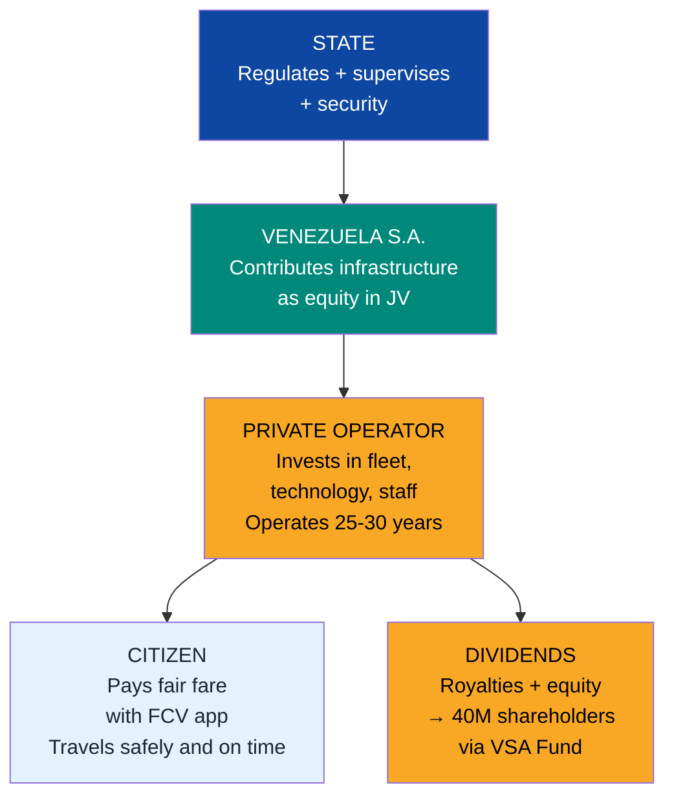
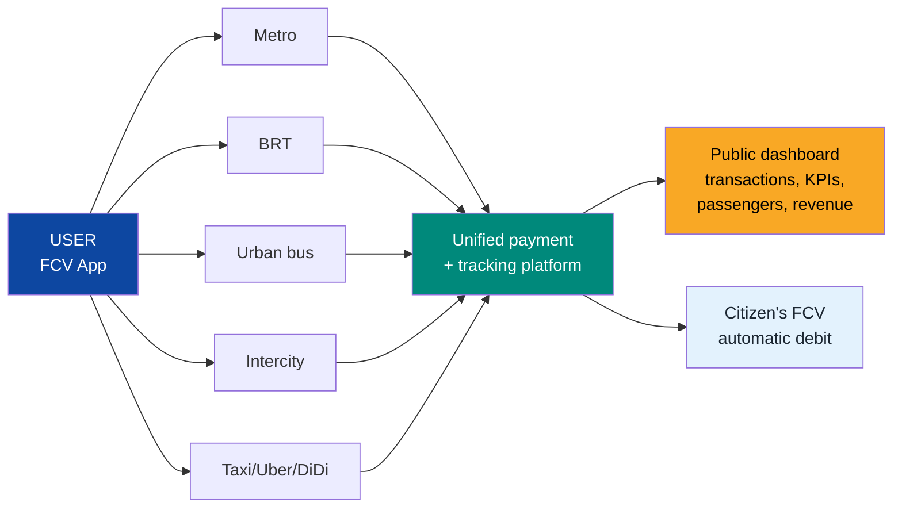
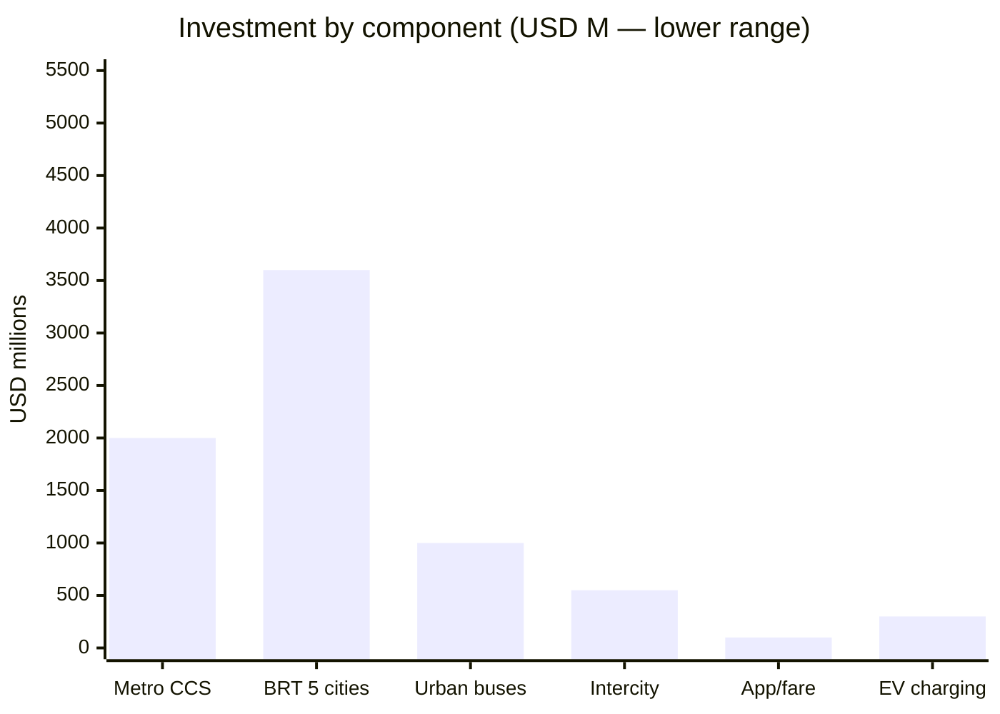
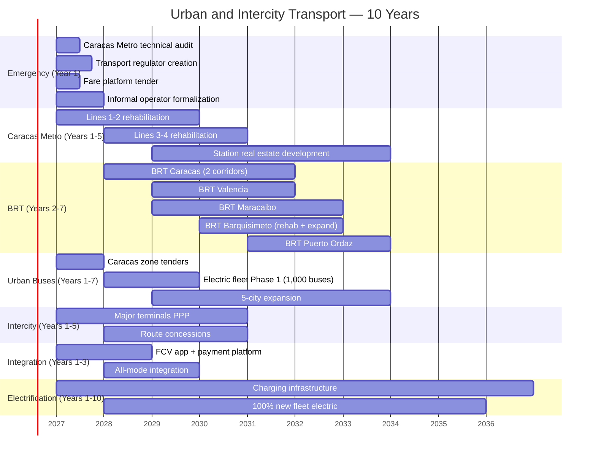

# Urban and Intercity Transport: Mobility as a Private Concession

:::tip In a nutshell
Today in Caracas you wait 45 minutes for a bus that never arrives. The metro has had broken escalators since 2015, railcars with no air conditioning, and stations where insecurity outweighs the service. This plan concessions **ALL** passenger transport: metro, BRT, urban buses, intercity. Private companies compete to deliver better service. You pay with your FCV app. The State only supervises. Venezuela S.A. is a shareholder in the infrastructure JVs and collects dividends for the 40M citizen-shareholders.
:::

:::caution Illustrative dates — phases are activated by KPIs, not by calendar
References to "Year X" in this document are **illustrative**. Actual phases are triggered by verifiable conditions (GDP/capita, formalization, poverty). See [Activation KPIs](/07-ejecucion/kpis-activacion).
:::

---

## 1. Brutal Diagnosis

:::danger Venezuela's urban transport does not exist as a system — it is survival
There are no fixed routes, no schedules, no integrated fare, no app, no air conditioning, no security. There are informal **carritos por puesto** (shared minivans), broken-down metros, and terminals that resemble conflict zones. Moving a person from Petare to Las Mercedes — 15 km — can take **2 hours** under conditions no city in the world would accept.
:::

| System | Current state | Key data | Main problem |
|--------|--------------|----------|--------------|
| **Caracas Metro** | 6 lines, 48 stations, ~65 km. Founded 1983 | Was **1.5M passengers/day** (historical peak). Today **<300K** [Requires research] | Broken escalators, railcars without AC, unpredictable frequency, insecurity, zero maintenance |
| **Valencia Metro** | 1 line, 7 stations, 6.2 km | Barely operational [Requires research] | Minimal coverage for a city of 1.5M+ inhabitants. No expansion |
| **Maracaibo Metro** | Never completed | Only **1 station built** out of 6 planned [Requires research] | Abandoned project. Millions of USD lost |
| **Los Teques Metro** | 1 line, 5 stations, 9.5 km | Intermittent service [Requires research] | Feeds the Caracas dormitory city but fails constantly |
| **BRT TransBarca** (Barquisimeto) | 1 line | Abandoned/deteriorated [Requires research] | Infrastructure progressively dismantled |
| **Urban buses** | Informal, unregulated | "Camionetas" and "carritos por puesto" | No fixed routes, no schedules, no security, no AC, vehicles 15-20+ years old |
| **Intercity transport** | Deteriorated terminals | Informal operators dominate [Requires research] | No safety standards, no vehicle maintenance, no digital platform |
| **Integrated fare** | Nonexistent | Cash only in most systems | Zero integration between modes. Each trip paid separately |

**Sources:** [Wikipedia — Caracas Metro](https://en.wikipedia.org/wiki/Caracas_Metro); [Wikipedia — Valencia Metro](https://en.wikipedia.org/wiki/Valencia_Metro); [Wikipedia — Maracaibo Metro](https://en.wikipedia.org/wiki/Maracaibo_Metro); [Wikipedia — Los Teques Metro](https://en.wikipedia.org/wiki/Los_Teques_Metro). Current operational data: [Requires research — official sources have not published reliable statistics since 2015+].

---

## 2. The Model: 100% Private Concession

### Guiding principle

> The State provides the regulatory framework + security. Venezuela S.A. contributes base infrastructure (tracks, stations, terminals) as equity in JVs. The private operator invests in rolling stock, technology, and operations. Citizens pay a fair fare with the FCV app. **Zero state operation** — regulation and supervision only.

### International comparables

| System | City | Model | Key data | What we replicate |
|--------|------|-------|----------|-------------------|
| **Santiago Metro** | Santiago, Chile | State owns infra, private operator (Metro S.A., state-owned company) | 7 lines, 136 stations, 140 km. **2.4M passengers/day** | Operations concession + real estate development at stations |
| **TransMilenio** | Bogota, Colombia | Concessioned BRT. Municipality owns infra, private bus operators | 12 trunk lines, 147 stations, 114 km. **2.2M passengers/day** | High-capacity BRT with dedicated lanes at ~USD 30M/km |
| **Metro + Metrocable** | Medellin, Colombia | Public company (Metro de Medellin) + cable cars | 2 metro lines + 5 metrocables. **800K passengers/day** | Metro + cable car integration for hillside areas (applicable to Caracas) |
| **Metropolitano + Line 1** | Lima, Peru | BRT + metro PPP (consortium Grana y Montero/Salini) | BRT: 36 km. Metro L1: 34 km | PPP for metro with multilateral financing |
| **BRT Curitiba** | Curitiba, Brazil | The original BRT model (1974) | 81 km of corridors, 351 tube stations | Tube stations + pre-boarding payment + prioritization |
| **MTR** | Hong Kong | Publicly listed company. Profitable via real estate | 10 lines, 93 stations. **5.8M passengers/day** | "Rail + Property" model (metro made profitable through real estate development) |

**Sources:** [TransMilenio](https://www.transmilenio.gov.co/); [Metro de Santiago](https://www.metro.cl/); [Hong Kong MTR](https://www.mtr.com.hk/en/corporate/investor/patronage.php); [ITDP BRT Data](https://brtdata.org/).

---

## 3. Caracas Metro: Rehabilitation as a Concession

:::info The buried jewel
The Caracas Metro was the pride of Latin America when it opened in 1983. Today it is a monument to collapse. But the heavy infrastructure — tunnels, stations, tracks — **is still there**. Rehabilitating is orders of magnitude cheaper than building from scratch. The model: concession the operation to a world-class operator who invests in rolling stock, systems, and maintenance.
:::

| Component | Detail | Estimated investment |
|-----------|--------|---------------------|
| **Lines 1-4 rehabilitation** (priority) | New rolling stock, escalators, AC, signaling systems, security | USD 1,500-2,500 M |
| **Line 5 and extensions** (Phase 2) | Complete unfinished stations, extend coverage | USD 500-1,000 M |
| **Real estate development at stations** | Hong Kong MTR model: retail, offices, housing above stations | Self-financing (generates revenue) |
| **Digital payment system** | Integrated with FCV, contactless, QR | USD 50-100 M |
| **TOTAL Caracas Metro** | | **USD 2,000-3,500 M** |

**Concession model:**

| Parameter | Proposal | Reference |
|-----------|----------|-----------|
| **Infrastructure ownership** | Venezuela S.A. (tunnels, stations, tracks) | Santiago Metro — State owns infra |
| **Operations** | Private concessionaire (25-30 years) | Hong Kong MTR, Manila LRT |
| **Main revenue** | Fare (USD 0.30-0.80 per trip) + real estate + advertising | MTR: 40% revenue from real estate |
| **Target capacity** | **1.5M passengers/day** (restore historical level) | Feasible with full rehabilitation |
| **Timeline** | Lines 1-4 operational in **3-5 years** | Maximum urgency |
| **Technology transfer** | Metro training center in Caracas (technicians, drivers, maintenance) | Contractual condition |

**Concessionaire candidates:** Metro de Madrid (MITMA), MTR Corporation (Hong Kong), Keolis (France), Transdev (France/Germany), Alstom (rolling stock).

---

## 4. BRT for 5 Cities

:::tip BRT: the surface metro
A well-executed BRT system moves **as many people as a metro** at a fraction of the cost. TransMilenio in Bogota moves **2.2M passengers/day** at a construction cost of ~USD 30M/km vs. USD 150-300M/km for an underground metro. For Venezuelan cities that have no metro (or have failed metros), BRT is the obvious solution.
:::

| City | Proposed corridors | Estimated km | Investment (USD M) | Passengers/day (target) |
|------|-------------------|-------------|-------------------|------------------------|
| **Caracas** | Metro complement: east-west corridor (Petare-El Silencio), south corridor (Coche-El Valle) | 30-40 km | 900-1,200 | 500,000-800,000 |
| **Valencia** | **Medellin hybrid:** rehabilitate the existing metro's 7 stations (6.2 km) as central trunk + north-south BRT and urban ring. The metro is not abandoned — it is integrated as the backbone. A single concession operates metro + BRT as an integrated system | 25-35 km BRT + 6.2 km metro | 950-1,450 | 300,000-500,000 |
| **Maracaibo** | Replaces never-built metro. Coastal corridor + crosstown | 30-40 km | 900-1,200 | 400,000-600,000 |
| **Barquisimeto** | Rehabilitate TransBarca + expand with 3 new corridors | 20-30 km | 600-900 | 200,000-350,000 |
| **Puerto Ordaz** | Connects industrial zones, residential areas, and data center corridor (Guri) | 15-25 km | 450-750 | 150,000-250,000 |
| **TOTAL BRT** | **5 cities** | **120-170 km** | **USD 3,600-5,100 M** | **1.5-2.5M** |

**Model: TransMilenio Bogota**

| Parameter | TransMilenio reference | Venezuela adaptation |
|-----------|----------------------|---------------------|
| Cost per km | ~USD 30M/km (dedicated lanes, stations, system) | USD 30M/km estimated [Requires research for local costs] |
| Operations | Private operators bid on trunk routes | Concession by corridor, 15-20 years |
| Fleet | Articulated and bi-articulated buses (160-250 passengers) | **100% electric** (new fleet) |
| Frequency | 2-4 minutes at peak hour | Target: <5 minutes at peak hour |
| Commercial speed | 25-28 km/h (vs. 10-12 km/h in mixed traffic) | Target: 25+ km/h with dedicated lane |

**Sources:** [ITDP BRT Standard](https://www.itdp.org/library/standards-and-guides/the-bus-rapid-transit-standard/); [TransMilenio](https://www.transmilenio.gov.co/); [BRT Data](https://brtdata.org/).

---

## 5. Urban Buses: Concession by Zone

### Structure

Each city is divided into **5-8 concession zones**. A private operator wins each zone through competitive bidding and commits to:
- **100% electric** fleet (new acquisitions)
- Fixed routes with published schedules
- GPS in every unit, visible on public app
- Maximum frequency of 10-15 minutes at peak hour
- Vehicles with AC, universal accessibility, security cameras

| Component | Detail | Reference |
|-----------|--------|-----------|
| **Model** | London bus franchising (TfL contracts routes to private operators) | Transport for London |
| **Concession duration** | 10-15 years (renewable based on performance) | TfL standard |
| **Estimated fleet** (5 major cities) | 5,000-8,000 buses | [Requires research] |
| **Investment in fleet + infrastructure** | USD 1,000-2,000 M | Based on USD 200-350K per electric bus |
| **KPIs** | Punctuality (>90%), cleanliness, safety, user satisfaction | Measured in real time via app |
| **Anti-informal** | "Carritos por puesto" are formalized as cooperatives that bid for zones | Integration, not elimination |

:::caution Formalization of "carritos por puesto" — not destruction
Current informal operators are not eliminated — they are **formalized**. They organize into cooperatives that can bid for concession zones. If they meet safety, maintenance, and service standards, they operate. If not, they are offered training and financing to modernize. Model: Bogota formalized informal operators into the SITP system with mixed but positive results in coverage — [EMBARQ/WRI](https://www.wri.org/initiatives/embarq).
:::

---

## 6. Intercity Transport

| Component | Detail | Investment (USD M) |
|-----------|--------|-------------------|
| **Bus terminals** (5 major) | Rehabilitation as PPP: Caracas (La Bandera/Oriente), Valencia, Maracaibo, Barquisimeto, Puerto Ordaz | 300-600 |
| **Route concessions** | Caracas-Valencia, Caracas-Maracaibo, Caracas-Barcelona/Puerto La Cruz, Valencia-Barquisimeto, Maracaibo-Merida | 200-400 (fleet) |
| **Safety standards** | Maximum vehicle age: 10 years. Biannual technical inspection. Mandatory professional license. Digital tachographs | Regulatory |
| **Digital platform** | Booking app, real-time tracking, operator ratings, FCV payment | 50-100 |
| **TOTAL INTERCITY** | | **USD 550-1,100 M** |

**Model: Chile (Turbus/Pullman Bus)**

| Parameter | Chile | Venezuela (target) |
|-----------|-------|-------------------|
| Operators | Private, regulated (Turbus, Pullman, Condor) | Private, concessioned by route |
| Fleet | Sleeper, semi-sleeper, executive class. 0-5 years old | Same categorization |
| Safety | GPS, cameras, tachograph, rigorous technical inspection | Same + FCV app integration |
| Terminals | Private, modern, integrated services | PPP: Venezuela S.A. contributes land, private sector operates |
| Pricing | Competitive by route (free market with regulated ceiling) | Same |

---

## 7. Fare Integration: One App, All Modes

:::info One single app to travel across all of Venezuela
Metro, BRT, urban bus, intercity, taxi, ride-hailing — **everything is paid with the same app**, linked to your FCV account. No cash, no lines, no mandatory physical cards. Every transaction is digital and traceable. Zero room for corruption.
:::

| Component | Detail | Reference |
|-----------|--------|-----------|
| **Single card/app** | Linked to FCV (Fondo Ciudadano Venezuela). Contactless + QR + NFC | London Oyster/Contactless |
| **Intermodality** | Works on metro + BRT + bus + intercity + taxi + ride-hailing | Santiago BIP!, Bogota TuLlave |
| **Real-time tracking** | GPS in every vehicle, visible on public app | Google Maps Transit + proprietary app |
| **Dynamic pricing** | Off-peak discounts (20-30%), flat night fares | London TfL dynamic pricing |
| **Daily/weekly cap** | Maximum daily spend = X trips (protection for frequent users) | London daily/weekly cap |
| **Targeted subsidy** | Students, seniors, disabled — automatic discount via FCV | Digital verification, no paperwork |
| **Anti-corruption** | Every transaction is digital, auditable, public on aggregated dashboard | Zero cash = zero leakage |
| **Platform investment** | USD 100-300 M | Includes hardware + software + integration |

---

## 8. Electric Mobility

:::tip Venezuela has the competitive advantage other countries envy: cheap hydroelectricity
With **18,000 MW installed** on the Caroni River (Guri + Macagua + Caruachi + Tocoma), Venezuela can electrify its entire public transport fleet at a significantly lower energy cost than countries that rely on coal or gas. Cheap hydro electricity + electric buses = unbeatable operating cost.
:::

| Target | Detail | Timeline | Reference |
|--------|--------|----------|-----------|
| **100% new fleet is electric** | Every new bus acquired for concessions must be electric | From Year 1 | Mandatory procurement policy |
| **Full electric fleet** (5 cities) | 5,000-8,000 electric buses | Year 5-10 | Shenzhen: 16,359 electric buses, 100% fleet |
| **Charging infrastructure** | Chargers at terminals, depots, and intermediate points | Progressive | 500-1,000 charging points |
| **EV incentives for taxis** | Tariff exemption + preferential financing for electric taxis | Year 1+ | Norway: 80%+ sales are EV |
| **Charging infrastructure investment** | USD 300-500 M | 10 years | Public + private charging network |

**Model: Shenzhen, China**

| Metric | Shenzhen | Venezuela target |
|--------|----------|-----------------|
| Electric buses | **16,359** (100% fleet since 2017) | 5,000-8,000 (100% new from Year 1) |
| Electric taxis | **21,689** (99%+ fleet) | Incentives from Year 1 |
| Fuel savings | 345,000 tons diesel/year | Proportional to fleet |
| Emissions reduction | 1.35M tons CO2/year | Proportional |
| Local advantage | BYD economies of scale | Cheap hydro (USD 0.03-0.05/kWh vs. USD 0.10-0.15 global) |

**Sources:** [WRI — Shenzhen Electric Buses](https://www.wri.org/insights/how-did-shenzhen-china-build-worlds-largest-electric-bus-fleet); [BNEF Electric Vehicle Outlook](https://about.bnef.com/electric-vehicle-outlook/).

---

## 9. Ride-Hailing and Taxis

| Component | Regulation | Target |
|-----------|-----------|--------|
| **Uber, DiDi, local apps** | Legalized and regulated. Operating license + per-trip tax | Open competition, guaranteed safety |
| **Concessioned taxis** | Municipal concession. Vehicle <7 years old, biannual inspection, mandatory GPS | Modern fleet, transparent fares |
| **Fare integration** | All visible in the FCV app. Integrated payment | A single mobility ecosystem |
| **Safety** | GPS tracking, driver background checks, emergency button in app | Brazil/Colombia model |
| **EV target** | 50% electric taxis by Year 7 | Tax incentives + free charging at public terminals |

---

## 10. Investment Summary

| Component | Investment (USD M) | Timeline | Direct jobs |
|-----------|-------------------|----------|------------|
| **Caracas Metro rehabilitation** | 2,000-3,500 | Years 1-5 | 15,000-25,000 |
| **BRT 5 cities** | 3,600-5,100 | Years 2-7 | 25,000-40,000 |
| **Urban buses (fleet + infra)** | 1,000-2,000 | Years 1-7 | 30,000-50,000 |
| **Intercity transport (terminals + fleet)** | 550-1,100 | Years 1-5 | 10,000-15,000 |
| **Fare integration platform** | 100-300 | Years 1-3 | 2,000-5,000 |
| **EV charging infrastructure** | 300-500 | Years 1-10 | 3,000-5,000 |
| **TOTAL** | **USD 7,550-12,500 M** | **10 years** | **85,000-140,000** |

---

## 11. Job Creation

| Phase | Construction jobs | Permanent operations jobs | Indirect jobs | Total |
|-------|-------------------|--------------------------|---------------|-------|
| **Year 1-3** | 30,000-50,000 | 10,000-15,000 | 20,000-35,000 | **60,000-100,000** |
| **Year 3-5** | 40,000-60,000 | 25,000-40,000 | 35,000-60,000 | **100,000-160,000** |
| **Year 5-10** | 20,000-30,000 | 50,000-80,000 | 60,000-100,000 | **130,000-210,000** |
| **Steady state (post Year 10)** | 5,000-10,000 | 65,000-100,000 | 80,000-130,000 | **150,000-240,000** |

**Types of jobs created:** drivers, maintenance technicians, systems engineers, station staff, security, digital platform developers, electrical technicians (EV), quality supervisors, customer service.

---

## 12. International Comparables

| City | System | Passengers/day | Investment | Model | Key lesson |
|------|--------|---------------|-----------|-------|------------|
| **Santiago** | Metro (7 lines) + BRT (RED) + buses | 4.5M | USD 10B+ (cumulative over 50 years) | State owns infra, mixed operations | BIP! fare integration eliminates friction |
| **Bogota** | TransMilenio BRT + SITP buses + Metro L1 (under construction) | 5M+ (all modes) | USD 5B+ (TransMilenio + Metro L1) | Operations concession. Municipality owns infra | BRT can move millions at a fraction of metro cost |
| **Medellin** | Metro + 5 Metrocables + BRT + tramway | 800K+ | USD 3B+ (cumulative) | Integrated public company | Metrocables for complex topography (applicable to Caracas) |
| **Curitiba** | Original BRT (1974) + feeder buses | 1.5M | ~USD 2B (cumulative) | Operations concession | BRT is a Brazilian invention that the world copied |
| **Shenzhen** | Metro (16 lines) + 16,359 electric buses | 8M+ (metro) + 5M+ (bus) | USD 40B+ (metro) | Municipal government + operators | 100% electric buses since 2017 — it is possible |

**Sources:** [Metro de Santiago](https://www.metro.cl/); [TransMilenio](https://www.transmilenio.gov.co/); [Metro de Medellin](https://www.metrodemedellin.gov.co/); [ITDP BRT Data](https://brtdata.org/); [Shenzhen Bus Group](http://www.szbus.com.cn/).

---

## 13. Risks and Mitigations

| # | Risk | Prob. | Impact | Mitigation |
|---|------|-------|--------|------------|
| 1 | **Resistance from informal operators** — carritos por puesto block roads | High | High | Formalization into cooperatives with access to concessions. Incentives > repression |
| 2 | **Infrastructure vandalism** — cable theft, station damage | High | Medium | 24/7 surveillance + cameras + anti-vandal design + community investment |
| 3 | **Unpopular fares** — real fare vs. impoverished population | High | High | Targeted subsidy via FCV (digital verification). Accessible base fare + automatic discounts |
| 4 | **Metro rehabilitation delays** — tunnels in worse condition than estimated | Medium | High | Independent technical audit pre-concession. 20% budget contingency |
| 5 | **Low initial demand** — population accustomed to informality | Medium | Medium | Aggressive marketing + superior service quality + intuitive app |
| 6 | **Insecurity at stations and buses** | High | High | Dedicated transit police + cameras + emergency button + lighting |
| 7 | **Shortage of qualified drivers** | Medium | Medium | Mandatory training center run by concessionaire. Repatriation of drivers from the diaspora |
| 8 | **Electrical instability** — outages affect metro and EV bus charging | High | High | Dedicated electrical feed for metro (own substations). Backup generation |
| 9 | **Political risk** — new government revokes concessions | Medium | Critical | ICSID + BIT clauses + early termination compensation. Offshore SPV |
| 10 | **BRT construction cost overruns** — expropriating lanes creates traffic conflict | Medium | Medium | Design corridors on existing avenues with capacity. Compensation for affected businesses |

---

## 14. Execution Timeline

---

## 15. Related Documents

- [Roads and Logistics](./vialidad-logistica) — Companion document: highways, ports, rail, freight. Urban transport rides on this infrastructure
- [Concession Model](./modelo-concesiones) — Universal BOT/DBFOM concession framework that applies to every transport JV
- [Digital State](../06-realidad/estado-digital) — The FCV app and fare integration platform depend on the State's digital infrastructure
- [Electrical Capacity](./capacidad-electrica) — Fleet electrification depends on grid rehabilitation
- [Tech Hubs](../05-transformacion/hubs-tech) — Puerto Ordaz BRT connects with the data center corridor

---

## Sources

| # | Source | Data used |
|---|--------|-----------|
| 1 | [Wikipedia — Caracas Metro](https://en.wikipedia.org/wiki/Caracas_Metro) | 6 lines, 48 stations, ~65 km, founded 1983 |
| 2 | [Wikipedia — Valencia Metro](https://en.wikipedia.org/wiki/Valencia_Metro) | 1 line, 7 stations, 6.2 km |
| 3 | [Wikipedia — Maracaibo Metro](https://en.wikipedia.org/wiki/Maracaibo_Metro) | Incomplete project |
| 4 | [Wikipedia — Los Teques Metro](https://en.wikipedia.org/wiki/Los_Teques_Metro) | 1 line, 5 stations, 9.5 km |
| 5 | [TransMilenio](https://www.transmilenio.gov.co/) | BRT Bogota: 12 trunk lines, 2.2M passengers/day |
| 6 | [Metro de Santiago](https://www.metro.cl/) | 7 lines, 136 stations, 140 km |
| 7 | [Hong Kong MTR](https://www.mtr.com.hk/en/corporate/investor/patronage.php) | 5.8M passengers/day, Rail + Property model |
| 8 | [ITDP BRT Standard](https://www.itdp.org/library/standards-and-guides/the-bus-rapid-transit-standard/) | BRT quality standard |
| 9 | [BRT Data](https://brtdata.org/) | Global BRT systems database |
| 10 | [WRI — Shenzhen Electric Buses](https://www.wri.org/insights/how-did-shenzhen-china-build-worlds-largest-electric-bus-fleet) | 16,359 electric buses, 100% fleet |
| 11 | [BNEF Electric Vehicle Outlook](https://about.bnef.com/electric-vehicle-outlook/) | EV adoption projections |
| 12 | [Transport for London — Bus Franchising](https://tfl.gov.uk/modes/buses/) | Zone-based bus concession model |
| 13 | [EMBARQ/WRI](https://www.wri.org/initiatives/embarq) | Informal transport formalization |
| 14 | [Metro de Medellin](https://www.metrodemedellin.gov.go/) | Integrated Metro + Metrocable |
| 15 | [Mongabay — Guri Dam](https://news.mongabay.com/2023/03/can-venezuelas-faltering-guri-dam-keep-its-lights-on/) | 18,000 MW installed on Caroni River |
