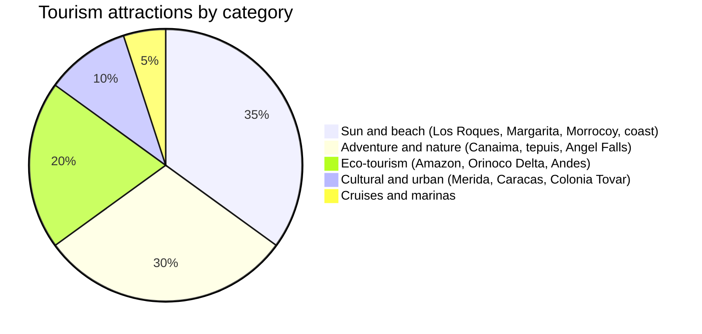
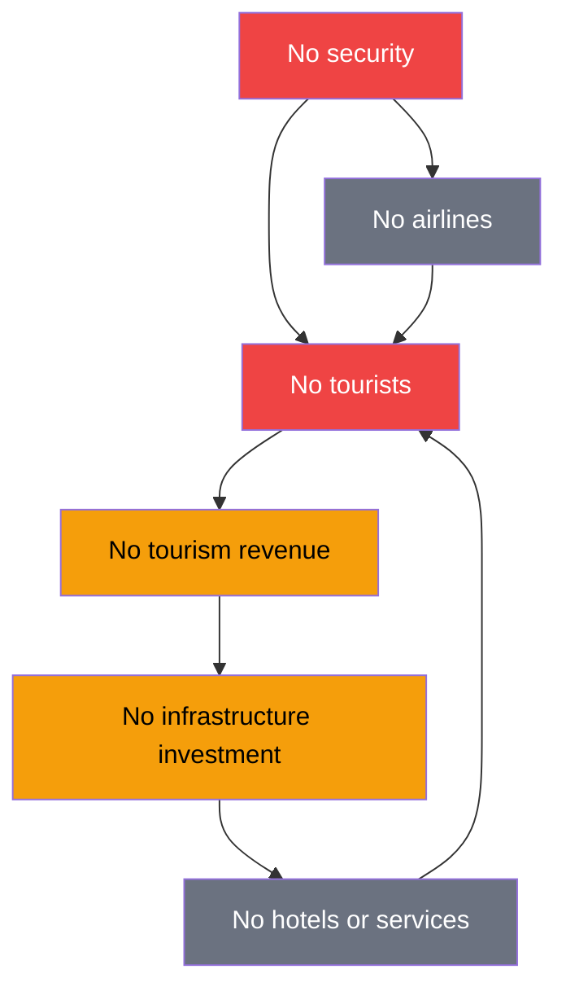
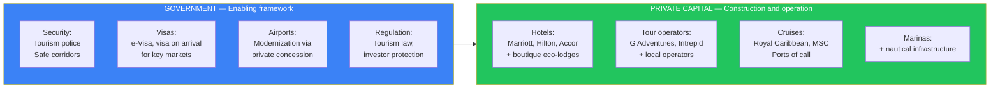
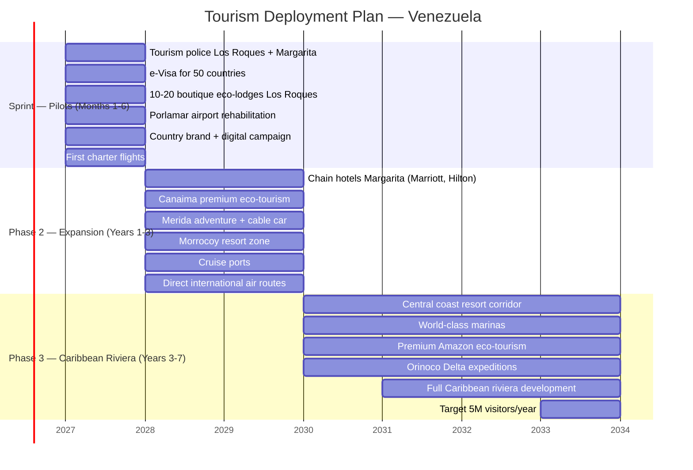
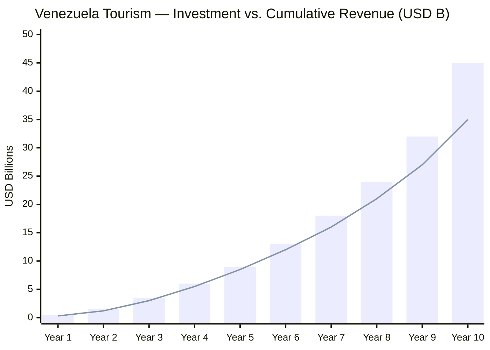

# Tourism: The Unexplored Caribbean

> Venezuela has Angel Falls (the world's tallest waterfall), a pristine Caribbean archipelago, tepuis found nowhere else on the planet, Amazon rainforest, the Andes, and **2,800+ km of Caribbean coastline**. All this with zero tourism infrastructure. The Caribbean market generates **USD 40B+/year**. Costa Rica went from zero to **3M+ visitors** with eco-tourism. The Dominican Republic generates **USD 12B+/year** with sun and sand. Venezuela has more attractions than both combined — and zero competition because nobody has built anything.

---

## 1. The Opportunity: USD 40B+ Market and Zero Competition

:::info The Missing Caribbean
The Caribbean receives **~35 million overnight tourists/year** and **~36 million cruise passengers**. The Dominican Republic alone captures **~12 million visitors and USD 12B+/year**. Venezuela — with more Caribbean coastline, world-unique attractions, and potentially lower prices — captures **virtually zero**. It is not a demand problem. It is a supply problem.
:::

| Data Point | Figure | Source |
|------------|--------|--------|
| Caribbean tourism market (2025) | **~35M overnight visitors + 36M cruise passengers** | [Caribbean Tourism Organization](https://tourismanalytics.com/caribbean-statistics.html) |
| Caribbean tourism revenue | **USD 40B+/year** | [Statista](https://www.statista.com/outlook/mmo/travel-tourism/caribbean) |
| Dominican Republic (2025) | **9.3M visitors** (Jan-Oct), USD 15.5B value added | [Dominican Today](https://dominicantoday.com/dr/tourism/2025/11/16/dominican-republic-shatters-record-attracts-9-2-million-visitors-through-october/) |
| Costa Rica tourism (2025) | **~3.5M visitors**, USD 3.9B in revenue | [Statista](https://www.statista.com/outlook/mmo/travel-tourism/costa-rica) |
| Colombia tourism (2024) | **6.2M tourists**, 4% of GDP | [Medellin Advisors](https://www.medellinadvisors.com/colombia-tourism-figures-2024-perspectives-2025/) |
| Venezuela tourism (2025) | **~2.8M visitors** (Jan-Oct, government figure) | [Travel and Tour World](https://www.travelandtourworld.com/news/article/venezuela-sees-surge-in-tourism-with-over-two-million-international-visitors-in-this-year-boosting-its-appeal-as-a-south-american-destination/) |
| Eco-tourism global (growth) | **12-15% annual** | [HOPE Research Group](https://www.hoperesearchgroup.com/blog/caribbean-eco-tourism-growth) |

### What Venezuela Has That Nobody Else Offers

| Attraction | Category | Uniqueness | Comparable |
|-----------|----------|------------|------------|
| **Angel Falls** | World's tallest waterfall (979 m) | Unique on the planet | Victoria Falls (Zambia/Zimbabwe) |
| **Los Roques** | Caribbean coral archipelago | One of the most pristine reefs in the Caribbean | Turks & Caicos, Maldives |
| **Gran Sabana / Tepuis** | 2-billion-year geological formations | Unique on the planet — Conan Doyle's "The Lost World" | No comparable |
| **Canaima** | National Park, UNESCO Heritage | 30,000 km2 of jungle and tepuis | Torres del Paine (Chile), Yellowstone (U.S.) |
| **Isla de Margarita** | Caribbean island with duty-free | Resort island with massive potential | Aruba, Curacao |
| **Morrocoy** | Cays and reefs in the Caribbean | Turquoise waters, pristine cays | Bay Islands (Honduras) |
| **Merida / Andes** | Mountains + world's highest cable car | Adventure tourism + Andean culture | Cusco (Peru), Bariloche (Argentina) |
| **Orinoco Delta** | Wetlands + Warao culture | Unique river eco-tourism | Pantanal (Brazil) |
| **Venezuelan Amazon** | Tropical rainforest + indigenous communities | Extreme biodiversity | Amazon (Brazil/Ecuador) |
| **Caribbean coastline** | **2,800+ km** | More coastline than any individual Caribbean island | Riviera Maya (Mexico) |

**Translation for investors:** Venezuela has the most diverse tourism catalog in the Caribbean and South America — beach, mountains, jungle, tepuis, waterfalls, reefs, all in one country. The problem was never demand or attractiveness. It was that there is nowhere to stay, no way to get there, and no security to go.

---

## 2. The Current Problem: Why Venezuela Has Zero Real International Tourism

:::danger Reality without makeup
Venezuela has the attractions of a world-class destination and the infrastructure of a failed state. The gap between potential and reality is the investment opportunity.
:::

| Obstacle | Severity | Description |
|----------|----------|-------------|
| **Destroyed hotel infrastructure** | CRITICAL | Chain hotels abandoned or expropriated. No Marriott, Hilton, or Accor operating. Remaining options are artisanal inns without international standards |
| **Zero real international air routes** | CRITICAL | Maiquetia airport deteriorated. Few direct routes from U.S./Europe. Airlines abandoned Venezuela between 2014-2019 |
| **Security** | CRITICAL | [World's highest crime index](https://worldpopulationreview.com/country-rankings/crime-rate-by-country) (Numbeo 80.7). No tourism police. No safe corridors |
| **Visa and entry** | HIGH | Opaque process, no e-visa, no clear reciprocity with key markets (U.S., EU, Canada) |
| **Telecommunications** | HIGH | No reliable 4G/5G in tourist areas. No Wi-Fi at most destinations. [Only 48% of households with internet](https://freedomhouse.org/country/venezuela/freedom-net/2024) |
| **Water and sanitation** | HIGH | Tourist areas without reliable potable water, collapsed wastewater treatment |
| **Roads** | HIGH | Deteriorated highways. Caracas-Merida route (formerly 10 hours) can now take 14+. No signage |
| **Zero marketing** | MEDIUM | Venezuela does not exist on the global tourism radar. No presence at fairs (ITB, FITUR, WTM). No country brand |
| **Payment systems** | MEDIUM | De facto dollarization but no reliable POS/cards in rural areas. No integration with booking platforms |
| **Travel insurance** | MEDIUM | Most international insurers exclude Venezuela from their policies |

### The Current Vicious Cycle

---

## 3. The Solution: Government Sets the Framework, Private Capital Builds

The model is simple: the government does not build hotels, does not operate airlines, does not manage parks. The government does what only the government can do — **security, legal framework, visas, airports** — and private capital builds everything else via concessions.

### What the Government Does (and ONLY the government)

| Function | Concrete Action | Timeline | Reference Model |
|----------|----------------|----------|-----------------|
| **Tourism police** | Create a 2,000+ bilingual officer corps in tourist zones | 6-18 months | Colombia — [Tourism Police](https://www.policia.gov.co/jefatura-nacional-del-servicio-de-policia/dipro/turismo) (941 officers, multiple languages) |
| **Safe corridors** | Tourist zones with 24/7 police presence, visible patrols, cameras | 6-12 months | Mexico (Riviera Maya), Colombia (Cartagena) |
| **e-Visa** | Electronic visa for 50+ countries (U.S., EU, Canada, UK, Japan, Korea, Australia) | 3-6 months | Turkey, India, Kenya — implemented e-Visa and tripled applications |
| **Airport concessions** | Tender operation of Maiquetia, Porlamar, Merida, Puerto Ordaz to private operators | 12-24 months | Colombia (OPAIN operates El Dorado), Mexico (GAP, OMA, ASUR) |
| **Tourism legal framework** | Modern tourism law, investor protection, tax incentives (0% VAT in tourist zones for 10 years) | 6-12 months | Dominican Republic (Law 158-01 tourism incentive) |
| **Country brand** | International campaign "Venezuela Is Open" — presence at ITB Berlin, FITUR Madrid, WTM London | 3-6 months | Colombia ("Colombia is Magical"), Costa Rica ("Pura Vida") |

### What Private Capital Builds (via concessions)

| Sector | Opportunity | Estimated Investment | Model |
|--------|-------------|---------------------|-------|
| **Chain hotels** | 5,000-15,000 new rooms (Marriott, Hilton, Accor, IHG) | USD 3-8B | Marriott signed 94 deals in LATAM in 2025. Hilton surpassed 300 hotels in the region — [Hilton](https://stories.hilton.com/releases/hilton-ends-2025-with-robust-luxury-and-lifestyle-growth-across-the-caribbean-and-latin-america) |
| **Boutique eco-lodges** | 200-500 boutique properties in Los Roques, Canaima, Merida, Amazon | USD 500M-1.5B | Costa Rica has 500+ certified eco-lodges |
| **Tour operators** | Adventure, eco-tourism, cultural operations | USD 100-300M | G Adventures, Intrepid Travel, National Geographic Expeditions |
| **Cruises** | Ports of call in Margarita, central coast | USD 500M-1B | Caribbean receives ~36M cruise passengers/year. Venezuela = zero |
| **Marinas** | 10-20 world-class marinas | USD 300-800M | BVI, St. Martin — nautical tourism USD 5B+ in Caribbean |
| **Restaurants and retail** | Gastronomy, crafts, duty-free | USD 200-500M | Margarita had a free zone — reactivatable |

---

## 4. Deployment Phases

### Sprint: Months 1-6 — Los Roques + Margarita as Pilots

:::tip Why Los Roques and Margarita first
They are **islands**. The security perimeter is natural — the sea. Access is controllable (small aircraft/ferry). Infrastructure investment is concentrated. And Los Roques is already a cult destination among those who know it — it just needs decent eco-lodges and reliable flights.
:::

| Action | Detail | Investment | Responsible |
|--------|--------|-----------|-------------|
| **Tourism police** | 200 bilingual officers between Los Roques and Margarita | USD 5M/year | Government |
| **e-Visa** | Electronic system for 50+ nationalities. 48-hour approval | USD 2-5M | Government + tech provider |
| **Eco-lodges Los Roques** | 10-20 boutique properties (8-20 rooms each). Solar energy, desalination, zero impact | USD 50-100M | Private investors / Airbnb Luxe |
| **Porlamar airport rehabilitation** | Concession to private operator. New terminal, duty-free | USD 50-100M | Private concessionaire |
| **Charter flights** | Agreements with Copa, JetBlue, LATAM for Panama-Margarita, Miami-Margarita routes | USD 0 (temporary slot subsidy) | Government + airlines |
| **Digital campaign** | Influencers, National Geographic partnership, Travel + Leisure feature | USD 5-10M | Marketing agency + government |
| **Connectivity** | Starlink in Los Roques + Margarita. Reinforced 4G | USD 5-10M | Private operators |
| **TOTAL Sprint** | | **USD 120-230M** | |

### Phase 2: Years 1-3 — Canaima, Merida, Morrocoy

| Destination | Investment | Tourism Type | Capacity Target |
|-------------|-----------|-------------|-----------------|
| **Margarita** — Chain resorts | USD 1-2B | Sun and beach, all-inclusive, conferences | 5,000 new rooms |
| **Canaima / Angel Falls** | USD 300-500M | Premium eco-tourism, adventure | 500 eco-lodge rooms + camps |
| **Merida / Andes** | USD 200-400M | Adventure, mountain, cable car, culture | 1,000 rooms |
| **Morrocoy** | USD 300-500M | Beach resorts, nautical | 2,000 rooms |
| **Cruise ports** | USD 500M-1B | Cruises as port of call | Capacity for 500K+ cruise passengers/year |
| **TOTAL Phase 2** | **USD 2.3-4.4B** | | |

### Phase 3: Years 3-7 — Full Caribbean Riviera

| Destination | Investment | Tourism Type | Capacity Target |
|-------------|-----------|-------------|-----------------|
| **Central coast** (Choroni, Chichiriviche, Tucacas) | USD 1-2B | Resort corridor like Riviera Maya | 5,000 rooms |
| **Marinas** | USD 300-800M | Nautical tourism, yachting | 10-20 marinas |
| **Venezuelan Amazon** | USD 100-200M | Expedition eco-tourism | 200 eco-lodge rooms |
| **Orinoco Delta** | USD 50-100M | River expeditions, Warao culture | 100 floating rooms |
| **Gran Sabana highway** | USD 200-400M | Road trip + inns + tepuis | 500 rooms |
| **TOTAL Phase 3** | **USD 1.7-3.5B** | | |

---

## 5. Required Infrastructure

| Component | What Is Needed | Estimated Cost | Timeline | Who Provides It |
|-----------|---------------|----------------|----------|-----------------|
| **Maiquetia airport** | International terminal modernization, new runway, navigation systems | USD 500M-1B | 2-4 years | Private concessionaire (El Dorado, Bogota model) |
| **Porlamar airport** | Full rehabilitation, new terminal, duty-free | USD 100-200M | 1-2 years | Private concessionaire |
| **Merida airport** | Runway extension, new terminal | USD 50-100M | 1-2 years | Private concessionaire |
| **Puerto Ordaz airport** | Hub for Canaima, terminal improvement | USD 50-100M | 1-2 years | Private concessionaire |
| **Canaima airstrip** | Rehabilitation for medium aircraft (ATR-72) | USD 20-50M | 6-12 months | Government + concessionaire |
| **Tourism highways** | Key route rehabilitation: Caracas-Merida, Caracas-Morrocoy, Puerto Ordaz-Santa Elena | USD 1-2B | 2-5 years | Toll concessions |
| **Cruise ports** | 2-3 cruise terminals (Margarita, La Guaira, Puerto Cabello) | USD 500M-1B | 2-4 years | Private concessionaire |
| **Hotels** | 10,000-20,000 new rooms | USD 3-8B | 2-7 years | Hotel chains + investors |
| **Telecommunications** | 4G/5G in tourist areas, public Wi-Fi, fiber optic | USD 200-400M | 1-3 years | Telecom operators |
| **Water and sanitation** | Treatment plants, desalination on islands, aqueducts | USD 300-600M | 2-4 years | Concessions + multilaterals |
| **Electricity** | Reliable generation and distribution in tourist areas | USD 200-500M | 1-3 years | See [Electrical Capacity](./capacidad-electrica) |
| **Marinas** | 10-20 world-class marinas | USD 300-800M | 2-5 years | Private nautical investors |
| **TOTAL** | | **USD 6.2-14.8B** | **1-7 years** | |

:::caution Note on costs
Tourism infrastructure is financed with direct returns: hotels generate revenue, airports charge fees, highways charge tolls, ports charge docking fees. **This is not public spending — it is private investment with returns.** The government only funds tourism police, visas, and regulatory framework (~USD 50-100M/year).
:::

---

## 6. Business Model

### Revenue Streams by Actor

| Actor | Role | Revenue Model | Estimated Revenue (year 7) |
|-------|------|---------------|---------------------------|
| **Hotel chains** | Build and operate hotels | Revenue per room (ADR USD 150-300) | USD 2-4B/year |
| **Eco-lodges** | Premium boutique tourism | ADR USD 200-500 (high-value niche) | USD 300-600M/year |
| **Tour operators** | Excursions, adventure, cultural | USD 50-200/person/day | USD 500M-1B/year |
| **Cruises** | Ports of call | Port fee + onshore spending (USD 100-150/passenger) | USD 300-500M/year |
| **Airlines** | International flights | Airport fees + traffic | USD 200-400M/year |
| **Restaurants / retail** | Gastronomy, crafts, duty-free | Average tourist spending | USD 500M-1B/year |
| **Government** | Taxes, fees, concessions | 15% flat + 12% VAT + airport/port fees | USD 1-2B/year |

### Concessions to International Chains

| Chain | Opportunity | Format | Regional Precedent |
|-------|-------------|--------|-------------------|
| **Marriott** | Margarita, Caracas, central coast | JW Marriott Resort, Autograph Collection | 555 hotels in LATAM (2025), [94 deals signed in 2025](https://www.travelpulse.com/news/hotels-and-resorts/marriott-international-outlines-2025-expansion-in-caribbean-latin-america-region) |
| **Hilton** | Margarita, Merida, Los Roques (Curio) | Hilton Resort, Conrad, Curio Collection | [300+ hotels in LATAM](https://stories.hilton.com/releases/hilton-ends-2025-with-robust-luxury-and-lifestyle-growth-across-the-caribbean-and-latin-america), 150 in pipeline |
| **Accor** | Caracas, Margarita, coast | Sofitel, Fairmont, MGallery | Strong presence in Brazil and Colombia |
| **IHG** | Margarita, Morrocoy | InterContinental, Holiday Inn Resort | Aggressive Caribbean expansion |
| **Selina / boutique** | Merida, Canaima, Los Roques | Premium hostel + co-working | Proven model in Colombia, Costa Rica, Panama |
| **Airbnb** | Nationwide | Platform + Airbnb Luxe | [Requires research] on regulatory framework |

### Tourist Spending per Visitor (projection)

| Segment | Avg. Daily Spending | Avg. Stay | Total Spend per Visit |
|---------|---------------------|-----------|----------------------|
| **Sun and beach (all-inclusive)** | USD 200-350 | 5-7 days | USD 1,000-2,450 |
| **Premium eco-tourism** | USD 250-500 | 4-6 days | USD 1,000-3,000 |
| **Adventure (Canaima, tepuis)** | USD 150-300 | 3-5 days | USD 450-1,500 |
| **Cruise (port of call)** | USD 100-150 | 1 day | USD 100-150 |
| **Backpacker / budget** | USD 50-100 | 7-14 days | USD 350-1,400 |
| **Weighted average** | **~USD 180** | **~5 days** | **~USD 900** |

---

## 7. Security: The Existential Prerequisite

:::danger Without security, zero tourists
A single viral social media incident — a tourist robbed, kidnapped, or killed — destroys years of marketing effort. Tourism security is not a "nice to have." It is the **sine qua non condition** of the entire strategy. Colombia understood this. Mexico is still learning.
:::

### Model: Colombia's Tourism Police

Colombia is the perfect comparable. A country with a violent past that reinvented itself as a tourism destination, going from **0.5M visitors (2003) to 6.2M (2024)**. A central pillar: the [Tourism Police](https://www.policia.gov.co/jefatura-nacional-del-servicio-de-policia/dipro/turismo).

| Element | Colombia Model | Venezuela Adaptation |
|---------|----------------|---------------------|
| **Officers** | 941 tourism police in 51 zones | 2,000+ officers in 10 priority tourist zones |
| **Languages** | English, Portuguese, French, Chinese, sign language | English, Portuguese, French (minimum) |
| **Functions** | Orientation, surveillance, operator oversight, complaint handling | Identical + beach and mountain patrols |
| **Patrols** | Bicycle, motorcycle, on foot | + nautical patrols in Los Roques, Morrocoy, Margarita |
| **Technology** | Vehicles with monitoring technology | AI cameras, real-time reporting app, panic button |
| **Result** | Colombia went from "no-go" country to top 5 LATAM destinations | Objective: remove Venezuela from "do not travel" advisory within 3 years |

### Tourism Safety Corridors

| Corridor | Route | Measures |
|----------|-------|---------|
| **Los Roques** | Natural perimeter (islands) | Maritime/air access control, tourism police on Gran Roque and main cays |
| **Margarita** | Entire island | Tourism police, cameras in hotel zones, beach patrols |
| **Canaima - Angel Falls** | Canaima airport -> camps -> Churun River | Mandatory certified guides, GPS tracking, satellite communication |
| **Merida** | City + cable car + Andean villages | Urban tourism police + mountain patrols |
| **Morrocoy** | National Park + cays | Access control, nautical patrols, supervised swimming zones |
| **Central coast** (Choroni, Chuao) | Maracay-Choroni highway + beaches | Road patrols, beach police, lighting |

### International Travel Insurance

| Action | Detail | Timeline |
|--------|--------|----------|
| **Agreement with insurers** | Negotiate with World Nomads, Allianz, AXA to include Venezuela in standard policies | 6-12 months |
| **Tourism guarantee fund** | Government creates fund to cover tourist emergencies (Turkey model) | 3-6 months |
| **24/7 assistance** | Multilingual tourism emergency hotline (tourism 911) | 3-6 months |
| **Reference hospital** | At least 1 private clinic with JCI standard in each tourist zone | 1-3 years |

---

## 8. Projection: From Zero to USD 15B/Year

### 10-Year Projection

| Year | International Visitors | Tourism Revenue | Hotel Rooms | Direct Jobs | Total Jobs (with multiplier) |
|------|----------------------|-----------------|-------------|-------------|------------------------------|
| **1** | 500K | USD 450M | 3,000 | 15,000 | 45,000 |
| **2** | 800K | USD 720M | 5,000 | 25,000 | 75,000 |
| **3** | 1.2M | USD 1.1B | 8,000 | 40,000 | 120,000 |
| **4** | 1.8M | USD 1.6B | 12,000 | 60,000 | 180,000 |
| **5** | 2.5M | USD 2.3B | 15,000 | 80,000 | 240,000 |
| **6** | 3M | USD 3B | 18,000 | 100,000 | 300,000 |
| **7** | 3.5M | USD 4B | 20,000 | 120,000 | 360,000 |
| **8** | 4M | USD 5B | 22,000 | 140,000 | 420,000 |
| **9** | 4.5M | USD 7B | 25,000 | 160,000 | 480,000 |
| **10** | 5M | USD 10-15B | 30,000 | 200,000 | 500,000+ |

:::caution Projection Assumptions
- **Average spend per tourist:** USD 900 (year 1) scaling to USD 2,000-3,000 (year 10) as luxury and eco-premium segments grow
- **Occupancy rate:** 45% (year 1) scaling to 75% (year 7+)
- **Employment multiplier:** 3x (tourism industry standard — [WTTC](https://wttc.org/))
- **Does not include domestic tourism** — which could double the figures
- **Conservative base price** — Dominican Republic generates USD 12B+ with 11M visitors; Venezuela could reach similar figures with premium offerings
- **Assumes security and sanctions resolution in years 1-2**
:::

### Cumulative Revenue vs. Investment

*Bars = cumulative revenue. Line = cumulative investment.*

### GDP Contribution

| Metric | Year 5 | Year 10 |
|--------|--------|---------|
| Tourism revenue | USD 2.3B | USD 10-15B |
| % of GDP (base USD 83B) | **2.8%** | **12-18%** |
| Taxes generated (15% + VAT) | USD 350-500M | USD 1.5-2.5B |
| Total jobs | 240,000 | 500,000+ |

---

## 9. International Comparables

| Country | Starting Situation | What They Did | Result | Lesson for Venezuela |
|---------|-------------------|--------------|--------|----------------------|
| **Costa Rica** | Agricultural country with no tourism. 1980s: <300K visitors | Bet on eco-tourism. 25% of territory as protected area. "Pura Vida" brand. Zero military -> budget to parks | **3.5M+ visitors**, USD 3.9B/year, **~8% of GDP**. Target 5.2M by 2035 — [Costa Rica Tourism Plan](https://ticosland.com/costa-rica-launches-ambitious-plan-to-attract-5-million-tourists/) | Venezuela has more biodiversity, more coastline, more unique attractions. Eco-tourism is the entry point |
| **Dominican Republic** | Poor island in the 1970s. No tourism infrastructure | Law 158-01 incentives: total tax exemption for 15 years for hotels. Airport concessions. Mass all-inclusive | **11-12M visitors**, **USD 12B+/year**, 815K jobs, 77% occupancy — [Dominican Today](https://dominicantoday.com/dr/tourism/2025/11/16/dominican-republic-shatters-record-attracts-9-2-million-visitors-through-october/) | All-inclusive model works for volume. Tax incentives attract chains. Venezuela can replicate in Margarita |
| **Colombia** | Country in civil war. 2003: 0.5M visitors. "Do not travel" | Peace agreements (2016). Tourism police. "Colombia is Magical" brand. Netflix (Narcos) as unintentional marketing | **6.2M tourists (2024)**, 4% of GDP, 11% annual growth — [Colombia One](https://colombiaone.com/2025/07/04/colombia-international-visitors-tourism-grows/) | The most direct comparable: post-conflict country building tourism from zero. Tourism police is key |
| **Croatia** | Post-war Yugoslavia (1995). Destroyed infrastructure | Investment in coasts (Dubrovnik, Split). EU as framework. Game of Thrones as catalyst | **20M+ visitors**, 20% of GDP | Post-conflict country with coastline. Similar size. Tourism as main economic engine |
| **Rwanda** | Post-genocide (1994). Destroyed country | Mountain gorillas as anchor. Permits at USD 1,500/person. "Visit Rwanda" on Arsenal jerseys | **1.8M visitors**, USD 620M/year, tourism = main source of foreign exchange | Ultra-premium niche tourism. Venezuela can do the same with tepuis and Angel Falls |

:::tip The lesson from Colombia
Colombia went from being the most dangerous country in the hemisphere to receiving **6.2 million tourists in 2024** — a **12x growth in 20 years**. They did it with three things: security (tourism police), marketing (country brand), and infrastructure (El Dorado airport, highways). Venezuela has more natural attractions than Colombia. It just needs to replicate the formula.
:::

---

## 10. Potential Partners

| Company/Entity | Role | Why They Would Participate |
|-----------------|------|---------------------------|
| **Marriott International** | Anchor hotel chain | [94 deals in LATAM in 2025](https://www.travelpulse.com/news/hotels-and-resorts/marriott-international-outlines-2025-expansion-in-caribbean-latin-america-region). Aggressive Caribbean expansion. Venezuela = total greenfield |
| **Hilton** | Hotel chain | [300+ hotels in LATAM](https://stories.hilton.com/releases/hilton-ends-2025-with-robust-luxury-and-lifestyle-growth-across-the-caribbean-and-latin-america), 150 in pipeline. Brands like Curio Collection perfect for eco-lodges |
| **Accor** | Hotel chain (Sofitel, Fairmont) | Strong in Brazil and Colombia. Margarita and Caracas as natural expansion |
| **Royal Caribbean / MSC** | Cruise lines | Caribbean is their #1 market. Venezuela = new port of call with unique attractions |
| **Copa Airlines** | Panama hub -> LATAM connections | Already flies to Venezuela. Capacity to increase frequencies quickly |
| **JetBlue** | Low-cost U.S. -> Caribbean | Dominates Caribbean routes from U.S. Venezuela = virgin market |
| **LATAM Airlines** | South America's largest airline | Connections from Santiago, Lima, Bogota, Sao Paulo |
| **American / United / Delta** | U.S. majors | Used to fly to Venezuela pre-crisis. Reactivate routes with latent demand |
| **Airbnb** | Accommodation platform | Venezuela = virgin market. Can drive eco-lodges and experiences |
| **G Adventures / Intrepid** | Adventure tour operators | Specialized in post-conflict emerging destinations. Already operate in Colombia |
| **National Geographic** | Media + expeditions | Canaima and tepuis = world-class content. Partnership for documentaries + tours |
| **UNWTO** | World Tourism Organization | Technical assistance for sustainable tourism development. International credibility |
| **IDB / CAF** | Multilateral financing | Loans for tourism infrastructure (airports, highways, water) |
| **IFC (World Bank)** | Private financing | Investment in hotel and tourism projects in frontier markets |

---

## 11. Risks and Mitigations

| # | Risk | Prob. | Impact | Mitigation |
|---|------|-------|--------|------------|
| 1 | **Viral security incident** — tourist robbed/kidnapped on social media | High | Critical | Tourism police from day 1. Pilot zones on islands (natural perimeter). Rapid response protocol. Tourism guarantee insurance |
| 2 | **Sanctions not lifted** — airlines and chains cannot operate | Medium-High | Critical | Start with non-U.S. operators (Accor, Air France). Seek specific OFAC licenses for tourism (Chevron model) |
| 3 | **Infrastructure not built on time** — airports, highways | Medium | High | Concessions with penalties. Prioritize island destinations requiring less land infrastructure |
| 4 | **Natural disaster** — hurricane, flood | Medium-Low | High | Venezuela is south of the hurricane belt (advantage vs. rest of Caribbean). Infrastructure insurance |
| 5 | **Regional competition** — DR, Colombia, Costa Rica capture all demand | Medium | Medium | Differentiation: tepuis, Angel Falls, Los Roques are unique. Compete on price + exclusivity, not volume initially |
| 6 | **Chains do not accept the risk** — Marriott/Hilton say "not yet" | Medium | Medium | Start with boutique and adventurous operators (Selina, G Adventures). Chains will enter when they see traction |
| 7 | **Environmental damage** — tourism development destroys what makes it attractive | Medium | High | Strict zoning. Carrying capacity per destination. Mandatory eco-tourism certification. Costa Rica model |
| 8 | **Concession corruption** — rigged tenders, cost overruns | High | Medium | Total transparency. International public tenders. Big 4 audit. [Santiago Principles](https://www.ifswf.org/santiago-principles)-type governance |

---

## 12. Call to Action

### For a Hotel Chain (Marriott, Hilton, Accor)

| Requirement | Status | Who Solves It |
|-------------|--------|---------------|
| Security in tourist zone | Tourism police in process | Government |
| Land with clean title | Requires resolution of expropriations | Government + courts |
| Tax incentives (DR Law 158-01 model) | Requires legislation | Government |
| Functional airport | Concession in process | Private operator |
| Proven demand | Charter flights + first eco-lodges as proof of concept | Sprint (months 1-6) |
| Sanctions lifting (if applicable) | In negotiation | U.S. government |

### For a Financial Investor

| Criterion | Venezuela Tourism |
|-----------|-------------------|
| **TAM** | USD 40B+ Caribbean tourism market |
| **SAM** | USD 12-15B (Dominican Republic comparable) |
| **SOM** | USD 2-5B/year in year 5-7 (2.5-5M visitors) |
| **Competitive advantage** | Unique attractions (tepuis, Angel Falls, Los Roques). 2,800+ km coastline. Low prices due to depressed dollarized economy |
| **Moat** | Tepuis and Angel Falls cannot be replicated. Geography is a permanent advantage |
| **Primary risk** | Security + political risk. Mitigated with island pilot zones, tourism police, MIGA insurance |
| **Comparable** | Colombia: 0.5M -> 6.2M visitors in 20 years. Croatia: post-war -> 20M visitors. Costa Rica: agricultural -> 3.5M eco-tourists |
| **Exit** | Sale of hotel chain or eco-lodge portfolio to tourism REIT. Operator IPO |

### Concrete Next Steps

1. **Los Roques Sprint** — 10 boutique eco-lodges + tourism police + charter flights. Proof of concept in 6 months
2. **e-Visa** — Electronic system for 50+ nationalities. Implementable in 3 months with tech provider
3. **Porlamar airport concession** — International tender. Signal to the market
4. **Country brand** — "Venezuela Is Open" campaign with National Geographic partnership
5. **MoU with Marriott or Hilton** — Letter of intent for 5-10 properties in Margarita and central coast

:::info This is not a dream — it is a USD 40B+ market waiting
The Dominican Republic generates USD 12B+/year with sun and sand. Colombia generates USD 9.5B/year having started from war. Costa Rica generates USD 3.9B/year with eco-tourism. Venezuela has more coastline, more biodiversity, more unique attractions, and lower prices than all three. Infrastructure can be built. Attractions cannot be invented. And Venezuela has them.
:::

---

## Related Documents

- [Roads & Logistics](./vialidad-logistica) — Roads, airports, and transport corridors needed to connect tourist destinations
- [Maritime Transport](./transporte-maritimo) — Cruise terminals, inter-island ferries, and access to islands like Los Roques and Margarita
- [Telecommunications](./telecomunicaciones) — Starlink and 5G connectivity for remote tourist destinations and digital nomads
- [Water & Sanitation](./agua-saneamiento) — Potable water and sanitation in coastal and island destinations
- [Electrical Capacity](./capacidad-electrica) — Reliable electricity for hotels, airports, and destinations
- [Construction & Real Estate](./construccion-inmobiliaria) — Hotels, resorts, and housing for tourist zones
- [Concession Model](./modelo-concesiones) — Concession framework for airports, hotels, and tourism operators

---

## Consolidated Sources

| # | Source | URL | Data |
|---|--------|-----|------|
| 1 | Caribbean Tourism Organization / Tourism Analytics | [tourismanalytics.com](https://tourismanalytics.com/caribbean-statistics.html) | ~35M overnight visitors, ~36M cruise passengers in Caribbean |
| 2 | Statista | [statista.com](https://www.statista.com/outlook/mmo/travel-tourism/caribbean) | Caribbean tourism revenue USD 40B+ |
| 3 | Dominican Today | [dominicantoday.com](https://dominicantoday.com/dr/tourism/2025/11/16/dominican-republic-shatters-record-attracts-9-2-million-visitors-through-october/) | DR 9.3M visitors (Jan-Oct 2025), USD 15.5B value added |
| 4 | Travel and Tour World | [travelandtourworld.com](https://www.travelandtourworld.com/news/article/venezuela-sees-surge-in-tourism-with-over-two-million-international-visitors-in-this-year-boosting-its-appeal-as-a-south-american-destination/) | Venezuela 2.8M visitors (Jan-Oct 2025, government figure) |
| 5 | Hilton | [stories.hilton.com](https://stories.hilton.com/releases/hilton-ends-2025-with-robust-luxury-and-lifestyle-growth-across-the-caribbean-and-latin-america) | 300+ hotels in LATAM, 150 in pipeline |
| 6 | Marriott / TravelPulse | [travelpulse.com](https://www.travelpulse.com/news/hotels-and-resorts/marriott-international-outlines-2025-expansion-in-caribbean-latin-america-region) | 94 deals in LATAM in 2025, 555 hotels |
| 7 | Medellin Advisors | [medellinadvisors.com](https://www.medellinadvisors.com/colombia-tourism-figures-2024-perspectives-2025/) | Colombia 6.2M tourists (2024), 4% GDP |
| 8 | Colombia One | [colombiaone.com](https://colombiaone.com/2025/07/04/colombia-international-visitors-tourism-grows/) | Colombia tourism growth 2025 |
| 9 | National Police of Colombia | [policia.gov.co](https://www.policia.gov.co/jefatura-nacional-del-servicio-de-policia/dipro/turismo) | Tourism Police: 941 officers, 51 zones |
| 10 | Statista (Costa Rica) | [statista.com](https://www.statista.com/outlook/mmo/travel-tourism/costa-rica) | Costa Rica ~3.5M visitors, USD 3.9B |
| 11 | Ticos Land | [ticosland.com](https://ticosland.com/costa-rica-launches-ambitious-plan-to-attract-5-million-tourists/) | Costa Rica target 5.2M visitors by 2035 |
| 12 | HOPE Research Group | [hoperesearchgroup.com](https://www.hoperesearchgroup.com/blog/caribbean-eco-tourism-growth) | Caribbean eco-tourism growing 12-15% annually |
| 13 | Freedom House 2024 | [freedomhouse.org](https://freedomhouse.org/country/venezuela/freedom-net/2024) | 48% of households with internet in Venezuela |
| 14 | World Population Review / Numbeo | [worldpopulationreview.com](https://worldpopulationreview.com/country-rankings/crime-rate-by-country) | Venezuela #1 crime index (80.7) |
| 15 | WTTC | [wttc.org](https://wttc.org/) | Tourism employment multiplier: 3x |
