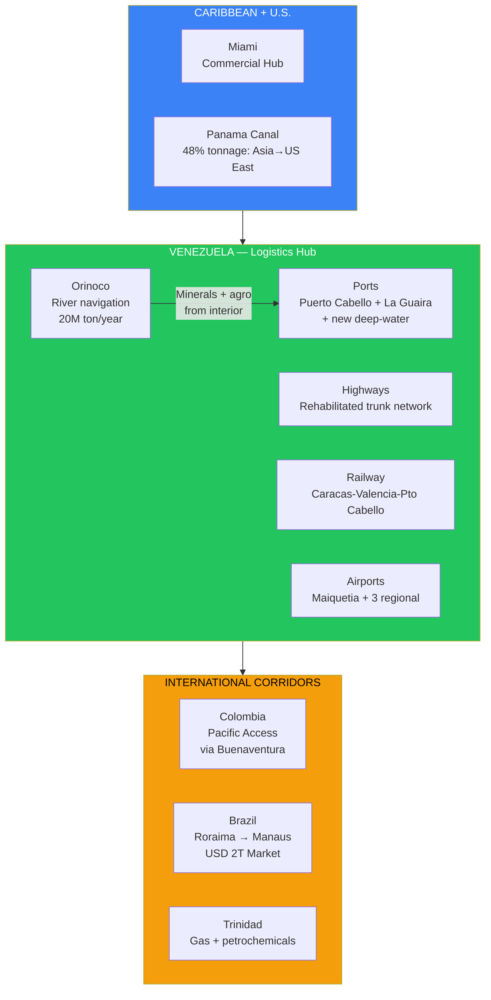
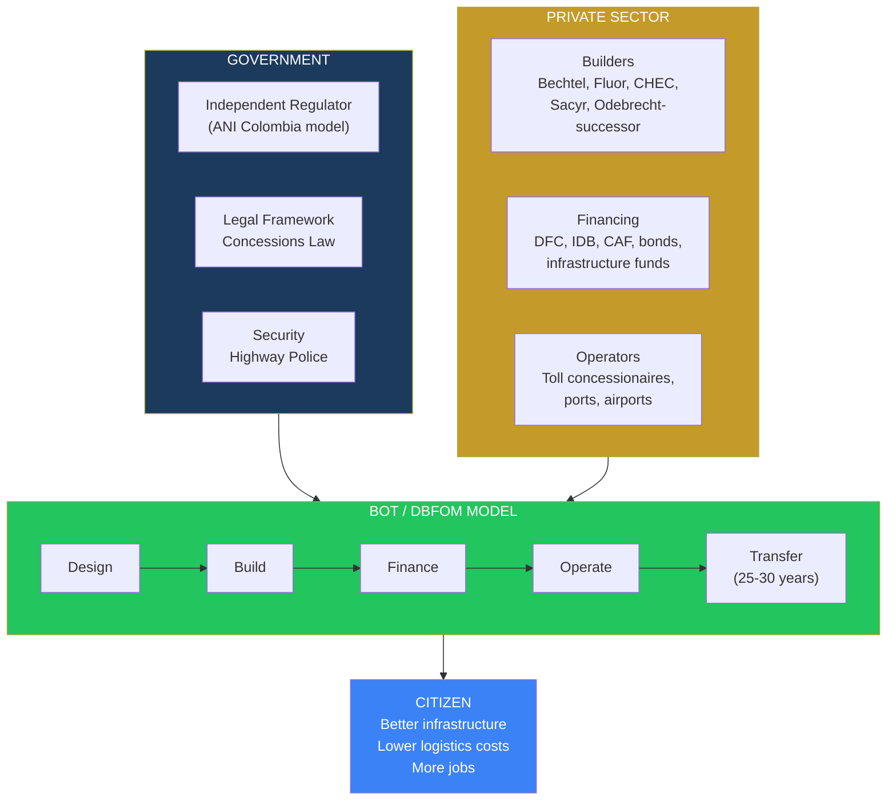
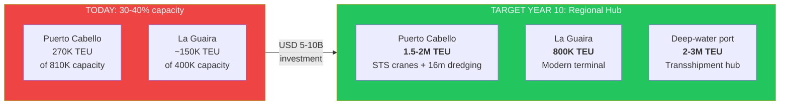
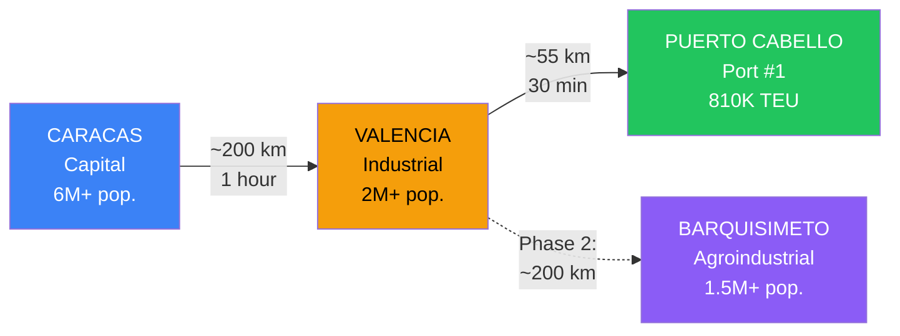
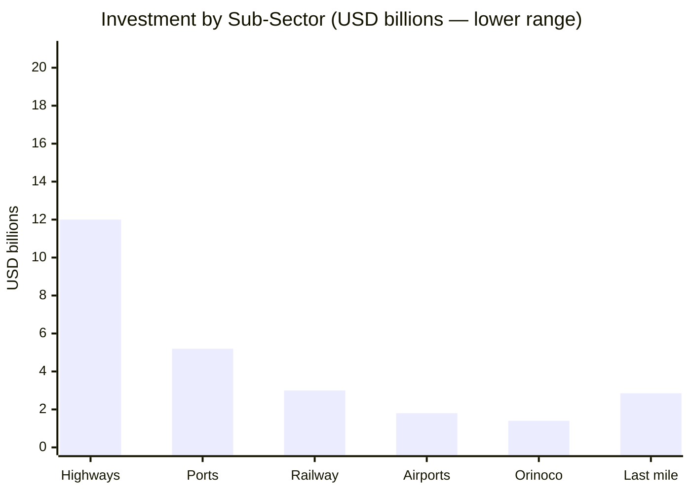
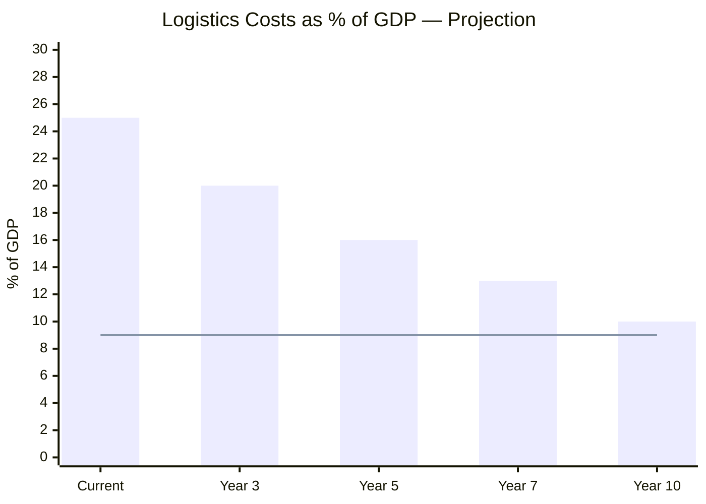
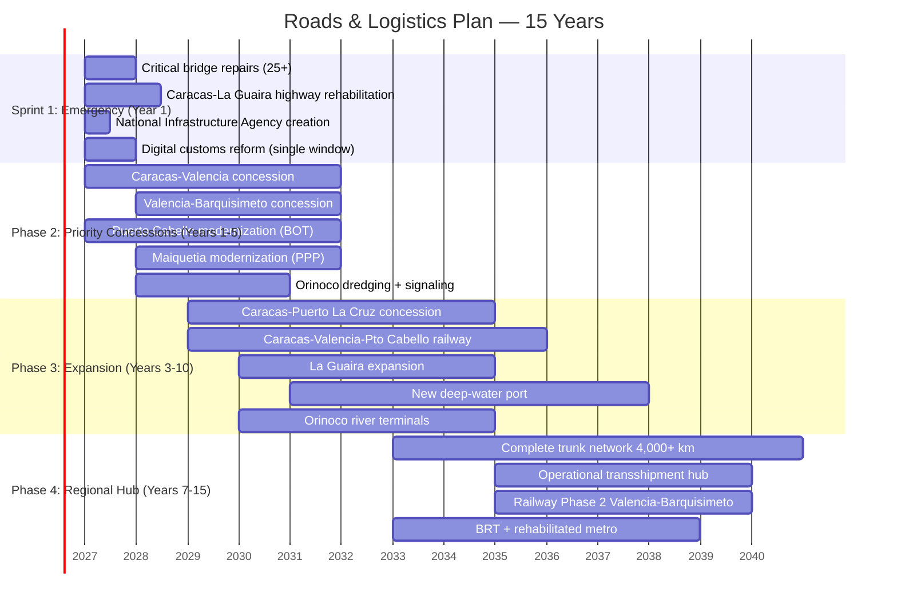

# Roads & Logistics: The Circulatory System of Reconstruction

> Venezuela sits on one of the most privileged geographic positions in the hemisphere — between the Caribbean, the Pacific (via Colombia), the Atlantic (via Brazil), and within striking distance of the Panama Canal. But today it cannot move a container from Puerto Cabello to Barquisimeto without it costing more than shipping it from Shanghai. The country's circulatory system has suffered a heart attack. Repairing it is not an expense — it is the prerequisite for everything else to work.

---

## 1. The Opportunity: Trade Corridor Between Three Oceans

:::info Strategic geographic position
Venezuela has **2,800 km of Caribbean coastline**, a direct border with Colombia (Pacific access), a border with Brazil (South Atlantic access), proximity to the Panama Canal, and to the Caribbean transshipment triangle (Freeport-Colon-Port of Spain). No other country in the region has simultaneous access to these three trade routes.
:::

| Geographic Advantage | Data | Implication |
|---------------------|------|-------------|
| **Caribbean coast** | 2,800 km with natural ports | Direct access to Caribbean-U.S.-Europe routes |
| **Proximity to Panama** | ~1,200 km to Colon | Connection to Asia-U.S. East Coast route (48% of Canal tonnage) |
| **Colombia border** | 2,219 km | Pacific access via Buenaventura; CAN trade corridor |
| **Brazil border** | 2,200 km | Access to LATAM's largest market (USD 2T GDP) |
| **Navigable Orinoco River** | 450 km (Ciudad Guayana to delta) | River transport for minerals and heavy cargo; capacity **20M ton/year** |
| **Existing road network** | ~96,000 km (paved + unpaved) | Base for rehabilitation — not starting from zero |

### Why Venezuela can be a regional logistics hub

The Caribbean handles **80% of hemispheric trade** between Asia, Europe, and the Americas. Current hubs — Panama (Colon), Colombia (Cartagena), Jamaica (Kingston) — are reaching capacity. Venezuela, with underutilized ports, a navigable Orinoco River, and an intermediate geographic position, can capture a significant share of cargo flow if it solves three problems: infrastructure, legal certainty, and customs efficiency.

---

## 2. The Current Problem: Anatomy of a Logistics Collapse

:::danger Unsustainable logistics costs
In LATAM, logistics costs represent **16-26% of GDP** vs. 9% in OECD countries — [World Bank / ECLAC](https://copenhagenconsensus.com/sites/default/files/infrastructure_guasch_sp_final.pdf). Venezuela is at the upper extreme: destroyed road network, ports at 30-40% capacity, zero operational railway, and transport costs representing up to **35% of product value**. Every kilometer of deteriorated road is an invisible tax on the 40 million Venezuelans.
:::

### 2.1 Roads and highways

| Indicator | Venezuela (2025) | LATAM Average | OECD |
|-----------|-----------------|----------------|------|
| Total road network | ~96,000 km | — | — |
| % paved | ~33% | 25-50% | 80-100% |
| Road quality (1-7) | **2.6** (2019, last data) | 3.5-4.5 | 5.0-6.0 |
| Collapsed bridges (2024-2025) | **25+ in Andean region alone** | — | — |
| Toll systems | Nonexistent/abandoned | Electronic | Free-flow |

Sources: [TheGlobalEconomy](https://www.theglobaleconomy.com/Venezuela/roads_quality/); [Venezuelanalysis](https://venezuelanalysis.com/news/venezuela-deploys-nationwide-task-force-after-heavy-rains-cut-off-thousands-and-damage-road-infrastructure/).

**Recent events:**
- Collapse of the Jose Antonio Paez highway viaduct in Portuguesa (2025) — isolated entire communities
- 25 bridges destroyed in the Andean region by torrential rains — 16 completely destroyed
- La Cabrera viaduct in permanent deterioration due to lack of maintenance
- The Caracas-La Guaira highway (the country's most important) requires comprehensive intervention

### 2.2 Ports

| Port | Installed Capacity (TEU) | Actual Throughput (est.) | % Utilization | Main Problem |
|------|--------------------------|------------------------|---------------|-------------|
| **Puerto Cabello** | ~810,000 TEU/year | ~270,000 TEU (2023) | **~33%** | Obsolete cranes, insufficient dredging, corrupt customs |
| **La Guaira** | ~400,000 TEU/year | ~150,000 TEU (est.) | **~38%** | 26 deteriorated berths, congested road access |
| **Maracaibo** | Reduced capacity | Minimal | **<20%** | Bridge over the Lake limits draft; sedimentation |
| **Puerto Ordaz** (river) | Designed for bulk cargo | Limited operation | **<25%** | Deteriorated port infrastructure |

Sources: [Unisco — Puerto Cabello](https://www.unisco.com/international-ports/puerto-cabello-venezuela); [SobelNet](https://sobelnet.com/venezuelas-largest-container-port-faces-severe-infrastructure-challenges/); [Marine Insight](https://www.marineinsight.com/know-more/ports-and-oil-terminals-in-venezuela/).

:::caution Processes that used to take hours now take days
According to operator reports, cargo handling at Venezuelan ports has deteriorated to the point where processes that used to take hours now require **days**. This is not just inefficiency — it is a direct tax on the price of every imported product that reaches the shelves for Venezuelans.
:::

### 2.3 Airports

| Airport | City | Status | Problem |
|---------|------|--------|---------|
| **Maiquetia (CCS)** | Caracas | Partially operational | 6 international airlines withdrew permits (Nov. 2025); reduced connectivity |
| **La Chinita** | Maracaibo | Deteriorated | Limited international operations |
| **Arturo Michelena** | Valencia | Deteriorated | Potential as industrial cargo hub — no investment |
| **Manuel Carlos Piar** | Puerto Ordaz | Deteriorated | Critical for Bolivar mining/DC corridor |

Sources: [Wikipedia — Simon Bolivar International Airport](https://en.wikipedia.org/wiki/Sim%C3%B3n_Bol%C3%ADvar_International_Airport_(Venezuela)).

### 2.4 Railway

| Project | Original Investment | Current Status | Km Built |
|---------|-------------------|----------------|----------|
| **Tinaco-Anaco** (China-funded) | USD 2,740M (China-Venezuela Joint Fund) | **Abandoned** — work halted, partially dismantled | ~156 km of 468 km planned |
| **Gran Ferrocarril Rehabilitation** | 350M bolivares | Incomplete | 7 km with 7 tunnels and 5 bridges |
| **Barquisimeto-Puerto Cabello** | Existing (historic) | Only operational line — 173 km, deteriorated | 173 km |
| **National Railway Plan (2006)** | Billions (China Fund) | Abandoned | Nearly zero new |

Sources: [Dialogue Earth](https://dialogochino.net/en/infrastructure/40823-the-chinese-train-derailed-on-venezuelas-plains/); [Wikipedia — Transport in Venezuela](https://en.wikipedia.org/wiki/Transport_in_Venezuela).

:::danger USD 2,740M invested, zero trains operating
The Tinaco-Anaco railway project consumed **USD 2,740M** from the China-Venezuela Joint Fund. Only one-third was built. The rest was abandoned and partially dismantled. It is the perfect example of what happens when investment is made without governance, without oversight, and without consequences for non-compliance. The Venezuela S.A. model exists so this never happens again.
:::

### 2.5 Orinoco River

The Orinoco is a natural aquatic highway of **2,140 km** (total) with **450 navigable km** for ocean-going vessels (Ciudad Guayana to delta). Theoretical capacity: **20M ton/year** of cargo. Reality: deteriorated river port infrastructure, deficient nautical signaling, inconsistent dredging.

| Orinoco Data | Value | Source |
|-------------|-------|--------|
| Total length | 2,140 km | [Britannica](https://www.britannica.com/place/Orinoco-River) |
| Navigable stretch (ocean vessels) | 450 km (to Ciudad Bolivar) | [Wikipedia — Orinoco](https://en.wikipedia.org/wiki/Orinoco) |
| Average depth (lower stretch) | >10 meters | [Oreate AI](https://www.oreateai.com/blog/research-report-on-the-ore-transportation-market-in-the-orinoco-river-basin-venezuela/b63a1666fb2dcb066312827ad0eccb6c) |
| Annual transport capacity | ~20M ton | [Oreate AI](https://www.oreateai.com/blog/research-report-on-the-ore-transportation-market-in-the-orinoco-river-basin-venezuela/b63a1666fb2dcb066312827ad0eccb6c) |
| Historical cargo (iron) | Vessels of 36,000 ton with 9.2m draft | CVG records |
| Accessible resources | Iron, bauxite, gold, coltan, agriculture | [Critical Minerals](./minerales-criticos) |

---

## 3. The Solution: PPP Concessions with International Standards

### Guiding principle

> The State provides the legal framework + security. Venezuela S.A. contributes land and permits as equity in concession JVs. Foreign capital finances construction and operations. The citizen pays fair tariffs for infrastructure that works. **Zero state-managed public works** — only regulation and oversight. Venezuela S.A. collects royalties and dividends as a shareholder.

### Required institutional framework

| Component | Reference Model | Why It Works |
|-----------|----------------|--------------|
| **National Infrastructure Agency** | ANI Colombia | Autonomous technical entity that structures, awards, and oversees concessions. Separate from the executive |
| **Road concessions law** | Chile Law 19.068 (1991) | Clear framework: concessionaire rights, service standards, tariff adjustment mechanisms |
| **Concessions arbitration tribunal** | Expert Panel (Chile) | Agile resolution of technical disputes without going to ordinary courts |
| **Transparent tariff regulation** | CPI + traffic adjustment (Chile) | Tariffs that cover costs + fair return, with cap to protect users |
| **Minimum revenue guarantee** | MRG (Colombia 4G) | The State guarantees a revenue floor for the concessionaire if traffic is below projections |

---

## 4. Investment Sub-Opportunities

### 4.1 Trunk Highways

| Corridor | Distance (km) | Estimated Investment | Model | Impact | Priority |
|----------|---------------|---------------------|--------|---------|-----------|
| **Caracas-Valencia** | ~150 km | USD 1,500-2,500M | 25-year toll road concession | Connects the 2 largest cities; industrial corridor #1 | CRITICAL |
| **Valencia-Barquisimeto** | ~200 km | USD 1,000-2,000M | 25-year toll road concession | Access to western agricultural and industrial regions | CRITICAL |
| **Caracas-Puerto La Cruz** | ~320 km | USD 2,000-3,500M | 30-year toll road concession | Eastern oil corridor + tourism | HIGH |
| **Caracas-La Guaira** | ~30 km | USD 800-1,500M | Comprehensive rehabilitation + concession | Access to Maiquetia + ports; critical viaducts | CRITICAL |
| **Valencia-Puerto Cabello** | ~55 km | USD 500-1,000M | 25-year toll road concession | Industrial connection to port #1 | HIGH |
| **Maracaibo-Colombia Border** | ~120 km | USD 800-1,500M | Concession + binational corridor | Colombia-Venezuela bilateral trade | MEDIUM |
| **Ciudad Guayana-Puerto Ordaz** | ~30 km | USD 300-600M | Toll road concession | Mining corridor + data centers (Guri) | HIGH |
| **Internal trunk roads (10+ corridors)** | ~3,000 km | USD 5,000-8,000M | Regional concessions | National connectivity | PROGRESSIVE |
| **TOTAL HIGHWAYS** | ~4,000 km | **USD 12,000-20,500M** | | | |

:::tip Chile model: from the worst highways in LATAM to European standards
Chile granted concessions for **2,500+ km of highways** with investment of **USD 22,000M** in 86 contracts since 1993. Result: first-world road network, free-flow electronic tolls, and Santiago is the **only city in the world with a complete urban highway network under concession** — [PPIAF/World Bank](https://www.ppiaf.org/documents/2345). Venezuela can replicate this model with local adaptations.
:::

### 4.2 Ports

| Project | Estimated Investment | Model | Target | Timeline |
|---------|---------------------|--------|--------|----------|
| **Puerto Cabello: Comprehensive Modernization** | USD 1,500-2,500M | 30-year BOT concession | Capacity 1.5-2M TEU/year; modern STS cranes; dredging to 16m | Years 1-5 |
| **La Guaira: Container Terminal Expansion** | USD 800-1,500M | 30-year BOT concession | Modern 800K TEU/year terminal; improved road access | Years 2-6 |
| **New Deep-Water Port (Falcon or Sucre)** | USD 2,000-4,000M | 40-year greenfield BOT | Transshipment hub 2-3M TEU/year; compete with Cartagena/Kingston | Years 3-10 |
| **Puerto Ordaz/River: Rehabilitation** | USD 500-1,000M | 25-year concession | Mineral bulk terminal; Orinoco River-to-ocean connection | Years 2-5 |
| **Maracaibo: Oil Support Terminal** | USD 400-800M | 25-year concession | Logistics support for Lake operations | Years 2-5 |
| **TOTAL PORTS** | **USD 5,200-9,800M** | | | |

:::info Panama model: from poor country to hemispheric logistics hub
Panama transformed Colon into the **largest transshipment hub in the Americas** and the Colon Free Zone (CFZ) into the **largest free trade zone in the Western Hemisphere** — 2,500 companies, 5-7% of GDP — [BusinessPanama](https://www.businesspanama.com/invest-in-panama/panama-special-economic-zones/colon-free-zone/). It did it with 4 container terminals, an intermodal railway, and a fiscal incentive framework. Venezuela can create a complementary, not competing, version focused on southern Caribbean and Brazil-Caribbean corridor cargo.
:::

### 4.3 Airports

| Airport | Estimated Investment | Model | Target | Timeline |
|---------|---------------------|--------|--------|----------|
| **Maiquetia (CCS): Comprehensive Modernization** | USD 800-1,500M | 30-year PPP concession | Caribbean hub; capacity 15-20M passengers/year; modern cargo terminal | Years 1-5 |
| **Valencia (VLN): Cargo Hub** | USD 300-600M | 25-year PPP concession | Industrial cargo terminal; highway connection to Valencia-Puerto Cabello | Years 2-5 |
| **Maracaibo (MAR): Modernization** | USD 300-500M | 25-year PPP concession | Western oil connectivity + tourism | Years 2-6 |
| **Puerto Ordaz (PZO): Mining/Tech Hub** | USD 200-400M | 25-year PPP concession | Support for Bolivar data center corridor + mining | Years 2-5 |
| **Low-cost carrier terminals** (2-3 regional) | USD 200-400M | BOT | Tourist + domestic market | Years 3-7 |
| **TOTAL AIRPORTS** | **USD 1,800-3,400M** | | | |

### 4.4 Railway: Caracas-Valencia-Puerto Cabello

The railway project with the highest impact and lowest execution risk.

| Parameter | Detail |
|-----------|--------|
| **Route** | Caracas → Los Teques → Valencia → Puerto Cabello |
| **Distance** | ~200 km |
| **Estimated Investment** | USD 3,000-5,000M |
| **Model** | 30-40 year BOT concession (cargo + passengers) |
| **Capacity** | 20-30M ton/year of cargo + 50,000 passengers/day |
| **Travel time** | Caracas-Valencia: ~1 hour (vs. 3+ hours by current road) |
| **Economic impact** | Reduces Caracas-Puerto Cabello transport cost by **40-60%** |
| **Reference** | Barquisimeto-Puerto Cabello already has right-of-way (173 km existing) |
| **Timeline** | Years 2-8 |

:::caution Do not repeat the Tinaco-Anaco mistake
The Tinaco-Anaco railway (USD 2,740M, China-funded) was abandoned with one-third built. The lessons: (1) without independent oversight, there is no project; (2) without penalties for non-compliance, there are no incentives; (3) without international arbitration, there is no recourse. The PPP concession model with multilateral auditing (IDB/CAF) and ICSID clauses exists to prevent exactly this.
:::

### 4.5 Orinoco Logistics: The River Highway

| Component | Estimated Investment | Target |
|-----------|---------------------|--------|
| **Channel dredging and maintenance** | USD 300-500M | Guaranteed depth of 11m (vessels of 40K+ ton) |
| **Navigation and signaling system** | USD 100-200M | AIS, buoys, communications, electronic charts |
| **River terminals** (3-5 along the Orinoco) | USD 500-1,000M | Mineral, agricultural bulk, and container terminals |
| **Barges and tugboats** (initial fleet) | USD 200-400M | 50-100 barges for bulk cargo |
| **River-maritime interconnection** (delta) | USD 300-500M | River-to-ocean vessel transshipment terminal |
| **TOTAL ORINOCO** | **USD 1,400-2,600M** | Capacity: **20-30M ton/year** |

**Orinoco cargo potential:**

| Product | Origin | Potential Volume | Destination |
|---------|--------|-----------------|-------------|
| **Iron** (CVG Ferrominera) | Cerro Bolivar | 15-20M ton/year | Maritime export |
| **Bauxite** | Los Pijiguaos | 5-8M ton/year | Smelters + export |
| **Gold** (formalized) | Mining Arc | High-value cargo | Secure ports |
| **Agricultural production** | Llanos | 2-5M ton/year | Domestic market + export |
| **Industrial inputs** | Imports | 2-3M ton/year | Country interior |

### 4.6 Last Mile: Urban Logistics

| Component | Estimated Investment | Model | Impact |
|-----------|---------------------|--------|---------|
| **Urban distribution centers** (5 major cities) | USD 200-500M | Private | Reduces delivery time from days to hours |
| **Electric delivery vehicle fleet** | USD 100-300M | Private + tax incentives | Modernization + sustainability |
| **Digital logistics platform** (tracking, routing, payments) | USD 50-100M | Startup/private | Transparency + fleet efficiency |
| **BRT and urban transit** (Caracas, Valencia, Maracaibo) | USD 2,000-4,000M | PPP concession | Mobility for 10M+ urban residents |
| **Caracas Metro rehabilitation** | USD 500-1,000M | PPP concession | 1.5M passengers/day potential |
| **TOTAL LAST MILE** | **USD 2,850-5,900M** | | |

---

## 5. Required Infrastructure — Consolidated Summary

| Sub-sector | Estimated Investment | Timeline | Direct Jobs (construction + operations) |
|-----------|---------------------|----------|-----------------------------------------|
| **Trunk highways** | USD 12,000-20,500M | 10-15 years | 150,000-250,000 |
| **Ports** | USD 5,200-9,800M | 5-10 years | 30,000-60,000 |
| **Railway** (Phase 1: CCS-VAL-PCB) | USD 3,000-5,000M | 5-8 years | 25,000-50,000 |
| **Airports** | USD 1,800-3,400M | 3-7 years | 15,000-30,000 |
| **Orinoco logistics** | USD 1,400-2,600M | 3-7 years | 10,000-20,000 |
| **Last mile + urban** | USD 2,850-5,900M | 5-10 years | 40,000-80,000 |
| **Institutional** (regulator, customs, systems) | USD 200-500M | 1-3 years | 2,000-5,000 |
| **TOTAL** | **USD 26,450-47,700M** | **15 years** | **272,000-495,000** |

:::caution Consistency with the plan
The [Basic Infrastructure](/06-realidad/infraestructura-basica) section estimates USD 15,000-30,000M for transport over 15 years. This document disaggregates that range and complements it with sub-opportunities not originally included (Orinoco, last mile, deep-water port hub). The upper range includes Phase 3 projects (post year 10) that are optional depending on economic growth.
:::

---

## 6. Business Model: How It Gets Paid For

### 6.1 Highways — Adapted Chilean concession model

| Parameter | Proposed Model | Chile Reference |
|-----------|---------------|-----------------|
| **Contract type** | DBFOM (Design-Build-Finance-Operate-Maintain) | 86 BOT contracts since 1993 |
| **Duration** | 25-30 years | 20-30 years |
| **Main revenue** | Tolls (free-flow electronic + TAG) | 100% toll on interurban highways |
| **Average tariff** | USD 0.03-0.05/km (CPI-adjustable) | USD 0.03-0.06/km |
| **Minimum revenue guarantee (MRG)** | Yes — State guarantees traffic floor | Colombia 4G: standard MRG |
| **State subsidy** | Maximum 20% of capex on low-traffic corridors | Chile: subsidy only on rural routes |
| **Service standard** | IRI <2.5 (roughness), lighting, signage, 24/7 service | Penalties for service level non-compliance |
| **Arbitration** | Expert Panel + ICSID | Chile: binding Expert Panel |

### 6.2 Ports — BOT/Landlord model

| Parameter | Proposed Model | Reference |
|-----------|---------------|-----------|
| **Land ownership** | Venezuela S.A. (landlord model) | Panama, Colombia, Chile |
| **Operations** | Private concessionaire (DP World, APM Terminals, Hutchison, PSA) | Cartagena: SPRC (Grupo SAAM) |
| **Duration** | 30-40 years | Global port standard |
| **Revenue** | Port tariffs (THC, wharfage, storage) | Competitive market |
| **Venezuela S.A. fee** | % of gross revenue + fixed royalty | Standard in port concessions |
| **Minimum private investment** | STS cranes, RTG, dredging, IT systems | Included in contract |
| **Standard** | ISO 28000 (security), ISO 14001 (environmental) | Requirement for Tier 1 shipping lines |

### 6.3 Airports — PPP Concession

| Parameter | Proposed Model | Reference |
|-----------|---------------|-----------|
| **Operations** | Private concessionaire (Grupo Aeroportuario, Vinci, Fraport) | Colombia: OPAIN (El Dorado), Grupo Aeroportuario del Pacifico (Mexico) |
| **Duration** | 25-30 years | Airport standard |
| **Revenue** | Airport fees + commercial (duty-free, parking, services) | 50-60% non-aeronautical revenue in modern airports |
| **Private investment** | Terminal, runway, systems, equipment | Included in contract |
| **Standard** | IATA ADRM Level of Service C or higher | Global reference |

### 6.4 Railway — Mixed concession (cargo + passengers)

| Parameter | Proposed Model | Reference |
|-----------|---------------|-----------|
| **Infrastructure** | State (track, signaling) with multilateral financing | European model: public network, private operator |
| **Operations** | Private concessionaire (cargo) + passenger subsidy | Brazil: Rumo/ALL (cargo); UK: franchises (passengers) |
| **Duration** | 30-40 years | Aligned with investment useful life |
| **Cargo revenue** | Tariff per ton-km (USD 0.02-0.04/ton-km) | Competitive with truck (~USD 0.08-0.12/ton-km) |
| **Passenger revenue** | Tariff + state subsidy | Caracas-Valencia: potential 50K passengers/day |

---

## 7. Impact Projection

### 7.1 Logistics cost reduction

| Indicator | Current | Year 3 | Year 5 | Year 7 | Year 10 |
|-----------|---------|--------|--------|--------|---------|
| **Logistics cost (% of GDP)** | ~25% | 20% | 16% | 13% | **10%** |
| **OECD benchmark** | 9% | 9% | 9% | 9% | 9% |
| **Puerto Cabello → Barquisimeto time** | 12+ hrs | 8 hrs | 5 hrs | 4 hrs | **3 hrs** |
| **Puerto Cabello throughput (TEU)** | ~270K | 500K | 800K | 1,200K | **1,800K** |
| **Transport cost ton-km (truck)** | ~USD 0.15 | 0.12 | 0.10 | 0.08 | **0.06** |

### 7.2 Job creation

| Phase | Construction Jobs | Permanent Operations Jobs | Indirect Jobs | Total |
|-------|-------------------|--------------------------|---------------|-------|
| **Year 1-3** | 80,000-120,000 | 10,000-20,000 | 50,000-80,000 | **140,000-220,000** |
| **Year 3-5** | 120,000-180,000 | 30,000-50,000 | 100,000-150,000 | **250,000-380,000** |
| **Year 5-10** | 80,000-120,000 | 50,000-80,000 | 150,000-250,000 | **280,000-450,000** |
| **Year 10+** (stable operations) | 20,000-40,000 | 80,000-120,000 | 200,000-350,000 | **300,000-510,000** |

### 7.3 Consolidated financial projection

| Indicator | Year 3 | Year 5 | Year 7 | Year 10 |
|-----------|--------|--------|--------|---------|
| **Accumulated investment** | USD 8B | USD 15B | USD 22B | USD 30B |
| **Highway toll revenue** | USD 300M/year | USD 800M/year | USD 1,500M/year | USD 2,500M/year |
| **Port revenue** | USD 200M/year | USD 500M/year | USD 1,000M/year | USD 2,000M/year |
| **Airport revenue** | USD 100M/year | USD 300M/year | USD 500M/year | USD 800M/year |
| **Railway revenue** | USD 0 | USD 200M/year | USD 500M/year | USD 800M/year |
| **Orinoco revenue** | USD 50M/year | USD 150M/year | USD 300M/year | USD 500M/year |
| **Total transport revenue** | **USD 650M/year** | **USD 1,950M/year** | **USD 3,800M/year** | **USD 6,600M/year** |
| **Fiscal contribution (15% flat)** | USD 30M | USD 100M | USD 250M | USD 500M |

### 7.4 Impact on other plan sectors

| Benefiting Sector | How Road Infrastructure Impacts It | Estimated Impact |
|--------------------|--------------------------------------|-----------------|
| **Oil** | Road access to wells, export ports | +200-500K bpd enabled |
| **Mining** | Orinoco corridor + Mining Arc roads | Enables USD 74B in mining revenue over 10 years |
| **Data centers** | Fiber + roads to Ciudad Guayana | Enables Bolivar DC corridor |
| **Tourism** | Access to destinations (Canaima, Los Roques, Merida, Margarita) | Enables target of 5-10M visitors/year |
| **Agriculture** | Cold chain from Llanos to ports | Reduces post-harvest loss from 30% to <10% |
| **Foreign trade** | Efficient ports + digital customs | From 12-15 days to 3-5 days to import/export |

---

## 8. International Comparables

### Chile: concession highways

| Metric | Before (1990) | After (2025) | How |
|--------|-------------|--------------|-----|
| Km under concession | 0 | **2,500+ km** | 86 BOT contracts since 1993 |
| Total investment | 0 | **USD 22,000M** | 100% private capital on interurban roads |
| Road quality (1-7) | 3.5 | **5.7** | Service standards with penalties |
| Tolls | Manual, high evasion | **Free-flow electronic** | Universal interoperable TAG |
| Santiago model | N/A | Only city in the world with 100% concession urban highway network | Regulatory innovation |

Sources: [PPIAF/World Bank](https://www.ppiaf.org/documents/2345); [ResearchGate — Urban Toll Highway Concession System](https://www.researchgate.net/publication/341796799_Urban_Toll_Highway_Concession_System_in_Santiago_Chile_Lessons_Learned_after_15_Years).

### Colombia: 4G highway program

| Metric | Before (2010) | After (2025) | How |
|--------|-------------|--------------|-----|
| 4G Program | N/A | **USD 24,000M** in 40 PPPs | ANI as structuring agency |
| New/rehabilitated km | — | **8,000+ km** | Project finance |
| Execution | — | 28 projects >80% completed, 10 >90% | Oversight + minimum revenue guarantees |
| Financing model | Public budget | **Project finance** + infrastructure bonds | Local capital market development |
| 5G Program (next generation) | — | In structuring | Includes railway + roads |

Sources: [BNAmericas](https://www.bnamericas.com/en/features/colombias-us16bn-4g-highway-program-nearing-completion); [Highways Today](https://highways.today/2025/12/11/road-links-colombia/).

### Panama: logistics hub

| Metric | Before (1999) | After (2025) | How |
|--------|-------------|--------------|-----|
| Colon Free Zone | Existing but limited | **2,500 companies, 5-7% of GDP** | Tax incentives + port infrastructure |
| Container terminals | 1-2 | **5 modern terminals** | Private investment (MIT, CCT, Balboa, PPC, CPT) |
| Total throughput | <1M TEU | **7+ M TEU** | Canal expansion + transshipment |
| Intermodal railway | No | **Panama Canal Railway** (Atlantic-Pacific) | Private concession |
| GDP per capita | ~USD 4,000 | **~USD 15,000** | Logistics as economic engine |

Source: [BusinessPanama](https://www.businesspanama.com/invest-in-panama/panama-special-economic-zones/colon-free-zone/); [Port Economics](https://porteconomicsmanagement.org/pemp/contents/part1/interoceanic-passages/panama-regional-transshipment-system/).

---

## 9. Potential Partners

| Company / Entity | Country | Specialty | Potential Role |
|-----------------|---------|-----------|---------------|
| **Bechtel** | U.S. | Mega-infrastructure projects | Highways + ports + airports. Presence in 50+ countries |
| **Fluor** | U.S. | Engineering and construction | Roads + industrial infrastructure |
| **China Harbor (CHEC/CCCC)** | China | Ports, dredging, roads | Ports + Orinoco dredging (requires geopolitical analysis) |
| **Sacyr** | Spain | LATAM road concessions | 30+ concessions in Chile, Colombia, Peru |
| **Ferrovial** | Spain | Highways, airports | Heathrow operator; concessions in 15+ countries |
| **Vinci** | France | Road + airport concessions | 4,000+ km of concession highways |
| **DP World** | UAE | Global port operator | 90+ terminals in 40 countries |
| **APM Terminals** (Maersk) | Denmark | Container terminals | 75+ terminals; global leader |
| **Grupo Aeroportuario** (GAP/OMA/ASUR) | Mexico | Airport operators | 40+ airports in Mexico/LATAM |
| **Fraport** | Germany | Airport operator | Frankfurt + 30 global airports |
| **IDB / CAF** | Multilateral | Infrastructure financing | USD 5-10B in potential loans |
| **DFC (ex-OPIC)** | U.S. | Development financing | Infrastructure in allied countries |
| **IFC (World Bank)** | Multilateral | Project finance + technical assistance | PPP structuring |
| **JICA** | Japan | Cooperation + soft credit | Road infrastructure in emerging markets |

---

## 10. Risks and Mitigations

| # | Risk | Prob. | Impact | Mitigation |
|---|------|-------|--------|------------|
| 1 | **Political instability** — new government revokes concessions | Medium-High | Critical | Contracts with ICSID + BIT clauses + early termination compensation. Offshore SPV |
| 2 | **Traffic below projections** — tolls do not cover investment | Medium | High | State minimum revenue guarantee (MRG), backed by oil revenues |
| 3 | **Corruption in award process** — cost overruns, favoritism | High | High | Open international tenders + Big 4 auditing + multilateral oversight (IDB/CAF). Plan's anti-corruption model |
| 4 | **Sabotage/vandalism** — material theft, blockades | Medium | Medium | Dedicated highway police + surveillance systems + community investment |
| 5 | **Natural disasters** — rains, landslides | Medium-High | High | Resilient design (AASHTO standards); infrastructure insurance; contingency fund |
| 6 | **Skilled labor shortage** | High | Medium | Accelerated training programs + diaspora engineer repatriation |
| 7 | **Devaluation/inflation** — erodes bolivar revenues | Medium | Medium | USD-indexed or CPI-indexed contracts. Tolls in USD or equivalent |
| 8 | **Regional competition** — Colombia/Panama capture the cargo | Medium | Medium | Compete on cost (cheaper labor) + complementary geographic position |
| 9 | **Customs reform delays** — modern ports with obsolete customs | High | High | Customs digitalization as prerequisite (Phase 1). Single-window model |
| 10 | **Construction cost overruns** | Medium-High | Medium | Fixed-price contracts with penalties. Independent oversight. 15-20% contingency |

---

## 11. Execution Timeline

---

## 12. Executive Summary

| Parameter | Value |
|-----------|-------|
| **Total investment** | USD 15,000-30,000M (base range, consistent with plan) |
| **Expanded investment** (with Orinoco + deep-water port + last mile) | USD 26,000-48,000M |
| **Timeline** | 15 years |
| **Jobs** (construction + operations + indirect) | **300,000-500,000** |
| **Logistics cost reduction** | From ~25% of GDP to **~10%** |
| **Annual sector revenue (year 10)** | **USD 6,600M/year** |
| **Model** | PPP concessions (BOT/DBFOM) — zero state-managed public works |
| **Main reference** | Chile (highways) + Colombia (4G) + Panama (ports) |
| **ROI** | Self-financing concessions via tolls + port tariffs + airport fees |

:::tip Every dollar in roads enables USD 5-10 in other sectors
Without roads, oil equipment does not reach the wells. Without ports, minerals do not ship out. Without airports, tourists and investors do not arrive. Without railways, transport costs do not fall to the level industry needs. Roads are not a sector — they are the **circulatory system** connecting all others. USD 15-30B in transport infrastructure enables the total plan's USD 550-750B.
:::

---

## Related Documents

- [Maritime Transport](./transporte-maritimo) — Ports, cruises, ferries, and Orinoco river navigation as extension of the logistics system
- [Tourism](./turismo) — Airports and roads needed to connect tourist destinations
- [Critical Minerals](./minerales-criticos) — Orinoco-Atlantic corridor for iron, bauxite, and mineral exports
- [Agriculture & Livestock](./agro-ganaderia) — Rural roads and cold chain connecting farms to market
- [Electrical Capacity](./capacidad-electrica) — Transmission lines share corridors with roads
- [Construction & Real Estate](./construccion-inmobiliaria) — Construction materials (cement, steel) as main road network cargo
- [Concession Model](./modelo-concesiones) — BOT concession framework for roads, ports, and airports (100-300 years)

---

## Sources

| # | Source | Data Used |
|---|--------|-----------|
| 1 | [TheGlobalEconomy — Venezuela Roads Quality](https://www.theglobaleconomy.com/Venezuela/roads_quality/) | Road quality 2.6/7 (2019) |
| 2 | [Wikipedia — Transport in Venezuela](https://en.wikipedia.org/wiki/Transport_in_Venezuela) | Road network ~96,000 km, general context |
| 3 | [Unisco — Puerto Cabello](https://www.unisco.com/international-ports/puerto-cabello-venezuela) | Capacity 810K TEU, throughput ~270K |
| 4 | [SobelNet — Venezuela Port Challenges](https://sobelnet.com/venezuelas-largest-container-port-faces-severe-infrastructure-challenges/) | Operational port deterioration |
| 5 | [Dialogue Earth — Chinese Train Derailed](https://dialogochino.net/en/infrastructure/40823-the-chinese-train-derailed-on-venezuelas-plains/) | Tinaco-Anaco: USD 2,740M, abandoned |
| 6 | [Venezuelanalysis — Infrastructure Damage](https://venezuelanalysis.com/news/venezuela-deploys-nationwide-task-force-after-heavy-rains-cut-off-thousands-and-damage-road-infrastructure/) | 25 collapsed bridges, Andean region |
| 7 | [PPIAF/World Bank — Chile Toll Roads](https://www.ppiaf.org/documents/2345) | 2,500+ km, USD 22,000M, 86 contracts |
| 8 | [BNAmericas — Colombia 4G](https://www.bnamericas.com/en/features/colombias-us16bn-4g-highway-program-nearing-completion) | USD 24,000M, 40 PPPs, 8,000+ km |
| 9 | [BusinessPanama — Colon Free Zone](https://www.businesspanama.com/invest-in-panama/panama-special-economic-zones/colon-free-zone/) | 2,500 companies, 5-7% GDP |
| 10 | [Port Economics — Panama Transshipment](https://porteconomicsmanagement.org/pemp/contents/part1/interoceanic-passages/panama-regional-transshipment-system/) | Transshipment hub, 5 terminals |
| 11 | [World Bank/ECLAC — Logistics Costs LATAM](https://copenhagenconsensus.com/sites/default/files/infrastructure_guasch_sp_final.pdf) | 16-26% of GDP vs. 9% OECD |
| 12 | [Wikipedia — Simon Bolivar International Airport](https://en.wikipedia.org/wiki/Sim%C3%B3n_Bol%C3%ADvar_International_Airport_(Venezuela)) | Maiquetia, 6 airlines withdrew permits |
| 13 | [Oreate AI — Orinoco River Transport](https://www.oreateai.com/blog/research-report-on-the-ore-transportation-market-in-the-orinoco-river-basin-venezuela/b63a1666fb2dcb066312827ad0eccb6c) | 20M ton/year, depth >10m |
| 14 | [Britannica — Orinoco River](https://www.britannica.com/place/Orinoco-River) | Navigation to Ciudad Bolivar, 435 km |
| 15 | [Marine Insight — Venezuela Ports](https://www.marineinsight.com/know-more/ports-and-oil-terminals-in-venezuela/) | 10 main ports |
| 16 | [ResearchGate — Chile Urban Toll Highways](https://www.researchgate.net/publication/341796799_Urban_Toll_Highway_Concession_System_in_Santiago_Chile_Lessons_Learned_after_15_Years) | Santiago: concession urban network |
| 17 | [Highways Today — Colombia Road Links](https://highways.today/2025/12/11/road-links-colombia/) | 5G roads, regional investment |
| 18 | [IDB — Venezuela Infrastructure Plan](https://www.iadb.org/en/project/VE-T1103) | IDB support for Venezuela infrastructure |
| 19 | [ECLAC — Panama Canal Expansion](https://www.cepal.org/en/publications/37039-panama-canal-expansion-driver-change-global-trade-flows) | Impact on trade flows |
| 20 | [Wilson Center — LATAM Infrastructure](https://www.wilsoncenter.org/article/latin-america-must-prioritize-infrastructure-spur-economic-growth) | Infrastructure gap >USD 250B/year |
