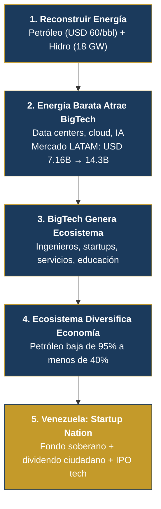

# Venezuela S.A.

> **National Reconstruction Plan v1.0 — March 2026**
>
> *Startup Nation Model: Oil as Fuel, Technology as Destination, Diaspora as Angel Investor*

---

## What Is This Document?

This is not a government plan. It is a **business model** where every Venezuelan is a shareholder. Like any startup, it has funding rounds, a product, and an exit vision.

**The key conceptual shift:** oil is NOT the business. Oil is the **fuel** of the business. The real business is turning Venezuela into a technology powerhouse powered by the cheapest energy on the continent.

## The Key Numbers

| Indicator | Data | Source |
|-----------|------|--------|
| Proven reserves | 303B barrels | [OPEC ASB 2025](https://www.opec.org/assets/assetdb/asb-2025.pdf) |
| Current production | 0.9–1.1M bpd | [OPEC/IEA 2025](https://www.opec.org) |
| 2025 nominal GDP | USD 82.8B | [IMF](https://www.imf.org) |
| Total external debt | USD 150–170B | [Reuters, Dec. 2025](https://www.cnbc.com/2026/01/04/venezuelas-billions-in-distressed-debt-who-is-in-line-to-collect.html) |
| Diaspora | 7.9M people | [UNHCR, Dec. 2025](https://www.unhcr.org/us/emergencies/venezuela-situation) |
| Hydroelectric potential | 18,000 MW (Caroni Cascade) | [Mongabay, 2023](https://news.mongabay.com/2023/08/hydropower-in-the-pan-amazon-the-guri-complex-and-the-caroni-cascade/) |
| Investment to reach 3M bpd | USD 183B over 15 years | [Rystad Energy, Jan. 2026](https://www.rigzone.com/news/could_venezuela_production_get_back_to_3mm_barrels_per_day-08-jan-2026-182716-article/) |
| Plan base price | **USD 60/barrel** (conservative) | [EIA STEO, Mar. 2026](https://www.eia.gov/outlooks/steo/) |

## The Funding Rounds

| Round | Source | Amount | Use | Timeline |
|-------|--------|--------|-----|----------|
| **Pre-Seed** | Diaspora (private initiative) | USD 25–60M | Platforms, census, legal, investment app | Day 1 (does NOT require government) |
| **Seed** | Citizen bonds + forwards | USD 1–5B | Stabilization + energy | Years 1–2 |
| **Series A** | Forward contracts + majors | USD 30–50B | Production to 1.4M bpd + Guri + fiber | Years 2–4 |
| **Series B** | Revenue + BigTech | USD 50–100B | Tech hubs, data centers, tourism | Years 4–8 |
| **IPO** | VIN to international markets | USD 10–30B+ | Tech portfolio listed on stock exchange | Years 8–12 |

## The Energy Funnel

1. **Rebuild energy** (oil + hydro) -- generates revenue and cheap electricity
2. **Cheap energy attracts BigTech** -- Amazon invested [USD 4B in Chile](https://www.mordorintelligence.com/industry-reports/south-america-data-center-market), Google signed the Humboldt cable
3. **BigTech generates an ecosystem** -- engineers, startups, services, education
4. **The ecosystem diversifies the economy** -- oil drops from 95% to <40% of exports

:::info 85+ Verifiable Sources
Every data point has a real, verifiable source. See [Full References](/referencias).
:::

:::caution Base Price USD $60/barrel
The [EIA projects](https://www.eia.gov/outlooks/steo/) Brent at ~$64 average for 2027. Pre-Hormuz crisis it traded at $67–69. Every dollar above $60 is direct upside to the sovereign fund.
:::
